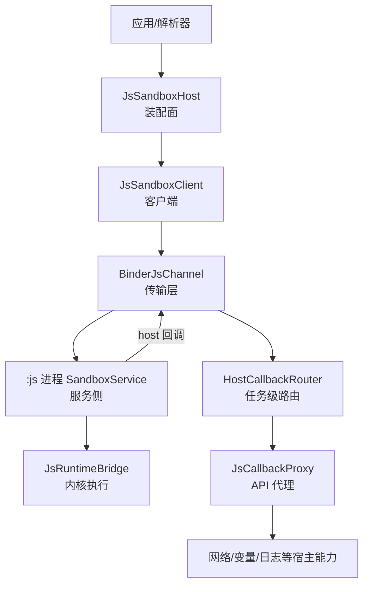
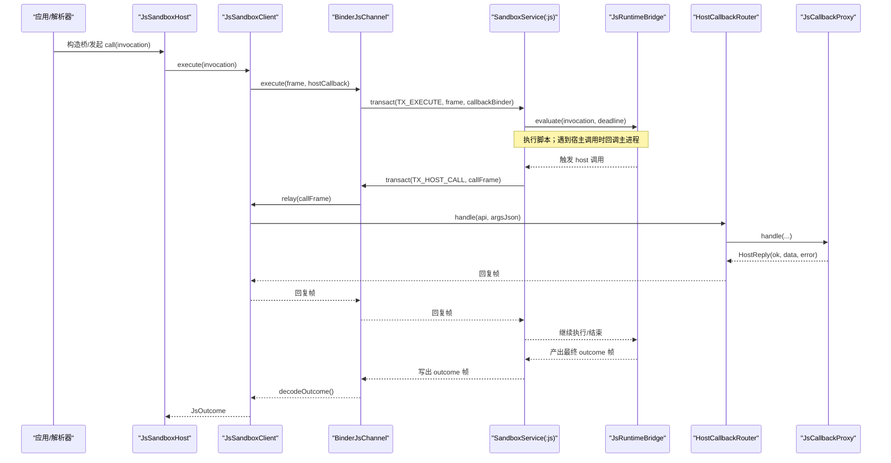
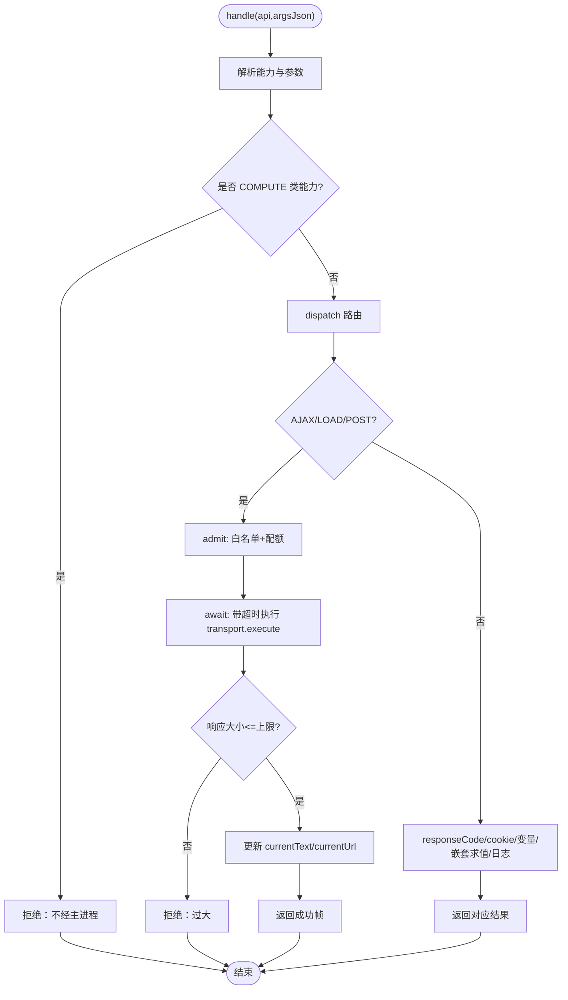
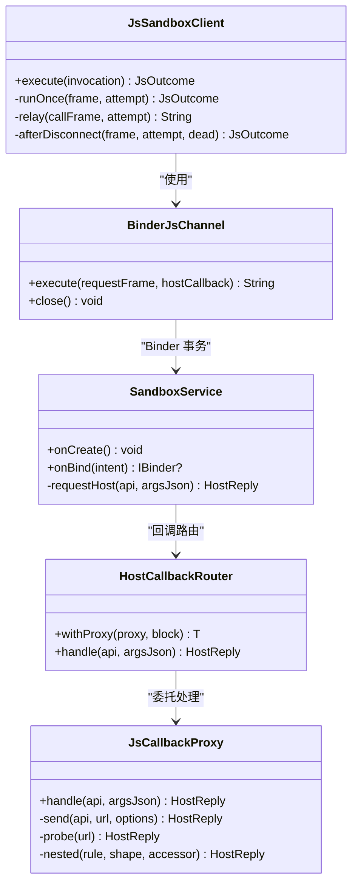

# 进程间通信机制

<cite>
**本文引用的文件**
- [JsSandboxClient.kt](file://lib_book_source/src/main/java/com/ebook/source/sandbox/JsSandboxClient.kt)
- [BinderJsChannel.kt](file://lib_book_source/src/main/java/com/ebook/source/sandbox/BinderJsChannel.kt)
- [SandboxService.kt](file://lib_book_source/src/main/java/com/ebook/source/sandbox/SandboxService.kt)
- [HostCallbackRouter.kt](file://lib_book_source/src/main/java/com/ebook/source/sandbox/HostCallbackRouter.kt)
- [JsCallbackProxy.kt](file://lib_book_source/src/main/java/com/ebook/source/sandbox/JsCallbackProxy.kt)
- [JsChannel.kt](file://lib_book_source/src/main/java/com/ebook/source/sandbox/JsChannel.kt)
- [JsLimits.kt](file://lib_book_source/src/main/java/com/ebook/source/sandbox/JsLimits.kt)
- [JsSandboxHost.kt](file://lib_book_source/src/main/java/com/ebook/source/sandbox/JsSandboxHost.kt)
</cite>

## 目录
1. [简介](#简介)
2. [项目结构](#项目结构)
3. [核心组件](#核心组件)
4. [架构总览](#架构总览)
5. [详细组件分析](#详细组件分析)
6. [依赖关系分析](#依赖关系分析)
7. [性能考虑](#性能考虑)
8. [故障排查指南](#故障排查指南)
9. [结论](#结论)

## 简介
本文面向“主进程与 :js 隔离进程”的进程间通信（IPC）机制，围绕 Binder 协议、客户端与服务端职责、回调路由与异步桥接展开。重点覆盖：
- JsSandboxClient 作为传输策略统一入口的职责边界与重放策略
- BinderJsChannel 对 Binder 事务一帧进一帧出的封装与失败分类
- SandboxService 在 :js 进程中的薄服务层、协议校验与 host 调用回送
- HostCallbackRouter 的任务级回调代理注册/注销与线程安全保证
- JsCallbackProxy 作为异步桥接器，协调 runBlocking、协程集成与取消传播
- 常见异常诊断与性能调优建议

## 项目结构
该 IPC 子系统集中在 lib_book_source 的沙箱模块中，以“客户端—通道—服务—回调路由—代理”分层组织：
- 客户端侧：JsSandboxClient 负责请求编排、限流、超时与重连重放；JsSandboxHost 暴露装配面与任务级桥接构造
- 传输层：JsChannel 抽象 + BinderJsChannel 实现，将字符串帧通过 Binder 事务收发
- 服务端侧：SandboxService 仅做协议校验、转发到执行器桥并回送结果；通过 HostDispatcher 把 host 调用转回主进程
- 回调路由：HostCallbackRouter 维护当前任务的 HostHandler；JsCallbackProxy 提供具体 API 能力与资源限制

图表来源
- [JsSandboxClient.kt:35-185](file://lib_book_source/src/main/java/com/ebook/source/sandbox/JsSandboxClient.kt#L35-L185)
- [BinderJsChannel.kt:20-132](file://lib_book_source/src/main/java/com/ebook/source/sandbox/BinderJsChannel.kt#L20-L132)
- [SandboxService.kt:27-210](file://lib_book_source/src/main/java/com/ebook/source/sandbox/SandboxService.kt#L27-L210)
- [JsCallbackProxy.kt:57-506](file://lib_book_source/src/main/java/com/ebook/source/sandbox/JsCallbackProxy.kt#L57-L506)

章节来源
- [JsSandboxClient.kt:35-185](file://lib_book_source/src/main/java/com/ebook/source/sandbox/JsSandboxClient.kt#L35-L185)
- [BinderJsChannel.kt:20-132](file://lib_book_source/src/main/java/com/ebook/source/sandbox/BinderJsChannel.kt#L20-L132)
- [SandboxService.kt:27-210](file://lib_book_source/src/main/java/com/ebook/source/sandbox/SandboxService.kt#L27-L210)
- [JsCallbackProxy.kt:57-506](file://lib_book_source/src/main/java/com/ebook/source/sandbox/JsCallbackProxy.kt#L57-L506)

## 核心组件
- JsSandboxClient：主进程侧沙箱客户端，唯一执行入口 execute。负责计算截止日期、重放预算、host 回调中继、主线程保护与回调重入保护，并通过 inFlight 锁串行化一次只有一帧在执行器上运行。
- BinderJsChannel：JsChannel 的 Binder 实现。每次 execute 新建反向回调 binder，事务一帧进出，失败分类为“断连可重连”或“协议不合不可重连”。
- SandboxService：:js 进程内唯一 Service，只做协议校验、分发 TX_EXECUTE/TX_PING、把 host 调用经 binder 回主进程，并在 onDestroy 清理状态。
- HostCallbackRouter：任务级回调路由器。withProxy 包裹执行块期间注册临时 HostHandler，退出后自动注销，保证同一时刻只有一个任务在处理回调。
- JsCallbackProxy：主进程侧 host 回调的具体实现。处理 ajax/load/post/responseCode/cookie/变量/嵌套求值等能力，集中限流、超时、大小限制与错误归类。
- JsChannel/JsLimits：通道抽象与统一资源限制（单次执行挂钟、堆/栈、请求/响应/回调帧上限、回调深度、绑定超时、单任务请求次数）。

章节来源
- [JsSandboxClient.kt:35-185](file://lib_book_source/src/main/java/com/ebook/source/sandbox/JsSandboxClient.kt#L35-L185)
- [BinderJsChannel.kt:20-132](file://lib_book_source/src/main/java/com/ebook/source/sandbox/BinderJsChannel.kt#L20-L132)
- [SandboxService.kt:27-210](file://lib_book_source/src/main/java/com/ebook/source/sandbox/SandboxService.kt#L27-L210)
- [HostCallbackRouter.kt:57-76](file://lib_book_source/src/main/java/com/ebook/source/sandbox/HostCallbackRouter.kt#L57-L76)
- [JsCallbackProxy.kt:57-506](file://lib_book_source/src/main/java/com/ebook/source/sandbox/JsCallbackProxy.kt#L57-L506)
- [JsChannel.kt:7-37](file://lib_book_source/src/main/java/com/ebook/source/sandbox/JsChannel.kt#L7-L37)
- [JsLimits.kt:13-58](file://lib_book_source/src/main/java/com/ebook/source/sandbox/JsLimits.kt#L13-L58)

## 架构总览
下图展示一次完整的执行流程：主进程发起 execute，经 Binder 事务发送到 :js 进程，执行器在运行时执行脚本；若脚本需要宿主能力，则通过已写入的反向 binder 回调主进程的 HostCallbackRouter，再落到 JsCallbackProxy 完成网络访问、变量读写等操作，最后返回结果帧。

图表来源
- [JsSandboxClient.kt:65-143](file://lib_book_source/src/main/java/com/ebook/source/sandbox/JsSandboxClient.kt#L65-L143)
- [BinderJsChannel.kt:41-84](file://lib_book_source/src/main/java/com/ebook/source/sandbox/BinderJsChannel.kt#L41-L84)
- [SandboxService.kt:83-123](file://lib_book_source/src/main/java/com/ebook/source/sandbox/SandboxService.kt#L83-L123)
- [JsCallbackProxy.kt:152-239](file://lib_book_source/src/main/java/com/ebook/source/sandbox/JsCallbackProxy.kt#L152-L239)

## 详细组件分析

### JsSandboxClient：客户端执行与重放策略
- 职责边界
  - 计算截止日期（单调时钟），确保跨进程可比
  - 重放策略：仅在本次调用尚未转发过 host 回调时允许重放
  - 中继 host 回调：将执行器需要的两类操作（规则求值、代取 URL）交给 HostHandler，且绝不抛未类型化异常到执行器
  - 自伤防护：禁止主线程执行（避免 ANR）、禁止回调内重入（防止双向死锁）
  - 并发控制：inFlight 锁串行化 execute，保证“同一时刻只有一帧在飞”，为 maxRequestBytes 提供前提
- 关键流程
  - execute：校验主线程→编码请求→大小检查→同步临界区 runOnce→捕获断连与协议异常→必要时 afterDisconnect 重连重放
  - runOnce：复用/新建通道→ch.execute(frame, hostCallback)→decodeOutcome
  - relay：记录已转发次数、深度标记→解码 host 调用→调用 hostHandler→编码回复→超限拦截
- 异常分类
  - ChannelDeadException：断连可重连
  - SandboxProtocolException：协议不匹配，直接上抛给调用方（构建期问题）
  - 其他 Throwable：降级为 UNAVAILABLE 并丢弃通道

章节来源
- [JsSandboxClient.kt:35-185](file://lib_book_source/src/main/java/com/ebook/source/sandbox/JsSandboxClient.kt#L35-L185)
- [JsChannel.kt:23-37](file://lib_book_source/src/main/java/com/ebook/source/sandbox/JsChannel.kt#L23-L37)

### BinderJsChannel：传输层封装与失败分类
- 设计要点
  - 每次 execute 新建 HostCallbackBinder，避免跨次 execute 共享账本导致重放污染
  - 事务协议：写接口标识、协议版本、请求帧、回调 binder；读取时严格 enforceInterface 与版本校验
  - 失败分类：RemoteException（含 DeadObjectException/TransactionTooLargeException）一律视为断连；接口/版本不符视为协议错误
- 反向通道
  - HostCallbackBinder.onTransact 分诊 PING/DUMP/INTERFACE，其余走 TX_HOST_CALL
  - 回调路径同样 enforceInterface + 版本校验，并将 relay 结果写回 reply
- 关闭语义
  - close 幂等，内部 onClose 异常被吞掉，不影响上层处置

章节来源
- [BinderJsChannel.kt:20-132](file://lib_book_source/src/main/java/com/ebook/source/sandbox/BinderJsChannel.kt#L20-L132)

### SandboxService：服务端处理与 host 回送
- 角色定位
  - 薄服务：读 Parcel→判断→写回 Parcel→中继 host 调用；真实策略在 runSandboxTask，内核在 JsRuntimeBridge
  - 线程模型：binder 线程池默认至多 15 条；并发由客户端 inFlight 锁保证，此处不额外排队
- 事务处理
  - handleContractCall：先 enforceInterface，再读版本号，按码分发 TX_EXECUTE/TX_PING
  - handleExecute：设置 currentCallback，执行 runSandboxTask，finally 清理回调
  - handlePing：仅返回 ready 位，不建 runtime
- host 回送
  - requestHost：从 currentCallback 取出回调 binder，encodeHostCall→transact→enforceInterface+版本校验→读帧→二次大小校验→解码 HostReply
  - 任何异常都转换为 ok=false 的 HostReply，避免异常进入 JNI 栈导致 :js 进程崩溃

章节来源
- [SandboxService.kt:27-210](file://lib_book_source/src/main/java/com/ebook/source/sandbox/SandboxService.kt#L27-L210)

### HostCallbackRouter：回调代理的注册与注销
- 工作机制
  - withProxy(proxy, block)：注册 proxy→执行 block→finally 注销，确保同一时刻仅有一个任务代理有效
  - handle：若 current 为空，返回“没有正在进行的脚本任务”的拒绝回复
- 线程安全
  - 当前任务指针用 @Volatile；并发由客户端 inFlight 锁保证“同一时刻只有一帧在飞”，故无需 CAS
  - 若未来放开客户端并发，此处需改为按调用身份分发表

章节来源
- [HostCallbackRouter.kt:57-76](file://lib_book_source/src/main/java/com/ebook/source/sandbox/HostCallbackRouter.kt#L57-L76)

### JsCallbackProxy：异步桥接器与协程集成
- 角色定位
  - 主进程侧受理 host 回调的代理：ajax/load/post/responseCode/cookie/变量/嵌套求值/日志 toast/log
  - 实例作用域=单次解析任务：外呼计数、回调深度、当前页面基准均驻留于此
- 协程与 runBlocking
  - handle 是同步契约（HostHandler），但 dispatch 需要 suspend IO；使用 runBlocking 在 binder 线程上阻塞等待 IO 结果
  - await 使用 withTimeout 保护 binder 线程不被无限占用；真正的连接/读取超时由客户端自身决定
- 取消传播
  - 若底层传输不支持协程取消（如阻塞 Call.execute），withTimeout 只能保护“等待”阶段，不能中断阻塞的网络调用；需在传输层完善 cancel 支持
- 资源限制
  - 准入与限流：admit 先校验白名单与 maxRequestsPerTask，再通过 transport.execute
  - 大小限制：响应超过 maxHostReplyBytes 拒绝并推进失败分支
  - 嵌套求值：depth++/-- 配合 maxCallbackDepth，防止递归过深导致栈溢出
- Cookie 与会话
  - 通过 SourceCookieJar 提供 cookie.get/set/remove，与脚本外呼的客户端共享同一份罐，避免半截会话
- 表单与头
  - post body 对象会排序键生成表单体，保证相同输入产生相同字节序列，利于签名与缓存

图表来源
- [JsCallbackProxy.kt:152-239](file://lib_book_source/src/main/java/com/ebook/source/sandbox/JsCallbackProxy.kt#L152-L239)
- [JsCallbackProxy.kt:241-300](file://lib_book_source/src/main/java/com/ebook/source/sandbox/JsCallbackProxy.kt#L241-L300)
- [JsCallbackProxy.kt:413-430](file://lib_book_source/src/main/java/com/ebook/source/sandbox/JsCallbackProxy.kt#L413-L430)

章节来源
- [JsCallbackProxy.kt:57-506](file://lib_book_source/src/main/java/com/ebook/source/sandbox/JsCallbackProxy.kt#L57-L506)

## 依赖关系分析
- 耦合与内聚
  - JsSandboxClient 高内聚于“执行编排与重放”，依赖 JsChannel 抽象，屏蔽 Android 细节
  - BinderJsChannel 低耦合于具体 Binder 事务，失败分类清晰
  - SandboxService 薄封装，策略下沉至 runSandboxTask 与 JsRuntimeBridge
  - HostCallbackRouter 与 JsCallbackProxy 解耦：前者管任务级上下文，后者管能力与限制
- 外部依赖
  - OkHttp/ScriptTransport：网络访问，需通过 GuardedNetwork 派生客户端，确保 DNS/cookie 一致
  - Logger：统一日志出口，便于调试与生产裁剪
- 潜在环与风险
  - 客户端 inFlight 锁是关键不变量，若放开并发，HostCallbackRouter 必须升级为按调用身份分发
  - 回调路径异常必须被吞掉并转为 ok=false，否则 :js 进程崩溃

图表来源
- [JsSandboxClient.kt:35-185](file://lib_book_source/src/main/java/com/ebook/source/sandbox/JsSandboxClient.kt#L35-L185)
- [BinderJsChannel.kt:20-132](file://lib_book_source/src/main/java/com/ebook/source/sandbox/BinderJsChannel.kt#L20-L132)
- [SandboxService.kt:27-210](file://lib_book_source/src/main/java/com/ebook/source/sandbox/SandboxService.kt#L27-L210)
- [HostCallbackRouter.kt:57-76](file://lib_book_source/src/main/java/com/ebook/source/sandbox/HostCallbackRouter.kt#L57-L76)
- [JsCallbackProxy.kt:57-506](file://lib_book_source/src/main/java/com/ebook/source/sandbox/JsCallbackProxy.kt#L57-L506)

章节来源
- [JsSandboxClient.kt:35-185](file://lib_book_source/src/main/java/com/ebook/source/sandbox/JsSandboxClient.kt#L35-L185)
- [BinderJsChannel.kt:20-132](file://lib_book_source/src/main/java/com/ebook/source/sandbox/BinderJsChannel.kt#L20-L132)
- [SandboxService.kt:27-210](file://lib_book_source/src/main/java/com/ebook/source/sandbox/SandboxService.kt#L27-L210)
- [HostCallbackRouter.kt:57-76](file://lib_book_source/src/main/java/com/ebook/source/sandbox/HostCallbackRouter.kt#L57-L76)
- [JsCallbackProxy.kt:57-506](file://lib_book_source/src/main/java/com/ebook/source/sandbox/JsCallbackProxy.kt#L57-L506)

## 性能考虑
- 连接复用
  - 客户端维持 channel 引用，断连才重建；避免频繁 bind/unbind
  - JsCallbackProxy 的网络访问通过 GuardedNetwork 派生客户端，共享连接池与线程池，减少握手开销
- 批量传输
  - 当前协议“一帧一事务”，适合小帧；对于大页面，尽量在脚本侧聚合后再回调主进程，减少往返
  - 利用 setContent 将中间结果落盘到 currentText，后续规则直接基于内存文本，避免重复网络
- 内存优化
  - 严格的大小上限：maxRequestBytes/maxHostReplyBytes/maxOutcomeBytes，防止 binder 缓冲爆炸
  - 响应过大直接拒绝，避免在主进程堆积大字符串
  - 回调深度限制 maxCallbackDepth，避免递归解析造成栈增长
- 超时与限流
  - 挂钟上限 wallClockMs 用于单次执行与 await 超时，避免 binder 线程长期占用
  - 单任务请求次数 maxRequestsPerTask 防恶意循环请求
- 序列化与字符集
  - 表单体按键排序，保证确定性；请求/响应按 charset 显式解码，避免乱码导致的重传与重试

[本节为通用性能指导，不直接分析特定文件]

## 故障排查指南
- 连接超时
  - 现象：execute 长时间无响应或报不可用
  - 排查：确认 SandboxService.isInIsolatedProcess 为真；检查 bindTimeoutMs 是否过小；查看日志中“沙箱事务失败，通道判死”
  - 参考位置：[SandboxService.kt:147-153](file://lib_book_source/src/main/java/com/ebook/source/sandbox/SandboxService.kt#L147-L153)、[BinderJsChannel.kt:50-64](file://lib_book_source/src/main/java/com/ebook/source/sandbox/BinderJsChannel.kt#L50-L64)
- 事务过大
  - 现象：TransactionTooLargeException 或“请求超出字节上限”
  - 排查：检查 maxRequestBytes/maxHostReplyBytes；拆分大页面或在脚本侧压缩
  - 参考位置：[JsSandboxClient.kt:74-80](file://lib_book_source/src/main/java/com/ebook/source/sandbox/JsSandboxClient.kt#L74-L80)、[JsLimits.kt:27-42](file://lib_book_source/src/main/java/com/ebook/source/sandbox/JsLimits.kt#L27-L42)
- 回调丢失
  - 现象：脚本调用 host 能力后无响应
  - 排查：确认 HostCallbackRouter.current 是否已设置；检查 onTransact 是否收到 TX_HOST_CALL；查看协议版本与接口标识
  - 参考位置：[HostCallbackRouter.kt:57-76](file://lib_book_source/src/main/java/com/ebook/source/sandbox/HostCallbackRouter.kt#L57-L76)、[BinderJsChannel.kt:93-132](file://lib_book_source/src/main/java/com/ebook/source/sandbox/BinderJsChannel.kt#L93-L132)
- 协议版本不合
  - 现象：明确报“协议版本不合”
  - 排查：两侧代码不同步（.so 与 Kotlin 非同构建）；重新构建并安装；不要降级为不可用
  - 参考位置：[BinderJsChannel.kt:73-84](file://lib_book_source/src/main/java/com/ebook/source/sandbox/BinderJsChannel.kt#L73-L84)、[SandboxService.kt:63-81](file://lib_book_source/src/main/java/com/ebook/source/sandbox/SandboxService.kt#L63-L81)
- 嵌套执行与死锁
  - 现象：回调内再次发起 execute 导致卡死
  - 排查：insideHostCall 深度守卫；避免在回调中再发起 JS 执行
  - 参考位置：[JsSandboxClient.kt:65-73](file://lib_book_source/src/main/java/com/ebook/source/sandbox/JsSandboxClient.kt#L65-L73)、[JsCallbackProxy.kt:413-430](file://lib_book_source/src/main/java/com/ebook/source/sandbox/JsCallbackProxy.kt#L413-L430)

章节来源
- [BinderJsChannel.kt:50-84](file://lib_book_source/src/main/java/com/ebook/source/sandbox/BinderJsChannel.kt#L50-L84)
- [SandboxService.kt:63-123](file://lib_book_source/src/main/java/com/ebook/source/sandbox/SandboxService.kt#L63-L123)
- [JsSandboxClient.kt:65-80](file://lib_book_source/src/main/java/com/ebook/source/sandbox/JsSandboxClient.kt#L65-L80)
- [JsLimits.kt:27-42](file://lib_book_source/src/main/java/com/ebook/source/sandbox/JsLimits.kt#L27-L42)
- [HostCallbackRouter.kt:57-76](file://lib_book_source/src/main/java/com/ebook/source/sandbox/HostCallbackRouter.kt#L57-L76)

## 结论
该 IPC 子系统以“客户端—通道—服务—回调路由—代理”的分层设计实现了主进程与 :js 隔离进程之间的可靠通信。关键点包括：
- 严格的协议校验与失败分类，确保可重连与可诊断
- 任务级回调路由与代理，避免跨任务状态泄漏
- 多层大小限制与超时保护，保障进程稳定与用户体验
- 明确的线程模型与并发约束，防止死锁与资源竞争
建议在后续迭代中完善传输层的协程取消支持、扩大批量化场景测试，并持续监控 binder 缓冲与内存峰值，进一步优化吞吐与稳定性。