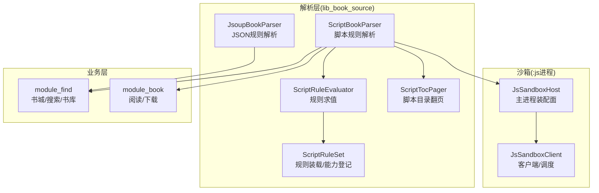
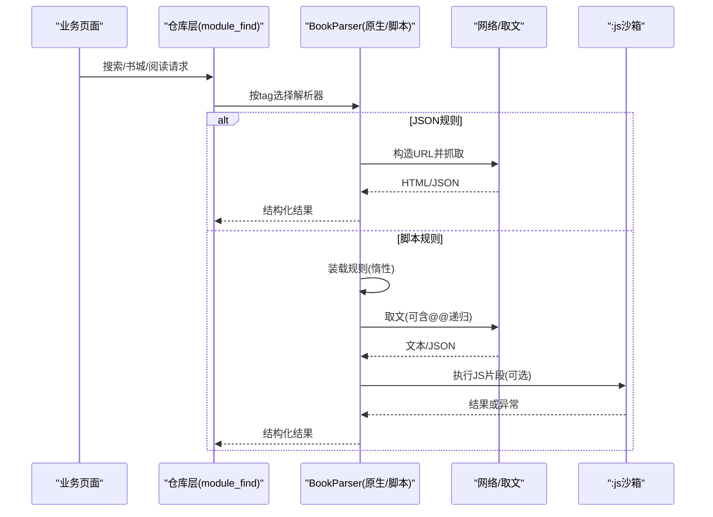
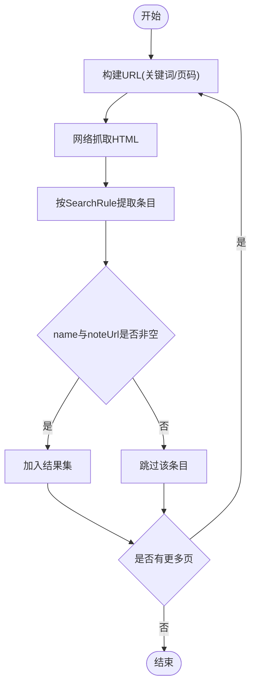
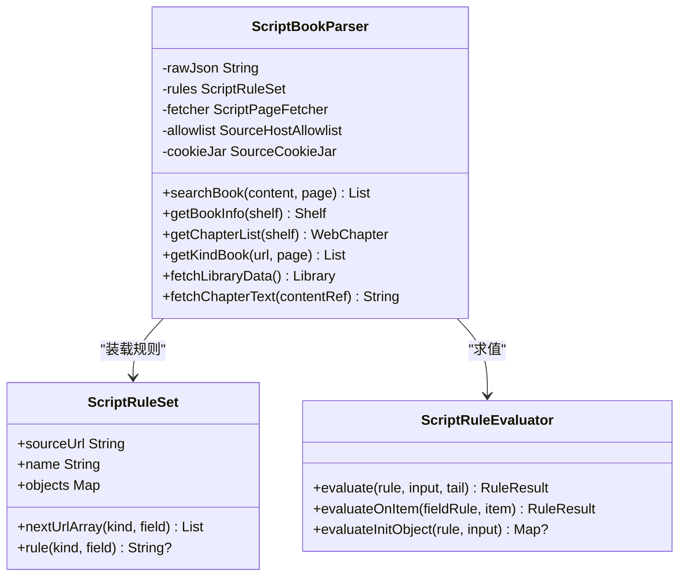
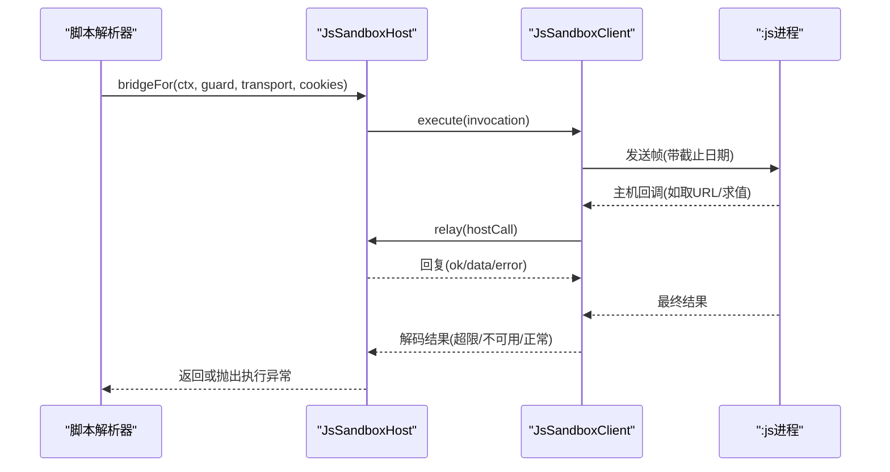
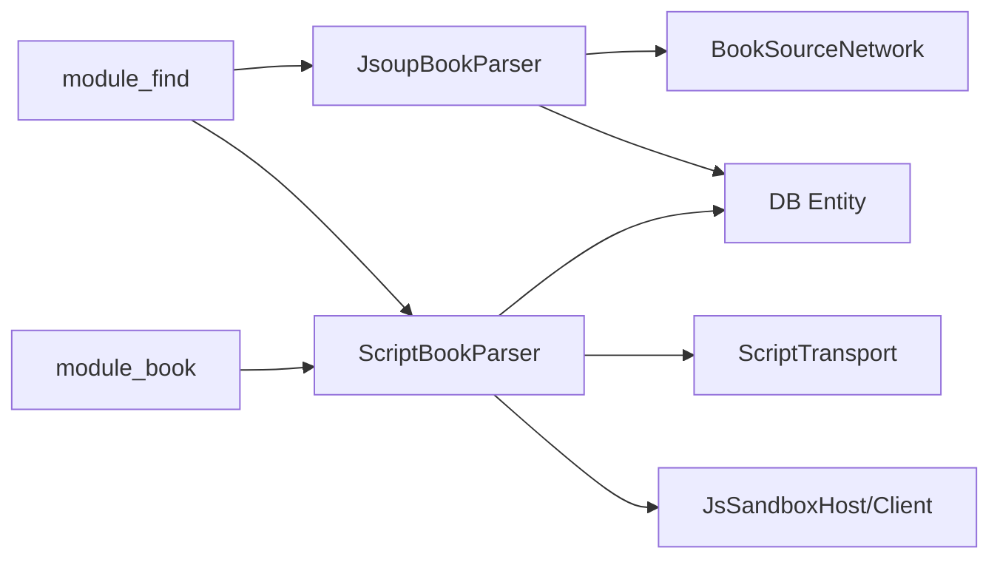

# 书源系统

<cite>
**本文引用的文件**
- [BookParser.kt](file://lib_book_source/src/main/java/com/ebook/source/analyze/BookParser.kt)
- [JsoupBookParser.kt](file://lib_book_source/src/main/java/com/ebook/source/analyze/JsoupBookParser.kt)
- [ScriptBookParser.kt](file://lib_book_source/src/main/java/com/ebook/source/analyze/ScriptBookParser.kt)
- [ScriptRuleSet.kt](file://lib_book_source/src/main/java/com/ebook/source/script/ScriptRuleSet.kt)
- [ScriptRuleEvaluator.kt](file://lib_book_source/src/main/java/com/ebook/source/script/ScriptRuleEvaluator.kt)
- [ScriptTocPager.kt](file://lib_book_source/src/main/java/com/ebook/source/script/ScriptTocPager.kt)
- [JsSandboxHost.kt](file://lib_book_source/src/main/java/com/ebook/source/sandbox/JsSandboxHost.kt)
- [JsSandboxClient.kt](file://lib_book_source/src/main/java/com/ebook/source/sandbox/JsSandboxClient.kt)
</cite>

## 目录
1. [简介](#简介)
2. [项目结构](#项目结构)
3. [核心组件](#核心组件)
4. [架构总览](#架构总览)
5. [详细组件分析](#详细组件分析)
6. [依赖关系分析](#依赖关系分析)
7. [性能与缓存策略](#性能与缓存策略)
8. [故障恢复与调试指南](#故障恢复与调试指南)
9. [结论](#结论)
10. [附录：规则编写示例与常见类型处理](#附录规则编写示例与常见类型处理)

## 简介
本技术文档面向“书源系统”，聚焦于解析引擎的架构设计、规则规范（JSON 规则与脚本规则）、多书源共存机制、默认源计算与权重策略、JavaScript 沙箱执行器的安全机制、动态加载机制（热重载、版本管理、错误处理），以及 TXT/EPUB/HTML 等常见书源类型的处理逻辑与性能优化、故障恢复策略。

## 项目结构
- lib_book_source：书源解析专用层，包含原生 JSON 规则解析器（基于 Jsoup）与脚本规则解析器（词法/求值/取文 + `:js` 沙箱执行器）。
- lib_ebook_api / lib_ebook_db：网络与数据实体层，被解析层作为依赖。
- module_find / module_book / module_me：业务模块负责书城搜索、阅读与设置等上层编排。

**图表来源**
- [JsoupBookParser.kt:23-236](file://lib_book_source/src/main/java/com/ebook/source/analyze/JsoupBookParser.kt#L23-L236)
- [ScriptBookParser.kt:38-468](file://lib_book_source/src/main/java/com/ebook/source/analyze/ScriptBookParser.kt#L38-L468)
- [ScriptRuleEvaluator.kt:1-367](file://lib_book_source/src/main/java/com/ebook/source/script/ScriptRuleEvaluator.kt#L1-L367)
- [ScriptRuleSet.kt:1-286](file://lib_book_source/src/main/java/com/ebook/source/script/ScriptRuleSet.kt#L1-L286)
- [ScriptTocPager.kt:1-83](file://lib_book_source/src/main/java/com/ebook/source/script/ScriptTocPager.kt#L1-L83)
- [JsSandboxHost.kt:1-60](file://lib_book_source/src/main/java/com/ebook/source/sandbox/JsSandboxHost.kt#L1-L60)
- [JsSandboxClient.kt:1-185](file://lib_book_source/src/main/java/com/ebook/source/sandbox/JsSandboxClient.kt#L1-L185)

**章节来源**
- [BookParser.kt:8-30](file://lib_book_source/src/main/java/com/ebook/source/analyze/BookParser.kt#L8-L30)
- [JsoupBookParser.kt:23-236](file://lib_book_source/src/main/java/com/ebook/source/analyze/JsoupBookParser.kt#L23-L236)
- [ScriptBookParser.kt:38-468](file://lib_book_source/src/main/java/com/ebook/source/analyze/ScriptBookParser.kt#L38-L468)

## 核心组件
- BookParser：统一解析接口，定义搜索、详情、目录、发现分类、书库首屏五面能力；书库首屏为纯网络解析，不碰缓存。
- JsoupBookParser：基于 JSON 规则的原生解析器，使用 Jsoup 选择器与模板渲染，提供列表分页与目录分页能力。
- ScriptBookParser：脚本规则解析器，将规则装载、求值、取文、正文翻页串联为统一接口；惰性装载规则，首次求值时才解析 JSON。
- ScriptRuleSet：脚本规则装载视图，负责能力检测、不支持项登记、URL 数组展开与 source 绑定 JSON。
- ScriptRuleEvaluator：规则求值入口，实现插值、链式/CSS/正则/JSONPath/JS 分支、组合符、替换段与选项尾段回附。
- ScriptTocPager：脚本目录翻页器，终止策略与上限与原生 TocPager 对齐。
- JsSandboxHost/JsSandboxClient：`:js` 沙箱的主进程侧装配与客户端，负责隔离执行、回调中继、资源限制与重连重放。

**章节来源**
- [BookParser.kt:8-30](file://lib_book_source/src/main/java/com/ebook/source/analyze/BookParser.kt#L8-L30)
- [JsoupBookParser.kt:23-236](file://lib_book_source/src/main/java/com/ebook/source/analyze/JsoupBookParser.kt#L23-L236)
- [ScriptBookParser.kt:38-468](file://lib_book_source/src/main/java/com/ebook/source/analyze/ScriptBookParser.kt#L38-L468)
- [ScriptRuleSet.kt:1-286](file://lib_book_source/src/main/java/com/ebook/source/script/ScriptRuleSet.kt#L1-L286)
- [ScriptRuleEvaluator.kt:1-367](file://lib_book_source/src/main/java/com/ebook/source/script/ScriptRuleEvaluator.kt#L1-L367)
- [ScriptTocPager.kt:1-83](file://lib_book_source/src/main/java/com/ebook/source/script/ScriptTocPager.kt#L1-L83)
- [JsSandboxHost.kt:1-60](file://lib_book_source/src/main/java/com/ebook/source/sandbox/JsSandboxHost.kt#L1-L60)
- [JsSandboxClient.kt:1-185](file://lib_book_source/src/main/java/com/ebook/source/sandbox/JsSandboxClient.kt#L1-L185)

## 架构总览
书源系统采用“双解析器 + 统一接口”的架构：JSON 规则解析器用于稳定站点快速适配；脚本规则解析器用于复杂站点与动态内容。两者均实现 BookParser，业务层通过 URL tag 路由到对应解析器，天然支持多书源共存。

**图表来源**
- [JsoupBookParser.kt:39-236](file://lib_book_source/src/main/java/com/ebook/source/analyze/JsoupBookParser.kt#L39-L236)
- [ScriptBookParser.kt:183-468](file://lib_book_source/src/main/java/com/ebook/source/analyze/ScriptBookParser.kt#L183-L468)
- [ScriptRuleEvaluator.kt:20-41](file://lib_book_source/src/main/java/com/ebook/source/script/ScriptRuleEvaluator.kt#L20-L41)
- [JsSandboxHost.kt:21-60](file://lib_book_source/src/main/java/com/ebook/source/sandbox/JsSandboxHost.kt#L21-L60)
- [JsSandboxClient.kt:65-99](file://lib_book_source/src/main/java/com/ebook/source/sandbox/JsSandboxClient.kt#L65-L99)

## 详细组件分析

### JSON 规则解析器（JsoupBookParser）
- 搜索：URL 模板拼接关键词与页码，表单体参数替换，调用网络后以 SearchRule 选择元素提取字段。
- 详情：解析详情页，填充名称、作者、简介、封面、目录 URL，支持简介/作者前缀清理。
- 目录：使用 TocPager 从 tocUrl 逐页抓取，支持选择器下一页与模板推算两种模式，去重与上限保护。
- 发现分类：按 ruleFind.kinds 逐类抓首页，失败返回空区块不影响其他分类。
- 书库首屏：纯网络解析，不碰缓存，按 kinds 拼装 LibraryEntity。

**图表来源**
- [JsoupBookParser.kt:39-98](file://lib_book_source/src/main/java/com/ebook/source/analyze/JsoupBookParser.kt#L39-L98)
- [JsoupBookParser.kt:138-162](file://lib_book_source/src/main/java/com/ebook/source/analyze/JsoupBookParser.kt#L138-L162)
- [JsoupBookParser.kt:164-236](file://lib_book_source/src/main/java/com/ebook/source/analyze/JsoupBookParser.kt#L164-L236)

**章节来源**
- [JsoupBookParser.kt:39-236](file://lib_book_source/src/main/java/com/ebook/source/analyze/JsoupBookParser.kt#L39-L236)

### 脚本规则解析器（ScriptBookParser）
- 惰性装载：构造仅保存原始 JSON，首次求值才解析；坏 JSON 在求值期抛类型化异常，避免构造期异常影响缓存契约。
- 取文链路：searchUrl/exploreUrl/ruleContent 等通过 ScriptPageFetcher 取文，支持 @@ 递归求值与 baseUrl 推进。
- 详情链路：init 预处理（AllInOne 首个匹配或 JS 对象键映射），字段按规则求值并落位，tocUrl 为空时回落详情页。
- 目录链路：ScriptTocPager 驱动 nextTocUrl 字符串规则/URL 数组，终止策略与上限与原生对齐。
- 发现链路：exploreUrl 条目切分后逐分类抓首页，失败按空块计入。
- 正文链路：按 ruleContent 逐页抓取拼接，终止条件与目录不同（无 contentRef 去重，靠空/null、回环与上限判定），replaceRegex 净化整章。

**图表来源**
- [ScriptBookParser.kt:38-468](file://lib_book_source/src/main/java/com/ebook/source/analyze/ScriptBookParser.kt#L38-L468)
- [ScriptRuleSet.kt:1-286](file://lib_book_source/src/main/java/com/ebook/source/script/ScriptRuleSet.kt#L1-L286)
- [ScriptRuleEvaluator.kt:1-367](file://lib_book_source/src/main/java/com/ebook/source/script/ScriptRuleEvaluator.kt#L1-L367)

**章节来源**
- [ScriptBookParser.kt:38-468](file://lib_book_source/src/main/java/com/ebook/source/analyze/ScriptBookParser.kt#L38-L468)
- [ScriptRuleSet.kt:1-286](file://lib_book_source/src/main/java/com/ebook/source/script/ScriptRuleSet.kt#L1-L286)
- [ScriptRuleEvaluator.kt:1-367](file://lib_book_source/src/main/java/com/ebook/source/script/ScriptRuleEvaluator.kt#L1-L367)

### JavaScript 沙箱执行器（:js）
- 隔离环境：通过独立进程运行 QuickJS，主进程侧由 JsSandboxHost 装配桥接与资源限制；未装配则 JS 段报“待执行”。
- 权限控制：脚本外呼经 GuardedNetwork 派生客户端，host 白名单由规则原文导出；不允许直接 new OkHttpClient 绕过限制。
- 资源限制：JsLimits 限制请求大小、超时等；客户端串行执行，防止并发抢占；禁止主线程调用以防 ANR。
- 重连重放：断连时若本次尚未产生副作用，则重连并重放一次；已转发过 host 回调则不再重放以避免重复请求。

**图表来源**
- [JsSandboxHost.kt:21-60](file://lib_book_source/src/main/java/com/ebook/source/sandbox/JsSandboxHost.kt#L21-L60)
- [JsSandboxClient.kt:65-185](file://lib_book_source/src/main/java/com/ebook/source/sandbox/JsSandboxClient.kt#L65-L185)

**章节来源**
- [JsSandboxHost.kt:1-60](file://lib_book_source/src/main/java/com/ebook/source/sandbox/JsSandboxHost.kt#L1-L60)
- [JsSandboxClient.kt:1-185](file://lib_book_source/src/main/java/com/ebook/source/sandbox/JsSandboxClient.kt#L1-L185)

### 默认源计算与多书源共存
- 多书源共存：每条书通过 tag 绑定归属源，解析一律跟随 bookSourceManager.getParserFor(url)，避免全局默认源导致的串站风险。
- 默认源载体：SourceDefinition 密封类型，区分 Native（带规则）与 Script（带原文+展示信息）；默认源每次由 defaultFromRows(Room 行) 现算，SP 仅记录用户上次主动选择的源。
- 书城显示：首帧 Unknown 留空，Room 答复后落定；零源与有源但解析失败分别处理，避免误导用户启用坏源。

**章节来源**
- [BookParser.kt:8-30](file://lib_book_source/src/main/java/com/ebook/source/analyze/BookParser.kt#L8-L30)
- [ScriptBookParser.kt:183-468](file://lib_book_source/src/main/java/com/ebook/source/analyze/ScriptBookParser.kt#L183-L468)

## 依赖关系分析
- 解析层对网络与数据库实体存在依赖：JsoupBookParser 使用 BookSourceNetwork 与 JsoupHelper；ScriptBookParser 通过 ScriptTransport/OkHttpScriptTransport 进行取文，并通过 JsSandboxHost/Client 与 :js 进程交互。
- 业务层与解析层的耦合点集中在 BookParser 五面接口；书库缓存策略位于 module_find 的 BookSourceRepository，解析器不触碰缓存。

**图表来源**
- [JsoupBookParser.kt:23-236](file://lib_book_source/src/main/java/com/ebook/source/analyze/JsoupBookParser.kt#L23-L236)
- [ScriptBookParser.kt:38-468](file://lib_book_source/src/main/java/com/ebook/source/analyze/ScriptBookParser.kt#L38-L468)

**章节来源**
- [JsoupBookParser.kt:23-236](file://lib_book_source/src/main/java/com/ebook/source/analyze/JsoupBookParser.kt#L23-L236)
- [ScriptBookParser.kt:38-468](file://lib_book_source/src/main/java/com/ebook/source/analyze/ScriptBookParser.kt#L38-L468)

## 性能与缓存策略
- 列表/目录分页：
  - 列表页首页裁剪：当模板以 /{{page}} 结尾且换算后等于起始页时，去掉页码段，避免 404。
  - 目录分页：支持选择器下一页与模板推算，跨页 contentRef 去重，零新增即到底，触顶截断（20,000 章）。
- 正文分页：
  - 章节分页判定基于 ChapterPageMatcher，只对候选链接剥一次分页后缀再比对，避免串章。
  - 正文翻页终止条件不同于目录：无去重语义，靠空/null、回环与上限判定。
- 缓存策略：
  - 书库首屏缓存策略（TTL、SWR、下拉强刷）位于 module_find 的 BookSourceRepository；解析器 fetchLibraryData 纯网络解析，不碰缓存。
  - 章节更新检查限频落在 book_info.final_refresh_data，避免频繁刷新。

**章节来源**
- [JsoupBookParser.kt:244-336](file://lib_book_source/src/main/java/com/ebook/source/analyze/JsoupBookParser.kt#L244-L336)
- [JsoupBookParser.kt:338-500](file://lib_book_source/src/main/java/com/ebook/source/analyze/JsoupBookParser.kt#L338-L500)
- [ScriptTocPager.kt:1-83](file://lib_book_source/src/main/java/com/ebook/source/script/ScriptTocPager.kt#L1-L83)
- [ScriptBookParser.kt:450-468](file://lib_book_source/src/main/java/com/ebook/source/analyze/ScriptBookParser.kt#L450-L468)

## 故障恢复与调试指南
- 解析失败：
  - JSON 规则解析失败记录日志并返回空列表；书库分类抓取失败按空块计入，整体失败由调用方拒绝回写缓存。
  - 脚本规则装载失败在首次求值抛类型化异常，消息含“脚本书源 JSON 无法解析”，便于定位。
- 沙箱异常：
  - 未装配沙箱：JS 段报“需脚本沙箱执行器”；真跑失败抛 JsExecutionFailedException 带内核原文。
  - 通道断连：若本次尚未产生副作用，重连重放一次；已转发回调则不再重放。
- 调试方法：
  - 观察日志 TAG：JsoupBookParser[源名]、ScriptBookParser[源名]，关注 URL、方法、解析结果数量。
  - 校验 URL 模板与分页：确保 {{page}} 正确渲染，首页不带页码段。
  - 沙箱调试：确认主线程未调用、资源限制未触发、host 白名单覆盖目标域名。

**章节来源**
- [JsoupBookParser.kt:39-236](file://lib_book_source/src/main/java/com/ebook/source/analyze/JsoupBookParser.kt#L39-L236)
- [ScriptBookParser.kt:183-468](file://lib_book_source/src/main/java/com/ebook/source/analyze/ScriptBookParser.kt#L183-L468)
- [JsSandboxClient.kt:65-185](file://lib_book_source/src/main/java/com/ebook/source/sandbox/JsSandboxClient.kt#L65-L185)

## 结论
书源系统通过“JSON 规则 + 脚本规则”的双解析器架构，实现了多书源共存与灵活适配；默认源计算与缓存策略解耦于解析层，保证书城与阅读的稳定性；:js 沙箱提供安全的脚本执行环境，具备完善的权限控制与资源限制。整体设计兼顾性能、可维护性与可扩展性。

## 附录：规则编写示例与常见类型处理
- JSON 规则（HTML 站点）：
  - 搜索：配置 searchUrl、searchBody、SearchRule（list/name/author/bookUrl/coverUrl）。
  - 目录：配置 TocRule（list/name/url），支持 nextPage/pageUrl 分页。
  - 详情：配置 ruleBookInfo（name/author/intro/coverUrl/tocUrl），支持前缀清理与反向目录。
- 脚本规则（复杂站点）：
  - 搜索/发现：配置 searchUrl/exploreUrl，使用规则链/正则/JSONPath 提取字段。
  - 目录：配置 ruleToc.chapterList/chapterUrl/name，nextTocUrl 可为字符串规则或 URL 数组。
  - 正文：配置 ruleContent.content/nextContentUrl/replaceRegex，按页拼接并净化。
- 常见类型处理：
  - HTML：优先使用 JSON 规则；复杂站点切换脚本规则。
  - TXT：利用脚本规则的 AllInOne 正则与 init 预处理，分段提取多字段。
  - EPUB：通常走本地导入流程，不在书源解析范围内；如需在线 EPUB 解析，建议在脚本规则中封装 EPUB 解析库（受限于沙箱能力）。

**章节来源**
- [JsoupBookParser.kt:39-236](file://lib_book_source/src/main/java/com/ebook/source/analyze/JsoupBookParser.kt#L39-L236)
- [ScriptBookParser.kt:183-468](file://lib_book_source/src/main/java/com/ebook/source/analyze/ScriptBookParser.kt#L183-L468)
- [ScriptRuleEvaluator.kt:20-41](file://lib_book_source/src/main/java/com/ebook/source/script/ScriptRuleEvaluator.kt#L20-L41)