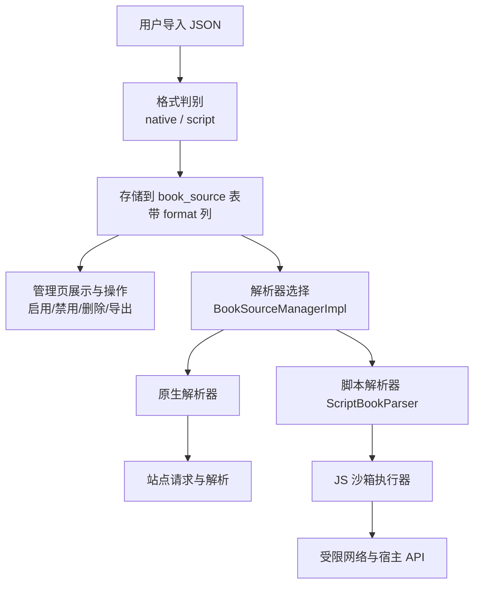
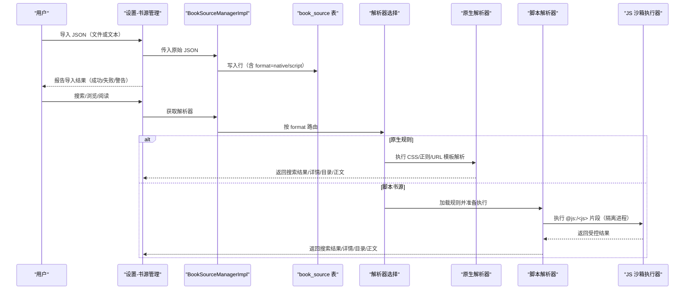
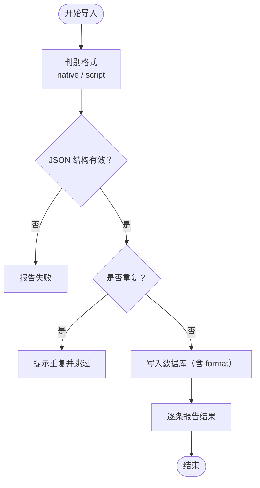
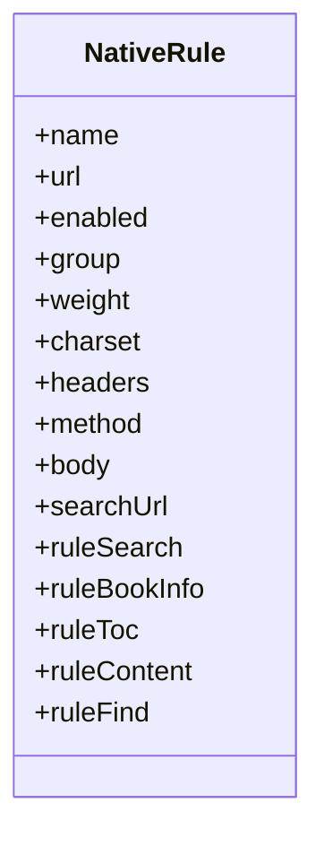
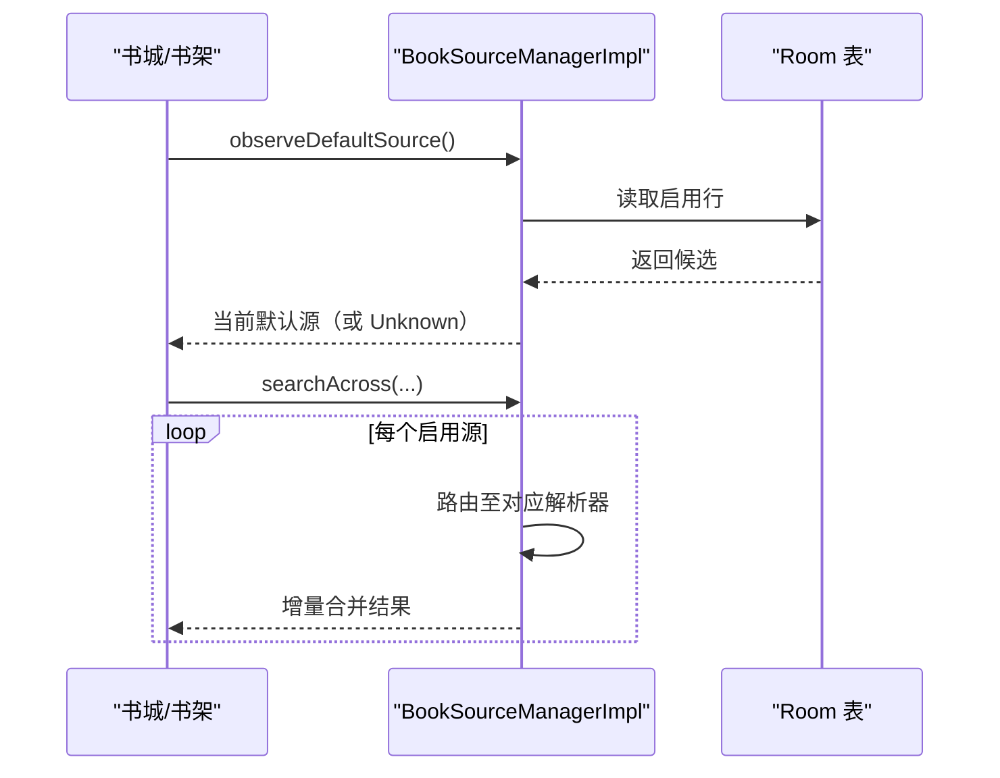
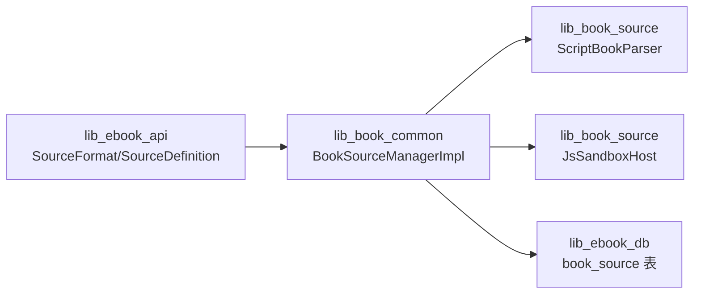

# 书源规则说明文档

<cite>
**本文引用的文件**
- [docs/book-source-rules.md](file://docs/book-source-rules.md)
- [docs/adr/0029-script-book-source-import.md](file://docs/adr/0029-script-book-source-import.md)
- [docs/adr/0028-untrusted-js-sandbox.md](file://docs/adr/0028-untrusted-js-sandbox.md)
- [lib_ebook_api/src/main/java/com/ebook/api/entity/SourceFormat.kt](file://lib_ebook_api/src/main/java/com/ebook/api/entity/SourceFormat.kt)
- [lib_book_common/src/main/java/com/ebook/common/analyze/source/BookSourceManagerImpl.kt](file://lib_book_common/src/main/java/com/ebook/common/analyze/source/BookSourceManagerImpl.kt)
- [lib_book_common/src/main/java/com/ebook/common/analyze/source/BookSourceItem.kt](file://lib_book_common/src/main/java/com/ebook/common/analyze/source/BookSourceItem.kt)
- [lib_book_source/src/main/java/com/ebook/source/analyze/ScriptBookParser.kt](file://lib_book_source/src/main/java/com/ebook/source/analyze/ScriptBookParser.kt)
- [lib_ebook_db/src/main/java/com/ebook/db/di/DatabaseModule.kt](file://lib_ebook_db/src/main/java/com/ebook/db/di/DatabaseModule.kt)
- [README.MD](file://README.MD)
</cite>

## 目录
1. [引言](#引言)
2. [项目结构](#项目结构)
3. [核心组件](#核心组件)
4. [架构总览](#架构总览)
5. [详细组件分析](#详细组件分析)
6. [依赖关系分析](#依赖关系分析)
7. [性能与容量](#性能与容量)
8. [故障排查指南](#故障排查指南)
9. [结论](#结论)
10. [附录](#附录)

## 引言
本说明文档面向用户与贡献者，系统阐述书源的概念、两种格式（原生规则与脚本书源）、导入与管理方式、常见问题解答，并给出与实现相关的架构要点，帮助读者理解“如何从网站抓取内容”的规则体系以及它在应用中的落地方式。

## 项目结构
本项目为多模块 Android 工程，书源能力横跨多个模块：
- 文档层：书源规则说明位于 docs/book-source-rules.md，相关架构决策记录位于 docs/adr/0028、0029 等。
- API 层：定义书源格式枚举与默认源载体（SourceFormat、SourceDefinition）。
- 通用逻辑层：书源管理器（BookSourceManagerImpl）负责解析器选择、默认源计算与双后端分发。
- 解析层：原生解析器与脚本解析器（ScriptBookParser）分别处理两类规则。
- 数据库层：book_source 表增加 format 列用于区分来源格式，并提供迁移链。
- 应用入口与引导：README 中强调应用不随包携带任何书源，全部由用户导入。



**图表来源**
- [docs/book-source-rules.md:30-55](file://docs/book-source-rules.md#L30-L55)
- [lib_ebook_db/src/main/java/com/ebook/db/di/DatabaseModule.kt:130-146](file://lib_ebook_db/src/main/java/com/ebook/db/di/DatabaseModule.kt#L130-L146)
- [lib_book_common/src/main/java/com/ebook/common/analyze/source/BookSourceManagerImpl.kt:336-342](file://lib_book_common/src/main/java/com/ebook/common/analyze/source/BookSourceManagerImpl.kt#L336-L342)
- [lib_book_source/src/main/java/com/ebook/source/analyze/ScriptBookParser.kt](file://lib_book_source/src/main/java/com/ebook/source/analyze/ScriptBookParser.kt)
- [docs/adr/0028-untrusted-js-sandbox.md:14-38](file://docs/adr/0028-untrusted-js-sandbox.md#L14-L38)

**章节来源**
- [README.MD:15-21](file://README.MD#L15-L21)
- [docs/book-source-rules.md:19-55](file://docs/book-source-rules.md#L19-L55)

## 核心组件
- 书源格式枚举与默认源载体：SourceFormat、SourceDefinition（API 层），用于统一表达 native/script 两种出身。
- 书源管理器：BookSourceManagerImpl 将行数据转换为 SourceDefinition，并按 format 路由到相应求值路径；同时提供默认源计算、观察与切换。
- 脚本解析器：ScriptBookParser 实现脚本规则的解析与执行，含对 JS 片段与 URL/JSONPath 链式规则的支持。
- 数据库迁移：v5→v6 在 book_source 表新增 format 列，存量行默认 native，确保兼容升级。
- 导入与识别：导入时根据 JSON 顶层键自动判别格式；支持本地文件与文本粘贴的批量导入。

**章节来源**
- [lib_ebook_api/src/main/java/com/ebook/api/entity/SourceFormat.kt:4-26](file://lib_ebook_api/src/main/java/com/ebook/api/entity/SourceFormat.kt#L4-L26)
- [lib_book_common/src/main/java/com/ebook/common/analyze/source/BookSourceManagerImpl.kt:336-342](file://lib_book_common/src/main/java/com/ebook/common/analyze/source/BookSourceManagerImpl.kt#L336-L342)
- [lib_book_common/src/main/java/com/ebook/common/analyze/source/BookSourceItem.kt:7-40](file://lib_book_common/src/main/java/com/ebook/common/analyze/source/BookSourceItem.kt#L7-L40)
- [lib_ebook_db/src/main/java/com/ebook/db/di/DatabaseModule.kt:130-146](file://lib_ebook_db/src/main/java/com/ebook/db/di/DatabaseModule.kt#L130-L146)
- [docs/book-source-rules.md:41-55](file://docs/book-source-rules.md#L41-L55)

## 架构总览
书源系统以“零内置书源”为原则，所有规则由用户导入，应用仅保证解析引擎的正确性。流程概览如下：



**图表来源**
- [docs/book-source-rules.md:41-55](file://docs/book-source-rules.md#L41-L55)
- [lib_book_common/src/main/java/com/ebook/common/analyze/source/BookSourceManagerImpl.kt:336-342](file://lib_book_common/src/main/java/com/ebook/common/analyze/source/BookSourceManagerImpl.kt#L336-L342)
- [docs/adr/0028-untrusted-js-sandbox.md:14-38](file://docs/adr/0028-untrusted-js-sandbox.md#L14-L38)
- [lib_book_source/src/main/java/com/ebook/source/analyze/ScriptBookParser.kt](file://lib_book_source/src/main/java/com/ebook/source/analyze/ScriptBookParser.kt)

## 详细组件分析

### 书源格式与导入
- 格式判别：顶层包含特定键即判定为脚本格式，否则为原生格式。
- 导入方式：本地文件与文本粘贴；支持数组批量导入。
- 导入行为：自动判别格式、校验结构、去重（按 URL）、逐条报告。



**图表来源**
- [docs/book-source-rules.md:41-55](file://docs/book-source-rules.md#L41-L55)

**章节来源**
- [docs/book-source-rules.md:30-55](file://docs/book-source-rules.md#L30-L55)

### 原生规则（Native）
- 纯声明式 JSON，不含可执行代码。
- 字段覆盖搜索、详情、目录、正文、发现分类等关键页面。
- 支持 CSS 选择器、属性取值、多选择器合并、分页 URL 模板等。



**图表来源**
- [docs/book-source-rules.md:59-243](file://docs/book-source-rules.md#L59-L243)

**章节来源**
- [docs/book-source-rules.md:59-243](file://docs/book-source-rules.md#L59-L243)

### 脚本书源（Script）
- 社区通用 JSON 格式，规则内嵌可执行 JavaScript。
- 规则串支持链式选择器、CSS、JSONPath、正则与 JS 表达式。
- 组合符允许拼接、回退与交替排列结果。
- JS 片段在零权限隔离进程中执行，具备超时、内存限制与白名单网络代理。

```mermaid
classDiagram
  class ScriptRule {
    +format
    +rawJson
    +evaluate()
    +unsupported
  }
  class SandboxExecutor {
    +execute(mode, code, bindings)
    +timeout
    +memoryLimit
    +networkGuard
  }
  ScriptRule --> SandboxExecutor : "执行 @js:/<js>"
```

**图表来源**
- [docs/adr/0029-script-book-source-import.md:14-33](file://docs/adr/0029-script-book-source-import.md#L14-L33)
- [docs/adr/0028-untrusted-js-sandbox.md:14-38](file://docs/adr/0028-untrusted-js-sandbox.md#L14-L38)

**章节来源**
- [docs/book-source-rules.md:245-319](file://docs/book-source-rules.md#L245-L319)
- [docs/adr/0029-script-book-source-import.md:14-33](file://docs/adr/0029-script-book-source-import.md#L14-L33)

### 默认书源与多书源共存
- 书城顶部切换器候选为启用中的书源（脚本与原生均可）。
- 默认源事实源在 Room 表中，SP 仅记录用户上次选择。
- 书架上的书籍各自绑定所属书源，聚合搜索并发发给所有启用源。



**图表来源**
- [docs/book-source-rules.md:333-346](file://docs/book-source-rules.md#L333-L346)
- [lib_book_common/src/main/java/com/ebook/common/analyze/source/BookSourceManagerImpl.kt:336-342](file://lib_book_common/src/main/java/com/ebook/common/analyze/source/BookSourceManagerImpl.kt#L336-L342)

**章节来源**
- [docs/book-source-rules.md:333-346](file://docs/book-source-rules.md#L333-L346)

### 管理操作
- 启用/禁用：不影响已绑定书籍的解析。
- 设为默认：影响书城浏览与新加入书的归属。
- 删除：绑定该源的书籍显示“书源已失效”。
- 导出：目前原生规则可导出（脚本导出待实现）。

**章节来源**
- [docs/book-source-rules.md:321-346](file://docs/book-source-rules.md#L321-L346)

## 依赖关系分析
- 模块边界：
  - lib_ebook_api：定义 SourceFormat/SourceDefinition，作为跨模块契约。
  - lib_book_common：BookSourceManagerImpl 负责解析器选择与默认源逻辑。
  - lib_book_source：脚本解析器与沙箱执行器集成。
  - lib_ebook_db：book_source 表的 format 列与迁移。
- 耦合点：
  - 解析器接口在 lib_book_source 暴露，被 Manager 消费。
  - 沙箱执行器通过 Hilt 在 lib_book_common 装配，lib_book_source 无 Hilt/KSP。
  - 数据库迁移集中放在 DatabaseModule，保持版本演进清晰。



**图表来源**
- [lib_ebook_api/src/main/java/com/ebook/api/entity/SourceFormat.kt:4-26](file://lib_ebook_api/src/main/java/com/ebook/api/entity/SourceFormat.kt#L4-L26)
- [lib_book_common/src/main/java/com/ebook/common/analyze/source/BookSourceManagerImpl.kt:336-342](file://lib_book_common/src/main/java/com/ebook/common/analyze/source/BookSourceManagerImpl.kt#L336-L342)
- [lib_book_source/src/main/java/com/ebook/source/analyze/ScriptBookParser.kt](file://lib_book_source/src/main/java/com/ebook/source/analyze/ScriptBookParser.kt)
- [lib_ebook_db/src/main/java/com/ebook/db/di/DatabaseModule.kt:130-146](file://lib_ebook_db/src/main/java/com/ebook/db/di/DatabaseModule.kt#L130-L146)

**章节来源**
- [docs/adr/0029-script-book-source-import.md:49-57](file://docs/adr/0029-script-book-source-import.md#L49-L57)
- [docs/adr/0028-untrusted-js-sandbox.md:58-65](file://docs/adr/0028-untrusted-js-sandbox.md#L58-L65)

## 性能与容量
- 脚本执行资源限制：挂钟超时、堆上限、栈上限、单次外呼大小上限与任务次数配额。
- 执行器进程隔离：isolatedProcess 零权限，崩溃不传染主进程。
- 解析效率：列表项抽取可能逐条目重跑规则解析，存在优化空间（缓存已登记但未实施）。

**章节来源**
- [docs/adr/0028-untrusted-js-sandbox.md:31-38](file://docs/adr/0028-untrusted-js-sandbox.md#L31-L38)
- [docs/adr/0029-script-book-source-import.md:83-87](file://docs/adr/0029-script-book-source-import.md#L83-L87)

## 故障排查指南
- 导入后书城无内容：检查是否启用、是否为默认源、规则是否正确、网络是否正常。
- 书籍显示“书源已失效”：对应源已被删除，需重新导入或换源。
- 搜索无结果：确认有启用源；单源失败不影响其他源；关键词正确性。
- 规则不生效：检查 CSS 选择器、站点改版、字符编码、脚本语法错误、反爬机制。
- 常见原因定位建议：
  - 使用浏览器开发者工具验证选择器。
  - 检查 charset 字段匹配站点编码。
  - 查看脚本执行日志与白名单拦截情况。

**章节来源**
- [docs/book-source-rules.md:349-402](file://docs/book-source-rules.md#L349-L402)

## 结论
书源系统以“零内置、用户导入、多源共存”为核心原则，通过原生规则与脚本书源双格式满足广泛生态需求。解析引擎负责保证正确性与安全性，管理面提供直观的操作体验。配合严格的沙箱执行与数据库迁移策略，系统在可扩展性、安全性与可维护性之间取得平衡。

## 附录
- 相关文档
  - 多书源架构：见 ADR-0016
  - 不可信 JS 沙箱：见 ADR-0028
  - 脚本书源导入：见 ADR-0029
  - 零内置书源：见 ADR-0033
  - 脚本语法规格：见 superpowers/specs/2026-09-08-script-source-rule-grammar.md

**章节来源**
- [docs/book-source-rules.md:405-412](file://docs/book-source-rules.md#L405-L412)