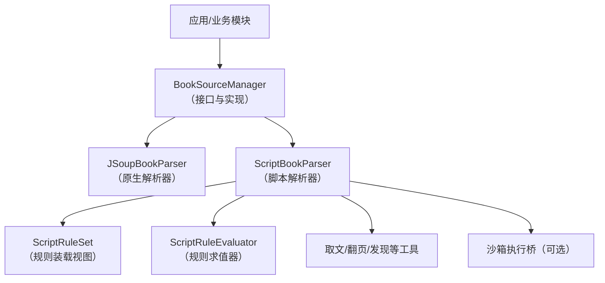
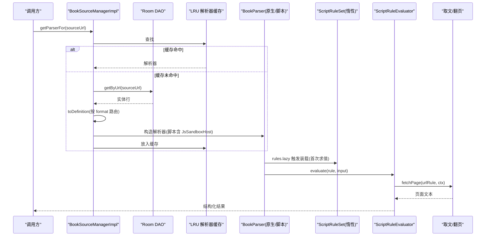
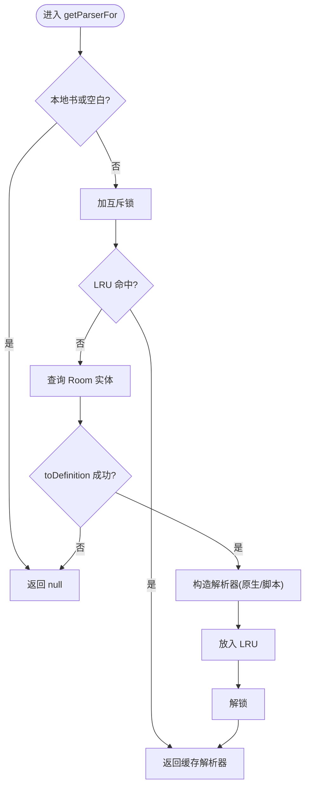
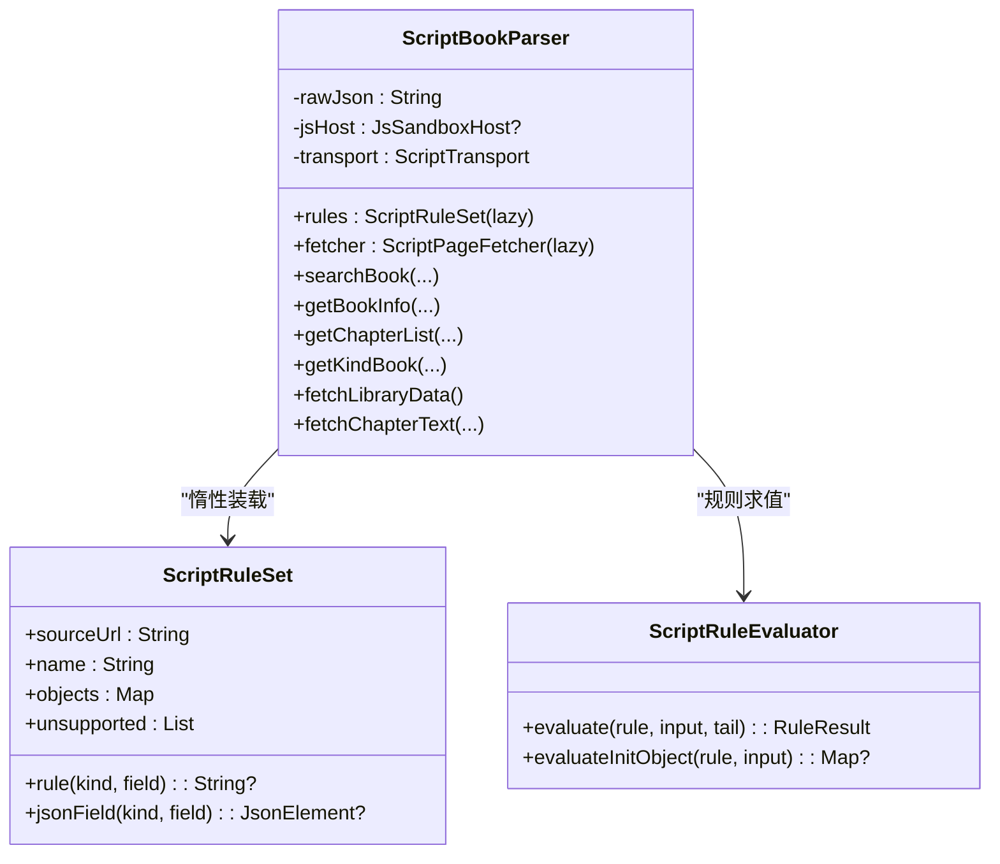
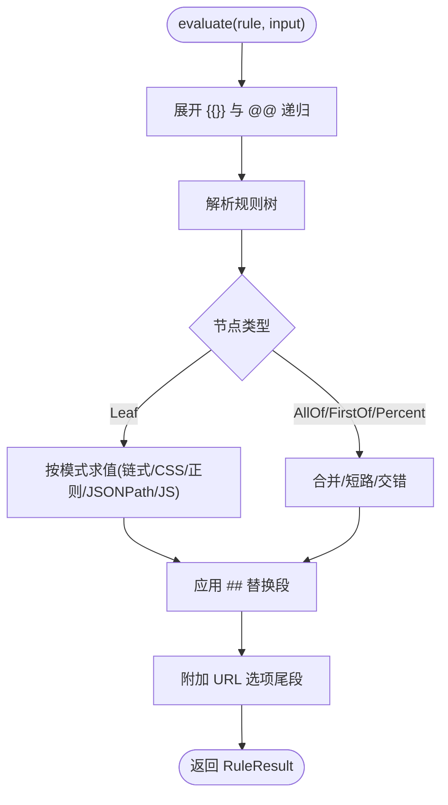
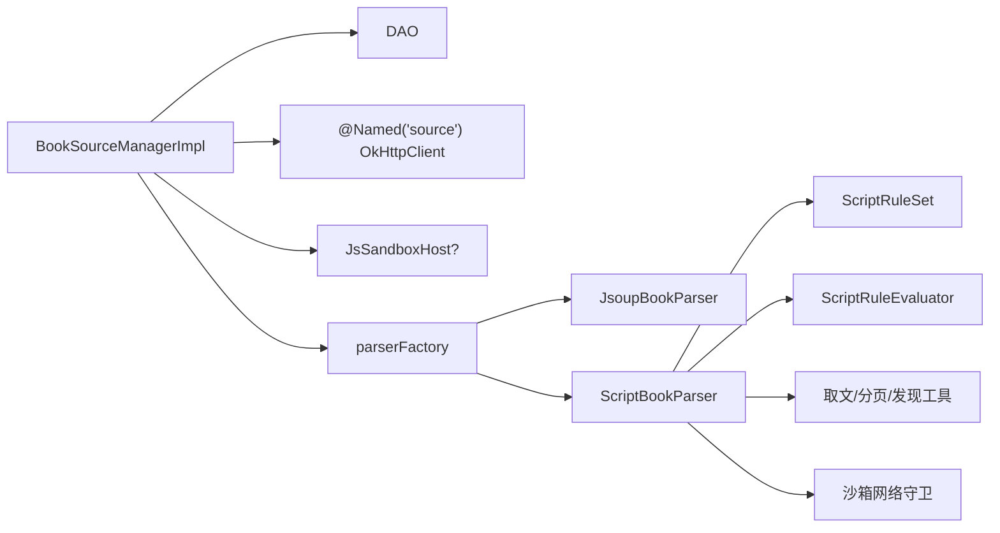

# 动态加载机制

<cite>
**本文引用的文件**
- [BookSourceManager.kt](file://lib_book_common/src/main/java/com/ebook/common/analyze/source/BookSourceManager.kt)
- [BookSourceManagerImpl.kt](file://lib_book_common/src/main/java/com/ebook/common/analyze/source/BookSourceManagerImpl.kt)
- [ScriptBookParser.kt](file://lib_book_source/src/main/java/com/ebook/source/analyze/ScriptBookParser.kt)
- [ScriptRuleSet.kt](file://lib_book_source/src/main/java/com/ebook/source/script/ScriptRuleSet.kt)
- [ScriptRuleEvaluator.kt](file://lib_book_source/src/main/java/com/ebook/source/script/ScriptRuleEvaluator.kt)
</cite>

## 目录
1. [简介](#简介)
2. [项目结构](#项目结构)
3. [核心组件](#核心组件)
4. [架构总览](#架构总览)
5. [详细组件分析](#详细组件分析)
6. [依赖关系分析](#依赖关系分析)
7. [性能考量](#性能考量)
8. [故障排查指南](#故障排查指南)
9. [结论](#结论)

## 简介
本文件聚焦“动态加载机制”，围绕书源的运行时加载流程展开，覆盖规则解析、解析器创建与缓存管理；详细说明 Parser 的懒加载机制（首次访问时加载、LRU 缓存、内存管理）；解释脚本规则的惰性求值（规则装载延迟、错误处理、性能优化）；描述书源版本管理机制（规则变更检测、缓存失效、重新解析）；并给出动态加载的性能调优建议与故障恢复策略。

## 项目结构
本仓库采用多模块分层：业务模块通过 lib_book_common 的书源管理器接入解析层；解析层由 lib_book_source 提供原生与脚本两种解析实现，脚本侧包含规则装载、求值、取文与沙箱执行桥接。

图示来源
- [BookSourceManagerImpl.kt:109-118](file://lib_book_common/src/main/java/com/ebook/common/analyze/source/BookSourceManagerImpl.kt#L109-L118)
- [ScriptBookParser.kt:57-74](file://lib_book_source/src/main/java/com/ebook/source/analyze/ScriptBookParser.kt#L57-L74)
- [ScriptRuleSet.kt:66-99](file://lib_book_source/src/main/java/com/ebook/source/script/ScriptRuleSet.kt#L66-L99)
- [ScriptRuleEvaluator.kt:18-41](file://lib_book_source/src/main/java/com/ebook/source/script/ScriptRuleEvaluator.kt#L18-L41)

章节来源
- [BookSourceManager.kt:51-277](file://lib_book_common/src/main/java/com/ebook/common/analyze/source/BookSourceManager.kt#L51-L277)
- [BookSourceManagerImpl.kt:84-119](file://lib_book_common/src/main/java/com/ebook/common/analyze/source/BookSourceManagerImpl.kt#L84-L119)

## 核心组件
- BookSourceManager：书源清单与解析器的统一入口，负责按 URL 返回解析器、聚合搜索、默认源订阅、导入导出等。
- BookSourceManagerImpl：Room 持久化的书源清单 + 按 URL 获取解析器（带 LRU 缓存），并提供默认源选择逻辑与写操作后的收敛。
- ScriptBookParser：脚本书源解析器，惰性装载规则集，组装求值与取文链路，支持搜索、详情、目录、发现与正文读取。
- ScriptRuleSet：脚本规则装载视图，惰性解析原始 JSON，维护对象表、能力登记与不支持项。
- ScriptRuleEvaluator：规则求值器，负责插值展开、切分、组合符求值、替换段与选项尾段处理，并将 JS 分支交由沙箱执行。

章节来源
- [BookSourceManager.kt:91-112](file://lib_book_common/src/main/java/com/ebook/common/analyze/source/BookSourceManager.kt#L91-L112)
- [BookSourceManagerImpl.kt:181-193](file://lib_book_common/src/main/java/com/ebook/common/analyze/source/BookSourceManagerImpl.kt#L181-L193)
- [ScriptBookParser.kt:38-74](file://lib_book_source/src/main/java/com/ebook/source/analyze/ScriptBookParser.kt#L38-L74)
- [ScriptRuleSet.kt:139-238](file://lib_book_source/src/main/java/com/ebook/source/script/ScriptRuleSet.kt#L139-L238)
- [ScriptRuleEvaluator.kt:18-41](file://lib_book_source/src/main/java/com/ebook/source/script/ScriptRuleEvaluator.kt#L18-L41)

## 架构总览
下图展示书源从存储到解析的关键路径：业务调用 getParserFor 获取解析器，若未命中则查库并构建；脚本解析器惰性装载规则；求值阶段按需执行规则与 JS 片段；结果经取文与分页装配为实体。

图示来源
- [BookSourceManagerImpl.kt:433-443](file://lib_book_common/src/main/java/com/ebook/common/analyze/source/BookSourceManagerImpl.kt#L433-L443)
- [BookSourceManagerImpl.kt:109-118](file://lib_book_common/src/main/java/com/ebook/common/analyze/source/BookSourceManagerImpl.kt#L109-L118)
- [ScriptBookParser.kt:72-74](file://lib_book_source/src/main/java/com/ebook/source/analyze/ScriptBookParser.kt#L72-L74)
- [ScriptRuleEvaluator.kt:20-41](file://lib_book_source/src/main/java/com/ebook/source/script/ScriptRuleEvaluator.kt#L20-L41)

## 详细组件分析

### 书源管理器与解析器缓存
- 职责边界：BookSourceManager 是 book_source 表之上的唯一读写面，所有规则类型化读面只返回原生规则，默认源与条目面保留脚本行参与。
- 解析器获取：getParserFor 对本地书 tag 短路返回 null；否则以 URL 为键在 LRU 中查找，未命中则查 Room、转换 SourceDefinition、通过工厂构建解析器并写入缓存。
- LRU 与并发：parserCache 使用 LinkedHashMap 访问顺序淘汰，容量固定；所有读写通过 Mutex 串行化，避免并发重复构建。
- 缓存失效：任何可能改变解析结果的写操作（新增/删除/启用/设为默认）成功后均失效对应 URL 的缓存，确保下次请求重建解析器。

图示来源
- [BookSourceManagerImpl.kt:433-443](file://lib_book_common/src/main/java/com/ebook/common/analyze/source/BookSourceManagerImpl.kt#L433-L443)
- [BookSourceManagerImpl.kt:181-193](file://lib_book_common/src/main/java/com/ebook/common/analyze/source/BookSourceManagerImpl.kt#L181-L193)

章节来源
- [BookSourceManager.kt:91-112](file://lib_book_common/src/main/java/com/ebook/common/analyze/source/BookSourceManager.kt#L91-L112)
- [BookSourceManagerImpl.kt:433-443](file://lib_book_common/src/main/java/com/ebook/common/analyze/source/BookSourceManagerImpl.kt#L433-L443)
- [BookSourceManagerImpl.kt:817-819](file://lib_book_common/src/main/java/com/ebook/common/analyze/source/BookSourceManagerImpl.kt#L817-L819)

### 脚本解析器与规则惰性装载
- 惰性装载：ScriptBookParser 的 rules 字段通过 lazy 装载 ScriptRuleSet.load(rawJson)，首次求值时才解析 JSON 并建立对象表与能力登记。
- 构造契约：getParserFor 对脚本行永不返回 null、不在取 parser 时抛异常；坏 JSON 会在首次求值抛出类型化异常（消息含“脚本书源 JSON 无法解析”）。
- 取文与上下文：fetcher、allowlist、cookieJar、sandboxGateway 等均 lazily 初始化；newContext 装配 EvalContext 与沙箱桥，绑定 sourceJson 与可选 chapterJson/title。
- 五面能力：searchBook、getBookInfo、getChapterList、getKindBook、fetchLibraryData、fetchChapterText 均在 IO 调度器执行，失败与取消行为对齐规格与原生链路的约定。

图示来源
- [ScriptBookParser.kt:57-74](file://lib_book_source/src/main/java/com/ebook/source/analyze/ScriptBookParser.kt#L57-L74)
- [ScriptBookParser.kt:131-155](file://lib_book_source/src/main/java/com/ebook/source/analyze/ScriptBookParser.kt#L131-L155)
- [ScriptRuleSet.kt:66-99](file://lib_book_source/src/main/java/com/ebook/source/script/ScriptRuleSet.kt#L66-L99)
- [ScriptRuleEvaluator.kt:18-41](file://lib_book_source/src/main/java/com/ebook/source/script/ScriptRuleEvaluator.kt#L18-L41)

章节来源
- [ScriptBookParser.kt:38-74](file://lib_book_source/src/main/java/com/ebook/source/analyze/ScriptBookParser.kt#L38-L74)
- [ScriptBookParser.kt:176-199](file://lib_book_source/src/main/java/com/ebook/source/analyze/ScriptBookParser.kt#L176-L199)
- [ScriptBookParser.kt:291-346](file://lib_book_source/src/main/java/com/ebook/source/analyze/ScriptBookParser.kt#L291-L346)
- [ScriptBookParser.kt:363-380](file://lib_book_source/src/main/java/com/ebook/source/analyze/ScriptBookParser.kt#L363-L380)
- [ScriptBookParser.kt:417-433](file://lib_book_source/src/main/java/com/ebook/source/analyze/ScriptBookParser.kt#L417-L433)
- [ScriptBookParser.kt:460-467](file://lib_book_source/src/main/java/com/ebook/source/analyze/ScriptBookParser.kt#L460-L467)

### 规则求值与惰性求值
- 求值流水线：Interpolation.expand → RuleSplitter.parse → evaluateNode（||/&&/%% 组合）→ ReplacementApplier.apply → 回填占位符与选项尾段。
- 模式分发：DEFAULT_CHAIN、CSS、JSON_PATH、REGEX_ALL_IN_ONE、JS、VARIABLE_PUT/GET；未实现能力抛类型化异常而非空结果。
- JS 分支：若无沙箱桥则抛“待执行”异常；若有桥则执行片段或前链+JS+后链复合形态；@js: 后位在链式/CSS 载荷中作为后处理。
- 变量与占位：{{}} 占位符在展开期回填；@@ 递归求值；@put:@get 变量在 EvalContext 中生命周期内生效。

图示来源
- [ScriptRuleEvaluator.kt:18-41](file://lib_book_source/src/main/java/com/ebook/source/script/ScriptRuleEvaluator.kt#L18-L41)
- [ScriptRuleEvaluator.kt:87-120](file://lib_book_source/src/main/java/com/ebook/source/script/ScriptRuleEvaluator.kt#L87-L120)
- [ScriptRuleEvaluator.kt:122-175](file://lib_book_source/src/main/java/com/ebook/source/script/ScriptRuleEvaluator.kt#L122-L175)
- [ScriptRuleEvaluator.kt:194-217](file://lib_book_source/src/main/java/com/ebook/source/script/ScriptRuleEvaluator.kt#L194-L217)
- [ScriptRuleEvaluator.kt:227-266](file://lib_book_source/src/main/java/com/ebook/source/script/ScriptRuleEvaluator.kt#L227-L266)
- [ScriptRuleEvaluator.kt:268-310](file://lib_book_source/src/main/java/com/ebook/source/script/ScriptRuleEvaluator.kt#L268-L310)

章节来源
- [ScriptRuleEvaluator.kt:18-41](file://lib_book_source/src/main/java/com/ebook/source/script/ScriptRuleEvaluator.kt#L18-L41)
- [ScriptRuleEvaluator.kt:194-217](file://lib_book_source/src/main/java/com/ebook/source/script/ScriptRuleEvaluator.kt#L194-L217)
- [ScriptRuleEvaluator.kt:227-266](file://lib_book_source/src/main/java/com/ebook/source/script/ScriptRuleEvaluator.kt#L227-L266)
- [ScriptRuleEvaluator.kt:268-310](file://lib_book_source/src/main/java/com/ebook/source/script/ScriptRuleEvaluator.kt#L268-L310)

### 版本管理与缓存失效
- 规则变更检测：用户导入/更新书源会 REPLACE 整行；实现类在落库后调用 evictParser 失效该 URL 的解析器缓存。
- 格式翻转：format 列切换（原生↔脚本）也会失效缓存，防止旧后端继续被使用。
- 默认源收敛：写操作后调用 syncDefaultAfterWrite 固化 SP 并推送 defaultUrlFlow，保证订阅面重算。
- 清理范围：仅按 URL 失效缓存；默认源与其他源同构，无单独缓存位，避免“定义换、缓存未清”的问题。

章节来源
- [BookSourceManagerImpl.kt:525-557](file://lib_book_common/src/main/java/com/ebook/common/analyze/source/BookSourceManagerImpl.kt#L525-L557)
- [BookSourceManagerImpl.kt:590-637](file://lib_book_common/src/main/java/com/ebook/common/analyze/source/BookSourceManagerImpl.kt#L590-L637)
- [BookSourceManagerImpl.kt:756-778](file://lib_book_common/src/main/java/com/ebook/common/analyze/source/BookSourceManagerImpl.kt#L756-L778)
- [BookSourceManagerImpl.kt:817-819](file://lib_book_common/src/main/java/com/ebook/common/analyze/source/BookSourceManagerImpl.kt#L817-L819)

## 依赖关系分析
- BookSourceManagerImpl 依赖 Room DAO、OkHttpClient（纯净客户端）、JsSandboxHost（可选）以及解析器工厂；工厂按 SourceDefinition 分派到 JsoupBookParser 或 ScriptBookParser。
- ScriptBookParser 依赖 ScriptRuleSet（惰性装载）、ScriptRuleEvaluator（规则求值）、取文与分页工具、沙箱网络守卫与 CookieJar。
- ScriptRuleSet 在装载期扫描规则对象与顶层 URL 字段，登记不支持项与非常规字段，供导入报告与前置检查使用。

图示来源
- [BookSourceManagerImpl.kt:84-119](file://lib_book_common/src/main/java/com/ebook/common/analyze/source/BookSourceManagerImpl.kt#L84-L119)
- [ScriptBookParser.kt:57-74](file://lib_book_source/src/main/java/com/ebook/source/analyze/ScriptBookParser.kt#L57-L74)
- [ScriptRuleSet.kt:139-238](file://lib_book_source/src/main/java/com/ebook/source/script/ScriptRuleSet.kt#L139-L238)

章节来源
- [BookSourceManagerImpl.kt:84-119](file://lib_book_common/src/main/java/com/ebook/common/analyze/source/BookSourceManagerImpl.kt#L84-L119)
- [ScriptBookParser.kt:57-74](file://lib_book_source/src/main/java/com/ebook/source/analyze/ScriptBookParser.kt#L57-L74)
- [ScriptRuleSet.kt:139-238](file://lib_book_source/src/main/java/com/ebook/source/script/ScriptRuleSet.kt#L139-L238)

## 性能考量
- 解析器 LRU 容量：PARSER_CACHE_SIZE=3，适合同时活跃书籍数级场景；超出容量淘汰最久未用条目，下一轮重建成本可控。
- 聚合搜索并发：AGGREGATE_SEARCH_CONCURRENCY=5，平衡全站体感与第三方风控风险。
- 惰性装载：规则集仅在首次求值时解析，避免构造期 IO 与解析开销；日志 TAG 也延迟至首次使用。
- 异步执行：解析器各面均在 Dispatchers.IO 上运行，减少主线程阻塞。
- 缓存失效精准：写操作后立即失效对应 URL 缓存，避免陈旧实例影响后续请求。
- 建议：
  - 根据设备与用户规模调整 LRU 容量与聚合并发上限。
  - 监控规则大小与复杂度，避免过大的 JSON 导致首次求值耗时过长。
  - 对频繁访问的热门源可考虑预热解析器（例如启动后预取常用 URL 的 parser）。
  - 限制单次请求超时与重试次数，避免慢源拖垮整体体验。

[本节为通用性能讨论，不直接分析具体文件]

## 故障排查指南
- 解析器返回 null：常见于本地书 tag、空白 URL、或该行不存在/原生 rule_json 解不出；脚本行不会在此返回 null。
- 脚本规则装载失败：首次求值抛出类型化异常（消息含“脚本书源 JSON 无法解析”），需检查规则 JSON 结构与键名。
- JS 执行失败：若未装配沙箱，将抛“待执行”异常；已装配但执行失败则抛“执行失败”异常，两者语义不同，不要混为一谈。
- 规则能力缺失：ScriptRuleSet.unsupported 登记了未实现能力（如 XPath、Web JS、登录等），导入报告可据此提示用户。
- 缓存不一致：确认写操作后是否调用了 evictParser；格式翻转也必须失效缓存，否则 LRU 会成为第二个事实源。
- 默认源异常：观察 observeDefaultSource 流与 persistDefaultUrl 的推送；若 SP 指向已删/禁用源，应回落到下一条启用源或 null。

章节来源
- [BookSourceManager.kt:91-112](file://lib_book_common/src/main/java/com/ebook/common/analyze/source/BookSourceManager.kt#L91-L112)
- [ScriptBookParser.kt:38-74](file://lib_book_source/src/main/java/com/ebook/source/analyze/ScriptBookParser.kt#L38-L74)
- [ScriptRuleSet.kt:21-49](file://lib_book_source/src/main/java/com/ebook/source/script/ScriptRuleSet.kt#L21-L49)
- [BookSourceManagerImpl.kt:817-819](file://lib_book_common/src/main/java/com/ebook/common/analyze/source/BookSourceManagerImpl.kt#L817-L819)

## 结论
本项目的动态加载机制以“惰性装载 + LRU 缓存 + 写后失效”为核心，确保书源解析既高效又安全：规则与解析器按需构建，解析器按 URL 缓存且受互斥保护，规则变更后及时失效并重建；脚本规则的首次求值才进行 JSON 解析与能力登记，避免冷启动开销；求值链路严格区分“未配置/不支持/失败”，通过类型化异常如实上报，便于定位与修复。结合合理的并发与缓存策略，可在多书源共存场景下提供稳定、可扩展的解析能力。