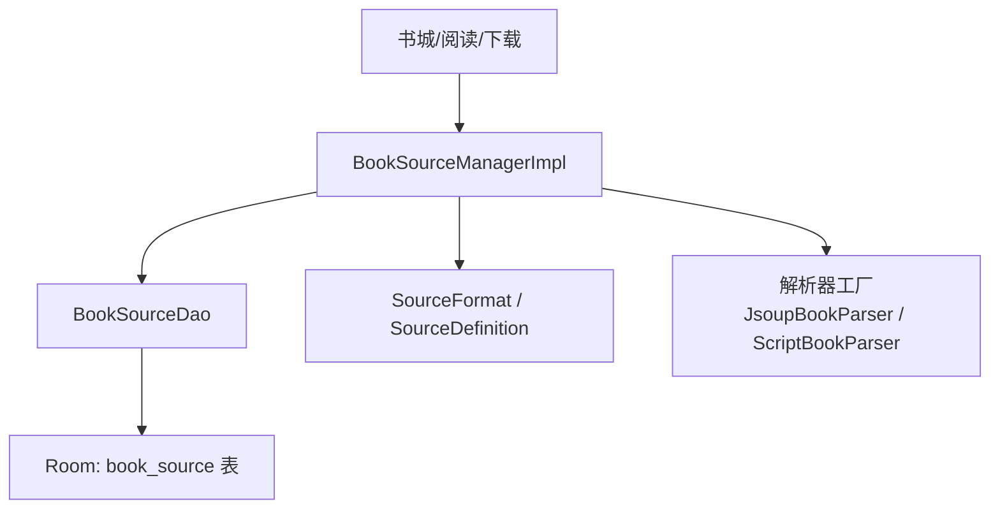
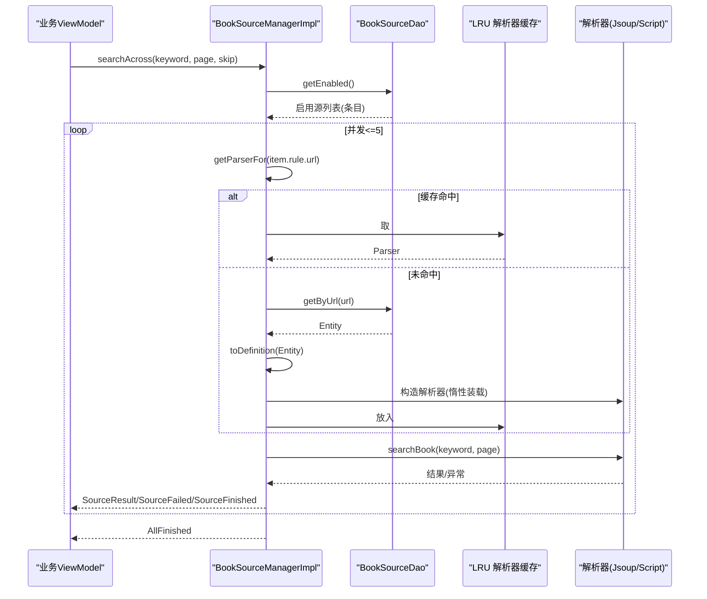
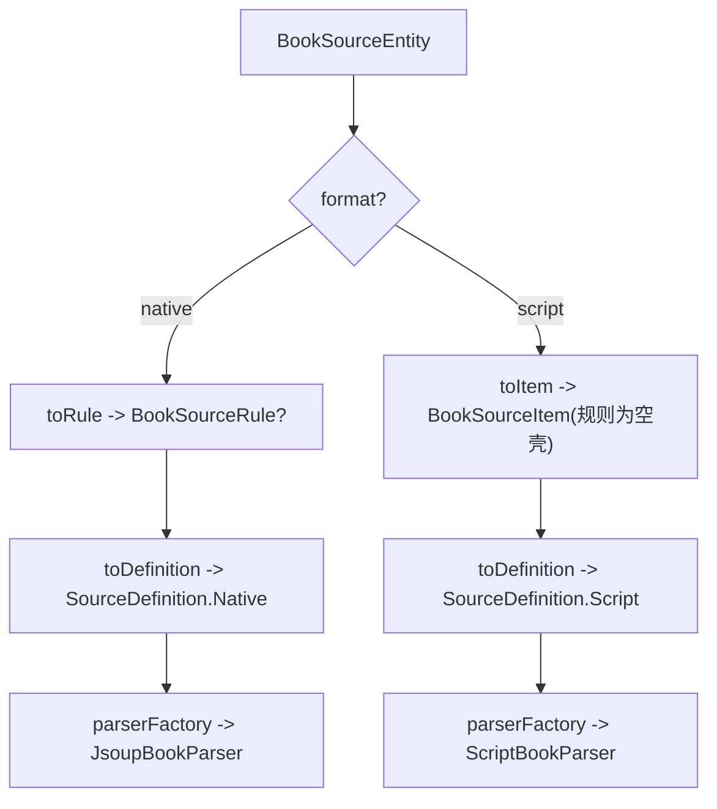
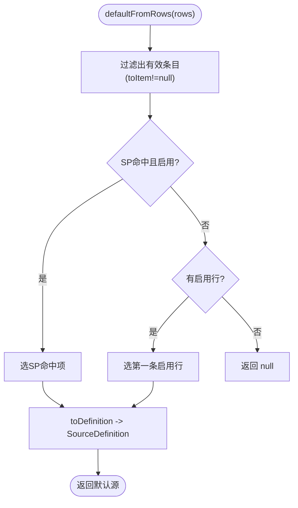
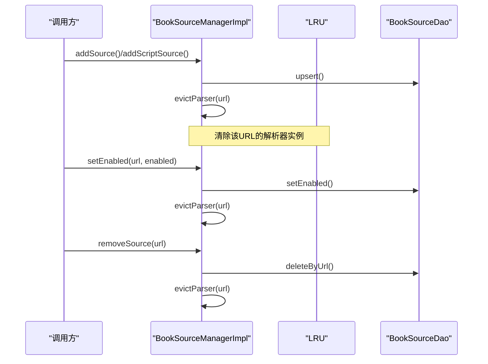
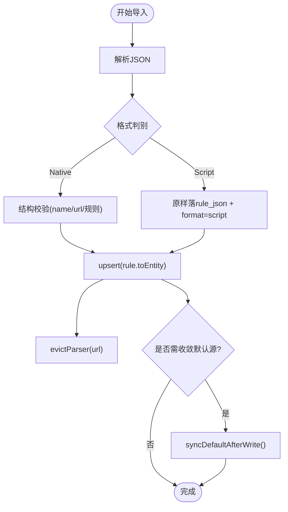
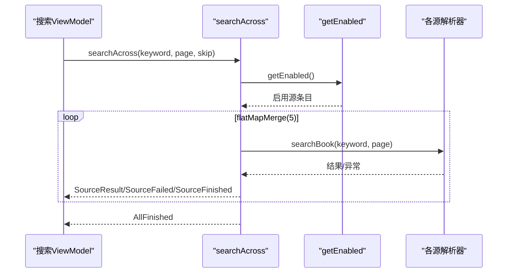

# 多书源管理

<cite>
**本文引用的文件**
- [BookSourceManager.kt](file://lib_book_common/src/main/java/com/ebook/common/analyze/source/BookSourceManager.kt)
- [BookSourceManagerImpl.kt](file://lib_book_common/src/main/java/com/ebook/common/analyze/source/BookSourceManagerImpl.kt)
- [BookSourceEntity.kt](file://lib_ebook_db/src/main/java/com/ebook/db/entity/BookSourceEntity.kt)
- [BookSourceDao.kt](file://lib_ebook_db/src/main/java/com/ebook/db/dao/BookSourceDao.kt)
- [SourceFormat.kt](file://lib_ebook_api/src/main/java/com/ebook/api/entity/SourceFormat.kt)
- [0016-multi-book-source-architecture.md](file://docs/adr/0016-multi-book-source-architecture.md)
- [BookSourceManagerImplTest.kt](file://lib_book_common/src/test/java/com/ebook/common/analyze/source/BookSourceManagerImplTest.kt)
</cite>

## 目录
1. [简介](#简介)
2. [项目结构](#项目结构)
3. [核心组件](#核心组件)
4. [架构总览](#架构总览)
5. [详细组件分析](#详细组件分析)
6. [依赖关系分析](#依赖关系分析)
7. [性能考量](#性能考量)
8. [故障排查指南](#故障排查指南)
9. [结论](#结论)
10. [附录](#附录)

## 简介
本技术文档围绕“多书源管理”展开，聚焦 BookSourceManager 接口的设计原则与 BookSourceManagerImpl 的实现机制，解释原生规则与脚本规则的混合存储、格式区分与解析器路由；说明默认源计算算法（优先级排序、启用状态检查、回退策略）；阐述书源的动态加载与缓存失效策略；并提供导入流程、错误处理与性能优化的最佳实践。

## 项目结构
- 数据层：Room 表 book_source 由 BookSourceEntity 描述，访问通过 BookSourceDao 暴露查询、写入与 Flow 观察。
- 管理层：BookSourceManager 定义多书源共存清单的唯一读写面；BookSourceManagerImpl 实现以 Room 为唯一事实源，负责默认源现算、格式路由、解析器 LRU 缓存、聚合搜索编排等。
- API 层：SourceFormat 与 SourceDefinition 提供格式判别与默认源载体；Script/Native 分支承载不同求值后端。
- 业务侧：书城、阅读、下载均按“每本书绑源”的 tag/sourceUrl 经 getParserFor 取解析器，不再依赖全局默认源。



图表来源
- [BookSourceManagerImpl.kt:40-119](file://lib_book_common/src/main/java/com/ebook/common/analyze/source/BookSourceManagerImpl.kt#L40-L119)
- [BookSourceDao.kt:25-101](file://lib_ebook_db/src/main/java/com/ebook/db/dao/BookSourceDao.kt#L25-L101)
- [SourceFormat.kt:14-91](file://lib_ebook_api/src/main/java/com/ebook/api/entity/SourceFormat.kt#L14-L91)

章节来源
- [BookSourceManager.kt:10-50](file://lib_book_common/src/main/java/com/ebook/common/analyze/source/BookSourceManager.kt#L10-L50)
- [BookSourceManagerImpl.kt:40-119](file://lib_book_common/src/main/java/com/ebook/common/analyze/source/BookSourceManagerImpl.kt#L40-L119)
- [BookSourceEntity.kt:7-91](file://lib_ebook_db/src/main/java/com/ebook/db/entity/BookSourceEntity.kt#L7-L91)
- [BookSourceDao.kt:7-24](file://lib_ebook_db/src/main/java/com/ebook/db/dao/BookSourceDao.kt#L7-L24)
- [SourceFormat.kt:14-91](file://lib_ebook_api/src/main/java/com/ebook/api/entity/SourceFormat.kt#L14-L91)
- [0016-multi-book-source-architecture.md:7-86](file://docs/adr/0016-multi-book-source-architecture.md#L7-L86)

## 核心组件
- BookSourceManager（接口）：定义多书源清单的唯一读写面，包含规则类型化读面（仅原生）、条目订阅面（含脚本行）、默认源订阅、解析器获取、聚合搜索、导入导出、启用/删除/设默认等能力。
- BookSourceManagerImpl（实现）：以 Room 为唯一事实源，默认源每次现算；统一格式路由（native/script），解析器 LRU 缓存 + 互斥锁；聚合搜索并发上限控制；写路径覆盖导入并收敛默认源。
- BookSourceEntity/BookSourceDao：持久化书源清单（url 主键、rule_json 整段 JSON、format/native/script、enabled/weight/group/addedAt），提供 observeAll/getEnabled/getByUrl/upsert/setEnabled/deleteByUrl。
- SourceFormat/SourceDefinition：格式枚举与默认源密封载体（Native/Script），用于路由与展示。

章节来源
- [BookSourceManager.kt:51-277](file://lib_book_common/src/main/java/com/ebook/common/analyze/source/BookSourceManager.kt#L51-L277)
- [BookSourceManagerImpl.kt:84-119](file://lib_book_common/src/main/java/com/ebook/common/analyze/source/BookSourceManagerImpl.kt#L84-L119)
- [BookSourceEntity.kt:18-91](file://lib_ebook_db/src/main/java/com/ebook/db/entity/BookSourceEntity.kt#L18-L91)
- [BookSourceDao.kt:25-101](file://lib_ebook_db/src/main/java/com/ebook/db/dao/BookSourceDao.kt#L25-L101)
- [SourceFormat.kt:14-91](file://lib_ebook_api/src/main/java/com/ebook/api/entity/SourceFormat.kt#L14-L91)

## 架构总览
- 单一事实源：book_source 表是书源清单的唯一真值，应用不随包携带任何书源，无首启灌库，所有读面走 Room 或基于 Room 的 Flow。
- 异步读写：全部读面均为挂起函数或 Flow，无同步出口；写操作失败以 Result 返回，避免抛异常到调用方。
- Flow 订阅模式：observeSources() 提供带 format 元数据的清单流；observeDefaultSource() 提供默认源流（格式中立）。
- 多书源共存：同一表内 native/script 两种格式并存，通过 format 列在 toDefinition/toItem 等处路由；脚本行不参与规则类型化读面，但参与默认源候选与聚合搜索。
- 默认源计算：SP 命中且启用优先 → 否则第一条启用行；全禁用时发 null。
- 动态加载与缓存：getParserFor(url) 维护 LRU 解析器缓存（容量 3），写后 evictParser 失效对应 URL 的缓存；格式翻转也必须失效。
- 聚合搜索：并发上限 5，单源失败不影响其他源，按页推进并由调用方维护 skipSourceUrls。



图表来源
- [BookSourceManagerImpl.kt:433-476](file://lib_book_common/src/main/java/com/ebook/common/analyze/source/BookSourceManagerImpl.kt#L433-L476)
- [BookSourceManagerImpl.kt:487-510](file://lib_book_common/src/main/java/com/ebook/common/analyze/source/BookSourceManagerImpl.kt#L487-L510)

章节来源
- [BookSourceManagerImpl.kt:433-510](file://lib_book_common/src/main/java/com/ebook/common/analyze/source/BookSourceManagerImpl.kt#L433-L510)
- [BookSourceDao.kt:54-61](file://lib_ebook_db/src/main/java/com/ebook/db/dao/BookSourceDao.kt#L54-L61)

## 详细组件分析

### BookSourceManager 接口设计原则
- 单一事实源：所有清单与默认源都来自 Room，不存在同步初值或内存快照；禁止新增同步读面。
- 异步读写：读取一律 suspend 或 Flow；写入失败用 Result 表达，不抛异常。
- 职责分工：规则类型化读面只给 BookSourceRule（仅原生）；条目订阅面给 BookSourceItem（含 format）；默认源载体为 SourceDefinition（格式中立）。
- 安全边界：禁止“按全局默认源解析任意一本书”的路径，必须按书的归属 tag/sourceUrl 取 parser。

章节来源
- [BookSourceManager.kt:10-50](file://lib_book_common/src/main/java/com/ebook/common/analyze/source/BookSourceManager.kt#L10-L50)
- [BookSourceManager.kt:51-277](file://lib_book_common/src/main/java/com/ebook/common/analyze/source/BookSourceManager.kt#L51-L277)

### 多书源共存机制（原生与脚本混合存储、格式区分、解析器路由）
- 存储：book_source.format 列为 "native"/"script"；rule_json 对 native 是本仓规则序列化，对 script 是社区 JSON 原文。
- 区分：toRule() 挡下非原生行（规则类型化读面不可见脚本行）；toItem() 对脚本行不解 rule_json，直接合成展示空壳；toDefinition() 按 format 分派 Native/Script。
- 路由：parserFactory 根据 SourceDefinition 构造 JsoupBookParser 或 ScriptBookParser；脚本解析器惰性装载规则，首次求值才可能抛类型化异常。



图表来源
- [BookSourceManagerImpl.kt:277-364](file://lib_book_common/src/main/java/com/ebook/common/analyze/source/BookSourceManagerImpl.kt#L277-L364)
- [BookSourceManagerImpl.kt:109-118](file://lib_book_common/src/main/java/com/ebook/common/analyze/source/BookSourceManagerImpl.kt#L109-L118)

章节来源
- [BookSourceManagerImpl.kt:277-364](file://lib_book_common/src/main/java/com/ebook/common/analyze/source/BookSourceManagerImpl.kt#L277-L364)
- [SourceFormat.kt:14-91](file://lib_ebook_api/src/main/java/com/ebook/api/entity/SourceFormat.kt#L14-L91)

### 默认源计算算法（优先级、启用检查、回退）
- 候选集：所有启用行（两种格式平等），先经 toItem 解码（原生解不出即出局，脚本恒可产出条目）。
- 优先级：SP 命中且启用优先；否则第一条启用行。
- 回退：无任何启用行则发 null；当当前默认源被禁用或删除时，自动回落下一条启用源或 null。
- 收敛：写路径（add/remove/setEnabled）成功后若触发条件则 syncDefaultAfterWrite，将现算结果固化进 SP 并推送 defaultUrlFlow。



图表来源
- [BookSourceManagerImpl.kt:207-214](file://lib_book_common/src/main/java/com/ebook/common/analyze/source/BookSourceManagerImpl.kt#L207-L214)
- [BookSourceManagerImpl.kt:790-793](file://lib_book_common/src/main/java/com/ebook/common/analyze/source/BookSourceManagerImpl.kt#L790-L793)

章节来源
- [BookSourceManagerImpl.kt:207-214](file://lib_book_common/src/main/java/com/ebook/common/analyze/source/BookSourceManagerImpl.kt#L207-L214)
- [BookSourceManagerImpl.kt:756-778](file://lib_book_common/src/main/java/com/ebook/common/analyze/source/BookSourceManagerImpl.kt#L756-L778)
- [BookSourceManagerImpl.kt:723-739](file://lib_book_common/src/main/java/com/ebook/common/analyze/source/BookSourceManagerImpl.kt#L723-L739)

### 书源动态加载与缓存失效
- 解析器 LRU：容量 3，按 URL 缓存；并发访问用 Mutex 保护，保证“查缓存→查库→入缓存”原子性。
- 失效时机：addSource/addScriptSource/removeSource/setEnabled/setDefaultSource 成功后对相应 URL 执行 evictParser；格式翻转也必须失效，避免 LRU 成为第二个事实源。
- 脚本行特殊性：getParserFor 对脚本行永不返回 null，也不在构造期抛异常；规则装载惰性，首次求值失败抛出类型化异常。



图表来源
- [BookSourceManagerImpl.kt:525-557](file://lib_book_common/src/main/java/com/ebook/common/analyze/source/BookSourceManagerImpl.kt#L525-L557)
- [BookSourceManagerImpl.kt:590-637](file://lib_book_common/src/main/java/com/ebook/common/analyze/source/BookSourceManagerImpl.kt#L590-L637)
- [BookSourceManagerImpl.kt:723-739](file://lib_book_common/src/main/java/com/ebook/common/analyze/source/BookSourceManagerImpl.kt#L723-L739)
- [BookSourceManagerImpl.kt:671-690](file://lib_book_common/src/main/java/com/ebook/common/analyze/source/BookSourceManagerImpl.kt#L671-L690)
- [BookSourceManagerImpl.kt:756-778](file://lib_book_common/src/main/java/com/ebook/common/analyze/source/BookSourceManagerImpl.kt#L756-L778)
- [BookSourceManagerImpl.kt:817-819](file://lib_book_common/src/main/java/com/ebook/common/analyze/source/BookSourceManagerImpl.kt#L817-L819)

章节来源
- [BookSourceManagerImpl.kt:181-194](file://lib_book_common/src/main/java/com/ebook/common/analyze/source/BookSourceManagerImpl.kt#L181-L194)
- [BookSourceManagerImpl.kt:433-443](file://lib_book_common/src/main/java/com/ebook/common/analyze/source/BookSourceManagerImpl.kt#L433-L443)
- [BookSourceManagerImpl.kt:817-819](file://lib_book_common/src/main/java/com/ebook/common/analyze/source/BookSourceManagerImpl.kt#L817-L819)

### 导入流程与错误处理
- 导入入口：importFromJson() 纯函数解析为 BookSourceRule；addSource() 覆盖写入（REPLACE）；addScriptSource() 原样落 rule_json 并标记 format=script。
- 预览与校验：导入前可按顶层键判别格式（SourceFormatDetector），原生走结构校验，脚本不做内容校验交由 UI 提示。
- 失败处理：空白 URL/名称等非法输入封装为 IllegalArgumentException 并通过 Result.failure 返回；解析失败记录日志并返回失败；写库异常捕获后返回失败。
- 默认源收敛：写之前判断是否“无可用默认源”，若是则导入的启用源提升为默认源；若覆盖的是 SP 记着的当前默认源，则重新收敛。



图表来源
- [BookSourceManagerImpl.kt:525-557](file://lib_book_common/src/main/java/com/ebook/common/analyze/source/BookSourceManagerImpl.kt#L525-L557)
- [BookSourceManagerImpl.kt:590-637](file://lib_book_common/src/main/java/com/ebook/common/analyze/source/BookSourceManagerImpl.kt#L590-L637)
- [SourceFormat.kt:44-53](file://lib_ebook_api/src/main/java/com/ebook/api/entity/SourceFormat.kt#L44-L53)

章节来源
- [BookSourceManagerImpl.kt:525-557](file://lib_book_common/src/main/java/com/ebook/common/analyze/source/BookSourceManagerImpl.kt#L525-L557)
- [BookSourceManagerImpl.kt:590-637](file://lib_book_common/src/main/java/com/ebook/common/analyze/source/BookSourceManagerImpl.kt#L590-L637)
- [BookSourceManager.kt:157-189](file://lib_book_common/src/main/java/com/ebook/common/analyze/source/BookSourceManager.kt#L157-L189)

### 聚合搜索与并发控制
- 并发上限：AGGREGATE_SEARCH_CONCURRENCY = 5，避免同时打爆多个第三方站点。
- 事件流：SourceStarted → SourceResult/SourceFailed → SourceFinished(hasMore)；全部结束后发 AllFinished。
- 取消语义：CancellationException 原样上抛，避免旧轮次继续灌新结果。
- 游标管理：skipSourceUrls 由调用方传入，Manager 不持有会话状态，避免多事实源。



图表来源
- [BookSourceManagerImpl.kt:464-476](file://lib_book_common/src/main/java/com/ebook/common/analyze/source/BookSourceManagerImpl.kt#L464-L476)
- [BookSourceManagerImpl.kt:487-510](file://lib_book_common/src/main/java/com/ebook/common/analyze/source/BookSourceManagerImpl.kt#L487-L510)

章节来源
- [BookSourceManagerImpl.kt:464-510](file://lib_book_common/src/main/java/com/ebook/common/analyze/source/BookSourceManagerImpl.kt#L464-L510)

## 依赖关系分析
- 模块依赖方向：业务模块 → lib_book_common(BookSourceManager) → lib_ebook_db(BookSourceDao/Entity) 与 lib_ebook_api(SourceFormat/SourceDefinition)。
- 内部耦合：BookSourceManagerImpl 强依赖 BookSourceDao、OkHttpClient（@Named("source")）、可选 JsSandboxHost；解析器工厂集中封装 JsoupBookParser 与 ScriptBookParser 的分发。
- 外部依赖：Room（数据库）、Coroutines/Flow（异步流）、OkHttp（网络请求）。

```mermaid
graph LR
    Impl["BookSourceManagerImpl"] --> Dao["BookSourceDao"]
    Impl --> ApiFmt["SourceFormat / SourceDefinition"]
    Impl --> Net["@Named(\"source\") OkHttpClient"]
    Impl --> Sandbox["JsSandboxHost?(可选)"]
    Impl --> Parser["JsoupBookParser / ScriptBookParser"]
```

图表来源
- [BookSourceManagerImpl.kt:84-119](file://lib_book_common/src/main/java/com/ebook/common/analyze/source/BookSourceManagerImpl.kt#L84-L119)
- [BookSourceDao.kt:25-101](file://lib_ebook_db/src/main/java/com/ebook/db/dao/BookSourceDao.kt#L25-L101)
- [SourceFormat.kt:14-91](file://lib_ebook_api/src/main/java/com/ebook/api/entity/SourceFormat.kt#L14-L91)

章节来源
- [BookSourceManagerImpl.kt:84-119](file://lib_book_common/src/main/java/com/ebook/common/analyze/source/BookSourceManagerImpl.kt#L84-L119)
- [BookSourceDao.kt:25-101](file://lib_ebook_db/src/main/java/com/ebook/db/dao/BookSourceDao.kt#L25-L101)
- [SourceFormat.kt:14-91](file://lib_ebook_api/src/main/java/com/ebook/api/entity/SourceFormat.kt#L14-L91)

## 性能考量
- LRU 解析器缓存：容量 3，减少重复构建 Retrofit service 的开销；并发访问加 Mutex，避免重复创建与竞态。
- 聚合搜索并发：限制为 5，平衡用户体验与第三方站点风控风险。
- 冷启动与首帧：默认源无同步初值，书城首帧应留空直到 observeDefaultSource 给出结论，避免误导用户。
- 批量导入：使用 upsertAll 可减少事务次数；注意 addedAt 同毫秒时的稳定性由 url ASC 兜底。
- 缓存失效：所有写路径（增删改/启用/默认切换）后 evictParser，防止解析行为与真实规则不一致。

章节来源
- [BookSourceManagerImpl.kt:147-166](file://lib_book_common/src/main/java/com/ebook/common/analyze/source/BookSourceManagerImpl.kt#L147-L166)
- [BookSourceManagerImpl.kt:181-194](file://lib_book_common/src/main/java/com/ebook/common/analyze/source/BookSourceManagerImpl.kt#L181-L194)
- [BookSourceManagerImpl.kt:817-819](file://lib_book_common/src/main/java/com/ebook/common/analyze/source/BookSourceManagerImpl.kt#L817-L819)
- [BookSourceDao.kt:74-81](file://lib_ebook_db/src/main/java/com/ebook/db/dao/BookSourceDao.kt#L74-L81)

## 故障排查指南
- “页面没有书源/引导态”：check observeDefaultSource 是否为 null（全禁用或无启用源）；确认是否有导入成功行。
- “某书源解析不出”：检查 getSourceByUrl 是否返回 null（可能是脚本行或脏行）；查看 getParserFor 是否拿到解析器；脚本行首次求值抛类型化异常，需查看具体错误信息。
- “规则改了但解析行为不变”：确认 write 路径是否调用了 evictParser；确认 format 是否正确；确认 LRU 是否命中旧实例。
- “聚合搜索卡住或超时”：检查并发上限与 skipSourceUrls 是否合理；确认单源失败是否被正确收敛为 SourceFailed+SourceFinished。
- “导入后默认源未更新”：确认是否在“写之前无可用默认源”或“覆盖当前默认源”的收敛条件；确认 persistDefaultUrl 与 defaultUrlFlow 是否生效。

章节来源
- [BookSourceManagerImpl.kt:433-443](file://lib_book_common/src/main/java/com/ebook/common/analyze/source/BookSourceManagerImpl.kt#L433-L443)
- [BookSourceManagerImpl.kt:525-557](file://lib_book_common/src/main/java/com/ebook/common/analyze/source/BookSourceManagerImpl.kt#L525-L557)
- [BookSourceManagerImpl.kt:590-637](file://lib_book_common/src/main/java/com/ebook/common/analyze/source/BookSourceManagerImpl.kt#L590-L637)
- [BookSourceManagerImpl.kt:790-793](file://lib_book_common/src/main/java/com/ebook/common/analyze/source/BookSourceManagerImpl.kt#L790-L793)
- [BookSourceManagerImplTest.kt:44-77](file://lib_book_common/src/test/java/com/ebook/common/analyze/source/BookSourceManagerImplTest.kt#L44-L77)

## 结论
BookSourceManager 以 Room 为唯一事实源，实现了多书源共存、格式路由、默认源现算、异步订阅与聚合搜索编排；通过 LRU 解析器缓存与严格的缓存失效策略保障一致性与性能；导入流程兼顾易用性与健壮性。遵循“每本书绑源”的原则，避免全局默认源带来的误解析风险，使系统在高扩展性的同时保持清晰的职责边界与稳定的行为契约。

## 附录
- 设计决策参考：多书源架构演进、默认源与格式中立、聚合搜索并发策略、导入预览与校验、阅读中换源等。
- 测试要点：零源起步、默认源回落、覆盖导入保留 addedAt/weight、解析器缓存失效、格式双后端路由、聚合搜索编排等。

章节来源
- [0016-multi-book-source-architecture.md:7-86](file://docs/adr/0016-multi-book-source-architecture.md#L7-L86)
- [BookSourceManagerImplTest.kt:44-77](file://lib_book_common/src/test/java/com/ebook/common/analyze/source/BookSourceManagerImplTest.kt#L44-L77)