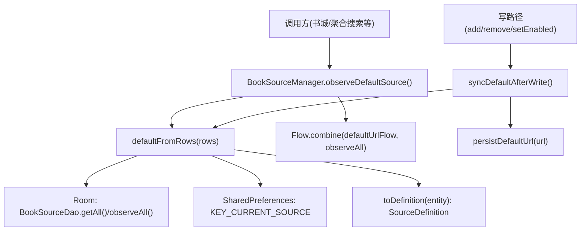
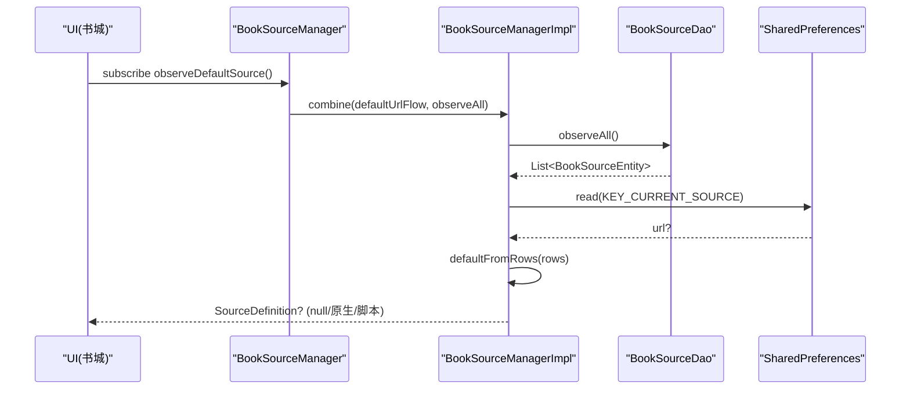
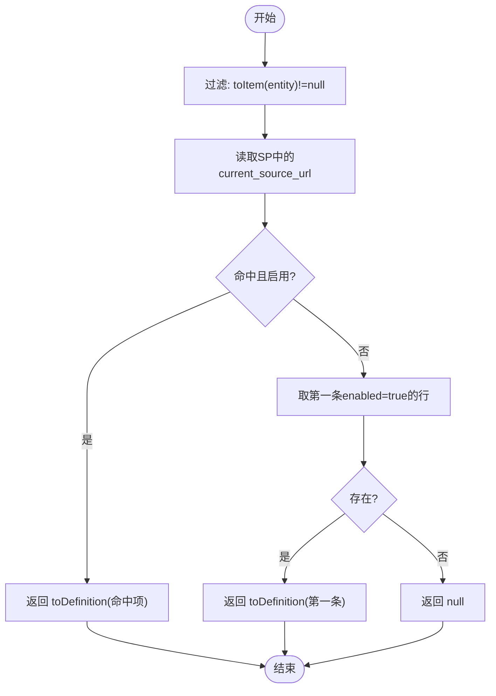
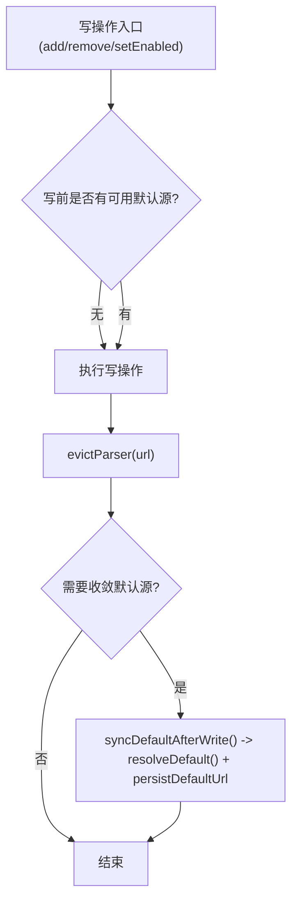
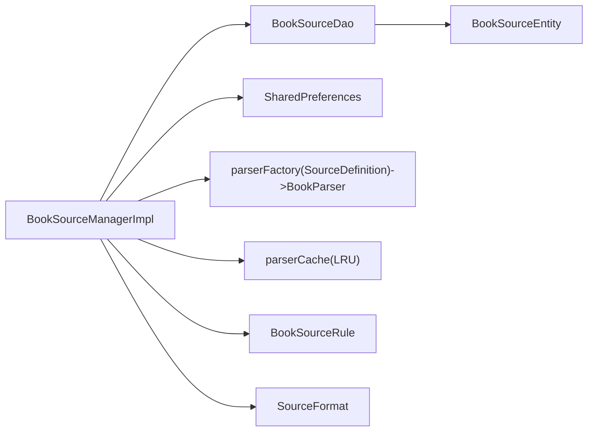

# 默认源计算算法

<cite>
**本文引用的文件**
- [BookSourceManagerImpl.kt](file://lib_book_common/src/main/java/com/ebook/common/analyze/source/BookSourceManagerImpl.kt)
- [BookSourceManager.kt](file://lib_book_common/src/main/java/com/ebook/common/analyze/source/BookSourceManager.kt)
- [BookSourceManagerImplTest.kt](file://lib_book_common/src/test/java/com/ebook/common/analyze/source/BookSourceManagerImplTest.kt)
- [BookSourceDao.kt](file://lib_ebook_db/src/main/java/com/ebook/db/dao/BookSourceDao.kt)
- [BookSourceEntity.kt](file://lib_ebook_db/src/main/java/com/ebook/db/entity/BookSourceEntity.kt)
- [BookSourceRule.kt](file://lib_ebook_api/src/main/java/com/ebook/api/entity/BookSourceRule.kt)
- [SourceFormat.kt](file://lib_ebook_api/src/main/java/com/ebook/api/entity/SourceFormat.kt)
</cite>

## 目录
1. [简介](#简介)
2. [项目结构定位](#项目结构定位)
3. [核心组件](#核心组件)
4. [架构总览](#架构总览)
5. [详细组件分析](#详细组件分析)
6. [依赖关系分析](#依赖关系分析)
7. [性能与并发特性](#性能与并发特性)
8. [故障排查指南](#故障排查指南)
9. [结论与最佳实践](#结论与最佳实践)

## 简介
本文件系统性梳理“默认源计算算法”的实现与行为，聚焦 BookSourceManagerImpl.defaultFromRows 及其相关流程：候选源筛选、优先级排序、启用状态检查；默认源的确定流程（SharedPreferences 命中优先、否则第一条启用行、无可用时返回 null）；默认源与具体书源的区别（载体 SourceDefinition vs BookSourceRule、更新时机、失效处理）；默认源的持久化机制（SP 存储、订阅推送、UI 同步）；以及常见问题与最佳实践。

## 项目结构定位
默认源计算位于共享模块 lib_book_common 的 BookSourceManagerImpl，以 Room 表 book_source 为唯一事实源，结合 SharedPreferences 记录用户上次主动选择的默认源 URL，通过 Flow 对外提供 observeDefaultSource 订阅。写路径（新增/覆盖/删除/启用禁用）在落库后收敛默认源，保证 SP 与 UI 同步。

图示来源
- [BookSourceManagerImpl.kt:197-214](file://lib_book_common/src/main/java/com/ebook/common/analyze/source/BookSourceManagerImpl.kt#L197-L214)
- [BookSourceManagerImpl.kt:839-851](file://lib_book_common/src/main/java/com/ebook/common/analyze/source/BookSourceManagerImpl.kt#L839-L851)
- [BookSourceManagerImpl.kt:790-793](file://lib_book_common/src/main/java/com/ebook/common/analyze/source/BookSourceManagerImpl.kt#L790-L793)

章节来源
- [BookSourceManagerImpl.kt:1-120](file://lib_book_common/src/main/java/com/ebook/common/analyze/source/BookSourceManagerImpl.kt#L1-L120)
- [BookSourceManagerImpl.kt:195-240](file://lib_book_common/src/main/java/com/ebook/common/analyze/source/BookSourceManagerImpl.kt#L195-L240)
- [BookSourceManagerImpl.kt:839-851](file://lib_book_common/src/main/java/com/ebook/common/analyze/source/BookSourceManagerImpl.kt#L839-L851)

## 核心组件
- defaultFromRows：默认源挑选的唯一实现，条目面过滤 + 启用校验 + SP 命中优先 + 第一条启用回退。
- persistDefaultUrl：写入 SharedPreferences 并推送 defaultUrlFlow，使订阅面 combine 能感知切换。
- syncDefaultAfterWrite：写操作成功后现算默认源并固化到 SP，同时补推 defaultUrlFlow。
- observeDefaultSource：组合 defaultUrlFlow 与 observeAll，统一口径输出 SourceDefinition?。
- toDefinition：按 format 分岔，将实体行转换为求值输入（Native/Script），默认源载体为此密封类型。

章节来源
- [BookSourceManagerImpl.kt:197-214](file://lib_book_common/src/main/java/com/ebook/common/analyze/source/BookSourceManagerImpl.kt#L197-L214)
- [BookSourceManagerImpl.kt:216-238](file://lib_book_common/src/main/java/com/ebook/common/analyze/source/BookSourceManagerImpl.kt#L216-L238)
- [BookSourceManagerImpl.kt:338-364](file://lib_book_common/src/main/java/com/ebook/common/analyze/source/BookSourceManagerImpl.kt#L338-L364)
- [BookSourceManagerImpl.kt:839-851](file://lib_book_common/src/main/java/com/ebook/common/analyze/source/BookSourceManagerImpl.kt#L839-L851)

## 架构总览
默认源计算遵循“一次实现、多处复用”的原则：订阅面与写路径都汇聚到 defaultFromRows，避免口径分裂。默认源没有内存快照，每次从 Room 行现算；SharedPreferences 仅作为“用户上次主动选择”的记忆与优先级提示。

图示来源
- [BookSourceManagerImpl.kt:839-851](file://lib_book_common/src/main/java/com/ebook/common/analyze/source/BookSourceManagerImpl.kt#L839-L851)
- [BookSourceManagerImpl.kt:197-214](file://lib_book_common/src/main/java/com/ebook/common/analyze/source/BookSourceManagerImpl.kt#L197-L214)

## 详细组件分析

### defaultFromRows：候选筛选、优先级与启用检查
- 候选构建：对全部行经 toItem 解码，原生规则解码失败则跳过该行（与脏数据同口径），脚本行恒非空。
- 优先级策略：
  - 若 SharedPreferences 中保存的 URL 对应行存在且 enabled=true，则选中该源；
  - 否则选择第一条 enabled=true 的行；
  - 若无任何启用行，返回 null。
- 结果载体：toDefinition(target) 产出 SourceDefinition（可为 Native 或 Script）。

图示来源
- [BookSourceManagerImpl.kt:197-214](file://lib_book_common/src/main/java/com/ebook/common/analyze/source/BookSourceManagerImpl.kt#L197-L214)

章节来源
- [BookSourceManagerImpl.kt:197-214](file://lib_book_common/src/main/java/com/ebook/common/analyze/source/BookSourceManagerImpl.kt#L197-L214)
- [BookSourceManagerImpl.kt:277-310](file://lib_book_common/src/main/java/com/ebook/common/analyze/source/BookSourceManagerImpl.kt#L277-L310)
- [BookSourceManagerImpl.kt:338-364](file://lib_book_common/src/main/java/com/ebook/common/analyze/source/BookSourceManagerImpl.kt#L338-L364)

### 默认源的确定流程：SP 命中、启用清单第一条、null 处理
- SP 命中优先：只有命中且启用才生效；若命中但已禁用或已删除，则回落到第一条启用行。
- 第一条启用行：当无 SP 命中或命中无效时，按 Room 顺序取第一条 enabled=true 的行。
- null 含义：无任何启用行时返回 null，书城据此进入引导态。

章节来源
- [BookSourceManagerImpl.kt:197-214](file://lib_book_common/src/main/java/com/ebook/common/analyze/source/BookSourceManagerImpl.kt#L197-L214)
- [BookSourceManagerImpl.kt:839-851](file://lib_book_common/src/main/java/com/ebook/common/analyze/source/BookSourceManagerImpl.kt#L839-L851)

### 默认源与具体书源的区别
- 载体差异：
  - 默认源载体：SourceDefinition（可 Native 或 Script），展示信息不区分格式，由 toDefinition 统一产出。
  - 具体书源（规则类型化读面）：BookSourceRule，仅原生规则可见；脚本行被挡下，避免误用空规则。
- 更新时机：
  - 默认源每次现算，无内存快照；写路径成功后调用 syncDefaultAfterWrite 固化 SP 并补推 defaultUrlFlow。
  - 具体书源列表通过 observeSources（带 format）或 getAllSources/getEnabledSources（仅原生）获取。
- 失效处理：
  - 默认源本身不在 LRU；其解析器与其他源共用 getParserFor 的 LRU。覆盖/启用/删除/格式翻转均 evictParser 失效缓存。

章节来源
- [BookSourceManagerImpl.kt:338-364](file://lib_book_common/src/main/java/com/ebook/common/analyze/source/BookSourceManagerImpl.kt#L338-L364)
- [BookSourceManagerImpl.kt:406-443](file://lib_book_common/src/main/java/com/ebook/common/analyze/source/BookSourceManagerImpl.kt#L406-L443)
- [BookSourceManagerImpl.kt:817-819](file://lib_book_common/src/main/java/com/ebook/common/analyze/source/BookSourceManagerImpl.kt#L817-L819)

### 默认源的持久化与同步机制
- SP 存储：KEY_CURRENT_SOURCE 记录用户上次主动选择的默认源 URL；persistDefaultUrl 仅在 url!=null 时写入。
- 订阅推送：defaultUrlFlow 用于本次会话内触发 observeDefaultSource 重新计算；setDefaultSource 会推送此信号。
- UI 同步：observeDefaultSource 组合 defaultUrlFlow 与 observeAll，任一变化都会重算并输出新默认源。
- 写路径收敛：addSource/addScriptSource/removeSource/setEnabled 在必要时调用 syncDefaultAfterWrite，确保 SP 与 UI 一致。

章节来源
- [BookSourceManagerImpl.kt:216-238](file://lib_book_common/src/main/java/com/ebook/common/analyze/source/BookSourceManagerImpl.kt#L216-L238)
- [BookSourceManagerImpl.kt:790-793](file://lib_book_common/src/main/java/com/ebook/common/analyze/source/BookSourceManagerImpl.kt#L790-L793)
- [BookSourceManagerImpl.kt:839-851](file://lib_book_common/src/main/java/com/ebook/common/analyze/source/BookSourceManagerImpl.kt#L839-L851)

### 算法流程图（含写路径收敛）

图示来源
- [BookSourceManagerImpl.kt:525-557](file://lib_book_common/src/main/java/com/ebook/common/analyze/source/BookSourceManagerImpl.kt#L525-L557)
- [BookSourceManagerImpl.kt:590-637](file://lib_book_common/src/main/java/com/ebook/common/analyze/source/BookSourceManagerImpl.kt#L590-L637)
- [BookSourceManagerImpl.kt:723-739](file://lib_book_common/src/main/java/com/ebook/common/analyze/source/BookSourceManagerImpl.kt#L723-L739)
- [BookSourceManagerImpl.kt:790-793](file://lib_book_common/src/main/java/com/ebook/common/analyze/source/BookSourceManagerImpl.kt#L790-L793)

## 依赖关系分析
- BookSourceManagerImpl 依赖：
  - BookSourceDao：提供全量/启用行查询与观察流。
  - SharedPreferences：存储/读取当前默认源 URL。
  - BookParser 工厂：按 SourceDefinition 构造解析器（原生/脚本），并接入 LRU。
- 外部影响：
  - 格式路由键 format（native/script）决定 toDefinition 分支与解析后端。
  - 规则类型化读面（getAll/getEnabled/getByUrl）只返回 BookSourceRule，屏蔽脚本行。

图示来源
- [BookSourceManagerImpl.kt:84-119](file://lib_book_common/src/main/java/com/ebook/common/analyze/source/BookSourceManagerImpl.kt#L84-L119)
- [BookSourceManagerImpl.kt:406-443](file://lib_book_common/src/main/java/com/ebook/common/analyze/source/BookSourceManagerImpl.kt#L406-L443)
- [BookSourceManagerImpl.kt:338-364](file://lib_book_common/src/main/java/com/ebook/common/analyze/source/BookSourceManagerImpl.kt#L338-L364)

章节来源
- [BookSourceManagerImpl.kt:84-119](file://lib_book_common/src/main/java/com/ebook/common/analyze/source/BookSourceManagerImpl.kt#L84-L119)
- [BookSourceManagerImpl.kt:406-443](file://lib_book_common/src/main/java/com/ebook/common/analyze/source/BookSourceManagerImpl.kt#L406-L443)

## 性能与并发特性
- 默认源现算：每次从 Room 读取并过滤，无额外内存快照，避免不一致。
- LRU 容量有限：PARSER_CACHE_SIZE=3，减少重复构建解析器的开销。
- 并发安全：parserCache 读写加锁（Mutex），避免并发下重复创建解析器。
- 聚合搜索并发上限：AGGREGATE_SEARCH_CONCURRENCY=5，避免对第三方站点过度请求。

章节来源
- [BookSourceManagerImpl.kt:147-167](file://lib_book_common/src/main/java/com/ebook/common/analyze/source/BookSourceManagerImpl.kt#L147-L167)
- [BookSourceManagerImpl.kt:181-193](file://lib_book_common/src/main/java/com/ebook/common/analyze/source/BookSourceManagerImpl.kt#L181-L193)
- [BookSourceManagerImpl.kt:464-476](file://lib_book_common/src/main/java/com/ebook/common/analyze/source/BookSourceManagerImpl.kt#L464-L476)

## 故障排查指南
- 现象：导入后默认源未更新
  - 可能原因：写路径未触发 syncDefaultAfterWrite；SP 未刷新；defaultUrlFlow 未推送。
  - 核查点：addSource/addScriptSource/removeSource/setEnabled 是否满足收敛条件；persistDefaultUrl 是否写入。
- 现象：默认源指向已禁用/已删除的源
  - 可能原因：SP 仍记录旧 URL；但 defaultFromRows 对命中项要求 enabled，会自动回落。
  - 核查点：setEnabled/removeSource 后是否调用 syncDefaultAfterWrite；SP 是否正确更新。
- 现象：脚本行不可见或解析异常
  - 可能原因：规则类型化读面不暴露脚本行；脚本行解析错误在首次求值抛出类型化异常而非 null。
  - 核查点：observeSources 是否包含脚本行；getParserFor 对脚本行不为 null；首次求值异常消息。
- 现象：覆盖规则后解析行为未变
  - 可能原因：未 evictParser；LRU 仍返回旧解析器实例。
  - 核查点：覆盖/启用/删除/格式翻转后是否调用 evictParser。

章节来源
- [BookSourceManagerImpl.kt:525-557](file://lib_book_common/src/main/java/com/ebook/common/analyze/source/BookSourceManagerImpl.kt#L525-L557)
- [BookSourceManagerImpl.kt:590-637](file://lib_book_common/src/main/java/com/ebook/common/analyze/source/BookSourceManagerImpl.kt#L590-L637)
- [BookSourceManagerImpl.kt:723-739](file://lib_book_common/src/main/java/com/ebook/common/analyze/source/BookSourceManagerImpl.kt#L723-L739)
- [BookSourceManagerImpl.kt:817-819](file://lib_book_common/src/main/java/com/ebook/common/analyze/source/BookSourceManagerImpl.kt#L817-L819)

## 结论与最佳实践
- 默认源选择原则
  - 始终使用 defaultFromRows 作为唯一决策点，避免多口径。
  - 保持 SP 与 Room 的一致性：写路径必须收敛默认源，确保跨启动记忆与 UI 同步。
- 载体与边界
  - 默认源载体为 SourceDefinition，兼容原生与脚本；规则类型化读面仅暴露 BookSourceRule（原生）。
  - 管理页通过 observeSources（含 format）查看完整清单，包括脚本行。
- 失效与缓存
  - 任何可能改变解析结果的写操作（覆盖、启用/禁用、删除、格式翻转）都必须 evictParser。
  - 默认源与其他源共用 LRU，无需额外缓存位。
- 常见误区
  - 不要为默认源建立同步读面或内存快照；它应每次都从 Room 现算。
  - 不要混淆 null 的含义：null 表示“没有这行/坏行”，脚本行求值期失败抛类型化异常，不是 null。
- 最佳实践清单
  - 新增/修改默认源逻辑时，务必同步测试用例与写路径收敛条件。
  - 保持 format 列取值规范（raw 小写），避免 fromRaw 静默误判。
  - 在写路径中优先读取写前状态判断是否需要收敛默认源。
  - 对脚本行，确保 observeSources 可见、getParserFor 不为 null、首次求值异常明确。

章节来源
- [BookSourceManagerImpl.kt:197-214](file://lib_book_common/src/main/java/com/ebook/common/analyze/source/BookSourceManagerImpl.kt#L197-L214)
- [BookSourceManagerImpl.kt:338-364](file://lib_book_common/src/main/java/com/ebook/common/analyze/source/BookSourceManagerImpl.kt#L338-L364)
- [BookSourceManagerImpl.kt:406-443](file://lib_book_common/src/main/java/com/ebook/common/analyze/source/BookSourceManagerImpl.kt#L406-L443)
- [BookSourceManagerImpl.kt:817-819](file://lib_book_common/src/main/java/com/ebook/common/analyze/source/BookSourceManagerImpl.kt#L817-L819)
- [BookSourceManagerImplTest.kt:186-383](file://lib_book_common/src/test/java/com/ebook/common/analyze/source/BookSourceManagerImplTest.kt#L186-L383)
- [BookSourceManagerImplTest.kt:649-881](file://lib_book_common/src/test/java/com/ebook/common/analyze/source/BookSourceManagerImplTest.kt#L649-L881)