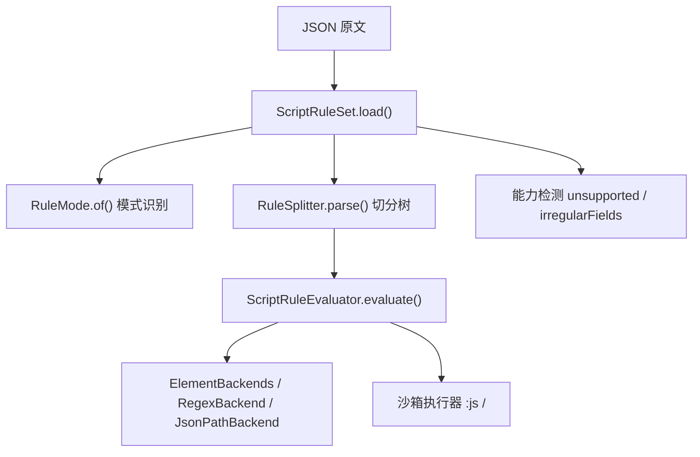
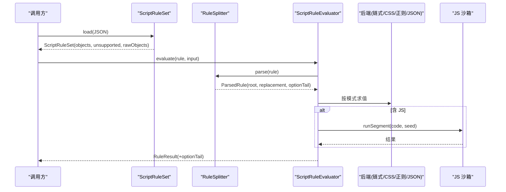
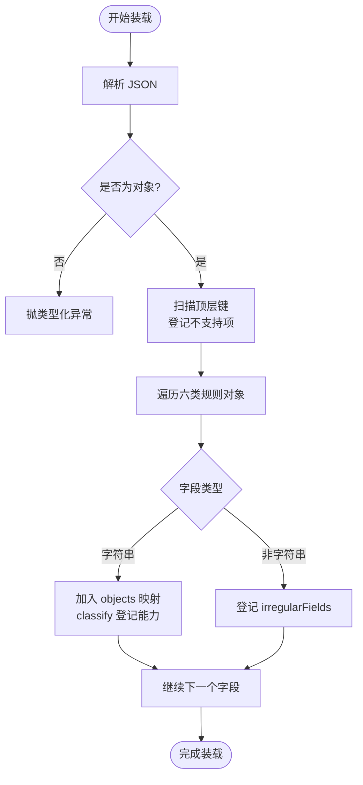
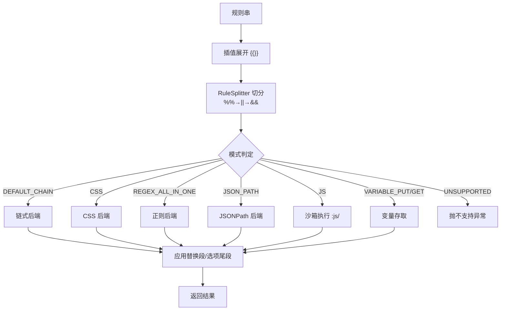
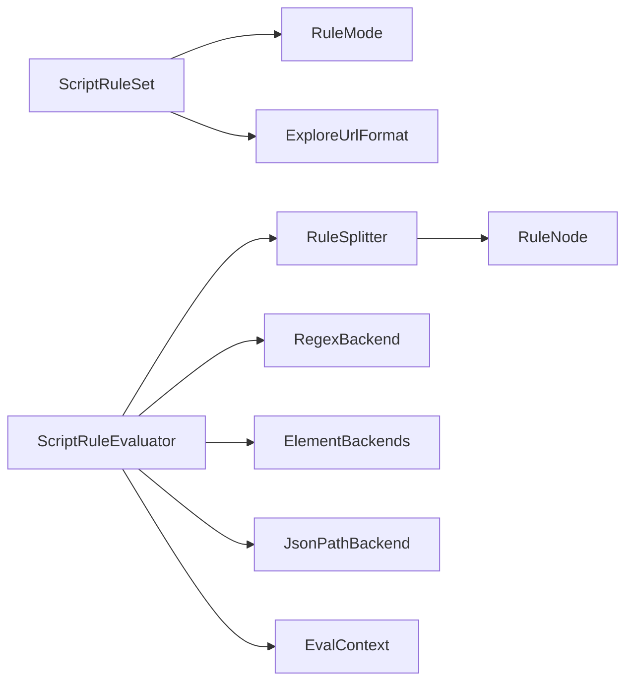

# 脚本规则引擎

<cite>
**本文引用的文件**
- [ScriptRuleSet.kt](file://lib_book_source/src/main/java/com/ebook/source/script/ScriptRuleSet.kt)
- [RuleMode.kt](file://lib_book_source/src/main/java/com/ebook/source/script/RuleMode.kt)
- [RuleSplitter.kt](file://lib_book_source/src/main/java/com/ebook/source/script/RuleSplitter.kt)
- [RuleNode.kt](file://lib_book_source/src/main/java/com/ebook/source/script/RuleNode.kt)
- [ScriptRuleEvaluator.kt](file://lib_book_source/src/main/java/com/ebook/source/script/ScriptRuleEvaluator.kt)
- [ExploreUrlFormat.kt](file://lib_book_source/src/main/java/com/ebook/source/script/ExploreUrlFormat.kt)
- [RegexBackend.kt](file://lib_book_source/src/main/java/com/ebook/source/script/RegexBackend.kt)
- [Interpolation.kt](file://lib_book_source/src/main/java/com/ebook/source/script/Interpolation.kt)
- [EvalContext.kt](file://lib_book_source/src/main/java/com/ebook/source/script/EvalContext.kt)
- [ScriptJson.kt](file://lib_book_source/src/main/java/com/ebook/source/script/ScriptJson.kt)
- [2026-09-08-script-source-rule-grammar.md](file://docs/superpowers/specs/2026-09-08-script-source-rule-grammar.md)
- [ScriptRuleSetTest.kt](file://lib_book_source/src/test/java/com/ebook/source/script/ScriptRuleSetTest.kt)
</cite>

## 目录
1. [简介](#简介)
2. [项目结构](#项目结构)
3. [核心组件](#核心组件)
4. [架构总览](#架构总览)
5. [详细组件分析](#详细组件分析)
6. [依赖关系分析](#依赖关系分析)
7. [性能考量](#性能考量)
8. [故障排查指南](#故障排查指南)
9. [结论](#结论)
10. [附录](#附录)

## 简介
本技术文档围绕“脚本规则引擎”展开，聚焦 ScriptRuleSet 的装载机制（原始 JSON 解析、规则分类、能力检测与异常处理），六种规则对象类型（搜索、发现、书籍信息、目录、正文）的规则语法，RuleMode 的工作机制（链式规则、CSS 选择器、正则 AllInOne、JavaScript 执行流程），以及规则的能力检测系统（JS/XPath/缓存前缀等）。文末提供规则编写指南与调试方法，覆盖常见错误模式与解决方案。规格参考见仓库中的“脚本源规则语法”规格文档。

## 项目结构
脚本规则引擎位于 lib_book_source 模块的 script 包内，采用“词法切分 → 求值分发 → 取文后端”的分层设计：
- 装载与能力检测：ScriptRuleSet
- 模式判定：RuleMode
- 规则切分与组合树：RuleSplitter + RuleNode
- 求值入口与组合逻辑：ScriptRuleEvaluator
- 插值与 URL 选项：Interpolation、URL 相关辅助（ExploreUrlFormat 等）
- 后端实现：RegexBackend 等
- 评估上下文：EvalContext
- 规格与测试：specs 与单元测试

图表来源
- [ScriptRuleSet.kt:139-238](file://lib_book_source/src/main/java/com/ebook/source/script/ScriptRuleSet.kt#L139-L238)
- [RuleMode.kt:43-117](file://lib_book_source/src/main/java/com/ebook/source/script/RuleMode.kt#L43-L117)
- [RuleSplitter.kt:40-70](file://lib_book_source/src/main/java/com/ebook/source/script/RuleSplitter.kt#L40-L70)
- [ScriptRuleEvaluator.kt:20-41](file://lib_book_source/src/main/java/com/ebook/source/script/ScriptRuleEvaluator.kt#L20-L41)

章节来源
- [ScriptRuleSet.kt:13-98](file://lib_book_source/src/main/java/com/ebook/source/script/ScriptRuleSet.kt#L13-L98)
- [RuleMode.kt:17-31](file://lib_book_source/src/main/java/com/ebook/source/script/RuleMode.kt#L17-L31)
- [RuleSplitter.kt:18-37](file://lib_book_source/src/main/java/com/ebook/source/script/RuleSplitter.kt#L18-L37)
- [ScriptRuleEvaluator.kt:5-17](file://lib_book_source/src/main/java/com/ebook/source/script/ScriptRuleEvaluator.kt#L5-L17)

## 核心组件
- ScriptRuleSet：负责装载书源 JSON、提取顶层字段与六类规则对象（搜索、发现、书籍信息、目录、正文）、记录非常规字段与不支持项，并提供 source 绑定 JSON 与 nextUrlArray 等工具方法。
- RuleMode：按标志表识别规则模式（默认链式、CSS、XPath、JSONPath、AllInOne、变量读写、JS、不支持），并剥离反序前缀与全取前缀。
- RuleSplitter：将规则串按优先级切分为组合树（%% → || → &&），剥出替换段与 URL 选项尾段；对 JS/AllInOne 做前置豁免。
- RuleNode：表示组合树的节点类型（Empty、Leaf、AllOf、FirstOf、Percent）。
- ScriptRuleEvaluator：执行规则求值，处理插值、组合符短路/合并/交错、取值器、正则净化、变量存取、JS 后位与内联 JS。
- ExploreUrlFormat：识别发现页的三种形态（文本、JSON、脚本程序），对脚本程序形态按空清单处置并登记为不支持。
- Interpolation：处理 {{}} 插值与 @put/@get 变量。
- EvalContext：保存变量表、键、JS 桥等上下文。
- RegexBackend：AllInOne 的正则后端。
- 规格文档：定义语法规则与行为边界。

章节来源
- [ScriptRuleSet.kt:13-98](file://lib_book_source/src/main/java/com/ebook/source/script/ScriptRuleSet.kt#L13-L98)
- [RuleMode.kt:17-31](file://lib_book_source/src/main/java/com/ebook/source/script/RuleMode.kt#L17-L31)
- [RuleSplitter.kt:18-37](file://lib_book_source/src/main/java/com/ebook/source/script/RuleSplitter.kt#L18-L37)
- [RuleNode.kt:3-32](file://lib_book_source/src/main/java/com/ebook/source/script/RuleNode.kt#L3-L32)
- [ScriptRuleEvaluator.kt:5-17](file://lib_book_source/src/main/java/com/ebook/source/script/ScriptRuleEvaluator.kt#L5-L17)
- [ExploreUrlFormat.kt](file://lib_book_source/src/main/java/com/ebook/source/script/ExploreUrlFormat.kt)
- [Interpolation.kt](file://lib_book_source/src/main/java/com/ebook/source/script/Interpolation.kt)
- [EvalContext.kt](file://lib_book_source/src/main/java/com/ebook/source/script/EvalContext.kt)
- [RegexBackend.kt](file://lib_book_source/src/main/java/com/ebook/source/script/RegexBackend.kt)
- [2026-09-08-script-source-rule-grammar.md](file://docs/superpowers/specs/2026-09-08-script-source-rule-grammar.md)

## 架构总览
脚本规则引擎遵循“声明式规则 + 可执行片段”的双轨求值：
- 装载阶段：解析 JSON、分类规则对象、标记不支持项与非常规字段。
- 词法阶段：按优先级切分规则串为组合树，剥离替换段与 URL 选项尾段。
- 求值阶段：展开插值、逐支求值（|| 短路、&& 合并、%% 交错）、应用正则净化、回附 URL 选项。
- 执行阶段：JS 分支经沙箱执行；XPath 暂不支持；JSONPath/链式/CSS/AllInOne 走各自后端。

图表来源
- [ScriptRuleSet.kt:139-238](file://lib_book_source/src/main/java/com/ebook/source/script/ScriptRuleSet.kt#L139-L238)
- [RuleSplitter.kt:40-70](file://lib_book_source/src/main/java/com/ebook/source/script/RuleSplitter.kt#L40-L70)
- [ScriptRuleEvaluator.kt:20-41](file://lib_book_source/src/main/java/com/ebook/source/script/ScriptRuleEvaluator.kt#L20-L41)

## 详细组件分析

### ScriptRuleSet 装载机制
- 原始 JSON 解析：使用内部 JSON 解析器，非法 JSON 抛出类型化异常；仅接受单对象（数组在导入链路已拆分）。
- 顶层字段提取：保留 searchUrl/exploreUrl 等 URL 选项位置，其他源级字段一律缺失即空串。
- 规则对象分类：遍历六类规则对象的每个字段，字符串态进入 objects 映射；非字符串态（数组/对象/数字）不入规则表，登记到 irregularFields。
- 能力检测：
  - 源级键检测：loginUrl/jsLib/coverDecodeJs/exploreScreen/bookUrlPattern/ruleReview 等存在即登记为不支持或延后。
  - 规则内容检测：ruleContent.webJs、ruleContent.sourceRegex、ruleBookInfo.downloadUrls 等按键名登记。
  - 规则串能力：通过 RuleMode.of(rule).mode 判断是否包含 JS/XPath，或 UNSUPPORTED(@cache:) 登记 CACHE_PREFIX 与 irregularFields。
  - exploreUrl 脚本程序形态：以 <js> 开头且整串为脚本程序时，登记 EXPLORE_URL_SCRIPT，不走 classify 避免误判为 JS。
- 异常处理：非法 JSON 抛类型化异常；未知键忽略；布尔键缺失按 true；源级字段缺失按空串。

图表来源
- [ScriptRuleSet.kt:139-238](file://lib_book_source/src/main/java/com/ebook/source/script/ScriptRuleSet.kt#L139-L238)
- [ScriptRuleSet.kt:240-273](file://lib_book_source/src/main/java/com/ebook/source/script/ScriptRuleSet.kt#L240-L273)

章节来源
- [ScriptRuleSet.kt:13-98](file://lib_book_source/src/main/java/com/ebook/source/script/ScriptRuleSet.kt#L13-L98)
- [ScriptRuleSet.kt:139-238](file://lib_book_source/src/main/java/com/ebook/source/script/ScriptRuleSet.kt#L139-L238)
- [ScriptRuleSet.kt:240-273](file://lib_book_source/src/main/java/com/ebook/source/script/ScriptRuleSet.kt#L240-L273)
- [ScriptRuleSetTest.kt:10-237](file://lib_book_source/src/test/java/com/ebook/source/script/ScriptRuleSetTest.kt#L10-L237)

### 六种规则对象类型的脚本语法
- ruleSearch（搜索结果）：列表字段 bookList 必须存在；name/author/bookUrl 等为字段规则，支持链式/CSS/JSONPath/AllInOne/变量/插值。
- ruleExplore（发现列表）：字段集合与 ruleSearch 相同，输入来自 exploreUrl 的分类页。
- ruleBookInfo（书籍信息）：init 预处理（正则 AllInOne 首个匹配为条目上下文，字段按 $n 取值；JS 分支待 Plan 3）；tocUrl 支持单个 URL；downloadUrls 延后。
- ruleToc（目录解析）：chapterList/chapterName/chapterUrl 字段规则；nextTocUrl 支持单个 URL 或 URL 数组；翻页链固定页序访问。
- ruleContent（内容解析）：content 正文；replaceRegex 净化；nextContentUrl 同章分页；webJs/sourceRegex/contentBatch 延后或不支持。
- ruleReview（段评/章说）：不实现，若存在登记为不支持。

章节来源
- [2026-09-08-script-source-rule-grammar.md:56-123](file://docs/superpowers/specs/2026-09-08-script-source-rule-grammar.md#L56-L123)
- [ScriptRuleSet.kt:13-19](file://lib_book_source/src/main/java/com/ebook/source/script/ScriptRuleSet.kt#L13-L19)

### RuleMode 工作机制与执行流程
- 模式识别：按标志表顺序匹配（@@、@css:、@xpath:/ //、@json:/ $.、@js:、<js>、@put:/@get:、@cache:、: 开头 AllInOne），大小写不敏感；<js> 可出现在任意位置作为分隔符，先于其余标志判定。
- 组合符次序：%% 优先 → || 短路 → && 合并；JS/AllInOne 在进入组合循环前豁免。
- 执行流程：
  - 插值展开：{{}} 在切分前展开为占位，之后回填。
  - 切分与树构建：RuleSplitter 产出组合树。
  - 逐支求值：DEFAULT_CHAIN/CSS/REGEX_ALL_IN_ONE/JSON_PATH/VARIABLE_PUT/VARIABLE_GET/JS/UNSUPPORTED。
  - 替换与选项：应用 ## 替换段与 URL 选项尾段。
  - 反序：每条规则段的 - 前缀生效于该段最终产物。

图表来源
- [RuleMode.kt:43-117](file://lib_book_source/src/main/java/com/ebook/source/script/RuleMode.kt#L43-L117)
- [RuleSplitter.kt:40-70](file://lib_book_source/src/main/java/com/ebook/source/script/RuleSplitter.kt#L40-L70)
- [ScriptRuleEvaluator.kt:20-41](file://lib_book_source/src/main/java/com/ebook/source/script/ScriptRuleEvaluator.kt#L20-L41)

章节来源
- [RuleMode.kt:17-31](file://lib_book_source/src/main/java/com/ebook/source/script/RuleMode.kt#L17-L31)
- [RuleMode.kt:43-117](file://lib_book_source/src/main/java/com/ebook/source/script/RuleMode.kt#L43-L117)
- [RuleSplitter.kt:18-37](file://lib_book_source/src/main/java/com/ebook/source/script/RuleSplitter.kt#L18-L37)
- [ScriptRuleEvaluator.kt:87-217](file://lib_book_source/src/main/java/com/ebook/source/script/ScriptRuleEvaluator.kt#L87-L217)

### 能力检测系统
- 源级能力：loginUrl/jsLib/coverDecodeJs/exploreScreen/bookUrlPattern/ruleReview 等键存在即登记为不支持或延后。
- 规则内容能力：ruleContent.webJs、ruleContent.sourceRegex、ruleBookInfo.downloadUrls 等按键名登记。
- 规则串能力：
  - JS：RuleMode.JS 登记为 JS 不支持项。
  - XPath：RuleMode.XPATH 登记为 XPath 不支持项。
  - 缓存前缀：RuleMode.UNSUPPORTED(@cache:) 登记为 CACHE_PREFIX，并将路径记入 irregularFields。
- exploreUrl 脚本程序形态：单独登记为 EXPLORE_URL_SCRIPT，不走 classify，避免误报 JS。

章节来源
- [ScriptRuleSet.kt:149-167](file://lib_book_source/src/main/java/com/ebook/source/script/ScriptRuleSet.kt#L149-L167)
- [ScriptRuleSet.kt:247-265](file://lib_book_source/src/main/java/com/ebook/source/script/ScriptRuleSet.kt#L247-L265)
- [ScriptRuleSetTest.kt:65-109](file://lib_book_source/src/test/java/com/ebook/source/script/ScriptRuleSetTest.kt#L65-L109)

### 规则编写指南与调试方法
- 编写要点：
  - 明确字段口径：单值字段取 firstText，列表字段取全部。
  - 合理使用组合符：|| 兜底、&& 合并、%% 交错。
  - 使用 CSS/链式/JSONPath/AllInOne 根据站点结构选择合适模式。
  - URL 选项尾段：仅在“结果本身就是 URL”时有效，否则用 ##$##,{...} 惯用法。
  - 插值：URL 位 {{key}}/{{page}} 仅 JS；其他规则位需带标志头（无标志按 JS）。
- 调试方法：
  - 查看 unsupported 与 irregularFields：导入预览应能逐项提示缺口。
  - 利用 || 短路定位失败分支，关注类型化异常消息（规则语法错误/需脚本沙箱执行器/本项目不支持）。
  - 对于 JS 分支，确认沙箱执行器是否装配；未装配抛“需脚本沙箱执行器”，装配失败抛“脚本执行失败”。
  - 检查 exploreUrl 是否为脚本程序形态，避免误当 URL 文本发送请求。

章节来源
- [ScriptRuleEvaluator.kt:87-217](file://lib_book_source/src/main/java/com/ebook/source/script/ScriptRuleEvaluator.kt#L87-L217)
- [ScriptRuleSet.kt:139-238](file://lib_book_source/src/main/java/com/ebook/source/script/ScriptRuleSet.kt#L139-L238)
- [2026-09-08-script-source-rule-grammar.md:518-543](file://docs/superpowers/specs/2026-09-08-script-source-rule-grammar.md#L518-L543)

## 依赖关系分析
- ScriptRuleSet 依赖 ScriptJson、RuleMode、ExploreUrlFormat 进行解析与能力检测。
- RuleSplitter 依赖 RuleMode、RuleScanner（内部工具）生成 RuleNode 树。
- ScriptRuleEvaluator 依赖 RuleSplitter、Interpolation、各后端（ElementBackends/RegexBackend/JsonPathBackend）与沙箱执行器。
- EvalContext 提供变量表与 JS 桥，贯穿求值过程。

图表来源
- [ScriptRuleSet.kt:139-238](file://lib_book_source/src/main/java/com/ebook/source/script/ScriptRuleSet.kt#L139-L238)
- [RuleSplitter.kt:40-70](file://lib_book_source/src/main/java/com/ebook/source/script/RuleSplitter.kt#L40-L70)
- [ScriptRuleEvaluator.kt:20-41](file://lib_book_source/src/main/java/com/ebook/source/script/ScriptRuleEvaluator.kt#L20-L41)

章节来源
- [ScriptRuleSet.kt:139-238](file://lib_book_source/src/main/java/com/ebook/source/script/ScriptRuleSet.kt#L139-L238)
- [RuleSplitter.kt:40-70](file://lib_book_source/src/main/java/com/ebook/source/script/RuleSplitter.kt#L40-L70)
- [ScriptRuleEvaluator.kt:20-41](file://lib_book_source/src/main/java/com/ebook/source/script/ScriptRuleEvaluator.kt#L20-L41)

## 性能考量
- 装载期仅做轻量分类与能力登记，不解析规则内容，避免导入耗时。
- 求值期按需展开插值与切分，组合符短路减少不必要求值。
- JS 执行隔离于沙箱进程，限制资源与超时，避免主线程阻塞。
- URL 选项尾段仅在必要时附加，减少无效网络开销。

[本节为通用指导，无需具体文件引用]

## 故障排查指南
- 非法 JSON：捕获 ScriptRuleParseException，检查 JSON 格式与导入链路是否正确拆分数组。
- 能力缺失：检查 unsupported 列表，确认是否依赖登录、webJs、XPath、JS_LIB 等未实现能力。
- 非常规字段：irregularFields 指出非字符串字段，需确认是否为 URL 数组或对象，交由求值层处理。
- 规则语法错误：类型化异常消息包含规则原文与前缀，定位 @@/||/&&/%% 组合或模式标志问题。
- JS 执行失败：区分“需脚本沙箱执行器”与“脚本执行失败”，前者为环境配置问题，后者为内核报错。
- exploreUrl 脚本程序：避免将其当 URL 文本发送，应登记为 EXPLORE_URL_SCRIPT 并按空清单处置。

章节来源
- [ScriptRuleSet.kt:139-238](file://lib_book_source/src/main/java/com/ebook/source/script/ScriptRuleSet.kt#L139-L238)
- [ScriptRuleSetTest.kt:209-237](file://lib_book_source/src/test/java/com/ebook/source/script/ScriptRuleSetTest.kt#L209-L237)
- [ScriptRuleEvaluator.kt:87-217](file://lib_book_source/src/main/java/com/ebook/source/script/ScriptRuleEvaluator.kt#L87-L217)

## 结论
脚本规则引擎通过严格的装载、词法切分与求值分发，实现了多模式、可扩展的规则解析体系。ScriptRuleSet 的装载机制确保能力检测准确、异常处理清晰；RuleMode 与 RuleSplitter 保证规则语义确定；ScriptRuleEvaluator 提供灵活的求值流程与错误传播。未来可按规格逐步补齐延后能力，并持续完善真实源验证与金标准用例。

[本节为总结，无需具体文件引用]

## 附录
- 规格参考：脚本源规则语法文档定义了完整的规则语言行为与边界。
- 测试用例：ScriptRuleSetTest 覆盖了装载、能力检测、source 绑定、exploreUrl 形态等关键场景。

章节来源
- [2026-09-08-script-source-rule-grammar.md](file://docs/superpowers/specs/2026-09-08-script-source-rule-grammar.md)
- [ScriptRuleSetTest.kt:10-237](file://lib_book_source/src/test/java/com/ebook/source/script/ScriptRuleSetTest.kt#L10-L237)