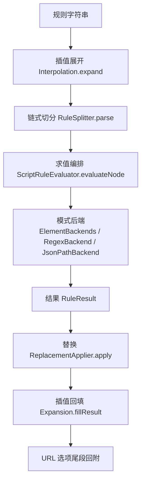
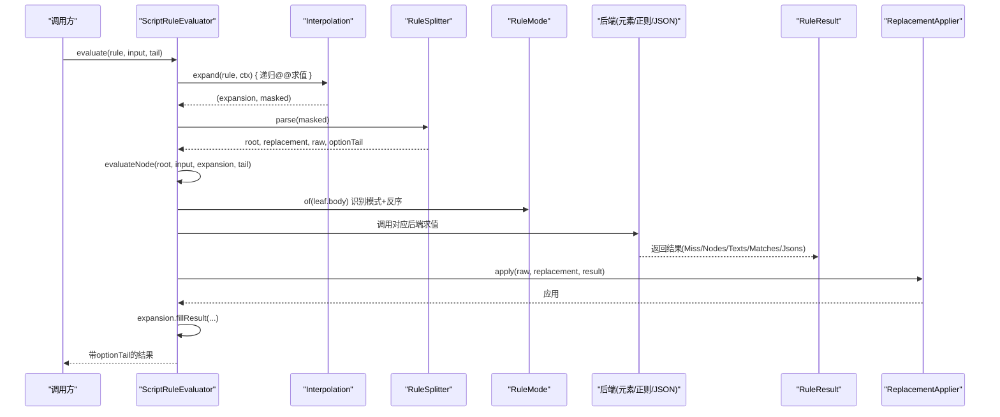
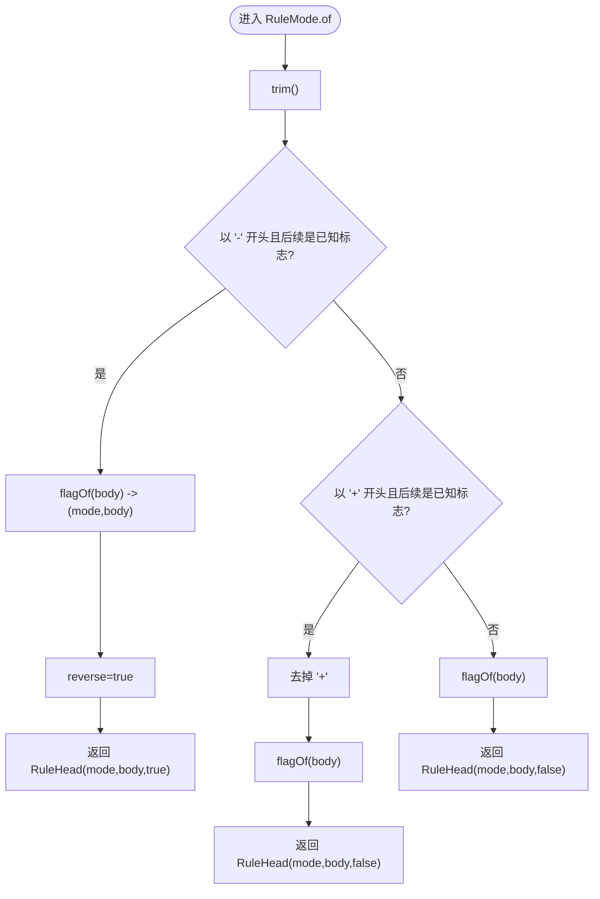
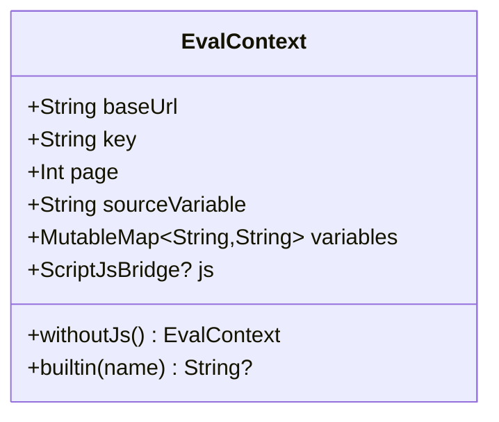
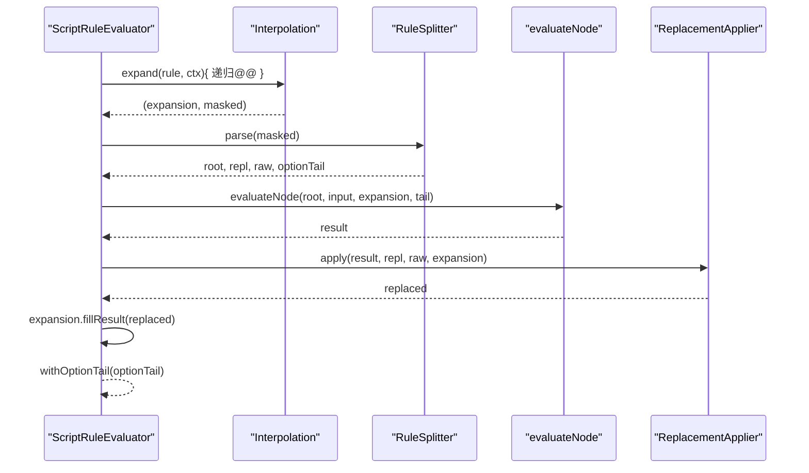
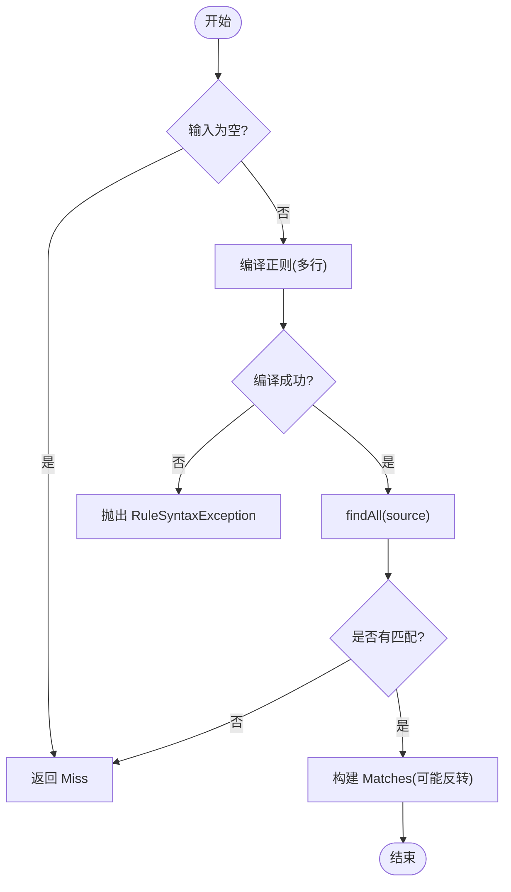
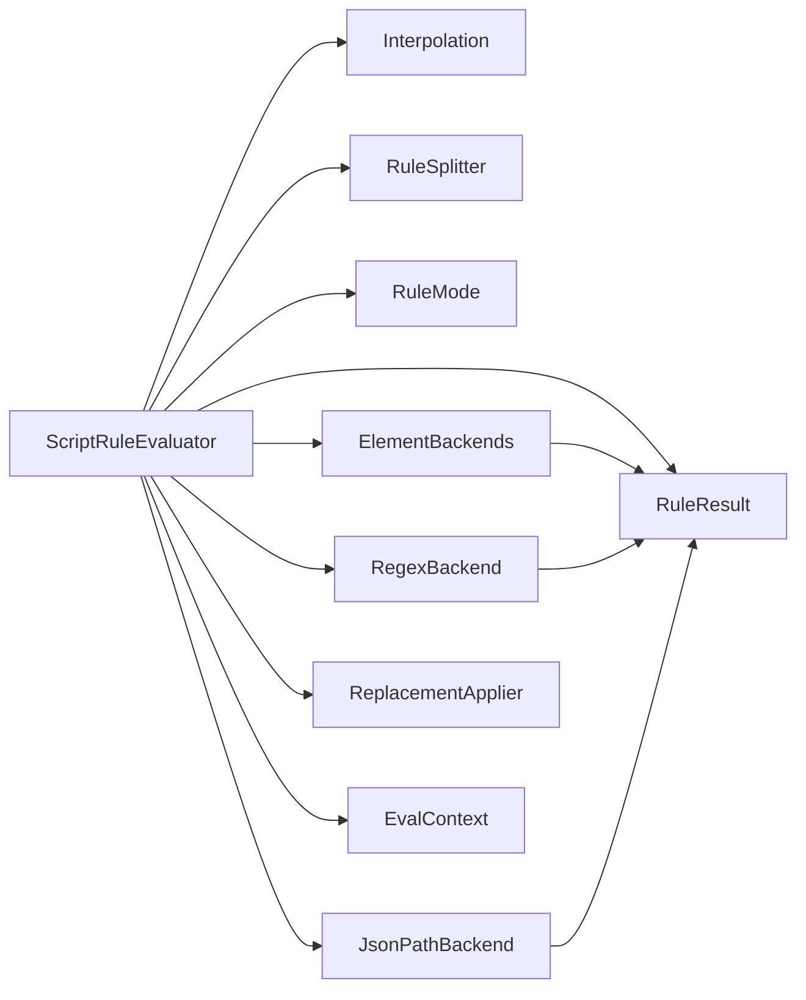

# 规则模式与求值

<cite>
**本文引用的文件**
- [RuleMode.kt](file://lib_book_source/src/main/java/com/ebook/source/script/RuleMode.kt)
- [EvalContext.kt](file://lib_book_source/src/main/java/com/ebook/source/script/EvalContext.kt)
- [ScriptRuleEvaluator.kt](file://lib_book_source/src/main/java/com/ebook/source/script/ScriptRuleEvaluator.kt)
- [RegexBackend.kt](file://lib_book_source/src/main/java/com/ebook/source/script/RegexBackend.kt)
- [JsonPathBackend.kt](file://lib_book_source/src/main/java/com/ebook/source/script/JsonPathBackend.kt)
- [ElementBackends.kt](file://lib_book_source/src/main/java/com/ebook/source/script/ElementBackends.kt)
- [Interpolation.kt](file://lib_book_source/src/main/java/com/ebook/source/script/Interpolation.kt)
- [ReplacementApplier.kt](file://lib_book_source/src/main/java/com/ebook/source/script/ReplacementApplier.kt)
- [RuleResult.kt](file://lib_book_source/src/main/java/com/ebook/source/script/RuleResult.kt)
- [RuleValue.kt](file://lib_book_source/src/main/java/com/ebook/source/script/RuleValue.kt)
- [ChainLink.kt](file://lib_book_source/src/main/java/com/ebook/source/script/ChainLink.kt)
- [ScriptFieldExtractor.kt](file://lib_book_source/src/main/java/com/ebook/source/script/ScriptFieldExtractor.kt)
- [RuleSplitterTest.kt](file://lib_book_source/src/test/java/com/ebook/source/script/RuleSplitterTest.kt)
- [RuleModeTest.kt](file://lib_book_source/src/test/java/com/ebook/source/script/RuleModeTest.kt)
- [EvalContextTest.kt](file://lib_book_source/src/test/java/com/ebook/source/script/EvalContextTest.kt)
- [2026-09-08-script-source-rule-grammar.md](file://docs/superpowers/specs/2026-09-08-script-source-rule-grammar.md)
</cite>

## 目录
1. [引言](#引言)
2. [项目结构](#项目结构)
3. [核心组件](#核心组件)
4. [架构总览](#架构总览)
5. [详细组件分析](#详细组件分析)
6. [依赖关系分析](#依赖关系分析)
7. [性能考虑](#性能考虑)
8. [故障排查指南](#故障排查指南)
9. [结论](#结论)
10. [附录：编写示例与最佳实践](#附录编写示例与最佳实践)

## 引言
本文件聚焦“规则模式与求值”的完整机制，覆盖 RuleMode 枚举的模式判定、链式规则的解析与执行、各后端（CSS、正则 AllInOne、JSONPath、JavaScript）的执行流程；同时说明 EvalContext 的状态管理（变量作用域、中间结果传递、错误传播）、结果标准化处理（空值、类型转换、性能优化），并结合测试与规格文档给出可操作的最佳实践。

## 项目结构
规则解析与求值集中在 lib_book_source 模块的 script 包中，关键职责划分如下：
- 词法与模式识别：RuleMode（标志表与反序前缀剥离）、RuleSplitter（链式切分）
- 求值编排：ScriptRuleEvaluator（展开插值、组合符、分支合并、替换段、尾段回附）
- 模式后端：ElementBackends（链式选择器/CSS）、RegexBackend（正则 AllInOne）、JsonPathBackend（JSONPath）
- 上下文与状态：EvalContext（baseUrl/key/page/变量表/JS 桥）
- 数据与结果：RuleValue（输入）、RuleResult（输出）、ChainLink（链式节点）
- 辅助能力：Interpolation（{{}} 插值）、ReplacementApplier（## 替换段）

图示来源
- [ScriptRuleEvaluator.kt:20-41](file://lib_book_source/src/main/java/com/ebook/source/script/ScriptRuleEvaluator.kt#L20-L41)
- [RuleMode.kt:49-116](file://lib_book_source/src/main/java/com/ebook/source/script/RuleMode.kt#L49-L116)

章节来源
- [ScriptRuleEvaluator.kt:20-41](file://lib_book_source/src/main/java/com/ebook/source/script/ScriptRuleEvaluator.kt#L20-L41)
- [RuleMode.kt:49-116](file://lib_book_source/src/main/java/com/ebook/source/script/RuleMode.kt#L49-L116)

## 核心组件
- RuleMode：负责“模式 + 载荷 + 反序”三位一体的识别与前缀剥除，支持默认链式、CSS、XPath、JSONPath、正则 AllInOne、变量存取、JS、不支持等模式。
- EvalContext：单次解析任务的可变上下文，包含 baseUrl、key、page、sourceVariable、variables、js 桥；提供 withoutJs() 用于嵌套求值隔离视图但共享变量表。
- ScriptRuleEvaluator：求值入口，按规格顺序执行插值→切分→逐支求值→替换段→尾段回附；组合符 ||/&&/%% 在此编排。
- 模式后端：
  - ElementBackends：链式选择器/CSS 模式，作用于 HTML DOM。
  - RegexBackend：正则 AllInOne，对整源文本进行多行匹配，产出条目×捕获组二维结构。
  - JsonPathBackend：JSONPath，作用于 JSON 上下文，保留节点形态供子字段继续取值。
- RuleResult：统一输出 Miss/Nodes/Texts/Matches/Jsons，并提供 firstText/toTextList/mapToTexts/jsonText 等标准化方法。

章节来源
- [RuleMode.kt:31-116](file://lib_book_source/src/main/java/com/ebook/source/script/RuleMode.kt#L31-L116)
- [EvalContext.kt:25-83](file://lib_book_source/src/main/java/com/ebook/source/script/EvalContext.kt#L25-L83)
- [ScriptRuleEvaluator.kt:18-100](file://lib_book_source/src/main/java/com/ebook/source/script/ScriptRuleEvaluator.kt#L18-L100)
- [RuleResult.kt:19-120](file://lib_book_source/src/main/java/com/ebook/source/script/RuleResult.kt#L19-L120)

## 架构总览
规则求值的关键阶段与数据流向如下：

图示来源
- [ScriptRuleEvaluator.kt:20-41](file://lib_book_source/src/main/java/com/ebook/source/script/ScriptRuleEvaluator.kt#L20-L41)
- [RuleMode.kt:49-116](file://lib_book_source/src/main/java/com/ebook/source/script/RuleMode.kt#L49-L116)

章节来源
- [ScriptRuleEvaluator.kt:20-41](file://lib_book_source/src/main/java/com/ebook/source/script/ScriptRuleEvaluator.kt#L20-L41)

## 详细组件分析

### RuleMode：模式判定与前缀剥除
- 职责
  - 识别规则前缀并剥除，返回 RuleHead(mode, body, reverse)。
  - 支持反序前导“-”与显式“+”（全取前缀语义在默认列表模式下等价 no-op）。
  - 标志键不区分大小写；`<js>` 标签在任何位置出现即整体走 JS 分支。
- 模式清单
  - DEFAULT_CHAIN：默认链式模式（显式 `@@` 会被剥掉，避免下游误切）。
  - CSS：`@css:` 选择器。
  - XPATH：`@xpath:` 或 `//` 开头。
  - JSON_PATH：`@json:` 或 `$.` 或旧格式 `{...}`（剥去花括号后按 JSONPath）。
  - REGEX_ALL_IN_ONE：以 `:` 开头的正则 AllInOne。
  - VARIABLE_PUT/VARIABLE_GET：`@put:`/`@get:`。
  - JS：`@js:` 或包含 `<js>`。
  - UNSUPPORTED：如 `@cache:` 装载期登记为不支持。
- 复杂度
  - 时间 O(L)，L 为规则串长度；空间 O(1) 额外开销（不含 payload）。

图示来源
- [RuleMode.kt:49-116](file://lib_book_source/src/main/java/com/ebook/source/script/RuleMode.kt#L49-L116)

章节来源
- [RuleMode.kt:49-116](file://lib_book_source/src/main/java/com/ebook/source/script/RuleMode.kt#L49-L116)
- [RuleModeTest.kt:1-120](file://lib_book_source/src/test/java/com/ebook/source/script/RuleModeTest.kt#L1-L120)

### EvalContext：求值上下文与作用域
- 职责
  - 维护 baseUrl、key、page、sourceVariable、variables、js 桥。
  - 提供 withoutJs() 用于嵌套求值时关闭 JS 视图，但共享 variables 引用，保证内层 @put 外层 @get 可见。
  - builtin(name) 暴露 key/page/baseUrl 给插值层。
- 作用域与线程
  - 作用域为单次解析任务（一次求值），跨请求不可持久化。
  - js 桥构造需 ctx，采用先建 ctx 再回填的方式避免环；沙箱回调嵌套求值禁止再次启用 JS。
- 变量表
  - LinkedHashMap 保序写入，便于错误日志可读；同键后写覆盖先写。

图示来源
- [EvalContext.kt:25-83](file://lib_book_source/src/main/java/com/ebook/source/script/EvalContext.kt#L25-L83)

章节来源
- [EvalContext.kt:25-83](file://lib_book_source/src/main/java/com/ebook/source/script/EvalContext.kt#L25-L83)
- [EvalContextTest.kt:20-50](file://lib_book_source/src/test/java/com/ebook/source/script/EvalContextTest.kt#L20-L50)

### ScriptRuleEvaluator：求值编排与组合符
- 流程
  1) 插值展开：Interpolation.expand 递归处理 @@ 内层规则，产物以 Expansion 携带到使用点回填。
  2) 切分：RuleSplitter.parse 得到根节点、替换段、原始规则与 URL 选项尾段。
  3) 逐支求值：evaluateNode 根据节点类型分发 Leaf/AllOf/Percent/FirstOf。
  4) 替换段：ReplacementApplier.apply 将 ## 替换应用到结果。
  5) 回填与尾段：Expansion.fillResult 回填占位；optionTail 作为 URL 选项尾段附加。
- 组合符
  - || 短路取第一个非 Miss 的分支；全部失败时抛出最后一个错误，避免把语法错误伪装成无结果。
  - && 顺序合并多个字段的取值。
  - %% 交错流合并。
- 字段级取值
  - evaluateOnItem：对正则 AllInOne 的每个条目按 $n 组引用或链式规则取值。
  - evaluateOnJsonItem：对 JSONPath 解出的每个条目按子字段规则取值。

图示来源
- [ScriptRuleEvaluator.kt:20-100](file://lib_book_source/src/main/java/com/ebook/source/script/ScriptRuleEvaluator.kt#L20-L100)

章节来源
- [ScriptRuleEvaluator.kt:20-100](file://lib_book_source/src/main/java/com/ebook/source/script/ScriptRuleEvaluator.kt#L20-L100)

### 模式后端详解

#### 链式选择器/CSS（ElementBackends）
- 输入：RuleValue.Page/Nodes/Texts，内部会转为 HTML 片段进行解析。
- 行为：按链式节点逐步筛选元素，最终产出 Nodes/Texts/Matches/Jsons 之一（由后继节点决定）。
- 取值器：text/ownText/textNodes/html/all/href/src/@属性名等，缺失属性跳过而非补空串。

章节来源
- [ElementBackends.kt](file://lib_book_source/src/main/java/com/ebook/source/script/ElementBackends.kt)
- [RuleResult.kt:70-120](file://lib_book_source/src/main/java/com/ebook/source/script/RuleResult.kt#L70-L120)

#### 正则 AllInOne（RegexBackend）
- 模式：以 `:` 开头，对整源文本进行多行匹配。
- 输入：Page/Nodes/Texts 均转文本；JSON 上下文拒绝（抛 UnsupportedRuleFeatureException）。
- 输出：Matches（条目×捕获组二维），reverse 反转列表。
- 错误：非法正则抛出类型化 RuleSyntaxException，可在 || 中被当作未取到值继续下一支。

图示来源
- [RegexBackend.kt:24-47](file://lib_book_source/src/main/java/com/ebook/source/script/RegexBackend.kt#L24-L47)

章节来源
- [RegexBackend.kt:24-47](file://lib_book_source/src/main/java/com/ebook/source/script/RegexBackend.kt#L24-L47)

#### JSONPath（JsonPathBackend）
- 模式：`$.` 或 `@json:` 或旧 `{...}`（剥花括号后按 JSONPath）。
- 输入：RuleValue.Json；输出：Jsons（保留节点形态，以便子字段继续取值）。
- 行为：遵循半开区间切片标准；过滤器 `[?(…)]` 在当前实现口径下不支持。

章节来源
- [JsonPathBackend.kt](file://lib_book_source/src/main/java/com/ebook/source/script/JsonPathBackend.kt)
- [RuleMode.kt:105-113](file://lib_book_source/src/main/java/com/ebook/source/script/RuleMode.kt#L105-L113)

#### JavaScript（JS 分支）
- 触发：`@js:` 或任意位置出现 `<js>`。
- 执行：通过 EvalContext.js 桥至沙箱执行器；未装配时抛 JsEvaluationPendingException（消息含“需脚本沙箱执行器”）。
- 限制：嵌套求值不得再要 JS（via withoutJs）。

章节来源
- [ScriptRuleEvaluator.kt:76-84](file://lib_book_source/src/main/java/com/ebook/source/script/ScriptRuleEvaluator.kt#L76-L84)
- [EvalContext.kt:54-68](file://lib_book_source/src/main/java/com/ebook/source/script/EvalContext.kt#L54-L68)

### 链式规则解析与选择器编译
- 链式切分：RuleSplitter 将规则串切分为若干段（含组合符 ||/&&/%%），并在进入切分主循环前完成三项前置例外：`@js:`/`<js>`、正则 AllInOne 冒号前缀、列表反序 `-`。
- 选择器编译：ElementBackends 将链式段编译为逐步筛选的 DOM 查询，避免一次性复杂选择器带来的性能问题。

章节来源
- [RuleMode.kt:72-81](file://lib_book_source/src/main/java/com/ebook/source/script/RuleMode.kt#L72-L81)
- [RuleSplitterTest.kt](file://lib_book_source/src/test/java/com/ebook/source/script/RuleSplitterTest.kt)

### 求值结果的标准化处理
- 空值与 Miss：RuleResult.Miss 独立存在，防止 || 短路失效。
- 类型转换：
  - firstText()：单值收敛（Miss→""，其余取首项）。
  - toTextList(accessor?)：多值场景统一落文本（Nodes/Texts/Matches/Jsons 分别处理）。
  - mapToTexts()/jsonText()：JSON 节点→文本，null→空串，对象/数组→紧凑 JSON。
- 性能优化：
  - 插值展开产物以 Expansion 形式延后回填，避免重复解析。
  - 正则 AllInOne 使用多行模式，减少二次拼接成本。
  - 属性取值缺失跳过空串，避免无效候选扩散。

章节来源
- [RuleResult.kt:19-120](file://lib_book_source/src/main/java/com/ebook/source/script/RuleResult.kt#L19-L120)
- [ScriptRuleEvaluator.kt:20-41](file://lib_book_source/src/main/java/com/ebook/source/script/ScriptRuleEvaluator.kt#L20-L41)

## 依赖关系分析
- 模块内依赖
  - ScriptRuleEvaluator 依赖 Interpolation、RuleSplitter、RuleMode、各后端、ReplacementApplier、RuleResult。
  - EvalContext 被 ScriptRuleEvaluator 与各后端共享，提供 baseUrl/key/page/变量表/JS 桥。
  - 各后端依赖 RuleValue/RuleResult 进行输入输出。
- 外部依赖
  - 正则引擎（Kotlin stdlib Regex）。
  - Jsoup（DOM 解析与选择器）。
  - kotlinx.serialization（JSON 节点）。

图示来源
- [ScriptRuleEvaluator.kt:20-100](file://lib_book_source/src/main/java/com/ebook/source/script/ScriptRuleEvaluator.kt#L20-L100)
- [RuleMode.kt:49-116](file://lib_book_source/src/main/java/com/ebook/source/script/RuleMode.kt#L49-L116)

章节来源
- [ScriptRuleEvaluator.kt:20-100](file://lib_book_source/src/main/java/com/ebook/source/script/ScriptRuleEvaluator.kt#L20-L100)

## 性能考虑
- 插值延迟回填：Expansion 仅在必要时填充，减少重复计算。
- 正则多行匹配：AllInOne 使用多行模式，适配常见按行切条目的语料。
- 属性取值过滤：缺失属性直接跳过，避免无效候选污染下游。
- 链式选择器：分段筛选降低单次复杂选择器的代价。
- 变量表有序：LinkedHashMap 便于调试与定位多次写入顺序问题。

[本节为通用指导，不直接分析具体文件]

## 故障排查指南
- 语法错误
  - 正则非法：RegexBackend 抛出 RuleSyntaxException；|| 链可将该支视为未取到值继续尝试其他分支。
  - JSONPath 过滤器：当前实现不支持 `[?(…)]`，应改为支持的表达式。
- 执行错误
  - JS 未装配：抛 JsEvaluationPendingException，提示需脚本沙箱执行器。
  - 不支持特性：如 `@cache:` 在装载期记入 unsupported，运行时抛出 UnsupportedRuleFeatureException。
- 空值与无结果
  - Miss 不等于空列表：确保 || 短路逻辑正确；单值字段收敛用 firstText()。
- 变量作用域
  - 变量表按任务隔离；不同 EvalContext 之间不共享变量；嵌套求值 via withoutJs 共享 variables 引用。

章节来源
- [RegexBackend.kt:35-42](file://lib_book_source/src/main/java/com/ebook/source/script/RegexBackend.kt#L35-L42)
- [ScriptRuleEvaluator.kt:76-84](file://lib_book_source/src/main/java/com/ebook/source/script/ScriptRuleEvaluator.kt#L76-L84)
- [EvalContextTest.kt:20-50](file://lib_book_source/src/test/java/com/ebook/source/script/EvalContextTest.kt#L20-L50)

## 结论
本项目实现了完整的规则模式识别与求值框架：RuleMode 负责模式判定与前缀剥除，ScriptRuleEvaluator 统筹插值、切分、组合符、后端求值与替换段，EvalContext 管理上下文与作用域，RuleResult 统一输出与标准化。各模式后端职责清晰、错误类型化、性能友好，并通过测试与规格文档锁定行为。实际使用中，建议优先选择声明式模式（CSS/JSONPath），在复杂场景使用正则 AllInOne 或 JS 分支，并注意作用域与错误传播。

[本节总结性内容，不直接分析具体文件]

## 附录：编写示例与最佳实践

- 默认链式模式
  - 用途：从 HTML 中选择器取文本/属性。
  - 要点：合理使用链式分段，避免复杂选择器；缺失属性自动跳过。
  - 参考：[RuleModeTest.kt:20-34](file://lib_book_source/src/test/java/com/ebook/source/script/RuleModeTest.kt#L20-L34)

- CSS 模式
  - 前缀：`@css:`。
  - 用法：适用于结构化页面，稳定且易读。
  - 参考：[RuleModeTest.kt:36-42](file://lib_book_source/src/test/java/com/ebook/source/script/RuleModeTest.kt#L36-L42)

- XPath 模式
  - 前缀：`@xpath:` 或 `//`。
  - 注意：当前以 XPATH 模式标识，实际执行路径由后端实现决定。
  - 参考：[RuleModeTest.kt:44-59](file://lib_book_source/src/test/java/com/ebook/source/script/RuleModeTest.kt#L44-L59)

- JSONPath 模式
  - 前缀：`@json:` 或 `$.`；旧 `{...}` 剥花括号后等同 JSONPath。
  - 用法：对 JSON 数据做字段抽取；保持节点形态以便子字段继续取值。
  - 参考：[RuleModeTest.kt:61-73](file://lib_book_source/src/test/java/com/ebook/source/script/RuleModeTest.kt#L61-L73)

- 正则 AllInOne 模式
  - 前缀：`:`。
  - 用法：对整个源文本进行多行匹配，产出条目×捕获组二维结构；字段通过 $n 引用。
  - 注意：JSON 上下文不支持；非法正则抛类型化错误。
  - 参考：[RuleModeTest.kt:75-81](file://lib_book_source/src/test/java/com/ebook/source/script/RuleModeTest.kt#L75-L81)、[RegexBackend.kt:24-47](file://lib_book_source/src/main/java/com/ebook/source/script/RegexBackend.kt#L24-L47)

- JavaScript 模式
  - 前缀：`@js:` 或 `<js>`。
  - 用法：在沙箱中执行脚本；未装配执行器时抛 JsEvaluationPendingException。
  - 参考：[RuleModeTest.kt:83-93](file://lib_book_source/src/test/java/com/ebook/source/script/RuleModeTest.kt#L83-L93)、[ScriptRuleEvaluator.kt:76-84](file://lib_book_source/src/main/java/com/ebook/source/script/ScriptRuleEvaluator.kt#L76-L84)

- 变量存取
  - 前缀：`@put:`/`@get:`。
  - 作用域：单次解析任务；变量表有序，便于调试。
  - 参考：[EvalContextTest.kt:20-50](file://lib_book_source/src/test/java/com/ebook/source/script/EvalContextTest.kt#L20-L50)

- 最佳实践
  - 优先使用声明式模式（CSS/JSONPath），复杂场景再用正则 AllInOne 或 JS。
  - 合理拆分链式规则，避免单一选择器过于复杂。
  - 利用 || 的短路语义与错误传播，提高容错性。
  - 使用 Expansion 与 ## 替换段控制最终输出，避免重复计算。
  - 变量仅用于单次任务内传递中间结果，不要期望跨请求持久化。

章节来源
- [RuleModeTest.kt:1-120](file://lib_book_source/src/test/java/com/ebook/source/script/RuleModeTest.kt#L1-L120)
- [EvalContextTest.kt:20-50](file://lib_book_source/src/test/java/com/ebook/source/script/EvalContextTest.kt#L20-L50)
- [2026-09-08-script-source-rule-grammar.md:25-100](file://docs/superpowers/specs/2026-09-08-script-source-rule-grammar.md#L25-L100)