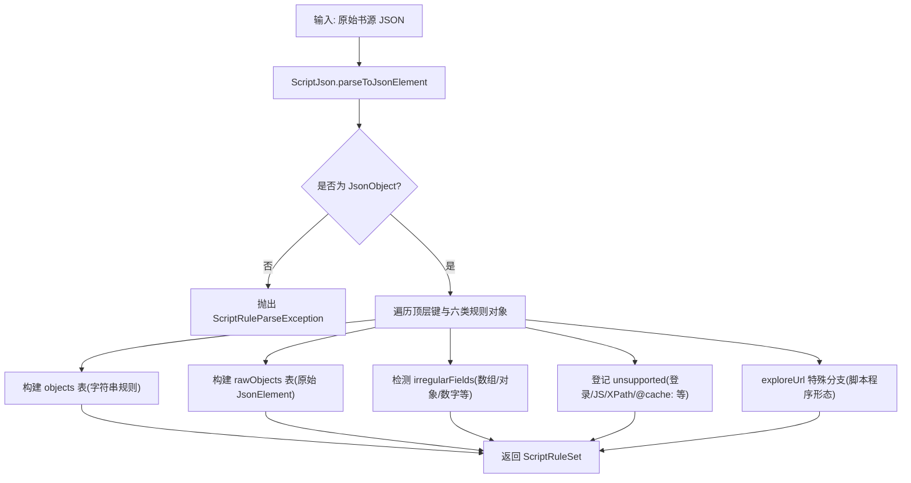
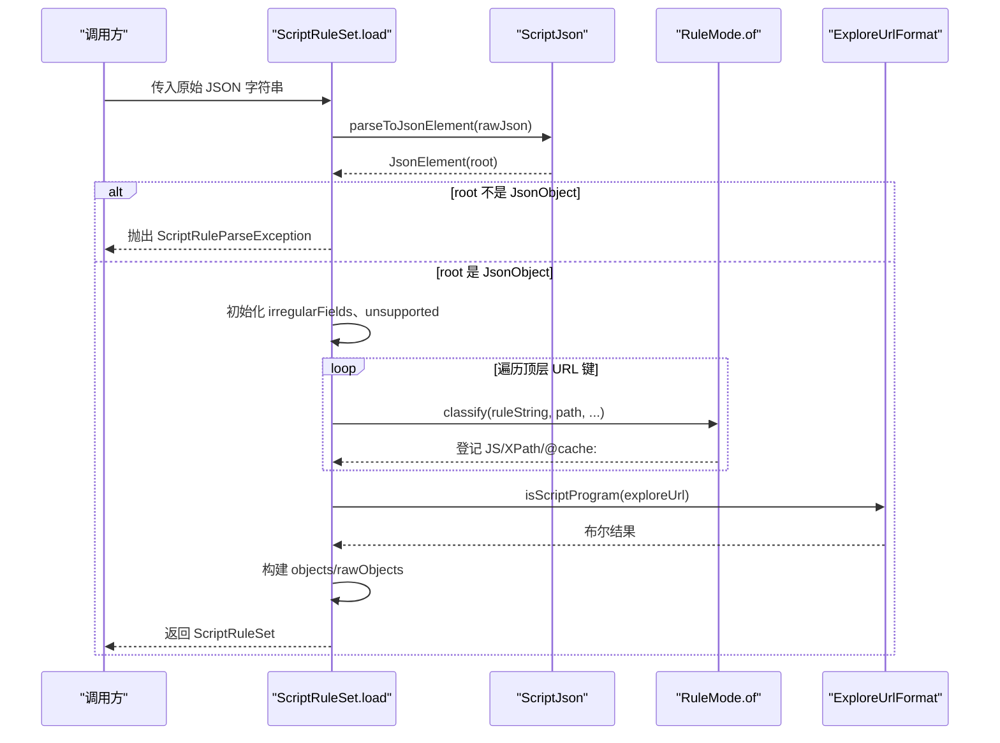
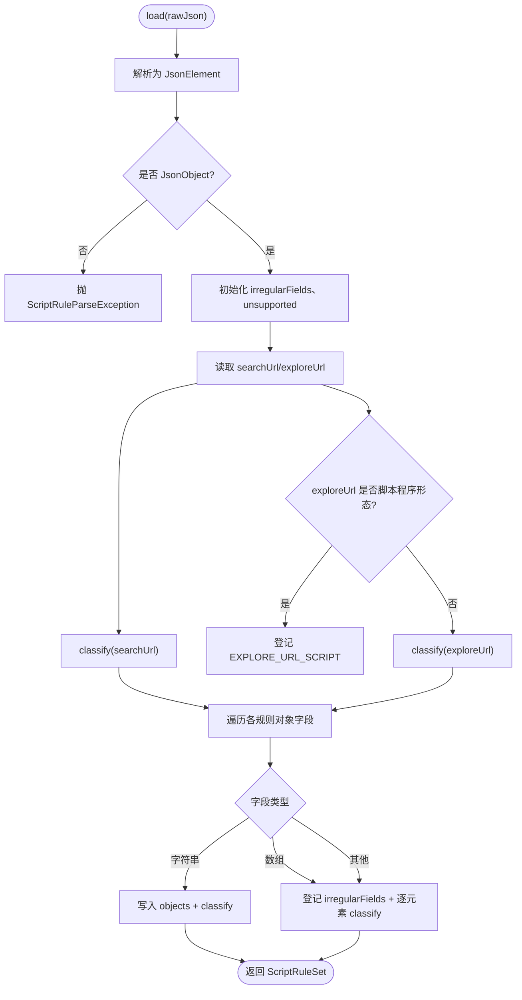
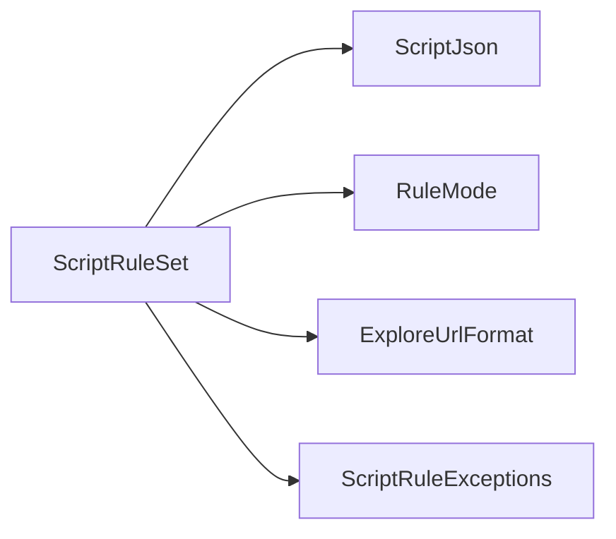

# 规则装载与解析

<cite>
**本文引用的文件**
- [ScriptRuleSet.kt](file://lib_book_source/src/main/java/com/ebook/source/script/ScriptRuleSet.kt)
- [RuleMode.kt](file://lib_book_source/src/main/java/com/ebook/source/script/RuleMode.kt)
- [ExploreUrlFormat.kt](file://lib_book_source/src/main/java/com/ebook/source/script/ExploreUrlFormat.kt)
- [ScriptJson.kt](file://lib_book_source/src/main/java/com/ebook/source/script/ScriptJson.kt)
- [ScriptRuleExceptions.kt](file://lib_book_source/src/main/java/com/ebook/source/script/ScriptRuleExceptions.kt)
- [ScriptRuleSetTest.kt](file://lib_book_source/src/test/java/com/ebook/source/script/ScriptRuleSetTest.kt)
- [2026-09-08-script-source-rule-grammar.md](file://docs/superpowers/specs/2026-09-08-script-source-rule-grammar.md)
</cite>

## 目录
1. [简介](#简介)
2. [项目结构](#项目结构)
3. [核心组件](#核心组件)
4. [架构总览](#架构总览)
5. [详细组件分析](#详细组件分析)
6. [依赖关系分析](#依赖关系分析)
7. [性能考量](#性能考量)
8. [故障排查指南](#故障排查指南)
9. [结论](#结论)
10. [附录：示例与用例](#附录示例与用例)

## 简介
本文聚焦“规则装载与解析”，围绕 ScriptRuleSet.load() 方法，系统性说明原始 JSON 到规则对象的转换过程、字段映射与类型转换、不规则字段处理、能力登记（unsupported）机制、规则分类算法（模式识别、JS/XPath 标记、缓存前缀检测），以及装载失败的常见原因与排查方法。文档同时提供可视化图表与测试用例路径，帮助读者快速定位实现细节并安全扩展。

## 项目结构
与规则装载直接相关的代码集中在 lib_book_source 模块的 script 包中，采用分层清晰的职责划分：
- ScriptRuleSet：负责将原始 JSON 解析为可求值的规则集合，维护对象表、原始节点表、非常规字段与不支持能力清单。
- RuleMode：负责规则串的模式识别（链式、CSS、XPath、JSONPath、AllInOne、变量存取、JS、不支持）。
- ExploreUrlFormat：负责发现页 exploreUrl 的条目切分与脚本程序形态识别。
- ScriptJson：统一的宽容 JSON 解析器配置。
- ScriptRuleExceptions：定义装载与求值阶段的类型化异常体系。
- 测试用例：覆盖装载行为、非常规字段、能力登记、错误抛出等场景。



**图示来源**
- [ScriptRuleSet.kt:139-237](file://lib_book_source/src/main/java/com/ebook/source/script/ScriptRuleSet.kt#L139-L237)
- [ScriptJson.kt:1-12](file://lib_book_source/src/main/java/com/ebook/source/script/ScriptJson.kt#L1-L12)

**章节来源**
- [ScriptRuleSet.kt:12-93](file://lib_book_source/src/main/java/com/ebook/source/script/ScriptRuleSet.kt#L12-L93)
- [ScriptRuleSetTest.kt:10-35](file://lib_book_source/src/test/java/com/ebook/source/script/ScriptRuleSetTest.kt#L10-L35)

## 核心组件
- ScriptRuleSet：封装整源级规则装载视图，包含：
  - 顶层字段：sourceUrl、name、group、type、enabled、enabledExplore、searchUrl、exploreUrl、variable、variableComment、header、bookSourceComment、loginUrl、lastUpdateTime。
  - 规则对象表 objects：按 RuleObjectKind 索引的 Map<String, String>，仅保存字符串形态的规则字段。
  - 原始节点表 rawObjects：同结构的 Map<String, JsonElement>，保留非字符串字段供后续展开（如 URL 数组）。
  - irregularFields：记录非常规字段路径（例如 nextTocUrl 为数组）。
  - unsupported：登记本仓不实现或延后的能力（LOGIN、WEB_JS、SOURCE_REGEX、JS_LIB、COVER_DECODE、EXPLORE_SCREEN、EXPLORE_URL_SCRIPT、BOOK_URL_PATTERN、DOWNLOAD_URLS、REVIEW、XPATH、JS、CACHE_PREFIX）。
  - 辅助方法：rule()、jsonField()、nextUrlArray()、sourceBindingJson()。
- RuleMode：判定规则串模式并剥离标志前缀，支持反序前缀“-”和全取前缀“+”。
- ExploreUrlFormat：判断 exploreUrl 是否为脚本程序形态（以 <js> 开头），并提供文本/JSON 格式的条目切分。
- ScriptJson：全局宽容 JSON 实例，忽略未知键且容忍非严格 JSON。
- ScriptRuleExceptions：类型化异常，区分装载失败、语法错误、不支持能力、JS 待执行、沙箱协议/不可用、执行失败。

**章节来源**
- [ScriptRuleSet.kt:12-93](file://lib_book_source/src/main/java/com/ebook/source/script/ScriptRuleSet.kt#L12-L93)
- [RuleMode.kt:1-118](file://lib_book_source/src/main/java/com/ebook/source/script/RuleMode.kt#L1-L118)
- [ExploreUrlFormat.kt:8-52](file://lib_book_source/src/main/java/com/ebook/source/script/ExploreUrlFormat.kt#L8-L52)
- [ScriptJson.kt:1-12](file://lib_book_source/src/main/java/com/ebook/source/script/ScriptJson.kt#L1-L12)
- [ScriptRuleExceptions.kt:1-86](file://lib_book_source/src/main/java/com/ebook/source/script/ScriptRuleExceptions.kt#L1-L86)

## 架构总览
规则装载流程从原始 JSON 开始，经宽容解析后进入逐字段映射与能力登记阶段，最终产出可被求值层消费的 ScriptRuleSet。其关键特点：
- 原始 JSON 整块保留，供后续按需重读；字符串规则落入 objects，非字符串落 rawObjects 并登记为 irregularFields。
- 能力登记基于“键名声明”而非“规则内容猜测”，避免误报。
- exploreUrl 的脚本程序形态单独处理，不并入 JS 能力登记。
- 所有失败通过类型化异常表达，便于上层精准处置。



**图示来源**
- [ScriptRuleSet.kt:139-237](file://lib_book_source/src/main/java/com/ebook/source/script/ScriptRuleSet.kt#L139-L237)
- [RuleMode.kt:49-116](file://lib_book_source/src/main/java/com/ebook/source/script/RuleMode.kt#L49-L116)
- [ExploreUrlFormat.kt:27-52](file://lib_book_source/src/main/java/com/ebook/source/script/ExploreUrlFormat.kt#L27-L52)

## 详细组件分析

### ScriptRuleSet.load() 实现原理
- JSON 解析：使用 ScriptJson（ignoreUnknownKeys=true, isLenient=true）进行宽容解析；根必须为 JsonObject，否则抛 ScriptRuleParseException。
- 字段映射：
  - 顶层 URL 键 searchUrl/exploreUrl 提取为空时置 null，其他顶层字符串字段缺失时默认空串。
  - 布尔键 enabled/enabledExplore 缺失时默认 true。
  - 类型字段 bookSourceType 缺失时默认 0。
- 规则对象表：
  - 对每个 RuleObjectKind 对应的 JsonObject，遍历其字段：
    - 若为 JsonPrimitive 且为字符串：作为规则串进入 classify，成功后写入 objects。
    - 若为 JsonArray：逐元素尝试转字符串并 classify，整笔登记为 irregularFields，不入 objects。
    - 其他形态：登记为 irregularFields，不入 objects。
- 能力登记（unsupported）：
  - 顶层键存在且非空白即登记对应能力缺口（如 loginUrl、jsLib、coverDecodeJs、exploreScreen、bookUrlPattern、ruleReview）。
  - ruleContent 内 webJs/sourceRegex 分别登记 WEB_JS/SOURCE_REGEX；contentBatch 登记为 irregularFields。
  - ruleBookInfo 内 downloadUrls 登记 DOWNLOAD_URLS。
  - 规则串 classify：
    - RuleMode.JS 登记 JS。
    - RuleMode.XPATH 登记 XPATH。
    - RuleMode.UNSUPPORTED（@cache:）登记 CACHE_PREFIX 并加入 irregularFields。
- exploreUrl 特殊分支：
  - 若为脚本程序形态（以 <js> 开头），登记 EXPLORE_URL_SCRIPT，不进入 classify 的 JS 分支。
  - 否则正常 classify（允许含 <js> 段作为待求值表达式）。
- 结果构造：
  - 生成 ScriptRuleSet，携带 sourceUrl/name/group/type/enabled/enabledExplore/searchUrl/exploreUrl/variable/variableComment/header/bookSourceComment/loginUrl/lastUpdateTime、objects、rawObjects、irregularFields、unsupported、raw。



**图示来源**
- [ScriptRuleSet.kt:139-237](file://lib_book_source/src/main/java/com/ebook/source/script/ScriptRuleSet.kt#L139-L237)

**章节来源**
- [ScriptRuleSet.kt:139-237](file://lib_book_source/src/main/java/com/ebook/source/script/ScriptRuleSet.kt#L139-L237)
- [ScriptRuleSetTest.kt:37-63](file://lib_book_source/src/test/java/com/ebook/source/script/ScriptRuleSetTest.kt#L37-L63)

### 原始 JSON 到规则对象的转换
- 字符串字段提取：仅当字段为 JsonPrimitive 且为字符串时才视为规则串；空串会被丢弃（不影响 objects）。
- 数组展开：数组形态字段（如 nextTocUrl）不会进入 objects，但会登记为 irregularFields；原始节点保存在 rawObjects，供 jsonField()/nextUrlArray() 在求值层展开。
- 非常规字段处理：对象、数字等非字符串一律登记为 irregularFields；不影响 objects 的完整性。
- 能力登记：
  - 顶层键存在且非空白即登记相应能力缺口。
  - 规则串 classify 依据 RuleMode 识别 JS/XPath/@cache: 并登记。
- 探索 URL 处理：
  - 脚本程序形态（整串为 <js>...）登记 EXPLORE_URL_SCRIPT，不执行也不消费。
  - 文本形态含 <js> 段仍按 JS 登记（因为那是待求值的目标表达式）。

**章节来源**
- [ScriptRuleSet.kt:177-211](file://lib_book_source/src/main/java/com/ebook/source/script/ScriptRuleSet.kt#L177-L211)
- [ScriptRuleSetTest.kt:47-57](file://lib_book_source/src/test/java/com/ebook/source/script/ScriptRuleSetTest.kt#L47-L57)
- [ScriptRuleSetTest.kt:172-199](file://lib_book_source/src/test/java/com/ebook/source/script/ScriptRuleSetTest.kt#L172-L199)

### 不规则字段检测机制与能力登记
- irregularFields：记录非常规字段路径（如 ruleToc.nextTocUrl），用于下游判断“未配置 vs 多 URL”、“需要数组展开”等语义。
- unsupported：
  - 基于“键名声明”检测：loginUrl/jsLib/coverDecodeJs/exploreScreen/bookUrlPattern/ruleReview 存在且非空白即登记。
  - 规则对象内部键：ruleContent.webJs/sourceRegex、ruleBookInfo.downloadUrls 分别登记对应能力缺口。
  - 规则串 classify：JS/XPath/@cache: 分别登记 JS/XPATH/CACHE_PREFIX。
  - exploreUrl 脚本程序形态单独登记 EXPLORE_URL_SCRIPT，不与 JS 混淆。

**章节来源**
- [ScriptRuleSet.kt:149-167](file://lib_book_source/src/main/java/com/ebook/source/script/ScriptRuleSet.kt#L149-L167)
- [ScriptRuleSet.kt:247-265](file://lib_book_source/src/main/java/com/ebook/source/script/ScriptRuleSet.kt#L247-L265)
- [ScriptRuleSetTest.kt:65-109](file://lib_book_source/src/test/java/com/ebook/source/script/ScriptRuleSetTest.kt#L65-L109)

### 规则分类算法（模式识别、JS/XPath 标记、缓存前缀检测）
- 模式识别入口：RuleMode.of(rule) 返回 RuleHead(mode, body, reverse)。
- 反序前缀“-”：仅在后续确实跟随已知标志时生效；剥掉前缀后交由 flagOf 判定具体模式。
- 标志优先级（部分）：@@（显式默认）、@js:、<js>、@css:、@xpath:、//、@json:、$.、@put:、@get:、@cache:、:（AllInOne）、else 默认链式。
- 大小写不敏感：@css:/@xpath:/@json:/@js:/@put:/@get: 均忽略大小写。
- 缓存前缀检测：@cache: 被归类为 UNSUPPORTED，并在 classify 中登记 CACHE_PREFIX 与 irregularFields。
- JS/XPath 标记：@js: 或 <js> 触发 JS 模式；@xpath: 或 // 触发 XPath 模式。

```mermaid
flowchart TD
    S(["输入规则串"]) --> Trim["trim()"]
    Trim --> CheckReverse{"以 '-' 开头且跟随已知标志?"}
    CheckReverse -- 是 --> StripReverse["剥去 '-'"]
    CheckReverse -- 否 --> Direct["直接进入 flagOf"]
    StripReverse --> Flag["flagOf(body)"]
    Direct --> Flag
    Flag --> Mode{"匹配标志"}
    Mode -->|@@| DefaultChain["DEFAULT_CHAIN"]
    Mode -->|@js: / <js>| JS["JS"]
    Mode -->|@css:| CSS["CSS"]
    Mode -->|@xpath: / //| XPATH["XPATH"]
    Mode -->|@json: / $.| JSON_PATH["JSON_PATH"]
    Mode -->|@put:| PUT["VARIABLE_PUT"]
    Mode -->|@get:| GET["VARIABLE_GET"]
    Mode -->|@cache:| UNSUP["UNSUPPORTED(@cache:)"]
    Mode -->|:| ALLINONE["REGEX_ALL_IN_ONE"]
    Mode -->|else| DEFAULT["DEFAULT_CHAIN"]
```

**图示来源**
- [RuleMode.kt:49-116](file://lib_book_source/src/main/java/com/ebook/source/script/RuleMode.kt#L49-L116)

**章节来源**
- [RuleMode.kt:49-116](file://lib_book_source/src/main/java/com/ebook/source/script/RuleMode.kt#L49-L116)
- [ScriptRuleSet.kt:247-265](file://lib_book_source/src/main/java/com/ebook/source/script/ScriptRuleSet.kt#L247-L265)

### 探索 URL 格式与脚本程序形态
- 脚本程序形态：以 <js> 开头的整串被视为脚本程序，不执行也不消费，登记为 EXPLORE_URL_SCRIPT。
- 文本格式：按行分割，再在行内按 && 分割（引号与 {} 深度感知），分离名称与 URL。
- JSON 格式：只取 {title,url}，style 与交互控件忽略。
- 容错策略：未闭合引号/花括号从宽处理，不抛异常，仅减少条目数量。

**章节来源**
- [ExploreUrlFormat.kt:8-52](file://lib_book_source/src/main/java/com/ebook/source/script/ExploreUrlFormat.kt#L8-L52)
- [ExploreUrlFormat.kt:53-127](file://lib_book_source/src/main/java/com/ebook/source/script/ExploreUrlFormat.kt#L53-L127)
- [ScriptRuleSet.kt:201-211](file://lib_book_source/src/main/java/com/ebook/source/script/ScriptRuleSet.kt#L201-L211)

## 依赖关系分析
- ScriptRuleSet 依赖：
  - ScriptJson：宽容解析 JSON。
  - RuleMode：规则串模式识别。
  - ExploreUrlFormat：发现页 URL 格式处理。
  - ScriptRuleExceptions：类型化异常。
- 耦合与内聚：
  - 装载逻辑集中于 ScriptRuleSet.load()，高内聚；模式识别独立于 RuleMode，低耦合。
  - irregularFields 与 unsupported 作为装载期元数据，服务于导入报告与前置检查。
- 外部依赖：
  - kotlinx.serialization.json 用于 JSON 操作。
  - 无网络 IO，纯装载期计算，利于导入阶段稳定性。



**图示来源**
- [ScriptRuleSet.kt:139-237](file://lib_book_source/src/main/java/com/ebook/source/script/ScriptRuleSet.kt#L139-L237)
- [ScriptJson.kt:1-12](file://lib_book_source/src/main/java/com/ebook/source/script/ScriptJson.kt#L1-L12)
- [RuleMode.kt:49-116](file://lib_book_source/src/main/java/com/ebook/source/script/RuleMode.kt#L49-L116)
- [ExploreUrlFormat.kt:27-52](file://lib_book_source/src/main/java/com/ebook/source/script/ExploreUrlFormat.kt#L27-L52)
- [ScriptRuleExceptions.kt:1-86](file://lib_book_source/src/main/java/com/ebook/source/script/ScriptRuleExceptions.kt#L1-L86)

**章节来源**
- [ScriptRuleSet.kt:139-237](file://lib_book_source/src/main/java/com/ebook/source/script/ScriptRuleSet.kt#L139-L237)

## 性能考量
- JSON 解析使用宽容模式，减少因非严格 JSON 导致的失败成本。
- 一次遍历构建 objects/rawObjects/irregularFields/unsupported，避免重复解析。
- 规则分类仅在字符串字段上执行，数组/对象跳过对象表写入但保留原始节点，降低不必要开销。
- 能力登记基于键名与模式识别，复杂度与规则规模线性相关。

[本节为通用指导，无需特定文件引用]

## 故障排查指南
- 非法 JSON：
  - 现象：抛出 ScriptRuleParseException，消息包含“脚本书源 JSON 无法解析”。
  - 排查：检查 JSON 语法；确认顶层为对象而非数组。
- 数组形态整包拒收：
  - 现象：传入数组时抛异常，提示需由导入链路逐条拆分。
  - 排查：确保传入单个书源对象。
- 非常规字段：
  - 现象：irregularFields 中包含路径（如 ruleToc.nextTocUrl）。
  - 排查：确认字段形态是否符合预期；如需数组展开，使用 jsonField()/nextUrlArray()。
- 能力缺失：
  - 现象：unsupported 包含 LOGIN/JS/XPATH/CACHE_PREFIX 等。
  - 排查：根据需求启用或规避对应能力；注意 exploreUrl 脚本程序形态不等同于 JS。
- 错误类型化：
  - 规则语法错误：RuleSyntaxException。
  - 不支持能力：UnsupportedRuleFeatureException。
  - JS 待执行：JsEvaluationPendingException（需沙箱执行器）。
  - 沙箱协议/不可用/执行失败：SandboxProtocolException/SandboxUnavailableException/JsExecutionFailedException。

**章节来源**
- [ScriptRuleSetTest.kt:208-220](file://lib_book_source/src/test/java/com/ebook/source/script/ScriptRuleSetTest.kt#L208-L220)
- [ScriptRuleExceptions.kt:19-86](file://lib_book_source/src/main/java/com/ebook/source/script/ScriptRuleExceptions.kt#L19-L86)

## 结论
ScriptRuleSet.load() 实现了健壮且可扩展的规则装载流程：宽容 JSON 解析、严格的字段映射、精确的能力登记、以及面向后续求值层的原始节点保留。通过类型化异常与清晰的不支持能力清单，系统在导入阶段即可提供明确的诊断信息，避免静默错误传播至运行时。

[本节为总结性内容，无需特定文件引用]

## 附录：示例与用例
- 装载出顶层 URL 与六类规则对象字段：
  - 参考测试：[ScriptRuleSetTest.kt:37-45](file://lib_book_source/src/test/java/com/ebook/source/script/ScriptRuleSetTest.kt#L37-L45)
- 非字符串规则字段被忽略并登记为非常规字段：
  - 参考测试：[ScriptRuleSetTest.kt:47-57](file://lib_book_source/src/test/java/com/ebook/source/script/ScriptRuleSetTest.kt#L47-L57)
- 未知顶层键被忽略而不报错：
  - 参考测试：[ScriptRuleSetTest.kt:59-63](file://lib_book_source/src/test/java/com/ebook/source/script/ScriptRuleSetTest.kt#L59-L63)
- 声明了登录与 webJs 与 XPath 的源登记对应不支持项：
  - 参考测试：[ScriptRuleSetTest.kt:65-77](file://lib_book_source/src/test/java/com/ebook/source/script/ScriptRuleSetTest.kt#L65-L77)
- 规则串里的 js 与 XPath 分别登记：
  - 参考测试：[ScriptRuleSetTest.kt:79-89](file://lib_book_source/src/test/java/com/ebook/source/script/ScriptRuleSetTest.kt#L79-L89)
- 延后能力按键名登记而非按规则串内容猜：
  - 参考测试：[ScriptRuleSetTest.kt:91-109](file://lib_book_source/src/test/java/com/ebook/source/script/ScriptRuleSetTest.kt#L91-L109)
- 装载出沙箱 source 面要的源级字段：
  - 参考测试：[ScriptRuleSetTest.kt:111-131](file://lib_book_source/src/test/java/com/ebook/source/script/ScriptRuleSetTest.kt#L111-L131)
- 源级字段缺失时装成空串而不是 null：
  - 参考测试：[ScriptRuleSetTest.kt:133-142](file://lib_book_source/src/test/java/com/ebook/source/script/ScriptRuleSetTest.kt#L133-L142)
- source 绑定只带声明过的键与书名和源地址：
  - 参考测试：[ScriptRuleSetTest.kt:144-159](file://lib_book_source/src/test/java/com/ebook/source/script/ScriptRuleSetTest.kt#L144-L159)
- source 绑定带出声明过的变量整串与头域：
  - 参考测试：[ScriptRuleSetTest.kt:161-170](file://lib_book_source/src/test/java/com/ebook/source/script/ScriptRuleSetTest.kt#L161-L170)
- exploreUrl 的脚本程序形态登记为发现面缺口而不是会执行的 js：
  - 参考测试：[ScriptRuleSetTest.kt:172-185](file://lib_book_source/src/test/java/com/ebook/source/script/ScriptRuleSetTest.kt#L172-L185)
- exploreUrl 文本形态里含 js 段照旧登记 JS：
  - 参考测试：[ScriptRuleSetTest.kt:187-199](file://lib_book_source/src/test/java/com/ebook/source/script/ScriptRuleSetTest.kt#L187-L199)
- 没有任何规则对象时装载成功：
  - 参考测试：[ScriptRuleSetTest.kt:201-206](file://lib_book_source/src/test/java/com/ebook/source/script/ScriptRuleSetTest.kt#L201-L206)
- 非法 JSON 抛类型化异常而非序列化细节：
  - 参考测试：[ScriptRuleSetTest.kt:208-213](file://lib_book_source/src/test/java/com/ebook/source/script/ScriptRuleSetTest.kt#L208-L213)
- 数组形态整包拒收并说明整包在导入侧已拆开：
  - 参考测试：[ScriptRuleSetTest.kt:215-220](file://lib_book_source/src/test/java/com/ebook/source/script/ScriptRuleSetTest.kt#L215-L220)
- 原始 JSON 整块保留供求值层按需重读：
  - 参考测试：[ScriptRuleSetTest.kt:222-226](file://lib_book_source/src/test/java/com/ebook/source/script/ScriptRuleSetTest.kt#L222-L226)
- jsonField 展开数组形态字段供翻页链消费：
  - 参考测试：[ScriptRuleSetTest.kt:228-236](file://lib_book_source/src/test/java/com/ebook/source/script/ScriptRuleSetTest.kt#L228-L236)

**章节来源**
- [ScriptRuleSetTest.kt:37-236](file://lib_book_source/src/test/java/com/ebook/source/script/ScriptRuleSetTest.kt#L37-L236)