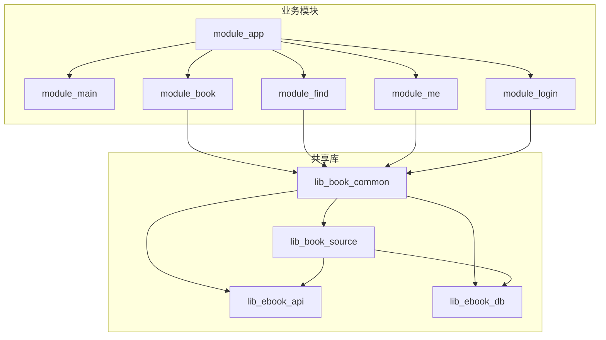
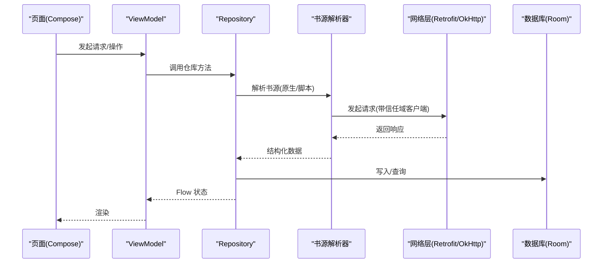
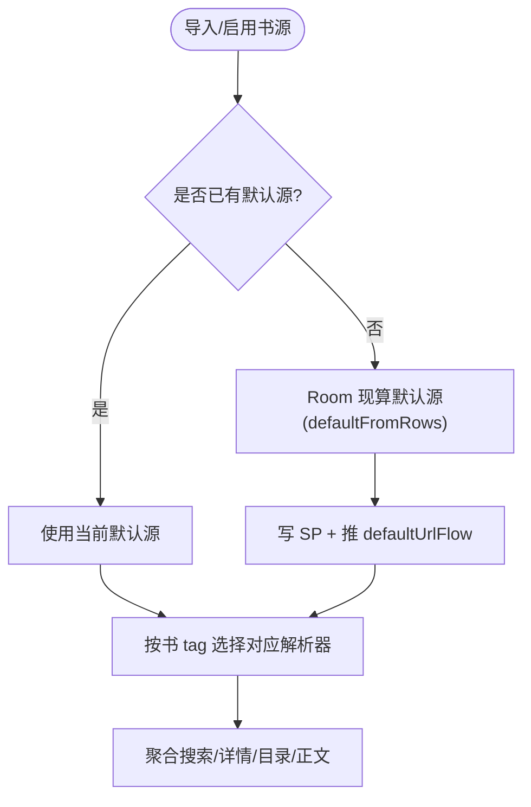
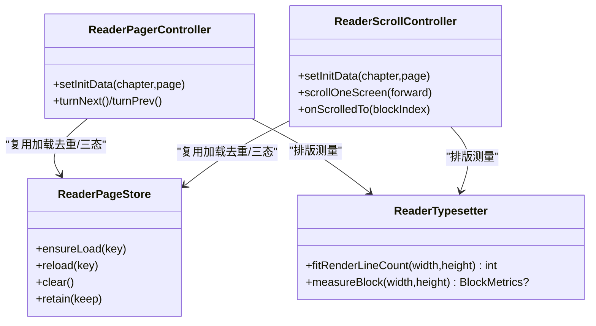
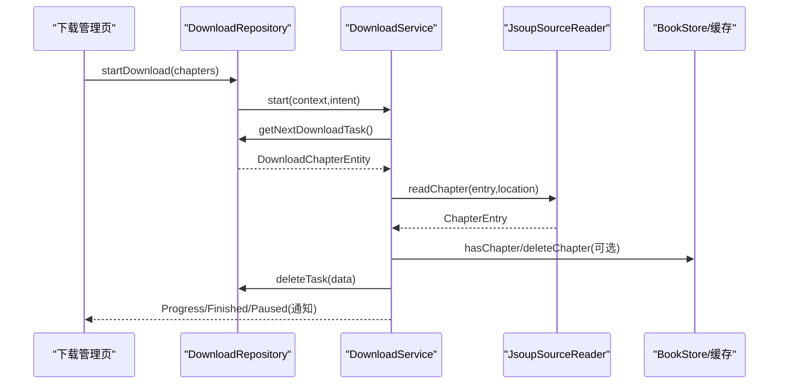
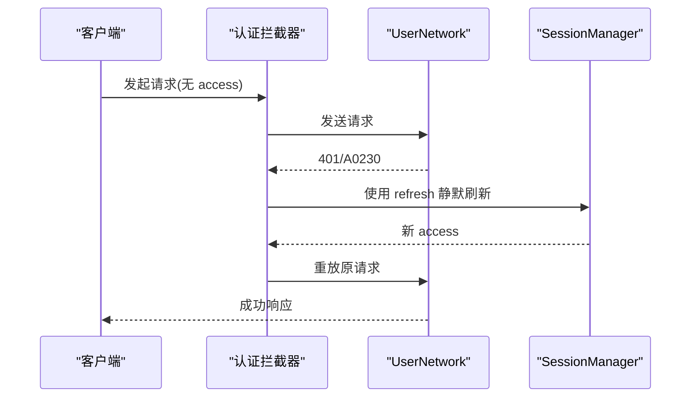
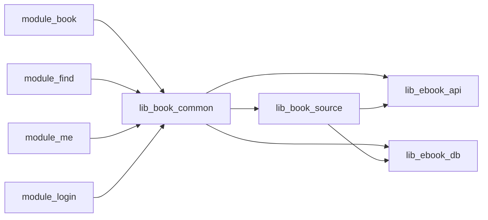

# 功能详解

<cite>
**本文引用的文件**   
- [README.MD](file://README.MD)
- [AGENTS.md](file://AGENTS.md)
- [0028-untrusted-js-sandbox.md](file://docs/adr/0028-untrusted-js-sandbox.md)
- [0014-auth-client-consolidation.md](file://docs/adr/0014-auth-client-consolidation.md)
- [0018-download-foreground-service-data-sync-quota.md](file://docs/adr/0018-download-foreground-service-data-sync-quota.md)
- [2026-09-13-reader-scroll-mode.md](file://docs/superpowers/plans/2026-09-13-reader-scroll-mode.md)
- [DownloadService.kt](file://module_book/src/main/java/com/ebook/book/service/DownloadService.kt)
</cite>

## 目录
1. [简介](#简介)
2. [项目结构](#项目结构)
3. [核心组件](#核心组件)
4. [架构总览](#架构总览)
5. [详细组件分析](#详细组件分析)
6. [依赖关系分析](#依赖关系分析)
7. [性能考量](#性能考量)
8. [故障排查指南](#故障排查指南)
9. [结论](#结论)
10. [附录](#附录)

## 简介
本项目是一个基于 Kotlin 与 Jetpack Compose 的 Android 小说阅读器，采用 MVVM + 多模块架构。核心能力包括：书源系统（JSON 规则与脚本规则、多书源共存与默认源计算）、阅读体验（翻页/滚屏模式、排版引擎、进度管理）、下载服务（前台服务、任务队列、断点续传、并发控制）、用户认证（邮箱为主标识、双 Token、会话管理）、章节评论、书城搜索与个人中心。本文围绕这些功能展开，给出实现原理、关键代码位置指引、接口说明与常见问题解决思路。

## 项目结构
- 业务模块：module_main、module_book、module_find、module_me、module_login
- 共享库：lib_book_common（跨模块 UI 与 Provider 接口）、lib_book_source（书源解析与 JS 沙箱）、lib_ebook_api（网络层）、lib_ebook_db（Room 数据）
- 构建逻辑：build-logic（约定插件统一构建配置）
- 文档：docs/adr（架构决策记录）、docs/superpowers（规格/计划/评审）

图表来源
- [README.MD:86-104](file://README.MD#L86-L104)
- [AGENTS.md](file://AGENTS.md)

章节来源
- [README.MD:86-104](file://README.MD#L86-L104)
- [AGENTS.md](file://AGENTS.md)

## 核心组件
- 书源系统：原生解析器（Jsoup）+ 脚本解释器（词法/求值/取文）+ :js 沙箱执行器；支持 JSON 规则与脚本规则，多书源共存，默认源由 Room 现算
- 阅读体验：两种翻页方式（左右翻页/上下滚屏），共用排版分块链；进度以“章内第几屏”为单位持久化
- 下载服务：dataSync 前台服务，按章抓取、重试、通知回传；支持按书暂停与范围选择；配额超时与启动被拒在服务侧收口
- 认证体系：邮箱为主标识，三步注册/登录，双 Token（access 驻内存 + refresh 持久化）静默续期；会话过期统一处理
- 章节评论：按章浏览/发表评论，个人中心可管理
- 书城搜索：多源聚合搜索、分类浏览、结果标注所属源
- 个人中心：阅读概览、缓存清理、设置配置

章节来源
- [README.MD:15-27](file://README.MD#L15-L27)
- [AGENTS.md](file://AGENTS.md)

## 架构总览
整体分层：UI 层（Compose）→ ViewModel → Repository → 领域服务（书源解析、内容读取、下载、认证、评论）→ 存储（Room）/ 网络（Retrofit/OkHttp）。跨模块通过 TheRouter + Provider 解耦。

图表来源
- [AGENTS.md](file://AGENTS.md)
- [0014-auth-client-consolidation.md](file://docs/adr/0014-auth-client-consolidation.md)

章节来源
- [AGENTS.md](file://AGENTS.md)
- [0014-auth-client-consolidation.md](file://docs/adr/0014-auth-client-consolidation.md)

## 详细组件分析

### 书源系统（JSON 规则与脚本规则、多书源共存、默认源计算）
- 规则格式与语法
  - JSON 规则：用于定义站点地址、URL 模板、字段映射等，驱动原生解析器
  - 脚本规则：规则串包含词法切分、组合符、取值器与索引，交由脚本解释器与沙箱执行器求值
- 多书源共存机制
  - 每本书绑定归属书源 URL（entity.tag），解析一律跟书走，不依赖全局默认源
  - 搜索为跨源聚合，单源失败不影响其余；书城顶部可切换浏览源
- 默认源计算算法
  - 零内置书源；默认源从 Room 现算，SP 仅保存用户上次选择的源；首次冷启动书城空态引导导入
  - 默认源载体为密封类型，兼容原生与脚本两种出身

图表来源
- [AGENTS.md](file://AGENTS.md)

章节来源
- [AGENTS.md](file://AGENTS.md)

### 阅读体验（翻页/滚屏、排版引擎、进度管理）
- 翻页模式
  - 左右翻页：三页窗口 + 横向拖拽，进度为“章内第几屏”
- 滚屏模式
  - 整章连续列表，跨章无缝衔接；块高由排版实测值确定，避免心算误差
- 排版引擎
  - 抽取纯函数测量“一屏放得下几行”与“块高”，两种模式共用同一分块链
- 进度管理
  - 统一以 (durChapter, durChapterPage) 表示，换模式时按行号换算落点，零 schema 改动

图表来源
- [2026-09-13-reader-scroll-mode.md](file://docs/superpowers/plans/2026-09-13-reader-scroll-mode.md)

章节来源
- [2026-09-13-reader-scroll-mode.md](file://docs/superpowers/plans/2026-09-13-reader-scroll-mode.md)

### 下载服务（前台服务、任务队列、断点续传、并发控制）
- 前台服务设计
  - dataSync 前台服务，声明类型与权限；两参 startForeground 合法
  - onTimeout 只做数秒收尾，发通知并 stopSelf；启动被拒在入口统一 try/catch
- 任务队列与断点续传
  - 先入库再拉服务；每章抓取失败最多重试 3 次，耗尽后出队并计数
  - 支持按书暂停（paused_book 表），取篇时跳过；失败章不出错终止全书
- 并发控制策略
  - 章间间隔 800ms 降载；通知按钮用 getForegroundService 拉起或唤醒；状态同步写入 replay 缓冲

图表来源
- [0018-download-foreground-service-data-sync-quota.md](file://docs/adr/0018-download-foreground-service-data-sync-quota.md)
- [DownloadService.kt](file://module_book/src/main/java/com/ebook/book/service/DownloadService.kt)

章节来源
- [0018-download-foreground-service-data-sync-quota.md](file://docs/adr/0018-download-foreground-service-data-sync-quota.md)
- [DownloadService.kt:116-124](file://module_book/src/main/java/com/ebook/book/service/DownloadService.kt#L116-L124)
- [DownloadService.kt:126-206](file://module_book/src/main/java/com/ebook/book/service/DownloadService.kt#L126-L206)
- [DownloadService.kt:274-378](file://module_book/src/main/java/com/ebook/book/service/DownloadService.kt#L274-L378)
- [DownloadService.kt:444-464](file://module_book/src/main/java/com/ebook/book/service/DownloadService.kt#L444-L464)
- [DownloadService.kt:505-549](file://module_book/src/main/java/com/ebook/book/service/DownloadService.kt#L505-L549)
- [DownloadService.kt:646-666](file://module_book/src/main/java/com/ebook/book/service/DownloadService.kt#L646-L666)
- [DownloadService.kt:711-730](file://module_book/src/main/java/com/ebook/book/service/DownloadService.kt#L711-L730)

### 用户认证体系（邮箱认证、双Token、会话管理、安全考虑）
- 邮箱为主标识：注册三步（发码→建号→登录），改密双路径
- 双 Token：access 只驻内存不落盘，refresh 持久化；首个请求遇 A0230 静默刷新
- 会话管理：清会话统一收敛到 session manager，三处镜像（SP、旧兼容键、ProfileRepository 内存 StateFlow）
- 安全：认证/业务统一共享客户端，第三方链路使用不带 token 的纯净客户端；日志脱敏

图表来源
- [0014-auth-client-consolidation.md](file://docs/adr/0014-auth-client-consolidation.md)
- [AGENTS.md](file://AGENTS.md)

章节来源
- [0014-auth-client-consolidation.md](file://docs/adr/0014-auth-client-consolidation.md)
- [AGENTS.md](file://AGENTS.md)

### 章节评论系统（CRUD、按章浏览、评论管理）
- 按章浏览与发表：评论与章节关联，支持新增/删除
- 个人中心管理：长按删除自己的评论
- 后端契约：HTTP 恒 200 + RespDTO 信封 + 五位业务码，错误三层分治

章节来源
- [README.MD:17-23](file://README.MD#L17-L23)

### 书城搜索（多源聚合、分类浏览、结果处理）
- 多源聚合：各源并行请求，结果标注所属源，单源失败不影响整体
- 分类浏览：顶层切换浏览源，原生 kinds / 脚本 exploreUrl 条目
- 搜索结果处理：去重、分页、到底判断（noteUrl 去重）

章节来源
- [AGENTS.md](file://AGENTS.md)

### 个人中心（阅读概览、缓存清理、设置配置）
- 阅读概览：统计与展示
- 缓存清理：cacheDir 图片/临时/其他；书籍内容位于 filesDir/books 不计入可清理总量且不可在本页删除
- 设置与关于：用户协议/隐私政策/开源许可

章节来源
- [AGENTS.md](file://AGENTS.md)

## 依赖关系分析
- 模块依赖方向：业务模块 → lib_book_common → lib_book_source → lib_ebook_api / lib_ebook_db
- 书源解析与沙箱：lib_book_source 提供原生解析与脚本解释器，:js 进程零权限隔离
- 网络层：统一共享客户端；第三方链路使用纯净客户端（@Named("source"/"release")）

图表来源
- [AGENTS.md](file://AGENTS.md)

章节来源
- [AGENTS.md](file://AGENTS.md)

## 性能考量
- 书源解析：脚本执行串行化（单帧串行）以避免堆限失控；JS 栈/堆/超时/字节上限四件套保护
- 阅读排版：块高取实测值，避免心算误差导致的错位与重排开销
- 下载服务：章间间隔降低远端压力；配额超时及时收尾；通知更新尽力而为不阻塞主流程
- 网络：第三方链路短超时（10s），认证/业务长超时（30s）；日志脱敏统一

章节来源
- [0028-untrusted-js-sandbox.md](file://docs/adr/0028-untrusted-js-sandbox.md)
- [0018-download-foreground-service-data-sync-quota.md](file://docs/adr/0018-download-foreground-service-data-sync-quota.md)
- [0014-auth-client-consolidation.md](file://docs/adr/0014-auth-client-consolidation.md)

## 故障排查指南
- 书源解析失败
  - 检查是否为脚本规则装载失败（首次求值抛类型化异常），区分“未装配执行器”和“执行失败”
  - 确认默认源现算正确，零源时书城空态应显示导入入口
- 阅读模式切换卡顿或错位
  - 确保 measureBlock 实测块高；换模式时按行号换算落点
- 下载服务闪退或停止
  - 查看 onTimeout 与 start 入口捕获的异常；确认 dataSync 配额与后台启动限制
  - 通知不可用时不会导致前台化失败，但需关注 tryEmitState 同步落 replay
- 认证刷新失败
  - 检查 A0230 处理与 refresh 流程；确认会话过期事件统一收口
- 评论/搜索无数据
  - 检查网络层 RespDTO 解码与业务码；确认聚合搜索是否因某源失败中断

章节来源
- [0028-untrusted-js-sandbox.md](file://docs/adr/0028-untrusted-js-sandbox.md)
- [0018-download-foreground-service-data-sync-quota.md](file://docs/adr/0018-download-foreground-service-data-sync-quota.md)
- [0014-auth-client-consolidation.md](file://docs/adr/0014-auth-client-consolidation.md)

## 结论
本项目的书源系统、阅读体验、下载服务、认证体系、评论与搜索等功能均以模块化、可维护的方式实现：书源解析兼顾原生与脚本、阅读模式共用排版链、下载服务稳健地处理配额与启动限制、认证体系以双 Token 与安全边界为核心。后续可在性能调优与可用性方面持续完善。

## 附录
- 快速开始与环境要求见 README
- 贡献与提交规范见 AGENTS.md
- 架构决策记录见 docs/adr
- 规格与计划见 docs/superpowers

章节来源
- [README.MD:49-84](file://README.MD#L49-L84)
- [AGENTS.md](file://AGENTS.md)