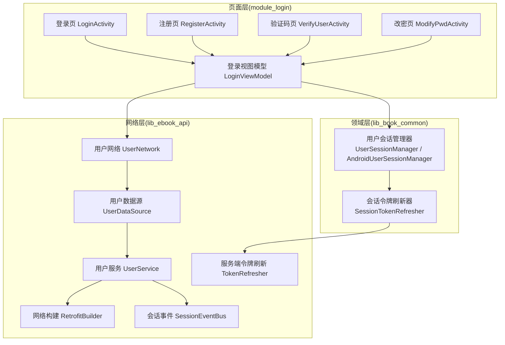
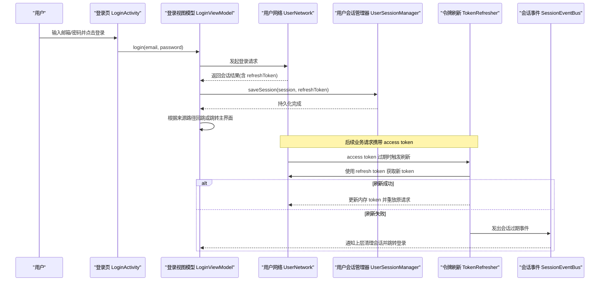
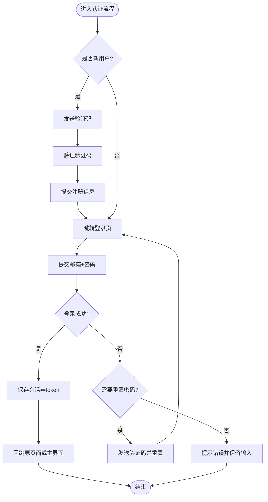
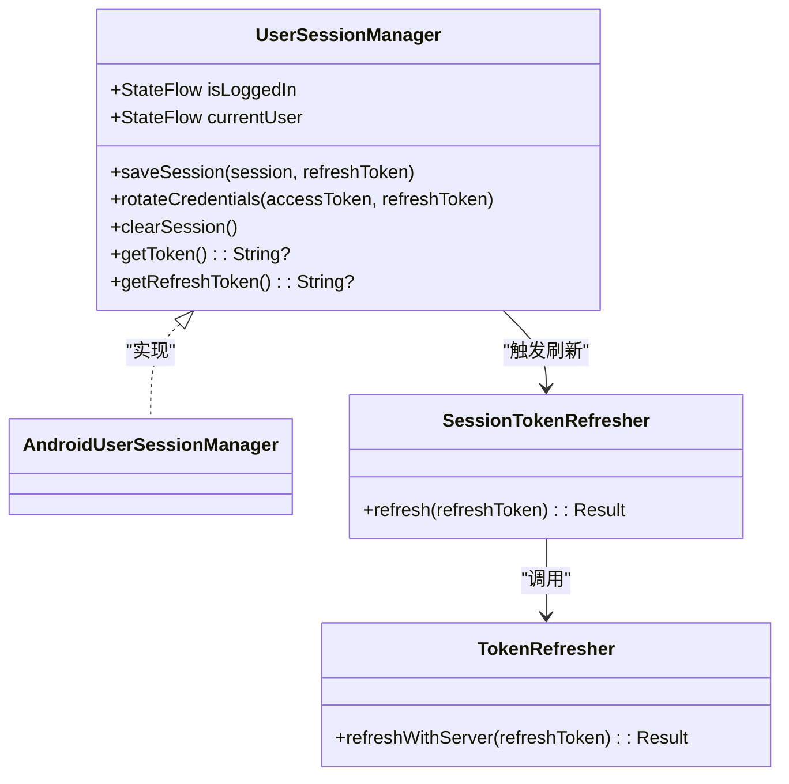
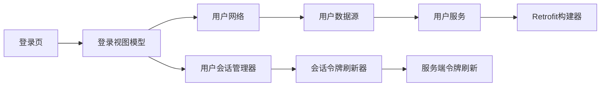

# 用户认证

<cite>
**本文引用的文件**
- [LoginActivity.kt](file://module_login/src/main/java/com/ebook/login/LoginActivity.kt)
- [LoginViewModel.kt](file://module_login/src/main/java/com/ebook/login/mvvm/viewmodel/LoginViewModel.kt)
- [UserSessionManager.kt](file://lib_book_common/src/main/java/com/ebook/common/domain/UserSessionManager.kt)
- [AndroidUserSessionManager.kt](file://lib_book_common/src/main/java/com/ebook/common/domain/AndroidUserSessionManager.kt)
- [SessionTokenRefresher.kt](file://lib_book_common/src/main/java/com/ebook/common/domain/SessionTokenRefresher.kt)
- [TokenRefresher.kt](file://lib_ebook_api/src/main/java/com/ebook/api/auth/TokenRefresher.kt)
- [SessionEventBus.kt](file://lib_ebook_api/src/main/java/com/ebook/api/auth/SessionEventBus.kt)
- [UserNetwork.kt](file://lib_ebook_api/src/main/java/com/ebook/api/service/user/UserNetwork.kt)
- [UserDataSource.kt](file://lib_ebook_api/src/main/java/com/ebook/api/service/user/UserDataSource.kt)
- [UserService.kt](file://lib_ebook_api/src/main/java/com/ebook/api/service/user/UserService.kt)
- [RetrofitBuilder.kt](file://lib_ebook_api/src/main/java/com/ebook/api/RetrofitBuilder.kt)
- [RegisterActivity.kt](file://module_login/src/main/java/com/ebook/login/RegisterActivity.kt)
- [VerifyUserActivity.kt](file://module_login/src/main/java/com/ebook/login/VerifyUserActivity.kt)
- [ModifyPwdActivity.kt](file://module_login/src/main/java/com/ebook/login/ModifyPwdActivity.kt)
- [UserRepository.kt](file://module_login/src/main/java/com/ebook/login/repository/UserRepository.kt)
- [ADR-0011 令牌身份解耦与仅刷新](file://docs/adr/0011-token-identity-decoupling-token-only-refresh.md)
- [ADR-0014 认证客户端收敛](file://docs/adr/0014-auth-client-consolidation.md)
</cite>

## 目录
1. [简介](#简介)
2. [项目结构](#项目结构)
3. [核心组件](#核心组件)
4. [架构总览](#架构总览)
5. [详细组件分析](#详细组件分析)
6. [依赖关系分析](#依赖关系分析)
7. [性能考量](#性能考量)
8. [故障排查指南](#故障排查指南)
9. [结论](#结论)
10. [附录](#附录)

## 简介
本技术文档聚焦于项目的“用户认证”子系统，覆盖邮箱认证流程（注册验证、登录授权、密码重置）、双 Token 机制（访问令牌刷新、会话管理、安全考虑）、用户状态管理（登录态维护、自动登录、登出处理）、网络安全措施（HTTPS、数据加密、防重放攻击）、异常处理机制（网络异常、认证失败、会话过期），以及第三方认证扩展接口与安全最佳实践。

本项目采用 MVVM + Coroutines + Flow 的架构模式；认证域以 module_login 为入口页面层，lib_ebook_api 暴露用户相关网络服务，lib_book_common 提供跨模块共享的用户会话管理与令牌刷新能力。认证体系遵循“邮箱为主标识、access token 驻内存不落盘、refresh token 持久化”的设计约定，并通过拦截器在请求链路中注入凭证。

## 项目结构
认证相关的代码分布在三个层次：
- 页面与交互层：module_login 下的 LoginActivity、RegisterActivity、VerifyUserActivity、ModifyPwdActivity 及对应 ViewModel
- 领域与基础设施层：lib_book_common 中的 UserSessionManager、AndroidUserSessionManager、SessionTokenRefresher
- 网络与服务层：lib_ebook_api 中的 UserNetwork、UserDataSource、UserService、RetrofitBuilder，以及 auth 子包中的 TokenRefresher、SessionEventBus

图示来源
- [LoginActivity.kt:49-193](file://module_login/src/main/java/com/ebook/login/LoginActivity.kt#L49-L193)
- [LoginViewModel.kt:22-107](file://module_login/src/main/java/com/ebook/login/mvvm/viewmodel/LoginViewModel.kt#L22-L107)
- [UserSessionManager.kt:5-62](file://lib_book_common/src/main/java/com/ebook/common/domain/UserSessionManager.kt#L5-L62)
- [AndroidUserSessionManager.kt](file://lib_book_common/src/main/java/com/ebook/common/domain/AndroidUserSessionManager.kt)
- [SessionTokenRefresher.kt](file://lib_book_common/src/main/java/com/ebook/common/domain/SessionTokenRefresher.kt)
- [TokenRefresher.kt](file://lib_ebook_api/src/main/java/com/ebook/api/auth/TokenRefresher.kt)
- [SessionEventBus.kt](file://lib_ebook_api/src/main/java/com/ebook/api/auth/SessionEventBus.kt)
- [UserNetwork.kt](file://lib_ebook_api/src/main/java/com/ebook/api/service/user/UserNetwork.kt)
- [UserDataSource.kt](file://lib_ebook_api/src/main/java/com/ebook/api/service/user/UserDataSource.kt)
- [UserService.kt](file://lib_ebook_api/src/main/java/com/ebook/api/service/user/UserService.kt)
- [RetrofitBuilder.kt](file://lib_ebook_api/src/main/java/com/ebook/api/RetrofitBuilder.kt)

章节来源
- [LoginActivity.kt:49-193](file://module_login/src/main/java/com/ebook/login/LoginActivity.kt#L49-L193)
- [LoginViewModel.kt:22-107](file://module_login/src/main/java/com/ebook/login/mvvm/viewmodel/LoginViewModel.kt#L22-L107)
- [UserSessionManager.kt:5-62](file://lib_book_common/src/main/java/com/ebook/common/domain/UserSessionManager.kt#L5-L62)

## 核心组件
- 登录页与视图模型：负责表单输入、基础校验、调用仓库执行登录、保存会话并导航回原页面或主界面
- 用户会话管理：统一封装登录态、当前用户信息、双 token 的持久化与读取；提供旋转凭证和清除会话的能力
- 令牌刷新器：在 access token 过期时静默刷新，成功后重放原请求或上报会话过期事件
- 用户网络服务：定义登录、注册、验证码发送、密码修改等 API 契约，配合 Retrofit 完成网络请求

章节来源
- [LoginActivity.kt:49-193](file://module_login/src/main/java/com/ebook/login/LoginActivity.kt#L49-L193)
- [LoginViewModel.kt:22-107](file://module_login/src/main/java/com/ebook/login/mvvm/viewmodel/LoginViewModel.kt#L22-L107)
- [UserSessionManager.kt:5-62](file://lib_book_common/src/main/java/com/ebook/common/domain/UserSessionManager.kt#L5-L62)
- [TokenRefresher.kt](file://lib_ebook_api/src/main/java/com/ebook/api/auth/TokenRefresher.kt)
- [SessionEventBus.kt](file://lib_ebook_api/src/main/java/com/ebook/api/auth/SessionEventBus.kt)
- [UserNetwork.kt](file://lib_ebook_api/src/main/java/com/ebook/api/service/user/UserNetwork.kt)
- [UserDataSource.kt](file://lib_ebook_api/src/main/java/com/ebook/api/service/user/UserDataSource.kt)
- [UserService.kt](file://lib_ebook_api/src/main/java/com/ebook/api/service/user/UserService.kt)

## 架构总览
认证子系统围绕“登录态 + 双 Token”展开：
- 登录成功后，将用户信息与 refresh token 持久化，access token 驻内存并由网络拦截器附加到请求头
- 当业务请求返回会话过期错误码时，由网络层触发静默刷新；刷新成功则重放原请求，失败则清理会话并引导重新登录
- 页面层通过 UserSessionManager 暴露的 StateFlow 观察登录态与当前用户信息，用于路由守卫与 UI 渲染

图示来源
- [LoginActivity.kt:49-193](file://module_login/src/main/java/com/ebook/login/LoginActivity.kt#L49-L193)
- [LoginViewModel.kt:22-107](file://module_login/src/main/java/com/ebook/login/mvvm/viewmodel/LoginViewModel.kt#L22-L107)
- [UserSessionManager.kt:5-62](file://lib_book_common/src/main/java/com/ebook/common/domain/UserSessionManager.kt#L5-L62)
- [TokenRefresher.kt](file://lib_ebook_api/src/main/java/com/ebook/api/auth/TokenRefresher.kt)
- [SessionEventBus.kt](file://lib_ebook_api/src/main/java/com/ebook/api/auth/SessionEventBus.kt)

## 详细组件分析

### 邮箱认证流程
- 注册与验证：注册页与验证码页通过用户网络服务发送验证码与注册请求，成功后可携带邮箱预填参数回到登录页
- 登录授权：登录页进行非空校验后调用仓库执行登录，成功后保存会话并回跳原始目标页或主界面
- 密码重置：验证码页与改密页协同完成密码重置流程，最终更新本地资料缓存

图示来源
- [RegisterActivity.kt](file://module_login/src/main/java/com/ebook/login/RegisterActivity.kt)
- [VerifyUserActivity.kt](file://module_login/src/main/java/com/ebook/login/VerifyUserActivity.kt)
- [LoginActivity.kt:49-193](file://module_login/src/main/java/com/ebook/login/LoginActivity.kt#L49-L193)
- [LoginViewModel.kt:22-107](file://module_login/src/main/java/com/ebook/login/mvvm/viewmodel/LoginViewModel.kt#L22-L107)
- [ModifyPwdActivity.kt](file://module_login/src/main/java/com/ebook/login/ModifyPwdActivity.kt)

章节来源
- [LoginActivity.kt:49-193](file://module_login/src/main/java/com/ebook/login/LoginActivity.kt#L49-L193)
- [LoginViewModel.kt:22-107](file://module_login/src/main/java/com/ebook/login/mvvm/viewmodel/LoginViewModel.kt#L22-L107)
- [RegisterActivity.kt](file://module_login/src/main/java/com/ebook/login/RegisterActivity.kt)
- [VerifyUserActivity.kt](file://module_login/src/main/java/com/ebook/login/VerifyUserActivity.kt)
- [ModifyPwdActivity.kt](file://module_login/src/main/java/com/ebook/login/ModifyPwdActivity.kt)

### 双 Token 机制与刷新策略
- 访问令牌（access token）：仅驻内存，不持久化，由网络拦截器在请求头中附带；对未登录或无 token 的请求不会携带
- 刷新令牌（refresh token）：持久化存储，仅在 access token 过期时用于换取新的双 token
- 刷新流程：当网络层检测到会话过期时，单飞刷新，成功后更新内存 token 并重放原请求；刷新失败则发出会话过期事件，全局清理会话并引导重新登录
- 设计约束：刷新端点不再返回用户信息，身份与 token 解耦，避免刷新副作用影响用户展示

图示来源
- [UserSessionManager.kt:5-62](file://lib_book_common/src/main/java/com/ebook/common/domain/UserSessionManager.kt#L5-L62)
- [AndroidUserSessionManager.kt](file://lib_book_common/src/main/java/com/ebook/common/domain/AndroidUserSessionManager.kt)
- [SessionTokenRefresher.kt](file://lib_book_common/src/main/java/com/ebook/common/domain/SessionTokenRefresher.kt)
- [TokenRefresher.kt](file://lib_ebook_api/src/main/java/com/ebook/api/auth/TokenRefresher.kt)

章节来源
- [UserSessionManager.kt:5-62](file://lib_book_common/src/main/java/com/ebook/common/domain/UserSessionManager.kt#L5-L62)
- [SessionTokenRefresher.kt](file://lib_book_common/src/main/java/com/ebook/common/domain/SessionTokenRefresher.kt)
- [TokenRefresher.kt](file://lib_ebook_api/src/main/java/com/ebook/api/auth/TokenRefresher.kt)

### 用户状态管理
- 登录态维护：通过 UserSessionManager 暴露的 StateFlow 监听登录状态与当前用户信息；页面据此决定是否跳转到登录页
- 自动登录：冷启动时若存在有效 refresh token，首个业务请求会尝试静默刷新并补全 access token
- 登出处理：调用 clearSession 清理会话与 token，三处镜像（SP、兼容键、ProfileRepository 内存）由内部统一覆盖，避免不一致

章节来源
- [UserSessionManager.kt:5-62](file://lib_book_common/src/main/java/com/ebook/common/domain/UserSessionManager.kt#L5-L62)
- [LoginViewModel.kt:22-107](file://module_login/src/main/java/com/ebook/login/mvvm/viewmodel/LoginViewModel.kt#L22-L107)

### 网络安全措施
- HTTPS 通信：通过 RetrofitBuilder 配置可信域名与证书校验，确保传输通道安全
- 数据加密：敏感字段（如密码）在客户端做长度限制与必要校验，实际哈希与加盐由服务端保障；token 不落盘降低泄露风险
- 防重放攻击：结合服务端时间戳与随机数策略（由服务端实现），客户端通过拦截器统一附加会话凭证，减少重复请求被利用的风险

章节来源
- [RetrofitBuilder.kt](file://lib_ebook_api/src/main/java/com/ebook/api/RetrofitBuilder.kt)
- [LoginActivity.kt:49-193](file://module_login/src/main/java/com/ebook/login/LoginActivity.kt#L49-L193)

### 异常处理机制
- 网络异常：由仓库层捕获并上报，UI 层显示友好提示
- 认证失败：服务端返回业务码指示账号/密码错误或验证码无效，页面提示具体原因
- 会话过期：网络层统一收口，单飞刷新失败后发出会话过期事件，全局清理会话并跳转登录页

章节来源
- [LoginViewModel.kt:22-107](file://module_login/src/main/java/com/ebook/login/mvvm/viewmodel/LoginViewModel.kt#L22-L107)
- [SessionEventBus.kt](file://lib_ebook_api/src/main/java/com/ebook/api/auth/SessionEventBus.kt)

### 第三方认证扩展接口与安全最佳实践
- 扩展点：通过 UserService/UserNetwork 定义的认证接口抽象，新增第三方认证只需实现对应协议并接入仓库层
- 安全建议：
  - 禁止在前端落盘 access token，仅使用 refresh token 持久化
  - 对第三方站点请求使用纯净客户端（不带 token），避免泄露用户凭证
  - 所有认证相关请求走 HTTPS，开启严格证书校验
  - 对敏感操作增加二次确认与速率限制，防止暴力破解

章节来源
- [UserNetwork.kt](file://lib_ebook_api/src/main/java/com/ebook/api/service/user/UserNetwork.kt)
- [UserDataSource.kt](file://lib_ebook_api/src/main/java/com/ebook/api/service/user/UserDataSource.kt)
- [UserService.kt](file://lib_ebook_api/src/main/java/com/ebook/api/service/user/UserService.kt)

## 依赖关系分析
认证子系统依赖如下关键关系：
- 页面层依赖视图模型，视图模型依赖仓库与会话管理
- 网络层依赖 Retrofit 构建器与服务定义，统一处理会话过期与刷新
- 会话管理提供统一的登录态与 token 生命周期控制

图示来源
- [LoginActivity.kt:49-193](file://module_login/src/main/java/com/ebook/login/LoginActivity.kt#L49-L193)
- [LoginViewModel.kt:22-107](file://module_login/src/main/java/com/ebook/login/mvvm/viewmodel/LoginViewModel.kt#L22-L107)
- [UserSessionManager.kt:5-62](file://lib_book_common/src/main/java/com/ebook/common/domain/UserSessionManager.kt#L5-L62)
- [SessionTokenRefresher.kt](file://lib_book_common/src/main/java/com/ebook/common/domain/SessionTokenRefresher.kt)
- [TokenRefresher.kt](file://lib_ebook_api/src/main/java/com/ebook/api/auth/TokenRefresher.kt)
- [UserNetwork.kt](file://lib_ebook_api/src/main/java/com/ebook/api/service/user/UserNetwork.kt)
- [UserDataSource.kt](file://lib_ebook_api/src/main/java/com/ebook/api/service/user/UserDataSource.kt)
- [UserService.kt](file://lib_ebook_api/src/main/java/com/ebook/api/service/user/UserService.kt)
- [RetrofitBuilder.kt](file://lib_ebook_api/src/main/java/com/ebook/api/RetrofitBuilder.kt)

章节来源
- [LoginActivity.kt:49-193](file://module_login/src/main/java/com/ebook/login/LoginActivity.kt#L49-L193)
- [LoginViewModel.kt:22-107](file://module_login/src/main/java/com/ebook/login/mvvm/viewmodel/LoginViewModel.kt#L22-L107)
- [UserSessionManager.kt:5-62](file://lib_book_common/src/main/java/com/ebook/common/domain/UserSessionManager.kt#L5-L62)

## 性能考量
- 登录态与 token 的读写集中在会话管理器，避免分散造成竞态与冗余 IO
- 刷新过程尽量异步且幂等，避免阻塞主线程；刷新失败快速回退并清理会话
- 页面层使用 StateFlow 观察登录态变化，减少不必要的重建与计算

[本节为通用指导，不直接分析具体文件]

## 故障排查指南
- 网络异常：检查 Retrofit 配置与域名可达性，确认 HTTPS 证书信任链正确
- 认证失败：核对邮箱格式与服务端业务码，确认验证码有效期与次数限制
- 会话过期：查看刷新日志与事件总线输出，确认 refresh token 是否存在且有效
- 页面跳转异常：确认 TheRouter 路由表与清单声明一致，独立模式下占位路由是否生效

章节来源
- [SessionEventBus.kt](file://lib_ebook_api/src/main/java/com/ebook/api/auth/SessionEventBus.kt)
- [LoginViewModel.kt:22-107](file://module_login/src/main/java/com/ebook/login/mvvm/viewmodel/LoginViewModel.kt#L22-L107)

## 结论
本认证系统以“邮箱为主标识、双 Token 分离、会话统一管理”为核心设计，实现了稳定的登录、注册、验证码与密码重置流程；通过网络层集中处理会话过期与刷新，提升了用户体验与安全性。后续可在第三方认证扩展上继续完善协议支持与安全检查，保持与现有架构的一致性。

[本节为总结，不直接分析具体文件]

## 附录
- ADR 参考：令牌身份解耦与仅刷新、认证客户端收敛
- 相关文件：登录页、视图模型、会话管理、令牌刷新、用户网络服务、Retrofit 构建器

章节来源
- [ADR-0011 令牌身份解耦与仅刷新](file://docs/adr/0011-token-identity-decoupling-token-only-refresh.md)
- [ADR-0014 认证客户端收敛](file://docs/adr/0014-auth-client-consolidation.md)