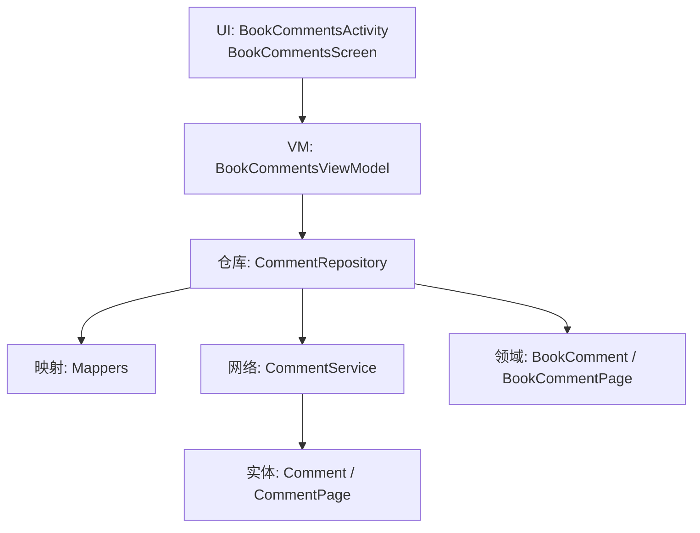
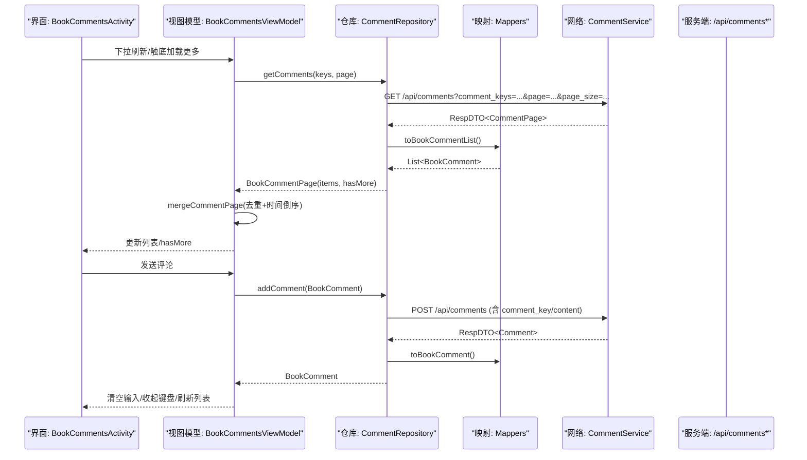
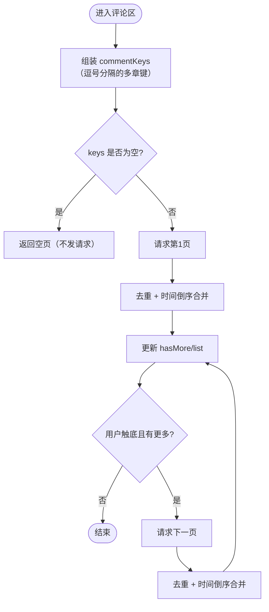
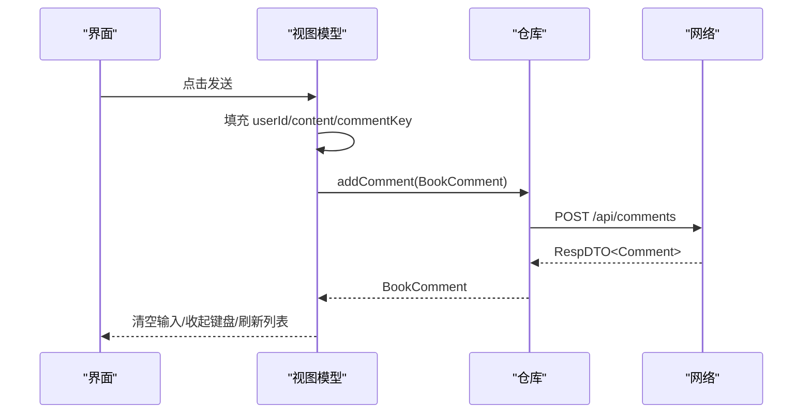
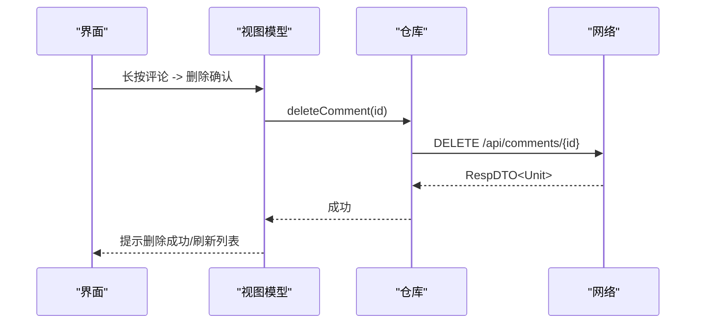
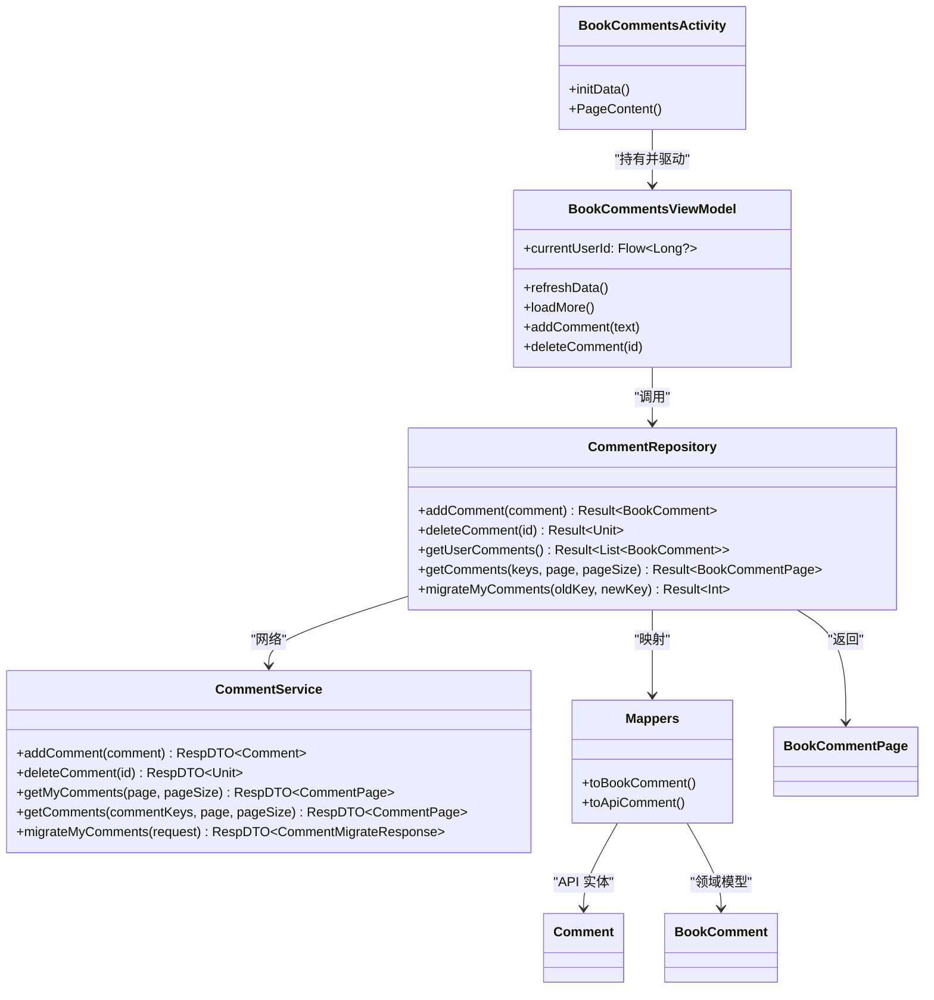

# 章节评论

<cite>
**本文引用的文件**
- [lib_book_common/src/main/java/com/ebook/common/repository/CommentRepository.kt](file://lib_book_common/src/main/java/com/ebook/common/repository/CommentRepository.kt)
- [lib_ebook_api/src/main/java/com/ebook/api/service/comment/CommentService.kt](file://lib_ebook_api/src/main/java/com/ebook/api/service/comment/CommentService.kt)
- [lib_ebook_api/src/main/java/com/ebook/api/entity/Comment.kt](file://lib_ebook_api/src/main/java/com/ebook/api/entity/Comment.kt)
- [lib_book_common/src/main/java/com/ebook/common/domain/BookComment.kt](file://lib_book_common/src/main/java/com/ebook/common/domain/BookComment.kt)
- [lib_book_common/src/main/java/com/ebook/common/domain/BookCommentPage.kt](file://lib_book_common/src/main/java/com/ebook/common/domain/BookCommentPage.kt)
- [lib_book_common/src/main/java/com/ebook/common/mapper/Mappers.kt](file://lib_book_common/src/main/java/com/ebook/common/mapper/Mappers.kt)
- [module_book/src/main/java/com/ebook/book/BookCommentsActivity.kt](file://module_book/src/main/java/com/ebook/book/BookCommentsActivity.kt)
- [module_book/src/main/java/com/ebook/book/mvvm/viewmodel/BookCommentsViewModel.kt](file://module_book/src/main/java/com/ebook/book/mvvm/viewmodel/BookCommentsViewModel.kt)
</cite>

## 目录
1. [简介](#简介)
2. [项目结构](#项目结构)
3. [核心组件](#核心组件)
4. [架构总览](#架构总览)
5. [详细组件分析](#详细组件分析)
6. [依赖关系分析](#依赖关系分析)
7. [性能考虑](#性能考虑)
8. [故障排查指南](#故障排查指南)
9. [结论](#结论)
10. [附录：API 使用示例与最佳实践](#附录api-使用示例与最佳实践)

## 简介
本章节围绕“章节评论系统”的技术实现进行系统化文档化，覆盖以下目标：
- 评论 CRUD：获取、发布、编辑（预留）、删除的端到端流程
- 按章浏览：章节关联、分页加载、排序策略
- 数据管理：本地缓存、云端同步、冲突解决思路
- UI 组件：评论列表、回复功能（扩展点）、点赞互动（扩展点）
- 搜索与筛选：关键词搜索、作者过滤、时间排序（能力边界与扩展建议）
- API 使用示例与性能优化建议

## 项目结构
评论系统横跨三层：
- 网络层（lib_ebook_api）：定义 RESTful 接口 CommentService 及实体 Comment
- 领域与仓库（lib_book_common）：领域模型 BookComment、分页模型 BookCommentPage、仓库 CommentRepository、映射器 Mappers
- 页面与视图（module_book）：BookCommentsActivity + BookCommentsViewModel 负责 UI 与交互编排

**图表来源**
- [module_book/src/main/java/com/ebook/book/BookCommentsActivity.kt](file://module_book/src/main/java/com/ebook/book/BookCommentsActivity.kt)
- [module_book/src/main/java/com/ebook/book/mvvm/viewmodel/BookCommentsViewModel.kt](file://module_book/src/main/java/com/ebook/book/mvvm/viewmodel/BookCommentsViewModel.kt)
- [lib_book_common/src/main/java/com/ebook/common/repository/CommentRepository.kt](file://lib_book_common/src/main/java/com/ebook/common/repository/CommentRepository.kt)
- [lib_book_common/src/main/java/com/ebook/common/mapper/Mappers.kt](file://lib_book_common/src/main/java/com/ebook/common/mapper/Mappers.kt)
- [lib_ebook_api/src/main/java/com/ebook/api/service/comment/CommentService.kt](file://lib_ebook_api/src/main/java/com/ebook/api/service/comment/CommentService.kt)
- [lib_ebook_api/src/main/java/com/ebook/api/entity/Comment.kt](file://lib_ebook_api/src/main/java/com/ebook/api/entity/Comment.kt)

**章节来源**
- [module_book/src/main/java/com/ebook/book/BookCommentsActivity.kt](file://module_book/src/main/java/com/ebook/book/BookCommentsActivity.kt)
- [module_book/src/main/java/com/ebook/book/mvvm/viewmodel/BookCommentsViewModel.kt](file://module_book/src/main/java/com/ebook/book/mvvm/viewmodel/BookCommentsViewModel.kt)
- [lib_book_common/src/main/java/com/ebook/common/repository/CommentRepository.kt](file://lib_book_common/src/main/java/com/ebook/common/repository/CommentRepository.kt)
- [lib_book_common/src/main/java/com/ebook/common/mapper/Mappers.kt](file://lib_book_common/src/main/java/com/ebook/common/mapper/Mappers.kt)
- [lib_ebook_api/src/main/java/com/ebook/api/service/comment/CommentService.kt](file://lib_ebook_api/src/main/java/com/ebook/api/service/comment/CommentService.kt)
- [lib_ebook_api/src/main/java/com/ebook/api/entity/Comment.kt](file://lib_ebook_api/src/main/java/com/ebook/api/entity/Comment.kt)

## 核心组件
- CommentRepository：封装评论的网络访问、分页合并、空键短路、迁移等逻辑
- CommentService：Retrofit 接口，声明评论创建、删除、我的评论、聚合查询、迁移等端点
- BookComment / BookCommentPage：领域模型与领域分页对象，屏蔽 DTO 细节
- Mappers：在 API 实体与领域模型之间做双向转换
- BookCommentsActivity + BookCommentsViewModel：承载评论区 UI、分页刷新/加载更多、发送/删除评论、本人判定、软键盘控制

**章节来源**
- [lib_book_common/src/main/java/com/ebook/common/repository/CommentRepository.kt](file://lib_book_common/src/main/java/com/ebook/common/repository/CommentRepository.kt)
- [lib_ebook_api/src/main/java/com/ebook/api/service/comment/CommentService.kt](file://lib_ebook_api/src/main/java/com/ebook/api/service/comment/CommentService.kt)
- [lib_book_common/src/main/java/com/ebook/common/domain/BookComment.kt](file://lib_book_common/src/main/java/com/ebook/common/domain/BookComment.kt)
- [lib_book_common/src/main/java/com/ebook/common/domain/BookCommentPage.kt](file://lib_book_common/src/main/java/com/ebook/common/domain/BookCommentPage.kt)
- [lib_book_common/src/main/java/com/ebook/common/mapper/Mappers.kt](file://lib_book_common/src/main/java/com/ebook/common/mapper/Mappers.kt)
- [module_book/src/main/java/com/ebook/book/BookCommentsActivity.kt](file://module_book/src/main/java/com/ebook/book/BookCommentsActivity.kt)
- [module_book/src/main/java/com/ebook/book/mvvm/viewmodel/BookCommentsViewModel.kt](file://module_book/src/main/java/com/ebook/book/mvvm/viewmodel/BookCommentsViewModel.kt)

## 架构总览
评论系统的调用链从 UI 到网络再回到 UI，采用 MVVM + Repository 模式，领域层屏蔽传输层 DTO。

**图表来源**
- [module_book/src/main/java/com/ebook/book/mvvm/viewmodel/BookCommentsViewModel.kt](file://module_book/src/main/java/com/ebook/book/mvvm/viewmodel/BookCommentsViewModel.kt)
- [lib_book_common/src/main/java/com/ebook/common/repository/CommentRepository.kt](file://lib_book_common/src/main/java/com/ebook/common/repository/CommentRepository.kt)
- [lib_ebook_api/src/main/java/com/ebook/api/service/comment/CommentService.kt](file://lib_ebook_api/src/main/java/com/ebook/api/service/comment/CommentService.kt)
- [lib_book_common/src/main/java/com/ebook/common/mapper/Mappers.kt](file://lib_book_common/src/main/java/com/ebook/common/mapper/Mappers.kt)

## 详细组件分析

### 评论获取与分页（按章浏览）
- 聚合键查询：通过传入一个或多个 commentKey（章键或书键），后端返回并集匹配页；空键列表直接返回空页，避免误拉全站
- 分页参数：page/page_size；默认 PAGE_SIZE=20，适合首屏快且翻页无感
- 合并与排序：合并时按 id 去重，并按 addTime 秒级精度倒序排列，确保多源/并发下展示一致
- 是否还有下一页：基于返回条数达到请求 pageSize 即认为可能有下一页，不依赖 total，避免越界页软 404 带来的误判

**图表来源**
- [module_book/src/main/java/com/ebook/book/mvvm/viewmodel/BookCommentsViewModel.kt](file://module_book/src/main/java/com/ebook/book/mvvm/viewmodel/BookCommentsViewModel.kt)
- [lib_book_common/src/main/java/com/ebook/common/repository/CommentRepository.kt](file://lib_book_common/src/main/java/com/ebook/common/repository/CommentRepository.kt)

**章节来源**
- [lib_book_common/src/main/java/com/ebook/common/repository/CommentRepository.kt](file://lib_book_common/src/main/java/com/ebook/common/repository/CommentRepository.kt)
- [module_book/src/main/java/com/ebook/book/mvvm/viewmodel/BookCommentsViewModel.kt](file://module_book/src/main/java/com/ebook/book/mvvm/viewmodel/BookCommentsViewModel.kt)

### 评论发布（新增）
- 入口：用户在底部输入栏输入内容后发送
- 归属键：写入写侧主键（writeKey），优先取路由传参 PRIMARY_COMMENT_KEY，否则回退 keys.firstOrNull()
- 身份：userId 取自当前会话；未登录时为 0，交由服务端校验 token
- 结果：成功后清空输入、收起键盘，并刷新列表

**图表来源**
- [module_book/src/main/java/com/ebook/book/BookCommentsActivity.kt](file://module_book/src/main/java/com/ebook/book/BookCommentsActivity.kt)
- [module_book/src/main/java/com/ebook/book/mvvm/viewmodel/BookCommentsViewModel.kt](file://module_book/src/main/java/com/ebook/book/mvvm/viewmodel/BookCommentsViewModel.kt)
- [lib_book_common/src/main/java/com/ebook/common/repository/CommentRepository.kt](file://lib_book_common/src/main/java/com/ebook/common/repository/CommentRepository.kt)
- [lib_ebook_api/src/main/java/com/ebook/api/service/comment/CommentService.kt](file://lib_ebook_api/src/main/java/com/ebook/api/service/comment/CommentService.kt)

**章节来源**
- [module_book/src/main/java/com/ebook/book/BookCommentsActivity.kt](file://module_book/src/main/java/com/ebook/book/BookCommentsActivity.kt)
- [module_book/src/main/java/com/ebook/book/mvvm/viewmodel/BookCommentsViewModel.kt](file://module_book/src/main/java/com/ebook/book/mvvm/viewmodel/BookCommentsViewModel.kt)
- [lib_book_common/src/main/java/com/ebook/common/repository/CommentRepository.kt](file://lib_book_common/src/main/java/com/ebook/common/repository/CommentRepository.kt)
- [lib_ebook_api/src/main/java/com/ebook/api/service/comment/CommentService.kt](file://lib_ebook_api/src/main/java/com/ebook/api/service/comment/CommentService.kt)

### 评论删除
- 权限：仅本人或管理员可删
- 行为：调用删除接口后，成功提示并刷新列表
- 界面：长按本人评论弹出确认对话框

**图表来源**
- [module_book/src/main/java/com/ebook/book/BookCommentsActivity.kt](file://module_book/src/main/java/com/ebook/book/BookCommentsActivity.kt)
- [module_book/src/main/java/com/ebook/book/mvvm/viewmodel/BookCommentsViewModel.kt](file://module_book/src/main/java/com/ebook/book/mvvm/viewmodel/BookCommentsViewModel.kt)
- [lib_book_common/src/main/java/com/ebook/common/repository/CommentRepository.kt](file://lib_book_common/src/main/java/com/ebook/common/repository/CommentRepository.kt)
- [lib_ebook_api/src/main/java/com/ebook/api/service/comment/CommentService.kt](file://lib_ebook_api/src/main/java/com/ebook/api/service/comment/CommentService.kt)

**章节来源**
- [module_book/src/main/java/com/ebook/book/BookCommentsActivity.kt](file://module_book/src/main/java/com/ebook/book/BookCommentsActivity.kt)
- [module_book/src/main/java/com/ebook/book/mvvm/viewmodel/BookCommentsViewModel.kt](file://module_book/src/main/java/com/ebook/book/mvvm/viewmodel/BookCommentsViewModel.kt)
- [lib_book_common/src/main/java/com/ebook/common/repository/CommentRepository.kt](file://lib_book_common/src/main/java/com/ebook/common/repository/CommentRepository.kt)
- [lib_ebook_api/src/main/java/com/ebook/api/service/comment/CommentService.kt](file://lib_ebook_api/src/main/java/com/ebook/api/service/comment/CommentService.kt)

### 评论编辑（现状与扩展点）
- 当前实现：未见编辑端点与 UI；建议在领域与仓库层增加 updateComment(commentId, content) 并在 ViewModel 中提供编辑入口
- 注意：若后续引入编辑，需复用现有评论项长按/双击等交互，并保持与删除一致的权限校验

[本节为概念性说明，未直接分析具体代码文件]

### 回复功能（现状与扩展点）
- 当前实现：评论条目无显式回复入口；可在评论项内添加“回复”按钮，携带父评论 id 作为 replyTo 字段
- 数据模型建议：在 BookComment 中可选增加 replyTo 字段；网络层新增回复端点或在创建时携带 replyTo
- 显示逻辑：在列表中嵌套显示回复树或平铺并高亮引用

[本节为概念性说明，未直接分析具体代码文件]

### 点赞互动（现状与扩展点）
- 当前实现：未包含点赞相关字段与交互
- 数据模型建议：在 BookComment 中增加 likedByCurrentUser/likeCount 等字段
- 网络层建议：新增点赞/取消点赞端点；在列表渲染时根据当前用户状态切换图标
- 性能建议：对高频点赞操作可先乐观更新 UI，失败再回滚

[本节为概念性说明，未直接分析具体代码文件]

### 数据管理与同步（本地缓存、云端同步、冲突解决）
- 本地缓存：当前实现以内存列表为主，无持久化缓存；如需离线阅读评论，可在仓库层引入本地存储（如 Room）并在网络成功时合并
- 云端同步：所有读写均走 CommentService；分页读取通过聚合键（commentKey）定位桶
- 冲突解决：
  - 去重：合并时按 id 去重，避免刷新/加载更多导致的重复
  - 排序：统一按 addTime 秒级精度倒序，保证全局一致性
  - 迁移：提供 migrateMyComments(oldKey, newKey) 支持换源后保留历史评论

**章节来源**
- [lib_book_common/src/main/java/com/ebook/common/repository/CommentRepository.kt](file://lib_book_common/src/main/java/com/ebook/common/repository/CommentRepository.kt)
- [module_book/src/main/java/com/ebook/book/mvvm/viewmodel/BookCommentsViewModel.kt](file://module_book/src/main/java/com/ebook/book/mvvm/viewmodel/BookCommentsViewModel.kt)

### 评论 UI 组件
- 列表：RefreshableList + LazyColumn，支持下拉刷新与触底加载更多
- 输入栏：多行文本框 + 发送按钮，发送成功后自动收起软键盘
- 条目：头像、用户名、内容、时间右对齐；长按本人评论弹出删除确认
- 本人判定：通过 currentUserId 与评论 userId 比较，避免昵称比对造成的误判

**章节来源**
- [module_book/src/main/java/com/ebook/book/BookCommentsActivity.kt](file://module_book/src/main/java/com/ebook/book/BookCommentsActivity.kt)
- [module_book/src/main/java/com/ebook/book/mvvm/viewmodel/BookCommentsViewModel.kt](file://module_book/src/main/java/com/ebook/book/mvvm/viewmodel/BookCommentsViewModel.kt)

### 搜索与筛选
- 当前实现：未内置关键词搜索、作者过滤、时间排序开关；排序已在合并阶段固定为时间倒序
- 扩展建议：
  - 关键词搜索：在 CommentService 新增带 keyword 参数的查询端点，或在前端对已加载数据进行内存过滤（小数据量）
  - 作者过滤：在列表顶部增加作者下拉选择，结合后端 author_id 过滤或前端匹配
  - 时间排序：保持默认时间倒序，可增加“最早”选项，配合后端 order_by 参数

[本节为概念性说明，未直接分析具体代码文件]

## 依赖关系分析

**图表来源**
- [lib_ebook_api/src/main/java/com/ebook/api/service/comment/CommentService.kt](file://lib_ebook_api/src/main/java/com/ebook/api/service/comment/CommentService.kt)
- [lib_book_common/src/main/java/com/ebook/common/repository/CommentRepository.kt](file://lib_book_common/src/main/java/com/ebook/common/repository/CommentRepository.kt)
- [module_book/src/main/java/com/ebook/book/mvvm/viewmodel/BookCommentsViewModel.kt](file://module_book/src/main/java/com/ebook/book/mvvm/viewmodel/BookCommentsViewModel.kt)
- [module_book/src/main/java/com/ebook/book/BookCommentsActivity.kt](file://module_book/src/main/java/com/ebook/book/BookCommentsActivity.kt)
- [lib_book_common/src/main/java/com/ebook/common/mapper/Mappers.kt](file://lib_book_common/src/main/java/com/ebook/common/mapper/Mappers.kt)
- [lib_ebook_api/src/main/java/com/ebook/api/entity/Comment.kt](file://lib_ebook_api/src/main/java/com/ebook/api/entity/Comment.kt)
- [lib_book_common/src/main/java/com/ebook/common/domain/BookComment.kt](file://lib_book_common/src/main/java/com/ebook/common/domain/BookComment.kt)
- [lib_book_common/src/main/java/com/ebook/common/domain/BookCommentPage.kt](file://lib_book_common/src/main/java/com/ebook/common/domain/BookCommentPage.kt)

**章节来源**
- [lib_ebook_api/src/main/java/com/ebook/api/service/comment/CommentService.kt](file://lib_ebook_api/src/main/java/com/ebook/api/service/comment/CommentService.kt)
- [lib_book_common/src/main/java/com/ebook/common/repository/CommentRepository.kt](file://lib_book_common/src/main/java/com/ebook/common/repository/CommentRepository.kt)
- [module_book/src/main/java/com/ebook/book/mvvm/viewmodel/BookCommentsViewModel.kt](file://module_book/src/main/java/com/ebook/book/mvvm/viewmodel/BookCommentsViewModel.kt)
- [module_book/src/main/java/com/ebook/book/BookCommentsActivity.kt](file://module_book/src/main/java/com/ebook/book/BookCommentsActivity.kt)
- [lib_book_common/src/main/java/com/ebook/common/mapper/Mappers.kt](file://lib_book_common/src/main/java/com/ebook/common/mapper/Mappers.kt)
- [lib_ebook_api/src/main/java/com/ebook/api/entity/Comment.kt](file://lib_ebook_api/src/main/java/com/ebook/api/entity/Comment.kt)
- [lib_book_common/src/main/java/com/ebook/common/domain/BookComment.kt](file://lib_book_common/src/main/java/com/ebook/common/domain/BookComment.kt)
- [lib_book_common/src/main/java/com/ebook/common/domain/BookCommentPage.kt](file://lib_book_common/src/main/java/com/ebook/common/domain/BookCommentPage.kt)

## 性能考虑
- 分页大小：PAGE_SIZE=20 平衡首屏速度与单请求载荷；“我的评论”暂用大页（100）避免截断
- 合并与排序：合并阶段按 id 去重并按 addTime 秒级精度排序，避免随机序导致体验抖动
- 短列表守卫：首次为空列表时不会触发 loadMore，减少无效请求
- 网络错误处理：reportFailure 统一上报，避免重复提示；加载失败抑制自动重试直至下次刷新成功
- 软键盘：发送成功后主动收起键盘，减少 UI 卡顿与遮挡

[本节提供通用指导，不直接分析具体代码文件]

## 故障排查指南
- 评论永远加载不出来：检查网络模块 mock/real 配置是否正确；确认 ebook.server.host 与 adb reverse 设置
- 发送评论无响应：确认当前会话是否有效；未登录时 userId=0，服务端将拒绝；查看 reportFailure 日志
- 列表重复或顺序异常：确认合并逻辑是否被修改；确保 distinctBy(id) 与 sortedByDescending(addTime) 存在
- 删除评论无效：确认权限（仅本人或管理员）；检查服务端返回码与注释约定

**章节来源**
- [module_book/src/main/java/com/ebook/book/mvvm/viewmodel/BookCommentsViewModel.kt](file://module_book/src/main/java/com/ebook/book/mvvm/viewmodel/BookCommentsViewModel.kt)
- [lib_book_common/src/main/java/com/ebook/common/repository/CommentRepository.kt](file://lib_book_common/src/main/java/com/ebook/common/repository/CommentRepository.kt)

## 结论
本章评论系统通过清晰的分层（UI/VM/Repository/Network）实现了按章浏览、分页加载与时间倒序展示；CRUD 方面已落地获取、发布与删除，编辑与回复/点赞可作为扩展点逐步完善。数据层面通过聚合键定位评论桶、合并去重与排序保证一致性；未来可加入本地缓存与更丰富的筛选能力以提升体验。

[本节总结性陈述，不直接分析具体代码文件]

## 附录：API 使用示例与最佳实践
- 创建评论
  - 端点：POST /api/comments
  - 请求体：Comment（content 必填，commentKey 必填；章节字段可选）
  - 成功响应：RespDTO<Comment>
  - 参考：[CommentService.addComment](file://lib_ebook_api/src/main/java/com/ebook/api/service/comment/CommentService.kt)
- 删除评论
  - 端点：DELETE /api/comments/{id}
  - 成功响应：RespDTO<Unit>
  - 参考：[CommentService.deleteComment](file://lib_ebook_api/src/main/java/com/ebook/api/service/comment/CommentService.kt)
- 我的评论列表
  - 端点：GET /api/comments/my?page={p}&page_size={s}
  - 成功响应：RespDTO<CommentPage>
  - 参考：[CommentService.getMyComments](file://lib_ebook_api/src/main/java/com/ebook/api/service/comment/CommentService.kt)
- 查询评论（按章/书聚合键）
  - 端点：GET /api/comments?comment_keys={k1,k2,...}&page={p}&page_size={s}
  - 成功响应：RespDTO<CommentPage>
  - 参考：[CommentService.getComments](file://lib_ebook_api/src/main/java/com/ebook/api/service/comment/CommentService.kt)
- 迁移评论（换源保留历史）
  - 端点：POST /api/comments/migrate
  - 请求体：CommentMigrateRequest（oldKey/newKey）
  - 成功响应：RespDTO<CommentMigrateResponse>
  - 参考：[CommentService.migrateMyComments](file://lib_ebook_api/src/main/java/com/ebook/api/service/comment/CommentService.kt)

最佳实践
- 使用聚合键（commentKey）精准定位评论桶，避免全文检索开销
- 分页加载时基于返回条数判断 hasMore，减少对 total 的依赖
- 合并与排序集中在仓库/VM 层，保证多源/并发场景下的展示一致性
- 错误统一上报，避免重复提示与状态不一致

**章节来源**
- [lib_ebook_api/src/main/java/com/ebook/api/service/comment/CommentService.kt](file://lib_ebook_api/src/main/java/com/ebook/api/service/comment/CommentService.kt)
- [lib_book_common/src/main/java/com/ebook/common/repository/CommentRepository.kt](file://lib_book_common/src/main/java/com/ebook/common/repository/CommentRepository.kt)
- [module_book/src/main/java/com/ebook/book/mvvm/viewmodel/BookCommentsViewModel.kt](file://module_book/src/main/java/com/ebook/book/mvvm/viewmodel/BookCommentsViewModel.kt)