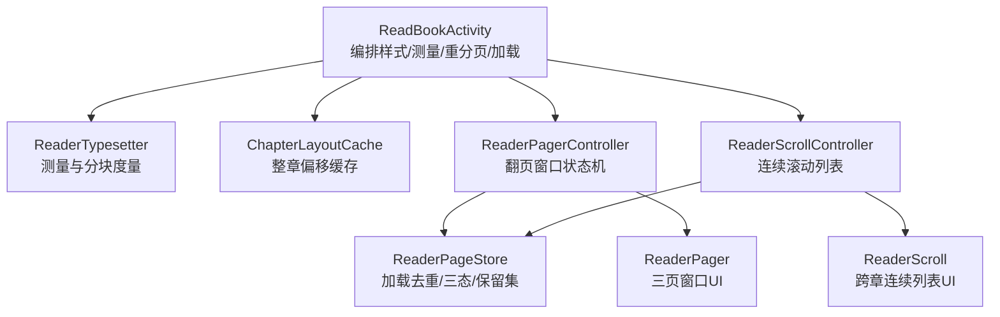
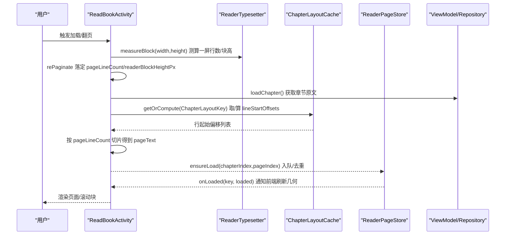
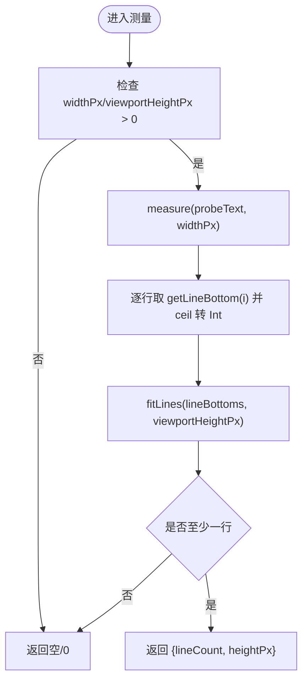
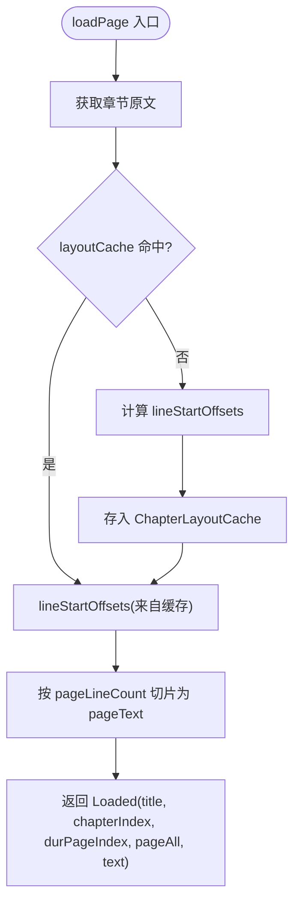
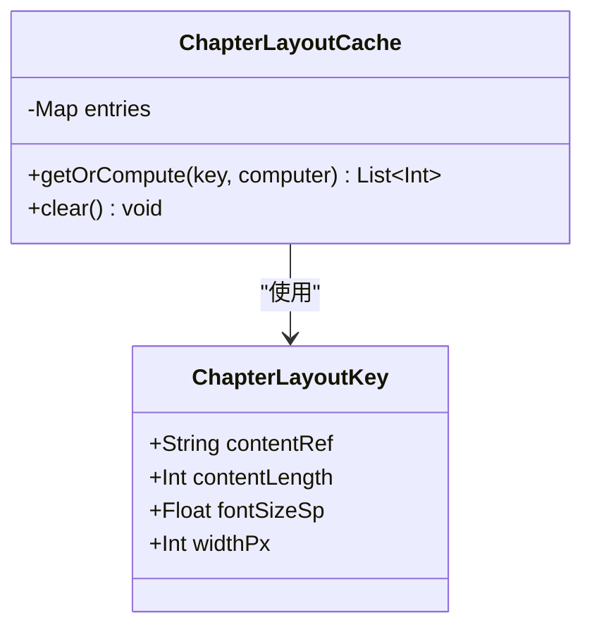
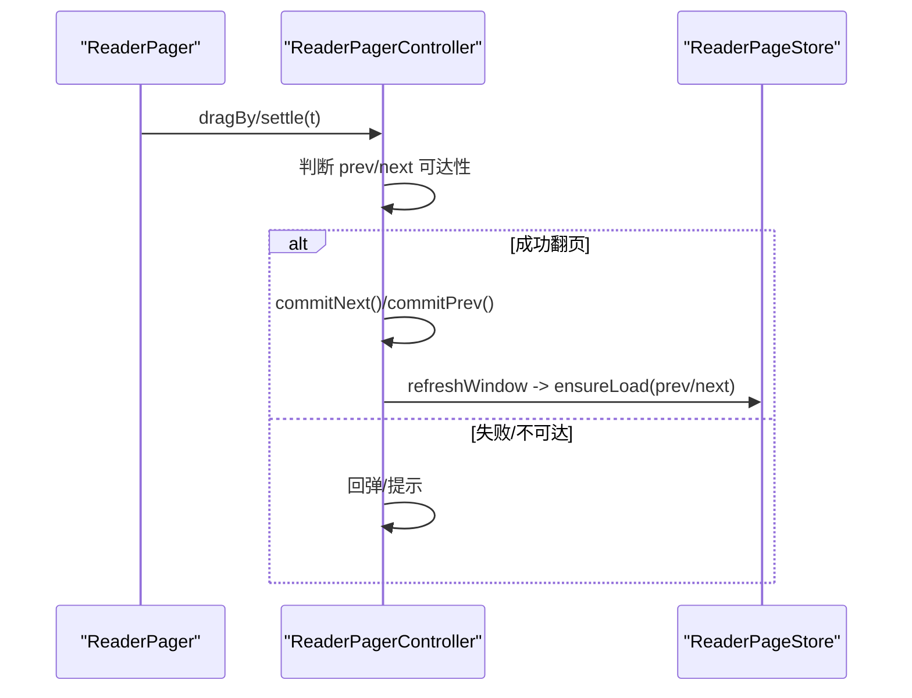
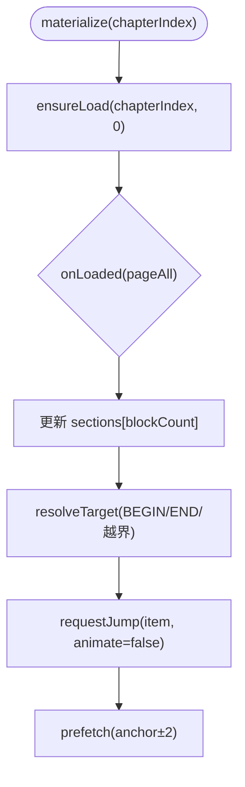
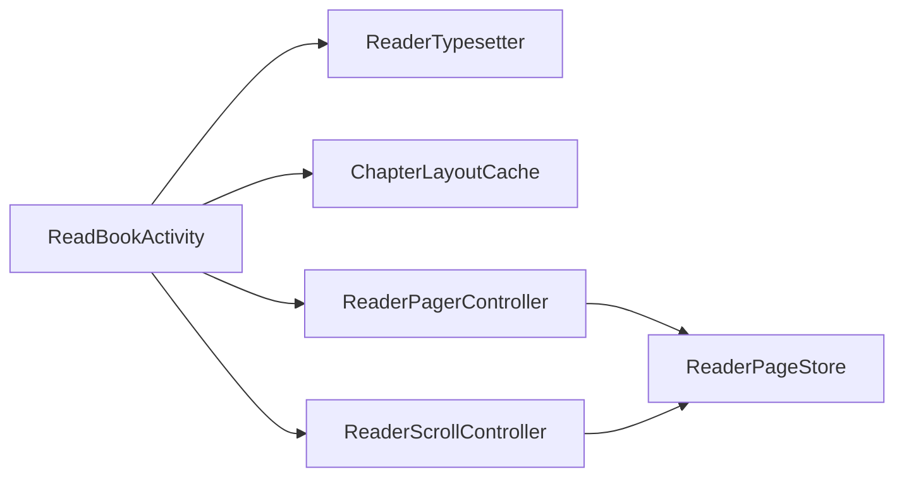

# 排版引擎

<cite>
**本文引用的文件**
- [ChapterLayoutCache.kt](file://module_book/src/main/java/com/ebook/book/reader/ChapterLayoutCache.kt)
- [ReaderTypesetter.kt](file://module_book/src/main/java/com/ebook/book/reader/ReaderTypesetter.kt)
- [ReaderPager.kt](file://module_book/src/main/java/com/ebook/book/reader/ReaderPager.kt)
- [ReaderScroll.kt](file://module_book/src/main/java/com/ebook/book/reader/ReaderScroll.kt)
- [ReaderScrollController.kt](file://module_book/src/main/java/com/ebook/book/reader/ReaderScrollController.kt)
- [ReadBookActivity.kt](file://module_book/src/main/java/com/ebook/book/ReadBookActivity.kt)
</cite>

## 目录
1. [简介](#简介)
2. [项目结构](#项目结构)
3. [核心组件](#核心组件)
4. [架构总览](#架构总览)
5. [详细组件分析](#详细组件分析)
6. [依赖关系分析](#依赖关系分析)
7. [性能考量](#性能考量)
8. [故障排查指南](#故障排查指南)
9. [结论](#结论)
10. [附录](#附录)

## 简介
本技术文档聚焦阅读器的“排版引擎”：从字符测量、行分割、段落处理、图片适配（在正文块中的承载与占位策略），到分页算法（页面分割、断行规则、溢出处理）、字体渲染机制（字号调整、行高计算、对齐方式）、布局缓存系统（ChapterLayoutKey 设计、失效策略、并发安全）、性能优化（整章排版缓存、增量计算、内存管理）以及可扩展的自定义排版接口。文档同时提供质量评估与调试建议，帮助读者与开发者理解并改进阅读体验。

## 项目结构
排版相关代码集中在 module_book 的 reader 子包与 ReadBookActivity：
- ReaderTypesetter：统一的文本测量与分块度量（行数、块高）
- ChapterLayoutCache + ChapterLayoutKey：整章排版偏移的缓存键与缓存容器
- ReaderPager / ReaderPagerController：翻页模式的分页控制器与 UI
- ReaderScroll / ReaderScrollController：滚屏模式的连续列表控制器与 UI
- ReadBookActivity：编排样式、尺寸测量、重分页、加载单页内容（含缓存命中与切片）

图示来源
- [ReadBookActivity.kt:251-377](file://module_book/src/main/java/com/ebook/book/ReadBookActivity.kt#L251-L377)
- [ReaderTypesetter.kt:29-176](file://module_book/src/main/java/com/ebook/book/reader/ReaderTypesetter.kt#L29-L176)
- [ChapterLayoutCache.kt:18-61](file://module_book/src/main/java/com/ebook/book/reader/ChapterLayoutCache.kt#L18-L61)
- [ReaderPager.kt:110-323](file://module_book/src/main/java/com/ebook/book/reader/ReaderPager.kt#L110-L323)
- [ReaderScrollController.kt:89-397](file://module_book/src/main/java/com/ebook/book/reader/ReaderScrollController.kt#L89-L397)
- [ReaderPager.kt:336-479](file://module_book/src/main/java/com/ebook/book/reader/ReaderPager.kt#L336-L479)
- [ReaderScroll.kt:72-233](file://module_book/src/main/java/com/ebook/book/reader/ReaderScroll.kt#L72-L233)

章节来源
- [ReadBookActivity.kt:251-377](file://module_book/src/main/java/com/ebook/book/ReadBookActivity.kt#L251-L377)
- [ReaderTypesetter.kt:29-176](file://module_book/src/main/java/com/ebook/book/reader/ReaderTypesetter.kt#L29-L176)
- [ChapterLayoutCache.kt:18-61](file://module_book/src/main/java/com/ebook/book/reader/ChapterLayoutCache.kt#L18-L61)
- [ReaderPager.kt:110-323](file://module_book/src/main/java/com/ebook/book/reader/ReaderPager.kt#L110-L323)
- [ReaderScrollController.kt:89-397](file://module_book/src/main/java/com/ebook/book/reader/ReaderScrollController.kt#L89-L397)
- [ReaderPager.kt:336-479](file://module_book/src/main/java/com/ebook/book/reader/ReaderPager.kt#L336-L479)
- [ReaderScroll.kt:72-233](file://module_book/src/main/java/com/ebook/book/reader/ReaderScroll.kt#L72-L233)

## 核心组件
- ReaderTypesetter：统一分页与渲染的“事实源”。通过 Compose TextMeasurer 对同一份 TextStyle 进行测量，返回每行的起始偏移与一屏可容纳的行数及实测块高。
- ChapterLayoutCache + ChapterLayoutKey：以“章节+内容指纹+字号+宽度”作为键，缓存整章各渲染行在原文中的起始偏移，避免同章翻页重复 O(章长) 重排。
- ReaderPageStore：两种翻页方式的共用加载仓库，负责去重、错误重试、保留集裁剪，保证并发预加载下的正确性与内存可控。
- ReaderPagerController / ReaderPager：翻页模式的三页窗口状态机与 UI，负责前后页请求、窗口收敛与手势动画。
- ReaderScrollController / ReaderScroll：滚屏模式的跨章连续列表，按“标题项 + 块项”组织，惰性物化相邻章，按章半径裁剪正文保留集。

章节来源
- [ReaderTypesetter.kt:29-176](file://module_book/src/main/java/com/ebook/book/reader/ReaderTypesetter.kt#L29-L176)
- [ChapterLayoutCache.kt:18-61](file://module_book/src/main/java/com/ebook/book/reader/ChapterLayoutCache.kt#L18-L61)
- [ReaderPager.kt:110-323](file://module_book/src/main/java/com/ebook/book/reader/ReaderPager.kt#L110-L323)
- [ReaderScrollController.kt:89-397](file://module_book/src/main/java/com/ebook/book/reader/ReaderScrollController.kt#L89-L397)

## 架构总览
排版引擎遵循“分页与渲染同源”的契约：同一份样式由同一测量器产出，确保“切几行”和“画几行”一致。整体流程如下：

图示来源
- [ReadBookActivity.kt:251-377](file://module_book/src/main/java/com/ebook/book/ReadBookActivity.kt#L251-L377)
- [ReaderTypesetter.kt:53-85](file://module_book/src/main/java/com/ebook/book/reader/ReaderTypesetter.kt#L53-L85)
- [ChapterLayoutCache.kt:38-55](file://module_book/src/main/java/com/ebook/book/reader/ChapterLayoutCache.kt#L38-L55)
- [ReaderPager.kt:149-191](file://module_book/src/main/java/com/ebook/book/reader/ReaderPager.kt#L149-L191)
- [ReaderScrollController.kt:127-146](file://module_book/src/main/java/com/ebook/book/reader/ReaderScrollController.kt#L127-L146)

## 详细组件分析

### 文本测量与行分割（ReaderTypesetter）
- 行分割：lineStartOffsets(text, widthPx) 使用 Compose 的 TextMeasurer 输出每行起始偏移，避免平台 StaticLayout 与 Compose 渲染差异导致的“多行被裁”问题。
- 分页计数：fitRenderLineCount(widthPx, heightPx) 直接问渲染引擎“视口能放几行”，替代经验公式，消除累积误差。
- 块度量：measureBlock(widthPx, viewportHeightPx) 给出“行数 + 实测总高”，用于滚屏模式精确拼接块高，避免心算行高导致缝隙或重叠。
- 探针：probeText 用等行长串估算行高，覆盖任意屏幕高度；向上取整保证临界行不越界误判。

图示来源
- [ReaderTypesetter.kt:53-85](file://module_book/src/main/java/com/ebook/book/reader/ReaderTypesetter.kt#L53-L85)
- [ReaderTypesetter.kt:167-175](file://module_book/src/main/java/com/ebook/book/reader/ReaderTypesetter.kt#L167-L175)

章节来源
- [ReaderTypesetter.kt:29-176](file://module_book/src/main/java/com/ebook/book/reader/ReaderTypesetter.kt#L29-L176)

### 分页算法（页面分割、断行规则、溢出处理）
- 页面分割：基于 pageLineCount（由阅读器测量落定），将 lineStartOffsets 分段为若干页；哨兵页码 BEGIN/END 解析为首/末页。
- 断行规则：完全交由 Compose 文本测量器决定；避免两套引擎判定不一致导致的“静默丢行”。
- 溢出处理：页文本取自原文连续子串（首行偏移到下一页首行偏移或文末），末尾去除换行以避免多余空行；最后一页特殊处理，防止截断。
- 块高溢出：滚屏模式下块高取自测量结果，严格无缝拼接；若测量失败则不分块，避免空块导致空白页。

图示来源
- [ReadBookActivity.kt:308-377](file://module_book/src/main/java/com/ebook/book/ReadBookActivity.kt#L308-L377)
- [ChapterLayoutCache.kt:38-55](file://module_book/src/main/java/com/ebook/book/reader/ChapterLayoutCache.kt#L38-L55)

章节来源
- [ReadBookActivity.kt:308-377](file://module_book/src/main/java/com/ebook/book/ReadBookActivity.kt#L308-L377)

### 段落处理与图片适配
- 段落处理：段落分隔符使用 \r\n；由于 Compose 断行会将 \n 吞进行间隔，因此采用“偏移切片”而非“行子串拼接”，从而原样保留段落分隔符，避免段落合并导致的折行错乱。
- 图片适配：当前实现以纯文本为主；图片/富媒体在阅读器中通常作为“块内元素”参与测量。为保证块高精确，应优先使用排版引擎测量的 blockHeightPx，而非固定行高估算。对于复杂富文本，需确保其测量与渲染走同一管线，否则同样会引发“切行与画行不一致”。

章节来源
- [ReaderTypesetter.kt:35-57](file://module_book/src/main/java/com/ebook/book/reader/ReaderTypesetter.kt#L35-L57)
- [ReaderTypesetter.kt:69-85](file://module_book/src/main/java/com/ebook/book/reader/ReaderTypesetter.kt#L69-L85)

### 字体渲染机制（字号调整、行高计算、对齐方式）
- 字号调整：fontSizeSp 变化会触发 rememberReaderTypesetter 重建，随后调用 rePaginate 重新测算行数与块高，确保新字号下分页与渲染一致。
- 行高计算：lineHeight = 字高 + 段距（textExtra），通过 TextPaint 获取字高再转换为 sp；保证与 Compose 渲染一致。
- 对齐方式：textAlign=Start，lineHeightStyle 固定为 Center/Trim.None，避免主题隐式解析带来的首末行 leading 裁剪差异。

章节来源
- [ReaderTypesetter.kt:117-146](file://module_book/src/main/java/com/ebook/book/reader/ReaderTypesetter.kt#L117-L146)
- [ReadBookActivity.kt:433-454](file://module_book/src/main/java/com/ebook/book/ReadBookActivity.kt#L433-L454)
- [ReadBookActivity.kt:468-483](file://module_book/src/main/java/com/ebook/book/ReadBookActivity.kt#L468-L483)

### 布局缓存系统（ChapterLayoutKey、失效策略、并发安全）
- 键设计：ChapterLayoutKey 包含 contentRef、contentLength、fontSizeSp、widthPx。其中 contentLength 作为“内容指纹”的轻量替代，避免全量哈希的高成本；长度不等必然重排，极端等长异文不会造成整页错位。
- 失效策略：改字号/字体、正文宽度变化、内容重抓（URL 不变但正文已变）均会导致键不同，自动触发重排；无需显式失效入口。
- 并发安全：使用 Collections.synchronizedMap 包装 LinkedHashMap，getOrCompute 在同步块内完成 check-then-act，避免并发预加载时多个线程重复计算。

图示来源
- [ChapterLayoutCache.kt:18-61](file://module_book/src/main/java/com/ebook/book/reader/ChapterLayoutCache.kt#L18-L61)

章节来源
- [ChapterLayoutCache.kt:18-61](file://module_book/src/main/java/com/ebook/book/reader/ChapterLayoutCache.kt#L18-L61)

### 分页控制器与 UI（翻页模式）
- ReaderPagerController：维护 dur/prev/next 三页窗口、拖拽位移、翻页阈值与动画；在加载完成后刷新窗口并预取邻页。
- ReaderPager：三页层级绘制与手势处理；仅当前页测量正文区尺寸，避免三页重复回调；点击三分区与拖拽阈值联动。

图示来源
- [ReaderPager.kt:110-323](file://module_book/src/main/java/com/ebook/book/reader/ReaderPager.kt#L110-L323)
- [ReaderPager.kt:336-479](file://module_book/src/main/java/com/ebook/book/reader/ReaderPager.kt#L336-L479)

章节来源
- [ReaderPager.kt:110-323](file://module_book/src/main/java/com/ebook/book/reader/ReaderPager.kt#L110-L323)
- [ReaderPager.kt:336-479](file://module_book/src/main/java/com/ebook/book/reader/ReaderPager.kt#L336-L479)

### 分页控制器与 UI（滚屏模式）
- ReaderScrollController：维护章节段（标题项 + 块项），惰性物化相邻章，锚点以 (章, 块) 语义值保存，避免上方插入导致的序号平移；预取邻域块平滑滚动。
- ReaderScroll：跨章连续列表，块高固定为排版实测值，Loading/Error 块也占一屏高，保持滚动位置稳定。

图示来源
- [ReaderScrollController.kt:324-348](file://module_book/src/main/java/com/ebook/book/reader/ReaderScrollController.kt#L324-L348)
- [ReaderScrollController.kt:127-146](file://module_book/src/main/java/com/ebook/book/reader/ReaderScrollController.kt#L127-L146)
- [ReaderScroll.kt:72-233](file://module_book/src/main/java/com/ebook/book/reader/ReaderScroll.kt#L72-L233)

章节来源
- [ReaderScrollController.kt:89-397](file://module_book/src/main/java/com/ebook/book/reader/ReaderScrollController.kt#L89-L397)
- [ReaderScroll.kt:72-233](file://module_book/src/main/java/com/ebook/book/reader/ReaderScroll.kt#L72-L233)

### 加载仓库（ReaderPageStore）
- 去重：按 ReaderPageKey 登记 in-flight Job，避免重复请求；已 Loaded 的页不重抓。
- 回调：onLoaded 由前端根据 key 相关性判断是否仍与自己有关（翻页模式判 durKey，滚屏模式判锚点章）。
- 保留集：retain(keep) 清理超出保留集的页面与任务，翻页模式保留三页窗口，滚屏模式保留锚点章 ±N 章的全部块。

章节来源
- [ReaderPager.kt:149-191](file://module_book/src/main/java/com/ebook/book/reader/ReaderPager.kt#L149-L191)
- [ReaderScrollController.kt:360-369](file://module_book/src/main/java/com/ebook/book/reader/ReaderScrollController.kt#L360-L369)

## 依赖关系分析
- ReadBookActivity 依赖 ReaderTypesetter 进行测量，依赖 ChapterLayoutCache 缓存偏移，依赖两个控制器驱动 UI。
- 两个控制器共享 ReaderPageStore，统一加载与保留策略。
- ReaderTypesetter 依赖 Compose 的 TextMeasurer/Density/TextStyle，确保分页与渲染同源。

图示来源
- [ReadBookActivity.kt:251-377](file://module_book/src/main/java/com/ebook/book/ReadBookActivity.kt#L251-L377)
- [ReaderPager.kt:149-191](file://module_book/src/main/java/com/ebook/book/reader/ReaderPager.kt#L149-L191)
- [ReaderScrollController.kt:127-146](file://module_book/src/main/java/com/ebook/book/reader/ReaderScrollController.kt#L127-L146)

章节来源
- [ReadBookActivity.kt:251-377](file://module_book/src/main/java/com/ebook/book/ReadBookActivity.kt#L251-L377)
- [ReaderPager.kt:149-191](file://module_book/src/main/java/com/ebook/book/reader/ReaderPager.kt#L149-L191)
- [ReaderScrollController.kt:127-146](file://module_book/src/main/java/com/ebook/book/reader/ReaderScrollController.kt#L127-L146)

## 性能考量
- 整章排版缓存：ChapterLayoutCache 避免同章翻页重复 O(章长) 重排，默认容量约覆盖“当前章 + 前后各两章”。
- 增量计算：滚屏模式通过 prefetch(±2) 预取邻域块，减少滚动卡顿；块高由测量器实测，避免心算误差。
- 内存管理：
  - 翻页模式：retain 只保留三页窗口，避免跨章累积。
  - 滚屏模式：按“章”半径裁剪（锚点章 ±2），避免正文无限增长；章节段元数据不裁剪，保证列表连续性。
- 并发安全：getOrCompute 在同步块内完成，避免并发预加载竞争条件。

章节来源
- [ChapterLayoutCache.kt:38-61](file://module_book/src/main/java/com/ebook/book/reader/ChapterLayoutCache.kt#L38-L61)
- [ReaderScrollController.kt:342-348](file://module_book/src/main/java/com/ebook/book/reader/ReaderScrollController.kt#L342-L348)
- [ReaderPager.kt:312-323](file://module_book/src/main/java/com/ebook/book/reader/ReaderPager.kt#L312-L323)
- [ReaderScrollController.kt:360-369](file://module_book/src/main/java/com/ebook/book/reader/ReaderScrollController.kt#L360-L369)

## 故障排查指南
- 书源失效：loadPage 捕获 BookSourceNotFoundException，经 reportFailure 提示用户“书源已失效，请重新导入或换源”，避免“页面不闪退、数据永远加载不出来”的静默失败。
- 无上一页/下一页：控制器在边界处提示；翻页模式通过 prevKey/nextKey 为 null 判定。
- 正文缺失：若章节原文为空或未就绪，loadPage 返回 null，UI 显示错误态并提供重试按钮。
- 进度丢失：冷启动恢复通过哨兵页码解析；滚屏模式在块数未知时先落第 0 块，待 pageAll 确定后再解析并补发滚动。

章节来源
- [ReadBookActivity.kt:361-376](file://module_book/src/main/java/com/ebook/book/ReadBookActivity.kt#L361-L376)
- [ReaderPager.kt:237-267](file://module_book/src/main/java/com/ebook/book/reader/ReaderPager.kt#L237-L267)
- [ReaderScrollController.kt:258-265](file://module_book/src/main/java/com/ebook/book/reader/ReaderScrollController.kt#L258-L265)

## 结论
该排版引擎通过“分页与渲染同源”的设计，确保了切行与画行的一致性，消除了历史缺陷中的“静默丢行”问题。借助 ChapterLayoutCache 的整章偏移缓存与 ReaderPageStore 的并发安全加载，实现了高性能与低内存占用。翻页与滚屏两种模式共享同一套测量与加载逻辑，简化了扩展与维护。未来可在富文本/图片场景进一步统一测量管线，以确保更复杂的排版需求也能满足“切行=画行”的强约束。

## 附录
- 自定义排版扩展建议：
  - 新增样式（字号、行高、对齐）时，务必通过 rememberReaderTypesetter 重组并触发 rePaginate，以保证所有下游读取最新样式。
  - 富媒体（图片/表格）建议纳入测量流程，使用同一 TextStyle 与 Constraints，避免“切行与画行”偏差。
  - 如需自定义断行策略，应在 ReaderTypesetter 层封装，保持与渲染侧一致。
- 质量评估与调试：
  - 使用 fitRenderLineCount 与 measureBlock 的返回值校验“一页行数”与“块高”是否符合预期。
  - 观察 ChapterLayoutCache 命中率，评估超长章的重排开销。
  - 利用 ReaderPageStore 的 retain 策略验证内存占用与滚动流畅度。