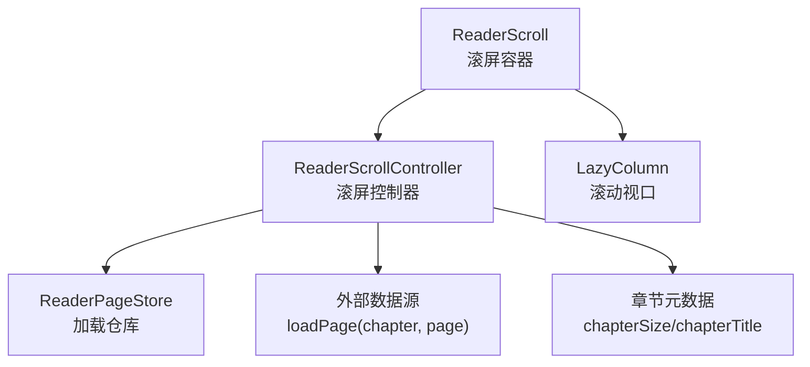
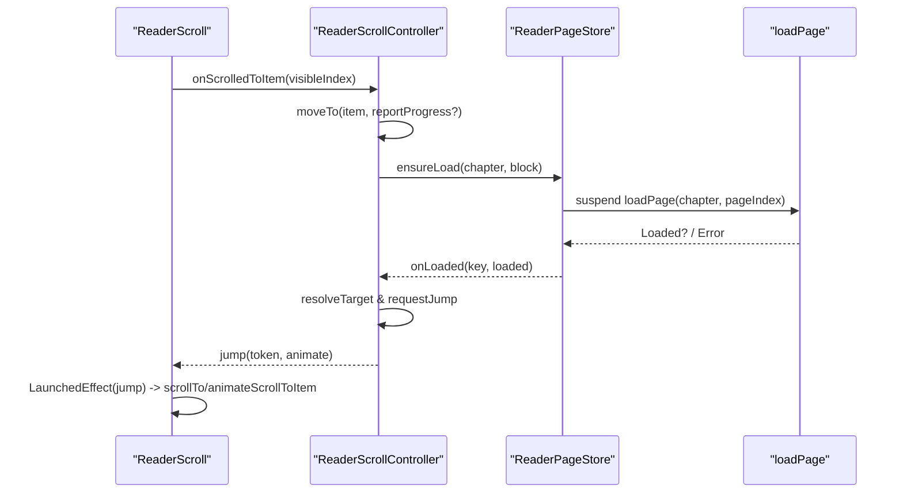
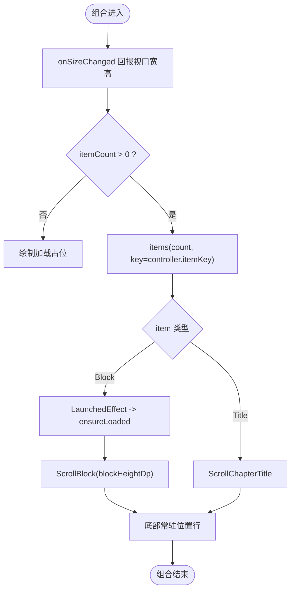
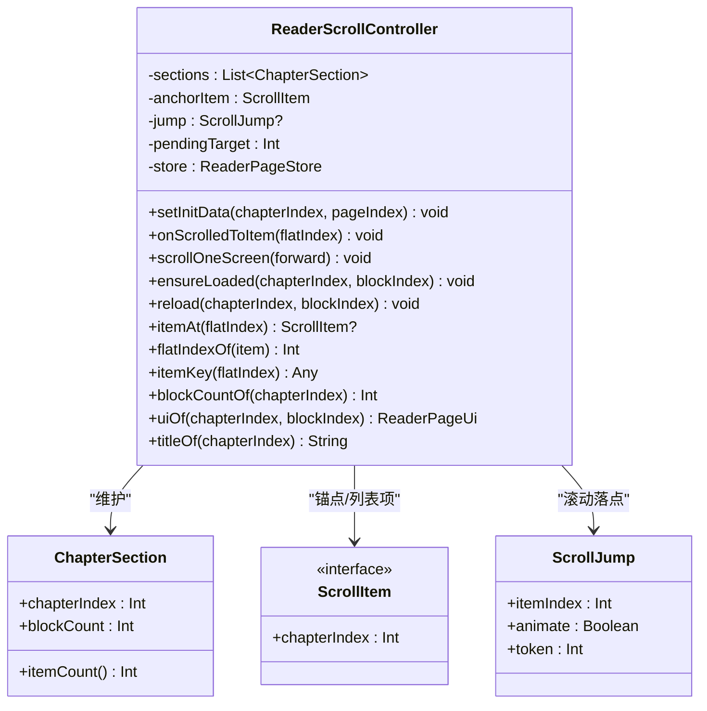
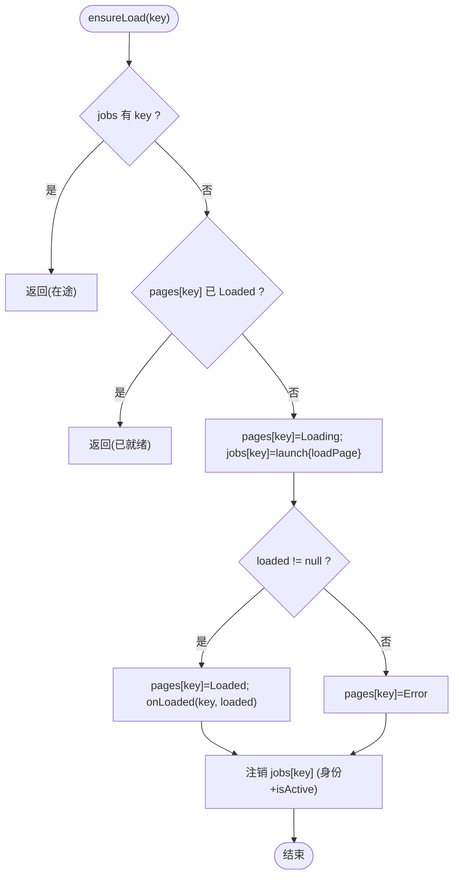
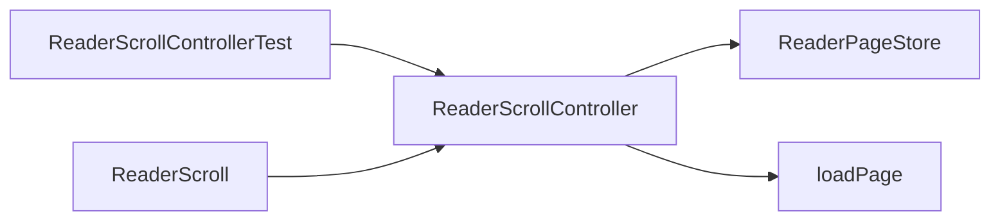

# 滚屏模式

<cite>
**本文引用的文件**   
- [ReaderScroll.kt](file://module_book/src/main/java/com/ebook/book/reader/ReaderScroll.kt)
- [ReaderScrollController.kt](file://module_book/src/main/java/com/ebook/book/reader/ReaderScrollController.kt)
- [ReaderPageStore.kt](file://module_book/src/main/java/com/ebook/book/reader/ReaderPageStore.kt)
- [2026-09-13-reader-scroll-mode.md](file://docs/superpowers/plans/2026-09-13-reader-scroll-mode.md)
- [2026-09-13-reader-scroll-mode-design.md](file://docs/superpowers/specs/2026-09-13-reader-scroll-mode-design.md)
- [ReaderScrollControllerTest.kt](file://module_book/src/test/java/com/ebook/book/reader/ReaderScrollControllerTest.kt)
</cite>

## 目录
1. [简介](#简介)
2. [项目结构](#项目结构)
3. [核心组件](#核心组件)
4. [架构总览](#架构总览)
5. [详细组件分析](#详细组件分析)
6. [依赖关系分析](#依赖关系分析)
7. [性能考量](#性能考量)
8. [故障排查指南](#故障排查指南)
9. [结论](#结论)
10. [附录](#附录)

## 简介
本文件围绕阅读器的“上下滚屏模式”展开，系统化说明跨章连续滚动列表的实现原理、滚动控制器设计（锚点管理、块项物化、预取策略）、列表项生命周期（LazyColumn、item key 唯一性、锚点定位）、滚动位置同步（首屏恢复、进度上报、滚动监听），以及性能与用户体验优化策略。目标是让读者既能理解整体架构，也能掌握关键实现细节与最佳实践。

## 项目结构
滚屏模式的核心位于 module_book 的 reader 包中，由三个紧密协作的组件构成：
- ReaderScroll：滚屏容器 Composable，负责视口测量、点击分区、标题与正文块渲染、常驻位置行。
- ReaderScrollController：滚屏前端控制器，维护整本书的“章段 + 块”的扁平列表模型、锚点与跳转、章节物化与裁剪、预取与进度上报。
- ReaderPageStore：加载仓库，提供 key → UI 状态映射、在途任务去重、三态管理与保留集裁剪。

图示来源
- [ReaderScroll.kt:73-233](file://module_book/src/main/java/com/ebook/book/reader/ReaderScroll.kt#L73-L233)
- [ReaderScrollController.kt:89-397](file://module_book/src/main/java/com/ebook/book/reader/ReaderScrollController.kt#L89-L397)
- [ReaderPageStore.kt:29-98](file://module_book/src/main/java/com/ebook/book/reader/ReaderPageStore.kt#L29-L98)

章节来源
- [ReaderScroll.kt:53-233](file://module_book/src/main/java/com/ebook/book/reader/ReaderScroll.kt#L53-L233)
- [ReaderScrollController.kt:14-397](file://module_book/src/main/java/com/ebook/book/reader/ReaderScrollController.kt#L14-L397)
- [ReaderPageStore.kt:9-98](file://module_book/src/main/java/com/ebook/book/reader/ReaderPageStore.kt#L9-L98)

## 核心组件
- ReaderScroll：以 LazyColumn 作为滚动视口，内部按“章段 = 标题项 + 块项”组织；通过 onSizeChanged 上报视口尺寸给上层用于排版测算；点击左右三分区调用控制器的滚一屏逻辑；下方常驻位置行显示“本章第几屏”。
- ReaderScrollController：维护已物化的章段序列（升序、惰性物化），提供 item 总数、itemAt/flatIndexOf 双向映射、itemKey 稳定键、锚点移动、跳转请求、预取与裁剪。
- ReaderPageStore：封装 ensureLoad/reload/clear/retain 等加载语义，保证在途 job 去重、已完成不重复请求、失败重试、按保留集清理内存。

章节来源
- [ReaderScroll.kt:73-233](file://module_book/src/main/java/com/ebook/book/reader/ReaderScroll.kt#L73-L233)
- [ReaderScrollController.kt:89-397](file://module_book/src/main/java/com/ebook/book/reader/ReaderScrollController.kt#L89-L397)
- [ReaderPageStore.kt:29-98](file://module_book/src/main/java/com/ebook/book/reader/ReaderPageStore.kt#L29-L98)

## 架构总览
滚屏模式采用“共享分块链 + 双前端”的架构：翻页模式与滚屏模式共用 loadPage 与排版分块链，差异仅在容器几何。滚屏模式下，列表跨章连续，章节间仅以标题项分隔，无需“上一章/下一章”链接；锚点以语义值（章, 块）存储，避免上方插入导致索引平移带来的偏移。

图示来源
- [ReaderScroll.kt:98-111](file://module_book/src/main/java/com/ebook/book/reader/ReaderScroll.kt#L98-L111)
- [ReaderScrollController.kt:224-246](file://module_book/src/main/java/com/ebook/book/reader/ReaderScrollController.kt#L224-L246)
- [ReaderPageStore.kt:47-69](file://module_book/src/main/java/com/ebook/book/reader/ReaderPageStore.kt#L47-L69)

章节来源
- [ReaderScroll.kt:90-111](file://module_book/src/main/java/com/ebook/book/reader/ReaderScroll.kt#L90-L111)
- [ReaderScrollController.kt:220-246](file://module_book/src/main/java/com/ebook/book/reader/ReaderScrollController.kt#L220-L246)
- [ReaderPageStore.kt:47-69](file://module_book/src/main/java/com/ebook/book/reader/ReaderPageStore.kt#L47-L69)

## 详细组件分析

### ReaderScroll（滚屏容器）
- 使用 rememberLazyListState 管理滚动状态；通过 derivedStateOf 获取 firstVisibleItemIndex 并上报给控制器。
- 点击分区处理：区分“点击”和“拖拽”，竖向滚动交由 LazyColumn 自身手势，避免事件冲突。
- 视口尺寸只从 LazyColumn 的 onSizeChanged 回报一次，防止块自报造成自我收缩的死锁。
- 块渲染：标题项 ScrollChapterTitle 仅占一行，正文块 ScrollBlock 高度固定为 blockHeightDp，Loading/Error 同样占满一屏，保持滚动位置稳定。
- 常驻位置行：位于滚动区之外，复用页码行 token，确保两种模式的位置指示节奏一致。

图示来源
- [ReaderScroll.kt:113-233](file://module_book/src/main/java/com/ebook/book/reader/ReaderScroll.kt#L113-L233)
- [ReaderScroll.kt:180-206](file://module_book/src/main/java/com/ebook/book/reader/ReaderScroll.kt#L180-L206)

章节来源
- [ReaderScroll.kt:53-233](file://module_book/src/main/java/com/ebook/book/reader/ReaderScroll.kt#L53-L233)

### ReaderScrollController（滚屏控制器）
- 列表模型：按“章段”拼接，段内包含“标题项 + 块项”。进入某章即物化相邻两章，使跨章滚动无需等待排版。
- 锚点管理：anchorItem 保存语义值（章, 块），而非扁平序号，避免上方插入导致的整体平移问题。
- 物化与裁剪：materialize(materializeNeighbors) 惰性展开相邻章；prune 按“章距 ±2”裁剪正文保留集，释放远章内存，但保留章段元数据以保持列表连续性。
- 预取策略：prefetch 对当前块邻域进行 ensureLoad，平滑快速滚动体验；同时 item 组合时自行 ensureLoaded 兜住 fling 跳过的中间块。
- 跳转与动画：jump 携带 token 与 animate 标志，LaunchedEffect 消费后执行 scrollToItem 或 animateScrollToItem。
- 进度上报：onProgress(chapterIndex, blockIndex) 与翻页模式一致，持久化为“章内第几屏”。

图示来源
- [ReaderScrollController.kt:14-397](file://module_book/src/main/java/com/ebook/book/reader/ReaderScrollController.kt#L14-L397)

章节来源
- [ReaderScrollController.kt:51-397](file://module_book/src/main/java/com/ebook/book/reader/ReaderScrollController.kt#L51-L397)

### ReaderPageStore（加载仓库）
- 职责：key → ReaderPageUi 的状态管理；在途 job 登记与身份比对；已 Loaded 短路避免重复请求；失败置 Error；clear 清空所有；retain 按保留集清理。
- 竞态处理：完成回调仅在成功时触发；若任务被取消或替换，需校验 isActive 与 jobs[key] === myJob，避免覆盖新任务结果。
- 两端复用：翻页模式保留三页窗口键；滚屏模式保留锚点章 ±2 章的全部块键，半径单位为“章”而非“块”，避免回滚闪动。

图示来源
- [ReaderPageStore.kt:47-69](file://module_book/src/main/java/com/ebook/book/reader/ReaderPageStore.kt#L47-L69)

章节来源
- [ReaderPageStore.kt:29-98](file://module_book/src/main/java/com/ebook/book/reader/ReaderPageStore.kt#L29-L98)

### 列表项生命周期与 LazyColumn 使用
- 项类型：ScrollItem.Title（每章一个）、ScrollItem.Block（正文块）。
- 稳定性：itemKey 仅由“(章, 块)”构成，不含扁平序号，保证 LazyColumn 在“锚点上方插入 item”时能正确找回原锚点项，视觉位置不变。
- 首次可见项：LaunchedEffect(jump) 先于“上报滚动位置”的 effect，确保冷启动恢复顺序正确，避免先报 0 号项再纠正造成的进度抖动。
- 块加载：每个块项组合时调用 ensureLoaded 兜底，预取只是平滑优化；fling 跳过中间块时仍能保证加载。

章节来源
- [ReaderScroll.kt:180-206](file://module_book/src/main/java/com/ebook/book/reader/ReaderScroll.kt#L180-L206)
- [ReaderScroll.kt:90-111](file://module_book/src/main/java/com/ebook/book/reader/ReaderScroll.kt#L90-L111)
- [ReaderScrollController.kt:197-218](file://module_book/src/main/java/com/ebook/book/reader/ReaderScrollController.kt#L197-L218)

### 滚动位置同步
- 首屏恢复：setInitData 将 pendingTarget（可能为 BEGIN/END）与块数落定后解析为具体块号，再通过 requestJump 驱动容器滚动到目标项。
- 进度上报：onScrolledToItem 将 visibleIndex 换算为 (章, 块)，经 moveTo 判断是否同一屏决定是否上报，避免锚点上方的 item 插入误判为阅读推进。
- 滚动监听：derivedStateOf(firstVisibleItemIndex) 变化时立即通知控制器，保持控制器状态与视图同步。

章节来源
- [ReaderScrollController.kt:224-246](file://module_book/src/main/java/com/ebook/book/reader/ReaderScrollController.kt#L224-L246)
- [ReaderScrollController.kt:304-318](file://module_book/src/main/java/com/ebook/book/reader/ReaderScrollController.kt#L304-L318)
- [ReaderScroll.kt:98-111](file://module_book/src/main/java/com/ebook/book/reader/ReaderScroll.kt#L98-L111)

### 性能优化策略
- 章节段缓存：sections 只增不减，保持升序连续；即使正文被裁剪，章段仍在，回滚无需重新排版。
- 正文内容裁剪：prune 按“锚点章 ±2 章”保留正文，释放远章内存；半径单位必须是“章”，否则同章内回滚会丢失刚读过的块并闪加载态。
- 内存占用控制：ReaderPageStore.retain 清理保留集之外的页面状态与在途任务，防止长期运行内存增长。
- 预取与兜底：prefetch 对邻域块提前加载；ensureLoaded 作为兜底，保障快速滚动场景下无空白。

章节来源
- [ReaderScrollController.kt:338-369](file://module_book/src/main/java/com/ebook/book/reader/ReaderScrollController.kt#L338-L369)
- [ReaderPageStore.kt:86-97](file://module_book/src/main/java/com/ebook/book/reader/ReaderPageStore.kt#L86-L97)

### 用户体验优化建议
- 滚动流畅度：块高取排版实测值，保证块与块精确无缝拼接；点击分区与音量键统一“滚一屏”粒度，与滚动手势一致。
- 加载体验：Loading/Error 块高度固定，滚动位置不会因加载失败而塌陷；错误态提供重试按钮，走 store.reload。
- 错误处理：书源失效由上层统一报告；加载失败仅影响当前块，不影响其他块与整体滚动。
- 首帧友好：排版未落定时只画一个加载占位，避免“先空块再回填”导致滚动位置跳变。

章节来源
- [ReaderScroll.kt:149-178](file://module_book/src/main/java/com/ebook/book/reader/ReaderScroll.kt#L149-L178)
- [ReaderScroll.kt:266-373](file://module_book/src/main/java/com/ebook/book/reader/ReaderScroll.kt#L266-L373)

## 依赖关系分析
- ReaderScroll 依赖 ReaderScrollController 提供的列表模型与行为；控制器依赖 ReaderPageStore 进行加载与状态管理；两者都依赖外部 loadPage 函数获取数据。
- 测试用例覆盖了跨章连续、锚点平移、预取兜底、保留集裁剪、key 唯一性等关键路径。

图示来源
- [ReaderScrollControllerTest.kt:18-398](file://module_book/src/test/java/com/ebook/book/reader/ReaderScrollControllerTest.kt#L18-L398)
- [ReaderScrollController.kt:89-397](file://module_book/src/main/java/com/ebook/book/reader/ReaderScrollController.kt#L89-L397)
- [ReaderPageStore.kt:29-98](file://module_book/src/main/java/com/ebook/book/reader/ReaderPageStore.kt#L29-L98)

章节来源
- [ReaderScrollControllerTest.kt:18-398](file://module_book/src/test/java/com/ebook/book/reader/ReaderScrollControllerTest.kt#L18-L398)

## 性能考量
- 块高必须实测：避免用“行数 × 行高”心算，防止累积误差导致块间隙或叠行。
- 预取半径与保留半径：预取邻域半径为块级（PREFETCH=2），保留半径为章级（RETAIN_CHAPTERS=2），兼顾流畅与内存。
- 在途任务去重：确保相同 key 不会重复发请求，减少 DB/网络开销与整章重排。
- 首屏与冷启动：排版未落定时列表只显示加载占位，避免多余布局与滚动跳变。

[本节为通用指导，不直接分析具体文件]

## 故障排查指南
- 块与块之间有空隙或叠行：检查 blockHeightPx 是否为排版实测值，并确保传入 ReaderScroll。
- 切模式后落点偏移：确认 lastLineCount 记录时机与 convertPageIndex 除数是否正确。
- 杀进程重进停在上一屏：核对 leadingItemCount 在控制器与视图两侧是否一致，避免进度整体偏移一屏。
- 快速滚动出现大量加载态：确保 ensureLoaded 在块组合时调用，且预取覆盖不到时能兜底。
- 内存持续增长：检查 retain 调用是否按章距裁剪，远章正文是否被释放。

章节来源
- [2026-09-13-reader-scroll-mode.md](file://docs/superpowers/plans/2026-09-13-reader-scroll-mode.md)
- [2026-09-13-reader-scroll-mode-design.md](file://docs/superpowers/specs/2026-09-13-reader-scroll-mode-design.md)

## 结论
滚屏模式通过“跨章连续列表 + 语义锚点 + 共享分块链”实现了流畅的阅读体验。控制器负责物化、预取与裁剪，容器负责渲染与交互，仓库负责加载去重与状态管理。三者协同保证了首屏恢复、进度上报、滚动监听与性能优化的闭环。遵循块高实测、key 全局唯一、保留集按章裁剪等约束，可避免常见坑点，获得稳定高效的滚屏体验。

[本节为总结，不直接分析具体文件]

## 附录
- 设计决策参考：两种模式共用分块链、进度仍按“屏”记、块高实测、跨章连续、保留集按章裁剪。
- 测试要点：在途去重、已 Loaded 不重抓、保留集裁剪、失败态与 reload、首末章边界、key 唯一性、锚点上方插入不产生进度。

章节来源
- [2026-09-13-reader-scroll-mode-design.md](file://docs/superpowers/specs/2026-09-13-reader-scroll-mode-design.md)
- [ReaderScrollControllerTest.kt:30-398](file://module_book/src/test/java/com/ebook/book/reader/ReaderScrollControllerTest.kt#L30-L398)