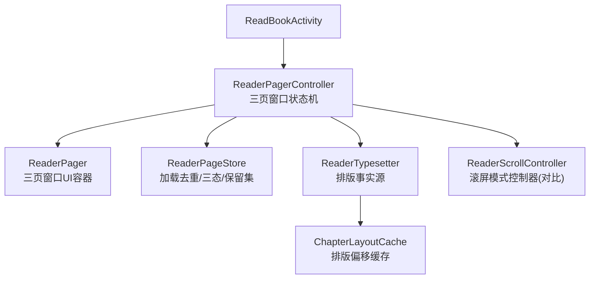
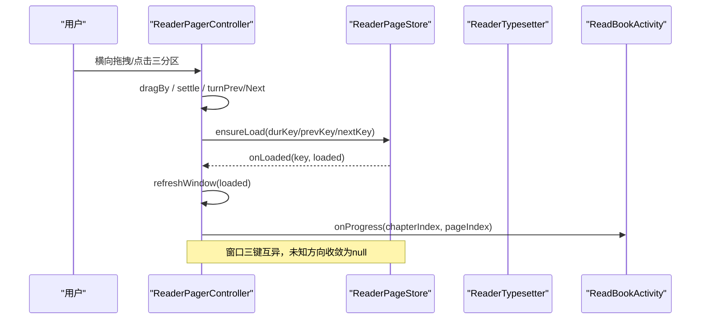
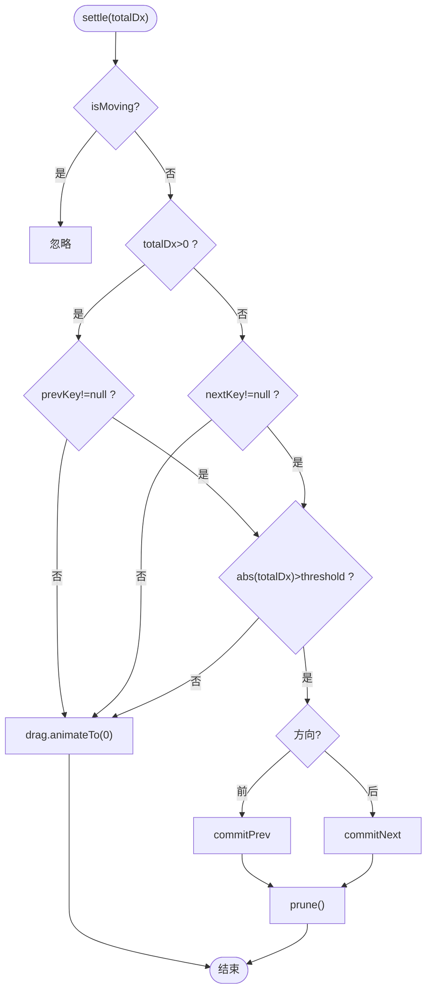
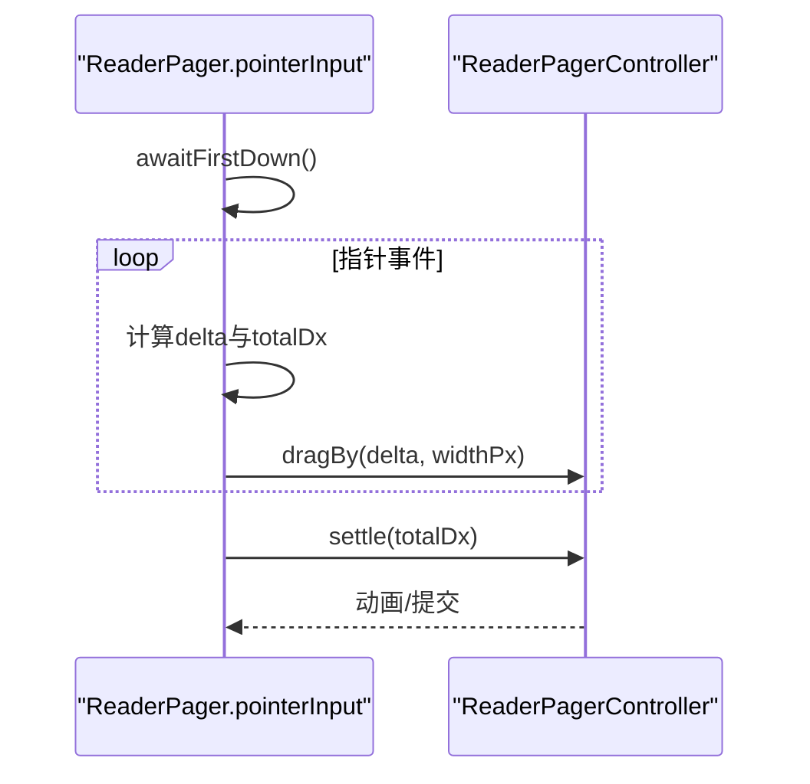
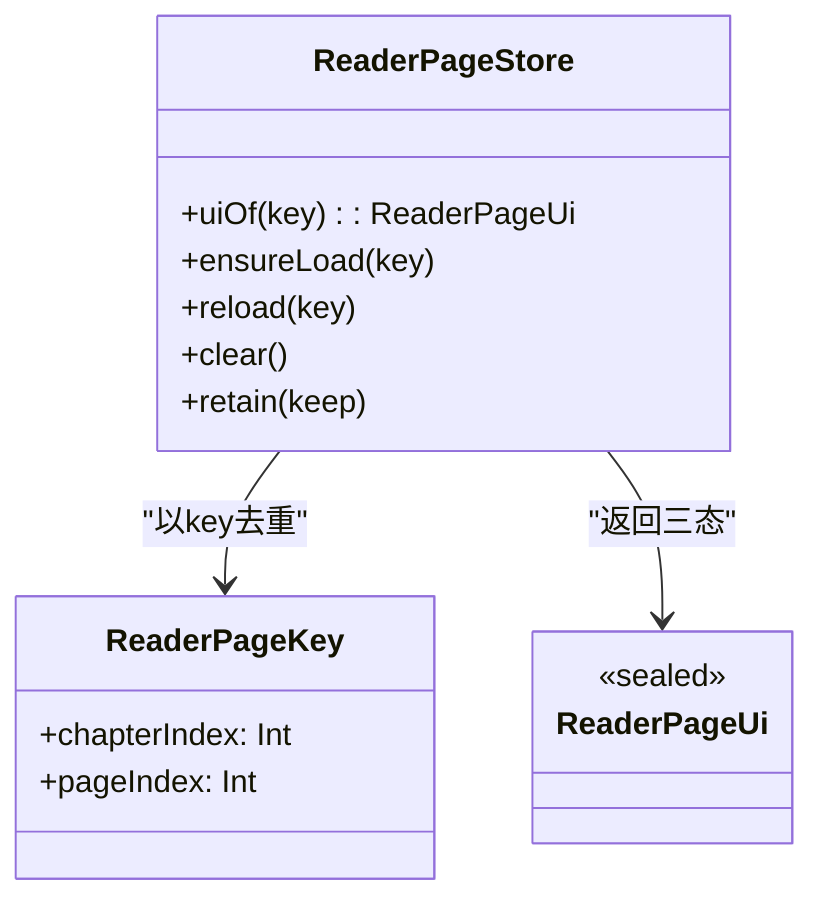
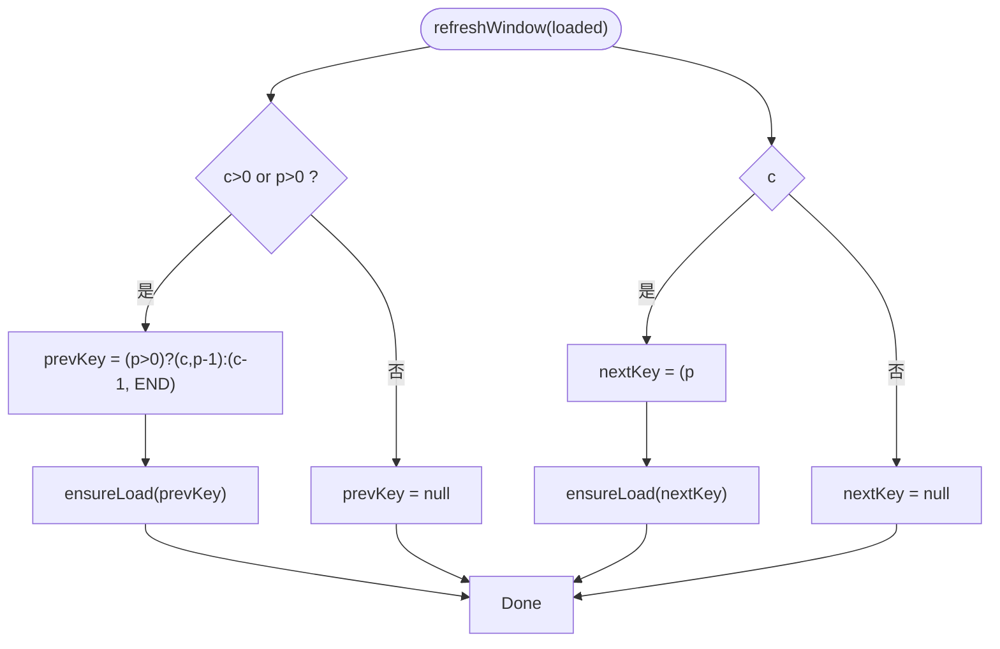
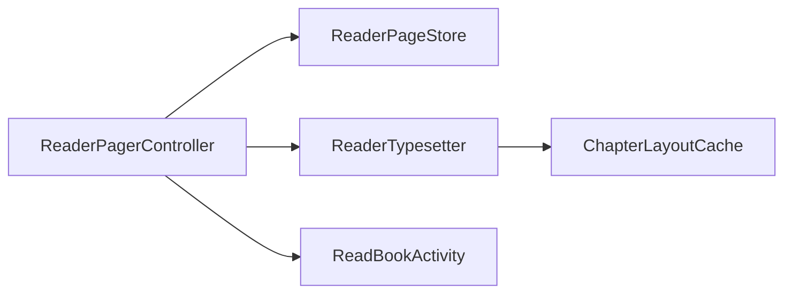

# 翻页模式

<cite>
**本文引用的文件**
- [ReaderPager.kt](file://module_book/src/main/java/com/ebook/book/reader/ReaderPager.kt)
- [ReaderPageStore.kt](file://module_book/src/main/java/com/ebook/book/reader/ReaderPageStore.kt)
- [ReaderTypesetter.kt](file://module_book/src/main/java/com/ebook/book/reader/ReaderTypesetter.kt)
- [ChapterLayoutCache.kt](file://module_book/src/main/java/com/ebook/book/reader/ChapterLayoutCache.kt)
- [ReaderScrollController.kt](file://module_book/src/main/java/com/ebook/book/reader/ReaderScrollController.kt)
- [ReadBookActivity.kt](file://module_book/src/main/java/com/ebook/book/ReadBookActivity.kt)
- [ReaderPagerControllerTest.kt](file://module_book/src/test/java/com/ebook/book/reader/ReaderPagerControllerTest.kt)
</cite>

## 目录
1. [简介](#简介)
2. [项目结构](#项目结构)
3. [核心组件](#核心组件)
4. [架构总览](#架构总览)
5. [详细组件分析](#详细组件分析)
6. [依赖关系分析](#依赖关系分析)
7. [性能考量](#性能考量)
8. [故障排查指南](#故障排查指南)
9. [结论](#结论)
10. [附录](#附录)

## 简介
本文件聚焦阅读器的“翻页模式”，系统阐述三页窗口状态机、手势与动画、页面加载策略、切换算法与内存管理，并给出可落地的优化建议。目标读者既包括需要深入实现的工程师，也包括希望理解整体机制的产品与技术管理者。

## 项目结构
翻页模式的核心实现集中在 module_book 的 reader 包中，围绕以下关键文件展开：
- ReaderPager.kt：三页窗口 UI 容器与控制器（ReaderPagerController），负责手势、动画、窗口收敛、预取与进度上报。
- ReaderPageStore.kt：页面加载仓库，提供去重加载、在途任务管理、三态（加载中/失败/已加载）与保留集裁剪。
- ReaderTypesetter.kt：排版事实源，统一分页测量与渲染样式，保证“切几行=画几行”。
- ChapterLayoutCache.kt：章节排版偏移缓存，降低同章多页重排成本。
- ReadBookActivity.kt：阅读器宿主，装配数据与布局、触发重分页与加载。
- ReaderScrollController.kt：上下滚屏模式的控制器，与翻页模式共享加载仓库与分块链，便于对比理解翻页模式的边界。

图示来源
- [ReaderPager.kt:110-323](file://module_book/src/main/java/com/ebook/book/reader/ReaderPager.kt#L110-L323)
- [ReaderPageStore.kt:29-98](file://module_book/src/main/java/com/ebook/book/reader/ReaderPageStore.kt#L29-L98)
- [ReaderTypesetter.kt:29-155](file://module_book/src/main/java/com/ebook/book/reader/ReaderTypesetter.kt#L29-L155)
- [ChapterLayoutCache.kt:38-60](file://module_book/src/main/java/com/ebook/book/reader/ChapterLayoutCache.kt#L38-L60)
- [ReaderScrollController.kt:89-397](file://module_book/src/main/java/com/ebook/book/reader/ReaderScrollController.kt#L89-L397)

章节来源
- [ReaderPager.kt:61-323](file://module_book/src/main/java/com/ebook/book/reader/ReaderPager.kt#L61-L323)
- [ReaderPageStore.kt:9-98](file://module_book/src/main/java/com/ebook/book/reader/ReaderPageStore.kt#L9-L98)
- [ReaderTypesetter.kt:18-155](file://module_book/src/main/java/com/ebook/book/reader/ReaderTypesetter.kt#L18-L155)
- [ChapterLayoutCache.kt:5-60](file://module_book/src/main/java/com/ebook/book/reader/ChapterLayoutCache.kt#L5-L60)
- [ReadBookActivity.kt:90-260](file://module_book/src/main/java/com/ebook/book/ReadBookActivity.kt#L90-L260)

## 核心组件
- ReaderPagerController：维护 durKey（当前页）、prevKey（上一页）、nextKey（下一页）三键窗口；处理拖拽、阈值判定、动画与提交；完成回调后重算窗口；按三键保留集裁库。
- ReaderPageStore：以 ReaderPageKey 为键进行加载去重、在途 Job 管理；返回 Loading/Error/Loaded 三态；提供 retain 裁剪。
- ReaderTypesetter：基于 Compose TextMeasurer 的断行与测量，确保分页与渲染同源；提供 fitRenderLineCount 与 measureBlock。
- ChapterLayoutCache：对“整章行起始偏移”结果做 LRU 缓存，减少同章翻页时的重复重排。
- ReadBookActivity：组合 UI、驱动 rePaginate、绑定 onProgress、发起 loadPage。

章节来源
- [ReaderPager.kt:110-323](file://module_book/src/main/java/com/ebook/book/reader/ReaderPager.kt#L110-L323)
- [ReaderPageStore.kt:29-98](file://module_book/src/main/java/com/ebook/book/reader/ReaderPageStore.kt#L29-L98)
- [ReaderTypesetter.kt:29-155](file://module_book/src/main/java/com/ebook/book/reader/ReaderTypesetter.kt#L29-L155)
- [ChapterLayoutCache.kt:38-60](file://module_book/src/main/java/com/ebook/book/reader/ChapterLayoutCache.kt#L38-L60)
- [ReadBookActivity.kt:230-270](file://module_book/src/main/java/com/ebook/book/ReadBookActivity.kt#L230-L270)

## 架构总览
翻页模式采用“控制器 + 仓库 + 排版事实源”的分层设计：
- 控制器（ReaderPagerController）只关注几何与交互：窗口三键、拖拽位移、阈值、动画锁、提交与收敛。
- 仓库（ReaderPageStore）负责异步加载、去重、三态与内存回收。
- 排版事实源（ReaderTypesetter）统一断行与测量，保证分页切片与渲染一致。
- 缓存（ChapterLayoutCache）降低同章翻页的重排成本。
- 宿主（ReadBookActivity）装配数据流与 UI 生命周期。

图示来源
- [ReaderPager.kt:194-323](file://module_book/src/main/java/com/ebook/book/reader/ReaderPager.kt#L194-L323)
- [ReaderPageStore.kt:47-98](file://module_book/src/main/java/com/ebook/book/reader/ReaderPageStore.kt#L47-L98)
- [ReaderTypesetter.kt:53-85](file://module_book/src/main/java/com/ebook/book/reader/ReaderTypesetter.kt#L53-L85)
- [ReadBookActivity.kt:230-270](file://module_book/src/main/java/com/ebook/book/ReadBookActivity.kt#L230-L270)

## 详细组件分析

### 三页窗口状态机（ReaderPagerController）
- 窗口模型：当前页正常显示；下一页绘制在当前页之下；上一页绘制在最上层。drag 为横向位移（px），负值向后翻（当前页左移露出下一页），正值向前翻（上一页从左侧滑入覆盖）。
- 手势与动画：
  - 拖拽增量通过 dragBy 限制在 [-width, width] 范围内，受 hasPre/hasNext 约束。
  - settle 根据 totalDx 与 turnThresholdPx（30dp）判断成败，调用 commitNext/commitPrev 或回弹。
  - isMoving 用于锁定手势与程序化翻页，避免并发动画。
- 窗口收敛规则：
  - 提交时若目标页非 Loaded（仍在途或失败），则保留来路页作为相邻方向，未知方向收敛为 null，保持“三键互异且不得双空”的不变量。
  - 后续通过 ensureLoad 的 key==durKey 分支补全窗口，或回翻再翻过来自动重试失败页。
- 前后页计算与跨章处理：
  - refreshWindow 依据当前页的 chapterIndex、pageIndex、pageAll 与 chapterSize() 计算 prevKey/nextKey，遇到章首/章末使用哨兵页码（BEGIN/END）指向相邻章的首/末页。
- 程序化翻页：
  - turnPrev/turnNext 在 isMoving=false 时驱动动画并调用 commitPrev/commitNext；无上一页/下一页时提示。

图示来源
- [ReaderPager.kt:209-323](file://module_book/src/main/java/com/ebook/book/reader/ReaderPager.kt#L209-L323)

章节来源
- [ReaderPager.kt:89-323](file://module_book/src/main/java/com/ebook/book/reader/ReaderPager.kt#L89-L323)
- [ReaderPagerControllerTest.kt:42-195](file://module_book/src/test/java/com/ebook/book/reader/ReaderPagerControllerTest.kt#L42-L195)

### 手势处理机制
- 横向拖拽检测：awaitEachGesture 持续读取 pointer 变化，超过 touchSlop 进入 moved 状态并消费事件，实时调用 dragBy(delta, widthPx)。
- 抬起结算：结束时计算 totalDx，交由 settle 进行阈值判定与动画收尾。
- 点击处理：未移动时按左右三分之一区域分别触发 turnPrev/turnNext，中间区域唤菜单。
- 阈值：30dp 换算为 px 写入控制器，与宽度共同决定成功条件。

图示来源
- [ReaderPager.kt:359-437](file://module_book/src/main/java/com/ebook/book/reader/ReaderPager.kt#L359-L437)
- [ReaderPager.kt:209-267](file://module_book/src/main/java/com/ebook/book/reader/ReaderPager.kt#L209-L267)

章节来源
- [ReaderPager.kt:347-437](file://module_book/src/main/java/com/ebook/book/reader/ReaderPager.kt#L347-L437)

### 页面加载策略（预加载、去重、失败重试）
- 预加载：refreshWindow 会立即对 prevKey/nextKey 调用 ensureLoad，提前拉取邻居页。
- 去重：ensureLoad 以 ReaderPageKey 为键登记 jobs 与 pages；已 Loaded 的页不重复请求；在途 job 存在时不再起新协程。
- 失败重试：reload 先取消旧 job 再 ensureLoad；错误态下可通过重试按钮触发。
- 窗口收敛与归属：完成回调按 key==durKey 判断是否仍与自己相关，无关任务完成后不会覆盖旧窗口。

图示来源
- [ReaderPageStore.kt:29-98](file://module_book/src/main/java/com/ebook/book/reader/ReaderPageStore.kt#L29-L98)

章节来源
- [ReaderPageStore.kt:47-98](file://module_book/src/main/java/com/ebook/book/reader/ReaderPageStore.kt#L47-L98)
- [ReaderPager.kt:149-192](file://module_book/src/main/java/com/ebook/book/reader/ReaderPager.kt#L149-L192)

### 页面切换算法（前后页计算、跨章处理、边界条件）
- 前后页计算：refreshWindow 依据当前页的 chapterIndex、pageIndex、pageAll 与 chapterSize() 推导 prevKey/nextKey。
- 跨章处理：当位于章首/章末时，prevKey/nextKey 可能指向相邻章的哨兵页（BEGIN/END），由加载结果解析为具体页码。
- 边界条件：
  - 书首无上一页（prevKey=null），书尾无下一页（nextKey=null）。
  - 提交时目标页非 Loaded：保留来路页为相邻方向，未知方向收敛为 null，避免自指与死端。
  - 失败页仍可回翻到刚读过的页，并在重新入窗时自动重试。

图示来源
- [ReaderPager.kt:177-192](file://module_book/src/main/java/com/ebook/book/reader/ReaderPager.kt#L177-L192)

章节来源
- [ReaderPager.kt:177-192](file://module_book/src/main/java/com/ebook/book/reader/ReaderPager.kt#L177-L192)
- [ReaderPagerControllerTest.kt:42-195](file://module_book/src/test/java/com/ebook/book/reader/ReaderPagerControllerTest.kt#L42-L195)

### 内存管理策略（三页窗口裁剪、状态保留集）
- 翻页模式必须裁剪：refreshWindow 可能在章首/章末将窗口指向相邻章，连续阅读会跨章累积页状态；prune 将仓库保留集限制为 {durKey, prevKey, nextKey}。
- 滚动模式对比：滚屏模式按“章距 ±2”裁剪，避免同章内回滚丢失已加载块导致闪烁。
- 保留集语义：翻页模式保留三键；滚屏模式保留可见邻域的全部块，两者都需调用 retain。

章节来源
- [ReaderPager.kt:312-323](file://module_book/src/main/java/com/ebook/book/reader/ReaderPager.kt#L312-L323)
- [ReaderScrollController.kt:350-369](file://module_book/src/main/java/com/ebook/book/reader/ReaderScrollController.kt#L350-L369)
- [ReaderPageStore.kt:86-98](file://module_book/src/main/java/com/ebook/book/reader/ReaderPageStore.kt#L86-L98)

### 排版与分页一致性（ReaderTypesetter）
- 单一起源：排版样式（字号/行高/对齐）与测量器、密度由 rememberReaderTypesetter 装配，lineStartOffsets 与 fitRenderLineCount 共用同一份 TextStyle。
- 分页契约：正文区高度恒定，Loading/Error/Loaded 三态占位一致，避免行数测算漂移；clipToBounds 兜底防止极端字形溢出到页码行。
- 测量优化：fitRenderLineCount 直接问渲染引擎放得下几行，避免公式估算误差累积。

章节来源
- [ReaderTypesetter.kt:18-85](file://module_book/src/main/java/com/ebook/book/reader/ReaderTypesetter.kt#L18-L85)
- [ReaderPager.kt:505-654](file://module_book/src/main/java/com/ebook/book/reader/ReaderPager.kt#L505-L654)

### 缓存与性能（ChapterLayoutCache）
- 缓存键：contentRef + contentLength + fontSizeSp + widthPx，确保内容、字号、宽度任一变化即失效重排。
- 线程安全：synchronizedMap 包裹 LinkedHashMap，并发 getOrCompute 加锁保护。
- 容量：默认约覆盖“当前章+前后各两章”的两屏余量。

章节来源
- [ChapterLayoutCache.kt:5-60](file://module_book/src/main/java/com/ebook/book/reader/ChapterLayoutCache.kt#L5-L60)

## 依赖关系分析
- ReaderPagerController 依赖 ReaderPageStore 进行加载与状态管理，依赖 ReaderTypesetter 获取每屏行数，依赖 ReadBookActivity 提供的 chapterSize/chapterTitle/loadPage/onProgress。
- ReaderPageStore 仅依赖 loadPage 与 CoroutineScope，解耦几何与业务。
- ReaderTypesetter 依赖 Compose TextMeasurer/Density，不感知翻页几何。
- ChapterLayoutCache 独立于 UI，仅被排版流程使用。

图示来源
- [ReaderPager.kt:110-192](file://module_book/src/main/java/com/ebook/book/reader/ReaderPager.kt#L110-L192)
- [ReaderPageStore.kt:29-98](file://module_book/src/main/java/com/ebook/book/reader/ReaderPageStore.kt#L29-L98)
- [ReaderTypesetter.kt:29-155](file://module_book/src/main/java/com/ebook/book/reader/ReaderTypesetter.kt#L29-L155)
- [ChapterLayoutCache.kt:38-60](file://module_book/src/main/java/com/ebook/book/reader/ChapterLayoutCache.kt#L38-L60)

章节来源
- [ReaderPager.kt:110-192](file://module_book/src/main/java/com/ebook/book/reader/ReaderPager.kt#L110-L192)
- [ReaderPageStore.kt:29-98](file://module_book/src/main/java/com/ebook/book/reader/ReaderPageStore.kt#L29-L98)
- [ReaderTypesetter.kt:29-155](file://module_book/src/main/java/com/ebook/book/reader/ReaderTypesetter.kt#L29-L155)
- [ChapterLayoutCache.kt:38-60](file://module_book/src/main/java/com/ebook/book/reader/ChapterLayoutCache.kt#L38-L60)

## 性能考量
- 布局与重组：ReaderPageSlot 的 offsetX 在布局期读取 drag，动画期间只触发重布局不重组，减少 recomposition。
- 排版复用：ChapterLayoutCache 缓存整章行偏移，同章翻页只重排一次。
- 测量一致性：fitRenderLineCount 直接询问渲染引擎，避免估算误差导致的溢出与重排。
- 预加载：邻居页在窗口重算时立即 ensureLoad，提升滑动连续性。
- 内存回收：prune 严格限制保留集为三页窗口，避免跨章累积造成 OOM。
- 动画性能：Animatable 配合虚拟帧时钟（测试）与实际 Choreographer，阈值与阻尼调优保障流畅。

[本节为通用性能指导，无需特定文件引用]

## 故障排查指南
- 现象：翻页后画面不动或回到原页
  - 检查 isMoving 是否残留；确认 settle 中的 threshold 与 pageWidthPx 是否正确设置。
  - 验证窗口收敛：目标页非 Loaded 时 prevKey/nextKey 不得自指，且不得双向同时为空。
- 现象：失败页无法回翻或卡死
  - 确认刷新逻辑：失败页的来路页应保留为相邻方向；回翻后再翻过来会自动重试。
  - 检查 ensureLoad 的去重逻辑与 reload 的 job 取消。
- 现象：正文溢出到页码行或页数错乱
  - 检查正文区高度是否在三态间保持一致；确保 clipToBounds 生效。
  - 确认 readerBodyTextStyle 与排版测量一致，避免两套样式导致“切/画”不一致。
- 现象：频繁重排导致卡顿
  - 检查 ChapterLayoutCache 命中情况；确认 contentLength/fontSizeSp/widthPx 作为键是否合理。
  - 评估超长章的 N×重排成本，必要时在调用侧缓存偏移。

章节来源
- [ReaderPager.kt:209-323](file://module_book/src/main/java/com/ebook/book/reader/ReaderPager.kt#L209-L323)
- [ReaderPageStore.kt:47-98](file://module_book/src/main/java/com/ebook/book/reader/ReaderPageStore.kt#L47-L98)
- [ReaderTypesetter.kt:53-85](file://module_book/src/main/java/com/ebook/book/reader/ReaderTypesetter.kt#L53-L85)
- [ChapterLayoutCache.kt:38-60](file://module_book/src/main/java/com/ebook/book/reader/ChapterLayoutCache.kt#L38-L60)

## 结论
翻页模式通过严格的三页窗口状态机、统一的排版事实源与健壮的加载仓库，实现了稳定、流畅的阅读体验。其关键点在于：
- 窗口收敛规则保证自指与死端不会发生；
- 加载去重与保留集裁剪平衡了性能与内存；
- 排版与渲染同源避免了“切/画不一致”的静默错误；
- 手势与动画分离，交互响应迅速且可预测。

[本节为总结性内容，无需特定文件引用]

## 附录
- 使用场景示例
  - 首次进入阅读器：setInitData(chapterIndex, BEGIN)，自动加载首页并计算下一页；onProgress 更新菜单标题与章节滑条。
  - 手势翻页：向右滑过 30dp → 向后翻页；向左滑过 30dp → 向前翻页；不足阈值回弹。
  - 点击三分区：左三分之一 → 上一页；右三分之一 → 下一页；中间 → 菜单。
  - 失败重试：点击错误态重试按钮 → reload(key) 重新发起请求。
- 参考实现位置
  - 三页窗口与手势：ReaderPagerController 与 ReaderPager
  - 加载仓库与保留集：ReaderPageStore
  - 排版与测量：ReaderTypesetter
  - 缓存：ChapterLayoutCache
  - 对比（滚屏模式）：ReaderScrollController

章节来源
- [ReaderPager.kt:163-192](file://module_book/src/main/java/com/ebook/book/reader/ReaderPager.kt#L163-L192)
- [ReaderPager.kt:359-437](file://module_book/src/main/java/com/ebook/book/reader/ReaderPager.kt#L359-L437)
- [ReaderPageStore.kt:47-98](file://module_book/src/main/java/com/ebook/book/reader/ReaderPageStore.kt#L47-L98)
- [ReaderTypesetter.kt:53-85](file://module_book/src/main/java/com/ebook/book/reader/ReaderTypesetter.kt#L53-L85)
- [ChapterLayoutCache.kt:38-60](file://module_book/src/main/java/com/ebook/book/reader/ChapterLayoutCache.kt#L38-L60)
- [ReaderScrollController.kt:220-302](file://module_book/src/main/java/com/ebook/book/reader/ReaderScrollController.kt#L220-L302)