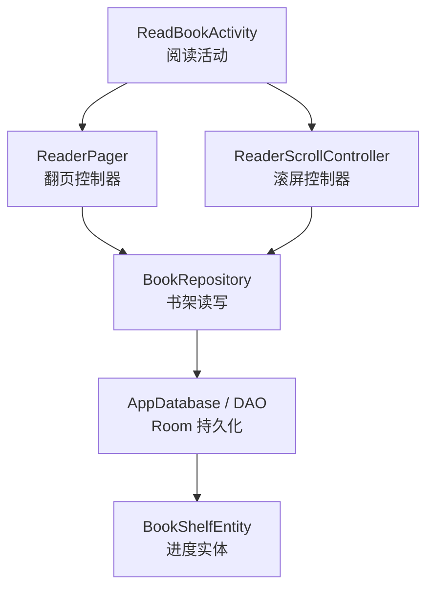
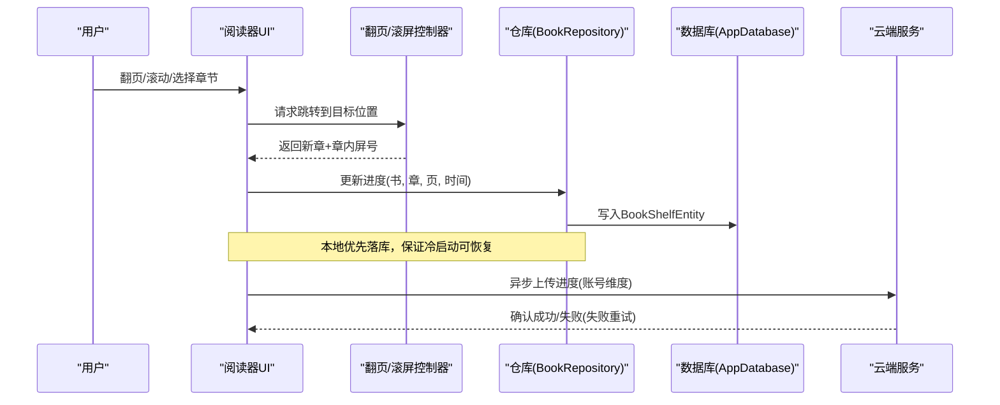
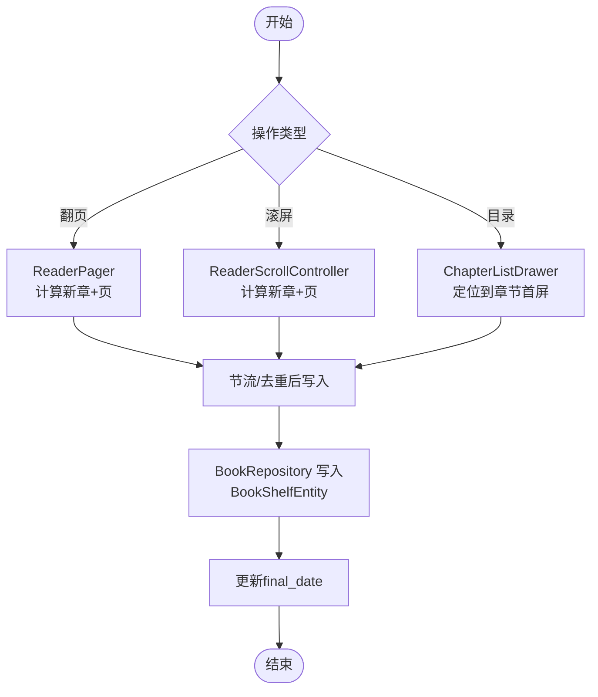
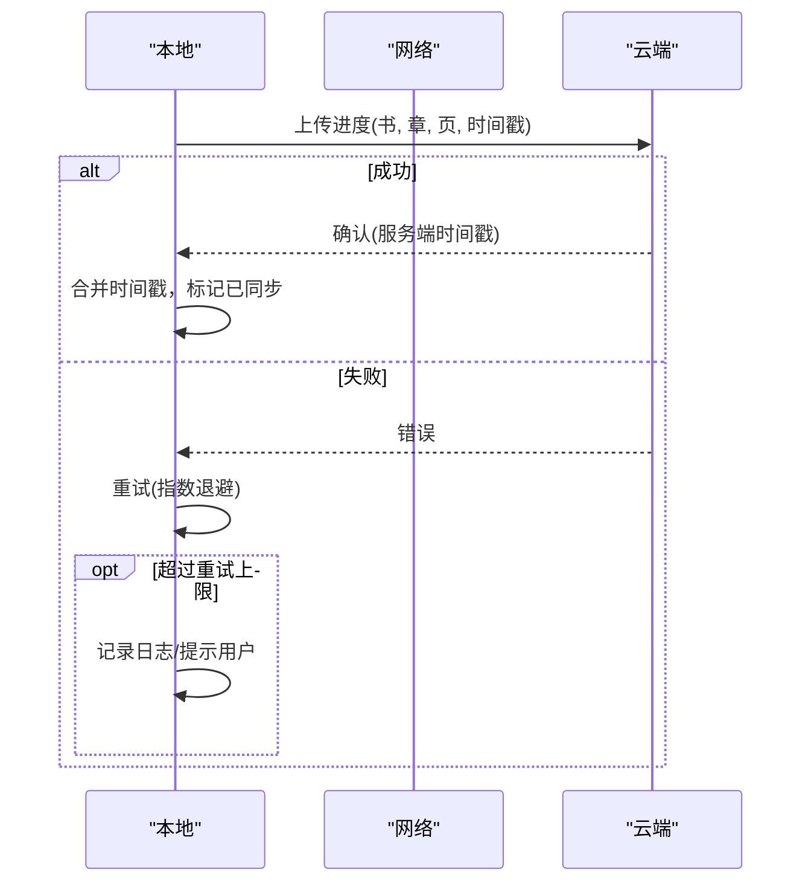
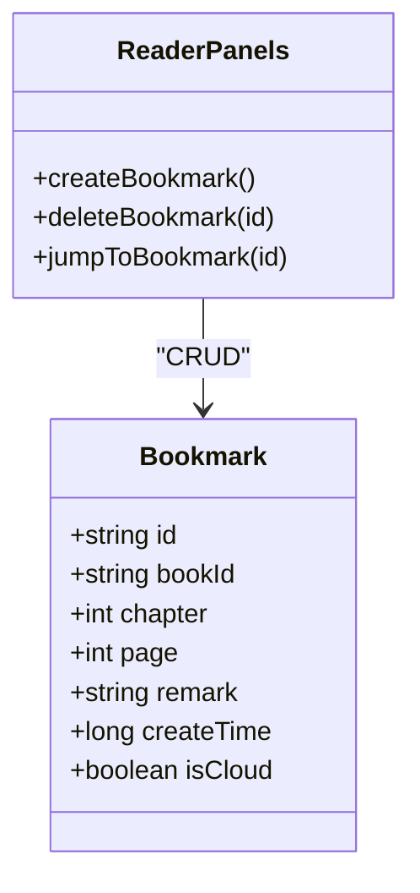
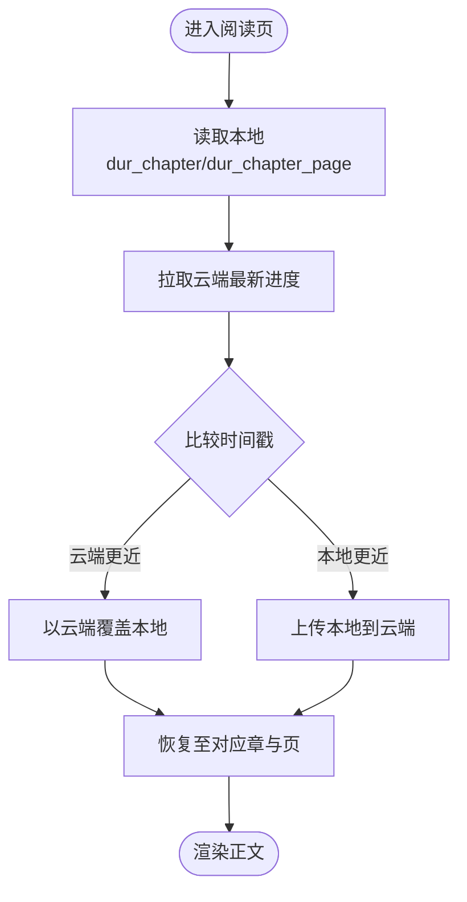
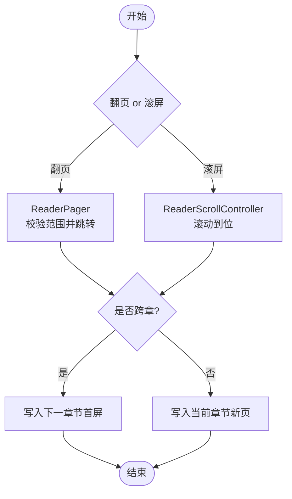
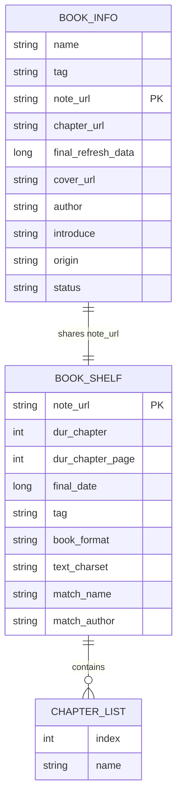
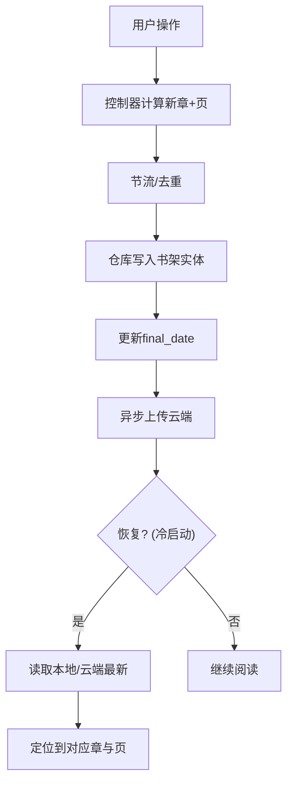

# 进度管理

<cite>
**本文引用的文件**
- [BookShelfEntity.kt](file://lib_ebook_db/src/main/java/com/ebook/db/entity/BookShelfEntity.kt)
- [BookInfoEntity.kt](file://lib_ebook_db/src/main/java/com/ebook/db/entity/BookInfoEntity.kt)
- [ChapterListEntity.kt](file://lib_ebook_db/src/main/java/com/ebook/db/entity/ChapterListEntity.kt)
- [ReaderPanels.kt](file://module_book/src/main/java/com/ebook/book/reader/ReaderPanels.kt)
- [ReadBookActivity.kt](file://module_book/src/main/java/com/ebook/book/ReadBookActivity.kt)
- [ReaderPager.kt](file://module_book/src/main/java/com/ebook/book/reader/ReaderPager.kt)
- [ReaderScrollController.kt](file://module_book/src/main/java/com/ebook/book/reader/ReaderScrollController.kt)
- [ReaderScroll.kt](file://module_book/src/main/java/com/ebook/book/reader/ReaderScroll.kt)
- [BookRepository.kt](file://lib_book_common/src/main/java/com/ebook/common/repository/BookRepository.kt)
- [AppDatabase.kt](file://lib_ebook_db/src/main/java/com/ebook/db/AppDatabase.kt)
</cite>

## 目录
1. [简介](#简介)
2. [项目结构](#项目结构)
3. [核心组件](#核心组件)
4. [架构总览](#架构总览)
5. [详细组件分析](#详细组件分析)
6. [依赖关系分析](#依赖关系分析)
7. [性能考虑](#性能考虑)
8. [故障排查指南](#故障排查指南)
9. [结论](#结论)
10. [附录：数据模型与流程示意](#附录数据模型与流程示意)

## 简介
本文件聚焦“阅读进度管理”的技术实现，覆盖以下主题：
- 进度存储的数据库实体设计、字段含义与更新策略
- 本地保存与云端同步的流程、冲突解决原则
- 书签功能（创建、删除、跳转）在阅读器中的落地方式
- 应用重启后的进度恢复机制与多设备同步思路
- 翻页与滚屏的统一进度口径与边界处理
- 最佳实践：性能、一致性、隐私保护

## 项目结构
与进度相关的代码分布在数据库层、书籍模块的阅读控制器与 UI 面板中：
- 数据库实体：书架项记录当前章节、章节内页码、最后阅读时间等
- 阅读控制器：翻页/滚屏控制器负责计算当前屏位置并产出统一进度
- UI 面板：底部滑条、目录抽屉、设置面板等交互入口触发进度变更或展示
- 仓库层：对外暴露读取/写入书架信息的接口，供 ViewModel/页面调用

图表来源
- [ReadBookActivity.kt](file://module_book/src/main/java/com/ebook/book/ReadBookActivity.kt)
- [ReaderPager.kt](file://module_book/src/main/java/com/ebook/book/reader/ReaderPager.kt)
- [ReaderScrollController.kt](file://module_book/src/main/java/com/ebook/book/reader/ReaderScrollController.kt)
- [BookRepository.kt](file://lib_book_common/src/main/java/com/ebook/common/repository/BookRepository.kt)
- [AppDatabase.kt](file://lib_ebook_db/src/main/java/com/ebook/db/AppDatabase.kt)
- [BookShelfEntity.kt](file://lib_ebook_db/src/main/java/com/ebook/db/entity/BookShelfEntity.kt)

章节来源
- [BookShelfEntity.kt:11-83](file://lib_ebook_db/src/main/java/com/ebook/db/entity/BookShelfEntity.kt#L11-L83)
- [BookInfoEntity.kt:13-73](file://lib_ebook_db/src/main/java/com/ebook/db/entity/BookInfoEntity.kt#L13-L73)
- [ReaderPanels.kt:370-481](file://module_book/src/main/java/com/ebook/book/reader/ReaderPanels.kt#L370-L481)
- [ReaderPager.kt](file://module_book/src/main/java/com/ebook/book/reader/ReaderPager.kt)
- [ReaderScrollController.kt](file://module_book/src/main/java/com/ebook/book/reader/ReaderScrollController.kt)
- [ReaderScroll.kt](file://module_book/src/main/java/com/ebook/book/reader/ReaderScroll.kt)
- [BookRepository.kt](file://lib_book_common/src/main/java/com/ebook/common/repository/BookRepository.kt)
- [AppDatabase.kt](file://lib_ebook_db/src/main/java/com/ebook/db/AppDatabase.kt)

## 核心组件
- 书架实体 BookShelfEntity：承载每本书的“当前章节、章节内页码、最后阅读时间”等关键进度信息
- 书籍信息 BookInfoEntity：包含章节列表等元数据，配合书架实体完成进度定位
- 翻页控制器 ReaderPager：按章内屏号推进/回退，统一以“章内第几屏”作为进度单位
- 滚屏控制器 ReaderScrollController：滚动模式下的进度推进，同样以“章内屏号”对齐翻页口径
- 仓库 BookRepository：提供对书架实体的读/写能力，供上层调用
- 数据库 AppDatabase：Room 数据库入口，实体与 DAO 的集中装配点

章节来源
- [BookShelfEntity.kt:11-83](file://lib_ebook_db/src/main/java/com/ebook/db/entity/BookShelfEntity.kt#L11-L83)
- [BookInfoEntity.kt:13-73](file://lib_ebook_db/src/main/java/com/ebook/db/entity/BookInfoEntity.kt#L13-L73)
- [ReaderPager.kt](file://module_book/src/main/java/com/ebook/book/reader/ReaderPager.kt)
- [ReaderScrollController.kt](file://module_book/src/main/java/com/ebook/book/reader/ReaderScrollController.kt)
- [ReaderScroll.kt](file://module_book/src/main/java/com/ebook/book/reader/ReaderScroll.kt)
- [BookRepository.kt](file://lib_book_common/src/main/java/com/ebook/common/repository/BookRepository.kt)
- [AppDatabase.kt](file://lib_ebook_db/src/main/java/com/ebook/db/AppDatabase.kt)

## 架构总览
阅读进度的生命周期分为“产生—收敛—持久化—恢复—同步”五阶段：
- 产生：用户翻页/滚动/点击目录，控制器计算新位置
- 收敛：统一为“章内屏号”，避免翻页与滚屏口径不一致
- 持久化：通过仓库写入书架实体（当前章节、章节内页码、最后阅读时间）
- 恢复：进入阅读页时从书架实体加载上次位置，定位到对应章与屏
- 同步：按账号维度将进度上传至云端；多设备以服务端为权威源，客户端合并策略见下文

图表来源
- [ReaderPager.kt](file://module_book/src/main/java/com/ebook/book/reader/ReaderPager.kt)
- [ReaderScrollController.kt](file://module_book/src/main/java/com/ebook/book/reader/ReaderScrollController.kt)
- [BookRepository.kt](file://lib_book_common/src/main/java/com/ebook/common/repository/BookRepository.kt)
- [AppDatabase.kt](file://lib_ebook_db/src/main/java/com/ebook/db/AppDatabase.kt)

## 详细组件分析

### 数据库实体设计与字段含义
- BookShelfEntity
  - note_url：书本唯一标识（主键），用于定位具体一本书
  - dur_chapter：当前阅读的章节索引（含番外）
  - dur_chapter_page：当前章节内的屏号（翻页/滚屏统一口径）
  - final_date：最后阅读时间戳，用于统计与刷新策略
  - tag：书源归属标记，决定解析规则与后续下载/详情行为
  - book_format/text_charset：本地书的格式与编码，重解析所需
  - match_name/match_author：匹配名与作者，用于评论键生成等
- BookInfoEntity
  - name/chapter_url/cover_url/author/introduce/origin/status：书籍基本信息
  - final_refresh_data：章节目录最后更新时间，辅助目录刷新策略

章节来源
- [BookShelfEntity.kt:11-83](file://lib_ebook_db/src/main/java/com/ebook/db/entity/BookShelfEntity.kt#L11-L83)
- [BookInfoEntity.kt:13-73](file://lib_ebook_db/src/main/java/com/ebook/db/entity/BookInfoEntity.kt#L13-L73)

### 进度更新策略
- 触发时机
  - 翻页：ReaderPager 在每次翻页后产出新的章与屏号
  - 滚屏：ReaderScrollController 在滚动停止或到达边界时产出新的章与屏号
  - 目录跳转：ChapterListDrawer 点击章节后直接定位到目标章的首屏
- 写入频率
  - 建议节流：在频繁滚动场景下合并多次变更，降低 I/O 压力
  - 明确边界：首章/末章切换、跨章时务必写入，确保“章节切换”语义准确
- 时间戳更新
  - 每次有效进度更新应同步更新 final_date，便于“最近阅读”排序与统计

图表来源
- [ReaderPager.kt](file://module_book/src/main/java/com/ebook/book/reader/ReaderPager.kt)
- [ReaderScrollController.kt](file://module_book/src/main/java/com/ebook/book/reader/ReaderScrollController.kt)
- [ReaderPanels.kt:743-962](file://module_book/src/main/java/com/ebook/book/reader/ReaderPanels.kt#L743-L962)
- [BookRepository.kt](file://lib_book_common/src/main/java/com/ebook/common/repository/BookRepository.kt)

章节来源
- [ReaderPanels.kt:743-962](file://module_book/src/main/java/com/ebook/book/reader/ReaderPanels.kt#L743-L962)
- [ReaderPager.kt](file://module_book/src/main/java/com/ebook/book/reader/ReaderPager.kt)
- [ReaderScrollController.kt](file://module_book/src/main/java/com/ebook/book/reader/ReaderScrollController.kt)
- [BookRepository.kt](file://lib_book_common/src/main/java/com/ebook/common/repository/BookRepository.kt)

### 进度同步流程（本地—云端—冲突）
- 本地优先：所有进度先写入本地书架实体，确保应用冷启动可恢复
- 异步上传：通过仓库层发起网络请求，携带账号与书本标识
- 冲突解决原则
  - 服务端权威：以服务端最新时间戳为准进行合并
  - 客户端差异：若本地时间戳晚于服务端，则以本地为准；否则拉取服务端并覆盖
  - 幂等性：使用“书+章+页+时间”作为幂等键，避免重复提交导致错乱
- 失败重试：网络失败时指数退避重试，达到上限后记录日志并提示用户

图表来源
- [BookRepository.kt](file://lib_book_common/src/main/java/com/ebook/common/repository/BookRepository.kt)

章节来源
- [BookRepository.kt](file://lib_book_common/src/main/java/com/ebook/common/repository/BookRepository.kt)

### 书签功能的实现
- 创建书签：在阅读器面板中增加“添加书签”入口，记录当前章与页，并可附加备注（可选）
- 删除书签：在书签列表中删除指定条目，释放资源
- 跳转书签：点击书签条目，直接跳转到对应章与页
- 存储位置：书签可存储在本地（SP/Room）；如需跨设备，则需接入云端书签表（独立于书架实体）

图表来源
- [ReaderPanels.kt](file://module_book/src/main/java/com/ebook/book/reader/ReaderPanels.kt)

章节来源
- [ReaderPanels.kt](file://module_book/src/main/java/com/ebook/book/reader/ReaderPanels.kt)

### 进度恢复机制（应用重启与多设备）
- 应用重启恢复
  - 进入阅读页时，从书架实体读取 dur_chapter 与 dur_chapter_page
  - 根据当前翻页/滚屏模式，将定位结果转换为对应控制器的初始位置
- 多设备同步
  - 首次进入阅读页拉取云端最新进度，与本地对比
  - 若云端更近，则覆盖本地并提示“从云端恢复”
  - 若本地更近，则上传本地并覆盖云端

图表来源
- [BookRepository.kt](file://lib_book_common/src/main/java/com/ebook/common/repository/BookRepository.kt)
- [AppDatabase.kt](file://lib_ebook_db/src/main/java/com/ebook/db/AppDatabase.kt)

章节来源
- [BookRepository.kt](file://lib_book_common/src/main/java/com/ebook/common/repository/BookRepository.kt)
- [AppDatabase.kt](file://lib_ebook_db/src/main/java/com/ebook/db/AppDatabase.kt)

### 进度计算的准确性保障（翻页与滚屏统一口径）
- 统一口径：无论翻页还是滚屏，均以“章内第几屏”作为进度单位，避免歧义
- 边界情况
  - 首章/末章：禁止越界，按钮禁用或提示不可前进/后退
  - 跨章：当滚动到达章节末尾时，自动进入下一章首屏，并写入新章+页
  - 屏幕尺寸变化：重新排版后，按行号换算屏号，保持视觉位置稳定
- 测试验证：针对翻页与滚屏的关键路径编写单元测试，确保边界条件满足

图表来源
- [ReaderPager.kt](file://module_book/src/main/java/com/ebook/book/reader/ReaderPager.kt)
- [ReaderScrollController.kt](file://module_book/src/main/java/com/ebook/book/reader/ReaderScrollController.kt)

章节来源
- [ReaderPager.kt](file://module_book/src/main/java/com/ebook/book/reader/ReaderPager.kt)
- [ReaderScrollController.kt](file://module_book/src/main/java/com/ebook/book/reader/ReaderScrollController.kt)

## 依赖关系分析
- 低耦合：控制器仅关心“章+页”的计算与回调，不直接访问数据库
- 高内聚：仓库层封装了书架实体的读写逻辑，向上提供统一接口
- 可扩展：未来可新增“云端书签”“章节级进度”等扩展点而不影响现有控制器

图表来源
- [ReaderPanels.kt](file://module_book/src/main/java/com/ebook/book/reader/ReaderPanels.kt)
- [ReaderPager.kt](file://module_book/src/main/java/com/ebook/book/reader/ReaderPager.kt)
- [ReaderScrollController.kt](file://module_book/src/main/java/com/ebook/book/reader/ReaderScrollController.kt)
- [BookRepository.kt](file://lib_book_common/src/main/java/com/ebook/common/repository/BookRepository.kt)
- [AppDatabase.kt](file://lib_ebook_db/src/main/java/com/ebook/db/AppDatabase.kt)
- [BookShelfEntity.kt](file://lib_ebook_db/src/main/java/com/ebook/db/entity/BookShelfEntity.kt)
- [BookInfoEntity.kt](file://lib_ebook_db/src/main/java/com/ebook/db/entity/BookInfoEntity.kt)

章节来源
- [ReaderPanels.kt:370-481](file://module_book/src/main/java/com/ebook/book/reader/ReaderPanels.kt#L370-L481)
- [BookRepository.kt](file://lib_book_common/src/main/java/com/ebook/common/repository/BookRepository.kt)
- [AppDatabase.kt](file://lib_ebook_db/src/main/java/com/ebook/db/AppDatabase.kt)

## 性能考虑
- 节流写入：滚动场景下合并多次进度更新，避免频繁 I/O
- 批量操作：目录跳转一次性写入目标章+页，减少中间状态
- 内存优化：控制器仅在必要时持有上下文，避免长生命周期对象泄漏
- 网络优化：云端同步采用异步队列与重试机制，避免阻塞 UI

## 故障排查指南
- 问题现象：重启后进度未恢复
  - 检查：书架实体是否写入成功，final_date 是否更新
  - 定位：查看仓库层的写入与读取链路
- 问题现象：多设备进度不同步
  - 检查：云端时间戳比较逻辑是否正确
  - 定位：查看网络请求与合并策略
- 问题现象：滚屏与翻页进度不一致
  - 检查：统一口径是否为“章内屏号”
  - 定位：查看控制器与 UI 的转换逻辑

章节来源
- [BookShelfEntity.kt:11-83](file://lib_ebook_db/src/main/java/com/ebook/db/entity/BookShelfEntity.kt#L11-L83)
- [BookRepository.kt](file://lib_book_common/src/main/java/com/ebook/common/repository/BookRepository.kt)

## 结论
本项目通过统一的“章内屏号”口径，结合翻页与滚屏控制器，实现了稳定可靠的阅读进度管理。数据库实体设计简洁明确，仓库层封装了读写逻辑，便于扩展云端同步与书签功能。建议在后续迭代中强化节流策略与单元测试覆盖，进一步提升性能与准确性。

## 附录：数据模型与流程示意

### 数据模型图

图表来源
- [BookShelfEntity.kt:11-83](file://lib_ebook_db/src/main/java/com/ebook/db/entity/BookShelfEntity.kt#L11-L83)
- [BookInfoEntity.kt:13-73](file://lib_ebook_db/src/main/java/com/ebook/db/entity/BookInfoEntity.kt#L13-L73)
- [ChapterListEntity.kt](file://lib_ebook_db/src/main/java/com/ebook/db/entity/ChapterListEntity.kt)

### 流程图：进度写入与恢复

图表来源
- [ReaderPager.kt](file://module_book/src/main/java/com/ebook/book/reader/ReaderPager.kt)
- [ReaderScrollController.kt](file://module_book/src/main/java/com/ebook/book/reader/ReaderScrollController.kt)
- [BookRepository.kt](file://lib_book_common/src/main/java/com/ebook/common/repository/BookRepository.kt)
- [AppDatabase.kt](file://lib_ebook_db/src/main/java/com/ebook/db/AppDatabase.kt)