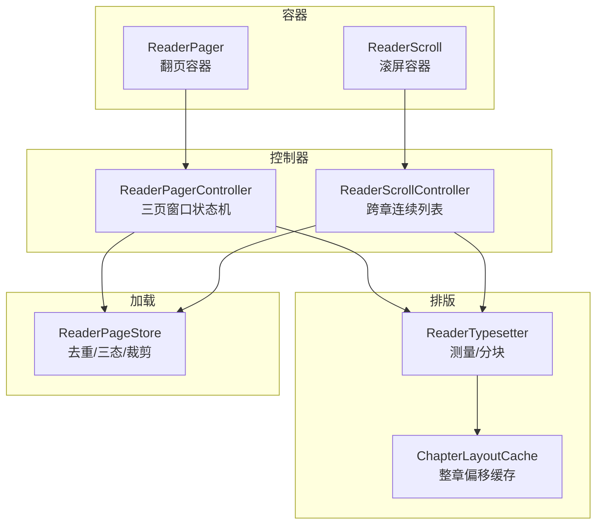
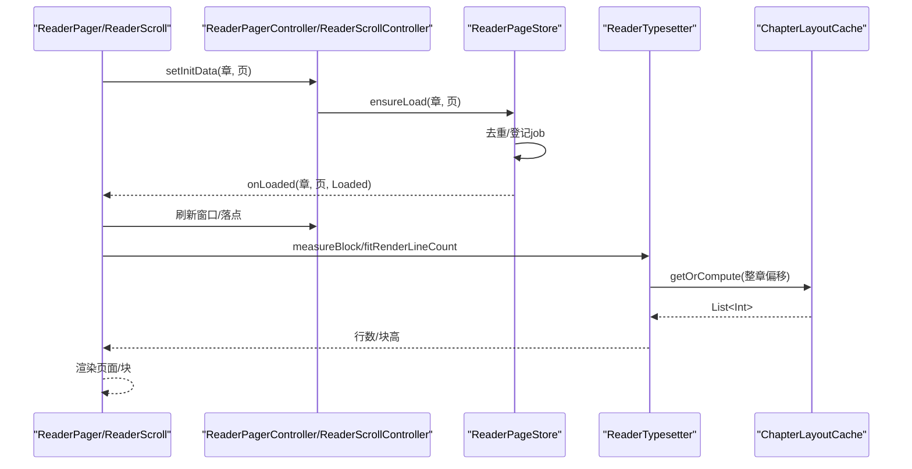
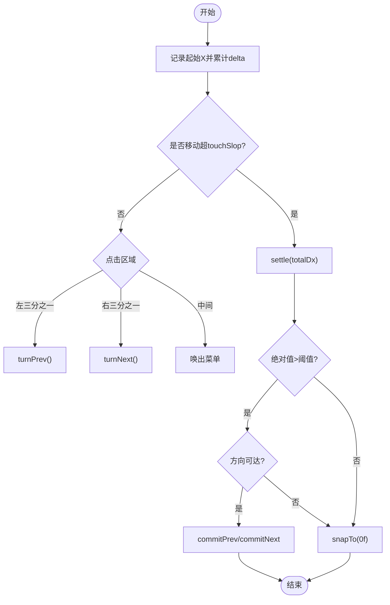
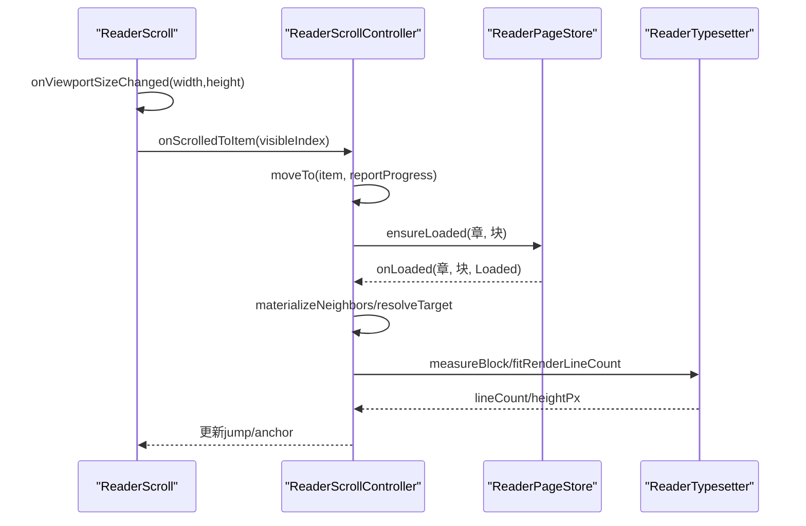
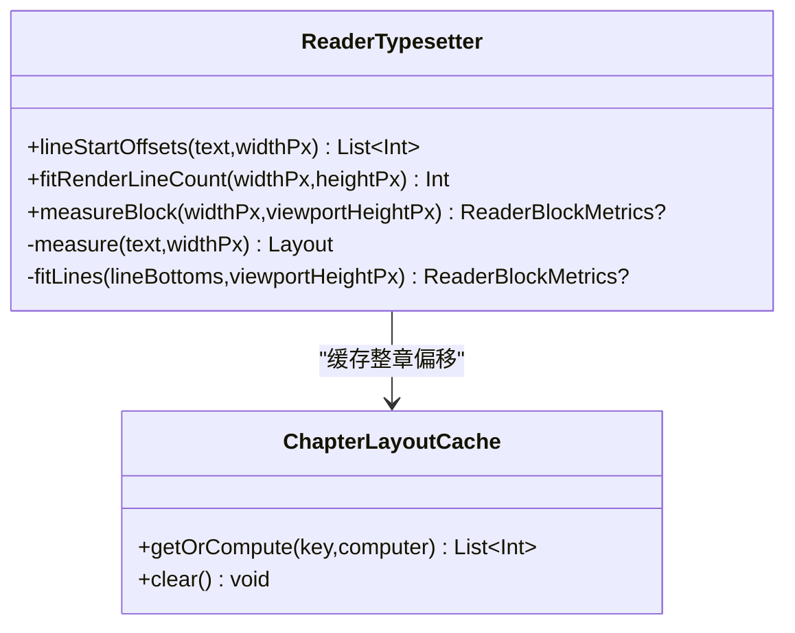
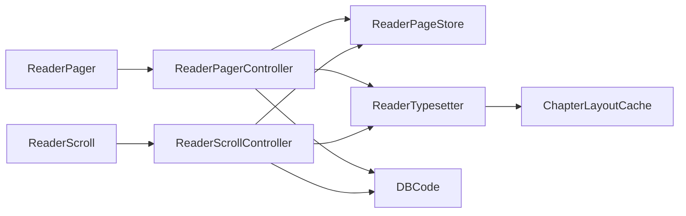

# 阅读体验

<cite>
**本文引用的文件**
- [ReaderPager.kt](file://module_book/src/main/java/com/ebook/book/reader/ReaderPager.kt)
- [ReaderScroll.kt](file://module_book/src/main/java/com/ebook/book/reader/ReaderScroll.kt)
- [ReaderTypesetter.kt](file://module_book/src/main/java/com/ebook/book/reader/ReaderTypesetter.kt)
- [ReaderPageStore.kt](file://module_book/src/main/java/com/ebook/book/reader/ReaderPageStore.kt)
- [ReaderScrollController.kt](file://module_book/src/main/java/com/ebook/book/reader/ReaderScrollController.kt)
- [ChapterLayoutCache.kt](file://module_book/src/main/java/com/ebook/book/reader/ChapterLayoutCache.kt)
</cite>

## 目录
1. [简介](#简介)
2. [项目结构](#项目结构)
3. [核心组件](#核心组件)
4. [架构总览](#架构总览)
5. [详细组件分析](#详细组件分析)
6. [依赖关系分析](#依赖关系分析)
7. [性能考量](#性能考量)
8. [故障排查指南](#故障排查指南)
9. [结论](#结论)
10. [附录](#附录)

## 简介
本技术文档聚焦“阅读体验”功能，系统阐述翻页模式与滚屏模式的实现原理、排版引擎算法、进度管理、设置系统与扩展接口。目标是帮助开发者理解并优化阅读器在页面分割、渲染优化、内存管理、滚动控制、内容预加载、文本布局、字体渲染、图片适配、阅读位置保存、书签与同步、主题切换等方面的设计与取舍。

## 项目结构
阅读体验相关代码集中在 module_book 的 reader 包内，按职责划分为：
- 容器与交互：翻页容器 ReaderPager 与滚屏容器 ReaderScroll
- 控制器：翻页控制器 ReaderPagerController、滚屏控制器 ReaderScrollController
- 排版引擎：ReaderTypesetter（测量与分块）、ChapterLayoutCache（整章排版缓存）
- 加载仓库：ReaderPageStore（统一去重、三态、裁剪）

图表来源
- [ReaderPager.kt:335-438](file://module_book/src/main/java/com/ebook/book/reader/ReaderPager.kt#L335-L438)
- [ReaderScroll.kt:72-233](file://module_book/src/main/java/com/ebook/book/reader/ReaderScroll.kt#L72-L233)
- [ReaderPagerController.kt:110-323](file://module_book/src/main/java/com/ebook/book/reader/ReaderPager.kt#L110-L323)
- [ReaderScrollController.kt:89-397](file://module_book/src/main/java/com/ebook/book/reader/ReaderScrollController.kt#L89-L397)
- [ReaderTypesetter.kt:18-175](file://module_book/src/main/java/com/ebook/book/reader/ReaderTypesetter.kt#L18-L175)
- [ChapterLayoutCache.kt:5-61](file://module_book/src/main/java/com/ebook/book/reader/ChapterLayoutCache.kt#L5-L61)
- [ReaderPageStore.kt:9-98](file://module_book/src/main/java/com/ebook/book/reader/ReaderPageStore.kt#L9-L98)

章节来源
- [ReaderPager.kt:61-438](file://module_book/src/main/java/com/ebook/book/reader/ReaderPager.kt#L61-L438)
- [ReaderScroll.kt:53-233](file://module_book/src/main/java/com/ebook/book/reader/ReaderScroll.kt#L53-L233)
- [ReaderTypesetter.kt:18-175](file://module_book/src/main/java/com/ebook/book/reader/ReaderTypesetter.kt#L18-L175)
- [ReaderPageStore.kt:9-98](file://module_book/src/main/java/com/ebook/book/reader/ReaderPageStore.kt#L9-L98)
- [ReaderScrollController.kt:89-397](file://module_book/src/main/java/com/ebook/book/reader/ReaderScrollController.kt#L89-L397)
- [ChapterLayoutCache.kt:5-61](file://module_book/src/main/java/com/ebook/book/reader/ChapterLayoutCache.kt#L5-L61)

## 核心组件
- 翻页模式
  - 三页窗口模型：当前页（dur）、上一页（prev）、下一页（next），支持横向拖拽与手势阈值判定翻页成功与否
  - 窗口收敛规则：目标页非 Loaded 时保留来路页作为相邻方向，未知方向收敛为 null，避免自指与死页
  - 加载去重与三态：Loading/Error/Loaded，统一由 ReaderPageStore 管理
  - 几何与动画：基于 Compose Animatable 驱动 drag，布局期 offset 触发重布局不重组
- 滚屏模式
  - 跨章连续 LazyColumn：item 为「章标题 + 正文块」，块高取排版实测值，无缝拼接
  - 锚点与滚动落点：以语义值 (章, 块) 记录，LazyColumn 按稳定 key 保位；跳章与恢复使用瞬移或动画
  - 预取与裁剪：邻域块预取、按章距裁剪正文保留集，避免内存累积
- 排版引擎
  - 唯一样式源：readerBodyTextStyle 同时用于测量与渲染，保证“切几行=画几行”
  - 行偏移计算：lineStartOffsets 返回每渲染行在原文中的起始偏移，避免段落分隔符丢失
  - 块度量：measureBlock 给出视口可放下行数与实测高度，供分页与滚屏块高使用
- 加载仓库
  - 键控去重：以 (章, 页/块) 为键，已 Loaded 或在途 job 均不重复请求
  - 完成回调：onLoaded 通知前端重算几何，翻页/滚屏各自判断相关性
  - 清理策略：clear/retain 根据几何半径裁减，防止内存泄漏
- 排版缓存
  - ChapterLayoutCache：按 contentRef + contentLength + fontSizeSp + widthPx 缓存整章行偏移，容量默认覆盖当前章及前后两章

章节来源
- [ReaderPager.kt:61-323](file://module_book/src/main/java/com/ebook/book/reader/ReaderPager.kt#L61-L323)
- [ReaderScroll.kt:53-233](file://module_book/src/main/java/com/ebook/book/reader/ReaderScroll.kt#L53-L233)
- [ReaderTypesetter.kt:18-175](file://module_book/src/main/java/com/ebook/book/reader/ReaderTypesetter.kt#L18-L175)
- [ReaderPageStore.kt:9-98](file://module_book/src/main/java/com/ebook/book/reader/ReaderPageStore.kt#L9-L98)
- [ChapterLayoutCache.kt:5-61](file://module_book/src/main/java/com/ebook/book/reader/ChapterLayoutCache.kt#L5-L61)

## 架构总览
阅读器提供两种并列的承载方式（翻页/滚屏），它们共享同一套分块链与加载仓库，差异仅在前端几何与交互：
- 翻页：三页窗口 + 横向拖拽，窗口大小固定为 3，按页坐标推进
- 滚屏：跨章连续列表，按块推进，块高来自排版实测

图表来源
- [ReaderPager.kt:110-323](file://module_book/src/main/java/com/ebook/book/reader/ReaderPager.kt#L110-L323)
- [ReaderScroll.kt:72-233](file://module_book/src/main/java/com/ebook/book/reader/ReaderScroll.kt#L72-L233)
- [ReaderScrollController.kt:89-397](file://module_book/src/main/java/com/ebook/book/reader/ReaderScrollController.kt#L89-L397)
- [ReaderTypesetter.kt:18-175](file://module_book/src/main/java/com/ebook/book/reader/ReaderTypesetter.kt#L18-L175)
- [ChapterLayoutCache.kt:5-61](file://module_book/src/main/java/com/ebook/book/reader/ChapterLayoutCache.kt#L5-L61)
- [ReaderPageStore.kt:9-98](file://module_book/src/main/java/com/ebook/book/reader/ReaderPageStore.kt#L9-L98)

## 详细组件分析

### 翻页模式：三页窗口与手势
- 窗口模型
  - durKey/prevKey/nextKey 表示当前、前、后页标识；drag 为横向位移（px），负值向后翻、正值向前翻
  - 阈值判定：超过 30dp 视为翻页成功，否则回弹
- 窗口收敛
  - 提交翻页时若目标页未 Loaded，则保留来路页作为相邻方向，未知方向收敛为 null，确保窗口三键互不相同且不为空
- 加载协同
  - 通过 ReaderPageStore 去重与三态；完成回调按 key==durKey 重算窗口
- 手势处理
  - pointerInput 中监听 down/move/up，移动阶段调用 dragBy 更新位移；抬起阶段 settle 进行动画与提交

图表来源
- [ReaderPager.kt:335-438](file://module_book/src/main/java/com/ebook/book/reader/ReaderPager.kt#L335-L438)
- [ReaderPager.kt:110-323](file://module_book/src/main/java/com/ebook/book/reader/ReaderPager.kt#L110-L323)

章节来源
- [ReaderPager.kt:61-438](file://module_book/src/main/java/com/ebook/book/reader/ReaderPager.kt#L61-L438)

### 滚屏模式：跨章连续滚动
- 列表模型
  - item 为 ScrollItem.Title 或 ScrollItem.Block；章界只有标题项，无额外链接
  - 锚点以 (章, 块) 语义值记录，避免上方插入导致的序号平移问题
- 滚动与落点
  - LazyColumn 的 firstVisibleItemIndex 原样上报，控制器换算为 (章, 块)
  - 跳章/恢复使用瞬移或动画；点击左右三分区滚一屏
- 预取与裁剪
  - 锚点邻域块预取（±2 块），按章距（±2 章）裁剪保留集，避免内存累积
- 兜底加载
  - 每个可见块自身 ensureLoaded，以防 fling 跳过中间块导致一直 Loading

图表来源
- [ReaderScroll.kt:72-233](file://module_book/src/main/java/com/ebook/book/reader/ReaderScroll.kt#L72-L233)
- [ReaderScrollController.kt:89-397](file://module_book/src/main/java/com/ebook/book/reader/ReaderScrollController.kt#L89-L397)
- [ReaderTypesetter.kt:18-175](file://module_book/src/main/java/com/ebook/book/reader/ReaderTypesetter.kt#L18-L175)
- [ReaderPageStore.kt:9-98](file://module_book/src/main/java/com/ebook/book/reader/ReaderPageStore.kt#L9-L98)

章节来源
- [ReaderScroll.kt:53-233](file://module_book/src/main/java/com/ebook/book/reader/ReaderScroll.kt#L53-L233)
- [ReaderScrollController.kt:89-397](file://module_book/src/main/java/com/ebook/book/reader/ReaderScrollController.kt#L89-L397)

### 排版引擎：文本布局、字体渲染、图片适配
- 文本布局
  - lineStartOffsets：返回每渲染行的起始偏移，避免段落分隔符丢失；调用成本 O(章长)，同章多页会多次调用，需配合缓存
  - fitRenderLineCount：直接问渲染引擎能放下多少行，替代公式估算，避免误差累积
  - measureBlock：同时返回行数与实测高度，供滚屏块高使用
- 字体渲染
  - readerBodyTextStyle：唯一样式源，包含字号、行高、对齐与 lineHeightStyle；测量与渲染共用，杜绝“切画不一致”
- 图片适配
  - 本节代码未见图片布局逻辑；实际项目中图片通常由上层 UI 层（如 ReadBookActivity 或页面容器）负责加载与缩放，排版引擎专注文本布局

图表来源
- [ReaderTypesetter.kt:18-175](file://module_book/src/main/java/com/ebook/book/reader/ReaderTypesetter.kt#L18-L175)
- [ChapterLayoutCache.kt:5-61](file://module_book/src/main/java/com/ebook/book/reader/ChapterLayoutCache.kt#L5-L61)

章节来源
- [ReaderTypesetter.kt:18-175](file://module_book/src/main/java/com/ebook/book/reader/ReaderTypesetter.kt#L18-L175)
- [ChapterLayoutCache.kt:5-61](file://module_book/src/main/java/com/ebook/book/reader/ChapterLayoutCache.kt#L5-L61)

### 进度管理：阅读位置保存、书签、同步
- 进度口径
  - 翻页与滚屏均上报 onProgress(chapterIndex, pageIndex)，pageIndex 为“章内第几屏”，保持 DBCode.BookContentView 一致
  - 滚屏中锚点与块号映射清晰，避免上方插入导致的进度漂移
- 位置保存
  - 由上层 ReadBookActivity 等调用方持久化（见 onProgress 回调），本模块只负责计算与上报
- 书签与同步
  - 书签/同步机制不在 reader 模块内实现，通常由书架/数据库层结合 BookRepository 完成；本模块保证两种模式进度口径一致，便于跨设备同步

章节来源
- [ReaderScrollController.kt:89-397](file://module_book/src/main/java/com/ebook/book/reader/ReaderScrollController.kt#L89-L397)
- [ReaderPager.kt:110-323](file://module_book/src/main/java/com/ebook/book/reader/ReaderPager.kt#L110-L323)

### 设置系统：字体大小、主题、夜间模式
- 字体大小与行高
  - textSizeSp 与 lineHeight 作为参数传入排版与渲染，readerBodyTextStyle 统一样式
- 主题与夜间模式
  - 正文层使用「阅读背景主题」（四档纸张色），不受深浅色切换影响；控制器层继承全局主题
  - 颜色来自 textColor/bgColor，加载/错误态使用透明度派生，避免与深浅色冲突

章节来源
- [ReaderTypesetter.kt:117-146](file://module_book/src/main/java/com/ebook/book/reader/ReaderTypesetter.kt#L117-L146)
- [ReaderPager.kt:335-438](file://module_book/src/main/java/com/ebook/book/reader/ReaderPager.kt#L335-L438)
- [ReaderScroll.kt:72-233](file://module_book/src/main/java/com/ebook/book/reader/ReaderScroll.kt#L72-L233)

### 自定义排版扩展接口与示例
- 扩展点
  - 通过 readerBodyTextStyle 定制字号、行高、对齐与行高样式
  - 通过 rememberReaderTypesetter 注入 TextMeasurer 与 Density，保证测量与渲染同源
  - ChapterLayoutCache 可按业务需求调整容量与失效策略
- 使用示例（路径参考）
  - 排版测量：[ReaderTypesetter.kt:18-175](file://module_book/src/main/java/com/ebook/book/reader/ReaderTypesetter.kt#L18-L175)
  - 缓存接入：[ChapterLayoutCache.kt:5-61](file://module_book/src/main/java/com/ebook/book/reader/ChapterLayoutCache.kt#L5-L61)
  - 翻页/滚屏容器使用：[ReaderPager.kt:335-438](file://module_book/src/main/java/com/ebook/book/reader/ReaderPager.kt#L335-L438)、[ReaderScroll.kt:72-233](file://module_book/src/main/java/com/ebook/book/reader/ReaderScroll.kt#L72-L233)

章节来源
- [ReaderTypesetter.kt:117-175](file://module_book/src/main/java/com/ebook/book/reader/ReaderTypesetter.kt#L117-L175)
- [ChapterLayoutCache.kt:5-61](file://module_book/src/main/java/com/ebook/book/reader/ChapterLayoutCache.kt#L5-L61)
- [ReaderPager.kt:335-438](file://module_book/src/main/java/com/ebook/book/reader/ReaderPager.kt#L335-L438)
- [ReaderScroll.kt:72-233](file://module_book/src/main/java/com/ebook/book/reader/ReaderScroll.kt#L72-L233)

## 依赖关系分析
- 耦合与内聚
  - 容器与控制器解耦：ReaderPager/ReaderScroll 仅负责几何与交互，ReaderPagerController/ReaderScrollController 负责状态与流程
  - 加载仓库集中管理：ReaderPageStore 统一处理去重、三态与裁剪，降低两端重复逻辑
  - 排版引擎独立：ReaderTypesetter 与 ChapterLayoutCache 专注文本布局与缓存，不感知翻页/滚屏几何
- 外部依赖
  - Compose 体系：TextMeasurer、Density、LazyColumn、Animatable、pointerInput
  - 数据库事件：DBCode 用于哨兵页码与进度口径对齐
  - 工具库：ToastUtil 用于边界提示

图表来源
- [ReaderPager.kt:335-438](file://module_book/src/main/java/com/ebook/book/reader/ReaderPager.kt#L335-L438)
- [ReaderScroll.kt:72-233](file://module_book/src/main/java/com/ebook/book/reader/ReaderScroll.kt#L72-L233)
- [ReaderPagerController.kt:110-323](file://module_book/src/main/java/com/ebook/book/reader/ReaderPager.kt#L110-L323)
- [ReaderScrollController.kt:89-397](file://module_book/src/main/java/com/ebook/book/reader/ReaderScrollController.kt#L89-L397)
- [ReaderTypesetter.kt:18-175](file://module_book/src/main/java/com/ebook/book/reader/ReaderTypesetter.kt#L18-L175)
- [ChapterLayoutCache.kt:5-61](file://module_book/src/main/java/com/ebook/book/reader/ChapterLayoutCache.kt#L5-L61)
- [ReaderPageStore.kt:9-98](file://module_book/src/main/java/com/ebook/book/reader/ReaderPageStore.kt#L9-L98)

章节来源
- [ReaderPager.kt:335-438](file://module_book/src/main/java/com/ebook/book/reader/ReaderPager.kt#L335-L438)
- [ReaderScroll.kt:72-233](file://module_book/src/main/java/com/ebook/book/reader/ReaderScroll.kt#L72-L233)
- [ReaderTypesetter.kt:18-175](file://module_book/src/main/java/com/ebook/book/reader/ReaderTypesetter.kt#L18-L175)
- [ReaderPageStore.kt:9-98](file://module_book/src/main/java/com/ebook/book/reader/ReaderPageStore.kt#L9-L98)
- [ReaderScrollController.kt:89-397](file://module_book/src/main/java/com/ebook/book/reader/ReaderScrollController.kt#L89-L397)
- [ChapterLayoutCache.kt:5-61](file://module_book/src/main/java/com/ebook/book/reader/ChapterLayoutCache.kt#L5-L61)

## 性能考量
- 翻页模式
  - 三页窗口限制渲染范围，避免全量渲染；drag 仅在布局期读取状态，减少重组
  - 窗口收敛规则避免自指与死页，提升交互鲁棒性
- 滚屏模式
  - 块高取自排版实测，确保无缝拼接；预取邻域块提升滚动平滑度
  - 按章距裁剪保留集，避免内存无限增长；兜底 ensureLoaded 防止 fling 跳过导致持续 Loading
- 排版引擎
  - lineStartOffsets 为 O(章长)，配合 ChapterLayoutCache 缓存整章偏移，显著降低重复重排开销
  - fitRenderLineCount/measureBlock 直接使用渲染引擎回答，避免公式误差导致的溢出或错位
- 加载仓库
  - 键控去重与 job 注销避免重复请求；retain/clear 保证内存可控

[本节为通用指导，不直接分析具体文件]

## 故障排查指南
- 翻页失败或卡住
  - 检查窗口收敛：目标页非 Loaded 时需保留来路页，避免 prevKey/nextKey 为空导致无法回翻
  - 检查阈值判定：30dp 阈值与 pageWidthPx 是否正确写入控制器
- 滚屏卡顿或位置漂移
  - 检查 item key 是否稳定且全局唯一；避免使用扁平序号作为 key
  - 检查 onScrolledToItem 与 LaunchedEffect(jump) 的顺序，确保先落点后上报
- 排版错位或内容缺失
  - 确认 readerBodyTextStyle 在测量与渲染处完全一致
  - 确认 lineStartOffsets 返回的是偏移而非子串，避免段落分隔符丢失
- 内存泄漏或重复请求
  - 检查 ReaderPageStore 的 retain/clear 是否在跳转/换页时正确调用
  - 检查 ChapterLayoutCache 容量是否合理，避免过少导致频繁重排

章节来源
- [ReaderPager.kt:110-323](file://module_book/src/main/java/com/ebook/book/reader/ReaderPager.kt#L110-L323)
- [ReaderScroll.kt:72-233](file://module_book/src/main/java/com/ebook/book/reader/ReaderScroll.kt#L72-L233)
- [ReaderScrollController.kt:89-397](file://module_book/src/main/java/com/ebook/book/reader/ReaderScrollController.kt#L89-L397)
- [ReaderTypesetter.kt:18-175](file://module_book/src/main/java/com/ebook/book/reader/ReaderTypesetter.kt#L18-L175)
- [ReaderPageStore.kt:9-98](file://module_book/src/main/java/com/ebook/book/reader/ReaderPageStore.kt#L9-L98)
- [ChapterLayoutCache.kt:5-61](file://module_book/src/main/java/com/ebook/book/reader/ChapterLayoutCache.kt#L5-L61)

## 结论
本实现通过统一的排版引擎与加载仓库，将翻页与滚屏两种模式解耦于几何与交互，既保证了阅读体验的一致性，又提供了良好的可扩展性与性能保障。排版引擎的“切画同源”契约、加载仓库的去重与裁剪策略、以及滚屏模式的预取与锚点机制，共同构成了稳定高效的阅读体验基础。后续可根据业务需求扩展图片适配、更精细的缓存策略与自定义排版能力。

[本节为总结，不直接分析具体文件]

## 附录
- 术语说明
  - 页/块：翻页模式下为“页”，滚屏模式下为“块”
  - 哨兵页码：BEGIN/END 表示章节首末，用于初始定位与边界处理
  - 锚点：滚屏模式下以 (章, 块) 语义值记录当前屏，避免序号漂移

[本节为概念性说明，不直接分析具体文件]