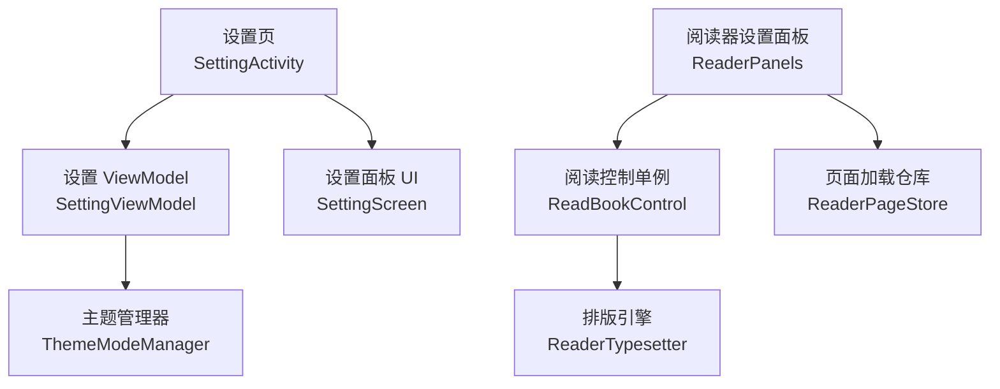
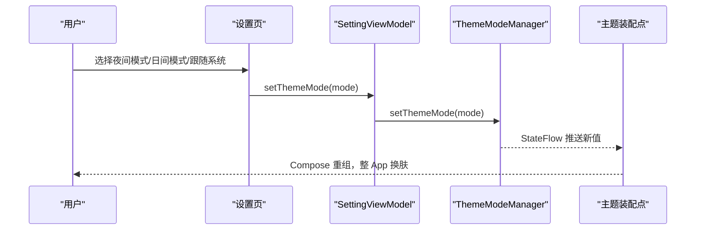
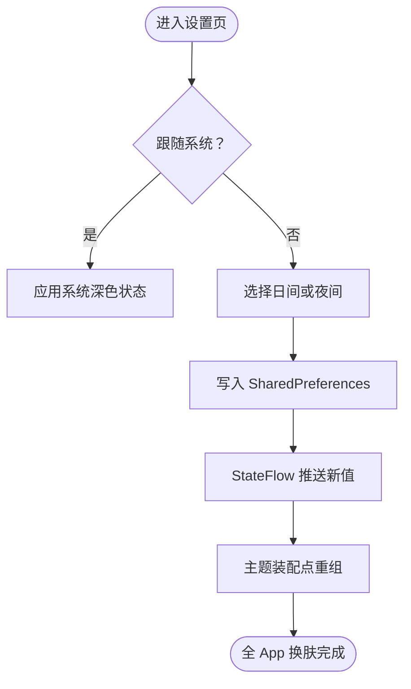
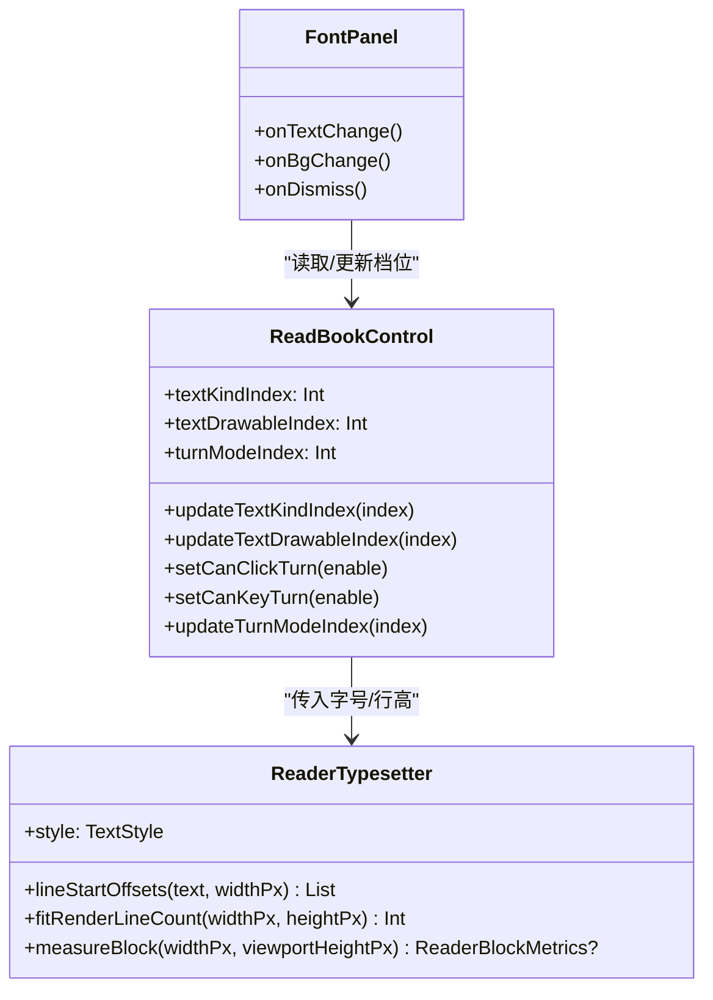
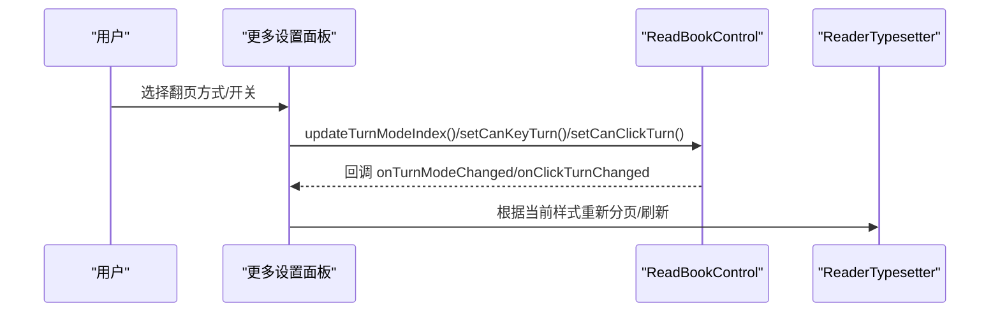
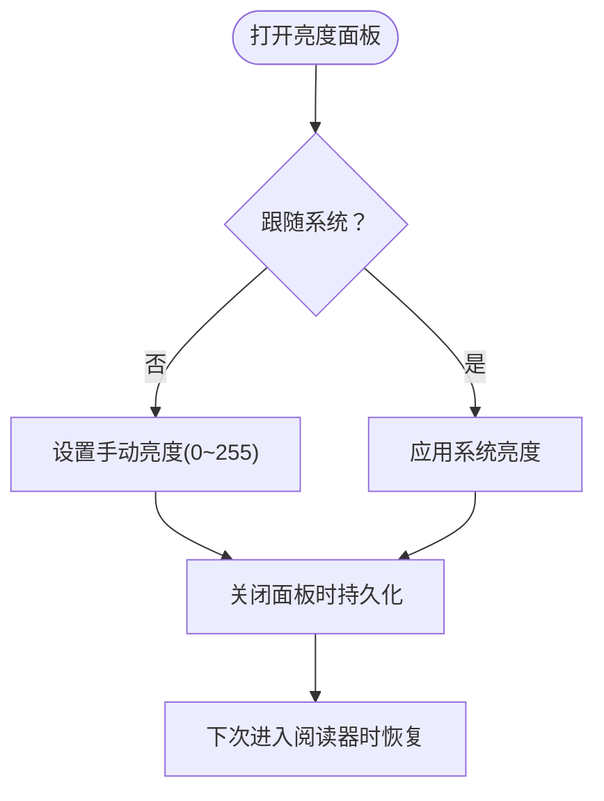
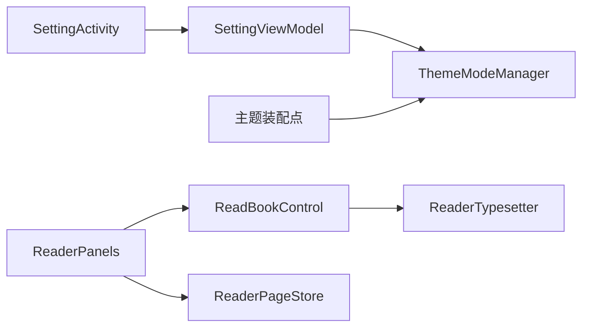

# 阅读设置

<cite>
**本文引用的文件**
- [SettingActivity.kt](file://module_me/src/main/java/com/ebook/me/view/SettingActivity.kt)
- [SettingViewModel.kt](file://module_me/src/main/java/com/ebook/me/mvvm/viewmodel/SettingViewModel.kt)
- [ThemeModeManager.kt](file://lib_book_common/src/main/java/com/ebook/common/domain/ThemeModeManager.kt)
- [ReadBookControl.kt](file://module_book/src/main/java/com/ebook/book/view/ReadBookControl.kt)
- [ReaderPanels.kt](file://module_book/src/main/java/com/ebook/book/reader/ReaderPanels.kt)
- [ReaderTypesetter.kt](file://module_book/src/main/java/com/ebook/book/reader/ReaderTypesetter.kt)
- [ReaderPageStore.kt](file://module_book/src/main/java/com/ebook/book/reader/ReaderPageStore.kt)
- [0031-theme-mode-three-state-companion-singleton.md](file://docs/adr/0031-theme-mode-three-state-companion-singleton.md)
</cite>

## 目录
1. [简介](#简介)
2. [项目结构与入口](#项目结构与入口)
3. [核心组件](#核心组件)
4. [架构总览](#架构总览)
5. [详细组件分析](#详细组件分析)
6. [依赖关系分析](#依赖关系分析)
7. [性能考量](#性能考量)
8. [故障排查指南](#故障排查指南)
9. [结论](#结论)
10. [附录：扩展开发指南](#附录：扩展开发指南)

## 简介
本技术文档聚焦“阅读设置”的完整实现与使用：涵盖字体大小调节、主题切换（含夜间模式）、设置持久化策略（本地存储、默认值、迁移兜底）、对阅读体验的影响（重排版、平滑过渡）、设置面板交互设计（弹窗/实时预览/确认取消）、设置验证机制（范围检查、异常处理、用户反馈），以及后续扩展（新增设置项、UI 集成、数据绑定）与个性化推荐最佳实践。

## 项目结构与入口
- 全局外观主题管理位于共享层 lib_book_common，负责三态主题（浅色/深色/跟随系统）的持久化与状态分发。
- 设置页入口在 module_me 中，提供通用设置（夜间模式、缓存、书源管理、关于、退出登录）。
- 阅读器内设置（字体、背景主题、翻页方式、亮度等）集中在 module_book 的阅读器面板与控制对象中。

图表来源
- [SettingActivity.kt:79-143](file://module_me/src/main/java/com/ebook/me/view/SettingActivity.kt#L79-L143)
- [SettingViewModel.kt:62-178](file://module_me/src/main/java/com/ebook/me/mvvm/viewmodel/SettingViewModel.kt#L62-L178)
- [ThemeModeManager.kt:44-78](file://lib_book_common/src/main/java/com/ebook/common/domain/ThemeModeManager.kt#L44-L78)
- [ReaderPanels.kt:1473-1754](file://module_book/src/main/java/com/ebook/book/reader/ReaderPanels.kt#L1473-L1754)
- [ReadBookControl.kt:13-157](file://module_book/src/main/java/com/ebook/book/view/ReadBookControl.kt#L13-L157)
- [ReaderTypesetter.kt:29-146](file://module_book/src/main/java/com/ebook/book/reader/ReaderTypesetter.kt#L29-L146)
- [ReaderPageStore.kt:29-98](file://module_book/src/main/java/com/ebook/book/reader/ReaderPageStore.kt#L29-L98)

章节来源
- [SettingActivity.kt:79-143](file://module_me/src/main/java/com/ebook/me/view/SettingActivity.kt#L79-L143)
- [SettingViewModel.kt:62-178](file://module_me/src/main/java/com/ebook/me/mvvm/viewmodel/SettingViewModel.kt#L62-L178)
- [ThemeModeManager.kt:44-78](file://lib_book_common/src/main/java/com/ebook/common/domain/ThemeModeManager.kt#L44-L78)

## 核心组件
- 全局主题管理：ThemeModeManager 负责主题模式持久化、状态流暴露与装配点接入。
- 设置页：SettingActivity + SettingViewModel 提供“夜间模式跟随系统”开关与日间/夜间子菜单，统一写回 ThemeModeManager。
- 阅读器设置：ReadBookControl 维护字体档位、背景主题、翻页方式等；ReaderPanels 提供字体、亮度、更多设置面板，并与 ReadBookControl 双向同步。
- 排版与分页：ReaderTypesetter 保证分页与渲染同源；ReaderPageStore 负责页面加载与去重、清理。

章节来源
- [ThemeModeManager.kt:44-78](file://lib_book_common/src/main/java/com/ebook/common/domain/ThemeModeManager.kt#L44-L78)
- [SettingActivity.kt:98-143](file://module_me/src/main/java/com/ebook/me/view/SettingActivity.kt#L98-L143)
- [SettingViewModel.kt:133-178](file://module_me/src/main/java/com/ebook/me/mvvm/viewmodel/SettingViewModel.kt#L133-L178)
- [ReadBookControl.kt:13-157](file://module_book/src/main/java/com/ebook/book/view/ReadBookControl.kt#L13-L157)
- [ReaderPanels.kt:1473-1754](file://module_book/src/main/java/com/ebook/book/reader/ReaderPanels.kt#L1473-L1754)
- [ReaderTypesetter.kt:29-146](file://module_book/src/main/java/com/ebook/book/reader/ReaderTypesetter.kt#L29-L146)
- [ReaderPageStore.kt:29-98](file://module_book/src/main/java/com/ebook/book/reader/ReaderPageStore.kt#L29-L98)

## 架构总览
设置体系分为两条主线：
- 全局外观主题：通过 ThemeModeManager 以 StateFlow 暴露，设置页调用写入，应用级主题装配点订阅重组，整 App 即时换肤。
- 阅读器内设置：通过 ReadBookControl 内存+SP 持久化；ReaderPanels 作为用户界面与 ReadBookControl 同步；排版由 ReaderTypesetter 统一，分页与渲染一致性得到保障；页面加载与缓存由 ReaderPageStore 管理。

图表来源
- [SettingActivity.kt:132-140](file://module_me/src/main/java/com/ebook/me/view/SettingActivity.kt#L132-L140)
- [SettingViewModel.kt:163-172](file://module_me/src/main/java/com/ebook/me/mvvm/viewmodel/SettingViewModel.kt#L163-L172)
- [ThemeModeManager.kt:54-63](file://lib_book_common/src/main/java/com/ebook/common/domain/ThemeModeManager.kt#L54-L63)

章节来源
- [SettingActivity.kt:132-140](file://module_me/src/main/java/com/ebook/me/view/SettingActivity.kt#L132-L140)
- [SettingViewModel.kt:163-172](file://module_me/src/main/java/com/ebook/me/mvvm/viewmodel/SettingViewModel.kt#L163-L172)
- [ThemeModeManager.kt:54-63](file://lib_book_common/src/main/java/com/ebook/common/domain/ThemeModeManager.kt#L54-L63)

## 详细组件分析

### 主题与夜间模式（全局）
- 三态模型：LIGHT / DARK / SYSTEM，默认 SYSTEM，坏值回落 SYSTEM，确保首次组合不闪烁。
- 持久化：SharedPreferences 单键保存枚举名；读取时 try-catch 解析失败则回退到 SYSTEM。
- 装配点：Hilt 注入后挂入伴生实例位，主题装配 lambda 在 Compose 重组时读取，改值立即生效。
- 设置页交互：跟随系统为开关；关闭后展开“日间模式/夜间模式”子菜单，选中项带勾选标记。

图表来源
- [ThemeModeManager.kt:44-78](file://lib_book_common/src/main/java/com/ebook/common/domain/ThemeModeManager.kt#L44-L78)
- [SettingActivity.kt:165-250](file://module_me/src/main/java/com/ebook/me/view/SettingActivity.kt#L165-L250)
- [0031-theme-mode-three-state-companion-singleton.md:1-27](file://docs/adr/0031-theme-mode-three-state-companion-singleton.md#L1-L27)

章节来源
- [ThemeModeManager.kt:44-78](file://lib_book_common/src/main/java/com/ebook/common/domain/ThemeModeManager.kt#L44-L78)
- [SettingActivity.kt:165-250](file://module_me/src/main/java/com/ebook/me/view/SettingActivity.kt#L165-L250)
- [0031-theme-mode-three-state-companion-singleton.md:1-27](file://docs/adr/0031-theme-mode-three-state-companion-singleton.md#L1-L27)

### 字体大小与背景主题（阅读器内）
- 字体档位：ReadBookControl 内置 8 档字号与对应行高，按索引持久化；越界自动回落到默认档。
- 背景主题：四档纸张配色（白/黄/绿/黑），以 TextDrawable 描述前景色、背景色与展示名；按索引持久化。
- 面板交互：字体面板提供字号胶囊一键直达、恢复默认按钮；背景主题以“纸片+预览字+主题名”的色卡呈现，选中主色描边。
- 变更影响：字体/背景变化触发回调，外部进行重分页与刷新；字号改变会触发整章重排，避免拖动滑条导致重复重排。

图表来源
- [ReadBookControl.kt:13-157](file://module_book/src/main/java/com/ebook/book/view/ReadBookControl.kt#L13-L157)
- [ReaderPanels.kt:1473-1558](file://module_book/src/main/java/com/ebook/book/reader/ReaderPanels.kt#L1473-L1558)
- [ReaderTypesetter.kt:29-146](file://module_book/src/main/java/com/ebook/book/reader/ReaderTypesetter.kt#L29-L146)

章节来源
- [ReadBookControl.kt:13-157](file://module_book/src/main/java/com/ebook/book/view/ReadBookControl.kt#L13-L157)
- [ReaderPanels.kt:1473-1558](file://module_book/src/main/java/com/ebook/book/reader/ReaderPanels.kt#L1473-L1558)
- [ReaderTypesetter.kt:29-146](file://module_book/src/main/java/com/ebook/book/reader/ReaderTypesetter.kt#L29-L146)

### 翻页方式与交互（阅读器内）
- 翻页方式：左右翻页（PAGE）与上下滚屏（SCROLL）二选一，按索引持久化；默认 PAGE 保证老用户升级行为不变。
- 更多设置面板：单选“翻页方式”，开关“音量键翻页/点击翻页”；所有改动即时写 ReadBookControl 并回调通知外部。
- 交互细节：选择行不可重复点击已选项；说明文案解释作用范围（如音量键/点击区域）。

图表来源
- [ReaderPanels.kt:1663-1754](file://module_book/src/main/java/com/ebook/book/reader/ReaderPanels.kt#L1663-L1754)
- [ReadBookControl.kt:91-157](file://module_book/src/main/java/com/ebook/book/view/ReadBookControl.kt#L91-L157)

章节来源
- [ReaderPanels.kt:1663-1754](file://module_book/src/main/java/com/ebook/book/reader/ReaderPanels.kt#L1663-L1754)
- [ReadBookControl.kt:91-157](file://module_book/src/main/java/com/ebook/book/view/ReadBookControl.kt#L91-L157)

### 亮度设置（阅读器内）
- 亮度面板：支持“跟随系统”与手动亮度，数值实时显示；滑条两端图标锚定低/高方向语义。
- 持久化：关闭面板时保存 KEY_LIGHT 与 KEY_FOLLOW_SYS；进入阅读器时若未跟随系统，恢复手动亮度。
- 窗口亮度：仅作用于当前 Activity 窗口，生命周期内有效；跟随系统时恢复系统亮度。

图表来源
- [ReaderPanels.kt:1303-1456](file://module_book/src/main/java/com/ebook/book/reader/ReaderPanels.kt#L1303-L1456)

章节来源
- [ReaderPanels.kt:1303-1456](file://module_book/src/main/java/com/ebook/book/reader/ReaderPanels.kt#L1303-L1456)

### 设置持久化策略
- 全局主题：SharedPreferences 单键 theme_mode.mode；默认 SYSTEM；解析失败回退 SYSTEM。
- 阅读器设置：ReadBookControl 使用 CONFIG 表持久化 textKindIndex/textDrawableIndex/turnModeIndex/canClickTurn/canKeyTurn；越界回默认。
- 亮度：CONFIG 表持久 light 与 is_follow_sys；进入阅读器时按需恢复。
- 默认值与迁移：采用“索引+越界回默认”的策略，避免旧数据与新配置不匹配导致崩溃；坏值一律兜底。

章节来源
- [ThemeModeManager.kt:44-78](file://lib_book_common/src/main/java/com/ebook/common/domain/ThemeModeManager.kt#L44-L78)
- [ReadBookControl.kt:95-157](file://module_book/src/main/java/com/ebook/book/view/ReadBookControl.kt#L95-L157)
- [ReaderPanels.kt:1414-1456](file://module_book/src/main/java/com/ebook/book/reader/ReaderPanels.kt#L1414-L1456)

### 设置对阅读体验的影响
- 字体大小变化：触发回调，外部进行重分页与刷新；ReaderTypesetter 保证分页与渲染同源，避免“少一行/多一行”的错位。
- 主题切换：ThemeModeManager 推送 StateFlow，Compose 重组，整 App 控制器层换肤；正文层背景主题独立控制，互不影响。
- 翻页方式切换：ReadBookControl 更新 turnModeIndex，外部根据模式走不同控制器；ReaderPageStore 负责清空/保留策略以避免闪动与重复请求。

章节来源
- [ReaderTypesetter.kt:29-146](file://module_book/src/main/java/com/ebook/book/reader/ReaderTypesetter.kt#L29-L146)
- [ReaderPageStore.kt:29-98](file://module_book/src/main/java/com/ebook/book/reader/ReaderPageStore.kt#L29-L98)
- [ThemeModeManager.kt:54-78](file://lib_book_common/src/main/java/com/ebook/common/domain/ThemeModeManager.kt#L54-L78)

### 设置面板的交互设计
- 设置页：分组卡片 + 弹窗（版本检查/退出登录确认）；跟随系统为 Switch，关闭后展开日间/夜间子菜单；版本号旁有“新版”角标。
- 阅读器面板：ModalBottomSheet 承载（亮度/字体/更多设置），标题行统一；面板内条目遵循图标块+说明+控件语言；关闭时持久化。
- 实时预览：字体面板的背景主题以“纸片+预览字+主题名”呈现；亮度面板显示当前百分比或“自动”。

章节来源
- [SettingActivity.kt:98-458](file://module_me/src/main/java/com/ebook/me/view/SettingActivity.kt#L98-L458)
- [ReaderPanels.kt:1303-1754](file://module_book/src/main/java/com/ebook/book/reader/ReaderPanels.kt#L1303-L1754)

### 设置验证机制
- 输入范围检查：ReadBookControl 对 index 做越界校验，超出范围直接 return，避免无效写入；turnModeIndex 初始化时越界回默认。
- 异常处理：ThemeModeManager 读取枚举名包裹在 runCatching，失败回退 SYSTEM；亮度获取失败兜底 0。
- 用户反馈：设置页通过弹窗提示版本检查结果；登出流程先覆盖层 Loading，完成后 Toast 提示并关闭页面；字体/背景变更通过回调通知外部刷新，避免无反馈。

章节来源
- [ReadBookControl.kt:119-157](file://module_book/src/main/java/com/ebook/book/view/ReadBookControl.kt#L119-L157)
- [ThemeModeManager.kt:65-69](file://lib_book_common/src/main/java/com/ebook/common/domain/ThemeModeManager.kt#L65-L69)
- [ReaderPanels.kt:1419-1427](file://module_book/src/main/java/com/ebook/book/reader/ReaderPanels.kt#L1419-L1427)
- [SettingViewModel.kt:295-343](file://module_me/src/main/java/com/ebook/me/mvvm/viewmodel/SettingViewModel.kt#L295-L343)

## 依赖关系分析
- 设置页依赖 SettingViewModel 封装业务逻辑；ViewModel 依赖 ThemeModeManager、ReleaseRepository、UserSessionManager 等。
- 阅读器设置依赖 ReadBookControl 作为单一事实源；ReaderPanels 与其双向同步；排版与分页依赖 ReaderTypesetter；页面加载与缓存依赖 ReaderPageStore。

图表来源
- [SettingActivity.kt:79-143](file://module_me/src/main/java/com/ebook/me/view/SettingActivity.kt#L79-L143)
- [SettingViewModel.kt:62-178](file://module_me/src/main/java/com/ebook/me/mvvm/viewmodel/SettingViewModel.kt#L62-L178)
- [ThemeModeManager.kt:44-78](file://lib_book_common/src/main/java/com/ebook/common/domain/ThemeModeManager.kt#L44-L78)
- [ReaderPanels.kt:1473-1754](file://module_book/src/main/java/com/ebook/book/reader/ReaderPanels.kt#L1473-L1754)
- [ReadBookControl.kt:13-157](file://module_book/src/main/java/com/ebook/book/view/ReadBookControl.kt#L13-L157)
- [ReaderTypesetter.kt:29-146](file://module_book/src/main/java/com/ebook/book/reader/ReaderTypesetter.kt#L29-L146)
- [ReaderPageStore.kt:29-98](file://module_book/src/main/java/com/ebook/book/reader/ReaderPageStore.kt#L29-L98)

章节来源
- [SettingActivity.kt:79-143](file://module_me/src/main/java/com/ebook/me/view/SettingActivity.kt#L79-L143)
- [SettingViewModel.kt:62-178](file://module_me/src/main/java/com/ebook/me/mvvm/viewmodel/SettingViewModel.kt#L62-L178)
- [ReaderPanels.kt:1473-1754](file://module_book/src/main/java/com/ebook/book/reader/ReaderPanels.kt#L1473-L1754)

## 性能考量
- 重排成本：字体变化触发整章重排；ReaderTypesetter 测量为 O(章长)，建议必要时按（章节，字号）粒度缓存偏移以减少 CPU 开销。
- 并发加载：ReaderPageStore 对同一 key 去重，避免重复请求与重排；跳转/换页时 clear 清空在途任务，retain 按几何半径裁剪内存。
- 主题切换：StateFlow 推送重组，避免全屏重建；控制器层换肤不影响正文背景主题，减少不必要重绘。

章节来源
- [ReaderTypesetter.kt:35-57](file://module_book/src/main/java/com/ebook/book/reader/ReaderTypesetter.kt#L35-L57)
- [ReaderPageStore.kt:47-98](file://module_book/src/main/java/com/ebook/book/reader/ReaderPageStore.kt#L47-L98)
- [ThemeModeManager.kt:54-63](file://lib_book_common/src/main/java/com/ebook/common/domain/ThemeModeManager.kt#L54-L63)

## 故障排查指南
- 主题不生效：确认 ThemeModeManager 已安装至伴生实例位；检查设置页是否调用 setThemeMode；确认主题装配点在 setContent 内读取。
- 字体调整无效：检查字体面板是否调用回调 onTextChange/onBgChange；确认 ReadBookControl 索引有效且已持久化。
- 亮度不恢复：确认进入阅读器时 applyReaderBrightness 被调用；检查 KEY_FOLLOW_SYS 与 KEY_LIGHT 是否正确持久化。
- 设置页卡顿：检查版本检查是否在途（checkJob）；关闭弹窗应 cancel 在途任务，避免后台请求覆盖 UI。

章节来源
- [ThemeModeManager.kt:72-78](file://lib_book_common/src/main/java/com/ebook/common/domain/ThemeModeManager.kt#L72-L78)
- [ReaderPanels.kt:1473-1558](file://module_book/src/main/java/com/ebook/book/reader/ReaderPanels.kt#L1473-L1558)
- [ReaderPanels.kt:1441-1456](file://module_book/src/main/java/com/ebook/book/reader/ReaderPanels.kt#L1441-L1456)
- [SettingViewModel.kt:236-290](file://module_me/src/main/java/com/ebook/me/mvvm/viewmodel/SettingViewModel.kt#L236-L290)

## 结论
该项目的阅读设置体系将“全局外观主题”与“阅读器内设置”清晰分层：前者通过 ThemeModeManager 提供稳定、可观察的主题切换；后者通过 ReadBookControl 与 ReaderPanels 实现字体、背景、翻页与亮度的细粒度控制，并以 ReaderTypesetter 保障排版一致性与性能。设置持久化采用 SP 与索引+越界回默认的稳健策略，配合完善的异常处理与用户反馈，整体具备可扩展性与良好用户体验。

## 附录：扩展开发指南
- 新增设置项
  - 数据层：在 ReadBookControl 增加字段与默认值，读写方法内做越界校验与持久化。
  - UI 层：在 ReaderPanels 新增面板行或弹窗项，绑定 ReadBookControl 的值与回调；如需全局主题，扩展 ThemeModeManager 并在设置页加入入口。
  - 数据绑定：使用 StateFlow（全局）或回调（阅读器内）驱动重组/重排；避免重复计算，必要时引入缓存。
- UI 集成
  - 遵循现有视觉语言：图标块+说明+控件；卡片分组、SectionLabel、InfoChip 等共享组件。
  - 弹窗/面板：使用 ModalBottomSheet 或 AlertDialog；关闭时持久化，进入时恢复。
- 个性化推荐最佳实践
  - 基于历史偏好（如常用字体档位、背景主题）在面板中预置“最近使用”或“推荐”快捷入口。
  - 结合阅读时段与环境（如夜间）智能推荐主题/亮度；但需尊重用户显式选择，避免强推。
  - 提供“恢复默认”与“撤销上次更改”的明确路径，降低误操作成本。

章节来源
- [ReadBookControl.kt:13-157](file://module_book/src/main/java/com/ebook/book/view/ReadBookControl.kt#L13-L157)
- [ReaderPanels.kt:1303-1754](file://module_book/src/main/java/com/ebook/book/reader/ReaderPanels.kt#L1303-L1754)
- [ThemeModeManager.kt:44-78](file://lib_book_common/src/main/java/com/ebook/common/domain/ThemeModeManager.kt#L44-L78)
- [SettingActivity.kt:98-458](file://module_me/src/main/java/com/ebook/me/view/SettingActivity.kt#L98-L458)