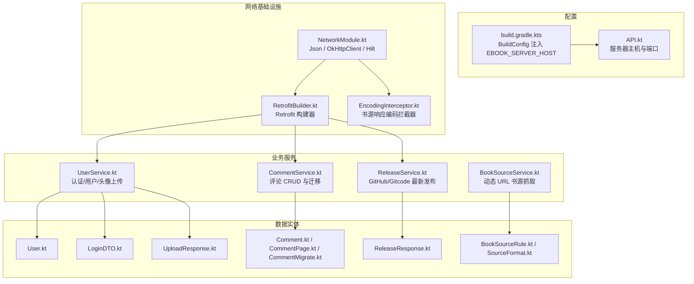
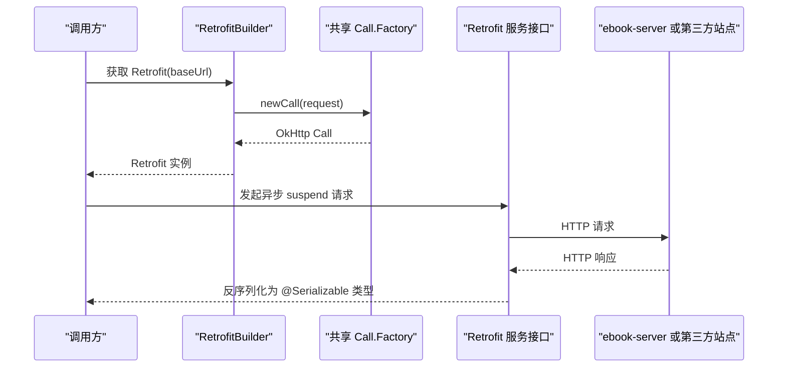
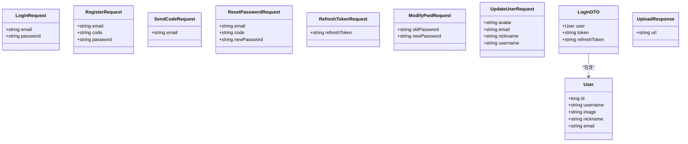
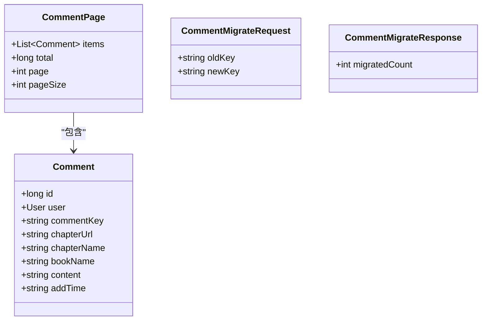
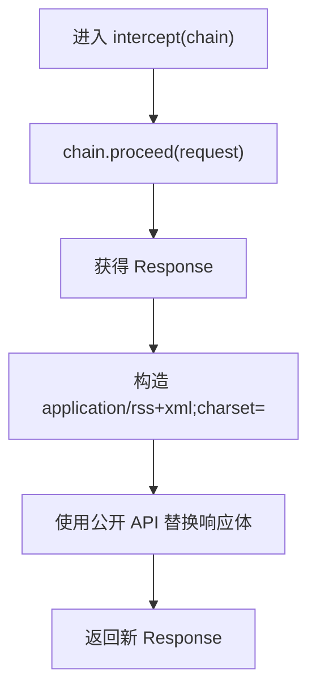
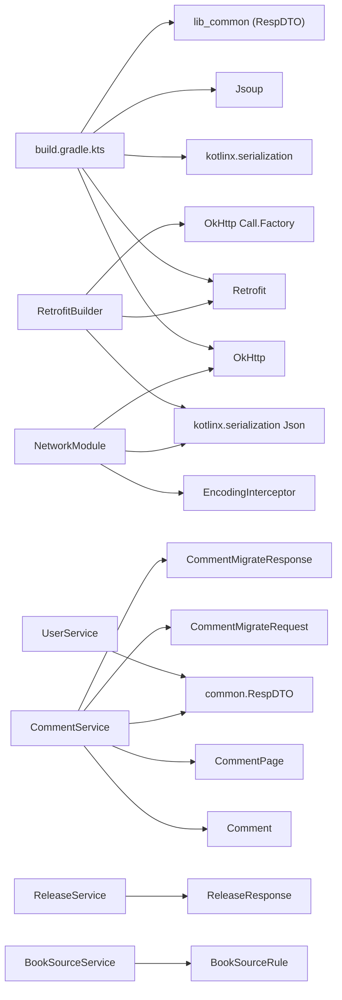

# API 模块 lib_ebook_api

<cite>
**本文引用的文件**   
- [lib_ebook_api/build.gradle.kts](file://lib_ebook_api/build.gradle.kts)
- [RetrofitBuilder.kt](file://lib_ebook_api/src/main/java/com/ebook/api/RetrofitBuilder.kt)
- [API.kt](file://lib_ebook_api/src/main/java/com/ebook/api/config/API.kt)
- [NetworkModule.kt](file://lib_ebook_api/src/main/java/com/ebook/api/utils/NetworkModule.kt)
- [EncodingInterceptor.kt](file://lib_ebook_api/src/main/java/com/ebook/api/intercepter/EncodingInterceptor.kt)
- [BookSourceService.kt](file://lib_ebook_api/src/main/java/com/ebook/api/service/source/BookSourceService.kt)
- [ReleaseService.kt](file://lib_ebook_api/src/main/java/com/ebook/api/service/release/ReleaseService.kt)
- [UserService.kt](file://lib_ebook_api/src/main/java/com/ebook/api/service/user/UserService.kt)
- [CommentService.kt](file://lib_ebook_api/src/main/java/com/ebook/api/service/comment/CommentService.kt)
- [TokenRefresher.kt](file://lib_ebook_api/src/main/java/com/ebook/api/auth/TokenRefresher.kt)
- [JsonUtils.kt](file://lib_ebook_api/src/main/java/com/ebook/api/utils/JsonUtils.kt)
- [LoginRequest.kt](file://lib_ebook_api/src/main/java/com/ebook/api/entity/LoginRequest.kt)
- [RegisterRequest.kt](file://lib_ebook_api/src/main/java/com/ebook/api/entity/RegisterRequest.kt)
- [SendCodeRequest.kt](file://lib_ebook_api/src/main/java/com/ebook/api/entity/SendCodeRequest.kt)
- [ResetPasswordRequest.kt](file://lib_ebook_api/src/main/java/com/ebook/api/entity/ResetPasswordRequest.kt)
- [RefreshTokenRequest.kt](file://lib_ebook_api/src/main/java/com/ebook/api/entity/RefreshTokenRequest.kt)
- [ModifyPwdRequest.kt](file://lib_ebook_api/src/main/java/com/ebook/api/entity/ModifyPwdRequest.kt)
- [UpdateUserRequest.kt](file://lib_ebook_api/src/main/java/com/ebook/api/entity/UpdateUserRequest.kt)
- [User.kt](file://lib_ebook_api/src/main/java/com/ebook/api/entity/User.kt)
- [LoginDTO.kt](file://lib_ebook_api/src/main/java/com/ebook/api/entity/LoginDTO.kt)
- [UploadResponse.kt](file://lib_ebook_api/src/main/java/com/ebook/api/entity/UploadResponse.kt)
- [Comment.kt](file://lib_ebook_api/src/main/java/com/ebook/api/entity/Comment.kt)
- [CommentPage.kt](file://lib_ebook_api/src/main/java/com/ebook/api/entity/CommentPage.kt)
- [CommentMigrate.kt](file://lib_ebook_api/src/main/java/com/ebook/api/entity/CommentMigrate.kt)
- [ReleaseResponse.kt](file://lib_ebook_api/src/main/java/com/ebook/api/entity/ReleaseResponse.kt)
- [BookSourceRule.kt](file://lib_ebook_api/src/main/java/com/ebook/api/entity/BookSourceRule.kt)
- [SourceFormat.kt](file://lib_ebook_api/src/main/java/com/ebook/api/entity/SourceFormat.kt)
</cite>

## 目录
1. [简介](#简介)
2. [项目结构](#项目结构)
3. [核心组件](#核心组件)
4. [架构总览](#架构总览)
5. [详细组件分析](#详细组件分析)
6. [依赖关系分析](#依赖关系分析)
7. [性能与网络优化](#性能与网络优化)
8. [错误处理与排障](#错误处理与排障)
9. [版本管理与迁移指南](#版本管理与迁移指南)
10. [结论](#结论)

## 简介
lib_ebook_api 是电子书客户端的网络访问层模块，封装 Retrofit、OkHttp、Kotlinx Serialization、Hilt 注入以及书源解析所需的基础设施。它对外暴露三类能力：
- 统一构建 Retrofit 实例的 `RetrofitBuilder`；
- 按业务域划分的 RESTful 服务接口：用户认证、评论、发布检查和动态书源抓取；
- 与后端契约对齐的请求/响应数据实体，使用 Kotlinx Serialization 进行 JSON 编解码。

模块同时承担以下职责：
- 从 `local.properties` 注入开发期服务器地址，避免把调试主机写死进仓库；
- 通过 Hilt 提供全局 `Json`、不同用途的 `OkHttpClient` 和白名单；
- 为第三方书源提供字符编码修正拦截器；
- 定义 token 刷新接缝，由上层实现以避免循环依赖。

## 项目结构
模块采用“领域 + 基础设施”分层组织：
- `config`：服务器基础地址常量；
- `utils`：Hilt 网络模块、JSON 工具；
- `intercepter`：自定义 OkHttp 拦截器；
- `auth`：token 刷新接口；
- `service`：按业务域划分的 Retrofit 接口；
- `entity`：请求体、响应体和领域 DTO。

**图表来源**
- [API.kt:1-26](file://lib_ebook_api/src/main/java/com/ebook/api/config/API.kt#L1-L26)
- [lib_ebook_api/build.gradle.kts:1-64](file://lib_ebook_api/build.gradle.kts#L1-L64)
- [RetrofitBuilder.kt:1-45](file://lib_ebook_api/src/main/java/com/ebook/api/RetrofitBuilder.kt#L1-L45)
- [NetworkModule.kt:1-76](file://lib_ebook_api/src/main/java/com/ebook/api/utils/NetworkModule.kt#L1-L76)
- [EncodingInterceptor.kt:1-51](file://lib_ebook_api/src/main/java/com/ebook/api/intercepter/EncodingInterceptor.kt#L1-L51)
- [UserService.kt:1-72](file://lib_ebook_api/src/main/java/com/ebook/api/service/user/UserService.kt#L1-L72)
- [CommentService.kt:1-62](file://lib_ebook_api/src/main/java/com/ebook/api/service/comment/CommentService.kt#L1-L62)
- [ReleaseService.kt:1-25](file://lib_ebook_api/src/main/java/com/ebook/api/service/release/ReleaseService.kt#L1-L25)
- [BookSourceService.kt:1-92](file://lib_ebook_api/src/main/java/com/ebook/api/service/source/BookSourceService.kt#L1-L92)

**章节来源**
- [lib_ebook_api/build.gradle.kts:1-64](file://lib_ebook_api/build.gradle.kts#L1-L64)
- [API.kt:1-26](file://lib_ebook_api/src/main/java/com/ebook/api/config/API.kt#L1-L26)

## 核心组件
本节说明模块中最关键的四个构造点：Retrofit 构建器、Hilt 网络模块、配置常量、自定义拦截器。

### RetrofitBuilder：Retrofit 构建器
`RetrofitBuilder` 负责创建 Retrofit 实例，遵循以下设计原则：
- 不直接持有 `OkHttpClient`，而是通过 Hilt 注入的 `Lazy<Call.Factory>` 获取共享调用工厂，避免重复配置并复用 ADR-0014 中定义的认证拦截器、白名单和脱敏日志；
- 显式注册 Kotlinx Serialization 转换器，复用 Hilt 提供的 `Json`（包含忽略未知字段等策略），并与 mock 链路保持一致；
- 在 Kotlinx 转换器之后追加 Scalars 转换器，以支持返回原始字符串的场景（如书源 HTML）；
- 每个 `Network` 类可创建自己的 Retrofit 实例，但底层 `Call.Factory` 共享。

| 配置项 | 行为 | 影响 |
|---|---|---|
| `baseUrl(url)` | 由调用方传入服务端基址 | 决定所有相对路径的最终 URL |
| `addConverterFactory(networkJson.asConverterFactory(...))` | 优先使用 Kotlinx Serialization | 解析 `@Serializable` 类型 |
| `addConverterFactory(ScalarsConverterFactory.create())` | 兜底处理 String 返回值 | 兼容 HTML/纯文本响应 |
| `callFactory { okhttpCallFactory.get().newCall(it) }` | 复用共享 `Call.Factory` | 携带认证、白名单、日志 |

**章节来源**
- [RetrofitBuilder.kt:1-45](file://lib_ebook_api/src/main/java/com/ebook/api/RetrofitBuilder.kt#L1-L45)

### NetworkModule：Hilt 网络配置
`NetworkModule` 集中管理 JSON 解析器和多用途 `OkHttpClient`：
- `providesNetworkJson()`：全局 `Json`，开启美化输出和忽略未知字段；
- `provideAuthAllowedHosts()`：将开发主机作为认证白名单，供上层共享拦截器校验目标主机；
- `provideSourceOkHttpClient()`：书源专用客户端，设置 10 秒连接/写入/读取超时，并附加 `EncodingInterceptor("UTF-8")`；
- `provideReleaseOkHttpClient()`：发布检查专用客户端，同样 10 秒超时，但不带中文编码修正拦截器，因为 GitHub/Gitcode 的 Releases API 是 ASCII JSON。

| 组件 | 作用域 | 关键参数 |
|---|---|---|
| `Json` | 单例 | `prettyPrint=true`，`ignoreUnknownKeys=true` |
| 认证白名单 | 单例 | 仅包含 `EBOOK_SERVER_HOST` |
| 书源客户端 | 单例，命名 `source` | 10s 三超时，UTF-8 编码拦截器 |
| 发布客户端 | 单例，命名 `release` | 10s 连接/读取超时 |

**章节来源**
- [NetworkModule.kt:1-76](file://lib_ebook_api/src/main/java/com/ebook/api/utils/NetworkModule.kt#L1-L76)

### API：服务器地址配置
`API` 对象集中声明用户服务和评论服务的主机与端口：
- 主机来自 `BuildConfig.EBOOK_SERVER_HOST`，由 `build.gradle.kts` 从 `local.properties` 注入；
- 默认值为模拟器映射到宿主机的 `10.0.2.2`；
- 端口固定为 `9090`，与 ebook-server 的 `server.port` 一致。

| 常量 | 含义 | 值来源 |
|---|---|---|
| `URL_HOST_USER` | 用户/认证服务主机 | `BuildConfig.EBOOK_SERVER_HOST` |
| `URL_PORT_USER` | 用户/认证服务端口 | `9090` |
| `URL_HOST_COMMENT` | 评论服务主机 | `BuildConfig.EBOOK_SERVER_HOST` |
| `URL_PORT_COMMENT` | 评论服务端口 | `9090` |

**章节来源**
- [API.kt:1-26](file://lib_ebook_api/src/main/java/com/ebook/api/config/API.kt#L1-L26)
- [lib_ebook_api/build.gradle.kts:1-25](file://lib_ebook_api/build.gradle.kts#L1-L25)

### EncodingInterceptor：书源字符编码拦截器
`EncodingInterceptor` 用于解决第三方书源站点响应体未正确声明字符集的问题。其逻辑如下：
- 执行原请求并拿到响应；
- 将响应体的 `Content-Type` 强制改写为 `application/rss+xml;charset=<encoding>`；
- 通过公开 API 替换响应体，不反射修改 OkHttp 内部字段；
- 新响应体的 `contentLength` 设为 `-1`，保证流式读取，避免大体积正文全量缓冲。

该实现替代了历史反射改写 `RealResponseBody.contentTypeString` 的方案，从而避免 OkHttp 升级或 R8 混淆导致字段名变化后抛异常。

**章节来源**
- [EncodingInterceptor.kt:1-51](file://lib_ebook_api/src/main/java/com/ebook/api/intercepter/EncodingInterceptor.kt#L1-L51)

## 架构总览
lib_ebook_api 的网络层采用“接口定义 + 构建器 + 数据实体”的经典模式。调用方通常通过 Hilt 获取服务接口实例，或由 `RetrofitBuilder` 按需构建 Retrofit。

**图表来源**
- [RetrofitBuilder.kt:1-45](file://lib_ebook_api/src/main/java/com/ebook/api/RetrofitBuilder.kt#L1-L45)
- [UserService.kt:1-72](file://lib_ebook_api/src/main/java/com/ebook/api/service/user/UserService.kt#L1-L72)
- [NetworkModule.kt:1-76](file://lib_ebook_api/src/main/java/com/ebook/api/utils/NetworkModule.kt#L1-L76)

## 详细组件分析

### 网络层构建配置
#### OkHttp 客户端初始化
模块提供两类 `OkHttpClient`：
- 书源客户端：启用 UTF-8 编码拦截器，三超时均为 10 秒；
- 发布客户端：不启用中文编码拦截器，连接和读取超时为 10 秒。

认证相关客户端不在本模块创建，而是由上层共享的 `Call.Factory` 提供，统一处理认证拦截器、主机白名单和 debug 脱敏日志。

#### 拦截器链配置
当前模块内可见的拦截器包括：
- `EncodingInterceptor`：仅挂载于书源客户端，负责改写响应体 Content-Type；
- 共享 `Call.Factory`：由 ADR-0014 定义，承载认证、白名单和日志逻辑，具体实现位于 lib_common，本模块只消费。

#### 超时设置
| 客户端 | 连接超时 | 写入超时 | 读取超时 | 备注 |
|---|---:|---:|---:|---|
| 书源客户端 | 10 秒 | 10 秒 | 10 秒 | 面向不可控第三方站点 |
| 发布客户端 | 10 秒 | 未显式设置 | 10 秒 | 面向 GitHub/Gitcode 公开 API |
| 认证客户端 | 由共享 Call.Factory 决定 | 由共享 Call.Factory 决定 | 由共享 Call.Factory 决定 | 注释指出约 30 秒 |

#### 重试机制
当前代码中没有在本模块内实现显式重试逻辑。对认证失败场景，模块通过 `TokenRefresher` 接口定义 refresh 语义，并由上层在检测到特定响应码时触发。

**章节来源**
- [NetworkModule.kt:1-76](file://lib_ebook_api/src/main/java/com/ebook/api/utils/NetworkModule.kt#L1-L76)
- [RetrofitBuilder.kt:1-45](file://lib_ebook_api/src/main/java/com/ebook/api/RetrofitBuilder.kt#L1-L45)
- [TokenRefresher.kt:1-27](file://lib_ebook_api/src/main/java/com/ebook/api/auth/TokenRefresher.kt#L1-L27)

### RESTful API 端点定义
本节按业务域整理所有已声明的 REST 端点。响应统一被包装为 `RespDTO<T>`，错误码和业务语义由服务端定义；本模块中的注释保留部分业务约束，但不应视为完整的错误码字典。

#### 用户与认证服务
| 方法 | URL | 请求体 | 响应 | 认证要求 | 业务说明 |
|---|---|---|---|---|---|
| `POST` | `/api/auth/login` | `LoginRequest` | `RespDTO<LoginDTO>` | 否 | 邮箱+密码登录 |
| `POST` | `/api/auth/send-code` | `SendCodeRequest` | `RespDTO<Unit>` | 否 | 发送注册验证码 |
| `POST` | `/api/auth/register` | `RegisterRequest` | `RespDTO<Unit>` | 否 | 邮箱+验证码+密码注册，注册即激活 |
| `POST` | `/api/auth/refresh` | `RefreshTokenRequest` | `RespDTO<LoginDTO>` | 否 | 刷新 access token |
| `POST` | `/api/auth/logout` | 无 | `RespDTO<Unit>` | 是 | 登出 |
| `PUT` | `/api/users/me/password` | `ModifyPwdRequest` | `RespDTO<Unit>` | 是 | 已登录改密 |
| `POST` | `/api/auth/forgot-password/send-code` | `SendCodeRequest` | `RespDTO<Unit>` | 否 | 发送忘记密码验证码 |
| `POST` | `/api/auth/forgot-password/reset` | `ResetPasswordRequest` | `RespDTO<Unit>` | 否 | 验证码重置密码 |
| `PUT` | `/api/users/me` | `UpdateUserRequest` | `RespDTO<User>` | 是 | 更新当前用户信息 |
| `POST` | `/api/uploads/avatar` | `multipart/form-data`，字段 `avatar` | `RespDTO<UploadResponse>` | 是 | 上传头像，大小 ≤5MB |

#### 评论服务
| 方法 | URL | 请求体 | 查询参数 | 响应 | 认证要求 | 业务说明 |
|---|---|---|---|---|---|---|
| `POST` | `/api/comments` | `Comment` | 无 | `RespDTO<Comment>` | 是 | 创建评论 |
| `DELETE` | `/api/comments/{id}` | 无 | 无 | `RespDTO<Unit>` | 是 | 删除本人或管理员允许的评论 |
| `GET` | `/api/comments/my` | 无 | `page`、`page_size` | `RespDTO<CommentPage>` | 是 | 我的评论分页 |
| `GET` | `/api/comments` | 无 | `comment_keys`、`page`、`page_size` | `RespDTO<CommentPage>` | 否 | 按聚合键列表查询评论并集 |
| `POST` | `/api/comments/migrate` | `CommentMigrateRequest` | 无 | `RespDTO<CommentMigrateResponse>` | 是 | 迁移旧 key 到新 key |

#### 发布检查服务
| 方法 | URL | 请求体 | 响应 | 认证要求 | 业务说明 |
|---|---|---|---|---|---|
| `GET` | 动态完整 URL | 无 | `ReleaseResponse` | 否 | 拉取 GitHub 或 Gitcode 的 latest Release |

#### 书源抓取服务
`BookSourceService` 不绑定固定 baseUrl，而是基于规则中的完整 URL 创建 Retrofit 实例：
| 方法 | URL | 请求体 | 响应 | 认证要求 | 业务说明 |
|---|---|---|---|---|---|
| `GET` | 动态 `@Url` | 无 | `String` | 否 | 抓取书源页面 |
| `POST` | 动态 `@Url` | `RequestBody` | `String` | 否 | 提交书源表单并抓取页面 |

此外，`BookSourceService` 提供辅助方法：
- `create(rule, okHttpClient)`：根据 `BookSourceRule.url` 创建 Retrofit 实例；
- `buildHeaders(rule)`：构建 Accept、Accept-Language、Cache-Control、User-Agent 及规则自定义头；
- `buildRequestBody(rule, body)`：按 `rule.charset` 构造表单请求体；
- `handleCharset(responseBody, charset)`：非 UTF-8 时按指定编码转码。

**章节来源**
- [UserService.kt:1-72](file://lib_ebook_api/src/main/java/com/ebook/api/service/user/UserService.kt#L1-L72)
- [CommentService.kt:1-62](file://lib_ebook_api/src/main/java/com/ebook/api/service/comment/CommentService.kt#L1-L62)
- [ReleaseService.kt:1-25](file://lib_ebook_api/src/main/java/com/ebook/api/service/release/ReleaseService.kt#L1-L25)
- [BookSourceService.kt:1-92](file://lib_ebook_api/src/main/java/com/ebook/api/service/source/BookSourceService.kt#L1-L92)

### 数据实体结构
所有请求和响应实体均使用 Kotlinx Serialization。常见约定如下：
- 使用 `@Serializable` 标记数据类；
- 使用 `@SerialName` 将 Kotlin 驼峰属性映射到服务端蛇形字段；
- 可选字段使用可空类型或带默认值的属性；
- 展示型实体可能额外实现 `Parcelable`，便于 Android 跨进程传递。

#### 认证与用户实体
| 实体 | 关键字段 | 序列化映射 | 业务规则 |
|---|---|---|---|
| `LoginRequest` | `email`、`password` | 无特殊映射 | 邮箱为主标识 |
| `RegisterRequest` | `email`、`code`、`password` | 无特殊映射 | 注册即激活，不发 token |
| `SendCodeRequest` | `email` | 无特殊映射 | 注册和找回密码共用 |
| `ResetPasswordRequest` | `email`、`code`、`newPassword` | `new_password` ↔ `newPassword` | 服务端校验验证码 |
| `RefreshTokenRequest` | `refreshToken` | `refresh_token` ↔ `refreshToken` | 刷新 access token |
| `ModifyPwdRequest` | `oldPassword`、`newPassword` | `old_password`、`new_password` | 服务端校验旧密码 |
| `UpdateUserRequest` | `avatar?`、`email?`、`nickname?`、`username?` | 无特殊映射 | 全部可选，非空即更新 |
| `User` | `id`、`username`、`image`、`nickname`、`email` | `uid`↔`id`，`avatar`↔`image` | UI 展示用身份模型 |
| `LoginDTO` | `user?`、`token?`、`refreshToken?` | `refresh_token`↔`refreshToken` | 登录/刷新双 token 载荷 |
| `UploadResponse` | `url` | 无特殊映射 | 头像上传后返回可访问 URL |

**图表来源**
- [LoginRequest.kt:1-15](file://lib_ebook_api/src/main/java/com/ebook/api/entity/LoginRequest.kt#L1-L15)
- [RegisterRequest.kt:1-17](file://lib_ebook_api/src/main/java/com/ebook/api/entity/RegisterRequest.kt#L1-L17)
- [SendCodeRequest.kt:1-13](file://lib_ebook_api/src/main/java/com/ebook/api/entity/SendCodeRequest.kt#L1-L13)
- [ResetPasswordRequest.kt:1-19](file://lib_ebook_api/src/main/java/com/ebook/api/entity/ResetPasswordRequest.kt#L1-L19)
- [RefreshTokenRequest.kt:1-15](file://lib_ebook_api/src/main/java/com/ebook/api/entity/RefreshTokenRequest.kt#L1-L15)
- [ModifyPwdRequest.kt:1-18](file://lib_ebook_api/src/main/java/com/ebook/api/entity/ModifyPwdRequest.kt#L1-L18)
- [UpdateUserRequest.kt:1-22](file://lib_ebook_api/src/main/java/com/ebook/api/entity/UpdateUserRequest.kt#L1-L22)
- [User.kt:1-29](file://lib_ebook_api/src/main/java/com/ebook/api/entity/User.kt#L1-L29)
- [LoginDTO.kt:1-16](file://lib_ebook_api/src/main/java/com/ebook/api/entity/LoginDTO.kt#L1-L16)
- [UploadResponse.kt:1-13](file://lib_ebook_api/src/main/java/com/ebook/api/entity/UploadResponse.kt#L1-L13)

#### 评论实体
| 实体 | 关键字段 | 序列化映射 | 业务规则 |
|---|---|---|---|
| `Comment` | `id`、`user`、`commentKey?`、`chapterUrl?`、`chapterName?`、`bookName?`、`content?`、`addTime` | `comment_key`↔`commentKey`，`chapter_url`↔`chapterUrl`，`chapter_name`↔`chapterName`，`book_name`↔`bookName`，`content`↔`content`，`add_time`↔`addTime` | M2 新增 `commentKey`；章节字段为冗余快照；`content` 创建时必填 |
| `CommentPage` | `items`、`total`、`page`、`pageSize` | `page_size`↔`pageSize` | 标准分页包裹 |
| `CommentMigrateRequest` | `oldKey`、`newKey` | `old_key`↔`oldKey`，`new_key`↔`newKey` | 迁移旧 key 到新 key |
| `CommentMigrateResponse` | `migratedCount` | `migrated_count`↔`migratedCount` | 返回迁移条数 |

**图表来源**
- [Comment.kt:1-39](file://lib_ebook_api/src/main/java/com/ebook/api/entity/Comment.kt#L1-L39)
- [CommentPage.kt:1-18](file://lib_ebook_api/src/main/java/com/ebook/api/entity/CommentPage.kt#L1-L18)
- [CommentMigrate.kt:1-26](file://lib_ebook_api/src/main/java/com/ebook/api/entity/CommentMigrate.kt#L1-L26)

#### 发布检查实体
| 实体 | 关键字段 | 序列化映射 | 业务规则 |
|---|---|---|---|
| `ReleaseResponse` | `tagName?`、`name?`、`body?`、`assets?` | `tag_name`↔`tagName` | 两平台统一投影，字段均可空 |
| `ReleaseAsset` | `name?`、`browserDownloadUrl?` | `browser_download_url`↔`browserDownloadUrl` | 下载入口需按 `.apk` 过滤 |

**章节来源**
- [ReleaseResponse.kt:1-45](file://lib_ebook_api/src/main/java/com/ebook/api/entity/ReleaseResponse.kt#L1-L45)

#### 书源规则实体
`BookSourceRule` 是 JSON 驱动的书源配置根类型，包含名称、URL、是否启用、分组、权重、字符编码、请求头、请求方法、请求体模板，以及搜索、书籍详情、目录、正文、发现分类等规则。配合 `SourceFormat` 和 `SourceDefinition`，模块可以区分原生规则书源和脚本书源，并为 UI 提供展示信息。

| 类别 | 主要字段 | 作用 |
|---|---|---|
| 根规则 `BookSourceRule` | `name`、`url`、`enabled`、`group`、`weight`、`charset`、`headers`、`method`、`body` | 描述书源基本信息和通用请求策略 |
| 搜索 `SearchRule` | `list`、`name`、`author`、`kind`、`lastChapter`、`coverUrl`、`bookUrl`、`intro` | 搜索结果选择器 |
| 详情 `BookInfoRule` | `name`、`author`、`coverUrl`、`intro`、`kind`、`lastChapter`、`tocUrl`、`authorPrefix`、`introPrefix`、`reverseToc` | 书籍详情页解析 |
| 目录 `TocRule` | `list`、`name`、`url`、`pageUrl`、`nextPage`、`reverse` | 章节索引解析与分页 |
| 正文 `ContentRule` | `content`、`nextPage`、`replaceRules`、`image` | 正文容器、下一页、正则替换和图片 |
| 发现 `FindRule` | `url`、`kinds`、`ruleSearch` | 分类发现页 |
| 格式 `SourceFormat` | `NATIVE`、`SCRIPT` | 原生规则 vs 脚本规则 |
| 定义 `SourceDefinition` | `Native(rule)`、`Script(rawJson, name, url)` | 统一抽象两种书源载体 |

**章节来源**
- [BookSourceRule.kt:1-209](file://lib_ebook_api/src/main/java/com/ebook/api/entity/BookSourceRule.kt#L1-L209)
- [SourceFormat.kt:1-91](file://lib_ebook_api/src/main/java/com/ebook/api/entity/SourceFormat.kt#L1-L91)

### 自定义拦截器实现
`EncodingInterceptor` 的实现流程如下：

该实现的关键点是：
- 不反射 OkHttp 私有字段；
- 使用 `ResponseBody.source()` 和 `asResponseBody(MediaType?)` 构造新响应体；
- 将 `contentLength` 固定为 `-1`，确保流式处理；
- 其他响应字段保持不变。

**章节来源**
- [EncodingInterceptor.kt:1-51](file://lib_ebook_api/src/main/java/com/ebook/api/intercepter/EncodingInterceptor.kt#L1-L51)

### AppConfig 配置管理机制与环境变量管理
模块没有名为 `AppConfig` 的配置类，但其配置管理职责由以下文件共同承担：
- `build.gradle.kts`：从 `rootProject.file("local.properties")` 读取 `ebook.server.host`，缺省 `10.0.2.2`，并通过 `BuildConfig.EBOOK_SERVER_HOST` 暴露给运行时；
- `API.kt`：将 `BuildConfig.EBOOK_SERVER_HOST` 和端口组合成用户/评论服务基础地址；
- `NetworkModule.kt`：将同一主机注入为认证白名单；
- `JsonUtils.kt`：复用 `NetworkModule.providesNetworkJson()` 提供全局 JSON 解析器。

这种设计把“环境差异”限制在构建期和注入层，业务接口只消费最终值，不关心配置来源。

**章节来源**
- [lib_ebook_api/build.gradle.kts:1-25](file://lib_ebook_api/build.gradle.kts#L1-L25)
- [API.kt:1-26](file://lib_ebook_api/src/main/java/com/ebook/api/config/API.kt#L1-L26)
- [NetworkModule.kt:1-76](file://lib_ebook_api/src/main/java/com/ebook/api/utils/NetworkModule.kt#L1-L76)
- [JsonUtils.kt:1-23](file://lib_ebook_api/src/main/java/com/ebook/api/utils/JsonUtils.kt#L1-L23)

### API 使用示例
#### 同步与异步调用模式
模块中的服务接口均使用协程 suspend 函数，因此本质上是异步非阻塞调用。调用方可以直接在协程中调用：
- 认证调用：`login`、`register`、`refreshToken`、`logout`、`modifyPwd`、`sendRegisterCode`、`sendForgotPasswordCode`、`resetPassword`；
- 用户调用：`updateMe`、`uploadAvatar`；
- 评论调用：`addComment`、`deleteComment`、`getMyComments`、`getComments`、`migrateMyComments`；
- 发布检查调用：`getLatest`；
- 书源调用：`getPage`、`postPage`。

#### 错误处理
本模块的 HTTP 层没有集中捕获业务错误码；REST 端点的响应类型为 `RespDTO<T>`，业务状态码应由上层根据服务端契约判断并转换为应用级异常或提示。对于 token 过期场景，模块通过 `TokenRefresher.refresh` 接口暴露刷新能力，由上层在检测到 A0230 时触发，且刷新调用不得再次经过可能触发刷新的适配层，以避免死循环。

#### 响应数据转换
- JSON 响应通过 Kotlinx Serialization 自动反序列化为 `@Serializable` 类型；
- HTML 或纯文本响应通过 Scalars 转换器返回 `String`；
- 书源响应经过 `EncodingInterceptor` 后统一按 UTF-8 流式处理；
- 头像上传使用 `multipart/form-data`，返回 `UploadResponse.url`，再调用 `updateMe` 提交头像 URL。

**章节来源**
- [UserService.kt:1-72](file://lib_ebook_api/src/main/java/com/ebook/api/service/user/UserService.kt#L1-L72)
- [CommentService.kt:1-62](file://lib_ebook_api/src/main/java/com/ebook/api/service/comment/CommentService.kt#L1-L62)
- [ReleaseService.kt:1-25](file://lib_ebook_api/src/main/java/com/ebook/api/service/release/ReleaseService.kt#L1-L25)
- [BookSourceService.kt:1-92](file://lib_ebook_api/src/main/java/com/ebook/api/service/source/BookSourceService.kt#L1-L92)
- [TokenRefresher.kt:1-27](file://lib_ebook_api/src/main/java/com/ebook/api/auth/TokenRefresher.kt#L1-L27)

## 依赖关系分析
模块对外暴露的类型主要集中在 service 和 entity 包，内部基础设施通过 Hilt 解耦。

**图表来源**
- [lib_ebook_api/build.gradle.kts:1-64](file://lib_ebook_api/build.gradle.kts#L1-L64)
- [RetrofitBuilder.kt:1-45](file://lib_ebook_api/src/main/java/com/ebook/api/RetrofitBuilder.kt#L1-L45)
- [NetworkModule.kt:1-76](file://lib_ebook_api/src/main/java/com/ebook/api/utils/NetworkModule.kt#L1-L76)
- [UserService.kt:1-72](file://lib_ebook_api/src/main/java/com/ebook/api/service/user/UserService.kt#L1-L72)
- [CommentService.kt:1-62](file://lib_ebook_api/src/main/java/com/ebook/api/service/comment/CommentService.kt#L1-L62)
- [ReleaseService.kt:1-25](file://lib_ebook_api/src/main/java/com/ebook/api/service/release/ReleaseService.kt#L1-L25)
- [BookSourceService.kt:1-92](file://lib_ebook_api/src/main/java/com/ebook/api/service/source/BookSourceService.kt#L1-L92)

模块耦合特点：
- 低耦合：服务接口只声明 HTTP 契约和数据类型，不感知 OkHttp 细节；
- 高内聚：JSON、超时、拦截器等网络配置集中在 `NetworkModule`；
- 依赖方向清晰：`lib_book_common → lib_ebook_api`，反向通过接口 `TokenRefresher` 注入实现；
- 外部依赖明确：Retrofit、OkHttp、Kotlinx Serialization、Jsoup、lib_common。

**章节来源**
- [lib_ebook_api/build.gradle.kts:1-64](file://lib_ebook_api/build.gradle.kts#L1-L64)
- [TokenRefresher.kt:1-27](file://lib_ebook_api/src/main/java/com/ebook/api/auth/TokenRefresher.kt#L1-L27)

## 性能与网络优化
### 连接池与超时
- 书源客户端：连接、写入、读取均为 10 秒，适合不可控第三方站点快速失败；
- 发布客户端：连接、读取为 10 秒，避免长时间等待公开托管平台；
- 认证客户端：由共享 `Call.Factory` 提供，注释指出约 30 秒超时，适合受控的后端服务。

### 缓存机制
当前代码中没有为 Retrofit 或 OkHttp 配置显式 HTTP 缓存层。评论分页、发布检查、书源抓取都走直连网络。若需要离线或减少重复请求，可在更高层引入缓存策略，而不是在 API 模块内硬编码。

### 序列化性能
- 全局 `Json` 开启 `ignoreUnknownKeys`，提升对后端演进字段的容错；
- `prettyPrint = true` 更适合调试，生产环境可根据需要关闭以减少内存占用；
- Kotlinx Serialization 转换器优先于 Scalars 转换器，避免 String 类型误判。

### 流式响应
`EncodingInterceptor` 使用 `contentLength = -1` 的响应体，避免大体积书源正文全量缓冲，降低峰值内存。

**章节来源**
- [NetworkModule.kt:1-76](file://lib_ebook_api/src/main/java/com/ebook/api/utils/NetworkModule.kt#L1-L76)
- [EncodingInterceptor.kt:1-51](file://lib_ebook_api/src/main/java/com/ebook/api/intercepter/EncodingInterceptor.kt#L1-L51)

## 错误处理与排障
### 常见排障要点
| 现象 | 可能原因 | 建议排查 |
|---|---|---|
| 书源中文乱码 | 第三方站点未正确声明字符集 | 确认 `EncodingInterceptor` 挂载到书源客户端 |
| 书源请求全部失败 | 历史反射实现被 OkHttp 升级或 R8 混淆破坏 | 确认当前实现使用公开 API 改写响应体 |
| 开发环境连不上服务器 | `local.properties` 未配置或端口不一致 | 检查 `ebook.server.host` 是否为 `10.0.2.2` 或局域网 IP，端口是否为 `9090` |
| 登录后仍报 token 过期 | 刷新逻辑未正确触发或刷新自身再次触发刷新 | 检查 `TokenRefresher` 实现和调用链，避免刷新请求进入会触发刷新的适配层 |
| 第三方站点请求超时 | 第三方站点响应慢 | 调整对应 `OkHttpClient` 的超时时间，不要混用认证客户端 |
| 头像上传失败 | 文件格式或大小不符合契约 | 确认字段名为 `avatar`，格式为 jpg/png/webp，大小 ≤5MB |

### 错误边界
- 业务错误码：由服务端定义，调用方应判断 `RespDTO` 的业务状态；
- 网络错误：由 OkHttp/Retrofit 抛出，调用方应区分超时、DNS、SSL、连接失败等；
- Token 过期：由上层检测 A0230 并调用 `TokenRefresher`，刷新成功后重试原请求；
- JSON 不匹配：由于 `ignoreUnknownKeys=true`，未知字段不会报错，但缺失必填字段可能导致下游业务异常。

**章节来源**
- [EncodingInterceptor.kt:1-51](file://lib_ebook_api/src/main/java/com/ebook/api/intercepter/EncodingInterceptor.kt#L1-L51)
- [TokenRefresher.kt:1-27](file://lib_ebook_api/src/main/java/com/ebook/api/auth/TokenRefresher.kt#L1-L27)
- [UserService.kt:1-72](file://lib_ebook_api/src/main/java/com/ebook/api/service/user/UserService.kt#L1-L72)

## 版本管理与迁移指南
### 服务端地址迁移
- 旧做法可能是硬编码主机或端口；
- 当前做法通过 `local.properties.ebook.server.host` 注入 `BuildConfig.EBOOK_SERVER_HOST`，默认 `10.0.2.2`；
- 真机联调时只需在本地 `local.properties` 覆盖主机，无需改代码；
- 端口已统一为 `9090`，不再使用历史笔误的 `5000`。

### 评论接口迁移
M2 版本的主要变更：
- 查询评论从 `chapter_url` 改为 `comment_keys`，逗号分隔的聚合键列表；
- 创建评论请求新增必填 `comment_key`；
- 新增 `/api/comments/migrate` 端点，用于把旧 key 的评论批量迁移到新 key；
- 响应分页统一使用 `CommentPage`，字段包括 `items`、`total`、`page`、`page_size`。

### 用户接口迁移
- 昵称和头像修改统一走 `PUT /api/users/me`，历史独立端点已废弃；
- 头像上传改为两步：先 `POST /api/uploads/avatar`，再 `PUT /api/users/me` 提交 URL；
- 用户实体保持 `id/image/nickname/email` 等客户端历史命名，仅在序列化边界映射到 `uid/avatar`。

### 向后兼容性保证
- JSON 解析开启 `ignoreUnknownKeys`，允许服务端新增字段而不破坏客户端；
- 客户端实体保持历史属性名，通过 `@SerialName` 映射后端键；
- 书源规则通过 JSON 配置驱动，新增网站通常不需要修改代码。

**章节来源**
- [lib_ebook_api/build.gradle.kts:1-25](file://lib_ebook_api/build.gradle.kts#L1-L25)
- [API.kt:1-26](file://lib_ebook_api/src/main/java/com/ebook/api/config/API.kt#L1-L26)
- [CommentService.kt:1-62](file://lib_ebook_api/src/main/java/com/ebook/api/service/comment/CommentService.kt#L1-L62)
- [Comment.kt:1-39](file://lib_ebook_api/src/main/java/com/ebook/api/entity/Comment.kt#L1-L39)
- [CommentPage.kt:1-18](file://lib_ebook_api/src/main/java/com/ebook/api/entity/CommentPage.kt#L1-L18)
- [CommentMigrate.kt:1-26](file://lib_ebook_api/src/main/java/com/ebook/api/entity/CommentMigrate.kt#L1-L26)
- [UpdateUserRequest.kt:1-22](file://lib_ebook_api/src/main/java/com/ebook/api/entity/UpdateUserRequest.kt#L1-L22)
- [User.kt:1-29](file://lib_ebook_api/src/main/java/com/ebook/api/entity/User.kt#L1-L29)
- [UploadResponse.kt:1-13](file://lib_ebook_api/src/main/java/com/ebook/api/entity/UploadResponse.kt#L1-L13)

## 结论
lib_ebook_api 模块以 Retrofit 和 OkHttp 为基础，围绕用户认证、评论、发布检查和书源抓取四类能力构建。其核心优势在于：
- 通过 `RetrofitBuilder` 统一构建 Retrofit，复用共享 `Call.Factory`；
- 通过 `NetworkModule` 集中管理 JSON、超时和拦截器；
- 通过 `EncodingInterceptor` 安全地修正第三方书源响应编码；
- 通过 `@Serializable` 和 `@SerialName` 对齐服务端蛇形契约；
- 通过 `TokenRefresher` 接口解耦 token 刷新实现；
- 通过 `local.properties` 和 `BuildConfig` 隔离开发环境与生产环境。

扩展建议：
- 如需统一重试策略，可在共享 `Call.Factory` 层增加重试拦截器；
- 如需离线能力，可在调用层引入缓存仓库；
- 如需严格验证请求参数，应在业务层而非序列化层完成；
- 如需监控网络质量，可在共享 `Call.Factory` 层埋点统计成功率、耗时和错误分布。