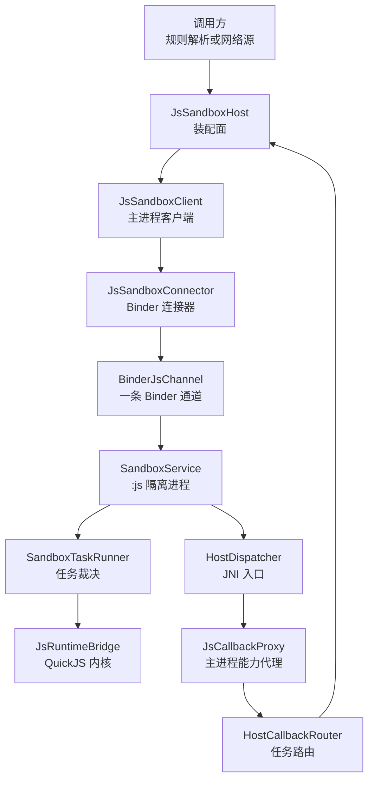
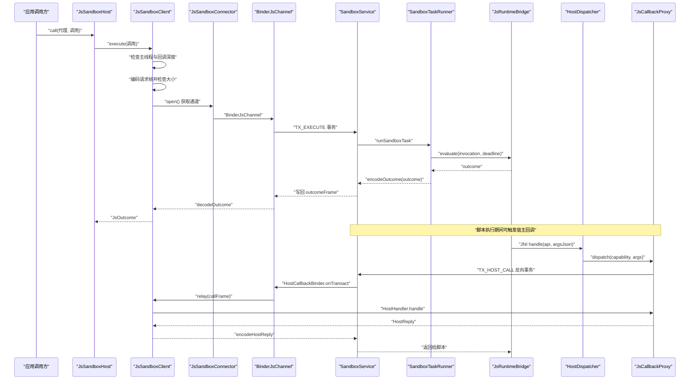
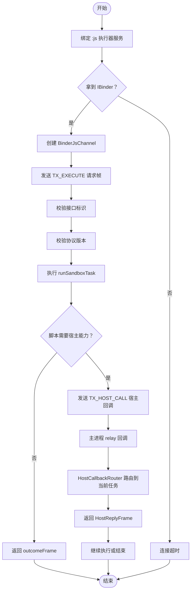
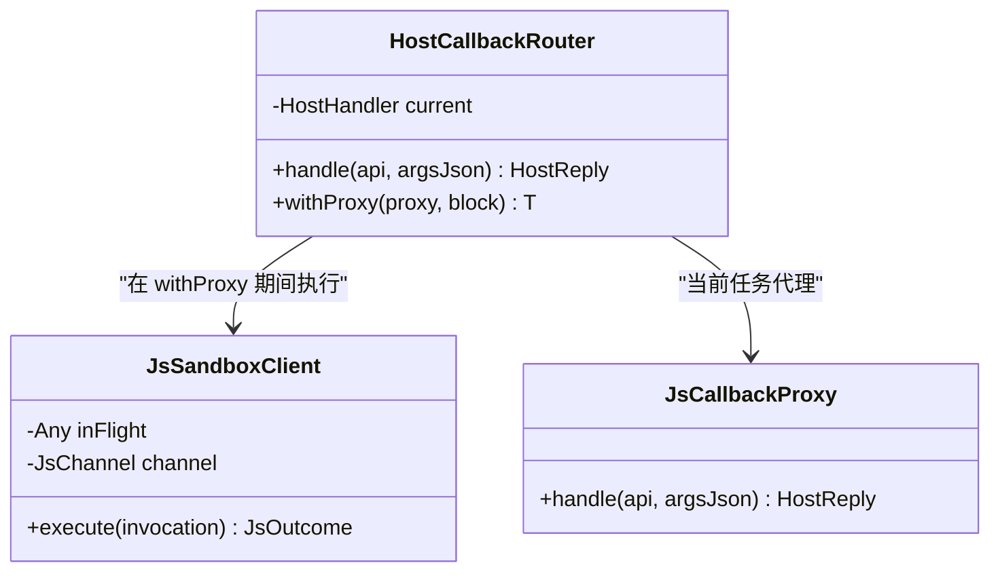
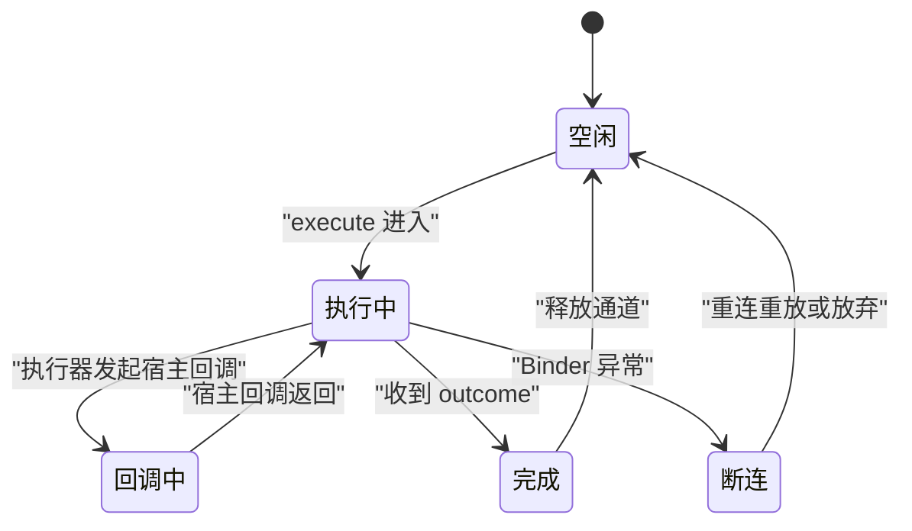
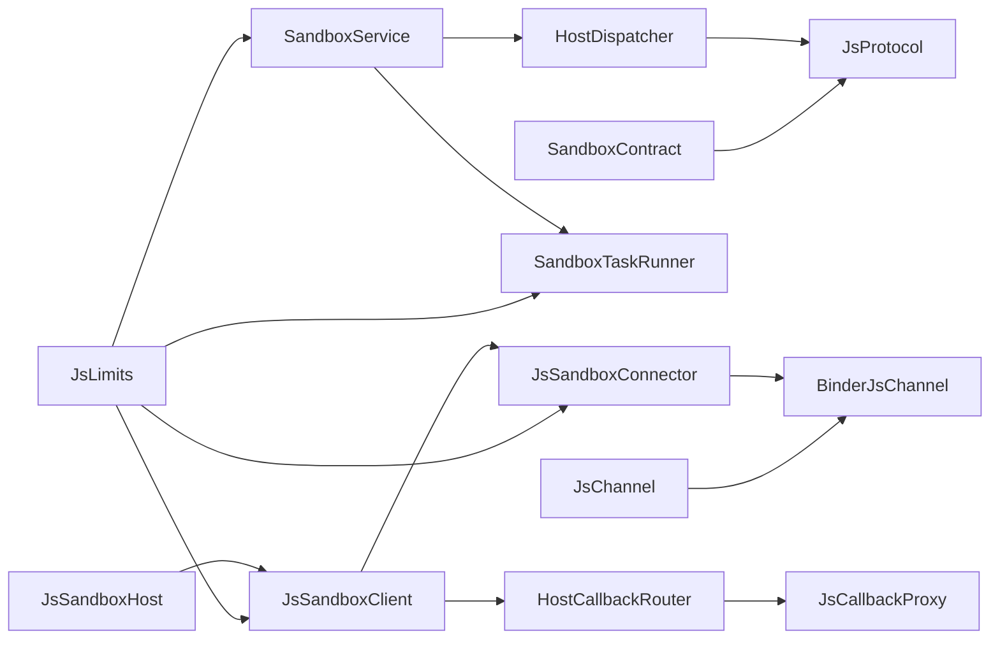

# IPC 通信架构

<cite>
**本文引用的文件**   
- [JsSandboxClient.kt](file://lib_book_source/src/main/java/com/ebook/source/sandbox/JsSandboxClient.kt)
- [JsSandboxHost.kt](file://lib_book_source/src/main/java/com/ebook/source/sandbox/JsSandboxHost.kt)
- [JsProtocol.kt](file://lib_book_source/src/main/java/com/ebook/source/sandbox/JsProtocol.kt)
- [SandboxContract.kt](file://lib_book_source/src/main/java/com/ebook/source/sandbox/SandboxContract.kt)
- [HostDispatcher.kt](file://lib_book_source/src/main/java/com/ebook/source/sandbox/HostDispatcher.kt)
- [BinderJsChannel.kt](file://lib_book_source/src/main/java/com/ebook/source/sandbox/BinderJsChannel.kt)
- [JsSandboxConnector.kt](file://lib_book_source/src/main/java/com/ebook/source/sandbox/JsSandboxConnector.kt)
- [SandboxService.kt](file://lib_book_source/src/main/java/com/ebook/source/sandbox/SandboxService.kt)
- [JsLimits.kt](file://lib_book_source/src/main/java/com/ebook/source/sandbox/JsLimits.kt)
- [JsChannel.kt](file://lib_book_source/src/main/java/com/ebook/source/sandbox/JsChannel.kt)
- [JsCallbackProxy.kt](file://lib_book_source/src/main/java/com/ebook/source/sandbox/JsCallbackProxy.kt)
- [SandboxTaskRunner.kt](file://lib_book_source/src/main/java/com/ebook/source/sandbox/SandboxTaskRunner.kt)
</cite>

## 目录

1. [引言](#引言)
2. [项目结构](#项目结构)
3. [核心组件](#核心组件)
4. [架构总览](#架构总览)
5. [详细组件分析](#详细组件分析)
6. [依赖关系分析](#依赖关系分析)
7. [性能与限制](#性能与限制)
8. [故障排查指南](#故障排查指南)
9. [协议扩展与兼容性测试](#协议扩展与兼容性测试)
10. [结论](#结论)

## 引言

本仓库实现了一个用于解析网络书源的 JavaScript 沙箱：主进程通过 Android Binder 调用隔离的 `:js` 执行器进程，在 QuickJS 内核中运行不受信任的规则脚本；脚本可调用受控计算能力，并通过“宿主回调”向主进程发起网络请求、读写会话等受限操作。

本文聚焦该系统的 **IPC 通信架构**，覆盖以下目标：

- 解释 `JsSandboxClient`（主进程客户端）与 `JsSandboxHost`（主进程装配面）的双向通信模式。
- 说明 Binder 通道建立、消息序列化与反序列化流程。
- 文档化 `JsProtocol` 协议规范，包括请求帧、响应帧、host 调用帧和数据结构。
- 说明 `SandboxContract` 接口契约：事务码 `TX_EXECUTE` / `TX_PING`、接口标识 `TOKEN` 与协议版本控制。
- 解释 `HostCallbackRouter` 的任务级回调路由机制，确保多个并发脚本任务的消息正确分发。
- 梳理线程模型：主线程阻塞保护、Binder 线程池调度、`ThreadLocal` 回调状态管理。
- 总结断线重连策略、消息超时处理、死锁防护与性能优化技巧。
- 给出协议扩展指南与兼容性测试方法。

## 项目结构

JavaScript 沙箱 IPC 相关代码集中在 `lib_book_source` 模块的 `com.ebook.source.sandbox` 包中，按职责划分为以下几类文件：

| 类别 | 文件 | 职责 |
|---|---|---|
| 客户端 | `JsSandboxClient.kt` | 主进程侧统一执行入口：串行化请求、大小检查、断线重连、回调中继、主线程与回调重入保护 |
| 装配面 | `JsSandboxHost.kt` | 持有长命客户端、短命回调代理路由器，并为一次解析任务构造 JS 桥接对象 |
| 通道抽象 | `JsChannel.kt` | 不依赖 Android 类型的通道接口，使重连与失败路径可在 JVM 测试 |
| Binder 通道 | `BinderJsChannel.kt` | 基于 Binder 的一次事务一帧实现，含反向 host 回调 Binder |
| 连接器 | `JsSandboxConnector.kt` | 绑定 `SandboxService`，等待 IBinder，包装为 `BinderJsChannel` |
| 服务 | `SandboxService.kt` | `:js` 隔离进程唯一组件，分诊事务、校验协议、执行任务、转发 host 回调 |
| 协议 | `JsProtocol.kt` | 跨进程 JSON 帧编解码、状态映射、UTF-8 长度计算 |
| 契约 | `SandboxContract.kt` | 接口标识、协议版本、事务码、回调 token |
| 资源限制 | `JsLimits.kt` | 挂钟上限、堆上限、栈上限、报文上限、回调深度、连接超时、单任务请求次数 |
| 回调路由 | `JsCallbackProxy.kt` | 任务级回调代理与能力路由；`HostCallbackRouter` 负责当前任务切换 |
| 执行器调度 | `SandboxTaskRunner.kt` | 执行器侧任务裁决：解码、超时、边界清理、结果大小门控 |
| 执行器入口 | `HostDispatcher.kt` | JNI 入口，白名单校验、计算能力与宿主回调分流 |

**图示来源**  
- [JsSandboxHost.kt:1-60](file://lib_book_source/src/main/java/com/ebook/source/sandbox/JsSandboxHost.kt#L1-L60)  
- [JsSandboxClient.kt:1-185](file://lib_book_source/src/main/java/com/ebook/source/sandbox/JsSandboxClient.kt#L1-L185)  
- [JsSandboxConnector.kt:1-142](file://lib_book_source/src/main/java/com/ebook/source/sandbox/JsSandboxConnector.kt#L1-L142)  
- [BinderJsChannel.kt:1-132](file://lib_book_source/src/main/java/com/ebook/source/sandbox/BinderJsChannel.kt#L1-L132)  
- [SandboxService.kt:1-210](file://lib_book_source/src/main/java/com/ebook/source/sandbox/SandboxService.kt#L1-L210)  
- [SandboxTaskRunner.kt:1-69](file://lib_book_source/src/main/java/com/ebook/source/sandbox/SandboxTaskRunner.kt#L1-L69)  
- [HostDispatcher.kt:1-74](file://lib_book_source/src/main/java/com/ebook/source/sandbox/HostDispatcher.kt#L1-L74)  
- [JsCallbackProxy.kt:1-200](file://lib_book_source/src/main/java/com/ebook/source/sandbox/JsCallbackProxy.kt#L1-L200)

**章节来源**  
- [JsSandboxHost.kt:1-60](file://lib_book_source/src/main/java/com/ebook/source/sandbox/JsSandboxHost.kt#L1-L60)  
- [JsSandboxClient.kt:1-185](file://lib_book_source/src/main/java/com/ebook/source/sandbox/JsSandboxClient.kt#L1-L185)  
- [JsLimits.kt:1-58](file://lib_book_source/src/main/java/com/ebook/source/sandbox/JsLimits.kt#L1-L58)

## 核心组件

### JsSandboxClient：主进程执行客户端

`JsSandboxClient` 是主进程侧所有 JavaScript 执行的唯一落点。它不负责业务语义，只做四件事：

1. **计算截止日期**：使用系统单调时间 `SystemClock.elapsedRealtime()`，保证主进程与执行器可比。
2. **决定是否重放**：仅当本次调用尚未转发过 host 回调时才允许断线重连后重放一次。
3. **中继宿主回调**：把执行器发来的求值或取 URL 请求交给 `HostHandler`，并把异常转换为 `ok=false` 回复。
4. **阻止两类自伤**：禁止在主线程调用；禁止在宿主回调里嵌套再次发起沙箱调用。

此外，它用一把非重入锁 `inFlight` 串行化 `execute`，保证一个执行器进程同时只有一个运行时、只有一帧在执行。这一假设是 900 KB 请求字节上限合理性的前提。

关键行为：

| 行为 | 说明 |
|---|---|
| 主线程保护 | 检测到主线程时直接抛出明确异常，避免 ANR 被误判为解析失败 |
| 回调重入保护 | 使用 `ThreadLocal` 记录回调深度，嵌套调用返回不可用 |
| 请求大小检查 | 编码后 UTF-8 长度超过 `maxRequestBytes` 直接返回 `TOO_LARGE` |
| 通道复用 | 同一实例内缓存 `channel`，关闭后下次再重建 |
| 断线重连 | 捕获 `ChannelDeadException`，若无副作用则重连并重放一次 |
| 协议异常上抛 | `SandboxProtocolException` 表示两侧代码不同步，不应降级为不可用 |

**章节来源**  
- [JsSandboxClient.kt:1-185](file://lib_book_source/src/main/java/com/ebook/source/sandbox/JsSandboxClient.kt#L1-L185)

### JsSandboxHost：主进程装配面

`JsSandboxHost` 并不直接暴露 Binder 连接细节，而是把两个层次解耦：

- 长命字段：`JsSandboxClient`、`OkHttpClient`、`JsLimits`、`HostCallbackRouter`。
- 短命字段：每次解析任务的回调代理。

它提供两个主要入口：

| 入口 | 作用 |
|---|---|
| `call(proxy, invocation)` | 设置任务回调代理，执行一次沙箱请求，返回即移除代理 |
| `bridgeFor(ctx, guard, transport, bindings, cookies)` | 为解析任务构造 `ScriptJsBridge`，注入规则层唯一执行入口 |

这种设计避免了解析器直接持有 `JsSandboxClient` 导致的装配耦合：客户端构造期固定 `hostHandler`，而回调状态必须是任务级。

**章节来源**  
- [JsSandboxHost.kt:1-60](file://lib_book_source/src/main/java/com/ebook/source/sandbox/JsSandboxHost.kt#L1-L60)

### SandboxContract：线上契约事实源

`sandbox` 包中最重要的契约文件是 `SandboxContract`。它集中声明了主进程与 `:js` 执行器之间的线上形态：

| 常量 | 含义 |
|---|---|
| `INTERFACE_TOKEN` | 执行器接口的 Binder 接口标识 |
| `CALLBACK_TOKEN` | 执行器向主进程回调的接口标识 |
| `PROTOCOL_VERSION` | Parcel 布局变化时必须递增的版本号 |
| `TX_EXECUTE` | 执行 JS 请求的事务码 |
| `TX_PING` | 探活事务码，不创建运行时 |
| `TX_HOST_CALL` | 执行器向主进程发起 host 调用的事务码 |

手写 Binder 而非 AIDL 的原因是安全关键路径需要审计可见性；生成桩可能隐藏实现细节，而纯 Kotlin 常量改动会留下清晰痕迹。

**章节来源**  
- [SandboxContract.kt:1-47](file://lib_book_source/src/main/java/com/ebook/source/sandbox/SandboxContract.kt#L1-L47)

### JsProtocol：协议编解码

`JsProtocol` 是跨进程边界的唯一协议定义。它使用 kotlinx.serialization 序列化为 JSON，并强制 `ignoreUnknownKeys = false`，从而让“两侧不是同一次构建”变成明确的解码失败，而不是静默丢字段。

#### 请求帧

请求帧从 `JsInvocation` 转换而来，包含：

| 字段 | 类型 | 含义 |
|---|---|---|
| `mode` | 字符串 | 执行模式名，来自 `JsMode.name` |
| `source` | 字符串 | JavaScript 源码 |
| `bindings` | 对象 | 变量绑定，值为 `null` 表示该量不可用 |
| `deadline` | 数字 | 单调毫秒截止时间 |

#### 响应帧

响应帧从 `JsOutcome` 转换而来，成功时 `data` 存在且 `error` 为 `null`，失败时相反。

#### Host 调用帧

执行器向主进程发起 host 调用时使用独立帧结构：

| 字段 | 类型 | 含义 |
|---|---|---|
| `api` | 字符串 | 能力名称，如 `ajax`、`base64Encode` |
| `args` | 字符串 | 未解析的 JSON 参数串 |

#### Host 回复帧

主进程回给执行器的 host 结果：

| 字段 | 类型 | 含义 |
|---|---|---|
| `ok` | 布尔 | 是否成功 |
| `data` | 对象或空 | 成功时的数据 |
| `error` | 字符串或空 | 失败时的原因 |

#### 状态映射

内核异常会被映射为稳定的 `JsStatus`：

| 内核情况 | 映射状态 |
|---|---|
| 正常完成 | `OK` |
| 已超时 | `TIMEOUT` |
| 不支持的能力 | `UNSUPPORTED_API` |
| 语法错误 | `SYNTAX` |
| 内存不足 | `MEMORY` |
| 栈溢出 | `STACK` |
| 其他异常 | `RUNTIME` |

**章节来源**  
- [JsProtocol.kt:1-281](file://lib_book_source/src/main/java/com/ebook/source/sandbox/JsProtocol.kt#L1-L281)

## 架构总览

整个 IPC 体系由两条方向组成：

- **主进程 → 执行器**：`JsSandboxClient` 发送请求帧，执行器返回结果帧。
- **执行器 → 主进程**：执行器通过反向 Binder 调用 `HostCallbackBinder`，主进程通过 `HostCallbackRouter` 把回调路由到当前任务代理。

**图示来源**  
- [JsSandboxHost.kt:1-60](file://lib_book_source/src/main/java/com/ebook/source/sandbox/JsSandboxHost.kt#L1-L60)  
- [JsSandboxClient.kt:1-185](file://lib_book_source/src/main/java/com/ebook/source/sandbox/JsSandboxClient.kt#L1-L185)  
- [BinderJsChannel.kt:1-132](file://lib_book_source/src/main/java/com/ebook/source/sandbox/BinderJsChannel.kt#L1-L132)  
- [SandboxService.kt:1-210](file://lib_book_source/src/main/java/com/ebook/source/sandbox/SandboxService.kt#L1-L210)  
- [SandboxTaskRunner.kt:1-69](file://lib_book_source/src/main/java/com/ebook/source/sandbox/SandboxTaskRunner.kt#L1-L69)  
- [HostDispatcher.kt:1-74](file://lib_book_source/src/main/java/com/ebook/source/sandbox/HostDispatcher.kt#L1-L74)  
- [JsCallbackProxy.kt:1-200](file://lib_book_source/src/main/java/com/ebook/source/sandbox/JsCallbackProxy.kt#L1-L200)

## 详细组件分析

### Binder 通道建立与双向通信

#### 正向通道：执行 JS

正向通道走 `SandboxContract.TX_EXECUTE`：

1. 主进程通过 `JsSandboxConnector.open()` 绑定 `SandboxService`。
2. 连接器等待 `onServiceConnected` 或 `onNullBinding`，带 `bindTimeoutMs` 超时。
3. 拿到 IBinder 后包装为 `BinderJsChannel`。
4. `execute(requestFrame, hostCallback)` 写入：
   - 接口标识
   - 协议版本
   - 请求帧
   - 反向回调 Binder
5. 执行器校验接口标识与版本后，读取请求帧并转交 `runSandboxTask`。
6. 执行器返回 outcomeFrame，主进程解码为 `JsOutcome`。

#### 反向通道：宿主回调

执行器通过 `HostCallbackBinder` 接收主进程的回调处理器：

1. 执行器调用 `requestHost`，封装 `HostCallFrame`。
2. 写入 `SandboxContract.CALLBACK_TOKEN`、协议版本、调用帧。
3. 主进程 `HostCallbackBinder.onTransact` 收到 `TX_HOST_CALL`。
4. 校验接口标识与版本后，调用 `JsSandboxClient.relay`。
5. `relay` 更新 `attempt.relayed` 与 `insideHostCall` 深度。
6. 交给 `HostCallbackRouter`，再由当前任务代理处理。
7. 主进程返回 `HostReplyFrame`，执行器解码并传给脚本。

**图示来源**  
- [JsSandboxConnector.kt:1-142](file://lib_book_source/src/main/java/com/ebook/source/sandbox/JsSandboxConnector.kt#L1-L142)  
- [BinderJsChannel.kt:1-132](file://lib_book_source/src/main/java/com/ebook/source/sandbox/BinderJsChannel.kt#L1-L132)  
- [SandboxService.kt:1-210](file://lib_book_source/src/main/java/com/ebook/source/sandbox/SandboxService.kt#L1-L210)  
- [JsSandboxClient.kt:1-185](file://lib_book_source/src/main/java/com/ebook/source/sandbox/JsSandboxClient.kt#L1-L185)

**章节来源**  
- [BinderJsChannel.kt:1-132](file://lib_book_source/src/main/java/com/ebook/source/sandbox/BinderJsChannel.kt#L1-L132)  
- [SandboxService.kt:1-210](file://lib_book_source/src/main/java/com/ebook/source/sandbox/SandboxService.kt#L1-L210)

### JsProtocol 协议规范

#### 数据结构

| 结构 | 位置 | 用途 |
|---|---|---|
| `JsInvocation` | 领域模型 | 主进程侧输入：模式、源码、绑定变量 |
| `JsOutcome` | 领域模型 | 主进程侧输出：状态、JSON 完成值、错误信息 |
| `HostReply` | 领域模型 | 主进程侧宿主回调返回体 |
| `RequestFrame` | 协议帧 | 主进程 → 执行器请求 |
| `OutcomeFrame` | 协议帧 | 执行器 → 主进程响应 |
| `HostCallFrame` | 协议帧 | 执行器 → 主进程宿主调用 |
| `HostReplyFrame` | 协议帧 | 主进程 → 执行器宿主回复 |

#### 模式枚举

| 模式 | 含义 |
|---|---|
| `SEGMENT` | 整条规则段 |
| `EXPRESSION` | 表达式，返回单个字符串 |
| `URL_OPTION` | URL 选项改写 |
| `BODY_JS` | 响应体二次处理 |
| `INIT` | 初始化分支 |

#### 状态枚举

| 状态 | 含义 |
|---|---|
| `OK` | 成功 |
| `TIMEOUT` | 超时 |
| `MEMORY` | 内存超限 |
| `STACK` | 栈溢出 |
| `SYNTAX` | 语法错误 |
| `RUNTIME` | 运行时异常 |
| `UNSUPPORTED_API` | 不支持的能力 |
| `TOO_LARGE` | 响应过大 |
| `UNAVAILABLE` | 执行器不可用 |

#### UTF-8 长度计算

`utf8Length` 不使用 `toByteArray()`，以避免对大响应额外分配内存。它逐字符判断 Unicode 码点，按 1~4 字节累加，符合 UTF-8 编码规则。

**章节来源**  
- [JsProtocol.kt:1-281](file://lib_book_source/src/main/java/com/ebook/source/sandbox/JsProtocol.kt#L1-L281)

### SandboxContract 接口契约

`sandbox` 包中的 Binder 契约由 `SandboxContract` 统一管理：

| 常量 | 值范围 | 说明 |
|---|---|---|
| `INTERFACE_TOKEN` | 字符串 | 执行器接口标识 |
| `CALLBACK_TOKEN` | 字符串 | 回调接口标识 |
| `PROTOCOL_VERSION` | 整数 | Parcel 布局版本号 |
| `TX_EXECUTE` | 1 | 执行 JS |
| `TX_PING` | 2 | 探活 |
| `TX_HOST_CALL` | 1 | 宿主回调 |

注意：`TX_HOST_CALL` 与 `TX_EXECUTE` 属于不同接口空间，因为一个是执行器→主进程，一个是主进程→执行器。

**章节来源**  
- [SandboxContract.kt:1-47](file://lib_book_source/src/main/java/com/ebook/source/sandbox/SandboxContract.kt#L1-L47)

### HostCallbackRouter 任务级回调路由

`HostCallbackRouter` 是一个简单的当前任务转子：

- `current` 保存当前正在处理的 `HostHandler`。
- `withProxy(proxy, block)` 在执行前设置代理，执行后清空。
- 如果回调到达时没有当前任务，返回“主进程没有正在进行的脚本任务”。

这个路由必须与 `JsSandboxClient` 的串行锁配合：只有“同一时刻只有一帧在飞”，才能保证 `current` 不会并发覆盖。

**图示来源**  
- [JsCallbackProxy.kt:1-200](file://lib_book_source/src/main/java/com/ebook/source/sandbox/JsCallbackProxy.kt#L1-L200)  
- [JsSandboxClient.kt:1-185](file://lib_book_source/src/main/java/com/ebook/source/sandbox/JsSandboxClient.kt#L1-L185)

**章节来源**  
- [JsCallbackProxy.kt:1-200](file://lib_book_source/src/main/java/com/ebook/source/sandbox/JsCallbackProxy.kt#L1-L200)

### 线程模型

| 线程角色 | 行为 | 约束 |
|---|---|---|
| 主线程 | 不能直接调用沙箱执行 | 否则立即报错，避免 ANR |
| Binder 线程池 | 受理 `onTransact` 与宿主回调 | 默认最多约 15 条线程 |
| 执行器线程 | 执行 QuickJS 内核 | 受挂钟与堆栈限制 |
| 调用线程 | 等待 execute 结果 | 通过 `synchronized(inFlight)` 串行化 |
| 回调线程 | 处理宿主回调 | 通过 `ThreadLocal` 维护回调深度 |

关键点：

- `JsSandboxClient.inFlight` 是主进程侧串行锁，不是执行器侧锁。
- `SandboxService.currentCallback` 是 `ThreadLocal`，只在 `onTransact` 期间有值。
- `JsCallbackProxy` 的可变状态是任务级，不是进程级。
- 回调重入深度由 `insideHostCall` 与 `limits.maxCallbackDepth` 共同保护。

**图示来源**  
- [JsSandboxClient.kt:1-185](file://lib_book_source/src/main/java/com/ebook/source/sandbox/JsSandboxClient.kt#L1-L185)  
- [SandboxService.kt:1-210](file://lib_book_source/src/main/java/com/ebook/source/sandbox/SandboxService.kt#L1-L210)  
- [JsCallbackProxy.kt:1-200](file://lib_book_source/src/main/java/com/ebook/source/sandbox/JsCallbackProxy.kt#L1-L200)

**章节来源**  
- [JsSandboxClient.kt:1-185](file://lib_book_source/src/main/java/com/ebook/source/sandbox/JsSandboxClient.kt#L1-L185)  
- [SandboxService.kt:1-210](file://lib_book_source/src/main/java/com/ebook/source/sandbox/SandboxService.kt#L1-L210)

### 断线重连策略

`JsSandboxClient.afterDisconnect` 的策略如下：

1. 如果本次调用已经转发过宿主回调，说明已有不可重放的副作用，不再重放。
2. 如果没有副作用，尝试重新打开通道并重放一次原始帧。
3. 重连仍失败则返回 `UNAVAILABLE`。
4. 如果是协议异常，直接上抛，因为这是构建不一致问题。

`BinderJsChannel.execute` 把所有 `RemoteException` 统一视为通道死亡，包括：

- 执行器进程被杀。
- Binder 缓冲被占满。
- 事务未被受理。

`JsSandboxConnector.open()` 的初始绑定失败则抛出 `SandboxUnavailableException`，不会触发重放，因为第一次绑定还没有可重放的业务副作用。

**章节来源**  
- [JsSandboxClient.kt:1-185](file://lib_book_source/src/main/java/com/ebook/source/sandbox/JsSandboxClient.kt#L1-L185)  
- [BinderJsChannel.kt:1-132](file://lib_book_source/src/main/java/com/ebook/source/sandbox/BinderJsChannel.kt#L1-L132)  
- [JsSandboxConnector.kt:1-142](file://lib_book_source/src/main/java/com/ebook/source/sandbox/JsSandboxConnector.kt#L1-L142)

### 消息超时处理

超时涉及三个层面：

| 层面 | 超时来源 | 行为 |
|---|---|---|
| 连接阶段 | `bindTimeoutMs` | 等待 Binder 连接超时，抛出不可用 |
| 排队阶段 | `deadlineMonoMs` | 执行器侧发现已到截止期，返回 `TIMEOUT` |
| 执行阶段 | 内核中断器比对单调时间 | 内核标记中断后映射为 `TIMEOUT` |

`JsSandboxClient` 在发起请求时就计算 `clock() + wallClockMs`，这样即使请求在队列中排队，最终也能以“排队到期限之后才开始执行”的方式失败，而不是悄悄多跑。

**章节来源**  
- [JsSandboxClient.kt:1-185](file://lib_book_source/src/main/java/com/ebook/source/sandbox/JsSandboxClient.kt#L1-L185)  
- [SandboxTaskRunner.kt:1-69](file://lib_book_source/src/main/java/com/ebook/source/sandbox/SandboxTaskRunner.kt#L1-L69)  
- [JsLimits.kt:1-58](file://lib_book_source/src/main/java/com/ebook/source/sandbox/JsLimits.kt#L1-L58)

### 死锁防护

系统中有两处明显的死锁风险：

1. **主线程阻塞**：`execute` 可能等待 Binder 事务，因此严禁在主线程调用。
2. **回调重入**：宿主回调内部不能再发起新的沙箱执行，否则会形成“外层等内层返回，内层等外层完成”的双向死锁。

防护方式：

- `isMainThread` 在 `execute` 开头检查。
- `insideHostCall` 使用 `ThreadLocal` 记录回调深度。
- `HostCallbackRouter.withProxy` 在块结束后清除当前代理。
- `JsSandboxClient.relay` 在 finally 中恢复回调深度。

**章节来源**  
- [JsSandboxClient.kt:1-185](file://lib_book_source/src/main/java/com/ebook/source/sandbox/JsSandboxClient.kt#L1-L185)  
- [JsCallbackProxy.kt:1-200](file://lib_book_source/src/main/java/com/ebook/source/sandbox/JsCallbackProxy.kt#L1-L200)

## 依赖关系分析

**图示来源**  
- [SandboxContract.kt:1-47](file://lib_book_source/src/main/java/com/ebook/source/sandbox/SandboxContract.kt#L1-L47)  
- [JsProtocol.kt:1-281](file://lib_book_source/src/main/java/com/ebook/source/sandbox/JsProtocol.kt#L1-L281)  
- [JsLimits.kt:1-58](file://lib_book_source/src/main/java/com/ebook/source/sandbox/JsLimits.kt#L1-L58)  
- [JsChannel.kt:1-37](file://lib_book_source/src/main/java/com/ebook/source/sandbox/JsChannel.kt#L1-L37)  
- [BinderJsChannel.kt:1-132](file://lib_book_source/src/main/java/com/ebook/source/sandbox/BinderJsChannel.kt#L1-L132)  
- [JsSandboxConnector.kt:1-142](file://lib_book_source/src/main/java/com/ebook/source/sandbox/JsSandboxConnector.kt#L1-L142)  
- [JsSandboxClient.kt:1-185](file://lib_book_source/src/main/java/com/ebook/source/sandbox/JsSandboxClient.kt#L1-L185)  
- [JsSandboxHost.kt:1-60](file://lib_book_source/src/main/java/com/ebook/source/sandbox/JsSandboxHost.kt#L1-L60)  
- [SandboxService.kt:1-210](file://lib_book_source/src/main/java/com/ebook/source/sandbox/SandboxService.kt#L1-L210)  
- [HostDispatcher.kt:1-74](file://lib_book_source/src/main/java/com/ebook/source/sandbox/HostDispatcher.kt#L1-L74)  
- [SandboxTaskRunner.kt:1-69](file://lib_book_source/src/main/java/com/ebook/source/sandbox/SandboxTaskRunner.kt#L1-L69)  
- [JsCallbackProxy.kt:1-200](file://lib_book_source/src/main/java/com/ebook/source/sandbox/JsCallbackProxy.kt#L1-L200)

**章节来源**  
- [JsSandboxClient.kt:1-185](file://lib_book_source/src/main/java/com/ebook/source/sandbox/JsSandboxClient.kt#L1-L185)  
- [JsSandboxHost.kt:1-60](file://lib_book_source/src/main/java/com/ebook/source/sandbox/JsSandboxHost.kt#L1-L60)  
- [SandboxService.kt:1-210](file://lib_book_source/src/main/java/com/ebook/source/sandbox/SandboxService.kt#L1-L210)

## 性能与限制

### 资源限制表

| 限制项 | 默认值 | 防护目标 |
|---|---:|---|
| `wallClockMs` | 5000 ms | 防止死循环 |
| `heapBytes` | 8 MB | 防止指数分配 |
| `stackBytes` | 1 MB | 防止无限递归 |
| `maxRequestBytes` | 900 KB | 防止 Binder 事务缓冲溢出 |
| `maxOutcomeBytes` | 900 KB | 防止响应过大 |
| `maxHostReplyBytes` | 900 KB | 防止宿主回调正文过大 |
| `maxCallbackDepth` | 8 | 防止嵌套规则无限加深 |
| `bindTimeoutMs` | 2000 ms | 防止冷启动卡住 |
| `maxRequestsPerTask` | 40 | 防止一轮解析无界网络请求 |

### 优化要点

1. **UTF-8 零分配长度计算**：避免对大响应先复制再计数。
2. **先判大小再解析 JSON**：防止攻击者通过超大响应破坏解析阶段。
3. **请求串行化**：用一个执行器进程同时只跑一帧，简化 900 KB 上限假设。
4. **连接超时独立于执行超时**：绑定失败应尽快失败，不消耗完整规则预算。
5. **响应帧大小门控放在执行器侧**：防止超限文本进入主进程。
6. **宿主回调重复大小检查**：消费侧自保，不信任发送端。

**章节来源**  
- [JsLimits.kt:1-58](file://lib_book_source/src/main/java/com/ebook/source/sandbox/JsLimits.kt#L1-L58)  
- [JsProtocol.kt:1-281](file://lib_book_source/src/main/java/com/ebook/source/sandbox/JsProtocol.kt#L1-L281)  
- [SandboxTaskRunner.kt:1-69](file://lib_book_source/src/main/java/com/ebook/source/sandbox/SandboxTaskRunner.kt#L1-L69)

## 故障排查指南

### 常见失败分类

| 现象 | 可能原因 | 处置建议 |
|---|---|---|
| 主线程报错 | 直接在 UI 线程调用沙箱 | 改为后台线程执行 |
| 沙箱不可用 | 服务不存在、进程未隔离、Binder 超时 | 检查进程配置与服务清单 |
| 协议版本不合 | 主进程与执行器不是同一次构建 | 对齐构建产物 |
| 接口标识不符 | 传错了 Binder 接口 | 检查 `INTERFACE_TOKEN` 与 `CALLBACK_TOKEN` |
| 请求太大 | 绑定的整页内容超过 900 KB | 拆分请求或减少绑定数据 |
| 响应太大 | 脚本返回的 JSON 或 HTML 过大 | 调整脚本逻辑或服务端返回 |
| 语法错误 | 规则脚本语法不正确 | 检查 JS 源码 |
| 内存超限 | 正则或大对象导致堆溢出 | 优化规则或增大堆限制 |
| 栈溢出 | 深递归或嵌套回调过深 | 降低递归深度或回调深度 |
| 宿主回调失败 | 主进程代理抛出异常 | 查看主进程日志，不要从回调抛未类型化异常 |

### 诊断步骤

1. **先看状态**：区分 `OK`、`TIMEOUT`、`TOO_LARGE`、`UNAVAILABLE`。
2. **再看错误消息**：`error` 字段通常包含可诊断原因。
3. **检查协议版本**：若两端版本不一致，优先解决构建同步问题。
4. **检查 Binder 事务**：确认接口标识与事务码是否正确。
5. **检查宿主回调路由**：确认 `HostCallbackRouter` 当前任务是否存在。
6. **检查资源限制**：对照 `JsLimits` 各项阈值。
7. **检查线程模型**：确认未在主线程执行，未发生回调重入。

**章节来源**  
- [JsSandboxClient.kt:1-185](file://lib_book_source/src/main/java/com/ebook/source/sandbox/JsSandboxClient.kt#L1-L185)  
- [JsProtocol.kt:1-281](file://lib_book_source/src/main/java/com/ebook/source/sandbox/JsProtocol.kt#L1-L281)  
- [SandboxService.kt:1-210](file://lib_book_source/src/main/java/com/ebook/source/sandbox/SandboxService.kt#L1-L210)

## 协议扩展与兼容性测试

### 协议扩展指南

扩展跨进程协议时应遵守以下原则：

1. **新增字段要向后兼容**：旧客户端忽略新字段，新客户端能容忍旧字段缺失。
2. **变更 Parcel 布局必须升级 `PROTOCOL_VERSION`**。
3. **新增枚举成员要有明确未知值处理**：未知模式或状态不应静默退化为默认值。
4. **保持 JSON 字段名稳定**：`JsProtocol` 是唯一契约，不应让领域模型字段名漂移影响线上形态。
5. **大小限制随负载增长调整**：新增正文类字段时，同步评估 `maxRequestBytes`、`maxOutcomeBytes`、`maxHostReplyBytes`。
6. **不要在协议层做业务推断**：协议只负责传输，业务语义留在上层。

### 兼容性测试方法

建议覆盖以下测试场景：

| 场景 | 验证目标 |
|---|---|
| 相同版本正常往返 | 基础连通性 |
| 旧客户端连接新版本 | 新字段被忽略 |
| 新客户端连接旧版本 | 旧字段缺失时不崩溃 |
| 协议版本不一致 | 返回 `UNAVAILABLE` |
| 接口标识错误 | 拒绝事务 |
| 请求帧为空 | 返回 `UNAVAILABLE` |
| 响应帧过大 | 返回 `TOO_LARGE` |
| 宿主回调过大 | 主进程与执行器均拒绝 |
| 多次断线重连 | 无副作用可重放，有副作用不重放 |
| 并发宿主回调 | 路由到当前任务 |
| 主线程调用 | 立即报错 |
| 回调重入 | 返回不可用 |
| 执行器进程被杀 | 通道判死并尝试重连 |
| Binder 事务缓冲占满 | 通道判死 |

**章节来源**  
- [SandboxContract.kt:1-47](file://lib_book_source/src/main/java/com/ebook/source/sandbox/SandboxContract.kt#L1-L47)  
- [JsProtocol.kt:1-281](file://lib_book_source/src/main/java/com/ebook/source/sandbox/JsProtocol.kt#L1-L281)  
- [JsSandboxClient.kt:1-185](file://lib_book_source/src/main/java/com/ebook/source/sandbox/JsSandboxClient.kt#L1-L185)  
- [BinderJsChannel.kt:1-132](file://lib_book_source/src/main/java/com/ebook/source/sandbox/BinderJsChannel.kt#L1-L132)  
- [JsLimits.kt:1-58](file://lib_book_source/src/main/java/com/ebook/source/sandbox/JsLimits.kt#L1-L58)

## 结论

JavaScript 沙箱的 IPC 通信架构围绕“最小可见契约、严格边界检查、明确失败分类”展开：

- `SandboxContract` 是所有 Binder 事务的事实源。
- `JsProtocol` 是所有跨进程 JSON 帧的唯一定义。
- `JsSandboxClient` 是主进程执行入口，负责串行化、大小检查、重连与回调中继。
- `JsSandboxHost` 把长命客户端与短命回调代理解耦。
- `BinderJsChannel` 与 `SandboxService` 分别承担主进程与执行器侧的 Binder 语义。
- `HostCallbackRouter` 与 `JsCallbackProxy` 确保宿主回调按任务分发。
- 线程模型通过主线程守卫、`ThreadLocal`、串行锁与回调深度限制共同防住 ANR 与双向死锁。
- 资源限制覆盖挂钟、堆、栈、Binder 缓冲、响应体、回调体与连接阶段。

这套设计适合“主进程提供可信能力，执行器运行不受信任脚本”的安全边界场景。未来扩展时应优先维护 `SandboxContract` 与 `JsProtocol` 的稳定性，并通过兼容性测试验证新旧构建共存。