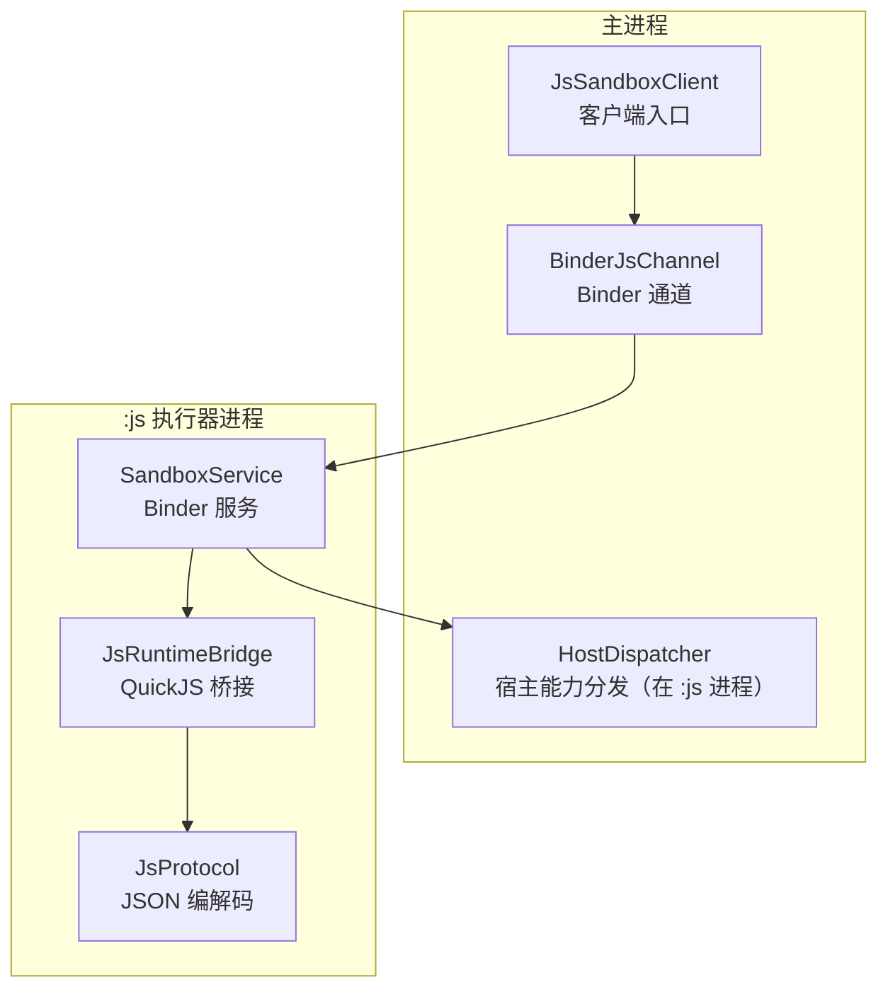
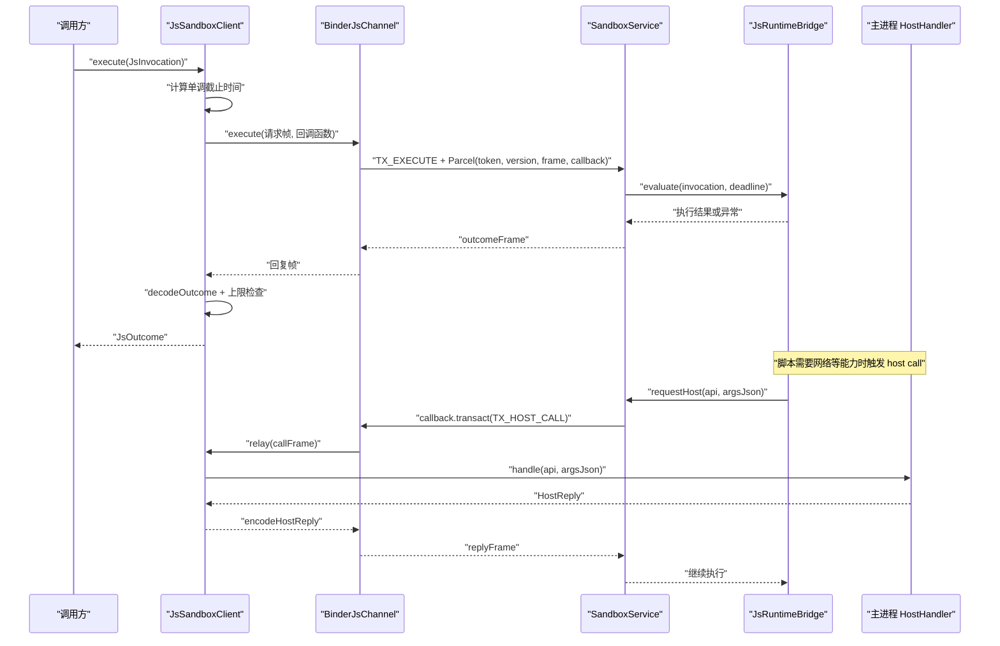
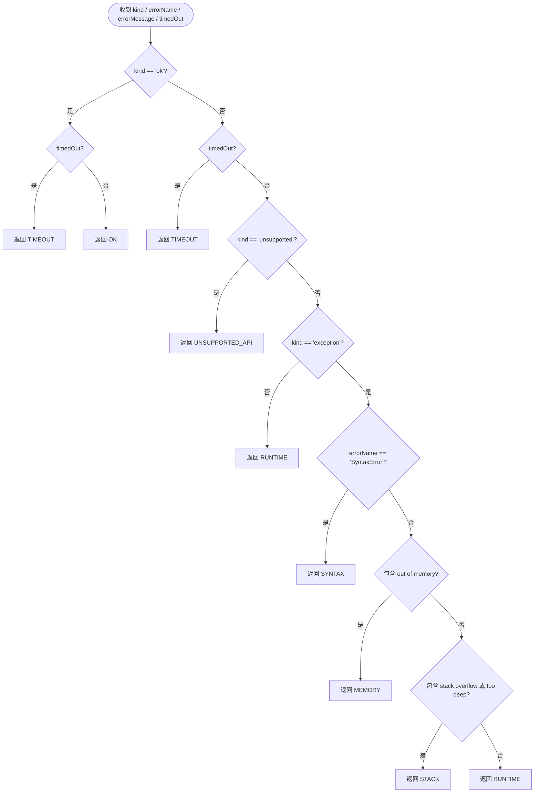
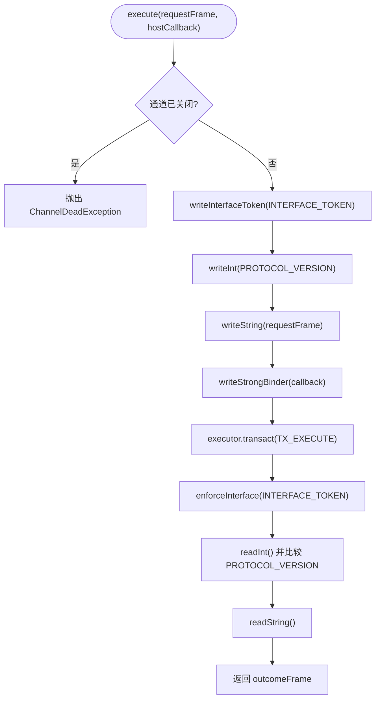
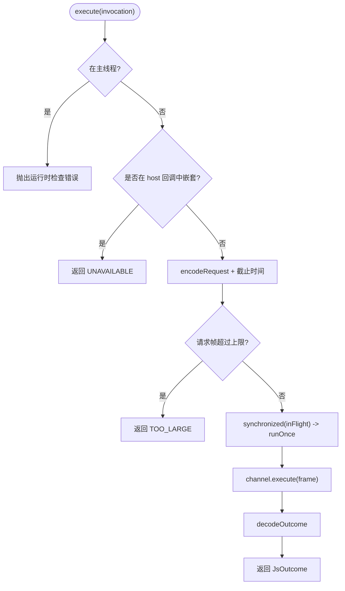
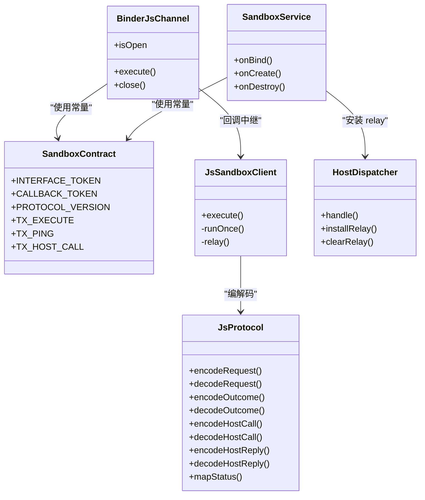

# 协议规范

<cite>
**本文引用的文件**   
- [JsProtocol.kt](file://lib_book_source/src/main/java/com/ebook/source/sandbox/JsProtocol.kt)
- [SandboxContract.kt](file://lib_book_source/src/main/java/com/ebook/source/sandbox/SandboxContract.kt)
- [BinderJsChannel.kt](file://lib_book_source/src/main/java/com/ebook/source/sandbox/BinderJsChannel.kt)
- [HostDispatcher.kt](file://lib_book_source/src/main/java/com/ebook/source/sandbox/HostDispatcher.kt)
- [SandboxService.kt](file://lib_book_source/src/main/java/com/ebook/source/sandbox/SandboxService.kt)
- [JsSandboxClient.kt](file://lib_book_source/src/main/java/com/ebook/source/sandbox/JsSandboxClient.kt)
- [QuickJsPrelude.kt](file://lib_book_source/src/main/java/com/ebook/source/sandbox/QuickJsPrelude.kt)
- [JsProtocolTest.kt](file://lib_book_source/src/test/java/com/ebook/source/sandbox/JsProtocolTest.kt)
</cite>

## 目录
1. [引言](#引言)
2. [项目结构](#项目结构)
3. [核心组件](#核心组件)
4. [架构总览](#架构总览)
5. [详细组件分析](#详细组件分析)
6. [依赖关系分析](#依赖关系分析)
7. [性能与安全特性](#性能与安全特性)
8. [错误处理协议](#错误处理协议)
9. [协议版本与兼容性](#协议版本与兼容性)
10. [测试用例与调试指南](#测试用例与调试指南)
11. [扩展建议与最佳实践](#扩展建议与最佳实践)
12. [结论](#结论)

## 引言
本文面向沙箱通信协议，重点说明主进程与 `:js` 执行器之间的 Binder 双向协议、帧格式、编解码方法、事务码和标识符、错误语义、版本策略以及调试与排错方法。读者不需要了解 Android Binder 内部细节也能理解数据如何从脚本进入内核、又如何返回结果；但为了准确描述边界，文档会同时给出 Kotlin 侧实现与 Parcel 写入顺序的对应关系。

## 项目结构
协议相关代码集中在 `lib_book_source` 模块的沙箱子包中：

**图示来源**
- [JsSandboxClient.kt:1-185](file://lib_book_source/src/main/java/com/ebook/source/sandbox/JsSandboxClient.kt#L1-L185)
- [BinderJsChannel.kt:1-132](file://lib_book_source/src/main/java/com/ebook/source/sandbox/BinderJsChannel.kt#L1-L132)
- [SandboxService.kt:1-210](file://lib_book_source/src/main/java/com/ebook/source/sandbox/SandboxService.kt#L1-L210)
- [HostDispatcher.kt:1-74](file://lib_book_source/src/main/java/com/ebook/source/sandbox/HostDispatcher.kt#L1-L74)
- [JsProtocol.kt:1-281](file://lib_book_source/src/main/java/com/ebook/source/sandbox/JsProtocol.kt#L1-L281)

**章节来源**
- [JsSandboxClient.kt:1-185](file://lib_book_source/src/main/java/com/ebook/source/sandbox/JsSandboxClient.kt#L1-L185)
- [SandboxService.kt:1-210](file://lib_book_source/src/main/java/com/ebook/source/sandbox/SandboxService.kt#L1-L210)

## 核心组件
| 组件 | 职责 | 关键输入 | 关键输出 |
|---|---|---|---|
| `JsProtocol` | JSON 请求/响应帧、host 调用帧的编解码与状态归类 | 字符串帧、领域对象 | 字符串帧、领域对象、状态枚举 |
| `SandboxContract` | 定义接口 token、协议版本、事务码 | 无 | 常量 |
| `BinderJsChannel` | 把请求帧按 Parcel 顺序写入，并读取执行器回复 | 请求帧字符串、回调函数 | 回复帧字符串或通道异常 |
| `SandboxService` | 接收 Binder 事务、校验 token 与版本、调度执行或探活 | Parcel | Parcel 回复帧 |
| `HostDispatcher` | 在 `:js` 进程内根据 API 名分发计算或回主进程能力 | API 名、参数 JSON 串 | host 回复 JSON 帧 |
| `JsSandboxClient` | 客户端入口、超时死线、重连重放、host 回调中继 | `JsInvocation` | `JsOutcome` |
| `QuickJsPrelude` | 沙箱全局 JS 垫片、能力白名单、绑定装配 | QuickJS runtime | 可执行的预置脚本 |

**章节来源**
- [JsProtocol.kt:1-281](file://lib_book_source/src/main/java/com/ebook/source/sandbox/JsProtocol.kt#L1-L281)
- [SandboxContract.kt:1-47](file://lib_book_source/src/main/java/com/ebook/source/sandbox/SandboxContract.kt#L1-L47)
- [BinderJsChannel.kt:1-132](file://lib_book_source/src/main/java/com/ebook/source/sandbox/BinderJsChannel.kt#L1-L132)
- [SandboxService.kt:1-210](file://lib_book_source/src/main/java/com/ebook/source/sandbox/SandboxService.kt#L1-L210)
- [HostDispatcher.kt:1-74](file://lib_book_source/src/main/java/com/ebook/source/sandbox/HostDispatcher.kt#L1-L74)
- [JsSandboxClient.kt:1-185](file://lib_book_source/src/main/java/com/ebook/source/sandbox/JsSandboxClient.kt#L1-L185)
- [QuickJsPrelude.kt:1-256](file://lib_book_source/src/main/java/com/ebook/source/sandbox/QuickJsPrelude.kt#L1-L256)

## 架构总览
沙箱通信由两个方向组成：

1. **主进程 → 执行器**：通过 `BinderJsChannel.execute` 发送 `TX_EXECUTE`，Parcel 写入接口标识、协议版本、请求帧、回调 binder。
2. **执行器 → 主进程**：执行器通过同一个 Binder 对象的反向回调接口 `CALLBACK_TOKEN` 发起 `TX_HOST_CALL`，主进程通过 `HostCallbackBinder` 中继到 `JsSandboxClient.relay`。

**图示来源**
- [JsSandboxClient.kt:1-185](file://lib_book_source/src/main/java/com/ebook/source/sandbox/JsSandboxClient.kt#L1-L185)
- [BinderJsChannel.kt:1-132](file://lib_book_source/src/main/java/com/ebook/source/sandbox/BinderJsChannel.kt#L1-L132)
- [SandboxService.kt:1-210](file://lib_book_source/src/main/java/com/ebook/source/sandbox/SandboxService.kt#L1-L210)

## 详细组件分析

### JsProtocol：JSON 编解码与状态映射
`JsProtocol` 是跨进程 JSON 契约的唯一实现点。它封装了四种核心编解码方法：

| 方法 | 输入 | 输出 | 语义 |
|---|---|---|---|
| `encodeRequest` | `JsInvocation`、单调毫秒截止时间 | JSON 字符串 | 打包执行模式、脚本源码、绑定变量、截止时间 |
| `decodeRequest` | JSON 字符串 | `DecodedRequest` | 校验模式名、解析绑定、携带截止时间 |
| `encodeOutcome` | `JsOutcome` | JSON 字符串 | 打包状态、可选数据、可选错误消息 |
| `decodeOutcome` | JSON 字符串、`JsLimits` | `JsOutcome` | 先判 UTF-8 字节上限，再解 JSON，最后映射状态 |
| `encodeHostCall` | API 名、参数 JSON 字符串 | JSON 字符串 | 打包一次 host 调用 |
| `decodeHostCall` | JSON 字符串 | `(api, args)` | 取出 API 名与未解析的参数串 |
| `encodeHostReply` | 是否成功、可选数据、可选错误 | JSON 字符串 | 打包 host 调用回复 |
| `decodeHostReply` | JSON 字符串 | `HostReply` | 转为主进程领域类型 |

#### 请求帧字段
| 字段 | 类型 | 说明 |
|---|---|---|
| `mode` | 字符串 | 执行模式枚举名，如 `SEGMENT`、`EXPRESSION`、`URL_OPTION`、`BODY_JS`、`INIT` |
| `source` | 字符串 | 要执行的 JavaScript 源码 |
| `bindings` | 键值对象 | 键为变量名，值为字符串或 null；null 表示该量不可用 |
| `deadline` | 数字 | 单调时钟毫秒，来自 `SystemClock.elapsedRealtime()` |

#### 响应帧字段
| 字段 | 类型 | 说明 |
|---|---|---|
| `status` | 字符串 | 状态名，映射到 `JsStatus` |
| `data` | JSON 元素或空 | 成功时的完成值 JSON；失败时为 null |
| `error` | 字符串或空 | 失败时的人类可读错误；成功时为 null |

#### 状态映射规则
`mapStatus` 的判定顺序很重要：

1. 如果结果是“已拿到”且已超时，仍归为 `TIMEOUT`。
2. 正常完成为 `OK`。
3. 中断标志为真时归为 `TIMEOUT`。
4. `unsupported` 归为 `UNSUPPORTED_API`。
5. `exception` 下按错误名和消息区分：
   - `SyntaxError` → `SYNTAX`
   - 包含内存溢出关键字 → `MEMORY`
   - 包含栈溢出或递归太深关键字 → `STACK`
   - 其他 → `RUNTIME`
6. 未知 `kind` 一律按 `RUNTIME`，绝不折叠成 `OK`。
7. 响应帧中的未知状态名也按 `RUNTIME`，防止对端新增状态时把失败说成成功。

**图示来源**
- [JsProtocol.kt:1-281](file://lib_book_source/src/main/java/com/ebook/source/sandbox/JsProtocol.kt#L1-L281)

**章节来源**
- [JsProtocol.kt:1-281](file://lib_book_source/src/main/java/com/ebook/source/sandbox/JsProtocol.kt#L1-L281)
- [JsProtocolTest.kt:1-189](file://lib_book_source/src/test/java/com/ebook/source/sandbox/JsProtocolTest.kt#L1-L189)

### SandboxContract：接口标识、版本与事务码
`SandboxContract` 是线上形态的唯一事实源，避免 AIDL 生成代码带来的审计缝隙。

| 常量 | 值 | 含义 |
|---|---|---|
| `INTERFACE_TOKEN` | `"com.ebook.source.sandbox.IJsExecutor"` | 主进程到执行器的接口标识 |
| `CALLBACK_TOKEN` | `"com.ebook.source.sandbox.IHostCallback"` | 执行器到主进程的反向接口标识 |
| `PROTOCOL_VERSION` | `1` | Parcel 布局版本号，不兼容时直接拒绝 |
| `TX_EXECUTE` | `1` | 执行一次 JS 求值 |
| `TX_PING` | `2` | 探活，只验证 token 与版本，不建 runtime |
| `TX_HOST_CALL` | `1` | 执行器主动发起 host 调用，属于 `CALLBACK_TOKEN` 空间 |

#### Parcel 写入顺序
- **主进程 → 执行器 `TX_EXECUTE`**：token、version、requestFrame、host 回调 binder。
- **执行器 → 主进程 `TX_EXECUTE` 回复**：token、version、outcomeFrame。
- **执行器 → 主进程 `TX_HOST_CALL`**：token、version、callFrame。
- **主进程 → 执行器 `TX_HOST_CALL` 回复**：token、version、replyFrame。
- **`TX_PING`**：单向事务，回复只写 token、version、ready 位。

**章节来源**
- [SandboxContract.kt:1-47](file://lib_book_source/src/main/java/com/ebook/source/sandbox/SandboxContract.kt#L1-L47)
- [BinderJsChannel.kt:1-132](file://lib_book_source/src/main/java/com/ebook/source/sandbox/BinderJsChannel.kt#L1-L132)
- [SandboxService.kt:1-210](file://lib_book_source/src/main/java/com/ebook/source/sandbox/SandboxService.kt#L1-L210)

### BinderJsChannel：Binder 通道与帧读写
`BinderJsChannel` 负责把 JSON 帧包装进 Parcel，并在读取时做严格校验。

- 写顺序：接口标识、协议版本、请求帧、回调 binder。
- 读顺序：接口标识、协议版本、回复帧。
- 传输层异常统一转为 `ChannelDeadException`，用于触发重连。
- 帧形态异常转为 `SandboxProtocolException`，表示两侧代码不同步，不应重连掩盖根因。
- 每次 `execute` 新建回调 binder，避免多次执行复用导致回调账本污染。

**图示来源**
- [BinderJsChannel.kt:1-132](file://lib_book_source/src/main/java/com/ebook/source/sandbox/BinderJsChannel.kt#L1-L132)

**章节来源**
- [BinderJsChannel.kt:1-132](file://lib_book_source/src/main/java/com/ebook/source/sandbox/BinderJsChannel.kt#L1-L132)

### HostDispatcher：宿主能力分发
`HostDispatcher` 是 `:js` 进程中脚本能力的唯一入口。它有两个重要特点：

1. 能力白名单第二次校验发生在 Kotlin 侧，而不是 C++ 侧，因此修改能力表不需要重新编译 `.so`。
2. `handle` 方法签名被 C++ 层以字符串常量引用，必须保持 `@JvmStatic`、名称不变、不被 R8 改名。

分发逻辑：

| API 目标 | 行为 |
|---|---|
| `COMPUTE` | 就地计算，例如哈希、编码、时间格式化 |
| `HOST` | 通过已安装的 relay 回调回到主进程，例如网络请求、变量存取 |

若 API 不在白名单中，或主机 relay 尚未安装，返回 `ok=false` 的错误帧。

**章节来源**
- [HostDispatcher.kt:1-74](file://lib_book_source/src/main/java/com/ebook/source/sandbox/HostDispatcher.kt#L1-L74)

### SandboxService：执行器服务
`SandboxService` 是 `:js` 进程中的薄层服务，只做三件事：

1. 读取 Parcel。
2. 把判断结果写回 Parcel。
3. 把 host 调用中继给主进程。

它的关键安全行为包括：

- 只在自己的隔离进程中提供 Binder。
- 先校验接口标识和协议版本，再读帧体。
- `TX_PING` 不创建 runtime，仅返回桥接层就绪位。
- `onCreate` 安装 host relay，`onDestroy` 清理。

**章节来源**
- [SandboxService.kt:1-210](file://lib_book_source/src/main/java/com/ebook/source/sandbox/SandboxService.kt#L1-L210)

### JsSandboxClient：客户端入口与重放策略
`JsSandboxClient` 是主进程访问沙箱的统一入口，承担：

- 计算单调截止时间。
- 阻止主线程阻塞执行。
- 串行化执行，避免多个源并发抢一个 runtime。
- 中继 host 回调。
- 断连后最多重放一次，但如果本次已经转发过 host 回调，则不再重放，防止重复副作用。

**图示来源**
- [JsSandboxClient.kt:1-185](file://lib_book_source/src/main/java/com/ebook/source/sandbox/JsSandboxClient.kt#L1-L185)

**章节来源**
- [JsSandboxClient.kt:1-185](file://lib_book_source/src/main/java/com/ebook/source/sandbox/JsSandboxClient.kt#L1-L185)

### QuickJsPrelude：沙箱 JS 环境
`QuickJsPrelude` 定义了脚本可见的全局对象与方法：

- `java.*` 白名单能力。
- `source`、`book`、`chapter` 三个对象面。
- 顶层摘要别名。
- 每次执行前注入 `__bindings`。
- 明确不支持的能力会抛出带前缀的错误，便于上层识别为 `UNSUPPORTED_API`。

**章节来源**
- [QuickJsPrelude.kt:1-256](file://lib_book_source/src/main/java/com/ebook/source/sandbox/QuickJsPrelude.kt#L1-L256)

## 依赖关系分析
协议相关类的依赖如下：

**图示来源**
- [JsProtocol.kt:1-281](file://lib_book_source/src/main/java/com/ebook/source/sandbox/JsProtocol.kt#L1-L281)
- [SandboxContract.kt:1-47](file://lib_book_source/src/main/java/com/ebook/source/sandbox/SandboxContract.kt#L1-L47)
- [BinderJsChannel.kt:1-132](file://lib_book_source/src/main/java/com/ebook/source/sandbox/BinderJsChannel.kt#L1-L132)
- [SandboxService.kt:1-210](file://lib_book_source/src/main/java/com/ebook/source/sandbox/SandboxService.kt#L1-L210)
- [JsSandboxClient.kt:1-185](file://lib_book_source/src/main/java/com/ebook/source/sandbox/JsSandboxClient.kt#L1-L185)
- [HostDispatcher.kt:1-74](file://lib_book_source/src/main/java/com/ebook/source/sandbox/HostDispatcher.kt#L1-L74)

**章节来源**
- [JsProtocol.kt:1-281](file://lib_book_source/src/main/java/com/ebook/source/sandbox/JsProtocol.kt#L1-L281)
- [BinderJsChannel.kt:1-132](file://lib_book_source/src/main/java/com/ebook/source/sandbox/BinderJsChannel.kt#L1-L132)
- [SandboxService.kt:1-210](file://lib_book_source/src/main/java/com/ebook/source/sandbox/SandboxService.kt#L1-L210)
- [JsSandboxClient.kt:1-185](file://lib_book_source/src/main/java/com/ebook/source/sandbox/JsSandboxClient.kt#L1-L185)
- [HostDispatcher.kt:1-74](file://lib_book_source/src/main/java/com/ebook/source/sandbox/HostDispatcher.kt#L1-L74)

## 性能与安全特性
协议在性能和安全上做了以下设计：

| 关注点 | 实现方式 |
|---|---|
| 超时计时 | 使用 `SystemClock.elapsedRealtime()`，跨进程可比，避免墙钟漂移 |
| 请求大小限制 | 客户端在编码后按 UTF-8 字节数检查，超限返回 `TOO_LARGE` |
| 响应大小限制 | 解码前先算 UTF-8 长度，避免先把超大字符串装入内存 |
| host 回复大小限制 | 客户端中继时再次检查，防止主进程返回过大内容 |
| 零分配长度计算 | `utf8Length` 逐码点累加，不构造中间字节数组 |
| 严格 JSON 解码 | `ignoreUnknownKeys = false`，未知字段直接失败 |
| 未知模式名拒绝 | 不折叠为默认模式，避免误执行 |
| 未知状态名拒绝 | 不折叠为 `OK`，避免把失败当没有结果 |
| Binder token 校验 | 两端各自 enforce 自己的 token，传错 binder 当场拒绝 |
| 协议版本校验 | 版本不一致时直接报不可用或协议不合 |
| 主线程保护 | 禁止主线程阻塞执行，避免 ANR |
| 回调重入保护 | 不允许 host 回调里再次发起沙箱执行 |
| 执行串行化 | 同一执行器进程只有一个 runtime，并发排队更安全 |

**章节来源**
- [JsProtocol.kt:1-281](file://lib_book_source/src/main/java/com/ebook/source/sandbox/JsProtocol.kt#L1-L281)
- [JsSandboxClient.kt:1-185](file://lib_book_source/src/main/java/com/ebook/source/sandbox/JsSandboxClient.kt#L1-L185)
- [BinderJsChannel.kt:1-132](file://lib_book_source/src/main/java/com/ebook/source/sandbox/BinderJsChannel.kt#L1-L132)
- [SandboxService.kt:1-210](file://lib_book_source/src/main/java/com/ebook/source/sandbox/SandboxService.kt#L1-L210)

## 错误处理协议
`JsStatus` 是脚本完成结果的成功/失败分类：

| 状态 | 含义 | 典型原因 |
|---|---|---|
| `OK` | 成功 | 脚本正常完成，`data` 可能为空也可能有 JSON 值 |
| `TIMEOUT` | 超时 | 单调截止时间已到，或被中断器终止 |
| `MEMORY` | 内存超限 | QuickJS 报出内存不足 |
| `STACK` | 栈溢出 | 递归太深或调用栈溢出 |
| `SYNTAX` | 语法错误 | `SyntaxError` |
| `RUNTIME` | 运行时错误 | 其他 JS 运行时异常 |
| `UNSUPPORTED_API` | 不支持的 API | 脚本调用了白名单外的能力 |
| `TOO_LARGE` | 报文过大 | 请求或响应超过 UTF-8 字节上限 |
| `UNAVAILABLE` | 不可用 | 执行器未连接、断开、加载失败、版本不合 |

#### `error` 字段语义
- 成功帧中 `error` 为 null。
- 失败帧中 `error` 通常为非空人类可读消息。
- `text` 属性只在 `data` 是 JSON 标量时取字面文本；对象和数组不会隐式转字符串。

#### 常见错误路径
- 未知模式名 → 协议异常。
- 未知状态名 → `RUNTIME`。
- 未知 API 名 → host 回复失败。
- host 回调中继失败 → 包裹错误并返回 `ok=false`。
- 通道死亡 → 客户端重连并重放一次；若已有副作用则放弃重放。

**章节来源**
- [JsProtocol.kt:1-281](file://lib_book_source/src/main/java/com/ebook/source/sandbox/JsProtocol.kt#L1-L281)
- [JsSandboxClient.kt:1-185](file://lib_book_source/src/main/java/com/ebook/source/sandbox/JsSandboxClient.kt#L1-L185)
- [HostDispatcher.kt:1-74](file://lib_book_source/src/main/java/com/ebook/source/sandbox/HostDispatcher.kt#L1-L74)
- [JsProtocolTest.kt:1-189](file://lib_book_source/src/test/java/com/ebook/source/sandbox/JsProtocolTest.kt#L1-L189)

## 协议版本与兼容性
当前协议版本为 `1`，由 `SandboxContract.PROTOCOL_VERSION` 统一管理。

兼容性规则：

1. **Parcel 布局变化**：版本号递增，两侧不一致直接拒绝。
2. **JSON 字段未知**：启用严格解码，未知字段视为协议失败。
3. **未知枚举名**：
   - 模式名未知 → 协议异常。
   - 状态名未知 → 归为 `RUNTIME`，不折叠为成功。
4. **向后兼容**：当前实现偏向“读不懂就拒绝”，而不是猜测对方字段顺序。
5. **向前兼容**：如果未来增加新状态或新模式，旧端应拒绝而非降级。
6. **版本探测**：`TX_PING` 可用于区分“服务不存在”和“服务存在但桥接层未就绪”。

**章节来源**
- [SandboxContract.kt:1-47](file://lib_book_source/src/main/java/com/ebook/source/sandbox/SandboxContract.kt#L1-L47)
- [SandboxService.kt:1-210](file://lib_book_source/src/main/java/com/ebook/source/sandbox/SandboxService.kt#L1-L210)
- [JsProtocol.kt:1-281](file://lib_book_source/src/main/java/com/ebook/source/sandbox/JsProtocol.kt#L1-L281)

## 测试用例与调试指南

### 协议测试要点
`JsProtocolTest` 覆盖了协议往返、失败归类、UTF-8 长度、host 调用帧、异常类型等关键路径：

- 请求帧往返保留模式、脚本、绑定，null 绑定表示不可用。
- 成功响应带 JSON 数据时原样解码，不带数据时 data 为 null。
- 标量完成值能转文本，对象完成值按没有值处理。
- 超时、内存、栈、语法、运行时状态正确归类。
- 未知状态名不折叠成成功。
- 响应帧超限时立即返回 `TOO_LARGE`。
- UTF-8 长度按字节计算，不是字符数。
- host 调用帧和回复帧往返正确。
- 非法 JSON 绑定返回类型化协议异常，不抛未类型化异常。
- 未知执行模式名返回协议异常。

**章节来源**
- [JsProtocolTest.kt:1-189](file://lib_book_source/src/test/java/com/ebook/source/sandbox/JsProtocolTest.kt#L1-L189)

### 调试建议
1. **确认进程隔离**：`SandboxService.onBind` 在非隔离进程返回 null，避免脚本运行在不安全环境中。
2. **检查 Binder token**：接口标识不符会直接拒绝，常用于排查“递错了 binder”。
3. **检查协议版本**：版本不合时服务侧记录日志并返回不可用。
4. **查看 host 回调日志**：`HostCallbackBinder` 对 token 和版本不匹配会记录警告。
5. **区分通道异常与协议异常**：
   - `ChannelDeadException` → 可重连。
   - `SandboxProtocolException` → 两侧构建不一致，不能靠重连修复。
6. **监控 UTF-8 帧大小**：使用 `utf8Length` 口径统一检查请求、响应、host 回复。
7. **观察单调截止时间**：确保主进程和执行器都基于 `elapsedRealtime()`。

**章节来源**
- [SandboxService.kt:1-210](file://lib_book_source/src/main/java/com/ebook/source/sandbox/SandboxService.kt#L1-L210)
- [BinderJsChannel.kt:1-132](file://lib_book_source/src/main/java/com/ebook/source/sandbox/BinderJsChannel.kt#L1-L132)
- [JsSandboxClient.kt:1-185](file://lib_book_source/src/main/java/com/ebook/source/sandbox/JsSandboxClient.kt#L1-L185)
- [JsProtocol.kt:1-281](file://lib_book_source/src/main/java/com/ebook/source/sandbox/JsProtocol.kt#L1-L281)

## 扩展建议与最佳实践
1. **新增状态时**：
   - 在 `JsStatus` 中添加新枚举。
   - 更新 `mapStatus` 和 `decodeOutcome` 的映射。
   - 补充测试，保证未知状态不折叠为成功。
2. **新增执行模式时**：
   - 在 `JsMode` 中添加枚举。
   - 更新 `parseMode`。
   - 补充测试，保证未知模式返回协议异常。
3. **新增 host API 时**：
   - 在能力表中登记 API 名、元数和目标。
   - 在 `QuickJsPrelude` 中暴露 JS 调用入口。
   - 在 `HostDispatcher` 中实现分发。
4. **变更 Parcel 布局时**：
   - 同步更新 `SandboxContract.PROTOCOL_VERSION`。
   - 严格校验 token、version、frame 顺序。
   - 增加版本差异测试。
5. **控制数据规模**：
   - 始终使用 `utf8Length` 判断 UTF-8 字节数。
   - 对请求、响应、host 回复分别设置上限。
   - 避免在错误消息中输出过长原始数据。
6. **保持安全性**：
   - 不信任对端帧。
   - 不假设枚举名稳定。
   - 不在 JNI 边界外抛未捕获异常。
   - 不在主线程执行耗时操作。
   - 不重复执行有副作用的 host 调用。

**章节来源**
- [JsProtocol.kt:1-281](file://lib_book_source/src/main/java/com/ebook/source/sandbox/JsProtocol.kt#L1-L281)
- [SandboxContract.kt:1-47](file://lib_book_source/src/main/java/com/ebook/source/sandbox/SandboxContract.kt#L1-L47)
- [HostDispatcher.kt:1-74](file://lib_book_source/src/main/java/com/ebook/source/sandbox/HostDispatcher.kt#L1-L74)
- [QuickJsPrelude.kt:1-256](file://lib_book_source/src/main/java/com/ebook/source/sandbox/QuickJsPrelude.kt#L1-L256)
- [JsSandboxClient.kt:1-185](file://lib_book_source/src/main/java/com/ebook/source/sandbox/JsSandboxClient.kt#L1-L185)

## 结论
沙箱通信协议以 `SandboxContract` 为单一事实源，以 `JsProtocol` 为 JSON 契约实现，以 `BinderJsChannel` 和 `SandboxService` 为 Binder 传输层，以 `JsSandboxClient` 为客户端入口，以 `HostDispatcher` 为宿主能力分发点。协议强调严格校验、显式错误、单调时钟、UTF-8 字节计数和进程隔离，从而在不可信脚本与可信宿主之间建立清晰边界。扩展时应优先维护兼容性、安全性和可观测性，而不是追求更多隐藏约定。