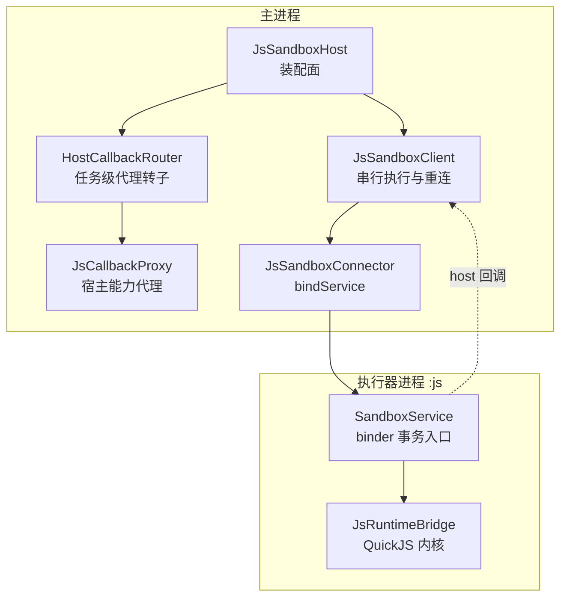
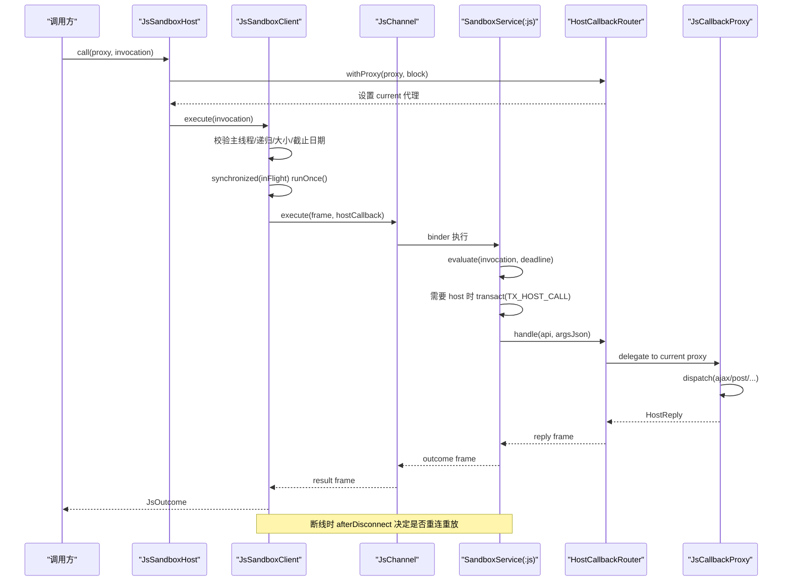
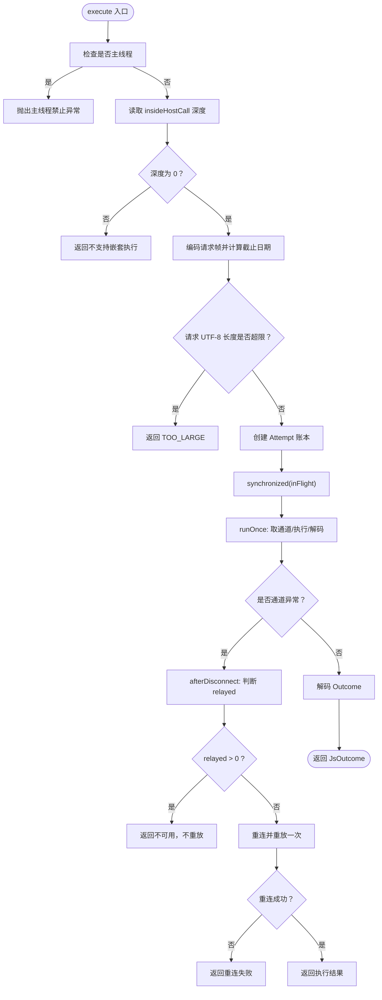
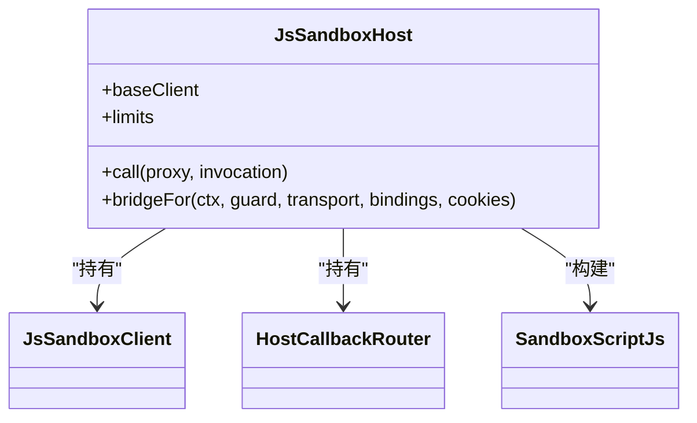
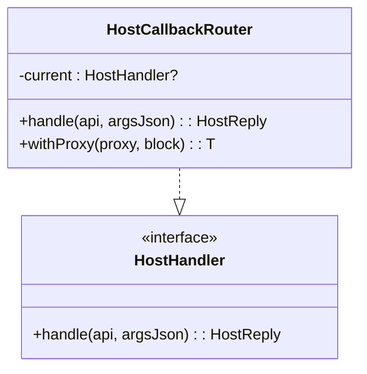
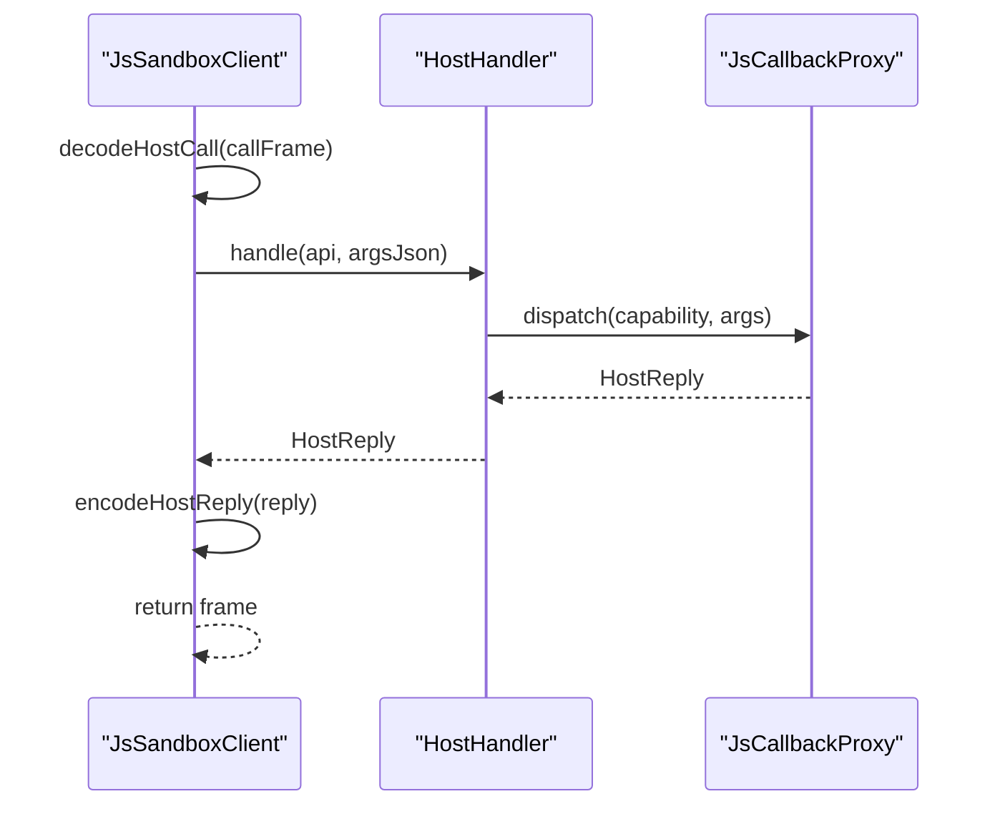
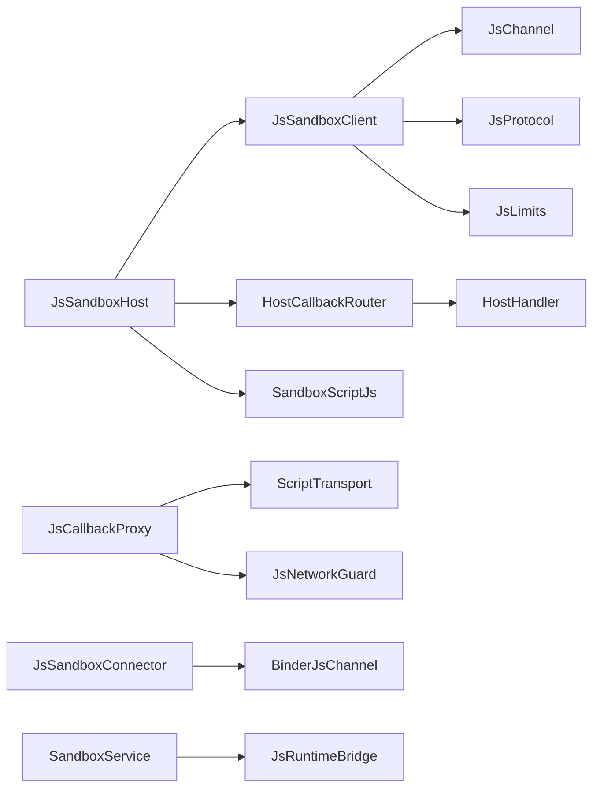

# 客户端-主机模式

<cite>
**本文引用的文件**   
- [JsSandboxClient.kt](file://lib_book_source/src/main/java/com/ebook/source/sandbox/JsSandboxClient.kt)
- [JsSandboxHost.kt](file://lib_book_source/src/main/java/com/ebook/source/sandbox/JsSandboxHost.kt)
- [JsCallbackProxy.kt](file://lib_book_source/src/main/java/com/ebook/source/sandbox/JsCallbackProxy.kt)
- [JsChannel.kt](file://lib_book_source/src/main/java/com/ebook/source/sandbox/JsChannel.kt)
- [JsProtocol.kt](file://lib_book_source/src/main/java/com/ebook/source/sandbox/JsProtocol.kt)
- [JsLimits.kt](file://lib_book_source/src/main/java/com/ebook/source/sandbox/JsLimits.kt)
- [JsSandboxConnector.kt](file://lib_book_source/src/main/java/com/ebook/source/sandbox/JsSandboxConnector.kt)
- [SandboxService.kt](file://lib_book_source/src/main/java/com/ebook/source/sandbox/SandboxService.kt)
</cite>

## 目录
1. [引言](#引言)
2. [项目结构](#项目结构)
3. [核心组件](#核心组件)
4. [架构总览](#架构总览)
5. [关键组件详解](#关键组件详解)
6. [依赖关系分析](#依赖关系分析)
7. [性能与资源限制](#性能与资源限制)
8. [故障排查指南](#故障排查指南)
9. [结论](#结论)

## 引言
本文件围绕“客户端-主机”通信模式，解释主进程侧沙箱客户端、主机装配面、任务级回调路由与处理器接口之间的协作。重点覆盖：
- `JsSandboxClient` 的串行执行入口、`inFlight` 锁、`Attempt` 重试账本与断线重连策略。
- `JsSandboxHost` 的生命周期与桥接器装配职责。
- `HostCallbackRouter` 的任务级代理路由机制，确保多个并发脚本任务的回调正确分发。
- `HostHandler` 接口设计与回调生命周期，包括 `withProxy` 自动注册注销模式。
- 线程安全保证：主线程保护、递归调用检测、ThreadLocal 深度计数。
- 错误处理策略、性能监控指标和调试工具使用方法。

## 项目结构
沙箱通信相关代码集中在 `lib_book_source` 模块的 sandbox 包中，按职责分层：
- 协议层：`JsProtocol`、`JsLimits`，定义跨进程帧格式与资源上限。
- 通道层：`JsChannel`、`BinderJsChannel`（在 Binder 实现中）、`JsSandboxConnector`（负责 bindService）。
- 客户端层：`JsSandboxClient`，封装请求串行化、断线重连、host 回调中继。
- 主机装配层：`JsSandboxHost`，管理客户端生命周期、构造桥接器、绑定任务代理。
- 回调路由与代理：`HostCallbackRouter`、`JsCallbackProxy`，提供任务级回调转发与能力调度。
- 执行器服务：`SandboxService`，位于 `:js` 隔离进程，负责内核调用与 host 回传。

图示来源
- [JsSandboxHost.kt:1-60](file://lib_book_source/src/main/java/com/ebook/source/sandbox/JsSandboxHost.kt#L1-L60)
- [JsSandboxClient.kt:1-185](file://lib_book_source/src/main/java/com/ebook/source/sandbox/JsSandboxClient.kt#L1-L185)
- [JsCallbackProxy.kt:1-200](file://lib_book_source/src/main/java/com/ebook/source/sandbox/JsCallbackProxy.kt#L1-L200)
- [JsSandboxConnector.kt:1-142](file://lib_book_source/src/main/java/com/ebook/source/sandbox/JsSandboxConnector.kt#L1-L142)
- [SandboxService.kt:1-210](file://lib_book_source/src/main/java/com/ebook/source/sandbox/SandboxService.kt#L1-L210)

章节来源
- [JsSandboxHost.kt:1-60](file://lib_book_source/src/main/java/com/ebook/source/sandbox/JsSandboxHost.kt#L1-L60)
- [JsSandboxClient.kt:1-185](file://lib_book_source/src/main/java/com/ebook/source/sandbox/JsSandboxClient.kt#L1-L185)
- [JsCallbackProxy.kt:1-200](file://lib_book_source/src/main/java/com/ebook/source/sandbox/JsCallbackProxy.kt#L1-L200)
- [JsSandboxConnector.kt:1-142](file://lib_book_source/src/main/java/com/ebook/source/sandbox/JsSandboxConnector.kt#L1-L142)
- [SandboxService.kt:1-210](file://lib_book_source/src/main/java/com/ebook/source/sandbox/SandboxService.kt#L1-L210)

## 核心组件
- `JsSandboxClient`：主进程侧沙箱客户端，唯一执行入口为 `execute`；负责串行化、期限计算、host 回调中继、断线重连与不可用结果归因。
- `JsSandboxHost`：装配面，持有长命 `JsSandboxClient` 与短命 `HostCallbackRouter`，并提供 `bridgeFor` 构建脚本桥接对象。
- `HostCallbackRouter`：任务级代理转子，通过 `withProxy` 将当前任务代理注入到全局可查位置，保证回调只分发给正在执行的脚本任务。
- `JsCallbackProxy`：具体宿主能力代理，解析并调度 ajax/load/post/response_code/set_content/cookie_* 等能力，维护请求计数、嵌套深度、当前页面与 URL。
- `JsChannel`：抽象通道接口，屏蔽 binder/测试假通道差异；`HostHandler` 是主进程 host 调用处理器接口。
- `JsProtocol`：跨进程帧编解码与状态映射；`JsLimits`：统一资源与超时配置。
- `JsSandboxConnector`：负责 `bindService` 拉起 `:js` 进程，等待 binder，返回 `BinderJsChannel`。
- `SandboxService`：`:js` 进程服务，处理 execute/ping 事务，并通过 binder 把 host 调用同步转回主进程。

章节来源
- [JsSandboxClient.kt:1-185](file://lib_book_source/src/main/java/com/ebook/source/sandbox/JsSandboxClient.kt#L1-L185)
- [JsSandboxHost.kt:1-60](file://lib_book_source/src/main/java/com/ebook/source/sandbox/JsSandboxHost.kt#L1-L60)
- [JsCallbackProxy.kt:1-200](file://lib_book_source/src/main/java/com/ebook/source/sandbox/JsCallbackProxy.kt#L1-L200)
- [JsChannel.kt:1-37](file://lib_book_source/src/main/java/com/ebook/source/sandbox/JsChannel.kt#L1-L37)
- [JsProtocol.kt:1-200](file://lib_book_source/src/main/java/com/ebook/source/sandbox/JsProtocol.kt#L1-L200)
- [JsLimits.kt:1-58](file://lib_book_source/src/main/java/com/ebook/source/sandbox/JsLimits.kt#L1-L58)
- [JsSandboxConnector.kt:1-142](file://lib_book_source/src/main/java/com/ebook/source/sandbox/JsSandboxConnector.kt#L1-L142)
- [SandboxService.kt:1-210](file://lib_book_source/src/main/java/com/ebook/source/sandbox/SandboxService.kt#L1-L210)

## 架构总览
客户端-主机模式的调用序列如下：
- 上层通过 `JsSandboxHost.call` 包装一次任务代理，然后委托 `JsSandboxClient.execute`。
- `execute` 校验主线程、递归深度、请求大小，计算截止日期，进入 `synchronized(inFlight)` 执行 `runOnce`。
- `runOnce` 复用或新建 `JsChannel`，调用 `channel.execute` 并把 host 回调回调函数交给执行器。
- 执行器在 `:js` 进程执行脚本；若脚本发起 host 调用，则通过 binder 回传到主进程的 `HostCallbackRouter.handle`。
- `HostCallbackRouter` 查找当前任务的 `HostHandler`（通常是 `JsCallbackProxy`），由代理解析能力并执行。
- 代理完成处理后返回 `HostReply`，客户端编码成回复帧回给执行器。
- 执行器完成脚本执行后返回结果帧，客户端解码为 `JsOutcome`。
- 若通道异常断开，`afterDisconnect` 判断本次是否已有副作用；无副作用则重连并重放一次。

图示来源
- [JsSandboxHost.kt:1-60](file://lib_book_source/src/main/java/com/ebook/source/sandbox/JsSandboxHost.kt#L1-L60)
- [JsSandboxClient.kt:1-185](file://lib_book_source/src/main/java/com/ebook/source/sandbox/JsSandboxClient.kt#L1-L185)
- [SandboxService.kt:1-210](file://lib_book_source/src/main/java/com/ebook/source/sandbox/SandboxService.kt#L1-L210)
- [JsCallbackProxy.kt:1-200](file://lib_book_source/src/main/java/com/ebook/source/sandbox/JsCallbackProxy.kt#L1-L200)

## 关键组件详解

### JsSandboxClient：串行执行、重试账本与断线重连
- 串行化：`inFlight` 非重入锁确保同一时刻只有一个执行帧，从而保证：
  - 多源并发解析排队而不是互抢 runtime。
  - 同一时刻只有一帧在飞，满足 `maxRequestBytes` 的 binder 缓冲前提。
- 主线程保护：通过 Looper 实例比较拒绝在主线程执行，避免阻塞 UI。
- 递归调用检测：使用 ThreadLocal 的深度计数器 `insideHostCall`，防止 host 回调里再次发起 JS 执行导致双向死锁。
- 请求有效期：使用单调时钟 `SystemClock.elapsedRealtime()` 计算 `deadlineMonoMs`，避免系统时间回拨导致的时限失效。
- 请求大小限制：UTF-8 字节长度超过 `maxRequestBytes` 直接返回 `TOO_LARGE`。
- 断线重连与重放：
  - 捕获 `ChannelDeadException` 时先丢弃旧通道，再调用 `afterDisconnect`。
  - `Attempt.relayed` 记录本次已转发的 host 回调次数；若大于 0，说明有副作用，不再重放。
  - 若无副作用，尝试重连并重放一次；仍失败则返回 `UNAVAILABLE`。
- 未预期异常兜底：任何非协议异常被记录日志并转为 `UNAVAILABLE`，不抛出未类型化异常。

图示来源
- [JsSandboxClient.kt:1-185](file://lib_book_source/src/main/java/com/ebook/source/sandbox/JsSandboxClient.kt#L1-L185)
- [JsLimits.kt:1-58](file://lib_book_source/src/main/java/com/ebook/source/sandbox/JsLimits.kt#L1-L58)

章节来源
- [JsSandboxClient.kt:1-185](file://lib_book_source/src/main/java/com/ebook/source/sandbox/JsSandboxClient.kt#L1-L185)
- [JsLimits.kt:1-58](file://lib_book_source/src/main/java/com/ebook/source/sandbox/JsLimits.kt#L1-L58)

### JsSandboxHost：装配面与桥接器构建
- 生命周期管理：
  - 持有长命 `JsSandboxClient` 与任务级 `HostCallbackRouter`。
  - 每次 `call` 通过 `router.withProxy` 临时挂载代理，执行结束后自动移除。
- 桥接器构建：
  - `bridgeFor` 组装 `SandboxScriptJs`，传入 `executeTask`、上下文、网络守卫、传输层、静态绑定、会话罐与探测逻辑。
  - 强调 transport 必须是过守门的客户端，避免绕过 DNS 重绑防护。
  - cookies 与 transport 共用同一份 cookie jar，避免半截会话状态。

图示来源
- [JsSandboxHost.kt:1-60](file://lib_book_source/src/main/java/com/ebook/source/sandbox/JsSandboxHost.kt#L1-L60)

章节来源
- [JsSandboxHost.kt:1-60](file://lib_book_source/src/main/java/com/ebook/source/sandbox/JsSandboxHost.kt#L1-L60)

### HostCallbackRouter：任务级代理路由
- 作用：解决 `JsSandboxClient.hostHandler` 构造期固定与回调代理任务级状态之间的矛盾。
- 机制：
  - `current` 保存当前任务的 `HostHandler`。
  - `handle` 将 host 调用委派给当前代理；若无当前代理，返回“没有正在进行的脚本任务”。
  - `withProxy` 在块执行前检查 `current == null`，设置代理并在 finally 中清理，保证自动注册注销。
- 并发假设：同一时刻只有一个任务在飞，由 `JsSandboxClient.inFlight` 保证；否则需改为按调用身份分发表。

图示来源
- [JsCallbackProxy.kt:1-200](file://lib_book_source/src/main/java/com/ebook/source/sandbox/JsCallbackProxy.kt#L1-L200)
- [JsChannel.kt:1-37](file://lib_book_source/src/main/java/com/ebook/source/sandbox/JsChannel.kt#L1-L37)

章节来源
- [JsCallbackProxy.kt:1-200](file://lib_book_source/src/main/java/com/ebook/source/sandbox/JsCallbackProxy.kt#L1-L200)
- [JsChannel.kt:1-37](file://lib_book_source/src/main/java/com/ebook/source/sandbox/JsChannel.kt#L1-L37)

### HostHandler 接口设计与回调生命周期
- 接口契约：
  - `HostHandler.handle(api, argsJson)` 必须返回 `HostReply`，不得向外抛出未类型化异常。
  - 异常由客户端与代理两侧兜底，避免落在执行器 JNI 栈上导致 `:js` 进程崩溃。
- 生命周期：
  - 客户端收到 host 调用帧，解码 api 与参数，调用 `hostHandler.handle`。
  - 代理内部可能进行网络访问、内容设置、cookie 操作等，完成后返回 `HostReply`。
  - 客户端对回复进行 UTF-8 长度校验，超限则返回失败；否则编码为回复帧。
  - 回调期间更新 ThreadLocal 深度，结束时恢复，防止嵌套执行。

图示来源
- [JsSandboxClient.kt:1-185](file://lib_book_source/src/main/java/com/ebook/source/sandbox/JsSandboxClient.kt#L1-L185)
- [JsCallbackProxy.kt:1-200](file://lib_book_source/src/main/java/com/ebook/source/sandbox/JsCallbackProxy.kt#L1-L200)
- [JsChannel.kt:1-37](file://lib_book_source/src/main/java/com/ebook/source/sandbox/JsChannel.kt#L1-L37)

章节来源
- [JsSandboxClient.kt:1-185](file://lib_book_source/src/main/java/com/ebook/source/sandbox/JsSandboxClient.kt#L1-L185)
- [JsCallbackProxy.kt:1-200](file://lib_book_source/src/main/java/com/ebook/source/sandbox/JsCallbackProxy.kt#L1-L200)
- [JsChannel.kt:1-37](file://lib_book_source/src/main/java/com/ebook/source/sandbox/JsChannel.kt#L1-L37)

### 线程安全与递归保护
- 主线程保护：通过 Looper 实例比较拒绝在主线程执行，避免阻塞 UI。
- 递归保护：ThreadLocal 深度计数器 `insideHostCall`，防止 host 回调里再次发起 JS 执行导致双向死锁。
- 可见性：`Attempt.relayed` 与 `HostCallbackRouter.current` 等字段标注 `@Volatile`，因为读写发生在不同线程（binder 线程池与发起 execute 的线程）。
- 锁范围：`inFlight` 同时护住通道字段读写，不需要第二把锁。

章节来源
- [JsSandboxClient.kt:1-185](file://lib_book_source/src/main/java/com/ebook/source/sandbox/JsSandboxClient.kt#L1-L185)
- [JsCallbackProxy.kt:1-200](file://lib_book_source/src/main/java/com/ebook/source/sandbox/JsCallbackProxy.kt#L1-L200)

## 依赖关系分析
- `JsSandboxHost` 依赖 `JsSandboxClient`、`HostCallbackRouter`、`SandboxScriptJs`。
- `JsSandboxClient` 依赖 `JsChannel`、`JsProtocol`、`JsLimits`、`HostHandler`。
- `HostCallbackRouter` 依赖 `HostHandler`。
- `JsCallbackProxy` 依赖 `JsHostApi`、`ScriptTransport`、`EvalContext`、`JsNetworkGuard`、`SourceCookieJar` 等。
- `JsSandboxConnector` 依赖 Android `Context`、`ServiceConnection`、`BinderJsChannel`。
- `SandboxService` 依赖 `JsRuntimeBridge`、`JsProtocol`、`JsLimits`。

图示来源
- [JsSandboxHost.kt:1-60](file://lib_book_source/src/main/java/com/ebook/source/sandbox/JsSandboxHost.kt#L1-L60)
- [JsSandboxClient.kt:1-185](file://lib_book_source/src/main/java/com/ebook/source/sandbox/JsSandboxClient.kt#L1-L185)
- [JsCallbackProxy.kt:1-200](file://lib_book_source/src/main/java/com/ebook/source/sandbox/JsCallbackProxy.kt#L1-L200)
- [JsSandboxConnector.kt:1-142](file://lib_book_source/src/main/java/com/ebook/source/sandbox/JsSandboxConnector.kt#L1-L142)
- [SandboxService.kt:1-210](file://lib_book_source/src/main/java/com/ebook/source/sandbox/SandboxService.kt#L1-L210)

章节来源
- [JsSandboxHost.kt:1-60](file://lib_book_source/src/main/java/com/ebook/source/sandbox/JsSandboxHost.kt#L1-L60)
- [JsSandboxClient.kt:1-185](file://lib_book_source/src/main/java/com/ebook/source/sandbox/JsSandboxClient.kt#L1-L185)
- [JsCallbackProxy.kt:1-200](file://lib_book_source/src/main/java/com/ebook/source/sandbox/JsCallbackProxy.kt#L1-L200)
- [JsSandboxConnector.kt:1-142](file://lib_book_source/src/main/java/com/ebook/source/sandbox/JsSandboxConnector.kt#L1-L142)
- [SandboxService.kt:1-210](file://lib_book_source/src/main/java/com/ebook/source/sandbox/SandboxService.kt#L1-L210)

## 性能与资源限制
- 挂钟时限：`wallClockMs` 控制单次执行最长阻塞时间，避免死循环。
- 堆内存：`heapBytes` 限制 QuickJS 堆，防止指数分配。
- 栈深度：`stackBytes` 作为天花板，配合内核栈保护，避免 SIGSEGV。
- 报文上限：`maxRequestBytes`、`maxOutcomeBytes`、`maxHostReplyBytes` 均受 binder 事务缓冲约束，默认 900 KB，前提是同一时刻只有一帧在飞。
- 回调深度：`maxCallbackDepth` 防止规则嵌套脚本无限递归。
- 连接超时：`bindTimeoutMs` 控制等待 `:js` 进程连接的时长，避免冷启动长时间卡住。
- 请求计数：`maxRequestsPerTask` 限制单任务网络代理请求次数，防止 while(true) 式外呼。

章节来源
- [JsLimits.kt:1-58](file://lib_book_source/src/main/java/com/ebook/source/sandbox/JsLimits.kt#L1-L58)
- [JsSandboxClient.kt:1-185](file://lib_book_source/src/main/java/com/ebook/source/sandbox/JsSandboxClient.kt#L1-L185)

## 故障排查指南
- 主线程调用：会抛出明确的主线程禁止异常，症状是 ANR；应切换到后台线程执行。
- 嵌套执行：host 回调里再次发起 JS 执行会被拒绝，提示“不支持嵌套执行”；需重构逻辑避免双向死锁。
- 请求过大：UTF-8 长度超过 `maxRequestBytes` 返回 `TOO_LARGE`；检查绑定数据或响应体大小。
- 协议版本不合：服务端检测到版本不一致会返回 `UNAVAILABLE`；检查构建产物一致性。
- 通道死亡：捕获 `ChannelDeadException` 后，若本次无副作用则重连重放一次；若有副作用则放弃重放。
- 未预期异常：通道实现抛出的未类型化异常会被记录日志并转为 `UNAVAILABLE`；检查 Parcel 写失败或对端 SDK 异常。
- 回调处理失败：`HostHandler` 内部异常会被记录并返回 `ok=false`；检查代理实现与白名单判定。
- 连接超时：`bindTimeoutMs` 内未获得 binder 会抛出不可用异常；检查服务是否被禁用或进程未隔离。

章节来源
- [JsSandboxClient.kt:1-185](file://lib_book_source/src/main/java/com/ebook/source/sandbox/JsSandboxClient.kt#L1-L185)
- [SandboxService.kt:1-210](file://lib_book_source/src/main/java/com/ebook/source/sandbox/SandboxService.kt#L1-L210)
- [JsSandboxConnector.kt:1-142](file://lib_book_source/src/main/java/com/ebook/source/sandbox/JsSandboxConnector.kt#L1-L142)

## 结论
客户端-主机模式通过 `JsSandboxClient` 的串行执行与断线重连、`JsSandboxHost` 的装配与桥接、`HostCallbackRouter` 的任务级代理路由以及 `HostHandler` 的统一回调契约，实现了稳定、可诊断且安全的跨进程脚本执行。其线程安全依赖于主线程保护、递归深度检测与 ThreadLocal 状态，错误处理策略将未类型化异常转化为可命名的失败结果，便于上层分类处置。性能与资源限制集中在 `JsLimits`，确保在 binder 缓冲、堆、栈、回调深度与网络请求次数等方面均有明确边界。调试时应优先关注日志中的不可用原因、超时与大小超限信息，并结合异步线程模型定位死锁与竞态问题。