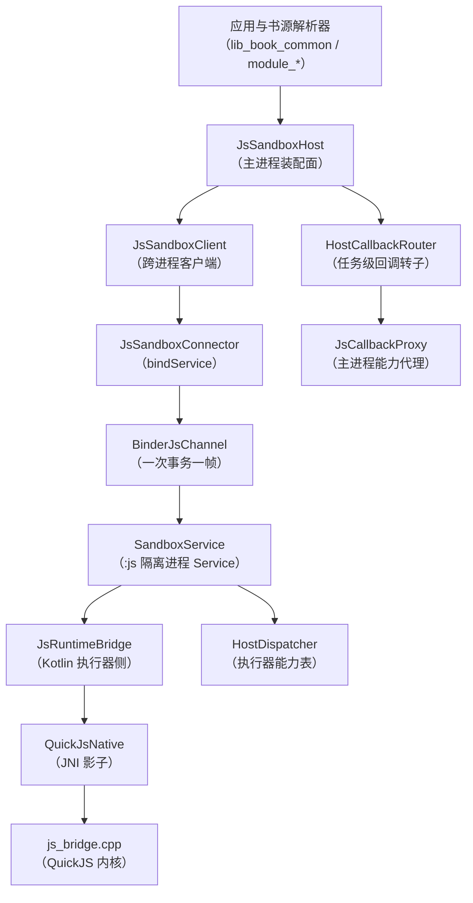
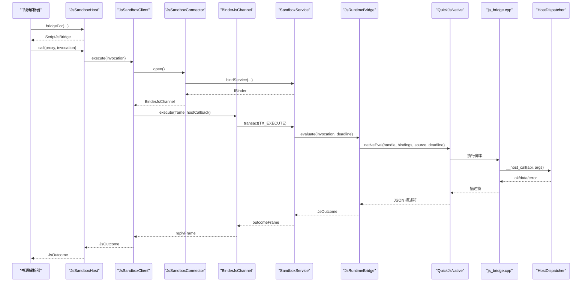
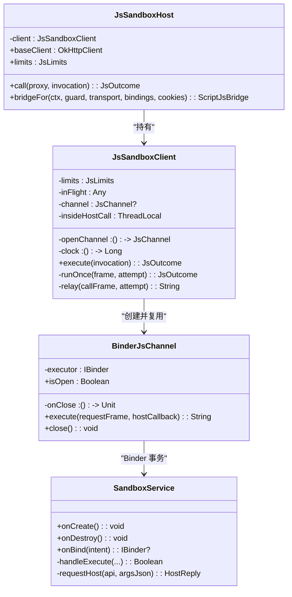
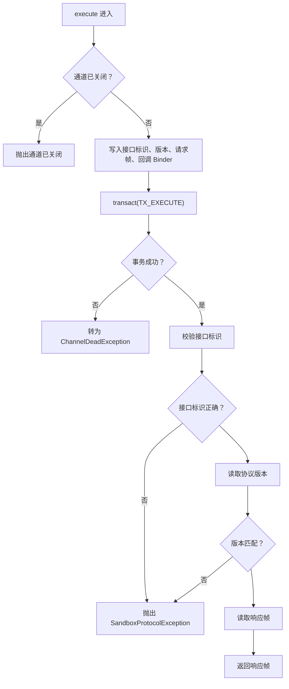
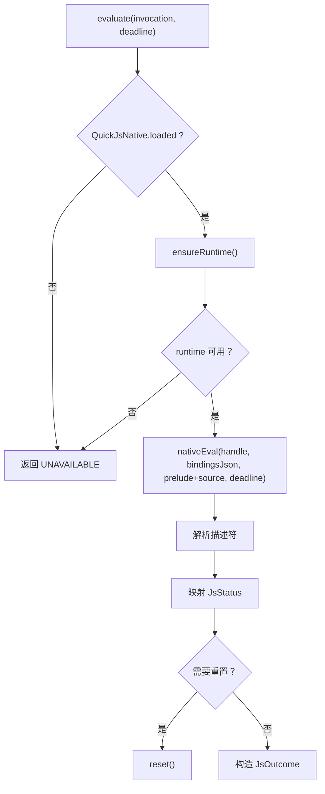
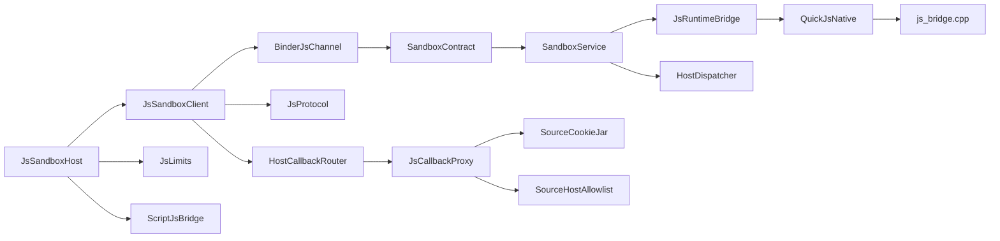

# JavaScript 沙箱系统

<cite>
**本文引用的文件**   
- [SandboxProcess.kt](file://lib_book_source/src/main/java/com/ebook/source/sandbox/SandboxProcess.kt)
- [JsSandboxHost.kt](file://lib_book_source/src/main/java/com/ebook/source/sandbox/JsSandboxHost.kt)
- [JsSandboxClient.kt](file://lib_book_source/src/main/java/com/ebook/source/sandbox/JsSandboxClient.kt)
- [BinderJsChannel.kt](file://lib_book_source/src/main/java/com/ebook/source/sandbox/BinderJsChannel.kt)
- [JsProtocol.kt](file://lib_book_source/src/main/java/com/ebook/source/sandbox/JsProtocol.kt)
- [JsLimits.kt](file://lib_book_source/src/main/java/com/ebook/source/sandbox/JsLimits.kt)
- [SourceCookieJar.kt](file://lib_book_source/src/main/java/com/ebook/source/sandbox/SourceCookieJar.kt)
- [SourceHostAllowlist.kt](file://lib_book_source/src/main/java/com/ebook/source/sandbox/SourceHostAllowlist.kt)
- [QuickJsNative.kt](file://lib_book_source/src/main/java/com/ebook/source/sandbox/QuickJsNative.kt)
- [QuickJsPrelude.kt](file://lib_book_source/src/main/java/com/ebook/source/sandbox/QuickJsPrelude.kt)
- [SandboxContract.kt](file://lib_book_source/src/main/java/com/ebook/source/sandbox/SandboxContract.kt)
- [SandboxService.kt](file://lib_book_source/src/main/java/com/ebook/source/sandbox/SandboxService.kt)
- [JsRuntimeBridge.kt](file://lib_book_source/src/main/java/com/ebook/source/sandbox/JsRuntimeBridge.kt)
- [JsSandboxConnector.kt](file://lib_book_source/src/main/java/com/ebook/source/sandbox/JsSandboxConnector.kt)
- [SandboxTaskRunner.kt](file://lib_book_source/src/main/java/com/ebook/source/sandbox/SandboxTaskRunner.kt)
- [HostDispatcher.kt](file://lib_book_source/src/main/java/com/ebook/source/sandbox/HostDispatcher.kt)
- [JsCallbackProxy.kt](file://lib_book_source/src/main/java/com/ebook/source/sandbox/JsCallbackProxy.kt)
- [js_bridge.cpp](file://lib_book_source/src/main/cpp/bridge/js_bridge.cpp)
</cite>

## 目录
1. [引言](#引言)
2. [项目结构](#项目结构)
3. [核心组件](#核心组件)
4. [架构总览](#架构总览)
5. [关键组件详解](#关键组件详解)
6. [依赖关系分析](#依赖关系分析)
7. [性能与资源限制](#性能与资源限制)
8. [调试、监控与故障排除](#调试监控与故障排除)
9. [与书源解析器的集成与安全实践](#与书源解析器的集成与安全实践)
10. [结论](#结论)

## 引言
本技术文档围绕仓库中的 JavaScript 沙箱子系统展开，目标读者包括需要理解脚本执行安全边界、进程隔离、跨进程通信、QuickJS 引擎桥接以及上层书源解析器集成的工程师。该系统将不可信的书源脚本放入 Android 隔离进程中，通过 Binder 通道与主进程双向通信；内核侧使用 QuickJS，并通过自定义分配器、中断器和栈预算控制 CPU、内存和递归风险；主进程侧通过白名单、网络守卫、请求配额和 Cookie 作用域进一步收敛攻击面。

## 项目结构
沙箱相关代码集中在 `lib_book_source` 模块的 `sandbox` 包中，并辅以 C++ 原生桥接层：
- Kotlin 沙箱控制面：进程判据、连接、协议、限制、客户端、主机、回调路由、网络守卫、Cookie、主机白名单等。
- C++ 桥接层：QuickJS runtime、上下文、分配器、中断器、JNI 入口、主进程能力分发。
- 上层脚本体系：在 `script` 包中提供规则求值、页面链、URL 选项、JSONPath、正则后端等能力，由沙箱宿主装配进执行环境。

**图表来源**
- [JsSandboxHost.kt:1-60](file://lib_book_source/src/main/java/com/ebook/source/sandbox/JsSandboxHost.kt#L1-L60)
- [JsSandboxClient.kt:1-185](file://lib_book_source/src/main/java/com/ebook/source/sandbox/JsSandboxClient.kt#L1-L185)
- [JsSandboxConnector.kt:1-142](file://lib_book_source/src/main/java/com/ebook/source/sandbox/JsSandboxConnector.kt#L1-L142)
- [BinderJsChannel.kt:1-132](file://lib_book_source/src/main/java/com/ebook/source/sandbox/BinderJsChannel.kt#L1-L132)
- [SandboxService.kt:1-210](file://lib_book_source/src/main/java/com/ebook/source/sandbox/SandboxService.kt#L1-L210)
- [JsRuntimeBridge.kt:1-113](file://lib_book_source/src/main/java/com/ebook/source/sandbox/JsRuntimeBridge.kt#L1-L113)
- [QuickJsNative.kt:1-59](file://lib_book_source/src/main/java/com/ebook/source/sandbox/QuickJsNative.kt#L1-L59)
- [js_bridge.cpp:1-200](file://lib_book_source/src/main/cpp/bridge/js_bridge.cpp#L1-L200)
- [HostDispatcher.kt:1-74](file://lib_book_source/src/main/java/com/ebook/source/sandbox/HostDispatcher.kt#L1-L74)
- [JsCallbackProxy.kt:1-200](file://lib_book_source/src/main/java/com/ebook/source/sandbox/JsCallbackProxy.kt#L1-L200)

**章节来源**
- [SandboxProcess.kt:1-28](file://lib_book_source/src/main/java/com/ebook/source/sandbox/SandboxProcess.kt#L1-L28)
- [SandboxContract.kt:1-47](file://lib_book_source/src/main/java/com/ebook/source/sandbox/SandboxContract.kt#L1-L47)

## 核心组件
- **SandboxProcess**：判断当前进程是否为系统隔离进程的唯一入口，用于拒绝在非隔离进程中提供沙箱服务。
- **JsSandboxHost**：主进程侧装配面，负责把 `JsSandboxClient`、网络守卫、传输层、Cookie 罐和安全限制组合成可被书源解析器调用的桥。
- **JsSandboxClient**：跨进程客户端，串行化执行、截止日期计算、断连重放、host 回调中继、主线程保护。
- **BinderJsChannel**：Binder 通道实现，一次事务一帧，区分“通道死亡”和“协议不合”。
- **JsProtocol**：跨进程 JSON 协议定义与编解码，统一错误映射和 UTF-8 长度计算。
- **JsLimits**：沙箱四项资源限制的集中配置中心。
- **SandboxService**：`:js` 隔离进程唯一 Service，薄封装 Parcel 读写、协议校验、任务裁决和 host 回调中继。
- **JsRuntimeBridge**：执行器侧运行时桥接，管理 QuickJS handle、context 生命周期、描述符解码和失败后重置。
- **QuickJsNative**：JNI 外部函数声明，加载 `.so`，暴露创建、重置、评估、销毁接口。
- **js_bridge.cpp**：QuickJS 内核桥接，含分配器、中断器、微任务轮数上限、状态描述符和 JNI 调用主进程能力。
- **HostDispatcher**：执行器侧能力分派表，二次白名单校验，纯计算走本地，HOST 类走主进程。
- **JsCallbackProxy**：主进程能力代理，处理 ajax/load/post/responseCode/cookie/变量/内容/日志/嵌套求值等。
- **SourceCookieJar**：OkHttp CookieJar 实现，同时作为脚本 cookie API 落点。
- **SourceHostAllowlist**：从规则文本导出可访问主机白名单。

**章节来源**
- [JsSandboxHost.kt:1-60](file://lib_book_source/src/main/java/com/ebook/source/sandbox/JsSandboxHost.kt#L1-L60)
- [JsSandboxClient.kt:1-185](file://lib_book_source/src/main/java/com/ebook/source/sandbox/JsSandboxClient.kt#L1-L185)
- [BinderJsChannel.kt:1-132](file://lib_book_source/src/main/java/com/ebook/source/sandbox/BinderJsChannel.kt#L1-L132)
- [JsProtocol.kt:1-281](file://lib_book_source/src/main/java/com/ebook/source/sandbox/JsProtocol.kt#L1-L281)
- [JsLimits.kt:1-58](file://lib_book_source/src/main/java/com/ebook/source/sandbox/JsLimits.kt#L1-L58)
- [SandboxService.kt:1-210](file://lib_book_source/src/main/java/com/ebook/source/sandbox/SandboxService.kt#L1-L210)
- [JsRuntimeBridge.kt:1-113](file://lib_book_source/src/main/java/com/ebook/source/sandbox/JsRuntimeBridge.kt#L1-L113)
- [QuickJsNative.kt:1-59](file://lib_book_source/src/main/java/com/ebook/source/sandbox/QuickJsNative.kt#L1-L59)
- [HostDispatcher.kt:1-74](file://lib_book_source/src/main/java/com/ebook/source/sandbox/HostDispatcher.kt#L1-L74)
- [JsCallbackProxy.kt:1-200](file://lib_book_source/src/main/java/com/ebook/source/sandbox/JsCallbackProxy.kt#L1-L200)
- [SourceCookieJar.kt:1-127](file://lib_book_source/src/main/java/com/ebook/source/sandbox/SourceCookieJar.kt#L1-L127)
- [SourceHostAllowlist.kt:1-74](file://lib_book_source/src/main/java/com/ebook/source/sandbox/SourceHostAllowlist.kt#L1-L74)

## 架构总览
沙箱系统采用“主进程 + 隔离进程 + 原生内核”三层结构：
- 主进程负责业务装配、网络访问控制、Cookie 会话、请求配额和结果聚合。
- 隔离进程只负责执行脚本、调度主进程能力、维护 QuickJS 运行时。
- 原生层接管内存分配、线程栈探测和解释器中断，保证超时、堆溢出、栈溢出三类失败能被可靠识别。

**图表来源**
- [JsSandboxHost.kt:1-60](file://lib_book_source/src/main/java/com/ebook/source/sandbox/JsSandboxHost.kt#L1-L60)
- [JsSandboxClient.kt:1-185](file://lib_book_source/src/main/java/com/ebook/source/sandbox/JsSandboxClient.kt#L1-L185)
- [JsSandboxConnector.kt:1-142](file://lib_book_source/src/main/java/com/ebook/source/sandbox/JsSandboxConnector.kt#L1-L142)
- [BinderJsChannel.kt:1-132](file://lib_book_source/src/main/java/com/ebook/source/sandbox/BinderJsChannel.kt#L1-L132)
- [SandboxService.kt:1-210](file://lib_book_source/src/main/java/com/ebook/source/sandbox/SandboxService.kt#L1-L210)
- [JsRuntimeBridge.kt:1-113](file://lib_book_source/src/main/java/com/ebook/source/sandbox/JsRuntimeBridge.kt#L1-L113)
- [QuickJsNative.kt:1-59](file://lib_book_source/src/main/java/com/ebook/source/sandbox/QuickJsNative.kt#L1-L59)
- [js_bridge.cpp:1-200](file://lib_book_source/src/main/cpp/bridge/js_bridge.cpp#L1-L200)
- [HostDispatcher.kt:1-74](file://lib_book_source/src/main/java/com/ebook/source/sandbox/HostDispatcher.kt#L1-L74)

## 关键组件详解

### SandboxProcess 进程隔离机制
SandboxProcess 提供唯一的“是否隔离进程”判定逻辑：仅在 API 级别满足要求且 `Process.isIsolated()` 返回真时认为当前进程是隔离的。SandboxService 在 `onBind` 中再次拒绝非隔离进程，避免 manifest 配置错误导致沙箱在不安全进程中运行。

关键点：
- 判据顺序先 SDK 版本再 `isIsolated()`，防止低版本设备直接崩溃。
- 不使用进程名匹配，因为系统命名可能变化；用能力缺失语义更安全。
- 非隔离进程下 `onBind` 返回 null，主进程最终表现为“连接超时或不可用”，而不是静默允许脚本执行。

**章节来源**
- [SandboxProcess.kt:1-28](file://lib_book_source/src/main/java/com/ebook/source/sandbox/SandboxProcess.kt#L1-L28)
- [SandboxService.kt:1-210](file://lib_book_source/src/main/java/com/ebook/source/sandbox/SandboxService.kt#L1-L210)

### JsSandboxHost 与 JsSandboxClient 双向通信
JsSandboxHost 是主进程装配面：它持有长寿命客户端、任务级回调路由、网络守卫、传输层和 Cookie 罐，并把它们组装为脚本可用的桥。JsSandboxClient 是全部跨进程执行的唯一入口，负责：
- 使用单调时钟计算绝对截止时间。
- 对主线程调用做硬拦截。
- 对 host 回调里的嵌套调用做深度保护。
- 对通道断连做最多一次重放，但一旦已经转发过 host 回调就关闭重放窗口。
- 对未类型化异常降级为“不可用”，同时保留协议异常上抛以便排查构建不同步问题。

双向通信通过 BinderJsChannel 完成：每次 `execute` 新建一个反向 Binder 回调对象，避免跨事务共享账本；主进程侧通过 `HostCallbackBinder` 接收执行器发起的 host 调用，再交给 JsSandboxClient 的 `hostHandler` 处理。

**图表来源**
- [JsSandboxHost.kt:1-60](file://lib_book_source/src/main/java/com/ebook/source/sandbox/JsSandboxHost.kt#L1-L60)
- [JsSandboxClient.kt:1-185](file://lib_book_source/src/main/java/com/ebook/source/sandbox/JsSandboxClient.kt#L1-L185)
- [BinderJsChannel.kt:1-132](file://lib_book_source/src/main/java/com/ebook/source/sandbox/BinderJsChannel.kt#L1-L132)
- [SandboxService.kt:1-210](file://lib_book_source/src/main/java/com/ebook/source/sandbox/SandboxService.kt#L1-L210)

**章节来源**
- [JsSandboxHost.kt:1-60](file://lib_book_source/src/main/java/com/ebook/source/sandbox/JsSandboxHost.kt#L1-L60)
- [JsSandboxClient.kt:1-185](file://lib_book_source/src/main/java/com/ebook/source/sandbox/JsSandboxClient.kt#L1-L185)
- [BinderJsChannel.kt:1-132](file://lib_book_source/src/main/java/com/ebook/source/sandbox/BinderJsChannel.kt#L1-L132)

### BinderJsChannel IPC 通道
BinderJsChannel 是 `JsChannel` 的 Binder 实现，遵循“一次事务一帧”原则：
- 写入接口标识、协议版本、请求帧和反向回调 Binder。
- 捕获 RemoteException 为 `ChannelDeadException`，让客户端触发重连。
- 读取响应帧时先校验接口标识和协议版本，不一致则抛出 `SandboxProtocolException`，表示两侧代码不同步，不应按断连处理。
- 反向通道 `HostCallbackBinder` 支持 PING、DUMP、INTERFACE 等 Binder 管家事务，并单独校验回调接口标识、协议版本和帧内容。

**图表来源**
- [BinderJsChannel.kt:1-132](file://lib_book_source/src/main/java/com/ebook/source/sandbox/BinderJsChannel.kt#L1-L132)
- [SandboxContract.kt:1-47](file://lib_book_source/src/main/java/com/ebook/source/sandbox/SandboxContract.kt#L1-L47)

**章节来源**
- [BinderJsChannel.kt:1-132](file://lib_book_source/src/main/java/com/ebook/source/sandbox/BinderJsChannel.kt#L1-L132)
- [SandboxContract.kt:1-47](file://lib_book_source/src/main/java/com/ebook/source/sandbox/SandboxContract.kt#L1-L47)

### JsProtocol 协议定义与消息序列化
JsProtocol 定义两类主要帧：
- 请求帧：包含执行模式、脚本源码、绑定值和绝对截止时间。
- 响应帧：包含状态、完成值 JSON 元素和错误信息。

此外还定义 host 调用帧与 host 回复帧，参数以未解析 JSON 串传递，由主进程能力路由后再解码，避免协议层承担过多职责。

安全要点：
- 所有解码都通过单一入口，把 kotlinx 的 `SerializationException` 包装为 `SandboxProtocolException`。
- 响应帧大小检查发生在 JSON 解析之前，防止大报文先撑满 String。
- UTF-8 字节长度计算不分配中间数组，避免防御本身成为攻击面。
- 未知枚举名或状态名不会静默折叠为默认值，而是变成协议错误或运行时错误，便于发现构建不同步。

**章节来源**
- [JsProtocol.kt:1-281](file://lib_book_source/src/main/java/com/ebook/source/sandbox/JsProtocol.kt#L1-L281)

### QuickJsNative JNI 桥接层
QuickJsNative 是 C++ 层的 Kotlin 外部函数声明，负责：
- 单次加载 `ebook_js` 动态库。
- 暴露 nativeCreate、nativeReset、nativeEval、nativeDestroy。
- 不在加载失败时抛出，而是由上层 JsRuntimeBridge 返回“不可用”。

JsRuntimeBridge 负责：
- 缓存 runtime handle。
- 每次执行前重建 context，并注入预置垫片和用户脚本。
- 把绑定序列化为 JSON，传给原生层。
- 把原生描述符解码为 JsOutcome，并在超时、内存超限、栈溢出后重置 context。

**图表来源**
- [QuickJsNative.kt:1-59](file://lib_book_source/src/main/java/com/ebook/source/sandbox/QuickJsNative.kt#L1-L59)
- [JsRuntimeBridge.kt:1-113](file://lib_book_source/src/main/java/com/ebook/source/sandbox/JsRuntimeBridge.kt#L1-L113)

**章节来源**
- [QuickJsNative.kt:1-59](file://lib_book_source/src/main/java/com/ebook/source/sandbox/QuickJsNative.kt#L1-L59)
- [JsRuntimeBridge.kt:1-113](file://lib_book_source/src/main/java/com/ebook/source/sandbox/JsRuntimeBridge.kt#L1-L113)

### JsLimits 安全限制配置
JsLimits 是沙箱四项资源限制的唯一来源：
- wallClockMs：单次执行挂钟上限，由执行器线程的中断器逐轮比较。
- heapBytes：QuickJS 堆上限，默认 8MB，留给正则回溯等场景。
- stackBytes：JS 栈上限，作为天花板，再由原生层结合线程实际剩余栈收紧。
- maxRequestBytes：请求帧上限，受 Binder 事务缓冲约束。
- maxOutcomeBytes：响应帧上限。
- maxHostReplyBytes：host 回调回复上限。
- maxCallbackDepth：嵌套求值深度上限。
- bindTimeoutMs：等待 :js 进程连接的超时。
- maxRequestsPerTask：单任务网络请求次数上限。

这些数字分别针对死循环、指数分配、无限递归和跨进程/JSON 解析内存，集中一处方便后续按真实源失败率调整。

**章节来源**
- [JsLimits.kt:1-58](file://lib_book_source/src/main/java/com/ebook/source/sandbox/JsLimits.kt#L1-L58)

### SourceCookieJar Cookie 管理机制
SourceCookieJar 既是 OkHttp 的 CookieJar，也是脚本侧 cookie API 的实现：
- saveFromResponse：同名同域同路径的旧 cookie 会被替换，过期项清理。
- loadForRequest：按过期时间和域名匹配返回 cookie。
- headerFor：把当前域下的 cookie 拼成请求头字符串。
- setHeader：逐对拆分 `k=v; k2=v2`，空值语义为清域会话。
- removeFor：按域归属删除，宽于精确匹配，避免漏删。
- 作用域为“一个源实例”，不落盘，随源被 LRU 逐出而丢失。

线程方面，保存与读取都在锁内，避免 binder 线程和 OkHttp 发起线程并发写同一列表。

**章节来源**
- [SourceCookieJar.kt:1-127](file://lib_book_source/src/main/java/com/ebook/source/sandbox/SourceCookieJar.kt#L1-L127)

### SourceHostAllowlist 主机白名单策略
SourceHostAllowlist 从书源自身 URL 和规则文本中提取绝对 URL 的主机部分，生成白名单：
- 默认严格：`example.com` 不放行 `cdn.example.com`。
- 归一化过程去除 userinfo、端口、IPv6 方括号、zone id、尾点，并转小写。
- 合法主机字符集正向白名单，拒绝 `/`、`?`、`#` 等分隔符混入。
- 导出漏掉的主机会使该源请求被拒，日志携带 host，便于后续调宽松度。

**章节来源**
- [SourceHostAllowlist.kt:1-74](file://lib_book_source/src/main/java/com/ebook/source/sandbox/SourceHostAllowlist.kt#L1-L74)

## 依赖关系分析
沙箱系统的依赖可以按“控制面、执行面、原生面、上层集成”划分：

**图表来源**
- [JsSandboxHost.kt:1-60](file://lib_book_source/src/main/java/com/ebook/source/sandbox/JsSandboxHost.kt#L1-L60)
- [JsSandboxClient.kt:1-185](file://lib_book_source/src/main/java/com/ebook/source/sandbox/JsSandboxClient.kt#L1-L185)
- [BinderJsChannel.kt:1-132](file://lib_book_source/src/main/java/com/ebook/source/sandbox/BinderJsChannel.kt#L1-L132)
- [SandboxContract.kt:1-47](file://lib_book_source/src/main/java/com/ebook/source/sandbox/SandboxContract.kt#L1-L47)
- [SandboxService.kt:1-210](file://lib_book_source/src/main/java/com/ebook/source/sandbox/SandboxService.kt#L1-L210)
- [JsRuntimeBridge.kt:1-113](file://lib_book_source/src/main/java/com/ebook/source/sandbox/JsRuntimeBridge.kt#L1-L113)
- [QuickJsNative.kt:1-59](file://lib_book_source/src/main/java/com/ebook/source/sandbox/QuickJsNative.kt#L1-L59)
- [HostDispatcher.kt:1-74](file://lib_book_source/src/main/java/com/ebook/source/sandbox/HostDispatcher.kt#L1-L74)
- [JsCallbackProxy.kt:1-200](file://lib_book_source/src/main/java/com/ebook/source/sandbox/JsCallbackProxy.kt#L1-L200)
- [SourceCookieJar.kt:1-127](file://lib_book_source/src/main/java/com/ebook/source/sandbox/SourceCookieJar.kt#L1-L127)
- [SourceHostAllowlist.kt:1-74](file://lib_book_source/src/main/java/com/ebook/source/sandbox/SourceHostAllowlist.kt#L1-L74)

**章节来源**
- [SandboxTaskRunner.kt:1-69](file://lib_book_source/src/main/java/com/ebook/source/sandbox/SandboxTaskRunner.kt#L1-L69)
- [JsSandboxConnector.kt:1-142](file://lib_book_source/src/main/java/com/ebook/source/sandbox/JsSandboxConnector.kt#L1-L142)

## 性能与资源限制
沙箱的性能模型建立在“主进程串行执行 + Binder 线程池并行受理”的基础上：
- JsSandboxClient 的 `inFlight` 锁保证同一时刻只有一个 execute 在飞，从而确保请求帧、响应帧和 host 回复的大小上限有稳定前提。
- 截止日期使用 `SystemClock.elapsedRealtime()`，跨进程可比；排队到截止之后才开始执行会直接返回 TIMEOUT。
- 原生层使用 `CLOCK_BOOTTIME` 或 Windows 等价时间，避免休眠期间截止时间漂移。
- 分配器记录本次执行是否被拒绝分配，解决堆到限时内核无法输出完整异常的问题。
- 微任务轮数上限防止 `while(true)` 配合 Promise 微任务绕过解释器中断。

优化建议：
- 保持 JsSandboxClient 的单执行串行性，不要为了吞吐放开 `inFlight` 锁。
- 对频繁解析的源，优先减少绑定数据体积，避免命中 maxRequestBytes。
- 对正文页较大的源，优先调整分页或规则，而不是盲目放大 maxOutcomeBytes。
- 监控 maxRequestsPerTask，超出 40 的请求通常是无界循环。

**章节来源**
- [JsSandboxClient.kt:1-185](file://lib_book_source/src/main/java/com/ebook/source/sandbox/JsSandboxClient.kt#L1-L185)
- [SandboxTaskRunner.kt:1-69](file://lib_book_source/src/main/java/com/ebook/source/sandbox/SandboxTaskRunner.kt#L1-L69)
- [JsLimits.kt:1-58](file://lib_book_source/src/main/java/com/ebook/source/sandbox/JsLimits.kt#L1-L58)
- [js_bridge.cpp:1-200](file://lib_book_source/src/main/cpp/bridge/js_bridge.cpp#L1-L200)

## 调试、监控与故障排除
常见故障分类与定位方法：

| 现象 | 可能原因 | 定位方式 | 处置建议 |
|---|---|---|---|
| 沙箱不可用 | .so 未加载、ABI 不匹配、服务绑定失败 | 查看 QuickJsNative.loadError 和连接超时日志 | 确认打包 ABI、权限和进程隔离配置 |
| 协议版本不合 | 主进程与执行器不是同一次构建 | 查看 SandboxContract.PROTOCOL_VERSION 相关日志 | 重新全量编译，避免混合 APK |
| 请求过大 | 绑定整页 HTML 或规则体太大 | 检查 JsLimits.maxRequestBytes 和绑定字段 | 减小绑定数据，改用 url 或分页 |
| 响应过大 | 正文页过大或脚本拼接大字符串 | 检查 JsLimits.maxOutcomeBytes | 改分页或规则提取 |
| 超时 | 脚本死循环、网络慢、队列过长 | 检查 JsLimits.wallClockMs 和任务排队日志 | 优化脚本和网络策略 |
| 内存超限 | 指数分配、大对象、正则回溯 | 检查 JsLimits.heapBytes 和 OOM 日志 | 减少大对象，优化正则 |
| 栈溢出 | 深递归或规则嵌套过深 | 检查 JsLimits.stackBytes 和 maxCallbackDepth | 降低递归深度，拆分规则 |
| 不支持能力 | 脚本调用未开放 API | 查看 HostDispatcher 和 JsCallbackProxy 拒绝日志 | 改为已开放能力，或扩展白名单 |
| Cookie 无效 | 主外呼与显式 cookie 操作用了不同罐 | 检查 SourceCookieJar 注入位置 | 确保同一个 SourceCookieJar 实例 |
| 主机被拒 | 白名单未导出对应 host | 查看白名单日志和 host 归一化结果 | 补充规则或放宽白名单策略 |

调试技巧：
- 使用 SandboxService 的 DUMP_TRANSACTION 和 INTERFACE_TRANSACTION，配合 dumpsys 观察服务存在性。
- 通过 JsSandboxConnector 的绑定超时日志判断是“服务不存在”还是“进程断开”。
- 通过 JsSandboxClient 的重连日志判断断连是否发生在第一次 host 回调之前，决定是否能重放。
- 通过 JsCallbackProxy 的日志渠道区分 toast 和 log，避免 UI 干扰，专注诊断。
- 通过 JsProtocol 的错误帧内容判断是协议层问题还是脚本执行问题。

**章节来源**
- [SandboxService.kt:1-210](file://lib_book_source/src/main/java/com/ebook/source/sandbox/SandboxService.kt#L1-L210)
- [JsSandboxConnector.kt:1-142](file://lib_book_source/src/main/java/com/ebook/source/sandbox/JsSandboxConnector.kt#L1-L142)
- [JsSandboxClient.kt:1-185](file://lib_book_source/src/main/java/com/ebook/source/sandbox/JsSandboxClient.kt#L1-L185)
- [HostDispatcher.kt:1-74](file://lib_book_source/src/main/java/com/ebook/source/sandbox/HostDispatcher.kt#L1-L74)
- [JsCallbackProxy.kt:1-200](file://lib_book_source/src/main/java/com/ebook/source/sandbox/JsCallbackProxy.kt#L1-L200)
- [JsProtocol.kt:1-281](file://lib_book_source/src/main/java/com/ebook/source/sandbox/JsProtocol.kt#L1-L281)

## 与书源解析器的集成与安全实践
JsSandboxHost 的设计目的之一就是让上层书源解析器只关心“如何构造桥”，而不关心“如何建进程、如何传 Binder、如何处理断连”。典型集成方式：
- 注入纯净的 baseClient，作为沙箱发起的网络基础。
- 注入 GuardedNetwork.clientFor(baseClient, guard, cookies) 作为 ScriptTransport，确保 DNS 重绑防护和主机白名单生效。
- 注入 SourceCookieJar，让 cookie.get/set/remove 与网络请求共享会话。
- 注入 JsLimits，集中控制 CPU、内存、报文和请求配额。
- 通过 bridgeFor 拿到 ScriptJsBridge，供 ScriptBookParser 或其他解析器调用。

安全最佳实践：
- 永远不要把用户 token 放进 baseClient 给沙箱直接使用；应通过守门客户端派生。
- 不要扩大 SourceHostAllowlist 的子域通配范围；优先补规则而非放宽白名单。
- 不要让 Cookie 成为进程级或任务级单例；必须与源实例生命周期一致。
- 不要在 host 回调里再次发起 execute；这会触发嵌套执行保护。
- 不要在主线程调用沙箱；否则 ANR 会掩盖真正的解析失败。
- 不要依赖进程名做安全边界；始终用 SandboxProcess 和 SandboxService 的双重隔离检查。
- 不要把 js_bridge.cpp 的能力表改成由脚本传入；能力白名单必须在 Kotlin 层，避免重编 .so。
- 遇到“不可用”时优先看协议和 .so 加载状态，而不是直接降级为普通解析失败。

**章节来源**
- [JsSandboxHost.kt:1-60](file://lib_book_source/src/main/java/com/ebook/source/sandbox/JsSandboxHost.kt#L1-L60)
- [SourceCookieJar.kt:1-127](file://lib_book_source/src/main/java/com/ebook/source/sandbox/SourceCookieJar.kt#L1-L127)
- [SourceHostAllowlist.kt:1-74](file://lib_book_source/src/main/java/com/ebook/source/sandbox/SourceHostAllowlist.kt#L1-L74)
- [HostDispatcher.kt:1-74](file://lib_book_source/src/main/java/com/ebook/source/sandbox/HostDispatcher.kt#L1-L74)
- [JsCallbackProxy.kt:1-200](file://lib_book_source/src/main/java/com/ebook/source/sandbox/JsCallbackProxy.kt#L1-L200)

## 结论
JavaScript 沙箱系统通过“进程隔离 + Binder 通道 + QuickJS 原生内核 + 多层安全策略”构建了可控的脚本执行环境。其核心安全价值不在于单一防线，而在于多个层面的一致性：
- 进程层：仅隔离进程提供沙箱服务。
- 传输层：协议标识、版本号和帧格式严格校验。
- 执行层：超时、堆限、栈限、微任务轮数、上下文重置共同兜底。
- 能力层：二次白名单、能力表、参数元数和宿主回调统一管控。
- 网络层：DNS 重绑、主机白名单、Cookie 作用域、请求配额协同工作。
- 资源层：Binder 事务缓冲、UTF-8 零分配长度、请求/响应/host 回复三重上限。

在实际使用中，应优先通过规则和分页优化减少资源压力，其次才考虑放宽限制；出现失败时优先区分“构建不同步”“连接不可用”“脚本错误”“安全拒绝”四类路径，避免把安全问题误诊为普通解析失败。