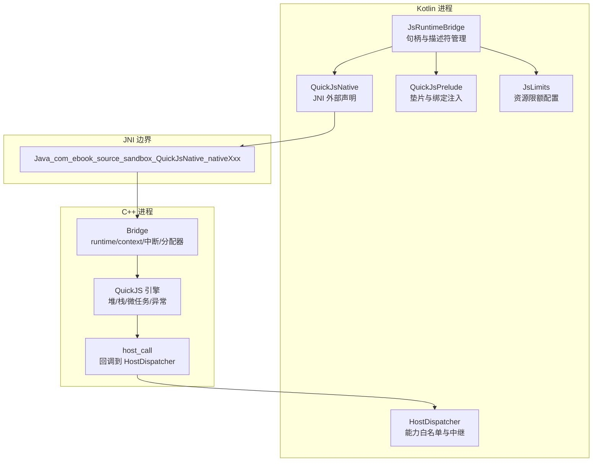
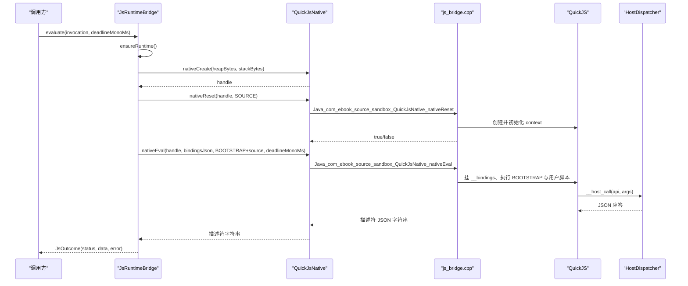
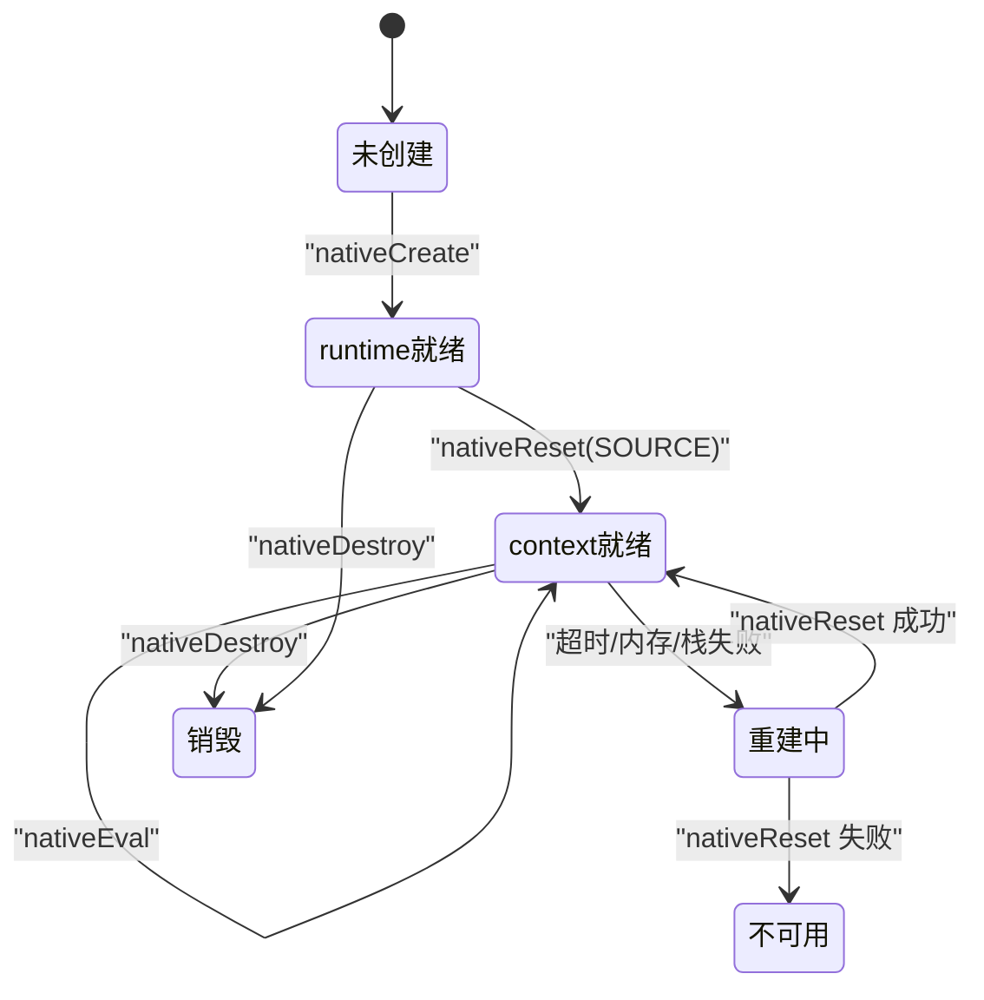
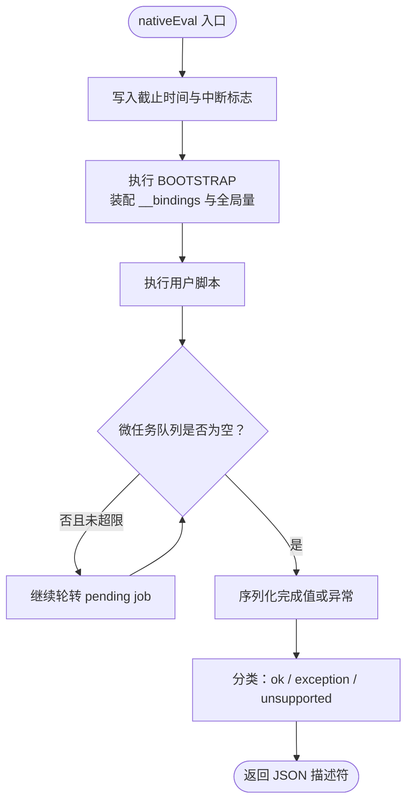
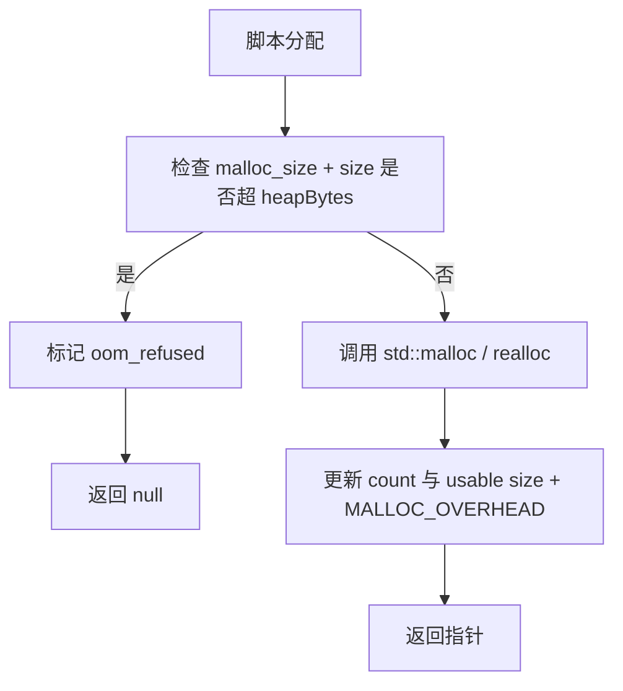
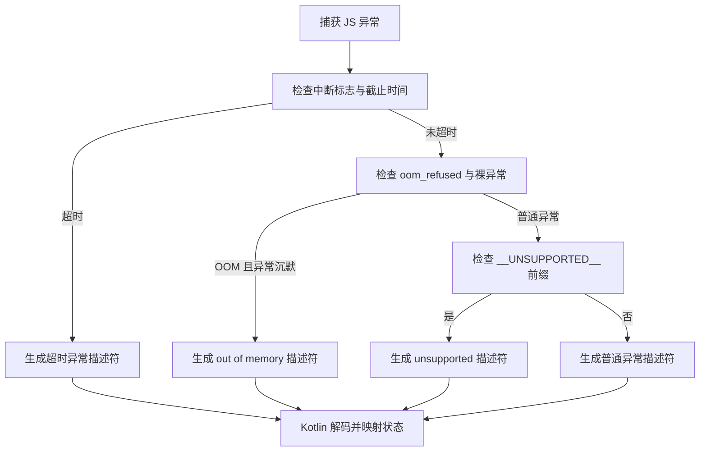
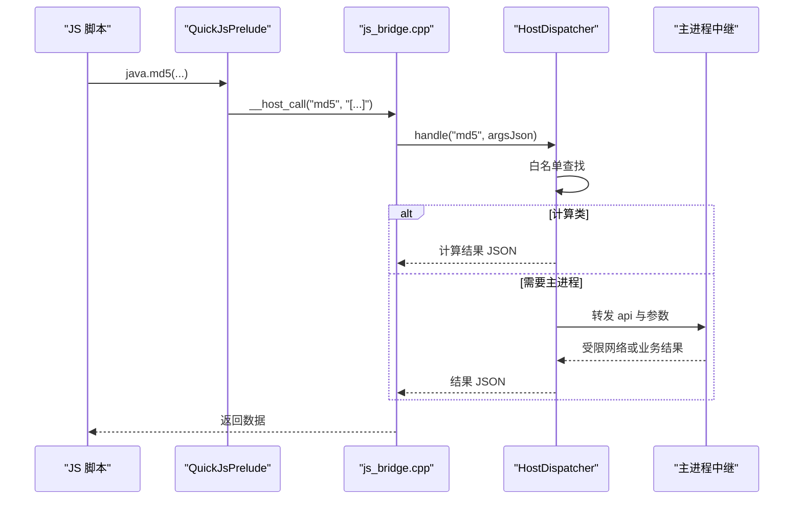
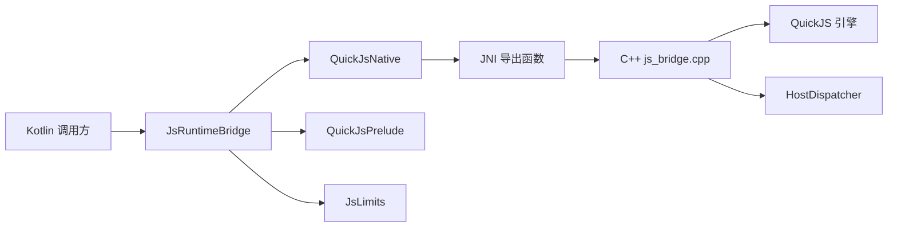

# 原生桥接层

<cite>
**本文引用的文件**   
- [QuickJsNative.kt](file://lib_book_source/src/main/java/com/ebook/source/sandbox/QuickJsNative.kt)
- [JsRuntimeBridge.kt](file://lib_book_source/src/main/java/com/ebook/source/sandbox/JsRuntimeBridge.kt)
- [js_bridge.cpp](file://lib_book_source/src/main/cpp/bridge/js_bridge.cpp)
- [JsLimits.kt](file://lib_book_source/src/main/java/com/ebook/source/sandbox/JsLimits.kt)
- [QuickJsPrelude.kt](file://lib_book_source/src/main/java/com/ebook/source/sandbox/QuickJsPrelude.kt)
- [HostDispatcher.kt](file://lib_book_source/src/main/java/com/ebook/source/sandbox/HostDispatcher.kt)
</cite>

## 目录
1. [引言](#引言)
2. [项目结构](#项目结构)
3. [核心组件](#核心组件)
4. [架构总览](#架构总览)
5. [详细组件分析](#详细组件分析)
6. [依赖关系分析](#依赖关系分析)
7. [性能与内存调优](#性能与内存调优)
8. [故障排查指南](#故障排查指南)
9. [结论](#结论)

## 引言
本文件聚焦 JavaScript 原生桥接层，即 Kotlin 侧 `QuickJsNative`、`JsRuntimeBridge` 与 C++ 侧 `js_bridge.cpp` 之间的 JNI 契约。它解释 QuickJS 引擎的生命周期、四个 JNI 方法的参数和返回值约定、执行环境装配、内存与栈限制、错误分类机制，以及调试与优化建议。文档面向两类读者：需要理解桥接层行为的 Kotlin 开发者，以及需要扩展或维护 `.so` 的 C++ 开发者。

## 项目结构
原生桥接层跨越 Kotlin 与 C++ 两个边界：

**图示来源**
- [JsRuntimeBridge.kt:1-113](file://lib_book_source/src/main/java/com/ebook/source/sandbox/JsRuntimeBridge.kt#L1-L113)
- [QuickJsNative.kt:1-59](file://lib_book_source/src/main/java/com/ebook/source/sandbox/QuickJsNative.kt#L1-L59)
- [js_bridge.cpp:1-200](file://lib_book_source/src/main/cpp/bridge/js_bridge.cpp#L1-L200)
- [HostDispatcher.kt:1-74](file://lib_book_source/src/main/java/com/ebook/source/sandbox/HostDispatcher.kt#L1-L74)
- [QuickJsPrelude.kt:1-200](file://lib_book_source/src/main/java/com/ebook/source/sandbox/QuickJsPrelude.kt#L1-L200)
- [JsLimits.kt:1-58](file://lib_book_source/src/main/java/com/ebook/source/sandbox/JsLimits.kt#L1-L58)

**章节来源**
- [JsRuntimeBridge.kt:1-113](file://lib_book_source/src/main/java/com/ebook/source/sandbox/JsRuntimeBridge.kt#L1-L113)
- [QuickJsNative.kt:1-59](file://lib_book_source/src/main/java/com/ebook/source/sandbox/QuickJsNative.kt#L1-L59)
- [js_bridge.cpp:1-200](file://lib_book_source/src/main/cpp/bridge/js_bridge.cpp#L1-L200)
- [HostDispatcher.kt:1-74](file://lib_book_source/src/main/java/com/ebook/source/sandbox/HostDispatcher.kt#L1-L74)
- [QuickJsPrelude.kt:1-200](file://lib_book_source/src/main/java/com/ebook/source/sandbox/QuickJsPrelude.kt#L1-L200)
- [JsLimits.kt:1-58](file://lib_book_source/src/main/java/com/ebook/source/sandbox/JsLimits.kt#L1-L58)

## 核心组件
- `QuickJsNative`：Kotlin 侧 JNI 外部方法声明对象，负责加载 `ebook_js` 动态库，暴露 `nativeCreate`、`nativeReset`、`nativeEval`、`nativeDestroy`。
- `JsRuntimeBridge`：进程内执行入口，管理 native 句柄生命周期、拼接脚本前缀、序列化绑定变量、解析 C++ 返回的描述符，并在超时、内存或栈失败后强制重建 context。
- `js_bridge.cpp`：C++ 侧实现，封装 QuickJS runtime、context、自定义分配器、栈预算计算、截止时间中断、微任务轮数上限、宿主回调通道，以及统一的 JSON 描述符返回协议。
- `HostDispatcher`：C++ 通过 JNI 回调的 Kotlin 入口，负责二次能力白名单校验、计算类 API 转发与主进程中继。
- `QuickJsPrelude`：随包冻结的 JS 垫片，定义每次执行前执行的 `BOOTSTRAP`、runtime 级 `SOURCE`，以及脚本可见的全局对象和能力集合。
- `JsLimits`：集中声明沙箱的四项资源限制与跨进程帧大小限制，是调优的唯一入口。

**章节来源**
- [QuickJsNative.kt:1-59](file://lib_book_source/src/main/java/com/ebook/source/sandbox/QuickJsNative.kt#L1-L59)
- [JsRuntimeBridge.kt:1-113](file://lib_book_source/src/main/java/com/ebook/source/sandbox/JsRuntimeBridge.kt#L1-L113)
- [js_bridge.cpp:1-200](file://lib_book_source/src/main/cpp/bridge/js_bridge.cpp#L1-L200)
- [HostDispatcher.kt:1-74](file://lib_book_source/src/main/java/com/ebook/source/sandbox/HostDispatcher.kt#L1-L74)
- [QuickJsPrelude.kt:1-200](file://lib_book_source/src/main/java/com/ebook/source/sandbox/QuickJsPrelude.kt#L1-L200)
- [JsLimits.kt:1-58](file://lib_book_source/src/main/java/com/ebook/source/sandbox/JsLimits.kt#L1-L58)

## 架构总览
原生桥接层采用“一次 runtime、每次重建 context”的策略：

**图示来源**
- [JsRuntimeBridge.kt:33-113](file://lib_book_source/src/main/java/com/ebook/source/sandbox/JsRuntimeBridge.kt#L33-L113)
- [QuickJsNative.kt:27-59](file://lib_book_source/src/main/java/com/ebook/source/sandbox/QuickJsNative.kt#L27-L59)
- [js_bridge.cpp:451-820](file://lib_book_source/src/main/cpp/bridge/js_bridge.cpp#L451-L820)
- [HostDispatcher.kt:23-74](file://lib_book_source/src/main/java/com/ebook/source/sandbox/HostDispatcher.kt#L23-L74)

## 详细组件分析

### JNI 方法与 Kotlin 映射约定
`QuickJsNative` 中的四个 external 函数与 C++ 导出函数一一对应。注意 Kotlin 端使用 object 实例上的 external 函数，而非 `@JvmStatic`，这样 JNI 的第二参数是 `jobject` 而不是 `jclass`，避免静态 native 符号无法解析的问题。

| Kotlin 方法 | C++ 导出函数 | 主要参数 | 返回值 | 语义 |
|---|---|---|---|---|
| `nativeCreate(heapBytes: Long, stackBytes: Long)` | `Java_com_ebook_source_sandbox_QuickJsNative_nativeCreate` | `heapBytes`：QuickJS 堆上限字节；`stackBytes`：栈天花板字节 | `Long`：native 句柄，失败为 `0` | 创建 runtime、注册自定义分配器、设置内存限制、关闭阻塞原语、安装中断器 |
| `nativeReset(handle: Long, preludeSource: String)` | `Java_com_ebook_source_sandbox_QuickJsNative_nativeReset` | `handle`：由 `nativeCreate` 返回；`preludeSource`：预置脚本文本 | `Boolean`：成功 `true`，失败 `false` | 销毁旧 context、创建新 context、挂载 `__host_call`、执行预置脚本 |
| `nativeEval(handle: Long, bindingsJson: String, source: String, deadlineMonoMs: Long)` | `Java_com_ebook_source_sandbox_QuickJsNative_nativeEval` | `bindingsJson`：绑定变量 JSON；`source`：已带 `BOOTSTRAP` 前缀的完整脚本；`deadlineMonoMs`：单调时钟绝对毫秒 | `String`：JSON 描述符，永不返回空值（极端 OOM 时返回兜底） | 设置截止时间、执行脚本、处理微任务、序列化完成值或异常 |
| `nativeDestroy(handle: Long)` | `Java_com_ebook_source_sandbox_QuickJsNative_nativeDestroy` | `handle`：native 句柄 | `void` | 释放 context、runtime 和 Bridge 对象 |

**章节来源**
- [QuickJsNative.kt:27-59](file://lib_book_source/src/main/java/com/ebook/source/sandbox/QuickJsNative.kt#L27-L59)
- [js_bridge.cpp:667-820](file://lib_book_source/src/main/cpp/bridge/js_bridge.cpp#L667-L820)

### QuickJS 引擎生命周期
生命周期分为两层：

1. **runtime 层**：由 `nativeCreate` 创建，持有堆内存限制、中断处理器、可阻塞开关和 opaque 指针。它对应 `Bridge.rt`，在进程内常驻。
2. **context 层**：由 `nativeReset` 创建和销毁，对应 `Bridge.ctx`。每次任务执行前重建，保证上下文干净，避免上一条规则残留全局量、闭包或待处理微任务影响下一条规则。

**图示来源**
- [JsRuntimeBridge.kt:64-113](file://lib_book_source/src/main/java/com/ebook/source/sandbox/JsRuntimeBridge.kt#L64-L113)
- [js_bridge.cpp:667-820](file://lib_book_source/src/main/cpp/bridge/js_bridge.cpp#L667-L820)

**章节来源**
- [JsRuntimeBridge.kt:33-113](file://lib_book_source/src/main/java/com/ebook/source/sandbox/JsRuntimeBridge.kt#L33-L113)
- [js_bridge.cpp:667-820](file://lib_book_source/src/main/cpp/bridge/js_bridge.cpp#L667-L820)

### nativeEval 执行环境
`nativeEval` 不是简单地把用户脚本交给 QuickJS 求值，而是按以下顺序装配执行环境：

1. **绑定注入**：Kotlin 把 `invocation.bindings` 序列化为 JSON 对象，作为 `bindingsJson` 传入。C++ 把它挂在 `globalThis.__bindings`，然后执行 `BOOTSTRAP`，由垫片的 `__bind` 把 `result`、`baseUrl`、`src`、`key`、`page`、`title`、`bookJson`、`chapterJson`、`sourceJson` 等落成全局变量。
2. **脚本前缀要求**：Kotlin 在调用前拼接 `QuickJsPrelude.BOOTSTRAP + "\n" + invocation.source`。因此 C++ 接收到的 `source` 必须已经包含 `BOOTSTRAP`；如果直接传裸用户脚本，会缺少 `__bindings` 装配逻辑。
3. **截止时间传递**：`deadlineMonoMs` 是单调时钟绝对毫秒，与 `SystemClock.elapsedRealtime()` 同口径。C++ 把它存入 `Bridge.deadline_ms`，并通过 `on_interrupt` 在解释器轮询点检查当前时间是否超过截止时间。
4. **微任务收敛**：执行完成后，C++ 最多轮转 `MAX_PENDING_JOBS` 次 pending job，避免 `Promise.resolve().then(...)` 这类自驱动微任务无限循环。
5. **结果序列化**：脚本完成值被 JSON 化，包装为描述符对象。`undefined` 与 `null` 统一转为 `data=null`，防止“没有值”被误说成正文 `"undefined"`。

**图示来源**
- [JsRuntimeBridge.kt:47-71](file://lib_book_source/src/main/java/com/ebook/source/sandbox/JsRuntimeBridge.kt#L47-L71)
- [js_bridge.cpp:333-450](file://lib_book_source/src/main/cpp/bridge/js_bridge.cpp#L333-L450)
- [js_bridge.cpp:515-595](file://lib_book_source/src/main/cpp/bridge/js_bridge.cpp#L515-L595)

**章节来源**
- [JsRuntimeBridge.kt:47-71](file://lib_book_source/src/main/java/com/ebook/source/sandbox/JsRuntimeBridge.kt#L47-L71)
- [QuickJsPrelude.kt:1-200](file://lib_book_source/src/main/java/com/ebook/source/sandbox/QuickJsPrelude.kt#L1-L200)
- [js_bridge.cpp:333-450](file://lib_book_source/src/main/cpp/bridge/js_bridge.cpp#L333-L450)
- [js_bridge.cpp:515-595](file://lib_book_source/src/main/cpp/bridge/js_bridge.cpp#L515-L595)

### 内存管理策略
桥接层的内存管理遵循“堆栈分离、分配器接管、context 隔离”的原则：

| 维度 | 实现方式 | 关键行为 |
|---|---|---|
| 堆内存 | `JS_NewRuntime2` 配合自定义分配器，再调用 `JS_SetMemoryLimit` | 记录每次分配的可用大小与开销，超出 `heapBytes` 时拒绝分配并标记 OOM |
| 栈内存 | `stack_ceiling` 存储配置值；每次执行前按线程剩余栈计算 `stack_budget` | 若线程实际栈小于预算，则退化成最小安全预算，避免 native 栈溢出导致 SIGSEGV |
| 垃圾回收触发点 | `nativeReset` 销毁旧 context；`JS_FreeContext` 触发 QuickJS GC | 每个任务结束后清理全局量、闭包和微任务，避免状态泄漏 |
| 泄漏防护 | `ValueGuard` 包装 JS 值；`Utf8Slice` 管理 UTF-8 结尾；`DeadlineScope` 重置中断状态 | 尽量用 RAII 风格对象确保 JS 值和临时字符串不会漏释放 |
| 跨进程数据 | 请求帧、响应帧、host 回复受 `maxRequestBytes`、`maxOutcomeBytes`、`maxHostReplyBytes` 限制 | binder 事务缓冲约 1 MB，过大帧会在本地抛出更明确的错误 |

**图示来源**
- [js_bridge.cpp:100-200](file://lib_book_source/src/main/cpp/bridge/js_bridge.cpp#L100-L200)
- [js_bridge.cpp:201-260](file://lib_book_source/src/main/cpp/bridge/js_bridge.cpp#L201-L260)
- [JsLimits.kt:10-58](file://lib_book_source/src/main/java/com/ebook/source/sandbox/JsLimits.kt#L10-L58)

**章节来源**
- [js_bridge.cpp:100-260](file://lib_book_source/src/main/cpp/bridge/js_bridge.cpp#L100-L260)
- [JsLimits.kt:10-58](file://lib_book_source/src/main/java/com/ebook/source/sandbox/JsLimits.kt#L10-L58)

### 错误处理机制
C++ 不直接把原始异常抛给 Kotlin，而是统一序列化为描述符 JSON。Kotlin 侧再解码为 `NativeDescriptor`，并由 `JsProtocol.mapStatus` 映射为 `JsStatus`。

主要分类规则如下：

| 条件 | 分类结果 | 说明 |
|---|---|---|
| 截止时间已到或中断标志为真 | `TIMEOUT` | 优先于内存判断，避免 OOM 掩盖超时 |
| 分配器曾拒绝分配，且异常说不出有效信息 | `MEMORY` | 包括内核连错误对象都建不出的裸 `null`、stringify 失败或 message 只等于类名 |
| 宿主回调明确以 `__UNSUPPORTED__:` 前缀抛出 | `UNSUPPORTED_API` | 用于明确不支持的能力 |
| 其他异常 | `RUNTIME` | 携带 `errorName` 与 `errorMessage` |
| 微任务轮数超过上限 | `UNSUPPORTED_API` | 提示可能存在自驱动 Promise 循环 |

**图示来源**
- [js_bridge.cpp:333-450](file://lib_book_source/src/main/cpp/bridge/js_bridge.cpp#L333-L450)
- [JsRuntimeBridge.kt:53-71](file://lib_book_source/src/main/java/com/ebook/source/sandbox/JsRuntimeBridge.kt#L53-L71)

**章节来源**
- [js_bridge.cpp:333-450](file://lib_book_source/src/main/cpp/bridge/js_bridge.cpp#L333-L450)
- [JsRuntimeBridge.kt:53-71](file://lib_book_source/src/main/java/com/ebook/source/sandbox/JsRuntimeBridge.kt#L53-L71)

### 宿主回调与能力边界
脚本通过垫片调用 `java.*`、`source.*`、`book.*`、`chapter.*` 等方法，最终落到 `__host_call`，再由 C++ 调用 Kotlin 的 `HostDispatcher.handle`。

关键点：

- C++ 侧不持有任何能力表，只负责把 `(api, argsJson)` 送到 Kotlin。
- Kotlin 的 `HostDispatcher` 做第二次白名单校验，并区分计算类 API 与需要主进程中继的能力。
- 所有回调返回值必须是合法 JSON；非 JSON 会被包装为内部错误。
- `FindClass` 必须在应用类加载后执行，不能放在 `JNI_OnLoad`，否则会因类加载器不同而找不到应用类。

**图示来源**
- [QuickJsPrelude.kt:1-200](file://lib_book_source/src/main/java/com/ebook/source/sandbox/QuickJsPrelude.kt#L1-L200)
- [js_bridge.cpp:595-667](file://lib_book_source/src/main/cpp/bridge/js_bridge.cpp#L595-L667)
- [HostDispatcher.kt:23-74](file://lib_book_source/src/main/java/com/ebook/source/sandbox/HostDispatcher.kt#L23-L74)

**章节来源**
- [QuickJsPrelude.kt:1-200](file://lib_book_source/src/main/java/com/ebook/source/sandbox/QuickJsPrelude.kt#L1-L200)
- [js_bridge.cpp:595-667](file://lib_book_source/src/main/cpp/bridge/js_bridge.cpp#L595-L667)
- [HostDispatcher.kt:23-74](file://lib_book_source/src/main/java/com/ebook/source/sandbox/HostDispatcher.kt#L23-L74)

## 依赖关系分析

**图示来源**
- [JsRuntimeBridge.kt:1-113](file://lib_book_source/src/main/java/com/ebook/source/sandbox/JsRuntimeBridge.kt#L1-L113)
- [QuickJsNative.kt:1-59](file://lib_book_source/src/main/java/com/ebook/source/sandbox/QuickJsNative.kt#L1-L59)
- [js_bridge.cpp:1-200](file://lib_book_source/src/main/cpp/bridge/js_bridge.cpp#L1-L200)
- [HostDispatcher.kt:1-74](file://lib_book_source/src/main/java/com/ebook/source/sandbox/HostDispatcher.kt#L1-L74)
- [QuickJsPrelude.kt:1-200](file://lib_book_source/src/main/java/com/ebook/source/sandbox/QuickJsPrelude.kt#L1-L200)
- [JsLimits.kt:1-58](file://lib_book_source/src/main/java/com/ebook/source/sandbox/JsLimits.kt#L1-L58)

耦合特征：

- Kotlin 与 C++ 的耦合集中在四个 JNI 方法和 JSON 描述符协议上。
- C++ 对 Kotlin 的反向依赖仅限于 `HostDispatcher.handle` 和 `String.getBytes("UTF-8")`，降低重编译成本。
- 能力白名单在 Kotlin 侧维护，C++ 侧只识别 `__UNSUPPORTED__:` 前缀，便于在不改动 `.so` 的情况下调整能力。
- 垫片 `QuickJsPrelude` 是脚本能力的正面清单，缺失能力会自然产生 `ReferenceError`。

**章节来源**
- [js_bridge.cpp:1-200](file://lib_book_source/src/main/cpp/bridge/js_bridge.cpp#L1-L200)
- [HostDispatcher.kt:1-74](file://lib_book_source/src/main/java/com/ebook/source/sandbox/HostDispatcher.kt#L1-L74)
- [QuickJsPrelude.kt:1-200](file://lib_book_source/src/main/java/com/ebook/source/sandbox/QuickJsPrelude.kt#L1-L200)

## 性能与内存调优

### 可调参数
| 参数 | 默认值 | 作用 | 调优建议 |
|---|---:|---|---|
| `wallClockMs` | 5000 ms | 单次执行挂钟上限 | 正则回溯复杂或含大量计算的源可适当放宽，但需配合日志定位慢规则 |
| `heapBytes` | 8 MB | QuickJS 堆上限 | 正文 HTML 大时先看报文上限；真正指数级分配才应提高堆上限 |
| `stackBytes` | 1 MB | JS 栈天花板 | Android binder 线程栈可能只有几百 KB，不要盲目提高；优先修复深层递归 |
| `maxRequestBytes` | 900000 字节 | 请求帧上限 | 控制 binder 事务，避免 `TransactionTooLargeException` |
| `maxOutcomeBytes` | 900000 字节 | 响应帧上限 | 控制主进程内存与序列化压力 |
| `maxHostReplyBytes` | 900000 字节 | host 回调回复上限 | 控制网络代理返回的整页大小 |
| `maxCallbackDepth` | 8 | 回调重入深度 | 防止规则套规则导致的爆炸式调用 |
| `bindTimeoutMs` | 2000 ms | 连接执行器进程超时 | 冷启动不应占用整条规则的 5 秒预算 |
| `maxRequestsPerTask` | 40 | 单任务网络代理请求次数 | 聚合搜索场景下仍应保持较低阈值 |

**章节来源**
- [JsLimits.kt:10-58](file://lib_book_source/src/main/java/com/ebook/source/sandbox/JsLimits.kt#L10-L58)

### 内存监控方法
- 观察 `JsStatus.MEMORY` 出现频率：若频繁出现，优先检查脚本是否存在指数增长字符串、重复拼接大对象或未释放中间结果。
- 区分 OOM 与普通运行时异常：C++ 只在分配器拒绝分配且异常信息不可信时才归类为 OOM，否则保留真实错误名和消息。
- 监控 binder 事务异常：请求或响应超过 900 KB 应在本地拦截，而不是等到设备上报 `TransactionTooLargeException`。
- 关注 context 重建次数：超时、内存、栈失败都会触发 `reset()`，重建频繁说明配额偏紧或脚本存在严重问题。

### 调试技巧
- 使用 `isReady` 快速判断 `.so` 是否加载成功，排除 ABI 不一致或构建产物缺失。
- 查看 `loadError`：它能区分“根本没跑”和“跑过但本机缺 ABI”。
- 检查 `bindingsJson`：空值绑定不应进入 JSON 对象，否则脚本侧 `typeof` 判空语义可能被破坏。
- 确认 `source` 已包含 `BOOTSTRAP`：Kotlin 会自动拼接，但自定义封装层不得再次拼接或截断前缀。
- 使用 `deadlineMonoMs` 对齐单调时钟：不要用 `System.currentTimeMillis()`，它会受系统时间修改影响。
- 观察微任务数量：自驱动 Promise 循环会被限制在固定轮数，超过后返回 `unsupported` 描述符。

## 故障排查指南

### 常见问题与定位路径

| 现象 | 可能原因 | 排查步骤 | 预期修复 |
|---|---|---|---|
| 启动时报 `UnsatisfiedLinkError` 或 `libebook_js.so` 未加载 | ABI 不匹配、R8 混淆掉符号、构建未打包 | 检查 `QuickJsNative.loaded` 与 `loadError` | 修正 ABI、保留 `ebook_js` 符号、重新打包 |
| 第一次执行就报 `UNAVAILABLE` | `nativeCreate` 返回 `0` | 检查 `heapBytes` 是否为负、`ensure_dispatcher` 是否失败 | 调整限额、确认 `HostDispatcher` 可被 `FindClass` |
| 脚本运行后立即 `TIMEOUT` | `deadlineMonoMs` 过小或已过 | 打印传入截止时间与当前 `boot_time_ms` | 放宽挂钟上限，或检查死循环 |
| 频繁报 `MEMORY` | 堆上限太小或脚本指数分配 | 观察是否伴随 `oom_refused`、是否出现裸 `null` 异常 | 缩小问题脚本，必要时提高 `heapBytes` |
| 崩溃为 SIGSEGV | 栈预算大于线程实际剩余栈 | 检查 binder 线程栈大小、`ASSUMED_THREAD_STACK_BYTES` | 降低 `stackBytes`，避免深递归 |
| Emoji 或生僻字乱码 | JNI UTF-8 编码路径错误 | 检查是否走 `GetStringUTFChars` 或错误的 `cesu8` 标志 | 使用 `getBytes("UTF-8")` 与正确的序列化 flag |
| 宿主回调报 “主进程抛了异常” | `HostDispatcher.handle` 内部未兜住异常 | 查看 Kotlin 侧日志与 `runCatching` 分支 | 让 `handle` 始终返回合法 JSON 描述符 |
| 描述符解码失败 | Kotlin 与 C++ 构建不同步 | 检查未知字段与严格反序列化 | 同步版本，不要静默忽略未知键 |

**章节来源**
- [QuickJsNative.kt:1-59](file://lib_book_source/src/main/java/com/ebook/source/sandbox/QuickJsNative.kt#L1-L59)
- [JsRuntimeBridge.kt:33-113](file://lib_book_source/src/main/java/com/ebook/source/sandbox/JsRuntimeBridge.kt#L33-L113)
- [js_bridge.cpp:201-450](file://lib_book_source/src/main/cpp/bridge/js_bridge.cpp#L201-L450)
- [HostDispatcher.kt:23-74](file://lib_book_source/src/main/java/com/ebook/source/sandbox/HostDispatcher.kt#L23-L74)

### JNI 开发规范
- 不要在 C++ 中直接抛出异常跨越 JNI 边界；异常应转换为 JSON 描述符。
- 所有 `jstring` 到 UTF-8 的转换应使用 JDK 的 `getBytes("UTF-8")`，避免增补平面字符乱码。
- 局部引用必须在每条退出路径显式释放，尤其是 `host_call` 这种可能被脚本高频调用的路径。
- 全局引用只用于 `g_dispatcher`、`g_handle_mid`、`g_get_bytes_mid`、`g_utf8_name` 等长期存活对象。
- 返回值绝不能为 null：C++ 侧缓存兜底描述符字符串，Kotlin 侧签名也期望非空 JSON。
- 类查找必须延迟到应用类加载后，不能在 `JNI_OnLoad` 中查找应用类。

**章节来源**
- [js_bridge.cpp:260-450](file://lib_book_source/src/main/cpp/bridge/js_bridge.cpp#L260-L450)
- [js_bridge.cpp:595-667](file://lib_book_source/src/main/cpp/bridge/js_bridge.cpp#L595-L667)
- [js_bridge.cpp:667-820](file://lib_book_source/src/main/cpp/bridge/js_bridge.cpp#L667-L820)

## 结论
原生桥接层的核心价值在于把不可信的 JavaScript 脚本约束在一个有堆限、栈限、截止时间和上下文隔离的沙箱中。Kotlin 侧负责句柄、描述符和协议映射，C++ 侧负责 QuickJS 引擎、分配器和错误分类，`HostDispatcher` 承担能力白名单，`QuickJsPrelude` 提供脚本能力正面清单。调优时应优先从 `JsLimits` 入手，结合 `JsStatus`、`loadError`、binder 事务异常和日志进行定位。任何新增能力都应先在 Kotlin 白名单和垫片中加入，避免修改 C++ 实现；任何新增原生方法都应保持 JSON 描述符不变，确保 Kotlin 与 C++ 构建稳定对齐。