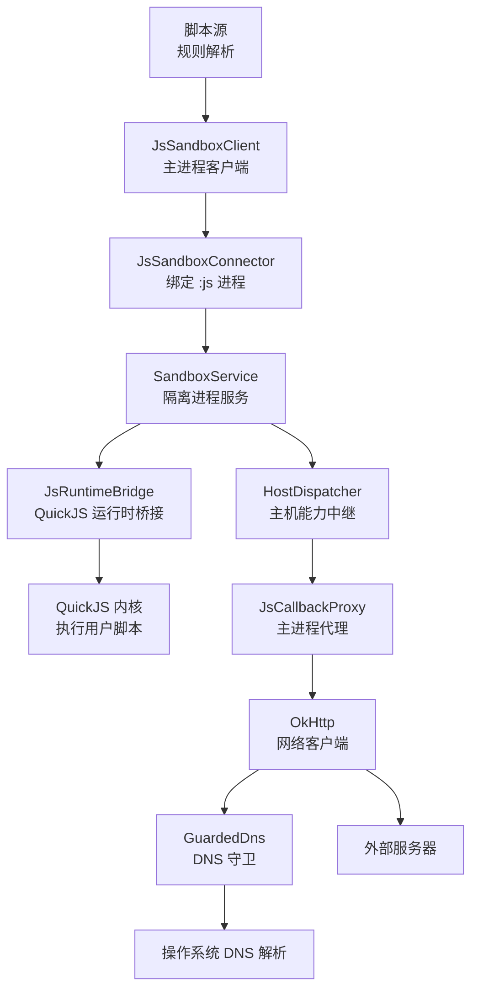
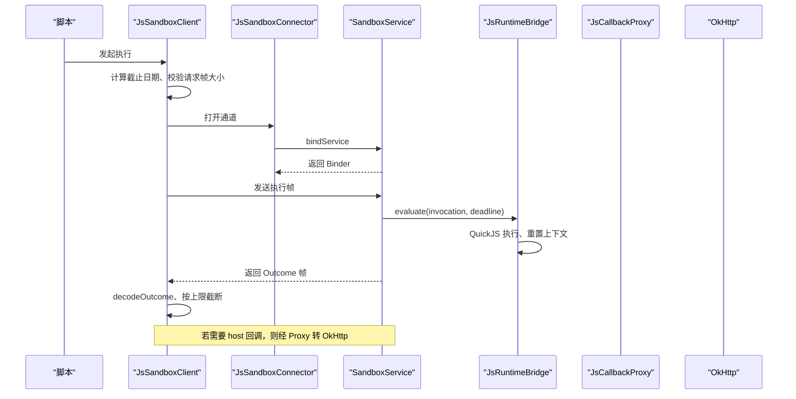
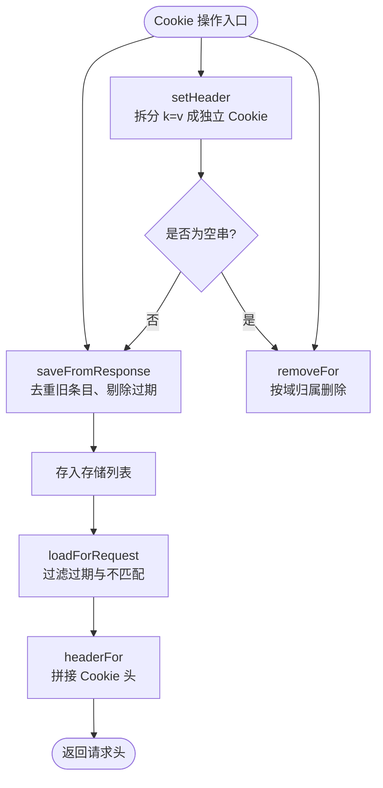
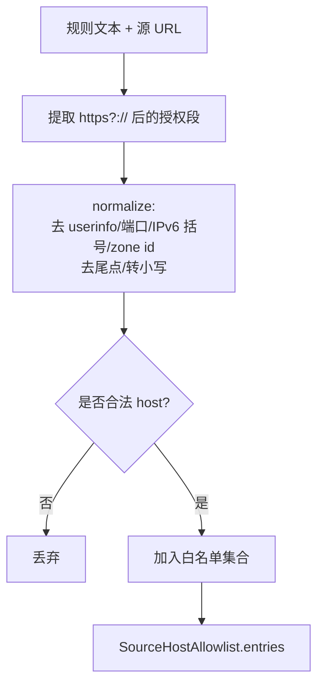
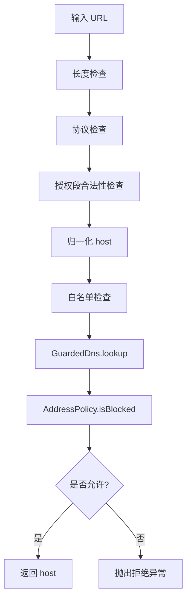
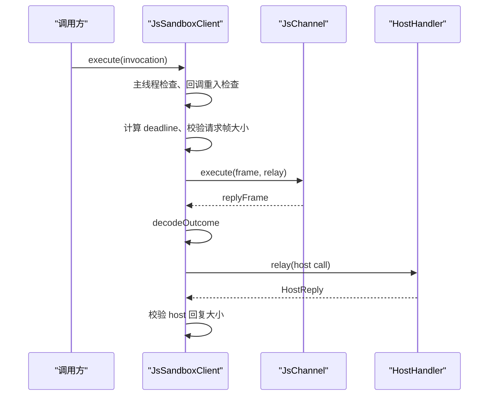
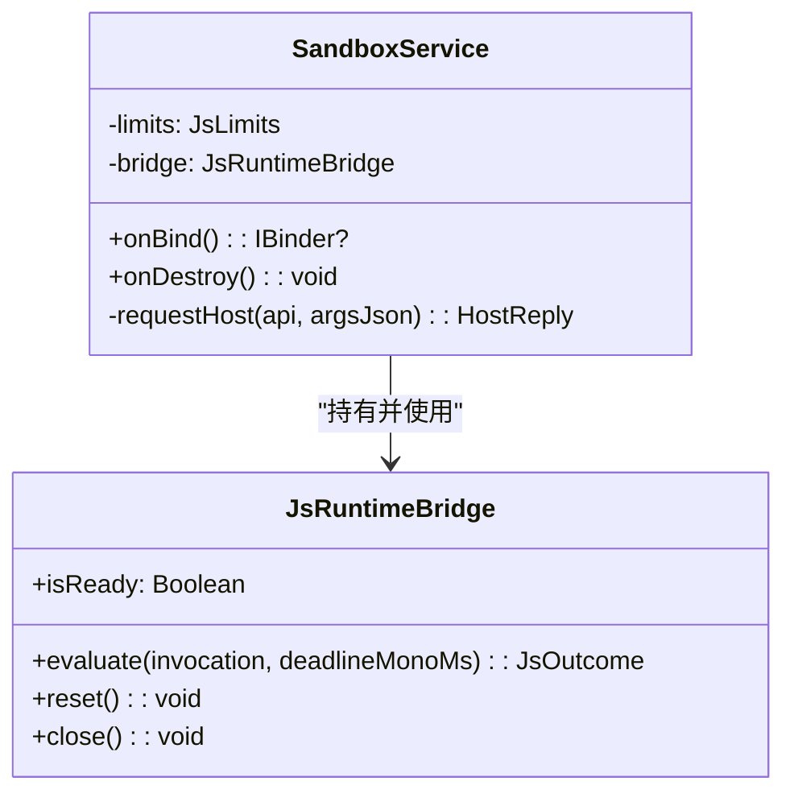
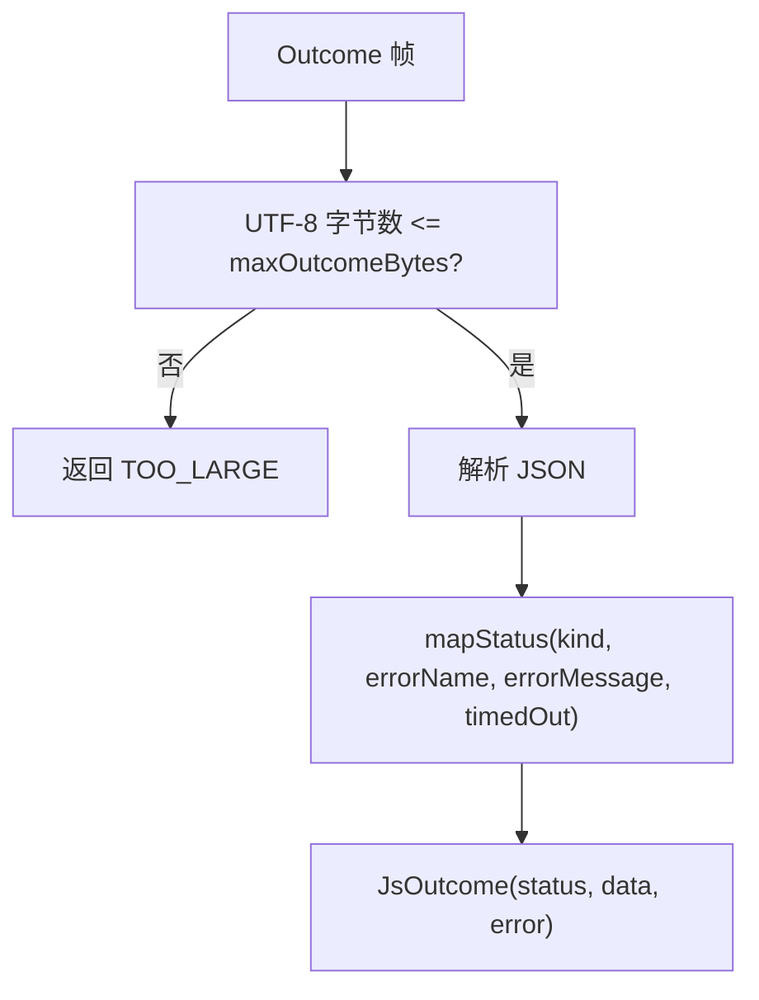
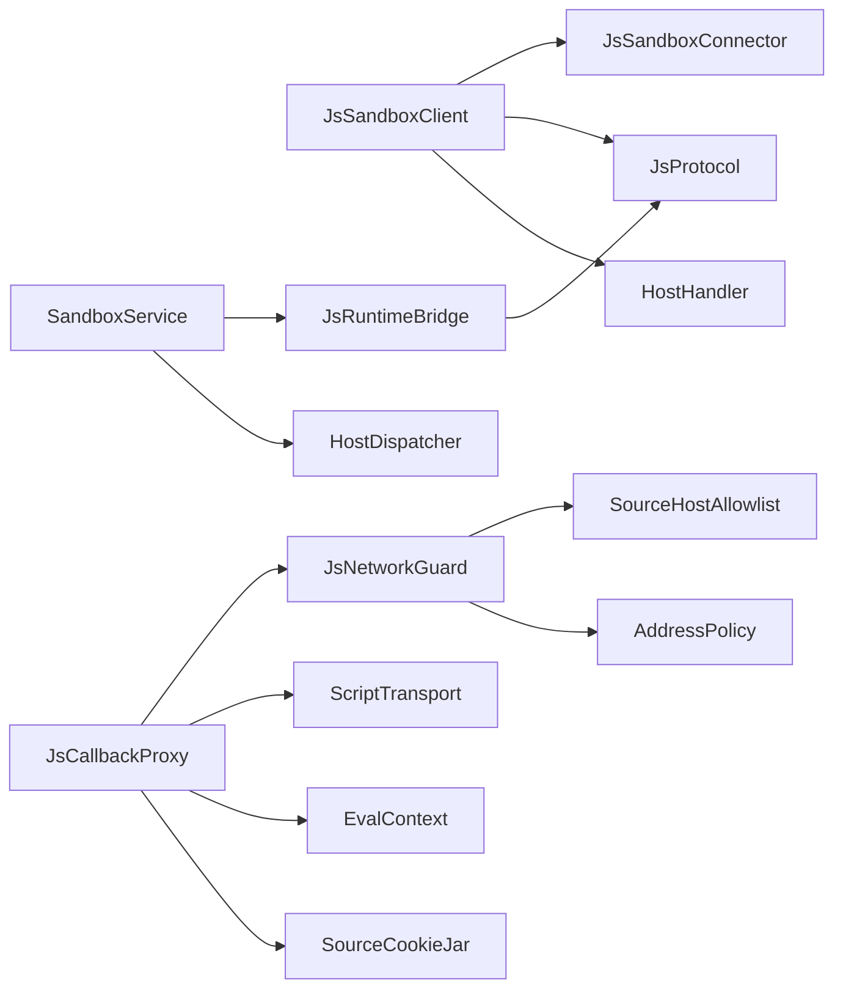

# 安全限制配置

<cite>
**本文引用的文件**   
- [JsLimits.kt](file://lib_book_source/src/main/java/com/ebook/source/sandbox/JsLimits.kt)
- [SourceCookieJar.kt](file://lib_book_source/src/main/java/com/ebook/source/sandbox/SourceCookieJar.kt)
- [SourceHostAllowlist.kt](file://lib_book_source/src/main/java/com/ebook/source/sandbox/SourceHostAllowlist.kt)
- [JsNetworkGuard.kt](file://lib_book_source/src/main/java/com/ebook/source/sandbox/JsNetworkGuard.kt)
- [JsSandboxClient.kt](file://lib_book_source/src/main/java/com/ebook/source/sandbox/JsSandboxClient.kt)
- [JsRuntimeBridge.kt](file://lib_book_source/src/main/java/com/ebook/source/sandbox/JsRuntimeBridge.kt)
- [SandboxService.kt](file://lib_book_source/src/main/java/com/ebook/source/sandbox/SandboxService.kt)
- [JsProtocol.kt](file://lib_book_source/src/main/java/com/ebook/source/sandbox/JsProtocol.kt)
- [SandboxTaskRunner.kt](file://lib_book_source/src/main/java/com/ebook/source/sandbox/SandboxTaskRunner.kt)
- [JsCallbackProxy.kt](file://lib_book_source/src/main/java/com/ebook/source/sandbox/JsCallbackProxy.kt)
- [SourceCookieJarTest.kt](file://lib_book_source/src/test/java/com/ebook/source/sandbox/SourceCookieJarTest.kt)
- [SourceHostAllowlistTest.kt](file://lib_book_source/src/test/java/com/ebook/source/sandbox/SourceHostAllowlistTest.kt)
- [JsNetworkGuardTest.kt](file://lib_book_source/src/test/java/com/ebook/source/sandbox/JsNetworkGuardTest.kt)
</cite>

## 目录
1. [引言](#引言)
2. [项目结构](#项目结构)
3. [核心组件](#核心组件)
4. [架构总览](#架构总览)
5. [详细组件分析](#详细组件分析)
6. [依赖关系分析](#依赖关系分析)
7. [性能与资源特性](#性能与资源特性)
8. [故障排查指南](#故障排查指南)
9. [安全最佳实践](#安全最佳实践)
10. [渗透测试方法](#渗透测试方法)
11. [漏洞修复指南](#漏洞修复指南)
12. [安全审计清单与合规检查工具](#安全审计清单与合规检查工具)
13. [结论](#结论)

## 引言
本文件聚焦于 JavaScript 沙箱的安全限制配置，围绕以下目标展开：
- 解释 `JsLimits` 各项安全参数，包括 CPU 挂钟时间、堆栈内存、请求与回复大小、回调深度等。
- 说明 `SourceCookieJar` 的 Cookie 管理机制，涵盖会话隔离、持久化策略与安全属性过滤。
- 文档化 `SourceHostAllowlist` 的主机白名单策略，包括域名匹配规则、IP 地址处理与 DNS 重绑防护。
- 梳理网络访问控制：URL 协议限制、端口范围、SSL 证书验证现状。
- 总结 QuickJS 内存安全机制：堆上限、栈上限、对象数量与循环引用检测现状。
- 提供安全配置最佳实践、渗透测试方法与漏洞修复指南，并给出可操作的审计清单与合规检查建议。

## 项目结构
该能力位于 `lib_book_source` 模块的沙箱子包中，采用“主进程客户端 + 隔离执行器进程”的双进程边界设计：
- 主进程侧负责连接、串行化、限流、重试与策略装配。
- `:js` 隔离进程负责 QuickJS 内核执行、host 调用中继与结果回传。
- 网络访问由 OkHttp 驱动，并通过自定义 DNS 与地址策略实现强校验。

**图表来源**
- [JsSandboxClient.kt:1-185](file://lib_book_source/src/main/java/com/ebook/source/sandbox/JsSandboxClient.kt#L1-L185)
- [JsSandboxConnector.kt:1-142](file://lib_book_source/src/main/java/com/ebook/source/sandbox/JsSandboxConnector.kt#L1-L142)
- [SandboxService.kt:1-210](file://lib_book_source/src/main/java/com/ebook/source/sandbox/SandboxService.kt#L1-L210)
- [JsRuntimeBridge.kt:1-113](file://lib_book_source/src/main/java/com/ebook/source/sandbox/JsRuntimeBridge.kt#L1-L113)
- [JsCallbackProxy.kt:1-200](file://lib_book_source/src/main/java/com/ebook/source/sandbox/JsCallbackProxy.kt#L1-L200)
- [JsNetworkGuard.kt:1-167](file://lib_book_source/src/main/java/com/ebook/source/sandbox/JsNetworkGuard.kt#L1-L167)

**章节来源**
- [JsSandboxClient.kt:1-185](file://lib_book_source/src/main/java/com/ebook/source/sandbox/JsSandboxClient.kt#L1-L185)
- [SandboxService.kt:1-210](file://lib_book_source/src/main/java/com/ebook/source/sandbox/SandboxService.kt#L1-L210)

## 核心组件
本节对安全相关核心类进行概览式说明：
- `JsLimits`：集中定义沙箱四项资源限制与跨进程帧尺寸上限，是调校的唯一来源。
- `SourceCookieJar`：源级 Cookie 容器，既是 OkHttp 的 `CookieJar`，也是脚本侧 cookie API 的落点。
- `SourceHostAllowlist`：从书源自身 URL 与规则文本导出 host 白名单，默认严格，不自动放行子域。
- `JsNetworkGuard`：无状态网络准入判定，分为字符串层与 DNS 层两段检查。
- `JsSandboxClient`：主进程侧唯一执行入口，负责串行化、超时、重放、回调转发与自伤保护。
- `JsRuntimeBridge`：进程内 QuickJS 生命周期管理、上下文重置与失败归类。
- `SandboxService`：`:js` 进程唯一服务，负责事务分发、host 中继与任务边界清理。
- `JsProtocol`：跨进程 JSON 协议编解码、状态映射与报文尺寸闸门。
- `SandboxTaskRunner`：执行器侧裁决逻辑，统一进入内核前做任务边界重置与响应尺寸闸门。
- `JsCallbackProxy`：主进程 host 回调路由与任务级状态（计数、深度、当前页面）管理。

**章节来源**
- [JsLimits.kt:1-58](file://lib_book_source/src/main/java/com/ebook/source/sandbox/JsLimits.kt#L1-L58)
- [SourceCookieJar.kt:1-127](file://lib_book_source/src/main/java/com/ebook/source/sandbox/SourceCookieJar.kt#L1-L127)
- [SourceHostAllowlist.kt:1-74](file://lib_book_source/src/main/java/com/ebook/source/sandbox/SourceHostAllowlist.kt#L1-L74)
- [JsNetworkGuard.kt:1-167](file://lib_book_source/src/main/java/com/ebook/source/sandbox/JsNetworkGuard.kt#L1-L167)
- [JsSandboxClient.kt:1-185](file://lib_book_source/src/main/java/com/ebook/source/sandbox/JsSandboxClient.kt#L1-L185)
- [JsRuntimeBridge.kt:1-113](file://lib_book_source/src/main/java/com/ebook/source/sandbox/JsRuntimeBridge.kt#L1-L113)
- [SandboxService.kt:1-210](file://lib_book_source/src/main/java/com/ebook/source/sandbox/SandboxService.kt#L1-L210)
- [JsProtocol.kt:1-200](file://lib_book_source/src/main/java/com/ebook/source/sandbox/JsProtocol.kt#L1-L200)
- [SandboxTaskRunner.kt:1-69](file://lib_book_source/src/main/java/com/ebook/source/sandbox/SandboxTaskRunner.kt#L1-L69)
- [JsCallbackProxy.kt:1-200](file://lib_book_source/src/main/java/com/ebook/source/sandbox/JsCallbackProxy.kt#L1-L200)

## 架构总览
沙箱以“进程隔离 + 协议契约 + 多层闸门”为基本思路：
- 进程隔离：通过 `bindService` 拉起 `:js` 进程，只有当确认处于隔离进程时才返回 binder。
- 协议契约：所有跨进程数据使用 `JsProtocol` 序列化，禁止未知字段，失败时返回有名字的状态。
- 多层闸门：请求长度、协议、授权段、白名单、DNS、地址族、帧大小、回调深度、任务请求次数等层层拦截。

**图表来源**
- [JsSandboxClient.kt:1-185](file://lib_book_source/src/main/java/com/ebook/source/sandbox/JsSandboxClient.kt#L1-L185)
- [JsSandboxConnector.kt:1-142](file://lib_book_source/src/main/java/com/ebook/source/sandbox/JsSandboxConnector.kt#L1-L142)
- [SandboxService.kt:1-210](file://lib_book_source/src/main/java/com/ebook/source/sandbox/SandboxService.kt#L1-L210)
- [JsRuntimeBridge.kt:1-113](file://lib_book_source/src/main/java/com/ebook/source/sandbox/JsRuntimeBridge.kt#L1-L113)

## 详细组件分析

### JsLimits：沙箱资源与跨进程帧限制
`JsLimits` 是沙箱资源限制的单一来源，强调不同数字对应不同攻击面：
- `wallClockMs`：单次执行的挂钟上限；执行器线程中断器逐轮比对，不保证打断阻塞中的 host call。
- `heapBytes`：QuickJS 堆上限，默认 8 MB，用于防指数分配。
- `stackBytes`：JS 栈上限，默认 1 MB，语义是天花板；桥接层还会结合线程剩余栈再收一道。
- `maxRequestBytes`：请求帧上限，默认 900 KB，受 Android binder 事务缓冲约束。
- `maxOutcomeBytes`：响应帧上限，默认 900 KB。
- `maxHostReplyBytes`：host 回调回复上限，默认 900 KB，同样受 binder 缓冲约束。
- `maxCallbackDepth`：回调重入深度上限，默认 8，防止脚本套规则、规则再套脚本导致栈爆。
- `bindTimeoutMs`：等待 `:js` 进程连上的上限，默认 2 秒，避免冷启动占满规则预算。
- `maxRequestsPerTask`：单任务网络代理请求次数上限，默认 40，用于识别恶意 `while(true) ajax()`。

这些参数的调整应基于真实源的失败率与语料规模，而不是随意放大。尤其要注意：
- 请求与响应字节上限不是纯内存限制，而是 binder 事务缓冲限制。
- 堆与栈分别防不同崩溃形态，不能互相替代。
- 回调深度与任务请求次数共同抑制无限递归与无限外呼。

**章节来源**
- [JsLimits.kt:1-58](file://lib_book_source/src/main/java/com/ebook/source/sandbox/JsLimits.kt#L1-L58)
- [JsSandboxClient.kt:1-185](file://lib_book_source/src/main/java/com/ebook/source/sandbox/JsSandboxClient.kt#L1-L185)
- [SandboxTaskRunner.kt:1-69](file://lib_book_source/src/main/java/com/ebook/source/sandbox/SandboxTaskRunner.kt#L1-L69)

### SourceCookieJar：源级 Cookie 与会话隔离
`SourceCookieJar` 同时承担两个角色：
- 作为 OkHttp 的 `CookieJar`，自动保存服务端返回的 `Set-Cookie`，并在后续请求带回 `Cookie`。
- 作为脚本侧 `cookie.getCookie/setCookie/removeCookie` 的实现落点。

关键安全特性：
- **会话隔离**：作用域是一个源实例的生命周期，随 LRU 逐出而销毁，不会跨源共享，也不会跨解析任务共享。
- **持久化策略**：不落盘；应用重启或源被逐出后登录态丢失，这是规格明确登记的限制。
- **安全属性过滤**：不自行重写域名后缀匹配，复用 OkHttp 的 `Cookie.matches`，避免重新实现引发跨域泄漏。
- **线程安全**：读写均加锁，确保同名同域同路径的 cookie 不会重复写入。
- **空值语义**：脚本传入空串表示清空该域会话，而不是存一条空值 cookie。
- **归一化处理**：裸 host 会被补上 `https://` 再解析，解析失败直接抛异常，避免静默当成“没有 cookie”。

**图表来源**
- [SourceCookieJar.kt:1-127](file://lib_book_source/src/main/java/com/ebook/source/sandbox/SourceCookieJar.kt#L1-L127)

**章节来源**
- [SourceCookieJar.kt:1-127](file://lib_book_source/src/main/java/com/ebook/source/sandbox/SourceCookieJar.kt#L1-L127)
- [SourceCookieJarTest.kt:1-161](file://lib_book_source/src/test/java/com/ebook/source/sandbox/SourceCookieJarTest.kt#L1-L161)

### SourceHostAllowlist：主机白名单与域名匹配
白名单来源于两条可靠信息：
- 书源自身的 URL。
- 规则文本中出现的绝对 URL 授权段。

设计要点：
- **默认严格**：只放行精确 host，不自动放行子域。例如允许 `example.com` 不代表允许 `cdn.example.com`。
- **归一化规则**：去除 userinfo、端口、IPv6 方括号与 zone id，去掉尾点，转为小写。
- **字符集正向白名单**：仅允许字母、数字、`.`、`-`、`_` 以及 IPv6 的 `:`，拒绝 `/`、`?`、`#` 等分隔符混入。
- **不解析 IP**：导出侧不做地址解析，IP 字面量原样进入白名单，真正的地址归属判断放在 DNS 层。
- **日志友好**：拒绝消息携带 host，便于后续按真实源失败率调校。

**图表来源**
- [SourceHostAllowlist.kt:1-74](file://lib_book_source/src/main/java/com/ebook/source/sandbox/SourceHostAllowlist.kt#L1-L74)

**章节来源**
- [SourceHostAllowlist.kt:1-74](file://lib_book_source/src/main/java/com/ebook/source/sandbox/SourceHostAllowlist.kt#L1-L74)
- [SourceHostAllowlistTest.kt:1-107](file://lib_book_source/src/test/java/com/ebook/source/sandbox/SourceHostAllowlistTest.kt#L1-L107)

### JsNetworkGuard：网络访问控制与 DNS 重绑防护
`JsNetworkGuard` 是无状态准入判定器，分为两段：
1. 字符串层 `check(url)`：长度 → 协议 → 结构 → 白名单。
2. DNS 层 `GuardedDns.lookup(hostname)`：在真正解析地址时再次判地址归属。

控制项包括：
- **协议限制**：仅允许 `http` 与 `https`。
- **凭证禁止**：拒绝 URL 中内嵌用户名和密码。
- **授权段非法字符**：拒绝空白、控制字符与百分号编码 host。
- **白名单校验**：host 必须来自 `SourceHostAllowlist`。
- **DNS 重绑防护**：每次 lookup 都重新解析并全部检查，不缓存结果。
- **多 A 记录防御**：只要任意一个地址是内网或保留地址，整体拒绝。

地址阻断策略集中在 `AddressPolicy`，基于原始字节判断，覆盖：
- IPv4：环回、RFC1918、链路本地、云元数据、CGNAT、IETF 保留、基准测试、组播、广播等。
- IPv6：未指定、环回、ULA、链路本地、组播、6to4 内嵌 IPv4 等。
- 未知长度：deny-by-default。

**图表来源**
- [JsNetworkGuard.kt:1-167](file://lib_book_source/src/main/java/com/ebook/source/sandbox/JsNetworkGuard.kt#L1-L167)

**章节来源**
- [JsNetworkGuard.kt:1-167](file://lib_book_source/src/main/java/com/ebook/source/sandbox/JsNetworkGuard.kt#L1-L167)
- [JsNetworkGuardTest.kt:1-200](file://lib_book_source/src/test/java/com/ebook/source/sandbox/JsNetworkGuardTest.kt#L1-L200)

### JsSandboxClient：执行入口与自伤保护
主进程侧唯一执行入口负责：
- 使用单调时钟计算截止日期，避免系统时间篡改影响超时。
- 在主线程执行前拒绝，避免 ANR。
- 阻止回调内重入，避免双向死锁。
- 串行化执行，保证同一时刻只有一帧在飞。
- 断连后根据是否已有副作用决定是否重放。
- 对 host 回调返回值再次按 `maxHostReplyBytes` 截断。

**图表来源**
- [JsSandboxClient.kt:1-185](file://lib_book_source/src/main/java/com/ebook/source/sandbox/JsSandboxClient.kt#L1-L185)

**章节来源**
- [JsSandboxClient.kt:1-185](file://lib_book_source/src/main/java/com/ebook/source/sandbox/JsSandboxClient.kt#L1-L185)

### JsRuntimeBridge 与 SandboxService：QuickJS 生命周期与任务边界
`JsRuntimeBridge` 负责：
- 创建 QuickJS 运行时，传入 `heapBytes` 与 `stackBytes`。
- 将垫片与用户脚本一起求值。
- 在超时、内存、栈错误后强制 reset，避免残留上下文污染下一条规则。
- 提供 PING 能力，仅检查 `.so` 是否加载。

`SandboxService` 负责：
- 只在隔离进程中提供 binder。
- 校验接口标识与协议版本。
- 把 host 调用同步中继到主进程。
- 对 host 请求与回复分别应用 `maxRequestBytes` 与 `maxHostReplyBytes`。

**图表来源**
- [JsRuntimeBridge.kt:1-113](file://lib_book_source/src/main/java/com/ebook/source/sandbox/JsRuntimeBridge.kt#L1-L113)
- [SandboxService.kt:1-210](file://lib_book_source/src/main/java/com/ebook/source/sandbox/SandboxService.kt#L1-L210)

**章节来源**
- [JsRuntimeBridge.kt:1-113](file://lib_book_source/src/main/java/com/ebook/source/sandbox/JsRuntimeBridge.kt#L1-L113)
- [SandboxService.kt:1-210](file://lib_book_source/src/main/java/com/ebook/source/sandbox/SandboxService.kt#L1-L210)

### JsProtocol：跨进程协议与状态映射
`JsProtocol` 是跨进程边界的唯一契约：
- 请求帧包含 mode、source、bindings、deadline。
- 响应帧包含 status、data、error。
- 解码前先按 `maxOutcomeBytes` 检查 UTF-8 字节数，避免大对象先落地再被拒。
- 状态映射区分超时、内存、栈溢出、语法错误、运行时错误、不支持 API、响应过大、不可用等。

**图表来源**
- [JsProtocol.kt:1-200](file://lib_book_source/src/main/java/com/ebook/source/sandbox/JsProtocol.kt#L1-L200)

**章节来源**
- [JsProtocol.kt:1-200](file://lib_book_source/src/main/java/com/ebook/source/sandbox/JsProtocol.kt#L1-L200)

### JsCallbackProxy：任务级状态与回调深度
`JsCallbackProxy` 是主进程侧 host 回调的统一入口：
- 实例作用域等于一次解析任务。
- 维护任务级请求计数、回调深度、当前页面与当前 URL。
- 通过 `maxRequestsPerTask` 和 `maxCallbackDepth` 限制无限外呼与嵌套规则求值。
- 与 `SourceCookieJar` 共用同一个实例，确保脚本显式 cookie 操作与网络自动 cookie 一致。

**章节来源**
- [JsCallbackProxy.kt:1-200](file://lib_book_source/src/main/java/com/ebook/source/sandbox/JsCallbackProxy.kt#L1-L200)

## 依赖关系分析
安全相关组件之间的耦合如下：
- `JsSandboxClient` 依赖 `JsSandboxConnector`、`JsProtocol`、`HostHandler`。
- `SandboxService` 依赖 `JsRuntimeBridge`、`HostDispatcher`、`JsProtocol`。
- `JsRuntimeBridge` 依赖 QuickJS 原生层与 `JsProtocol`。
- `JsCallbackProxy` 依赖 `JsNetworkGuard`、`ScriptTransport`、`EvalContext`、`SourceCookieJar`。
- `JsNetworkGuard` 依赖 `SourceHostAllowlist` 与 `AddressPolicy`。
- `SourceCookieJar` 依赖 OkHttp 的 `CookieJar` 与 `Cookie`。

**图表来源**
- [JsSandboxClient.kt:1-185](file://lib_book_source/src/main/java/com/ebook/source/sandbox/JsSandboxClient.kt#L1-L185)
- [SandboxService.kt:1-210](file://lib_book_source/src/main/java/com/ebook/source/sandbox/SandboxService.kt#L1-L210)
- [JsCallbackProxy.kt:1-200](file://lib_book_source/src/main/java/com/ebook/source/sandbox/JsCallbackProxy.kt#L1-L200)
- [JsNetworkGuard.kt:1-167](file://lib_book_source/src/main/java/com/ebook/source/sandbox/JsNetworkGuard.kt#L1-L167)

## 性能与资源特性
- 请求与响应字节上限优先保护 binder 事务缓冲，而非单纯保护 JVM 堆。
- QuickJS 堆上限与栈上限分别应对不同资源耗尽场景。
- 任务边界强制 reset 避免上下文残留导致的二次失败。
- 主进程串行化执行降低并发竞争，代价是排队请求需靠 deadline 超时收敛。
- DNS 解析不缓存，牺牲少量性能换取 DNS 重绑防护。
- 回调深度与任务请求次数共同抑制脚本层面的资源滥用。

[本节为通用性能讨论，不直接分析具体代码片段]

## 故障排查指南
常见故障分类与建议：
- **沙箱不可用**：可能是绑定失败、`.so` 未加载、ABI 不匹配、进程未隔离。查看连接超时、PING 结果、协议版本。
- **超时**：检查 `wallClockMs` 是否过小、请求是否排队过久、host 回调是否阻塞。
- **内存超限**：检查 `heapBytes`、响应帧是否过大、是否有大量正则回溯或大对象分配。
- **栈溢出**：检查 `stackBytes`、是否存在深递归或嵌套规则求值。
- **协议异常**：两侧构建不同步、JSON 字段不一致、帧格式损坏。
- **网络拒绝**：协议非 http(s)、host 不在白名单、DNS 解析到内网或保留地址。
- **Cookie 异常**：脚本显式 cookie 与网络自动 cookie 是否使用同一罐、是否误清空域会话。

**章节来源**
- [JsSandboxClient.kt:1-185](file://lib_book_source/src/main/java/com/ebook/source/sandbox/JsSandboxClient.kt#L1-L185)
- [JsProtocol.kt:1-200](file://lib_book_source/src/main/java/com/ebook/source/sandbox/JsProtocol.kt#L1-L200)
- [JsNetworkGuard.kt:1-167](file://lib_book_source/src/main/java/com/ebook/source/sandbox/JsNetworkGuard.kt#L1-L167)
- [SourceCookieJar.kt:1-127](file://lib_book_source/src/main/java/com/ebook/source/sandbox/SourceCookieJar.kt#L1-L127)

## 安全最佳实践
- **最小权限原则**：默认拒绝，仅放行规则中实际出现的 host；不要盲目放宽子域。
- **固定安全边界**：不要在多个位置分散修改 `JsLimits`；调校时记录失败率与日志。
- **进程隔离不可绕过**：确保 `:js` 进程确实在隔离环境中运行，否则脚本可读取宿主私有数据。
- **网络访问双判**：字符串层与 DNS 层都要检查，避免 TTL=0 的重绑攻击。
- **Cookie 隔离**：始终使用源级 CookieJar，不共享进程级会话。
- **回调深度限制**：不要让脚本在 host 回调中无限嵌套规则求值。
- **响应尺寸闸门**：永远先检查字节数再解析 JSON，避免大对象先落地。
- **错误分类清晰**：区分超时、内存、栈、语法、运行时、不支持 API、过大、不可用，以便调用方给出可读提示。

[本节为通用安全指导，不直接分析具体代码片段]

## 渗透测试方法
针对 JS 沙箱的攻击面，建议覆盖以下用例：
- **CPU 时间攻击**：构造死循环、正则回溯爆炸、无限递归，验证 `wallClockMs` 与 `stackBytes`。
- **内存攻击**：构造大对象、长字符串、大量数组，验证 `heapBytes` 与 `maxOutcomeBytes`。
- **网络 SSRF**：尝试访问内网、保留地址、云元数据地址、IPv4 混淆写法、IPv6 映射形态，验证 `AddressPolicy`。
- **DNS 重绑**：TTL=0 的域名解析先后指向公网与环回，验证 `GuardedDns` 不缓存。
- **协议绕过**：尝试 file、ftp、javascript、data 等协议，验证仅允许 http(s)。
- **白名单绕过**：尝试子域、近似域、userinfo、端口、IPv6 方括号、百分号编码，验证归一化与严格匹配。
- **Cookie 泄漏**：尝试跨源读取会话、设置空值、伪造 host，验证会话隔离与属性过滤。
- **回调重入**：在 host 回调中再次发起沙箱执行，验证 `maxCallbackDepth` 与重入守卫。
- **进程逃逸**：尝试在非隔离进程中使用执行器，验证 `SandboxService.onBind` 拒绝。

**章节来源**
- [JsNetworkGuardTest.kt:1-200](file://lib_book_source/src/test/java/com/ebook/source/sandbox/JsNetworkGuardTest.kt#L1-L200)
- [SourceCookieJarTest.kt:1-161](file://lib_book_source/src/test/java/com/ebook/source/sandbox/SourceCookieJarTest.kt#L1-L161)
- [SourceHostAllowlistTest.kt:1-107](file://lib_book_source/src/test/java/com/ebook/source/sandbox/SourceHostAllowlistTest.kt#L1-L107)

## 漏洞修复指南
若发现安全问题，应按以下优先级修复：
1. **立即关闭高危路径**：如允许非 http(s)、允许内网地址、允许进程未隔离执行。
2. **收紧白名单**：移除不必要的通配子域，记录真实失败日志后再逐步调校。
3. **加固 DNS 层**：确保每次解析都重新校验，不缓存结果；多 A 记录任一内网即整体拒绝。
4. **修复 Cookie 泄漏**：确保脚本显式 cookie 与网络自动 cookie 使用同一源级实例。
5. **修正协议版本**：两侧构建必须一致，出现未知字段时应拒绝而非静默忽略。
6. **增加尺寸闸门**：所有跨进程响应必须先检查 UTF-8 字节数再解析。
7. **限制回调深度**：防止脚本在 host 回调中无限嵌套求值。
8. **完善错误分类**：让调用方能区分超时、内存、栈、协议、网络、不可用，避免误导用户。

[本节为通用修复建议，不直接分析具体代码片段]

## 安全审计清单与合规检查工具
建议将以下项纳入常规审计：

- **资源配置审计**
  - `JsLimits` 的各项上限是否与业务规模匹配。
  - 是否只有一个配置来源，是否存在多处散落数值。
  - 是否记录调校依据与失败率。

- **网络访问审计**
  - 是否仅允许 http(s)。
  - 是否拒绝 URL 内嵌凭证。
  - 是否拒绝授权段含空白、控制字符、百分号编码 host。
  - 是否基于规则文本导出 host 白名单。
  - 是否默认不放行子域。
  - 是否在 DNS 层校验地址归属。
  - 是否拒绝环回、RFC1918、链路本地、CGNAT、云元数据、组播、广播等。
  - 是否对多 A 记录整体拒绝。

- **进程与协议审计**
  - 是否仅在隔离进程提供 binder。
  - 是否校验接口标识与协议版本。
  - 是否禁止未知字段。
  - 是否对超时、内存、栈、协议异常进行分类。

- **Cookie 审计**
  - 是否使用源级 CookieJar。
  - 是否复用同一实例给 OkHttp 与脚本。
  - 是否不落盘且生命周期与源一致。
  - 是否正确处理空值语义与过期条目。

- **回调与任务审计**
  - 是否限制回调深度。
  - 是否限制单任务请求次数。
  - 是否防止主线程执行。
  - 是否防止回调重入。

合规检查工具建议：
- 使用单元测试覆盖 `AddressPolicy` 的 IPv4/IPv6 边界用例。
- 使用模拟 DNS resolver 注入测试 DNS 重绑场景。
- 使用假 CookieJar 验证跨域行为。
- 使用协议桩验证两侧构建一致性。
- 使用日志采集统计白名单拒绝 host，辅助后续调校。

**章节来源**
- [JsNetworkGuardTest.kt:1-200](file://lib_book_source/src/test/java/com/ebook/source/sandbox/JsNetworkGuardTest.kt#L1-L200)
- [SourceCookieJarTest.kt:1-161](file://lib_book_source/src/test/java/com/ebook/source/sandbox/SourceCookieJarTest.kt#L1-L161)
- [SourceHostAllowlistTest.kt:1-107](file://lib_book_source/src/test/java/com/ebook/source/sandbox/SourceHostAllowlistTest.kt#L1-L107)

## 结论
本项目的 JavaScript 沙箱通过进程隔离、协议契约、多层闸门与严格默认策略，构建了相对完整的安全边界。`JsLimits` 提供了可调的资源上限，`SourceCookieJar` 实现了源级会话隔离，`SourceHostAllowlist` 与 `JsNetworkGuard` 共同完成了 URL 与地址的双重校验，`JsProtocol` 保证了跨进程数据的类型安全与尺寸安全。未来仍需在真实源失败率基础上谨慎调校，持续补充 DNS 重绑、SSRF、Cookie 泄漏、回调重入等攻击面的测试，并确保任何放宽都以可审计日志为前提。

[本节为总结性内容，不直接分析具体代码片段]