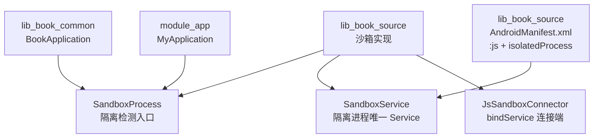
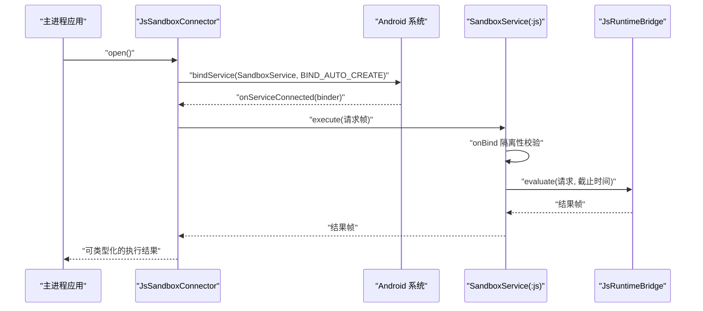
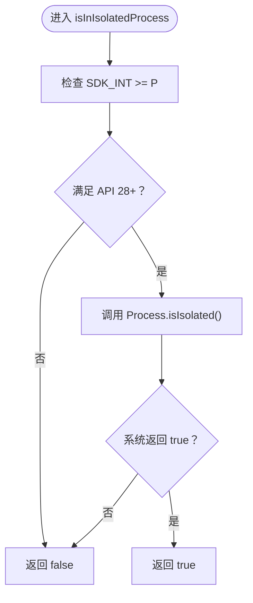
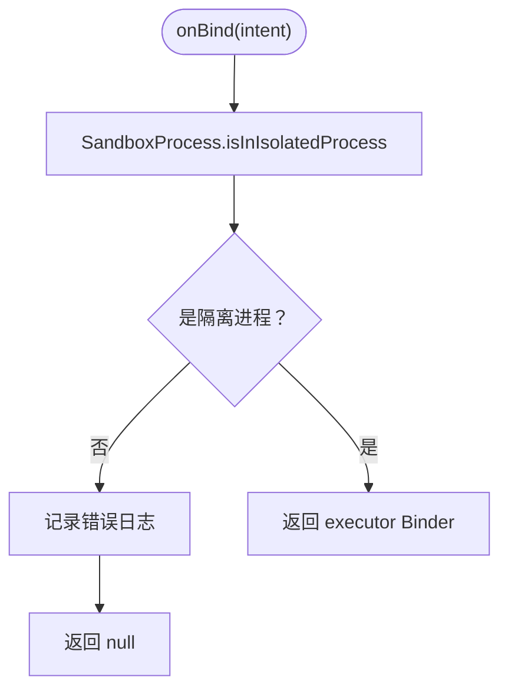
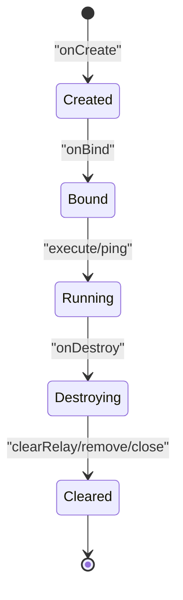
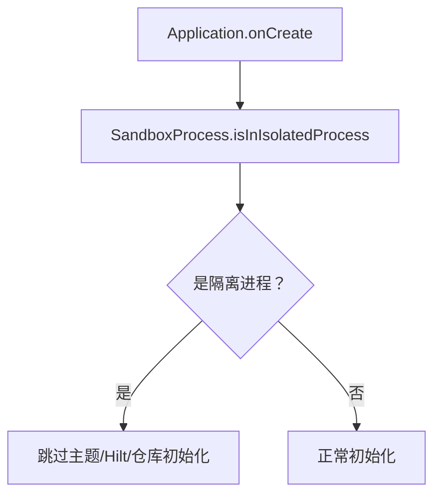
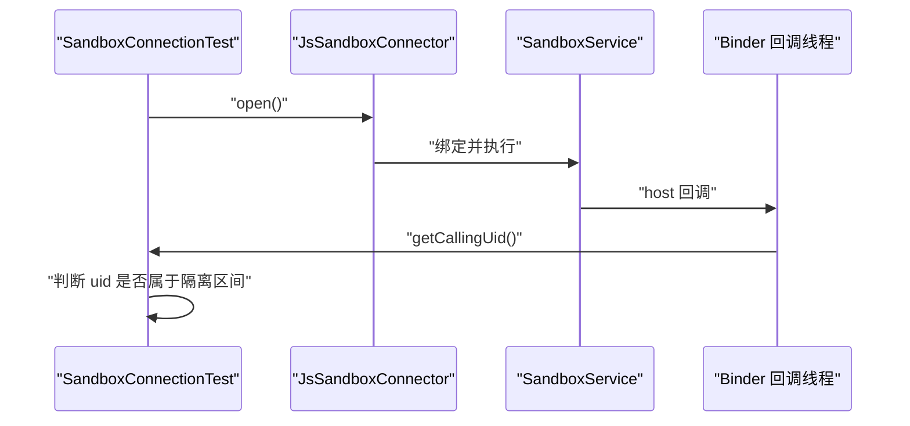
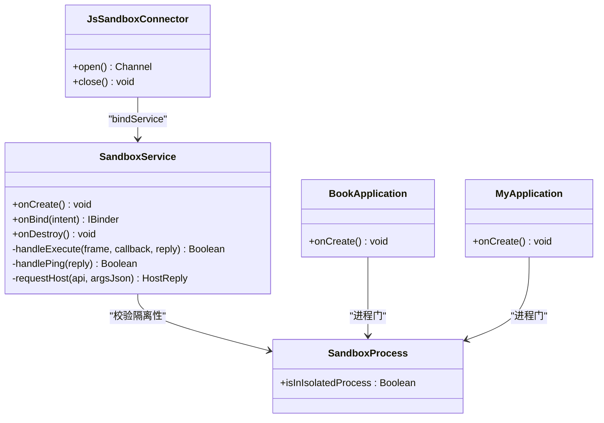

# 进程隔离机制

<cite>
**本文引用的文件**   
- [SandboxProcess.kt](file://lib_book_source/src/main/java/com/ebook/source/sandbox/SandboxProcess.kt)
- [SandboxService.kt](file://lib_book_source/src/main/java/com/ebook/source/sandbox/SandboxService.kt)
- [AndroidManifest.xml](file://lib_book_source/src/main/AndroidManifest.xml)
- [BookApplication.kt](file://lib_book_common/src/main/java/com/ebook/common/BookApplication.kt)
- [MyApplication.kt](file://module_app/src/main/java/com/ebook/MyApplication.kt)
- [JsSandboxConnector.kt](file://lib_book_source/src/main/java/com/ebook/source/sandbox/JsSandboxConnector.kt)
- [SandboxConnectionTest.kt](file://lib_book_source/src/androidTest/java/com/ebook/source/sandbox/SandboxConnectionTest.kt)
- [0028-untrusted-js-sandbox.md](file://docs/adr/0028-untrusted-js-sandbox.md)
</cite>

## 目录
1. [引言](#引言)
2. [项目结构](#项目结构)
3. [核心组件](#核心组件)
4. [架构总览](#架构总览)
5. [详细组件分析](#详细组件分析)
6. [依赖关系分析](#依赖关系分析)
7. [性能与资源特性](#性能与资源特性)
8. [故障排查指南](#故障排查指南)
9. [结论](#结论)

## 引言
本文件聚焦 JavaScript 沙箱执行器的「进程隔离」安全边界。它解释为什么脚本代码不能在主进程中运行、系统如何把执行器放在一个零权限的 Android 隔离进程中，以及应用如何确保「清单上的隔离声明」和「运行时自检」同时生效。文档覆盖：

- `SandboxProcess.isInIsolatedProcess` 的检测逻辑、API 版本短路与单测兼容性。
- `SandboxService` 在 `:js` 隔离进程中的生命周期、`onBind` 隔离性校验、`onCreate/onDestroy` 资源清理。
- 使用「是否被系统隔离」而非「进程名匹配」的原因与误判后果。
- `android:isolatedProcess="true"` 与 Service 声明的配合要求。
- 进程崩溃恢复、资源泄漏防护与调试诊断方法。
- 常见陷阱与排错清单。

## 项目结构
与进程隔离直接相关的代码集中在 `lib_book_source` 模块的沙箱包中，并由 `lib_book_common` 与 `module_app` 在 Application 启动阶段接入进程门；清单声明位于库清单，合并后由应用进程装配。

**图示来源**
- [SandboxProcess.kt:1-28](file://lib_book_source/src/main/java/com/ebook/source/sandbox/SandboxProcess.kt#L1-L28)
- [SandboxService.kt:1-210](file://lib_book_source/src/main/java/com/ebook/source/sandbox/SandboxService.kt#L1-L210)
- [JsSandboxConnector.kt:1-140](file://lib_book_source/src/main/java/com/ebook/source/sandbox/JsSandboxConnector.kt#L1-L140)
- [BookApplication.kt:1-64](file://lib_book_common/src/main/java/com/ebook/common/BookApplication.kt#L1-L64)
- [MyApplication.kt:1-66](file://module_app/src/main/java/com/ebook/MyApplication.kt#L1-L66)
- [AndroidManifest.xml:1-23](file://lib_book_source/src/main/AndroidManifest.xml#L1-L23)

**章节来源**
- [0028-untrusted-js-sandbox.md:1-65](file://docs/adr/0028-untrusted-js-sandbox.md#L1-L65)
- [AndroidManifest.xml:1-23](file://lib_book_source/src/main/AndroidManifest.xml#L1-L23)

## 核心组件
本节只讨论与“进程隔离”直接相关的最小职责集合。

| 组件 | 职责 | 关键行为 |
|---|---|---|
| `SandboxProcess` | 提供当前进程是否为系统隔离进程的单一判断入口 | 先检查 SDK 版本，再调用 `Process.isIsolated()` |
| `SandboxService` | `:js` 隔离进程内唯一的 Binder 服务 | `onBind` 拒绝非隔离进程；`onCreate` 安装宿主回调中继；`onDestroy` 清理中继、回调与桥接层 |
| `JsSandboxConnector` | 主进程侧发起 `bindService` 并建立通道 | 使用自动创建绑定拉起隔离进程；为连接超时和断连提供统一语义 |
| `BookApplication` / `MyApplication` | 应用启动进程门 | 在隔离进程跳过主题、Hilt 注入与内容仓库对账等不可用初始化 |
| `AndroidManifest.xml` | 声明 `:js` 隔离 Service | 配置 `android:isolatedProcess="true"`、`exported="false"`、`android:process=":js"` |

**章节来源**
- [SandboxProcess.kt:1-28](file://lib_book_source/src/main/java/com/ebook/source/sandbox/SandboxProcess.kt#L1-L28)
- [SandboxService.kt:1-210](file://lib_book_source/src/main/java/com/ebook/source/sandbox/SandboxService.kt#L1-L210)
- [JsSandboxConnector.kt:1-140](file://lib_book_source/src/main/java/com/ebook/source/sandbox/JsSandboxConnector.kt#L1-L140)
- [BookApplication.kt:1-64](file://lib_book_common/src/main/java/com/ebook/common/BookApplication.kt#L1-L64)
- [MyApplication.kt:1-66](file://module_app/src/main/java/com/ebook/MyApplication.kt#L1-L66)
- [AndroidManifest.xml:1-23](file://lib_book_source/src/main/AndroidManifest.xml#L1-L23)

## 架构总览
JavaScript 沙箱的安全模型不是靠“约定不访问网络或文件”，而是让系统内核把执行器进程切到一个独立 uid 和受限 SELinux 域中。主进程通过 Binder 协议向隔离进程发送脚本请求，脚本只能看到白名单能力；一旦原生层出现漏洞，攻击面也被限制在零权限执行器进程内，而不是主业务进程。

**图示来源**
- [JsSandboxConnector.kt:1-140](file://lib_book_source/src/main/java/com/ebook/source/sandbox/JsSandboxConnector.kt#L1-L140)
- [SandboxService.kt:1-210](file://lib_book_source/src/main/java/com/ebook/source/sandbox/SandboxService.kt#L1-L210)
- [0028-untrusted-js-sandbox.md:1-65](file://docs/adr/0028-untrusted-js-sandbox.md#L1-L65)

## 详细组件分析

### SandboxProcess：隔离检测入口
`SandboxProcess` 是一个对象级单例入口，集中了所有模块对“当前进程是否被系统隔离”的判断。它的实现只有两件事：

1. **SDK 前置判断**：`Build.VERSION.SDK_INT >= Build.VERSION_CODES.P`。
2. **系统 API 调用**：`Process.isIsolated()`。

设计要点如下：

- **短路顺序不可调换**。`Process.isIsolated()` 只在 Android P（API 28）及以上可用；如果写成先调用 API 再判断 SDK，minSdk 为 26 或 27 的设备会在首次进入该函数时抛出 NoSuchMethodError。
- **单测兼容**。JVM 单测环境里 `SDK_INT` 读作 0，整条表达式恒为 false，因此不会触发 mockable jar 中未实现的 `Process.isIsolated()` 桩。这使 Application 类可以在 JVM 上被实例化而不崩溃。
- **唯一入口原则**。注释明确指出该判据有四个调用点，分属执行器自检、两个 Application 进程门和设备用例。把它收敛到一处，可以避免多处重复写 SDK 门槛导致漏改。
- **失败即安全**。当返回 false 时，上层应视为“没有确凿证据表明这是隔离进程”，从而走 fail-closed 路径，而不是假设自己是安全的。

**图示来源**
- [SandboxProcess.kt:1-28](file://lib_book_source/src/main/java/com/ebook/source/sandbox/SandboxProcess.kt#L1-L28)

**章节来源**
- [SandboxProcess.kt:1-28](file://lib_book_source/src/main/java/com/ebook/source/sandbox/SandboxProcess.kt#L1-L28)
- [0028-untrusted-js-sandbox.md:1-65](file://docs/adr/0028-untrusted-js-sandbox.md#L1-L65)

### SandboxService：隔离进程的生命周期
`SandboxService` 是 `:js` 进程内的唯一组件。它刻意保持薄层：负责解析 Parcel、调度任务、回写结果、中继宿主调用；真正的 QuickJS 引擎和限流策略下沉到 `JsRuntimeBridge` 与 `HostDispatcher`。

#### onBind：隔离性校验
`onBind` 的职责不是建立业务状态，而是做一道最终安全门：

- 如果 `!SandboxProcess.isInIsolatedProcess`，记录错误日志并返回 null。
- 返回 null 意味着主进程拿不到可用的 Binder，最终表现为一次连接超时。
- 这种设计的语义是：**宁可报“沙箱不可用”，也不在不设防的进程里运行别人提供的脚本**。

**图示来源**
- [SandboxService.kt:120-170](file://lib_book_source/src/main/java/com/ebook/source/sandbox/SandboxService.kt#L120-L170)
- [SandboxProcess.kt:1-28](file://lib_book_source/src/main/java/com/ebook/source/sandbox/SandboxProcess.kt#L1-L28)

#### onCreate：安装宿主回调中继
隔离进程需要把脚本的宿主调用转交给主进程处理。`onCreate` 中调用 `HostDispatcher.installRelay`，把“需要回到主进程的能力”注册到执行器进程内部的分发器中。这样脚本侧可以通过白名单 Host API 触发受限网络、递归求值等能力，而具体实现仍由主进程控制。

#### onDestroy：资源清理
销毁阶段必须回收三类资源：

1. **宿主回调中继**：`HostDispatcher.clearRelay()`。
2. **线程局部变量**：`currentCallback.remove()`，避免跨任务污染。
3. **桥接层资源**：`bridge.close()`，释放 JS runtime 相关资源。

**图示来源**
- [SandboxService.kt:100-210](file://lib_book_source/src/main/java/com/ebook/source/sandbox/SandboxService.kt#L100-L210)

**章节来源**
- [SandboxService.kt:1-210](file://lib_book_source/src/main/java/com/ebook/source/sandbox/SandboxService.kt#L1-L210)

### 清单声明：android:isolatedProcess 与 Service 配合
库清单中声明了 `SandboxService`，并配套三个关键字段：

| 属性 | 作用 | 注意事项 |
|---|---|---|
| `android:isolatedProcess="true"` | 让系统以隔离 uid 运行该 Service 所在进程 | 这是内核强制的零权限基础 |
| `android:process=":js"` | 指定隔离进程名 | 进程名由系统生成且可能变化，不能作为运行时判据 |
| `android:exported="false"` | 禁止其他应用通过 Intent 启动或绑定 | 协议本身没有鉴权，必须关闭公开暴露 |

清单注释还强调“只绑不启”：隔离服务不支持 `startService`，应由 `bindService` 加 `BIND_AUTO_CREATE` 拉起。

**章节来源**
- [AndroidManifest.xml:1-23](file://lib_book_source/src/main/AndroidManifest.xml#L1-L23)
- [0028-untrusted-js-sandbox.md:1-65](file://docs/adr/0028-untrusted-js-sandbox.md#L1-L65)

### 为什么不用“进程名匹配”
代码明确选择“是否被系统隔离”作为判据，而不是判断进程名是否为 `:js`。原因包括：

1. **进程名不稳定**：系统生成的进程名会随版本和实现变化，名称比对容易失效。
2. **问题本质不同**：真正要问的是“这个进程有没有被削减能力”，而不是“它叫什么名字”。
3. **误判代价不对称**：
   - 如果在主进程误判为非隔离，可能让整个 App 无法完成初始化。
   - 如果在隔离进程误判为已隔离但实际不是，脚本就能获得不该有的能力，静默破坏整个安全边界。
4. **防御纵深**：即使有人误把实现从 `android:isolatedProcess` 退化为普通 `android:process`，`onBind` 的运行时自检仍能阻止在非隔离进程暴露 Binder。

**章节来源**
- [SandboxProcess.kt:1-28](file://lib_book_source/src/main/java/com/ebook/source/sandbox/SandboxProcess.kt#L1-L28)
- [SandboxService.kt:120-170](file://lib_book_source/src/main/java/com/ebook/source/sandbox/SandboxService.kt#L120-L170)
- [0028-untrusted-js-sandbox.md:1-65](file://docs/adr/0028-untrusted-js-sandbox.md#L1-L65)

### Application 进程门：防止隔离进程做无用初始化
Android 框架在隔离进程中也可能会实例化 `Application`，但只会跳过少数系统初始化步骤，不会跳过完整的 `makeApplicationInner`。因此，`BookApplication` 和 `MyApplication` 必须在构造函数之后尽早检查 `SandboxProcess.isInIsolatedProcess`：

- 在隔离进程中：跳过主题装配、Hilt 注入、内容仓库对账等依赖 SharedPreferences、Room、网络或 UI 的初始化。
- 在主进程中：绝不能因为误判而跳过这些初始化，否则会出现“App 能打开但没有功能”的问题。

**图示来源**
- [BookApplication.kt:1-64](file://lib_book_common/src/main/java/com/ebook/common/BookApplication.kt#L1-L64)
- [MyApplication.kt:1-66](file://module_app/src/main/java/com/ebook/MyApplication.kt#L1-L66)
- [SandboxProcess.kt:1-28](file://lib_book_source/src/main/java/com/ebook/source/sandbox/SandboxProcess.kt#L1-L28)

**章节来源**
- [BookApplication.kt:1-64](file://lib_book_common/src/main/java/com/ebook/common/BookApplication.kt#L1-L64)
- [MyApplication.kt:1-66](file://module_app/src/main/java/com/ebook/MyApplication.kt#L1-L66)
- [0028-untrusted-js-sandbox.md:1-65](file://docs/adr/0028-untrusted-js-sandbox.md#L1-L65)

### 单测与设备用例：验证隔离性不只是纸面规则
`SandboxConnectionTest` 不仅测试脚本能否执行，还验证“拉起来的进程确实被系统隔离”。其核心思路是：

1. 通过 `JsSandboxConnector` 拉起 `:js` 进程。
2. 执行脚本并触发一次 host 回调。
3. 在回调中读取 `Binder.getCallingUid()`。
4. 在 API 34+ 使用 `Process.isIsolatedUid(callingUid)` 判断；低版本则判断“不等于主进程 uid”。
5. 若回调成功拿到隔离 uid，说明清单配置、Service 绑定和隔离进程启动都生效。

**图示来源**
- [SandboxConnectionTest.kt:1-132](file://lib_book_source/src/androidTest/java/com/ebook/source/sandbox/SandboxConnectionTest.kt#L1-L132)

**章节来源**
- [SandboxConnectionTest.kt:1-132](file://lib_book_source/src/androidTest/java/com/ebook/source/sandbox/SandboxConnectionTest.kt#L1-L132)

## 依赖关系分析

**图示来源**
- [SandboxProcess.kt:1-28](file://lib_book_source/src/main/java/com/ebook/source/sandbox/SandboxProcess.kt#L1-L28)
- [SandboxService.kt:1-210](file://lib_book_source/src/main/java/com/ebook/source/sandbox/SandboxService.kt#L1-L210)
- [JsSandboxConnector.kt:1-140](file://lib_book_source/src/main/java/com/ebook/source/sandbox/JsSandboxConnector.kt#L1-L140)
- [BookApplication.kt:1-64](file://lib_book_common/src/main/java/com/ebook/common/BookApplication.kt#L1-L64)
- [MyApplication.kt:1-66](file://module_app/src/main/java/com/ebook/MyApplication.kt#L1-L66)

## 性能与资源特性
- **连接开销与超时分离**：Binder 连接超时不应与脚本执行的挂钟预算混用。连接失败应尽快报告“沙箱不可用”，以便调用方走降级话术，而不是让一次冷启动吃掉整条规则的长时间预算。
- **仅绑不启**：隔离进程由 `bindService` 拉起，每次 open 是一次独立绑定，旧连接在 close 时解绑，避免重连时旧 Connection 干扰新连接。
- **任务边界重置**：每次 execute 前重建 JSContext，复用 JSRuntime，但全局量与闭包不在任务间共享，防止脚本互相污染。
- **资源清理**：`onDestroy` 必须清理 HostDispatcher、ThreadLocal 和桥接层，否则隔离进程重启后会残留状态或泄露资源。
- **并发不变式**：binder 线程池默认最多 15 条线程，但“同一时刻只有一帧在执行”的保证来自客户端锁，不是服务端。放开并发约束会改变字节上限和回调深度等安全参数的含义。

**章节来源**
- [0028-untrusted-js-sandbox.md:1-65](file://docs/adr/0028-untrusted-js-sandbox.md#L1-L65)
- [SandboxService.kt:1-210](file://lib_book_source/src/main/java/com/ebook/source/sandbox/SandboxService.kt#L1-L210)
- [JsSandboxConnector.kt:1-140](file://lib_book_source/src/main/java/com/ebook/source/sandbox/JsSandboxConnector.kt#L1-L140)

## 故障排查指南

### 症状一：主进程一直报“沙箱不可用”或连接超时
可能原因：

- 清单中缺少 `android:isolatedProcess="true"`。
- Service 被禁用或被系统杀死，`bindService` 无法拉起。
- 目标设备上 `Process.isIsolated()` 行为异常，但更常见的是清单或 Service 声明不一致。
- `JsSandboxConnector` 的连接超时过短，冷启动进程来不及就绪。

定位建议：

1. 检查合并后的清单是否包含 `android:isolatedProcess="true"`、`android:process=":js"`、`android:exported="false"`。
2. 查看主进程日志中是否有“等待 :js 执行器连接超时”。
3. 确认主进程没有尝试 `startService`，应使用 `bindService` 加自动创建。
4. 在设备用例中观察是否能成功拉起隔离进程并拿到回调 uid。

**章节来源**
- [AndroidManifest.xml:1-23](file://lib_book_source/src/main/AndroidManifest.xml#L1-L23)
- [JsSandboxConnector.kt:1-140](file://lib_book_source/src/main/java/com/ebook/source/sandbox/JsSandboxConnector.kt#L1-L140)
- [SandboxConnectionTest.kt:1-132](file://lib_book_source/src/androidTest/java/com/ebook/source/sandbox/SandboxConnectionTest.kt#L1-L132)

### 症状二：脚本能执行，但隔离性没有保障
危险信号：

- `SandboxService.onBind` 不再检查 `SandboxProcess.isInIsolatedProcess`。
- 有人把实现从 `android:isolatedProcess` 改为普通 `android:process`，却没有同步移除运行时自检。
- 进程名匹配逻辑被引入，并在主进程或未知进程中被误判。

安全后果：

- 脚本可能读取应用私有数据。
- 原生层漏洞可直接影响主进程。
- 安全边界从“内核强制”退化为“代码约定”。

修复原则：

- 保留 `android:isolatedProcess="true"`。
- 保留 `onBind` 中的隔离性校验。
- 不要以进程名作为安全判据。

**章节来源**
- [SandboxService.kt:120-170](file://lib_book_source/src/main/java/com/ebook/source/sandbox/SandboxService.kt#L120-L170)
- [SandboxProcess.kt:1-28](file://lib_book_source/src/main/java/com/ebook/source/sandbox/SandboxProcess.kt#L1-L28)
- [0028-untrusted-js-sandbox.md:1-65](file://docs/adr/0028-untrusted-js-sandbox.md#L1-L65)

### 症状三：隔离进程启动后报大量 SharedPreferences 或 Room 初始化失败
原因：

- Application 进程门没有早于 Hilt 字段注入之前返回。
- 在隔离进程里继续执行主题装配、Hilt 注入、内容仓库对账等依赖本地数据的逻辑。
- 隔离进程没有应用数据目录，任何试图读写主进程私有目录的操作都会失败。

修复：

- 保证 `if (SandboxProcess.isInIsolatedProcess) return` 出现在关键初始化之前。
- 不要在 Application 上使用 eager 的 `@Inject` 字段，除非它们能在隔离进程安全初始化。
- 把需要延迟初始化的仓库逻辑放入 EntryPoint 或按需调用处。

**章节来源**
- [BookApplication.kt:1-64](file://lib_book_common/src/main/java/com/ebook/common/BookApplication.kt#L1-L64)
- [MyApplication.kt:1-66](file://module_app/src/main/java/com/ebook/MyApplication.kt#L1-L66)
- [SandboxProcess.kt:1-28](file://lib_book_source/src/main/java/com/ebook/source/sandbox/SandboxProcess.kt#L1-L28)

### 症状四：隔离进程崩溃但不影响主进程
预期行为：

- 脚本或原生层崩溃发生在 `:js` 进程，主进程通过 Binder 断连感知。
- 主进程应把这类失败归为“不可用并重连”，而不是把崩溃堆栈直接抛给业务层。
- 单测中应保留“两次执行之间不留全局量”的用例，验证任务边界隔离。

排查建议：

- 查看隔离进程日志中是否有原生层崩溃、内存超限或栈溢出。
- 确认桥接层在任务结束后正确 reset 或 close。
- 检查是否存在跨任务的 globalThis 状态泄漏。

**章节来源**
- [SandboxConnectionTest.kt:1-132](file://lib_book_source/src/androidTest/java/com/ebook/source/sandbox/SandboxConnectionTest.kt#L1-L132)
- [SandboxService.kt:100-210](file://lib_book_source/src/main/java/com/ebook/source/sandbox/SandboxService.kt#L100-L210)
- [0028-untrusted-js-sandbox.md:1-65](file://docs/adr/0028-untrusted-js-sandbox.md#L1-L65)

### 症状五：JVM 单测或模拟器构建失败
可能原因：

- 直接调用 `Process.isIsolated()` 而没有先判断 SDK 版本。
- 在 mock 环境中触发了未实现的 Android API。
- 把 SDK 门槛分散到多个模块，某处漏掉导致 minSdk 26/27 设备首次调用崩溃。

修复：

- 始终通过 `SandboxProcess.isInIsolatedProcess` 访问隔离判断。
- 保持 SDK 前置短路在前。
- 不要复制判据逻辑到其他模块。

**章节来源**
- [SandboxProcess.kt:1-28](file://lib_book_source/src/main/java/com/ebook/source/sandbox/SandboxProcess.kt#L1-L28)
- [0028-untrusted-js-sandbox.md:1-65](file://docs/adr/0028-untrusted-js-sandbox.md#L1-L65)

## 结论
JavaScript 沙箱的进程隔离不是“给进程起个特殊名字”，而是让系统内核把一个独立进程放进受限 uid 和 SELinux 域中。代码层面用两层保障这一事实：

1. **清单层**：`android:isolatedProcess="true"` 与 `exported="false"`、`android:process=":js"` 共同定义安全基线。
2. **运行时层**：`SandboxProcess.isInIsolatedProcess` 与 `SandboxService.onBind` 的自我校验确保“即使清单被误改，也不会静默允许脚本在非隔离进程运行”。

维护者应避免引入进程名匹配、避免在隔离进程执行主进程专用初始化、避免把连接超时与脚本执行超时混为一谈。一旦出现“沙箱不可用”，优先怀疑清单与服务声明；一旦出现“脚本能跑但可能越权”，优先怀疑隔离性校验是否被绕过。