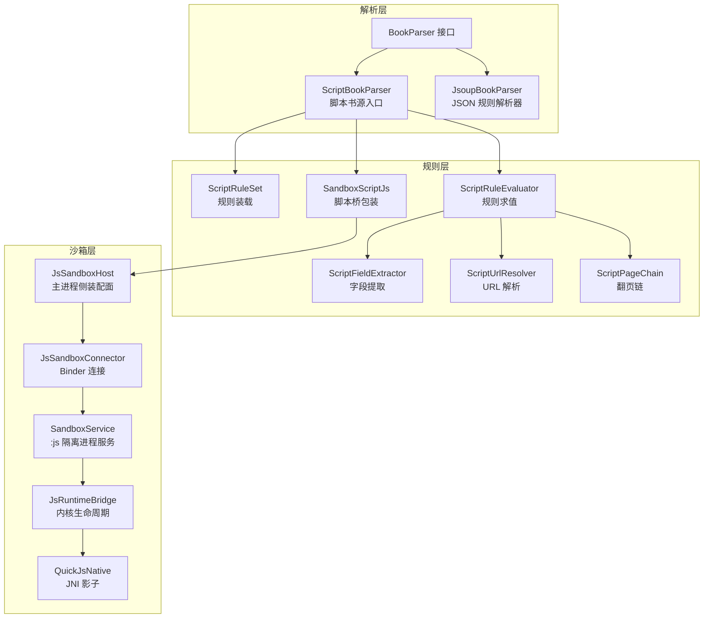
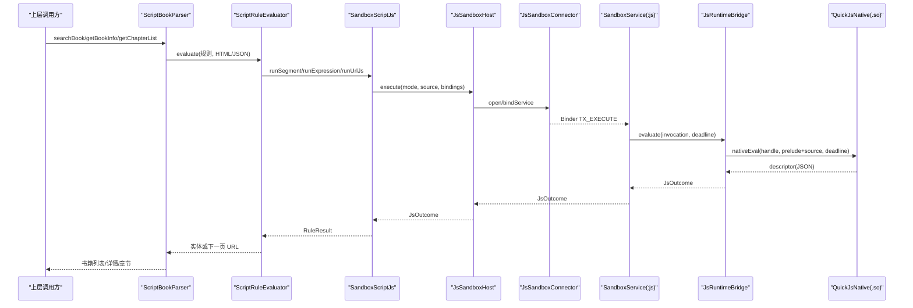
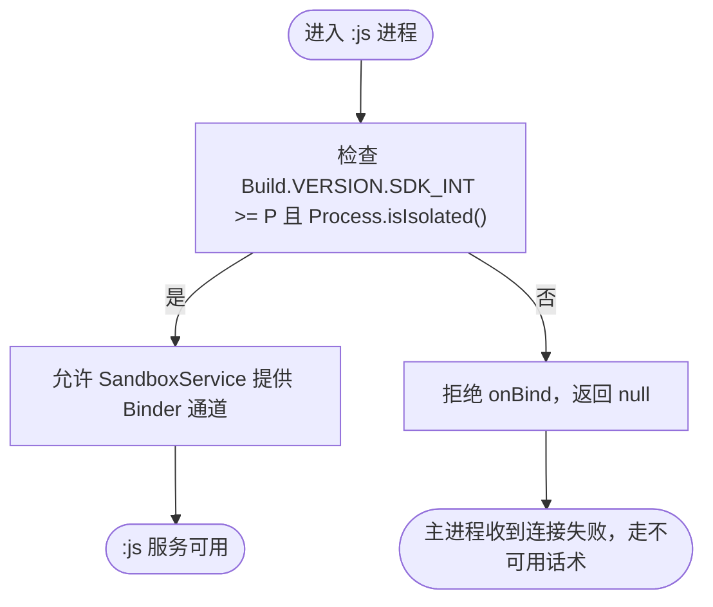
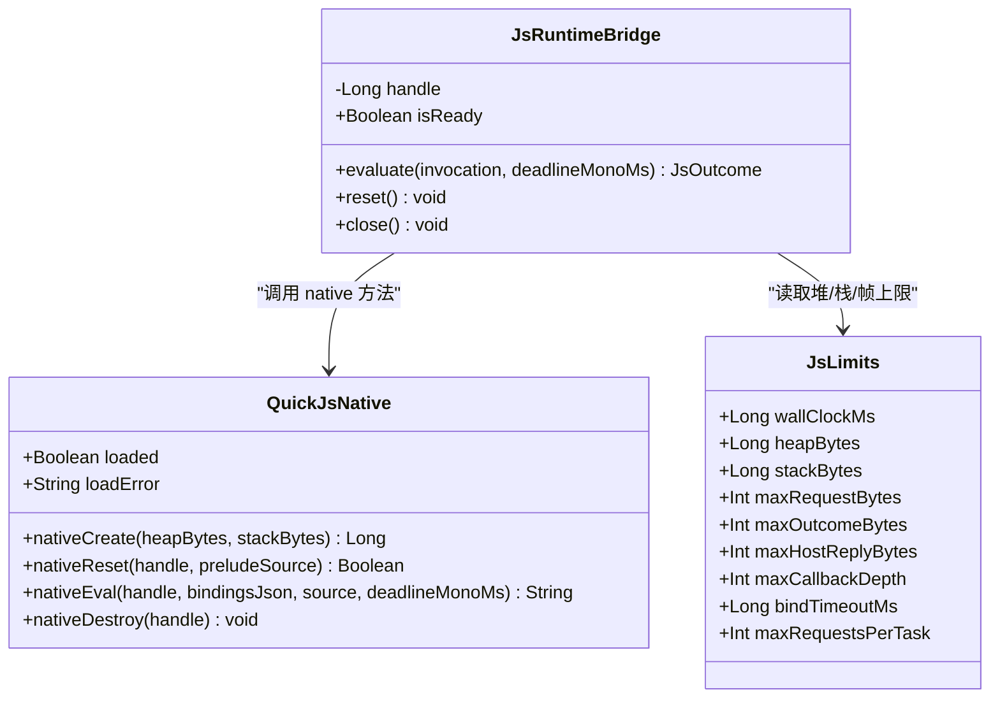
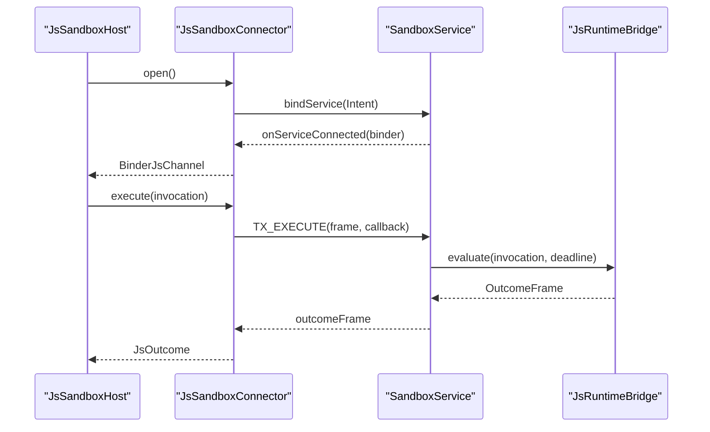
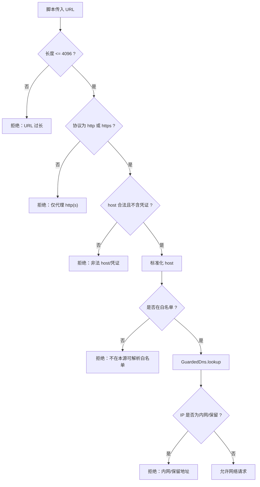
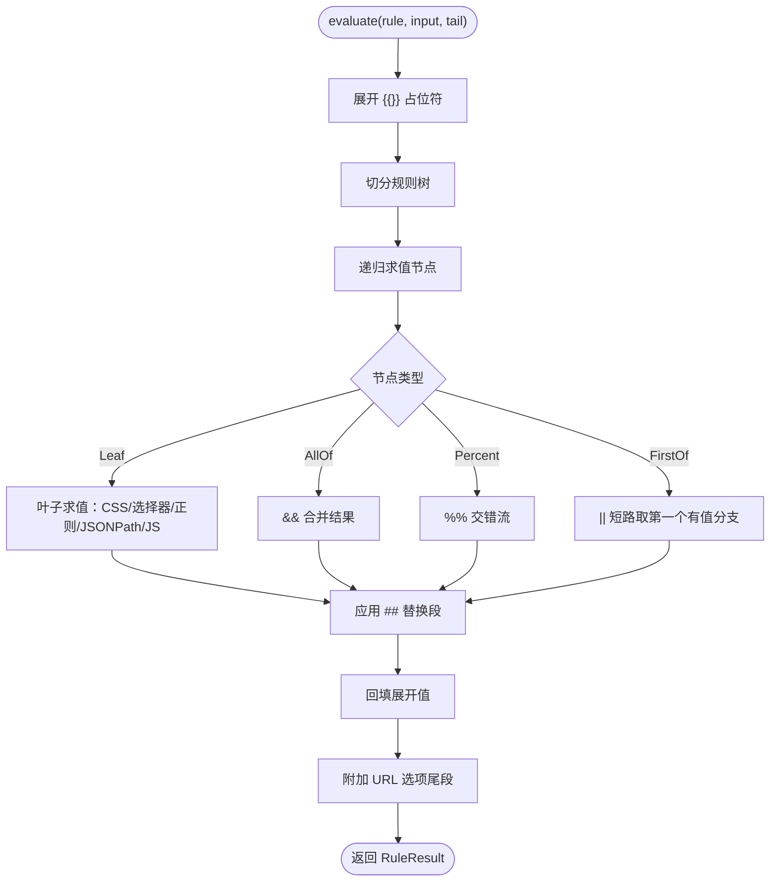
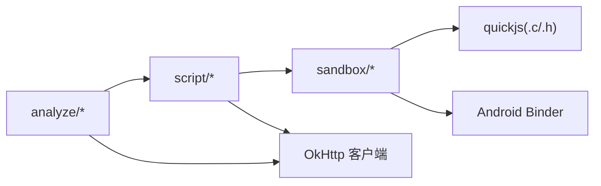

# 书源引擎 lib_book_source

<cite>
**本文引用的文件**   
- [SandboxProcess.kt](file://lib_book_source/src/main/java/com/ebook/source/sandbox/SandboxProcess.kt)
- [JsSandboxHost.kt](file://lib_book_source/src/main/java/com/ebook/source/sandbox/JsSandboxHost.kt)
- [SandboxService.kt](file://lib_book_source/src/main/java/com/ebook/source/sandbox/SandboxService.kt)
- [JsRuntimeBridge.kt](file://lib_book_source/src/main/java/com/ebook/source/sandbox/JsRuntimeBridge.kt)
- [QuickJsNative.kt](file://lib_book_source/src/main/java/com/ebook/source/sandbox/QuickJsNative.kt)
- [JsLimits.kt](file://lib_book_source/src/main/java/com/ebook/source/sandbox/JsLimits.kt)
- [SandboxContract.kt](file://lib_book_source/src/main/java/com/ebook/source/sandbox/SandboxContract.kt)
- [JsProtocol.kt](file://lib_book_source/src/main/java/com/ebook/source/sandbox/JsProtocol.kt)
- [JsSandboxConnector.kt](file://lib_book_source/src/main/java/com/ebook/source/sandbox/JsSandboxConnector.kt)
- [SandboxTaskRunner.kt](file://lib_book_source/src/main/java/com/ebook/source/sandbox/SandboxTaskRunner.kt)
- [HostDispatcher.kt](file://lib_book_source/src/main/java/com/ebook/source/sandbox/HostDispatcher.kt)
- [JsNetworkGuard.kt](file://lib_book_source/src/main/java/com/ebook/source/sandbox/JsNetworkGuard.kt)
- [ScriptRuleSet.kt](file://lib_book_source/src/main/java/com/ebook/source/script/ScriptRuleSet.kt)
- [ScriptRuleEvaluator.kt](file://lib_book_source/src/main/java/com/ebook/source/script/ScriptRuleEvaluator.kt)
- [ScriptFieldExtractor.kt](file://lib_book_source/src/main/java/com/ebook/source/script/ScriptFieldExtractor.kt)
- [ScriptUrlResolver.kt](file://lib_book_source/src/main/java/com/ebook/source/script/ScriptUrlResolver.kt)
- [ScriptPageChain.kt](file://lib_book_source/src/main/java/com/ebook/source/script/ScriptPageChain.kt)
- [SandboxScriptJs.kt](file://lib_book_source/src/main/java/com/ebook/source/script/SandboxScriptJs.kt)
- [ScriptBookParser.kt](file://lib_book_source/src/main/java/com/ebook/source/analyze/ScriptBookParser.kt)
- [JsoupBookParser.kt](file://lib_book_source/src/main/java/com/ebook/source/analyze/JsoupBookParser.kt)
- [BookParser.kt](file://lib_book_source/src/main/java/com/ebook/source/analyze/BookParser.kt)
- [CMakeLists.txt](file://lib_book_source/src/main/cpp/CMakeLists.txt)
</cite>

## 目录
1. [引言](#引言)
2. [项目结构](#项目结构)
3. [核心组件](#核心组件)
4. [架构总览](#架构总览)
5. [详细组件分析](#详细组件分析)
6. [依赖关系分析](#依赖关系分析)
7. [性能考量](#性能考量)
8. [故障排除指南](#故障排除指南)
9. [结论](#结论)
10. [附录：书源开发指南](#附录书源开发指南)

## 引言
本仓库的 `lib_book_source` 是 Android 电子书应用中的“书源引擎”。它同时支持两类书源实现：
- **JSON 规则解析器**：基于 Jsoup 的规则驱动解析，用于传统 JSON 配置书源。
- **JavaScript 沙箱书源**：通过 QuickJS 原生引擎执行受信任脚本，由 Sandboxed 进程隔离、JNI 桥接和多层资源限制共同保障安全。

本文面向读者包括：需要理解沙箱机制的安全工程师、编写 JSON 规则的维护者、开发 JavaScript 书源的作者，以及负责集成 QuickJS 原生的底层工程师。

## 项目结构
`lib_book_source` 按职责划分为三个主要子域：
- `sandbox`：沙箱执行环境、跨进程 Binder 协议、QuickJS 桥接与网络守卫。
- `script`：JSON 规则装载、规则求值、URL 解析、翻页链、字段提取与脚本桥接包装。
- `analyze`：对外暴露的 `BookParser` 实现，串联规则装载、页面取数与实体映射。
- `cpp`：QuickJS 静态库与 JNI 共享库构建脚本。

**图表来源**
- [BookParser.kt:1-30](file://lib_book_source/src/main/java/com/ebook/source/analyze/BookParser.kt#L1-L30)
- [ScriptBookParser.kt:1-200](file://lib_book_source/src/main/java/com/ebook/source/analyze/ScriptBookParser.kt#L1-L200)
- [JsoupBookParser.kt:1-200](file://lib_book_source/src/main/java/com/ebook/source/analyze/JsoupBookParser.kt#L1-L200)
- [ScriptRuleSet.kt:1-200](file://lib_book_source/src/main/java/com/ebook/source/script/ScriptRuleSet.kt#L1-L200)
- [ScriptRuleEvaluator.kt:1-200](file://lib_book_source/src/main/java/com/ebook/source/script/ScriptRuleEvaluator.kt#L1-L200)
- [ScriptFieldExtractor.kt:1-90](file://lib_book_source/src/main/java/com/ebook/source/script/ScriptFieldExtractor.kt#L1-L90)
- [ScriptUrlResolver.kt:1-133](file://lib_book_source/src/main/java/com/ebook/source/script/ScriptUrlResolver.kt#L1-L133)
- [ScriptPageChain.kt:1-57](file://lib_book_source/src/main/java/com/ebook/source/script/ScriptPageChain.kt#L1-L57)
- [SandboxScriptJs.kt:1-200](file://lib_book_source/src/main/java/com/ebook/source/script/SandboxScriptJs.kt#L1-L200)
- [JsSandboxHost.kt:1-60](file://lib_book_source/src/main/java/com/ebook/source/sandbox/JsSandboxHost.kt#L1-L60)
- [JsSandboxConnector.kt:1-142](file://lib_book_source/src/main/java/com/ebook/source/sandbox/JsSandboxConnector.kt#L1-L142)
- [SandboxService.kt:1-200](file://lib_book_source/src/main/java/com/ebook/source/sandbox/SandboxService.kt#L1-L200)
- [JsRuntimeBridge.kt:1-113](file://lib_book_source/src/main/java/com/ebook/source/sandbox/JsRuntimeBridge.kt#L1-L113)
- [QuickJsNative.kt:1-59](file://lib_book_source/src/main/java/com/ebook/source/sandbox/QuickJsNative.kt#L1-L59)

**章节来源**
- [BookParser.kt:1-30](file://lib_book_source/src/main/java/com/ebook/source/analyze/BookParser.kt#L1-L30)
- [ScriptBookParser.kt:1-200](file://lib_book_source/src/main/java/com/ebook/source/analyze/ScriptBookParser.kt#L1-L200)
- [JsoupBookParser.kt:1-200](file://lib_book_source/src/main/java/com/ebook/source/analyze/JsoupBookParser.kt#L1-L200)
- [CMakeLists.txt:1-38](file://lib_book_source/src/main/cpp/CMakeLists.txt#L1-L38)

## 核心组件
本节聚焦五个关键子系统：
1. **JavaScript 沙箱执行环境**：`SandboxProcess`、`SandboxService`、`JsSandboxHost`、`JsSandboxConnector`、`JsRuntimeBridge`、`QuickJsNative`。
2. **JSON 规则解析器**：`ScriptRuleSet`、`ScriptRuleEvaluator`、`ScriptFieldExtractor`、`ScriptUrlResolver`、`ScriptPageChain`。
3. **书源编排器**：`ScriptBookParser`、`JsoupBookParser`。
4. **QuickJS 原生集成**：`CMakeLists.txt`、`QuickJsNative`、`JsRuntimeBridge`。
5. **安全与限制策略**：`JsLimits`、`JsNetworkGuard`、`AddressPolicy`、`SourceHostAllowlist`（间接引用）。

**章节来源**
- [JsLimits.kt:1-58](file://lib_book_source/src/main/java/com/ebook/source/sandbox/JsLimits.kt#L1-L58)
- [JsNetworkGuard.kt:1-167](file://lib_book_source/src/main/java/com/ebook/source/sandbox/JsNetworkGuard.kt#L1-L167)
- [ScriptRuleSet.kt:1-200](file://lib_book_source/src/main/java/com/ebook/source/script/ScriptRuleSet.kt#L1-L200)
- [ScriptRuleEvaluator.kt:1-200](file://lib_book_source/src/main/java/com/ebook/source/script/ScriptRuleEvaluator.kt#L1-L200)
- [ScriptBookParser.kt:1-200](file://lib_book_source/src/main/java/com/ebook/source/analyze/ScriptBookParser.kt#L1-L200)

## 架构总览
系统采用“解析层 → 规则层 → 沙箱层 → 原生层”的分层架构。解析层统一对外暴露 `BookParser`；规则层把 JSON 规则转换为可执行的取值逻辑；沙箱层为 JavaScript 提供受限执行环境；原生层承载 QuickJS 运行时。

**图表来源**
- [ScriptBookParser.kt:1-200](file://lib_book_source/src/main/java/com/ebook/source/analyze/ScriptBookParser.kt#L1-L200)
- [ScriptRuleEvaluator.kt:1-200](file://lib_book_source/src/main/java/com/ebook/source/script/ScriptRuleEvaluator.kt#L1-L200)
- [SandboxScriptJs.kt:1-200](file://lib_book_source/src/main/java/com/ebook/source/script/SandboxScriptJs.kt#L1-L200)
- [JsSandboxHost.kt:1-60](file://lib_book_source/src/main/java/com/ebook/source/sandbox/JsSandboxHost.kt#L1-L60)
- [JsSandboxConnector.kt:1-142](file://lib_book_source/src/main/java/com/ebook/source/sandbox/JsSandboxConnector.kt#L1-L142)
- [SandboxService.kt:1-200](file://lib_book_source/src/main/java/com/ebook/source/sandbox/SandboxService.kt#L1-L200)
- [JsRuntimeBridge.kt:1-113](file://lib_book_source/src/main/java/com/ebook/source/sandbox/JsRuntimeBridge.kt#L1-L113)
- [QuickJsNative.kt:1-59](file://lib_book_source/src/main/java/com/ebook/source/sandbox/QuickJsNative.kt#L1-L59)

## 详细组件分析

### JavaScript 沙箱执行环境

#### 进程隔离与安全边界
沙箱通过 Android 的隔离进程能力运行在独立进程 `:js` 中。`SandboxProcess` 提供唯一入口判断当前进程是否被系统隔离，避免在非隔离进程中误跑不可信脚本。

**图表来源**
- [SandboxProcess.kt:1-28](file://lib_book_source/src/main/java/com/ebook/source/sandbox/SandboxProcess.kt#L1-L28)
- [SandboxService.kt:1-200](file://lib_book_source/src/main/java/com/ebook/source/sandbox/SandboxService.kt#L1-L200)

`SandboxService` 是 `:js` 进程内唯一的 Service，负责：
- 校验 Binder 事务 token 与协议版本。
- 分发 `TX_EXECUTE` 与 `TX_PING`。
- 将脚本的 host 调用同步中继到主进程。
- 控制任务边界重置与响应大小闸门。

**章节来源**
- [SandboxProcess.kt:1-28](file://lib_book_source/src/main/java/com/ebook/source/sandbox/SandboxProcess.kt#L1-L28)
- [SandboxService.kt:1-200](file://lib_book_source/src/main/java/com/ebook/source/sandbox/SandboxService.kt#L1-L200)

#### QuickJS 桥接与内存管理
`QuickJsNative` 是 C++ 层的 Kotlin 影子对象，声明四个 external 方法，分别对应 runtime 创建、context 重置、脚本执行与销毁。加载失败时不抛异常，而是以 `loaded=false` 表示“本机没有可用的 .so”，让上层给出“设备不可用”的可命名结果。

`JsRuntimeBridge` 负责：
- 确保 runtime 已创建。
- 将绑定表序列化为 JSON，并注入 QuickJS 垫片前缀。
- 将 native 返回的描述符解码为 `JsOutcome`。
- 在超时、堆耗尽、栈耗尽后强制重建 context，避免残留状态污染下一条规则。

**图表来源**
- [QuickJsNative.kt:1-59](file://lib_book_source/src/main/java/com/ebook/source/sandbox/QuickJsNative.kt#L1-L59)
- [JsRuntimeBridge.kt:1-113](file://lib_book_source/src/main/java/com/ebook/source/sandbox/JsRuntimeBridge.kt#L1-L113)
- [JsLimits.kt:1-58](file://lib_book_source/src/main/java/com/ebook/source/sandbox/JsLimits.kt#L1-L58)

**章节来源**
- [QuickJsNative.kt:1-59](file://lib_book_source/src/main/java/com/ebook/source/sandbox/QuickJsNative.kt#L1-L59)
- [JsRuntimeBridge.kt:1-113](file://lib_book_source/src/main/java/com/ebook/source/sandbox/JsRuntimeBridge.kt#L1-L113)
- [CMakeLists.txt:1-38](file://lib_book_source/src/main/cpp/CMakeLists.txt#L1-L38)

#### Binder 协议与连接重连
`SandboxContract` 是主进程与 `:js` 进程之间线上形态的唯一事实源，包含接口标识、协议版本与两个事务码。协议使用手写 Parcel 而非 AIDL，目的是审计安全关键路径上的字节布局。

`JsProtocol` 负责请求帧与响应帧的 JSON 编解码，并把 native 描述符映射为 `JsStatus`。它严格禁止忽略未知键，使两侧不同步构建能当场报错。

`JsSandboxConnector` 负责 `bindService`、等待 binder、构造 `BinderJsChannel`，并在超时或系统拒绝绑定时抛出 `SandboxUnavailableException`。

**图表来源**
- [SandboxContract.kt:1-47](file://lib_book_source/src/main/java/com/ebook/source/sandbox/SandboxContract.kt#L1-L47)
- [JsProtocol.kt:1-200](file://lib_book_source/src/main/java/com/ebook/source/sandbox/JsProtocol.kt#L1-L200)
- [JsSandboxConnector.kt:1-142](file://lib_book_source/src/main/java/com/ebook/source/sandbox/JsSandboxConnector.kt#L1-L142)
- [SandboxService.kt:1-200](file://lib_book_source/src/main/java/com/ebook/source/sandbox/SandboxService.kt#L1-L200)
- [JsRuntimeBridge.kt:1-113](file://lib_book_source/src/main/java/com/ebook/source/sandbox/JsRuntimeBridge.kt#L1-L113)

**章节来源**
- [SandboxContract.kt:1-47](file://lib_book_source/src/main/java/com/ebook/source/sandbox/SandboxContract.kt#L1-L47)
- [JsProtocol.kt:1-200](file://lib_book_source/src/main/java/com/ebook/source/sandbox/JsProtocol.kt#L1-L200)
- [JsSandboxConnector.kt:1-142](file://lib_book_source/src/main/java/com/ebook/source/sandbox/JsSandboxConnector.kt#L1-L142)

#### 主机能力白名单与网络守卫
脚本不能直接访问 Java 类或发起裸网络请求。所有能力必须通过 `HostDispatcher` 白名单暴露，例如 base64、md5、cookie、ajax 等。计算型能力由 `HostCompute` 就地处理；需要回主进程的能力由 relay 转发。

`JsNetworkGuard` 对 URL 进行字符串层准入检查，并通过 `GuardedDns` 在 OkHttp DNS 解析阶段再次校验 IP 地址，防止 DNS 重绑攻击。`AddressPolicy` 使用字节级判据屏蔽环回、RFC1918、链路本地、云元数据段、组播与保留段。

**图表来源**
- [HostDispatcher.kt:1-74](file://lib_book_source/src/main/java/com/ebook/source/sandbox/HostDispatcher.kt#L1-L74)
- [JsNetworkGuard.kt:1-167](file://lib_book_source/src/main/java/com/ebook/source/sandbox/JsNetworkGuard.kt#L1-L167)

**章节来源**
- [HostDispatcher.kt:1-74](file://lib_book_source/src/main/java/com/ebook/source/sandbox/HostDispatcher.kt#L1-L74)
- [JsNetworkGuard.kt:1-167](file://lib_book_source/src/main/java/com/ebook/source/sandbox/JsNetworkGuard.kt#L1-L167)

### JSON 规则解析器

#### 规则装载与语法规范
`ScriptRuleSet` 负责装载书源 JSON，识别六类规则对象：搜索、发现、书籍信息、目录、正文，以及未实现的 review。它会记录不支持项与非常规字段（如数组形态的 URL），并为沙箱提供 `sourceBindingJson`。

关键约束包括：
- 顶层非规则 URL 键只接受 `searchUrl` 与 `exploreUrl`。
- 规则字段可以是字符串、数组或对象；只有字符串进入规则表，其他形态记入非常规字段。
- 不支持能力（如登录、webJs、sourceRegex、coverDecodeJs、review 等）会显式登记，便于导入报告说明。

**章节来源**
- [ScriptRuleSet.kt:1-200](file://lib_book_source/src/main/java/com/ebook/source/script/ScriptRuleSet.kt#L1-L200)

#### 规则求值流程
`ScriptRuleEvaluator` 是规则求值的分发中心，遵循规格 §9 的七步流程：
1. 展开 `{{}}` 占位符。
2. 切分规则树。
3. 逐支求值。
4. 合并 `&&`、交错 `%%`、短路 `||`。
5. 应用 `##` 替换段。
6. 回填展开值。
7. 附加 URL 选项尾段。

**图表来源**
- [ScriptRuleEvaluator.kt:1-200](file://lib_book_source/src/main/java/com/ebook/source/script/ScriptRuleEvaluator.kt#L1-L200)

**章节来源**
- [ScriptRuleEvaluator.kt:1-200](file://lib_book_source/src/main/java/com/ebook/source/script/ScriptRuleEvaluator.kt#L1-L200)

#### 字段提取与 URL 落位
`ScriptFieldExtractor` 把列表结果转为条目上下文，支持元素、正则捕获组、JSON 节点与纯文本四种上下文。它负责：
- 单值字段取第一个文本。
- URL 字段剥选项尾段后相对落位。
- 列表字段转发给求值器并以选择器语义出节点集。

`ScriptUrlResolver` 负责 URL 规则串解析，支持：
- 整条 JS URL。
- `{{}}` 展开。
- `<分隔符,内容>` 页码取舍。
- 相对地址三态落位。
- URL 选项尾段解析。

**章节来源**
- [ScriptFieldExtractor.kt:1-90](file://lib_book_source/src/main/java/com/ebook/source/script/ScriptFieldExtractor.kt#L1-L90)
- [ScriptUrlResolver.kt:1-133](file://lib_book_source/src/main/java/com/ebook/source/script/ScriptUrlResolver.kt#L1-L133)

#### 翻页链与分页收敛
`ScriptPageChain` 统一管理 `nextTocUrl` 与 `nextContentUrl` 的下一页逻辑，支持：
- 固定数组页序。
- 字符串规则每页求值。
- 已访问 URL 去重与回环保护。
- 访问键剥离选项尾段，避免同一地址带不同 charset 导致重复请求。

**章节来源**
- [ScriptPageChain.kt:1-57](file://lib_book_source/src/main/java/com/ebook/source/script/ScriptPageChain.kt#L1-L57)

### 书源编排器

#### ScriptBookParser：脚本书源入口
`ScriptBookParser` 是脚本书源的主入口，职责包括：
- 惰性装载 `ScriptRuleSet`，保证构造期不抛错。
- 组装 `ScriptRuleEvaluator`、`ScriptFieldExtractor`、`ScriptPageFetcher`。
- 生成沙箱传输通道，并注入 `GuardedDns` 与 CookieJar。
- 封装搜索、详情、目录、发现、正文等五类解析链路。

特别注意：当本机未装配沙箱时，含 JS 的规则会报“待执行”，而不是静默失败。

**章节来源**
- [ScriptBookParser.kt:1-200](file://lib_book_source/src/main/java/com/ebook/source/analyze/ScriptBookParser.kt#L1-L200)

#### JsoupBookParser：JSON 规则解析器
`JsoupBookParser` 是基于 Jsoup 的传统 JSON 规则解析器，负责：
- 搜索 URL 渲染与表单参数替换。
- 搜索列表与书籍详情解析。
- 目录翻页与章节反转。
- 分类书籍与书库数据抓取。

它对外暴露 `BookParser` 接口，与 `ScriptBookParser` 并列存在，但内部不使用 QuickJS。

**章节来源**
- [JsoupBookParser.kt:1-200](file://lib_book_source/src/main/java/com/ebook/source/analyze/JsoupBookParser.kt#L1-L200)
- [BookParser.kt:1-30](file://lib_book_source/src/main/java/com/ebook/source/analyze/BookParser.kt#L1-L30)

### 资源限制策略
`JsLimits` 集中定义八类限制：
- 挂钟时限：防死循环。
- QuickJS 堆上限：8 MB。
- QuickJS 栈上限：1 MB。
- 请求帧上限：900 KB。
- 响应帧上限：900 KB。
- host 回调响应上限：900 KB。
- 回调重入深度上限：8。
- 连接超时：2 秒。
- 单任务网络请求次数上限：40。

这些数字的尺子不是单纯“内存”，而是 binder 事务缓冲、JSON 解析内存与线程栈容量。

**章节来源**
- [JsLimits.kt:1-58](file://lib_book_source/src/main/java/com/ebook/source/sandbox/JsLimits.kt#L1-L58)
- [SandboxTaskRunner.kt:1-69](file://lib_book_source/src/main/java/com/ebook/source/sandbox/SandboxTaskRunner.kt#L1-L69)

## 依赖关系分析

**图表来源**
- [ScriptBookParser.kt:1-200](file://lib_book_source/src/main/java/com/ebook/source/analyze/ScriptBookParser.kt#L1-L200)
- [JsoupBookParser.kt:1-200](file://lib_book_source/src/main/java/com/ebook/source/analyze/JsoupBookParser.kt#L1-L200)
- [SandboxService.kt:1-200](file://lib_book_source/src/main/java/com/ebook/source/sandbox/SandboxService.kt#L1-L200)
- [CMakeLists.txt:1-38](file://lib_book_source/src/main/cpp/CMakeLists.txt#L1-L38)

耦合特点：
- 解析层依赖规则层，但不直接依赖沙箱；脚本书源通过 `JsSandboxHost` 注入。
- 沙箱层与原生层通过 `QuickJsNative` 外部函数解耦。
- 网络守卫与 DNS 拦截位于沙箱层，阻止脚本绕过白名单。
- 规则层与沙箱层通过 `JsInvocation`/`JsOutcome` 的 JSON 契约通信。

潜在风险点：
- Binder 协议两端必须同一次构建，否则 `ignoreUnknownKeys=false` 会直接报错。
- 沙箱连接超时与规则挂钟是两个独立超时，不应混用。
- 翻页链与 URL 选项尾段口径必须一致，否则会出现“地址相同但选项不同”的重复请求。

**章节来源**
- [ScriptRuleSet.kt:1-200](file://lib_book_source/src/main/java/com/ebook/source/script/ScriptRuleSet.kt#L1-L200)
- [JsProtocol.kt:1-200](file://lib_book_source/src/main/java/com/ebook/source/sandbox/JsProtocol.kt#L1-L200)
- [ScriptPageChain.kt:1-57](file://lib_book_source/src/main/java/com/ebook/source/script/ScriptPageChain.kt#L1-L57)

## 性能考量
- **惰性装载**：`ScriptRuleSet.load`、`ScriptBookParser.rules`、`ScriptBookParser.fetcher`、`ScriptBookParser.allowlist` 均采用惰性初始化，避免构造期解析大 JSON。
- **单次 Binder 串行化**：主进程通过 `inFlight` 锁串行化 execute，保证 Binder 事务不会并发破坏帧顺序，也使 `ThreadLocal` 回调通道成为可能。
- **Context 复用与重建**：QuickJS 每次执行前重建 context，避免上一条规则残留；重建成本是一次 context 分配，摊薄到整页请求不构成瓶颈。
- **DNS 重绑防护代价极低**：`GuardedDns` 只在 OkHttp 解析阶段做一次 IP 归属判定，默认实现不缓存解析结果，避免 TTL=0 的重绑攻击。
- **帧大小先于 JSON 解码**：`JsProtocol.decodeOutcome` 先测 UTF-8 字节长度，再解析 JSON，防止超大报文在解码阶段撑爆进程内存。

[本节为通用性能指导，不直接分析具体代码行]

## 故障排除指南

### 常见问题与定位建议

| 现象 | 可能原因 | 排查步骤 |
|---|---|---|
| 书源显示“不可用” | `.so` 未加载、ABI 不匹配、Kotlin 与 native 不同步 | 查看 `QuickJsNative.loaded` 与 `loadError`；确认 androidTest 或 release 包是否打包 ebook_js.so |
| 沙箱连接超时 | 当前进程未标记 `android:isolatedProcess="true"`，或系统拒绝绑定 | 检查清单中 `SandboxService` 所在进程的隔离属性；查看 `SandboxProcess.isInIsolatedProcess` |
| 脚本报“协议版本不合” | 主进程与 `:js` 进程来自不同构建产物 | 重新编译整个模块，确保 `SandboxContract.PROTOCOL_VERSION` 两侧一致 |
| URL 白名单拒绝 | host 不在 `SourceHostAllowlist`，或 IP 属于内网/保留段 | 检查书源配置的 `ruleSearch/ruleContent` 等规则文本导出的 host；查看 `JsNetworkGuard.check` 日志 |
| 正文解析为空 | JS 表达式返回对象或数组，无法作为文本回填 | 检查 `runExpression` 与 `runBodyJs` 的完成值形态；确保脚本返回标量或字符串 |
| 翻页重复请求 | URL 选项尾段未剥离导致访问键不同 | 检查 `visitKeyOf` 与 `ScriptUrlOption.splitTail` 的使用位置 |
| 单任务网络过多 | 脚本出现无限 ajax 循环 | 检查 `maxRequestsPerTask=40`；在 `JsCallbackProxy` 计数处定位触发阈值 |

**章节来源**
- [QuickJsNative.kt:1-59](file://lib_book_source/src/main/java/com/ebook/source/sandbox/QuickJsNative.kt#L1-L59)
- [SandboxProcess.kt:1-28](file://lib_book_source/src/main/java/com/ebook/source/sandbox/SandboxProcess.kt#L1-L28)
- [SandboxContract.kt:1-47](file://lib_book_source/src/main/java/com/ebook/source/sandbox/SandboxContract.kt#L1-L47)
- [JsNetworkGuard.kt:1-167](file://lib_book_source/src/main/java/com/ebook/source/sandbox/JsNetworkGuard.kt#L1-L167)
- [ScriptPageChain.kt:1-57](file://lib_book_source/src/main/java/com/ebook/source/script/ScriptPageChain.kt#L1-L57)
- [JsLimits.kt:1-58](file://lib_book_source/src/main/java/com/ebook/source/sandbox/JsLimits.kt#L1-L58)

## 结论
`lib_book_source` 的书源引擎通过分层设计把“规则可读性”“脚本灵活性”“进程安全性”“原生性能”组合在一起：
- 规则层提供稳定、可测试、可回溯的 JSON 规则求值体系。
- 沙箱层通过隔离进程、Binder 协议、白名单、DNS 拦截与多维限幅，把不可信脚本限制在可控范围内。
- 原生层借助 QuickJS 提供高性能脚本执行，并通过严格的 context 生命周期管理避免状态污染。
- 解析层统一对外暴露 `BookParser`，让上层无需关心书源是 JSON 规则还是 JavaScript。

对于书源维护者，最重要的原则是：**规则尽量简洁、JS 只处理复杂逻辑、URL 写清协议与 host、正文清洗放在规则或 bodyJs，不要绕过白名单**。

[本节为总结性内容，不直接分析具体代码行]

## 附录：书源开发指南

### JSON 规则编写要点
- 优先使用 `ruleSearch`、`ruleBookInfo`、`ruleToc`、`ruleContent` 四类规则。
- 列表字段使用 CSS 选择器或正则 AllInOne；单值字段使用取值器如 `@text`、`@html`、`@href`。
- URL 字段注意相对落位与选项尾段；翻页字段注意空值即停止、已访问即停止。
- 若规则中包含 JS，请确保目标设备具备 `.so` 与隔离进程支持，否则该部分会报“待执行”。

参考文件：
- [ScriptRuleSet.kt:1-200](file://lib_book_source/src/main/java/com/ebook/source/script/ScriptRuleSet.kt#L1-L200)
- [ScriptFieldExtractor.kt:1-90](file://lib_book_source/src/main/java/com/ebook/source/script/ScriptFieldExtractor.kt#L1-L90)
- [ScriptUrlResolver.kt:1-133](file://lib_book_source/src/main/java/com/ebook/source/script/ScriptUrlResolver.kt#L1-L133)
- [ScriptPageChain.kt:1-57](file://lib_book_source/src/main/java/com/ebook/source/script/ScriptPageChain.kt#L1-L57)

### JavaScript 脚本开发模式
- 使用 `@js:` 段处理复杂正文清洗。
- 使用 `{{}}` 插入变量与嵌套规则。
- 使用 `url/js` 改写请求头与地址。
- 使用 `bodyJs` 改写响应体。
- 使用 `init` 的 JS 分支返回对象字段。
- 通过宿主提供的 `java.*` 能力访问基础工具，但不要尝试绕过白名单。

参考文件：
- [SandboxScriptJs.kt:1-200](file://lib_book_source/src/main/java/com/ebook/source/script/SandboxScriptJs.kt#L1-L200)
- [HostDispatcher.kt:1-74](file://lib_book_source/src/main/java/com/ebook/source/sandbox/HostDispatcher.kt#L1-L74)
- [JsSandboxHost.kt:1-60](file://lib_book_source/src/main/java/com/ebook/source/sandbox/JsSandboxHost.kt#L1-L60)

### 调试技巧
- 先在 JVM 单元测试中验证规则切分与求值，不依赖 `.so`。
- 真机调试时关注 `SandboxService`、`JsSandboxConnector`、`JsRuntimeBridge` 三类日志。
- 若脚本报超时，优先怀疑死循环或过大响应；若报内存或栈错误，优先怀疑指数分配或深递归。
- 若 URL 被拒，先看 host 白名单，再看 DNS 解析后的 IP 归属。

参考文件：
- [SandboxTaskRunner.kt:1-69](file://lib_book_source/src/main/java/com/ebook/source/sandbox/SandboxTaskRunner.kt#L1-L69)
- [JsProtocol.kt:1-200](file://lib_book_source/src/main/java/com/ebook/source/sandbox/JsProtocol.kt#L1-L200)
- [JsSandboxConnector.kt:1-142](file://lib_book_source/src/main/java/com/ebook/source/sandbox/JsSandboxConnector.kt#L1-L142)