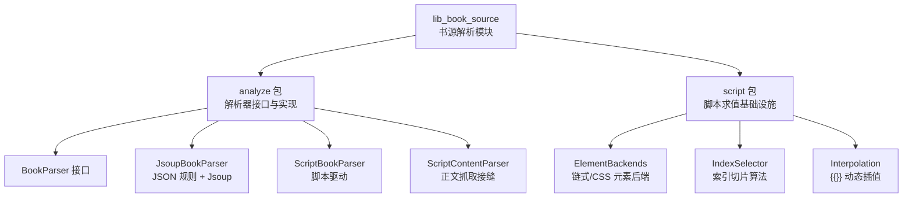
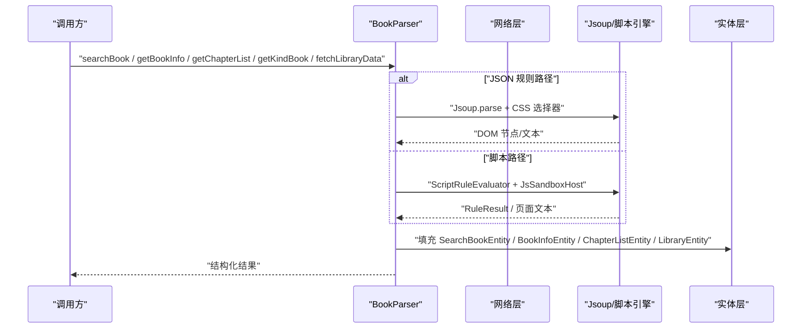
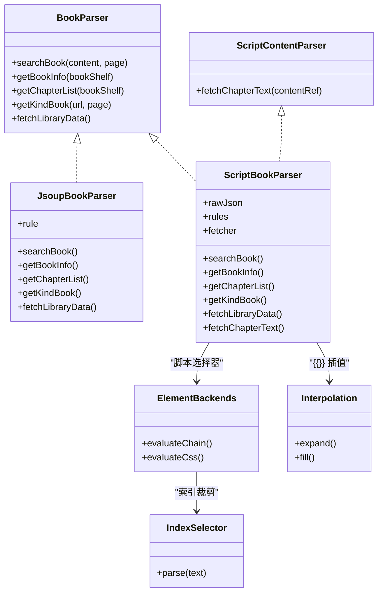

# 书籍内容解析

<cite>
**本文引用的文件 **
- [BookParser.kt](file://lib_book_source/src/main/java/com/ebook/source/analyze/BookParser.kt)
- [JsoupBookParser.kt](file://lib_book_source/src/main/java/com/ebook/source/analyze/JsoupBookParser.kt)
- [ScriptBookParser.kt](file://lib_book_source/src/main/java/com/ebook/source/analyze/ScriptBookParser.kt)
- [ScriptContentParser.kt](file://lib_book_source/src/main/java/com/ebook/source/analyze/ScriptContentParser.kt)
- [ElementBackends.kt](file://lib_book_source/src/main/java/com/ebook/source/script/ElementBackends.kt)
- [IndexSelector.kt](file://lib_book_source/src/main/java/com/ebook/source/script/IndexSelector.kt)
- [Interpolation.kt](file://lib_book_source/src/main/java/com/ebook/source/script/Interpolation.kt)
</cite>

## 目录
1. [引言](#引言)
2. [项目结构](#项目结构)
3. [核心组件](#核心组件)
4. [架构总览](#架构总览)
5. [详细组件分析](#详细组件分析)
6. [依赖关系分析](#依赖关系分析)
7. [性能与并发特性](#性能与并发特性)
8. [错误恢复机制](#错误恢复机制)
9. [调试工具与排错指南](#调试工具与排错指南)
10. [实际解析示例](#实际解析示例)
11. [自定义解析器开发指南](#自定义解析器开发指南)
12. [结论](#结论)

## 引言
本技术文档聚焦“书籍内容解析模块”，围绕以下目标展开：
- 解释 BookParser 抽象接口的设计动机与五个能力面。
- 对比 JsoupBookParser（JSON 规则 + HTML DOM）与 ScriptBookParser（脚本驱动）的职责边界。
- 深入说明基于 Jsoup 的 CSS 选择器匹配、元素提取、URL 落位、章节索引分页和书库数据拼装流程。
- 文档化脚本解析器的加载、求值环境、网络沙箱、结果映射与正文抓取接缝。
- 梳理 ElementBackends 的元素操作后端、IndexSelector 的索引算法、Interpolation 的动态值替换机制。
- 给出性能优化建议、错误恢复策略、调试方法，以及实际示例与扩展指南。

该模块位于 `lib_book_source`，对外通过 `BookParser` 暴露发现层能力；正文读取则通过独立的 `ScriptContentParser` 接缝进入，避免跨模块强耦合。

## 项目结构
与本书内容解析直接相关的源码集中在两个包：
- `com.ebook.source.analyze`：解析器抽象与两种实现、正文抓取接缝。
- `com.ebook.source.script`：脚本求值基础设施，包括元素后端、索引选择器、插值、上下文、传输等。

**图示来源**
- [BookParser.kt:1-30](file://lib_book_source/src/main/java/com/ebook/source/analyze/BookParser.kt#L1-L30)
- [JsoupBookParser.kt:1-200](file://lib_book_source/src/main/java/com/ebook/source/analyze/JsoupBookParser.kt#L1-L200)
- [ScriptBookParser.kt:1-200](file://lib_book_source/src/main/java/com/ebook/source/analyze/ScriptBookParser.kt#L1-L200)
- [ScriptContentParser.kt:1-25](file://lib_book_source/src/main/java/com/ebook/source/analyze/ScriptContentParser.kt#L1-L25)
- [ElementBackends.kt:1-200](file://lib_book_source/src/main/java/com/ebook/source/script/ElementBackends.kt#L1-L200)
- [IndexSelector.kt:1-89](file://lib_book_source/src/main/java/com/ebook/source/script/IndexSelector.kt#L1-L89)
- [Interpolation.kt:1-200](file://lib_book_source/src/main/java/com/ebook/source/script/Interpolation.kt#L1-L200)

**章节来源**
- [BookParser.kt:1-30](file://lib_book_source/src/main/java/com/ebook/source/analyze/BookParser.kt#L1-L30)
- [JsoupBookParser.kt:1-200](file://lib_book_source/src/main/java/com/ebook/source/analyze/JsoupBookParser.kt#L1-L200)
- [ScriptBookParser.kt:1-200](file://lib_book_source/src/main/java/com/ebook/source/analyze/ScriptBookParser.kt#L1-L200)
- [ScriptContentParser.kt:1-25](file://lib_book_source/src/main/java/com/ebook/source/analyze/ScriptContentParser.kt#L1-L25)
- [ElementBackends.kt:1-200](file://lib_book_source/src/main/java/com/ebook/source/script/ElementBackends.kt#L1-L200)
- [IndexSelector.kt:1-89](file://lib_book_source/src/main/java/com/ebook/source/script/IndexSelector.kt#L1-L89)
- [Interpolation.kt:1-200](file://lib_book_source/src/main/java/com/ebook/source/script/Interpolation.kt#L1-L200)

## 核心组件
本节从接口契约开始，说明解析器家族的职责分工与边界。

### BookParser 接口
BookParser 是“书源解析器”的统一抽象，面向“发现层”（搜索、详情、目录、分类、书库），不包含正文落盘逻辑。它定义五个异步方法：
- searchBook：根据关键词和页码返回搜索结果。
- getBookInfo：拉取详情页并填充书籍元信息。
- getChapterList：拉取章节列表，返回带章节实体的 WebChapterEntity。
- getKindBook：按分类 URL 抓分类页书目。
- fetchLibraryData：拉取本源书城首屏各分类书目，纯网络解析，不碰缓存。

设计要点：
- 所有方法都是 suspend，适合协程调度。
- fetchLibraryData 明确约定“不碰缓存”，由上层仓库决定缓存语义，避免刷新被缓存吞掉。
- 失败语义在实现层收敛：单个分类失败可降级为空区块，而不是整体抛异常。

**章节来源**
- [BookParser.kt:1-30](file://lib_book_source/src/main/java/com/ebook/source/analyze/BookParser.kt#L1-L30)

### JsoupBookParser 与 ScriptBookParser 的职责分工
| 维度 | JsoupBookParser | ScriptBookParser |
| --- | --- | --- |
| 输入形态 | JSON 规则（BookSourceRule） | 脚本 JSON（rules、objects、searchUrl 等） |
| 页面解析方式 | Jsoup DOM + CSS 选择器 + 规则字段 | 脚本求值（链式/CSS/正则/JS 表达式） |
| 搜索/发现 | 基于 ruleSearch / ruleFind.ruleSearch | 基于 rules.rule(RuleObjectKind.SEARCH/EXPLORE) |
| 详情 | 基于 ruleBookInfo | 基于 ruleBookInfo，支持 init 预处理 |
| 目录 | 基于 ruleToc，配合 TocPager/TocPageUrl | 基于 ruleToc，走 ScriptTocPager |
| 书库 | 基于 ruleFind.kinds | 基于 exploreUrl |
| 正文 | 不在该实现中处理 | 通过 ScriptContentParser.fetchChapterText |
| 安全边界 | 使用 BookSourceNetwork 请求 | 使用 JsSandboxHost + GuardedNetwork |

两者都实现 BookParser，但 ScriptBookParser 额外实现 ScriptContentParser，作为正文抓取接入口。

**章节来源**
- [JsoupBookParser.kt:1-200](file://lib_book_source/src/main/java/com/ebook/source/analyze/JsoupBookParser.kt#L1-L200)
- [ScriptBookParser.kt:1-200](file://lib_book_source/src/main/java/com/ebook/source/analyze/ScriptBookParser.kt#L1-L200)
- [ScriptContentParser.kt:1-25](file://lib_book_source/src/main/java/com/ebook/source/analyze/ScriptContentParser.kt#L1-L25)

## 架构总览
下图展示发现层调用路径、两种解析器与底层网络/脚本环境的交互关系。

**图示来源**
- [BookParser.kt:1-30](file://lib_book_source/src/main/java/com/ebook/source/analyze/BookParser.kt#L1-L30)
- [JsoupBookParser.kt:1-200](file://lib_book_source/src/main/java/com/ebook/source/analyze/JsoupBookParser.kt#L1-L200)
- [ScriptBookParser.kt:1-200](file://lib_book_source/src/main/java/com/ebook/source/analyze/ScriptBookParser.kt#L1-L200)

## 详细组件分析

### JsoupBookParser：基于 HTML DOM 的解析流程
JsoupBookParser 以 BookSourceRule 为配置，内部封装 BookSourceNetwork，完成搜索、详情、目录、分类、书库五大能力的解析。

#### 搜索解析流程
1. 对关键词进行字符集编码，失败时回退原始词。
2. 用 ListPageUrl 渲染搜索 URL，并根据 searchMethod/searchBody 构造请求。
3. 调用 network.getPage 拿到 HTML。
4. 用 parseSearchBookWithRule 把 HTML 转成 SearchBookEntity 列表。
5. 过滤 name 或 noteUrl 为空的条目。

关键点：
- searchBook 内部捕获异常并返回空列表，属于“网络失败降级”。
- parseSearchBookWithRule 是搜索与书城分类共用的解析链，保证两处口径一致。
- 新增对 SearchRule.intro 的赋值，使简介字段对齐脚本侧行为。

**章节来源**
- [JsoupBookParser.kt:1-200](file://lib_book_source/src/main/java/com/ebook/source/analyze/JsoupBookParser.kt#L1-L200)

#### 详情解析流程
1. 设置 tag/origin/noteUrl。
2. 相对地址解析详情页 HTML。
3. 从 ruleBookInfo 读取 name、author、intro、coverUrl、tocUrl。
4. authorPrefix/introPrefix 做前缀清理。
5. 将 BookInfoEntity 挂到 bookShelf.bookInfo。

注意：
- tocUrl 为空时回落详情页 URL，适配“目录就在详情页”的站点。

**章节来源**
- [JsoupBookParser.kt:1-200](file://lib_book_source/src/main/java/com/ebook/source/analyze/JsoupBookParser.kt#L1-L200)

#### 目录解析流程
目录解析由 TocPager 负责，核心步骤：
1. 确定入口 URL：优先 bookInfo.chapterUrl，否则 noteUrl。
2. 逐页抓取，按 TocRule.list 选择章节项。
3. 对每个项解析 contentRef/name，并按 sourceRoot 落成绝对地址。
4. 去重：contentRef 跨页去重，同页重复也去重。
5. 翻页：
   - 优先 nextPage 选择器；若未命中或回环则停止。
   - 否则用 pageUrl 模板推算下一页。
6. 终止条件：
   - 本页零新增。
   - 下一页无匹配或已访问。
   - 章节数达到 MAX_TOC_CHAPTERS（默认 20,000）。
7. 可选 reverse 反转目录并重新编号。

辅助对象：
- ListPageUrl：统一页码换算、首页裁剪。
- TocPageUrl：统一 URL 落位（协议相对、源根相对、目录相对）。

**章节来源**
- [JsoupBookParser.kt:201-486](file://lib_book_source/src/main/java/com/ebook/source/analyze/JsoupBookParser.kt#L201-L486)

#### 分类与书库数据
- getKindBook：按 findRule.url 渲染分类 URL，使用 ruleFind.ruleSearch 或回落 ruleSearch 解析。
- fetchLibraryData：按 ruleFind.kinds 逐个分类抓首页，失败分类记为空区块，最终拼成 LibraryEntity。

**章节来源**
- [JsoupBookParser.kt:1-200](file://lib_book_source/src/main/java/com/ebook/source/analyze/JsoupBookParser.kt#L1-L200)
- [JsoupBookParser.kt:201-486](file://lib_book_source/src/main/java/com/ebook/source/analyze/JsoupBookParser.kt#L201-L486)

#### CSS 选择器与元素提取
JsoupBookParser 主要依赖 JsoupHelper.selectElements/selectText/selectAttr，并在 URL 处使用 JsoupHelper.parseUrl 做相对地址落位。其 DOM 解析流程可以概括为：
- 解析 HTML 为 Document。
- 用 list 选择器选出候选集合。
- 对每个元素提取字段文本、属性值。
- 相对 URL 结合规则 url 转为绝对地址。
- 过滤无效条目后返回实体列表。

该流程强调“规则驱动”而非硬编码选择器，因此同一解析器可适配多种站点结构。

**章节来源**
- [JsoupBookParser.kt:1-200](file://lib_book_source/src/main/java/com/ebook/source/analyze/JsoupBookParser.kt#L1-L200)

### ScriptBookParser：脚本驱动解析机制
ScriptBookParser 把脚本 JSON 装配成 BookParser 的五个能力面，同时实现 ScriptContentParser 作为正文抓取接口。

#### 装载与惰性求值
- 构造只保存 rawJson、transport、jsHost 等，不会立即解析规则。
- rules 通过 lazy 首次求值时才加载，确保 getParserFor 契约不被构造期异常破坏。
- tag、allowlist、guard、cookieJar、sandboxGateway、sourceJson、fetcher 同样惰性初始化。

这种设计让“行存在但 JSON 损坏”的情况，能在求值阶段抛出类型化的解析异常，而不是在缓存查找阶段崩溃。

**章节来源**
- [ScriptBookParser.kt:1-200](file://lib_book_source/src/main/java/com/ebook/source/analyze/ScriptBookParser.kt#L1-L200)

#### 执行环境与上下文
newContext 是解析任务上下文的唯一创建点：
- 传入 baseUrl、key、page、bindings。
- 注入 EvalContext。
- 若有 JsSandboxHost，则构建桥，并把 ctx.js 回填到上下文。
- bindings 包含 chapterJson/title/sourceJson/bookJson 等，由调用点按需提供。

cookieJar 是源级会话容器，随 parser 生命周期存活；sandboxGateway 是沙箱外呼的传输层，生产走 GuardedNetwork。

**章节来源**
- [ScriptBookParser.kt:1-200](file://lib_book_source/src/main/java/com/ebook/source/analyze/ScriptBookParser.kt#L1-L200)

#### 搜索链路
1. 若 rules.searchUrl 未配置，返回空列表（非错误）。
2. 构造 newContext，baseUrl 来自 sourceBase，key 经 tryEncodeKey 百分号编码。
3. fetchPage 获取页面文本，并推进 ctx.baseUrl 到实际请求 URL。
4. parseBookList 用 RuleObjectKind.SEARCH 解析列表字段，未配则回落到 RuleObjectKind.SEARCH 的 fallback。
5. 过滤 name 与 bookUrl 都为空的条目。

**章节来源**
- [ScriptBookParser.kt:201-454](file://lib_book_source/src/main/java/com/ebook/source/analyze/ScriptBookParser.kt#L201-L454)

#### 详情链路
1. 触发 rules 惰性装载，设置 tag/origin/noteUrl。
2. newContext 绑定 bookJson，baseUrl 先剥 URL 尾段选项。
3. fetchPage 取详情页文本。
4. 支持 init 预处理：
   - JS 形式：init 返回对象，字段名即键，字段规则整体忽略。
   - AllInOne 形式：首个 Matches 组作为上下文，后续字段规则按 $n 引用取值。
5. 逐字段求值，空 intro 填“暂无简介”。
6. tocUrl 为空时回落详情页 URL。

**章节来源**
- [ScriptBookParser.kt:201-454](file://lib_book_source/src/main/java/com/ebook/source/analyze/ScriptBookParser.kt#L201-L454)

#### 目录链路
- 入口 URL 优先 bookInfo.chapterUrl，否则 noteUrl。
- 使用 ScriptTocPager 替代原生 TocPager，但仍保持相同终止策略：
  - contentRef 跨页去重。
  - 零新增到底。
  - 回环停止。
  - 触顶截断。
- 每页更新 ctx.baseUrl，使“下一页”和章节链接按当前页落位。

**章节来源**
- [ScriptBookParser.kt:201-454](file://lib_book_source/src/main/java/com/ebook/source/analyze/ScriptBookParser.kt#L201-L454)

#### 分类与书库数据
- getKindBook：对 ExploreUrlFormat 中的 urlRule 加载分类页，失败按空列表，取消原样上抛。
- fetchLibraryData：按 exploreUrl 拆分分类，逐个抓首页；失败分类记为空区块；取消原样上抛。

**章节来源**
- [ScriptBookParser.kt:201-454](file://lib_book_source/src/main/java/com/ebook/source/analyze/ScriptBookParser.kt#L201-L454)

#### 正文抓取接缝
ScriptBookParser 实现 ScriptContentParser.fetchChapterText：
- 按 ruleContent.content 逐页取文。
- nextContentUrl 翻页拼接，不套用 ChapterPageMatcher。
- replaceRegex 净化。
- 返回段落以换行分隔的未规范化文本，由读取层 TextNormalizer 处理。

**章节来源**
- [ScriptContentParser.kt:1-25](file://lib_book_source/src/main/java/com/ebook/source/analyze/ScriptContentParser.kt#L1-L25)
- [ScriptBookParser.kt:201-454](file://lib_book_source/src/main/java/com/ebook/source/analyze/ScriptBookParser.kt#L201-L454)

### ElementBackends：元素操作后端
ElementBackends 提供两种元素选择模式：
- evaluateChain：链式模式，按 `@` 分段逐级收窄节点集，末段可以是取值器或选择器。
- evaluateCss：CSS 模式，整段选择器交给 Jsoup，尾随取值器决定输出。

共同骨架：
- seed：页面→文档，节点集→原样，文本集→第一段当 HTML 解析。
- apply：按链段类型选择 class/id/tag/text/children/css/attribute。
- selectIndices：统一索引裁剪。
- valueText：节点集映射为文本，空映射归一为 RuleResult.Miss。

重要规则：
- 取值器只能出现在链尾，中间出现视为语法错误。
- 选择器名称为空时报 RuleSyntaxException，而不是让 Jsoup 抛未类型化异常。
- CSS 非法选择器包装为 RuleSyntaxException，参与 `||` 短路。

**章节来源**
- [ElementBackends.kt:1-200](file://lib_book_source/src/main/java/com/ebook/source/script/ElementBackends.kt#L1-L200)
- [ElementBackends.kt:201-211](file://lib_book_source/src/main/java/com/ebook/source/script/ElementBackends.kt#L201-L211)

### IndexSelector：索引计算算法
IndexSelector 描述索引方言，支持：
- 全取 `[:]`。
- 单点 `[0]`。
- 多点 `[1,3]`。
- 排除 `[!1,3]`。
- 切片 `[2:4]`、`[1:9:2]`、`[:3]`、`[2:]`、`[-1:0]`。

关键语义：
- 区间是闭区间，不是 Python 半开区间。
- 负索引表示从尾部计数。
- 解析阶段不换算负索引，selectIndices 才按长度换算。
- 越界索引跳过，不抛异常；全部被过滤返回空列表。
- 反向遍历允许 start > end，step 取绝对值。

复杂度：
- At：O(k)，k 为指定索引数量。
- Excluding：O(n + k)。
- Slice：O(m)，m 为生成下标数量。
- All：O(1)。

**章节来源**
- [IndexSelector.kt:1-89](file://lib_book_source/src/main/java/com/ebook/source/script/IndexSelector.kt#L1-L89)

### Interpolation：动态值替换机制
Interpolation 负责 `{{...}}` 插值、`@@` 递归求值、变量读写与规则标志识别。

核心机制：
- expand：扫描规则串，遇到 `{{...}}` 时把值存入 Expansion.values，并用控制字符占位符替换，避免展开值污染规则切分。
- fill：把占位符还原为真实值，用于最终结果回填。
- resolve：
  - @@ 开头：递归求值。
  - $. 开头：JSONPath 规则求值。
  - 合法标识符：查内置量或变量表。
  - 已知规则标志：走规则求值。
  - 其他表达式：交给 ctx.js 求值；若无沙箱则抛 JsEvaluationPendingException。
- parsePutEntry/topLevelEntries：解析 `@put:` 写入的键值对，逗号分割时跳过引号和 `{}`/`[]` 内部。

设计取舍：
- 插值发生在切分之前，但展开值不参与切分，由 Expansion 占位符承担。
- 未装配沙箱时，非声明式表达式必须显式失败，不能静默拼出错误 URL。

**章节来源**
- [Interpolation.kt:1-200](file://lib_book_source/src/main/java/com/ebook/source/script/Interpolation.kt#L1-L200)
- [Interpolation.kt:201-220](file://lib_book_source/src/main/java/com/ebook/source/script/Interpolation.kt#L201-L220)

## 依赖关系分析

**图示来源**
- [BookParser.kt:1-30](file://lib_book_source/src/main/java/com/ebook/source/analyze/BookParser.kt#L1-L30)
- [JsoupBookParser.kt:1-200](file://lib_book_source/src/main/java/com/ebook/source/analyze/JsoupBookParser.kt#L1-L200)
- [ScriptBookParser.kt:1-200](file://lib_book_source/src/main/java/com/ebook/source/analyze/ScriptBookParser.kt#L1-L200)
- [ScriptContentParser.kt:1-25](file://lib_book_source/src/main/java/com/ebook/source/analyze/ScriptContentParser.kt#L1-L25)
- [ElementBackends.kt:1-200](file://lib_book_source/src/main/java/com/ebook/source/script/ElementBackends.kt#L1-L200)
- [IndexSelector.kt:1-89](file://lib_book_source/src/main/java/com/ebook/source/script/IndexSelector.kt#L1-L89)
- [Interpolation.kt:1-200](file://lib_book_source/src/main/java/com/ebook/source/script/Interpolation.kt#L1-L200)

**章节来源**
- [BookParser.kt:1-30](file://lib_book_source/src/main/java/com/ebook/source/analyze/BookParser.kt#L1-L30)
- [JsoupBookParser.kt:1-200](file://lib_book_source/src/main/java/com/ebook/source/analyze/JsoupBookParser.kt#L1-L200)
- [ScriptBookParser.kt:1-200](file://lib_book_source/src/main/java/com/ebook/source/analyze/ScriptBookParser.kt#L1-L200)
- [ElementBackends.kt:1-200](file://lib_book_source/src/main/java/com/ebook/source/script/ElementBackends.kt#L1-L200)
- [IndexSelector.kt:1-89](file://lib_book_source/src/main/java/com/ebook/source/script/IndexSelector.kt#L1-L89)
- [Interpolation.kt:1-200](file://lib_book_source/src/main/java/com/ebook/source/script/Interpolation.kt#L1-L200)

## 性能与并发特性
- 协程调度：JsoupBookParser 与 ScriptBookParser 的主要方法都使用 withContext(Dispatchers.IO)，把网络 IO 与 DOM/脚本解析放到 IO 线程。
- 惰性装配：ScriptBookParser 的 rules、fetcher、tag、allowlist、guard、cookieJar、sandboxGateway、sourceJson 均为 lazy，避免无用初始化。
- 分页防御：TocPager 有 MAX_TOC_CHAPTERS=20,000 上限，防止极端错误或规则写坏导致无限抓取。
- 去重优化：
  - 目录页按 contentRef 跨页去重。
  - 同页重复条目一并去重。
  - ElementBackends 在索引裁剪前对节点去重，避免祖先/后代重复命中。
- URL 落位复用：TocPageUrl.join 与 ListPageUrl.build 统一处理协议相对、源根相对、目录相对与页码模板。
- 列表解析复用：parseSearchBookWithRule 被搜索与书城分类共用，减少重复逻辑。
- 正文抓取独立：ScriptContentParser 把正文读取从 BookParser 解耦，避免读取器误入发现层逻辑。

[本节为通用性能讨论，不直接分析具体代码片段]

## 错误恢复机制
| 场景 | 处理方式 |
| --- | --- |
| 搜索网络异常 | JsoupBookParser 返回空列表 |
| 分类抓取失败 | fetchLibraryData 记录日志并加入空区块 |
| 分类页抓取失败 | ScriptBookParser.getKindBook 返回空列表，取消原样上抛 |
| 书库数据全部分类失败 | 返回 kindBooks 全空的 LibraryEntity，由上层拒绝回写缓存 |
| 脚本 JSON 解析失败 | 在首次求值阶段抛类型化异常，不破坏 getParserFor 契约 |
| 未装配沙箱且表达式不可声明式求值 | 抛 JsEvaluationPendingException |
| CSS 选择器非法 | 包装为 RuleSyntaxException，参与 || 短路 |
| 取值器不在链尾 | 报 RuleSyntaxException，防止静默空结果 |
| 选择器名称为空 | 报 RuleSyntaxException |
| 索引越界 | IndexSelector 跳过越界索引，不抛异常 |
| 目录页软 404 | 零新增即终止，避免重复首页内容 |
| 目录回环 | visitedUrls 阻止重复访问 |
| 正文分页 | 不套用 ChapterPageMatcher，nextContentUrl 可信度更高 |

**章节来源**
- [JsoupBookParser.kt:1-200](file://lib_book_source/src/main/java/com/ebook/source/analyze/JsoupBookParser.kt#L1-L200)
- [JsoupBookParser.kt:201-486](file://lib_book_source/src/main/java/com/ebook/source/analyze/JsoupBookParser.kt#L201-L486)
- [ScriptBookParser.kt:1-200](file://lib_book_source/src/main/java/com/ebook/source/analyze/ScriptBookParser.kt#L1-L200)
- [ScriptBookParser.kt:201-454](file://lib_book_source/src/main/java/com/ebook/source/analyze/ScriptBookParser.kt#L201-L454)
- [ElementBackends.kt:1-200](file://lib_book_source/src/main/java/com/ebook/source/script/ElementBackends.kt#L1-L200)
- [IndexSelector.kt:1-89](file://lib_book_source/src/main/java/com/ebook/source/script/IndexSelector.kt#L1-L89)
- [Interpolation.kt:1-200](file://lib_book_source/src/main/java/com/ebook/source/script/Interpolation.kt#L1-L200)

## 调试工具与排错指南
推荐排查顺序：
1. 确认 BookParser 选择的是 JsoupBookParser 还是 ScriptBookParser。
2. 若是脚本路径，检查 rules 是否惰性加载成功，rawJson 是否能被 ScriptRuleSet.load 解析。
3. 检查 Interpolation 的 `{{...}}` 是否被正确占位化，尤其含 `||`、`&&`、`@`、`##` 的值。
4. 检查 ElementBackends 的规则末端是否为取值器，中间位置不能有 text/html/attr 等取值器。
5. 检查 CSS 选择器是否合法，非法选择器应被包装为 RuleSyntaxException。
6. 检查 IndexSelector 的索引语法是否符合闭区间语义，负索引与省略端点是否正确。
7. 检查 URL 落位：
   - 协议相对 `//host/path`。
   - 源根相对 `/path`。
   - 目录相对 `index_2.html`。
8. 对目录页启用日志，观察 TocPager 是否触发 MAX_TOC_CHAPTERS、零新增、回环或下一页选择器失效。
9. 对书库数据，确认每个分类块是否因网络失败变成空列表，再由上层判断是否回写缓存。

**章节来源**
- [JsoupBookParser.kt:1-200](file://lib_book_source/src/main/java/com/ebook/source/analyze/JsoupBookParser.kt#L1-L200)
- [JsoupBookParser.kt:201-486](file://lib_book_source/src/main/java/com/ebook/source/analyze/JsoupBookParser.kt#L201-L486)
- [ScriptBookParser.kt:1-200](file://lib_book_source/src/main/java/com/ebook/source/analyze/ScriptBookParser.kt#L1-L200)
- [ElementBackends.kt:1-200](file://lib_book_source/src/main/java/com/ebook/source/script/ElementBackends.kt#L1-L200)
- [IndexSelector.kt:1-89](file://lib_book_source/src/main/java/com/ebook/source/script/IndexSelector.kt#L1-L89)
- [Interpolation.kt:1-200](file://lib_book_source/src/main/java/com/ebook/source/script/Interpolation.kt#L1-L200)

## 实际解析示例

### 示例一：JSON 规则搜索
假设书源规则提供 searchUrl、searchMethod、searchBody 和 ruleSearch，JsoupBookParser 会：
- 渲染关键词和页码。
- 发起 HTTP 请求。
- 用 list 选择器定位书籍条目。
- 提取 name、author、lastChapter、kind、intro、bookUrl、coverUrl。
- 把相对 URL 落位成绝对地址。
- 过滤无效条目并返回 SearchBookEntity 列表。

适用场景：传统 HTML 站点，结构稳定，规则以 CSS 选择器为主。

**章节来源**
- [JsoupBookParser.kt:1-200](file://lib_book_source/src/main/java/com/ebook/source/analyze/JsoupBookParser.kt#L1-L200)

### 示例二：脚本详情与目录
ScriptBookParser 在详情阶段：
- 用 ruleBookInfo 的字段规则解析 name、author、intro、coverUrl、tocUrl。
- 支持 init 预处理，AllInOne 首个匹配作为上下文。
- 目录阶段使用 ruleToc 和 ScriptTocPager 翻页，保持与原生相同的终止策略。

适用场景：站点结构复杂、字段嵌套深，需要正则、JSONPath、JS 表达式组合。

**章节来源**
- [ScriptBookParser.kt:201-454](file://lib_book_source/src/main/java/com/ebook/source/analyze/ScriptBookParser.kt#L201-L454)

### 示例三：脚本正文抓取
ScriptContentParser.fetchChapterText：
- 从 contentRef 出发，按 ruleContent.content 逐页取文。
- nextContentUrl 翻页，不套用 ChapterPageMatcher。
- replaceRegex 做内容净化。
- 返回换行分隔的未规范化文本。

适用场景：多页正文、图片混排、需正则清洗的站点。

**章节来源**
- [ScriptContentParser.kt:1-25](file://lib_book_source/src/main/java/com/ebook/source/analyze/ScriptContentParser.kt#L1-L25)
- [ScriptBookParser.kt:201-454](file://lib_book_source/src/main/java/com/ebook/source/analyze/ScriptBookParser.kt#L201-L454)

## 自定义解析器开发指南

### 何时选择 JsoupBookParser
- 站点结构稳定，字段可通过 CSS 选择器稳定定位。
- 不需要复杂表达式、JSONPath 或 JS 计算。
- 希望以 JSON 规则快速适配不同站点。

实现要点：
- 继承 BookParser。
- 使用 Jsoup 解析 HTML。
- 用规则字段驱动选择器和字段映射。
- 使用 ListPageUrl/TocPageUrl 统一分页与 URL 落位。
- 对网络异常做降级，避免影响其他分类。

**章节来源**
- [JsoupBookParser.kt:1-200](file://lib_book_source/src/main/java/com/ebook/source/analyze/JsoupBookParser.kt#L1-L200)
- [JsoupBookParser.kt:201-486](file://lib_book_source/src/main/java/com/ebook/source/analyze/JsoupBookParser.kt#L201-L486)

### 何时选择 ScriptBookParser
- 站点字段嵌套深，需要正则、JSONPath、JS 表达式。
- 需要 `@put:`/`@get:` 变量、`@@` 递归求值。
- 需要脚本沙箱隔离执行。
- 需要灵活的分页、URL 选项、内容清洗。

实现要点：
- 维护脚本 JSON，遵循 RuleObjectKind 字段命名。
- 正确使用 Interpolation 的 `{{...}}` 和规则标志。
- 使用 ElementBackends 的链式或 CSS 模式选择元素。
- 使用 IndexSelector 的索引语法裁剪列表。
- 实现 ScriptContentParser 以提供正文抓取能力。

**章节来源**
- [ScriptBookParser.kt:1-200](file://lib_book_source/src/main/java/com/ebook/source/analyze/ScriptBookParser.kt#L1-L200)
- [ScriptBookParser.kt:201-454](file://lib_book_source/src/main/java/com/ebook/source/analyze/ScriptBookParser.kt#L201-L454)
- [ScriptContentParser.kt:1-25](file://lib_book_source/src/main/java/com/ebook/source/analyze/ScriptContentParser.kt#L1-L25)

### 编写健壮的选择器与索引
- 优先使用稳定的类名、ID、标签组合。
- 避免在链中间放置取值器。
- 对可能缺失的属性使用兜底规则，例如 `A@src||A@data-src`。
- 使用闭区间索引语法，谨慎使用负索引和省略端点。
- 对越界索引保持容忍，不要让它毁掉整本书目录。

**章节来源**
- [ElementBackends.kt:1-200](file://lib_book_source/src/main/java/com/ebook/source/script/ElementBackends.kt#L1-L200)
- [IndexSelector.kt:1-89](file://lib_book_source/src/main/java/com/ebook/source/script/IndexSelector.kt#L1-L89)

### 处理 URL 与分页
- 区分协议相对、源根相对、目录相对三种落位。
- 对模板页码使用 ListPageUrl 或脚本 URL 语义，避免首页误裁。
- 目录翻页优先 nextPage 选择器，其次 pageUrl 模板。
- 正文翻页不套用 ChapterPageMatcher，信任作者提供的 nextContentUrl。

**章节来源**
- [JsoupBookParser.kt:201-486](file://lib_book_source/src/main/java/com/ebook/source/analyze/JsoupBookParser.kt#L201-L486)
- [ScriptBookParser.kt:201-454](file://lib_book_source/src/main/java/com/ebook/source/analyze/ScriptBookParser.kt#L201-L454)

## 结论
书籍内容解析模块通过 BookParser 抽象统一了“发现层”能力，并通过 JsoupBookParser 与 ScriptBookParser 分别覆盖 JSON 规则与脚本驱动的两种主流场景。Jsoup 路径强调规则化、可测试的 DOM 解析；脚本路径强调灵活性、可表达性，并以沙箱和网络白名单保障安全性。ElementBackends、IndexSelector、Interpolation 构成脚本选择与值替换的基础设施，确保规则既强大又不易静默出错。

在实际工程中，建议：
- 能用 JSON 规则解决的，优先 JsoupBookParser。
- 需要复杂表达式、正则、JSONPath 或 JS 计算的，再考虑 ScriptBookParser。
- 始终关注 URL 落位、分页终止、越界容错和错误降级。
- 利用日志、惰性装载、类型化异常和 Miss 语义，降低“看起来正常、实则错到底”的风险。

[本节为总结性内容，不直接分析具体文件]