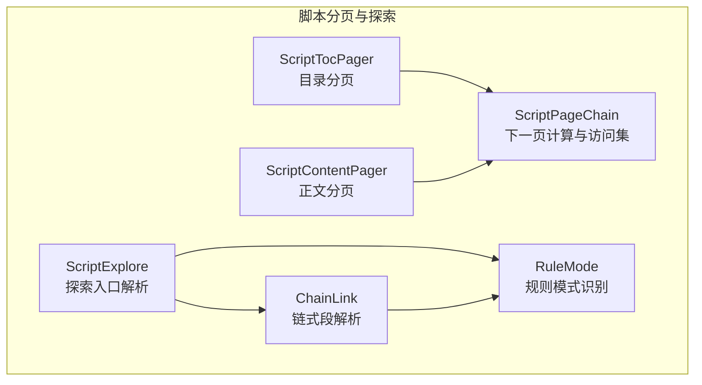
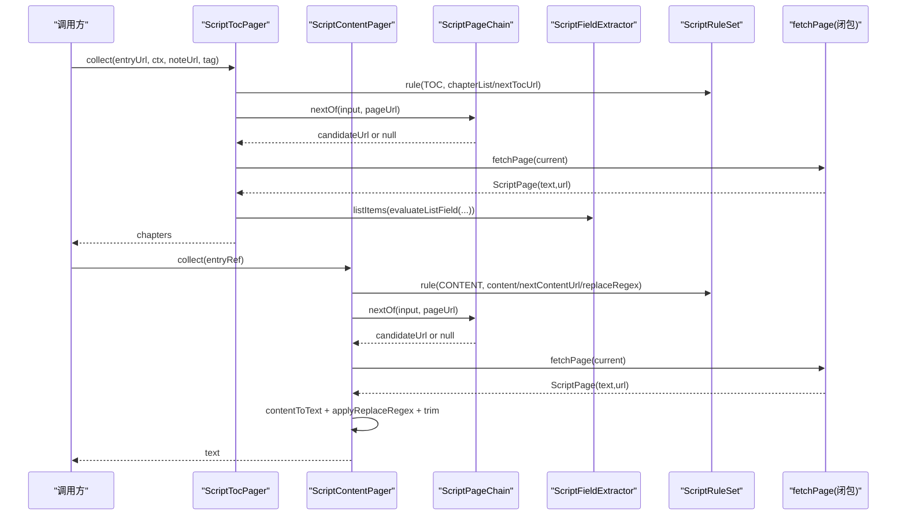
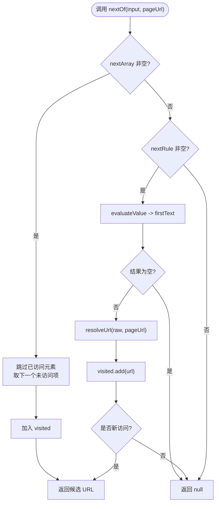
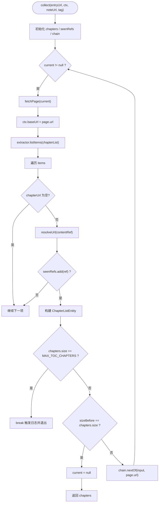
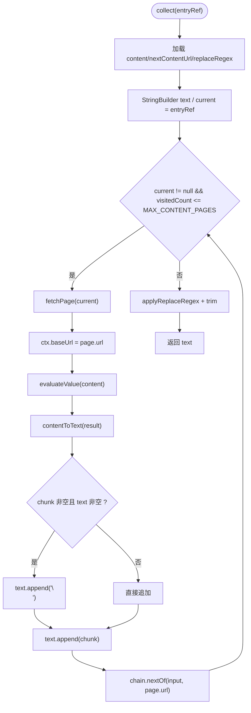
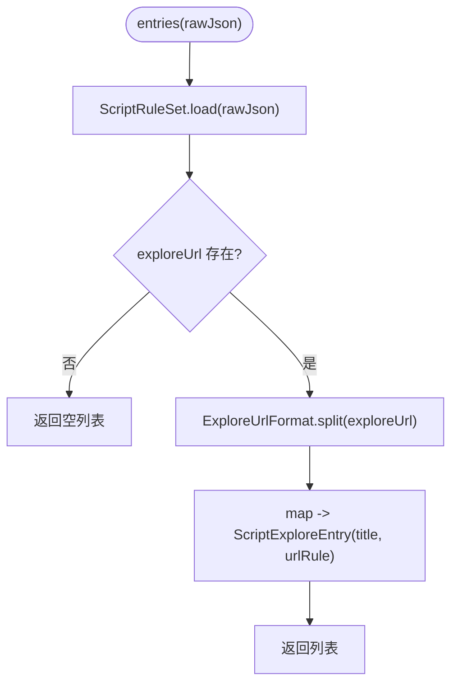
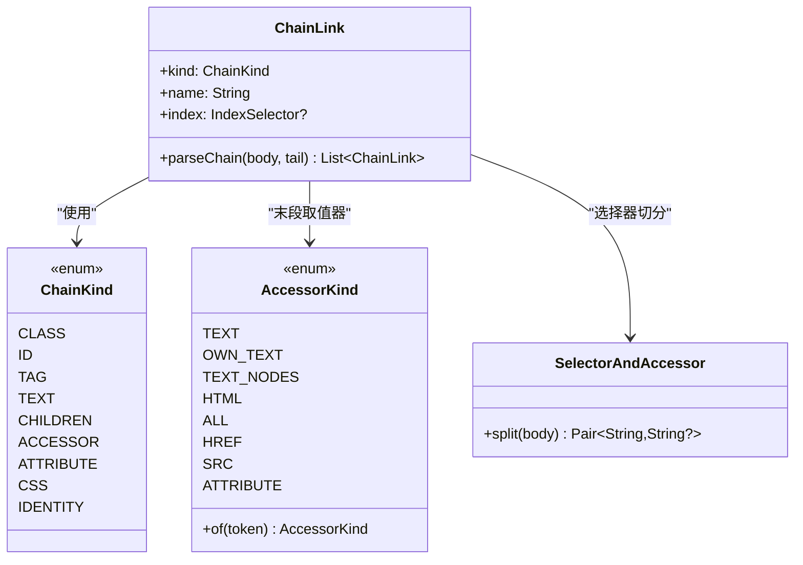
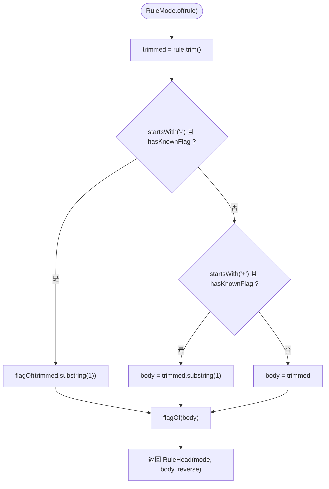
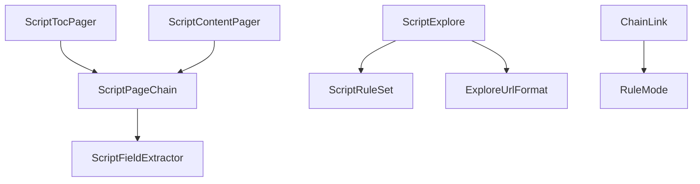

# 分页与探索

<cite>
**本文引用的文件**   
- [ScriptPageChain.kt](file://lib_book_source/src/main/java/com/ebook/source/script/ScriptPageChain.kt)
- [ScriptTocPager.kt](file://lib_book_source/src/main/java/com/ebook/source/script/ScriptTocPager.kt)
- [ScriptContentPager.kt](file://lib_book_source/src/main/java/com/ebook/source/script/ScriptContentPager.kt)
- [ScriptExplore.kt](file://lib_book_source/src/main/java/com/ebook/source/script/ScriptExplore.kt)
- [ChainLink.kt](file://lib_book_source/src/main/java/com/ebook/source/script/ChainLink.kt)
- [RuleMode.kt](file://lib_book_source/src/main/java/com/ebook/source/script/RuleMode.kt)
- [ScriptTocPagerTest.kt](file://lib_book_source/src/test/java/com/ebook/source/script/ScriptTocPagerTest.kt)
- [ScriptContentPagerTest.kt](file://lib_book_source/src/test/java/com/ebook/source/script/ScriptContentPagerTest.kt)
- [ScriptExploreTest.kt](file://lib_book_source/src/test/java/com/ebook/source/script/ScriptExploreTest.kt)
- [ChainLinkTest.kt](file://lib_book_source/src/test/java/com/ebook/source/script/ChainLinkTest.kt)
- [RuleModeTest.kt](file://lib_book_source/src/test/java/com/ebook/source/script/RuleModeTest.kt)
</cite>

## 目录
1. [引言](#引言)
2. [项目结构](#项目结构)
3. [核心组件](#核心组件)
4. [架构总览](#架构总览)
5. [详细组件分析](#详细组件分析)
6. [依赖关系分析](#依赖关系分析)
7. [性能考虑](#性能考虑)
8. [故障排查指南](#故障排查指南)
9. [结论](#结论)
10. [附录：配置示例与最佳实践](#附录配置示例与最佳实践)

## 引言
本文聚焦书源脚本系统中的分页与探索能力，围绕以下目标展开：
- 解释 ScriptPageChain 的分页链式调用机制，包括页面链接解析、已访问集合去重、数组形态与字符串规则形态的优先级，以及并发安全边界。
- 说明 ScriptTocPager 的目录分页逻辑，涵盖章节列表识别、contentRef 跨页去重、软 404 零新增终止策略和防御上限截断。
- 文档化 ScriptContentPager 的内容分页处理，包括多页正文拼接、content 字段收敛例外、replaceRegex 净化顺序、回环防护与页数上限。
- 解释 ScriptExplore 的书籍探索功能，明确其纯解析只读语义、未配置 exploreUrl 的空列表行为及错误 JSON 的类型化异常。
- 梳理 ChainLink 的链式段解析模式与 RuleMode 的规则匹配模式，说明取值器、选择器、索引与反序标志的交互。
- 总结分页性能优化技术（懒加载、缓存、内存控制）、错误恢复机制与调试方法，并给出复杂场景处理方案与最佳实践。

## 项目结构
分页与探索相关代码集中在 lib_book_source 模块的 script 包中，采用“职责单一 + 测试驱动契约”的组织方式：
- 分页基础设施：ScriptPageChain 提供通用的下一页计算与访问集管理。
- 目录分页：ScriptTocPager 基于规则集与提取器，按页抓取 chapterList 并生成章节条目。
- 内容分页：ScriptContentPager 负责单章正文的多页拼接、净化与最终 trim。
- 探索入口：ScriptExplore 暴露 bookSource JSON 中的 exploreUrl 分类胶囊读取面。
- 规则解析：ChainLink 与 RuleMode 分别负责链式段解析与规则模式识别。
- 单元测试：每个关键类都有对应的测试文件，锁定终止判据、模式识别和解析边界。

**图表来源**
- [ScriptPageChain.kt:1-57](file://lib_book_source/src/main/java/com/ebook/source/script/ScriptPageChain.kt#L1-L57)
- [ScriptTocPager.kt:1-83](file://lib_book_source/src/main/java/com/ebook/source/script/ScriptTocPager.kt#L1-L83)
- [ScriptContentPager.kt:1-94](file://lib_book_source/src/main/java/com/ebook/source/script/ScriptContentPager.kt#L1-L94)
- [ScriptExplore.kt:1-23](file://lib_book_source/src/main/java/com/ebook/source/script/ScriptExplore.kt#L1-L23)
- [ChainLink.kt:1-229](file://lib_book_source/src/main/java/com/ebook/source/script/ChainLink.kt#L1-L229)
- [RuleMode.kt:1-118](file://lib_book_source/src/main/java/com/ebook/source/script/RuleMode.kt#L1-L118)

**章节来源**
- [ScriptPageChain.kt:1-57](file://lib_book_source/src/main/java/com/ebook/source/script/ScriptPageChain.kt#L1-L57)
- [ScriptTocPager.kt:1-83](file://lib_book_source/src/main/java/com/ebook/source/script/ScriptTocPager.kt#L1-L83)
- [ScriptContentPager.kt:1-94](file://lib_book_source/src/main/java/com/ebook/source/script/ScriptContentPager.kt#L1-L94)
- [ScriptExplore.kt:1-23](file://lib_book_source/src/main/java/com/ebook/source/script/ScriptExplore.kt#L1-L23)
- [ChainLink.kt:1-229](file://lib_book_source/src/main/java/com/ebook/source/script/ChainLink.kt#L1-L229)
- [RuleMode.kt:1-118](file://lib_book_source/src/main/java/com/ebook/source/script/RuleMode.kt#L1-L118)

## 核心组件
- ScriptPageChain：统一处理 nextTocUrl 与 nextContentUrl 两种下一页来源，支持 URL 数组固定页序与字符串规则动态求值；维护已访问集合，按 URL 选项尾段剥离后比对，避免重复请求；实例非线程安全，生命周期为单次 collect。
- ScriptTocPager：按 pageUrl 推进 baseUrl，逐页抽取 chapterList，构建 ChapterListEntity；使用 seenRefs 对 contentRef 去重，实现软 404 零新增即到底；触顶 MAX_TOC_CHAPTERS 时日志记录并截断。
- ScriptContentPager：将每页 content 结果按 \n 拼接成整章文本；replaceRegex 在拼接后的整章串上执行净化；visitedCount 与 MAX_CONTENT_PAGES 共同限制正文页数；trim 放在净化之后。
- ScriptExplore：从 bookSource JSON 中提取 exploreUrl，返回 ScriptExploreEntry 列表；未配置或程序形态时返回空列表；坏 JSON 抛出类型化解析异常。
- ChainLink：解析链式段，支持 class/id/tag/text/children/accessor/attribute/css/identity 等类型，处理索引、排除式、CSS 选择器与取值器的优先级；SelectorAndAccessor 辅助选择器与取值器切分。
- RuleMode：识别 DEFAULT_CHAIN/CSS/XPATH/JSON_PATH/REGEX_ALL_IN_ONE/VARIABLE_PUT/VARIABLE_GET/JS/UNSUPPORTED 等模式；支持前导 - 反序、+ 全取、大小写不敏感标志键；<js> 优先判定。

**章节来源**
- [ScriptPageChain.kt:1-57](file://lib_book_source/src/main/java/com/ebook/source/script/ScriptPageChain.kt#L1-L57)
- [ScriptTocPager.kt:1-83](file://lib_book_source/src/main/java/com/ebook/source/script/ScriptTocPager.kt#L1-L83)
- [ScriptContentPager.kt:1-94](file://lib_book_source/src/main/java/com/ebook/source/script/ScriptContentPager.kt#L1-L94)
- [ScriptExplore.kt:1-23](file://lib_book_source/src/main/java/com/ebook/source/script/ScriptExplore.kt#L1-L23)
- [ChainLink.kt:1-229](file://lib_book_source/src/main/java/com/ebook/source/script/ChainLink.kt#L1-L229)
- [RuleMode.kt:1-118](file://lib_book_source/src/main/java/com/ebook/source/script/RuleMode.kt#L1-L118)

## 架构总览
分页系统以 ScriptFieldExtractor 与 ScriptRuleSet 为规则与数据桥接层，ScriptPageChain 作为通用翻页控制器，被目录与正文两类 Pager 复用。探索模块独立于分页，仅做只读解析。

**图表来源**
- [ScriptTocPager.kt:20-83](file://lib_book_source/src/main/java/com/ebook/source/script/ScriptTocPager.kt#L20-L83)
- [ScriptContentPager.kt:20-94](file://lib_book_source/src/main/java/com/ebook/source/script/ScriptContentPager.kt#L20-L94)
- [ScriptPageChain.kt:20-57](file://lib_book_source/src/main/java/com/ebook/source/script/ScriptPageChain.kt#L20-L57)

**章节来源**
- [ScriptTocPager.kt:1-83](file://lib_book_source/src/main/java/com/ebook/source/script/ScriptTocPager.kt#L1-L83)
- [ScriptContentPager.kt:1-94](file://lib_book_source/src/main/java/com/ebook/source/script/ScriptContentPager.kt#L1-L94)
- [ScriptPageChain.kt:1-57](file://lib_book_source/src/main/java/com/ebook/source/script/ScriptPageChain.kt#L1-L57)

## 详细组件分析

### ScriptPageChain：分页链式调用机制
ScriptPageChain 是目录与正文分页共用的下一页计算器，核心职责包括：
- 页面链接解析：优先数组形态（nextArray），其次字符串规则（nextRule）；数组为空且规则为空则终止。
- 分页状态管理：visited 集合用于回环检测，arrayIndex 用于数组形态的顺序遍历；visitedCount() 供上层进行页数上限判定。
- 并发控制：注释明确实例非线程安全，生命周期绑定单次 collect，禁止跨协程共享。
- URL 选项尾段剥离：通过 visitKeyOf 剥掉 URL 选项尾段再比对，避免同一地址带不同 charset 等选项导致重复请求。

**图表来源**
- [ScriptPageChain.kt:20-57](file://lib_book_source/src/main/java/com/ebook/source/script/ScriptPageChain.kt#L20-L57)

**章节来源**
- [ScriptPageChain.kt:1-57](file://lib_book_source/src/main/java/com/ebook/source/script/ScriptPageChain.kt#L1-L57)

### ScriptTocPager：目录分页逻辑
ScriptTocPager 负责从目录入口逐页抓取章节列表，关键特性：
- 目录结构识别：通过 rules.rule(RuleObjectKind.TOC, "chapterList") 获取章节列表规则，由 extractor.listItems 解析节点列表。
- 章节列表获取：逐条提取 chapterUrl 与 chapterName，构造 ChapterListEntity；空 chapterUrl 跳过。
- 增量更新策略：seenRefs 对 contentRef 去重，配合零新增即到底的终止条件，兼容软 404 场景。
- 防御上限：MAX_TOC_CHAPTERS = 20000，触顶记录日志并按截断处理，不再发起后续请求。
- 相对链接落位：每次 fetchPage 后更新 ctx.baseUrl，确保下一页相对链接在当前页上下文中解析。

**图表来源**
- [ScriptTocPager.kt:20-83](file://lib_book_source/src/main/java/com/ebook/source/script/ScriptTocPager.kt#L20-L83)

**章节来源**
- [ScriptTocPager.kt:1-83](file://lib_book_source/src/main/java/com/ebook/source/script/ScriptTocPager.kt#L1-L83)
- [ScriptTocPagerTest.kt:1-142](file://lib_book_source/src/test/java/com/ebook/source/script/ScriptTocPagerTest.kt#L1-L142)

### ScriptContentPager：内容分页处理
ScriptContentPager 负责单章正文的多页拼接与净化，重点包括：
- 大文件分块读取：逐页 fetchPage，将每页 content 结果转换为文本 chunk，并以 \n 连接。
- 进度跟踪：通过 visitedCount() 与 MAX_CONTENT_PAGES = 50 控制正文页数上限。
- 断点续传：当前实现未显式持久化分页进度；实际断点续传应由上层 Reader 或 Store 管理，本层保证可重复收集且幂等。
- replaceRegex 净化：在拼接后的整章串上执行，支持 ## 前缀规范化，复用 ReplacementApplier。
- trim 时机：净化后进行 trim，段落间空行交由读取层 TextNormalizer 清理。

**图表来源**
- [ScriptContentPager.kt:20-94](file://lib_book_source/src/main/java/com/ebook/source/script/ScriptContentPager.kt#L20-L94)

**章节来源**
- [ScriptContentPager.kt:1-94](file://lib_book_source/src/main/java/com/ebook/source/script/ScriptContentPager.kt#L1-L94)
- [ScriptContentPagerTest.kt:1-138](file://lib_book_source/src/test/java/com/ebook/source/script/ScriptContentPagerTest.kt#L1-L138)

### ScriptExplore：书籍探索功能
ScriptExplore 提供 bookSource JSON 中 exploreUrl 的分类胶囊解析，遵循纯解析只读原则：
- 搜索结果聚合：entries 方法从 ScriptRuleSet.load 获取 exploreUrl，再由 ExploreUrlFormat.split 拆分标题与 URL 规则。
- 去重算法：本层不做去重；若需去重应在上层合并多个源的结果时处理。
- 排序策略：保持原始顺序；如需排序应在上层按标题、URL 或业务权重排序。
- 未配置 exploreUrl：返回空列表，视为配置形态而非错误。
- 程序形态 exploreUrl：<js>... 的程序形态不被当作分类条目，返回空列表。
- 错误处理：非法 JSON 抛出类型化 ScriptRuleParseException，消息包含“脚本书源 JSON 无法解析”。

**图表来源**
- [ScriptExplore.kt:1-23](file://lib_book_source/src/main/java/com/ebook/source/script/ScriptExplore.kt#L1-L23)

**章节来源**
- [ScriptExplore.kt:1-23](file://lib_book_source/src/main/java/com/ebook/source/script/ScriptExplore.kt#L1-L23)
- [ScriptExploreTest.kt:1-68](file://lib_book_source/src/test/java/com/ebook/source/script/ScriptExploreTest.kt#L1-L68)

### ChainLink：链式调用模式
ChainLink 负责解析链式规则段，支持多种类型与索引语法：
- 类型枚举：CLASS、ID、TAG、TEXT、CHILDREN、ACCESSOR、ATTRIBUTE、CSS、IDENTITY。
- 解析流程：先处理尾部索引，再判断空段（identity 或 children[index]），再判断 bare index，再判断取值器（末段），最后解析 CSS 选择器段。
- 取值器全集：text、ownText、textNodes、html、all、href、src；未知 token 归入 ATTRIBUTE。
- SelectorAndAccessor：选择器与取值器切分，最后一个顶层 @ 分隔选择器与取值器。

**图表来源**
- [ChainLink.kt:1-229](file://lib_book_source/src/main/java/com/ebook/source/script/ChainLink.kt#L1-L229)

**章节来源**
- [ChainLink.kt:1-229](file://lib_book_source/src/main/java/com/ebook/source/script/ChainLink.kt#L1-L229)
- [ChainLinkTest.kt:1-262](file://lib_book_source/src/test/java/com/ebook/source/script/ChainLinkTest.kt#L1-L262)

### RuleMode：规则匹配模式
RuleMode 负责识别规则模式并剥离标志前缀，支持反序前缀 - 与全取前缀 +：
- 模式枚举：DEFAULT_CHAIN、CSS、XPATH、JSON_PATH、REGEX_ALL_IN_ONE、VARIABLE_PUT、VARIABLE_GET、JS、UNSUPPORTED。
- 标志键大小写不敏感：@css:/@js:/@xpath:/@json:/@put:/@get:/@cache: 均忽略大小写。
- <js> 优先判定：规格要求 <js> 出现在任何一步都按 JS 处置。
- 反序前缀 -：仅当后面跟着已知标志时才生效，避免误吞负数或中间减号。

**图表来源**
- [RuleMode.kt:1-118](file://lib_book_source/src/main/java/com/ebook/source/script/RuleMode.kt#L1-L118)

**章节来源**
- [RuleMode.kt:1-118](file://lib_book_source/src/main/java/com/ebook/source/script/RuleMode.kt#L1-L118)
- [RuleModeTest.kt:1-192](file://lib_book_source/src/test/java/com/ebook/source/script/RuleModeTest.kt#L1-L192)

## 依赖关系分析
分页与探索模块内部依赖关系如下：
- ScriptTocPager 与 ScriptContentPager 均依赖 ScriptPageChain 进行下一页计算。
- ScriptPageChain 依赖 ScriptFieldExtractor 进行 URL 解析与规则求值。
- ScriptExplore 依赖 ScriptRuleSet 与 ExploreUrlFormat 进行只读解析。
- ChainLink 与 RuleMode 是底层解析工具，被其他组件间接使用。

**图表来源**
- [ScriptTocPager.kt:1-83](file://lib_book_source/src/main/java/com/ebook/source/script/ScriptTocPager.kt#L1-L83)
- [ScriptContentPager.kt:1-94](file://lib_book_source/src/main/java/com/ebook/source/script/ScriptContentPager.kt#L1-L94)
- [ScriptPageChain.kt:1-57](file://lib_book_source/src/main/java/com/ebook/source/script/ScriptPageChain.kt#L1-L57)
- [ScriptExplore.kt:1-23](file://lib_book_source/src/main/java/com/ebook/source/script/ScriptExplore.kt#L1-L23)
- [ChainLink.kt:1-229](file://lib_book_source/src/main/java/com/ebook/source/script/ChainLink.kt#L1-L229)
- [RuleMode.kt:1-118](file://lib_book_source/src/main/java/com/ebook/source/script/RuleMode.kt#L1-L118)

**章节来源**
- [ScriptTocPager.kt:1-83](file://lib_book_source/src/main/java/com/ebook/source/script/ScriptTocPager.kt#L1-L83)
- [ScriptContentPager.kt:1-94](file://lib_book_source/src/main/java/com/ebook/source/script/ScriptContentPager.kt#L1-L94)
- [ScriptPageChain.kt:1-57](file://lib_book_source/src/main/java/com/ebook/source/script/ScriptPageChain.kt#L1-L57)
- [ScriptExplore.kt:1-23](file://lib_book_source/src/main/java/com/ebook/source/script/ScriptExplore.kt#L1-L23)
- [ChainLink.kt:1-229](file://lib_book_source/src/main/java/com/ebook/source/script/ChainLink.kt#L1-L229)
- [RuleMode.kt:1-118](file://lib_book_source/src/main/java/com/ebook/source/script/RuleMode.kt#L1-L118)

## 性能考虑
- 懒加载：分页仅在需要时调用 fetchPage，避免一次性加载全部数据。
- 缓存策略：上层可结合 ScriptFieldExtractor 或外部缓存减少重复请求；本层不内置网络缓存。
- 内存管理：
  - ScriptTocPager 使用 seenRefs 去重 contentRef，防止软 404 导致的无限增长。
  - ScriptContentPager 使用 StringBuilder 拼接正文，并在 MAX_CONTENT_PAGES 处截断。
  - ScriptPageChain 使用 visited 集合避免回环与重复请求。
- 并发控制：所有 Pager 与 ChainLink 实例均为单次 collect 独占，禁止跨协程共享 mutable 状态。
- 正则净化：replaceRegex 在整章串上执行一次，避免逐页净化带来的重复开销与分割问题。

[本节为通用性能指导，不直接分析具体文件]

## 故障排查指南
常见问题与定位建议：
- 下一页无限循环：检查 nextContentUrl/nextTocUrl 是否指向自身；ScriptPageChain 的 visited 集合会拦截回环，但仍需确认规则是否正确。
- 软 404 导致提前终止：ScriptTocPager 的 zero-add 终止策略会将零新增页视为末页；确认 chapterList 规则是否能正确提取新条目。
- 触顶未生效：确认 MAX_TOC_CHAPTERS 或 MAX_CONTENT_PAGES 是否被覆盖；检查 fetchPage 闭包是否在触顶后被调用。
- 探索条目为空：确认 exploreUrl 是否为 JSON 或文本形态；程序形态 <js>... 不会返回条目。
- 规则解析错误：检查 RuleMode 标志键大小写；确认 <js> 是否被优先判定；确认 @@ 显式默认模式是否必要。
- 正文净化异常：确认 replaceRegex 是否以 ## 前缀形式提供；确认净化逻辑在拼接后执行。

**章节来源**
- [ScriptTocPagerTest.kt:1-142](file://lib_book_source/src/test/java/com/ebook/source/script/ScriptTocPagerTest.kt#L1-L142)
- [ScriptContentPagerTest.kt:1-138](file://lib_book_source/src/test/java/com/ebook/source/script/ScriptContentPagerTest.kt#L1-L138)
- [ScriptExploreTest.kt:1-68](file://lib_book_source/src/test/java/com/ebook/source/script/ScriptExploreTest.kt#L1-L68)
- [RuleModeTest.kt:1-192](file://lib_book_source/src/test/java/com/ebook/source/script/RuleModeTest.kt#L1-L192)

## 结论
分页与探索模块通过 ScriptPageChain 抽象出统一的下一页计算机制，ScriptTocPager 与 ScriptContentPager 分别承担目录与正文的分页职责，ScriptExplore 提供安全的只读探索入口。ChainLink 与 RuleMode 构成规则解析基础，支持丰富的选择器、取值器与模式标识。系统在终止判据、回环防护、防抖上限等方面提供了明确的边界，并通过单元测试锁定行为契约。在实际使用中，应结合上层缓存与进度管理实现更完善的性能与可靠性保障。

[本节为总结性内容，不直接分析具体文件]

## 附录：配置示例与最佳实践
- 目录分页配置示例：
  - chapterList 使用 CSS 选择器定位章节列表。
  - chapterName 与 chapterUrl 分别提取名称与链接。
  - nextTocUrl 支持字符串规则或 URL 数组；数组形态适合固定页序站点。
- 正文分页配置示例：
  - content 使用 textNodes/html/all 等取值器获取段落。
  - nextContentUrl 指定下一页链接；注意避免自引用。
  - replaceRegex 使用 ## 前缀净化整章文本。
- 探索入口配置示例：
  - exploreUrl 使用 JSON 数组或文本形态定义分类胶囊。
  - 未配置或程序形态返回空列表，不影响其他功能。
- 最佳实践：
  - 始终提供稳定的 next 链接或 URL 数组，避免依赖启发式匹配。
  - 使用 contentRef 去重与零新增策略应对软 404。
  - 在大型站点启用 MAX_*_PAGES 上限，防止资源耗尽。
  - 正则净化置于整章拼接后，避免跨段丢失。
  - 规则模式使用显式 @@/@css:/@json: 等前缀，提高可读性与稳定性。

[本节为概念性指导，不直接分析具体文件]