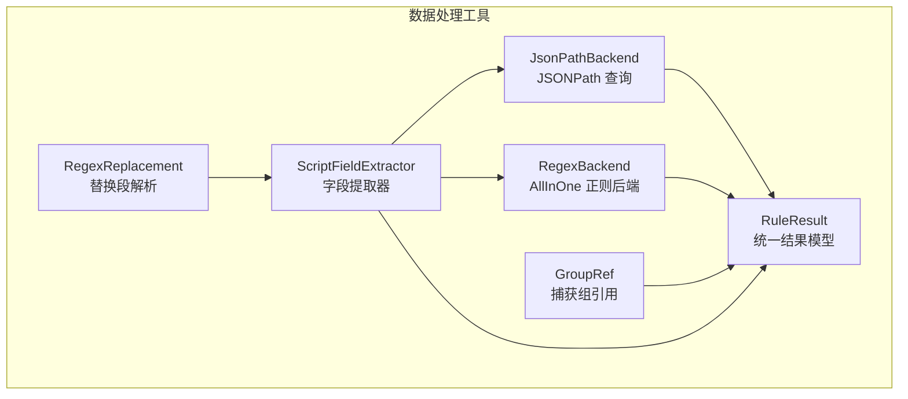
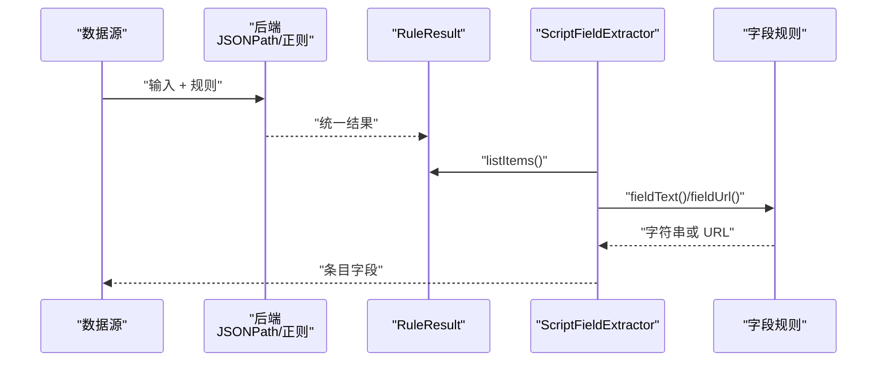
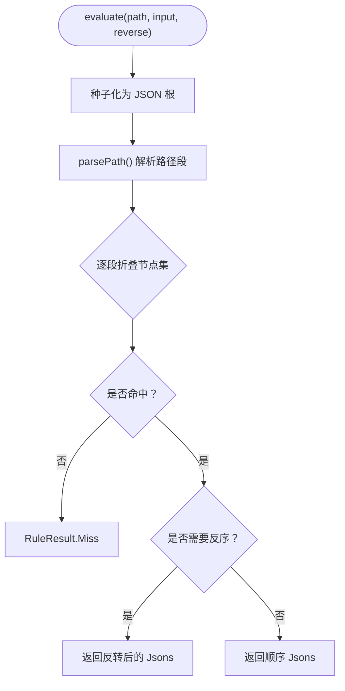
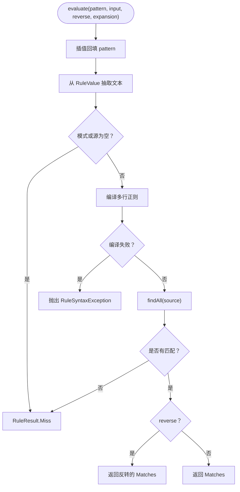
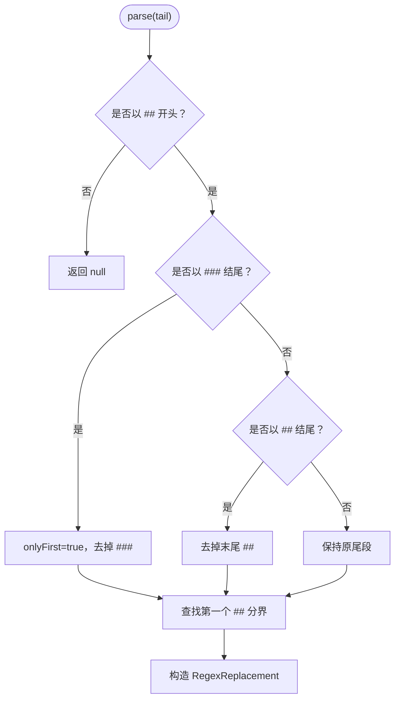
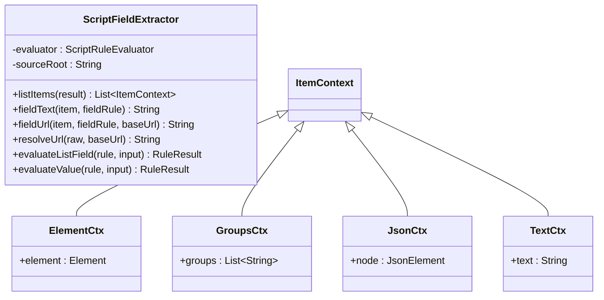
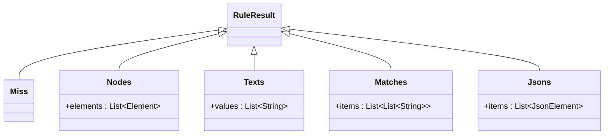
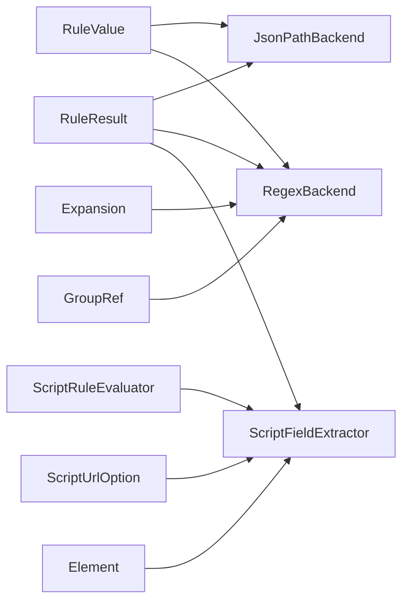
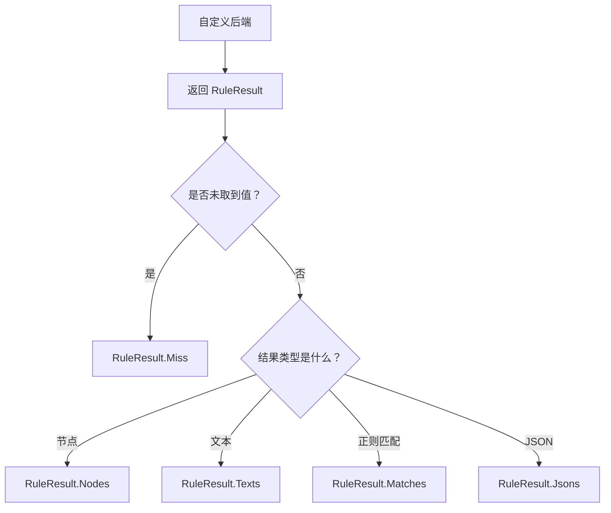

# 数据处理工具

<cite>
**本文引用的文件**   
- [JsonPathBackend.kt](file://lib_book_source/src/main/java/com/ebook/source/script/JsonPathBackend.kt)
- [RegexBackend.kt](file://lib_book_source/src/main/java/com/ebook/source/script/RegexBackend.kt)
- [RegexReplacement.kt](file://lib_book_source/src/main/java/com/ebook/source/script/RegexReplacement.kt)
- [ScriptFieldExtractor.kt](file://lib_book_source/src/main/java/com/ebook/source/script/ScriptFieldExtractor.kt)
- [RuleResult.kt](file://lib_book_source/src/main/java/com/ebook/source/script/RuleResult.kt)
- [JsonPathBackendTest.kt](file://lib_book_source/src/test/java/com/ebook/source/script/JsonPathBackendTest.kt)
- [RegexBackendTest.kt](file://lib_book_source/src/test/java/com/ebook/source/script/RegexBackendTest.kt)
- [RegexReplacementTest.kt](file://lib_book_source/src/test/java/com/ebook/source/script/RegexReplacementTest.kt)
- [RuleResultTest.kt](file://lib_book_source/src/test/java/com/ebook/source/script/RuleResultTest.kt)
- [ScriptFieldExtractorTest.kt](file://lib_book_source/src/test/java/com/ebook/source/script/ScriptFieldExtractorTest.kt)
</cite>

## 目录
1. [引言](#引言)
2. [项目结构](#项目结构)
3. [核心组件](#核心组件)
4. [架构总览](#架构总览)
5. [详细组件分析](#详细组件分析)
6. [依赖关系分析](#依赖关系分析)
7. [性能与优化建议](#性能与优化建议)
8. [正则表达式最佳实践](#正则表达式最佳实践)
9. [调试与排错指南](#调试与排错指南)
10. [示例与自定义后端开发指南](#示例与自定义后端开发指南)
11. [结论](#结论)

## 引言
本模块是脚本化数据源规则引擎中的“数据处理工具层”，负责把页面、文本、HTML 节点和 JSON 数据统一转换为结构化结果。它提供三类能力：
- JSON 处理封装：通过 `JsonPathBackend` 对 JSON 文档执行受限的 JSONPath 查询，并返回统一的 `RuleResult`。
- 正则处理后端：通过 `RegexBackend` 对整个文本执行 AllInOne 模式，产出“条目 × 捕获组”的结构；通过 `RegexReplacement` 解析替换段；并通过 `GroupRef` 在字段层引用捕获组。
- 字段提取器：通过 `ScriptFieldExtractor` 把列表结果展开为条目上下文，并把单值字段规则收敛到字符串或 URL。

该层的核心设计原则是“类型化拒绝未知形态”：对不在规格子集内的语法或输入域（例如对 HTML 节点跑 JSONPath、对 JSON 跑 AllInOne 正则），直接抛出受控异常，而不是静默返回空结果。这样既能避免误判，又便于调用方用短路逻辑继续尝试其他分支。

## 项目结构
这些组件位于脚本源码模块的 `script` 包中，属于规则求值基础设施：
- JSON 路径查询：`JsonPathBackend.kt`
- 正则后端与捕获组引用：`RegexBackend.kt`
- 正则替换段解析：`RegexReplacement.kt`
- 列表到条目上下文转换：`ScriptFieldExtractor.kt`
- 统一结果模型与文本收敛：`RuleResult.kt`
- 单元测试：对应五个测试类

**图表来源**
- [JsonPathBackend.kt:1-258](file://lib_book_source/src/main/java/com/ebook/source/script/JsonPathBackend.kt#L1-L258)
- [RegexBackend.kt:1-75](file://lib_book_source/src/main/java/com/ebook/source/script/RegexBackend.kt#L1-L75)
- [RegexReplacement.kt:1-49](file://lib_book_source/src/main/java/com/ebook/source/script/RegexReplacement.kt#L1-L49)
- [ScriptFieldExtractor.kt:1-90](file://lib_book_source/src/main/java/com/ebook/source/script/ScriptFieldExtractor.kt#L1-L90)
- [RuleResult.kt:1-119](file://lib_book_source/src/main/java/com/ebook/source/script/RuleResult.kt#L1-L119)

**章节来源**
- [JsonPathBackend.kt:1-258](file://lib_book_source/src/main/java/com/ebook/source/script/JsonPathBackend.kt#L1-L258)
- [RegexBackend.kt:1-75](file://lib_book_source/src/main/java/com/ebook/source/script/RegexBackend.kt#L1-L75)
- [RegexReplacement.kt:1-49](file://lib_book_source/src/main/java/com/ebook/source/script/RegexReplacement.kt#L1-L49)
- [ScriptFieldExtractor.kt:1-90](file://lib_book_source/src/main/java/com/ebook/source/script/ScriptFieldExtractor.kt#L1-L90)
- [RuleResult.kt:1-119](file://lib_book_source/src/main/java/com/ebook/source/script/RuleResult.kt#L1-L119)

## 核心组件
| 组件 | 职责 | 关键输入 | 关键输出 | 典型使用场景 |
|---|---|---|---|---|
| `JsonPathBackend` | 解析并执行 JSONPath 子集，选择 JSON 节点 | JSONPath 表达式、`RuleValue` | `RuleResult.Jsons` 或 `Miss` | 从 API JSON 中取书信息、标签数组、分页总数 |
| `RegexBackend` | 对整个文本执行 AllInOne 正则，构造条目 | 以 `:` 开头的正则模式、`RuleValue` | `RuleResult.Matches` 或 `Miss` | 从列表页整源正则切出章节标题和链接 |
| `RegexReplacement` | 解析 `##` 替换尾段，区分净化与 OnlyOne | 规则尾部字符串 | `pattern`、`replacement`、`onlyFirst` | 正文净化、URL 图片地址替换 |
| `ScriptFieldExtractor` | 把列表结果转为条目上下文，并求值单值字段 | 列表型 `RuleResult`、字段规则 | 条目上下文、字符串或 URL | 搜索/发现/详情/目录四个链路的条目构建 |
| `RuleResult` | 定义一次规则求值的统一输出 | 无 | `Miss` / `Nodes` / `Texts` / `Matches` / `Jsons` | 所有后端的共同返回值 |
| `GroupRef` | 解析 `$n` 并在匹配条目中提取第 n 组 | 文本、匹配条目 | 组号或组值 | 目录字段中按 `$1`、`$2` 取值 |

**章节来源**
- [JsonPathBackend.kt:1-258](file://lib_book_source/src/main/java/com/ebook/source/script/JsonPathBackend.kt#L1-L258)
- [RegexBackend.kt:1-75](file://lib_book_source/src/main/java/com/ebook/source/script/RegexBackend.kt#L1-L75)
- [RegexReplacement.kt:1-49](file://lib_book_source/src/main/java/com/ebook/source/script/RegexReplacement.kt#L1-L49)
- [ScriptFieldExtractor.kt:1-90](file://lib_book_source/src/main/java/com/ebook/source/script/ScriptFieldExtractor.kt#L1-L90)
- [RuleResult.kt:1-119](file://lib_book_source/src/main/java/com/ebook/source/script/RuleResult.kt#L1-L119)

## 架构总览
数据处理流程通常经历三个阶段：
1. **数据加载**：上游拿到页面文本、HTML 节点、文本列表或 JSON。
2. **规则求值**：JSONPath 后端或正则后端根据规则产生 `RuleResult`。
3. **字段提取**：`ScriptFieldExtractor` 把列表结果展开为条目，逐字段求值并收敛成最终字符串或 URL。

**图表来源**
- [JsonPathBackend.kt:22-39](file://lib_book_source/src/main/java/com/ebook/source/script/JsonPathBackend.kt#L22-L39)
- [RegexBackend.kt:15-63](file://lib_book_source/src/main/java/com/ebook/source/script/RegexBackend.kt#L15-L63)
- [ScriptFieldExtractor.kt:27-89](file://lib_book_source/src/main/java/com/ebook/source/script/ScriptFieldExtractor.kt#L27-L89)
- [RuleResult.kt:11-61](file://lib_book_source/src/main/java/com/ebook/source/script/RuleResult.kt#L11-L61)

## 详细组件分析

### JsonPathBackend：JSONPath 查询引擎
`JsonPathBackend` 实现的是规格定义的 JSONPath 子集，而不是引入第三方全量实现。其设计目标是“类型化拒绝未知复杂语法”，避免静默 Miss 掩盖规则错误。

#### 支持的 JSONPath 特性
- `$` 根节点。
- `.name` 点号键名。
- `['name']`、`["name"]` 引号键名。
- `[n]`、`[-n]` 数组下标，越界时跳过。
- `[*]`、`.*` 通配，打平对象值和数组元素。
- `..name` 递归同名查找，先父后子。
- `[a:b(:c)]` 标准半开切片：end 排他，负数从尾数计算。
- `[a,b]` 联合选取多个键或索引。

#### 不支持的特性
- 过滤器表达式，如 `[?(...)]`。
- 脚本表达式，如 `[(...)]`。
- 递归通配 `..*`。
- 对 HTML 节点上下文运行 JSONPath。

#### 输入种子策略
- `RuleValue.Json`：原样作为 JSON 根。
- `RuleValue.Page`：将页面文本按宽松模式解析为 JSON；解析失败视为未取到值。
- `RuleValue.Texts`：取第一个文本再尝试 JSON 解析；失败同样视为未取到值。
- `RuleValue.Nodes`：直接抛出不支持异常，因为 HTML 节点没有 JSON 语义。

#### 路径解析与求值流程

**图表来源**
- [JsonPathBackend.kt:22-39](file://lib_book_source/src/main/java/com/ebook/source/script/JsonPathBackend.kt#L22-L39)
- [JsonPathBackend.kt:41-100](file://lib_book_source/src/main/java/com/ebook/source/script/JsonPathBackend.kt#L41-L100)
- [JsonPathBackend.kt:201-258](file://lib_book_source/src/main/java/com/ebook/source/script/JsonPathBackend.kt#L201-L258)

#### 复杂度与行为要点
- 路径解析是一次线性扫描，每段生成一个作用于节点集的函数。
- 递归下探会遍历整个子树，时间复杂度与 JSON 树大小相关。
- 切片按标准半开方言实现，与链式索引的闭区间不同，不能混用。
- 零命中统一归并为 `RuleResult.Miss`，用于短路判断。
- 语法错误或不在子集内的语法抛 `RuleSyntaxException` 或 `UnsupportedRuleFeatureException`。

**章节来源**
- [JsonPathBackend.kt:1-258](file://lib_book_source/src/main/java/com/ebook/source/script/JsonPathBackend.kt#L1-L258)
- [JsonPathBackendTest.kt:1-145](file://lib_book_source/src/test/java/com/ebook/source/script/JsonPathBackendTest.kt#L1-L145)

### RegexBackend：正则 AllInOne 后端
`RegexBackend` 处理以 `:` 开头的 AllInOne 模式。它不是普通单行正则匹配，而是“对整个源文本进行全局匹配，每个匹配作为一个条目”。

#### 关键语义
- 输入是文本：页面文本直接作为字符串；HTML 节点集合会拼接成文本；纯文本列表也会拼接。
- JSON 输入进入正则后端会被拒绝，因为“对整个源文本跑正则”不适合 JSON 结构化数据。
- 每条匹配是一个“捕获组列表”，下标 0 是整段匹配，下标 1 起是分组。
- 结果类型为 `RuleResult.Matches`，保留二维结构，避免塌缩成一维字符串列表。

#### 反序前缀
语料中存在 `-:` 形式，表示目录等列表需要倒序。反序标志在词法层剥掉，只影响条目顺序，不影响正则编译。

#### 错误处理
- 非法正则不会抛出运行期异常穿透解析，而是转为 `RuleSyntaxException`。
- 空模式或空源文本返回 `RuleResult.Miss`。
- 零匹配也返回 `RuleResult.Miss`。

**图表来源**
- [RegexBackend.kt:15-63](file://lib_book_source/src/main/java/com/ebook/source/script/RegexBackend.kt#L15-L63)

**章节来源**
- [RegexBackend.kt:1-75](file://lib_book_source/src/main/java/com/ebook/source/script/RegexBackend.kt#L1-L75)
- [RegexBackendTest.kt:1-101](file://lib_book_source/src/test/java/com/ebook/source/script/RegexBackendTest.kt#L1-L101)

### RegexReplacement：替换规则引擎
`RegexReplacement` 负责解析规则尾部以 `##` 开头的替换段，区分两种形态：
- 净化形态：两个 `##` 之间是模式，之后是替换文本，默认对所有匹配执行替换。
- OnlyOne 形态：以三个 `#` 收尾，表示只对第一个匹配执行替换。

#### 解析规则
- 必须以 `##` 开头。
- 末尾可以是 `##` 或 `###`。
- 第一个深度 0 的 `##` 作为“模式与替换的分界”。
- 替换文本中的捕获组引用原样保留，不在此处执行替换。
- 如果只有两个 `##`，模式为空串，替换也为空串。

#### 典型用法
- 正文净化：去除“全文阅读”“手机访问”等广告字样。
- URL 替换：把 `/book/(数字)` 替换为图片地址。
- URL 选项惯用法：`##$##,{...}`，其中模式是 `$`，替换部分是后续选项尾段。

**图表来源**
- [RegexReplacement.kt:22-49](file://lib_book_source/src/main/java/com/ebook/source/script/RegexReplacement.kt#L22-L49)

**章节来源**
- [RegexReplacement.kt:1-49](file://lib_book_source/src/main/java/com/ebook/source/script/RegexReplacement.kt#L1-L49)
- [RegexReplacementTest.kt:1-63](file://lib_book_source/src/test/java/com/ebook/source/script/RegexReplacementTest.kt#L1-L63)

### ScriptFieldExtractor：字段提取器
`ScriptFieldExtractor` 是“列表结果 → 条目上下文 → 字段求值”的装配层。它与 `ScriptRuleEvaluator` 分工明确：求值器回答“一条规则对一个输入解出什么”，提取器回答“列表结果怎么变成条目、字段规则喂哪个输入、URL 怎么落位”。

#### 四种条目上下文
- `ElementCtx`：HTML 节点条目。
- `GroupsCtx`：正则 AllInOne 的捕获组条目。
- `JsonCtx`：JSON 节点条目。
- `TextCtx`：文本条目。

#### 列表展开规则
- `RuleResult.Miss`：零条目。
- `RuleResult.Nodes`：每个元素一个条目。
- `RuleResult.Matches`：每个捕获组列表一个条目。
- `RuleResult.Texts`：每个文本一个条目。
- `RuleResult.Jsons`：如果是数组节点则展开为数组元素；否则作为单个条目。注意这里只展开一层，不做递归展开。

#### 字段求值与 URL 落位
- `fieldText`：把字段规则收敛为第一个文本，未命中时返回空串。
- `fieldUrl`：取值后按规则落位 URL，包括剥离选项尾段、绝对路径拼接、再回附尾段。
- `evaluateListField`：列表字段使用“末段裸词按 CSS 选择器出节点”的口径。
- `evaluateValue`：单值字段使用“末段裸词按属性取值器”的口径。

**图表来源**
- [ScriptFieldExtractor.kt:13-89](file://lib_book_source/src/main/java/com/ebook/source/script/ScriptFieldExtractor.kt#L13-L89)

**章节来源**
- [ScriptFieldExtractor.kt:1-90](file://lib_book_source/src/main/java/com/ebook/source/script/ScriptFieldExtractor.kt#L1-L90)
- [ScriptFieldExtractorTest.kt:1-76](file://lib_book_source/src/test/java/com/ebook/source/script/ScriptFieldExtractorTest.kt#L1-L76)

### RuleResult：结果数据结构
`RuleResult` 是所有后端共享的输出抽象，重点在于区分“未取到值”和“取到空列表”。

#### 结果类型
| 类型 | 含义 | 典型来源 |
|---|---|---|
| `Miss` | 未取到值，参与 `||` 短路 | JSONPath 无命中、正则无匹配、JSON 解析失败 |
| `Nodes` | HTML 节点集合 | CSS 选择器、DOM 遍历 |
| `Texts` | 文本集合 | 文本列表、节点文本映射 |
| `Matches` | 正则 AllInOne 的条目 × 捕获组 | `:` 开头的全源正则 |
| `Jsons` | JSON 节点集合 | JSONPath 查询 |

#### 单值收敛
- `firstText()`：统一收敛为第一个文本，`Miss` 和空集合都返回空串。
- `toTextList()`：把所有结果转为文本列表，供合并、交错等场景使用。
- `mapToTexts()`：把节点集按取值器映射为文本。
- `jsonText()`：把 JSON 节点转为字符串，`null` 转为空串，对象/数组转为紧凑 JSON。

**图表来源**
- [RuleResult.kt:11-61](file://lib_book_source/src/main/java/com/ebook/source/script/RuleResult.kt#L11-L61)

**章节来源**
- [RuleResult.kt:1-119](file://lib_book_source/src/main/java/com/ebook/source/script/RuleResult.kt#L1-L119)
- [RuleResultTest.kt:1-102](file://lib_book_source/src/test/java/com/ebook/source/script/RuleResultTest.kt#L1-L102)

## 依赖关系分析
数据处理工具的内部依赖关系如下：
- `JsonPathBackend` 依赖 `RuleValue` 和 `RuleResult`，并可能抛出 `RuleSyntaxException`、`UnsupportedRuleFeatureException`。
- `RegexBackend` 依赖 `RuleValue`、`RuleResult` 和 `Expansion`，并通过 `GroupRef` 暴露捕获组引用能力。
- `RegexReplacement` 是纯解析器，不依赖运行时数据。
- `ScriptFieldExtractor` 依赖 `ScriptRuleEvaluator`、`RuleResult`、`RuleValue`、`ScriptUrlOption` 以及 JSoup 的 `Element`。
- `RuleResult` 是下游收敛和映射的统一入口。

**图表来源**
- [JsonPathBackend.kt:1-258](file://lib_book_source/src/main/java/com/ebook/source/script/JsonPathBackend.kt#L1-L258)
- [RegexBackend.kt:1-75](file://lib_book_source/src/main/java/com/ebook/source/script/RegexBackend.kt#L1-L75)
- [ScriptFieldExtractor.kt:1-90](file://lib_book_source/src/main/java/com/ebook/source/script/ScriptFieldExtractor.kt#L1-L90)
- [RuleResult.kt:1-119](file://lib_book_source/src/main/java/com/ebook/source/script/RuleResult.kt#L1-L119)

**章节来源**
- [JsonPathBackend.kt:1-258](file://lib_book_source/src/main/java/com/ebook/source/script/JsonPathBackend.kt#L1-L258)
- [RegexBackend.kt:1-75](file://lib_book_source/src/main/java/com/ebook/source/script/RegexBackend.kt#L1-L75)
- [ScriptFieldExtractor.kt:1-90](file://lib_book_source/src/main/java/com/ebook/source/script/ScriptFieldExtractor.kt#L1-L90)
- [RuleResult.kt:1-119](file://lib_book_source/src/main/java/com/ebook/source/script/RuleResult.kt#L1-L119)

## 性能与优化建议
- JSONPath 递归查找会对子树做完整遍历，适合中小规模 JSON；对大型文档应优先使用精确路径，避免过度使用 `..name`。
- 切片和联合查询会在节点集上多次 `flatMap`，应避免在无意义的中间层级反复通配。
- 正则 AllInOne 使用 `findAll` 全量扫描文本，复杂回溯模式在大文本上可能较慢；尽量让模式尽早锚定，减少回溯。
- 替换操作应先解析出 `RegexReplacement`，再按需执行替换，避免重复解析。
- 字段提取器的 `listItems` 只做一层 JSON 数组展开，避免深层嵌套带来的意外展开成本。
- 对于频繁复用的规则，可在上层缓存已解析的正则或 JSON 结构，但要注意请求上下文变化时的失效策略。
- 使用 `RuleResult.firstText()` 统一收敛单值字段，避免在每个调用方重复写分支逻辑。

[本节为通用性能建议，不直接分析具体代码行]

## 正则表达式最佳实践
- AllInOne 模式应面向“造条目”的场景，即列表页、发现页、目录页；不要用它替代结构化 JSON 查询。
- 合理使用多行模式，使 `^` 和 `$` 按行匹配，适合正文或目录按行切条目的站点。
- 捕获组编号要稳定：`$1`、`$2` 应与字段规则一一对应，越界时由 `GroupRef.valueOf` 返回空串，而不是抛异常。
- 替换模式优先使用明确的边界，例如 URL 替换时使用路径片段和数字约束，避免误伤相邻内容。
- 净化模式放在任意规则之后；OnlyOne 模式只在确实只需要替换第一个匹配时使用。
- 如果替换文本中包含捕获组引用，应保持原样，交由实际替换执行阶段处理。
- 当正则无法编译时，应期望得到 `RuleSyntaxException`，以便调用方走 `||` 短路到其他规则。

**章节来源**
- [RegexBackend.kt:15-75](file://lib_book_source/src/main/java/com/ebook/source/script/RegexBackend.kt#L15-L75)
- [RegexReplacement.kt:1-49](file://lib_book_source/src/main/java/com/ebook/source/script/RegexReplacement.kt#L1-L49)
- [RegexBackendTest.kt:1-101](file://lib_book_source/src/test/java/com/ebook/source/script/RegexBackendTest.kt#L1-L101)
- [RegexReplacementTest.kt:1-63](file://lib_book_source/src/test/java/com/ebook/source/script/RegexReplacementTest.kt#L1-L63)

## 调试与排错指南
常见错误及排查方法：

| 现象 | 可能原因 | 排查方式 |
|---|---|---|
| JSONPath 返回 `Miss` | 路径不存在、数组越界、JSON 文本无效 | 检查 `$` 起点、键名、下标、JSON 是否可解析 |
| JSONPath 抛出语法错误 | 使用了过滤器、脚本表达式、递归通配或残缺引号键 | 确认是否超出子集；修正为支持的 JSONPath 语法 |
| JSONPath 对 HTML 节点报错 | 用 HTML 上下文跑 JSONPath | 改用节点选择器后端，不要用 JSONPath |
| 正则 AllInOne 返回 `Miss` | 无匹配、空模式、空源 | 检查正则能否在全源匹配，确认输入是否为文本 |
| 正则 AllInOne 对 JSON 报错 | JSON 上下文不应进入正则后端 | 改用 JSONPath 或先把 JSON 转文本 |
| 正则编译异常被吞 | 内部已转为 `RuleSyntaxException` | 捕获 `RuleSyntaxException` 而非普通异常 |
| 字段取不到值 | 组号写错、取值器不对、URL 尾段未剥离 | 用 `GroupRef.parseOrNull` 验证组引用，检查 CSS 选择器和取值器 |
| URL 拼出 404 | URL 尾段 `{...}` 没剥离就落位 | 使用 `resolveUrl`，确保尾段在下一次请求时才带上 |

**章节来源**
- [JsonPathBackendTest.kt:63-145](file://lib_book_source/src/test/java/com/ebook/source/script/JsonPathBackendTest.kt#L63-L145)
- [RegexBackendTest.kt:29-101](file://lib_book_source/src/test/java/com/ebook/source/script/RegexBackendTest.kt#L29-L101)
- [ScriptFieldExtractorTest.kt:18-76](file://lib_book_source/src/test/java/com/ebook/source/script/ScriptFieldExtractorTest.kt#L18-L76)

## 示例与自定义后端开发指南

### JSONPath 示例
- 取总数：使用根路径加键名。
- 取数组中某项：使用方括号索引，支持负数从尾数。
- 取多个字段：使用联合语法。
- 递归收集标签：使用递归下探配合通配。
- 反序列表：传入反序标志。

参考测试断言位置：
- [JsonPathBackendTest.kt:27-62](file://lib_book_source/src/test/java/com/ebook/source/script/JsonPathBackendTest.kt#L27-L62)
- [JsonPathBackendTest.kt:63-93](file://lib_book_source/src/test/java/com/ebook/source/script/JsonPathBackendTest.kt#L63-L93)

### 正则 AllInOne 示例
- 从列表页整源正则切出章节标题和链接。
- 使用 `$1`、`$2` 在条目字段中引用捕获组。
- 使用 `-:` 反序目录。
- 对非组引用文本继续走链式规则。

参考测试断言位置：
- [RegexBackendTest.kt:17-28](file://lib_book_source/src/test/java/com/ebook/source/script/RegexBackendTest.kt#L17-L28)
- [RegexBackendTest.kt:35-53](file://lib_book_source/src/test/java/com/ebook/source/script/RegexBackendTest.kt#L35-L53)
- [RegexBackendTest.kt:84-101](file://lib_book_source/src/test/java/com/ebook/source/script/RegexBackendTest.kt#L84-L101)

### 正则替换示例
- 正文净化：模式匹配广告文本，替换为空。
- URL 图片替换：模式匹配旧路径，替换为新图片地址。
- OnlyOne 模式：只替换第一个匹配。
- URL 选项惯用法：模式为 `$`，替换部分携带请求选项。

参考测试断言位置：
- [RegexReplacementTest.kt:12-38](file://lib_book_source/src/test/java/com/ebook/source/script/RegexReplacementTest.kt#L12-L38)
- [RegexReplacementTest.kt:40-63](file://lib_book_source/src/test/java/com/ebook/source/script/RegexReplacementTest.kt#L40-L63)

### 字段提取示例
- 从 HTML 列表取出条目节点。
- 从正则 AllInOne 的捕获组中提取字段。
- 从 JSON 数组展开条目。
- 拼接绝对 URL 并回附请求选项尾段。

参考测试断言位置：
- [ScriptFieldExtractorTest.kt:18-33](file://lib_book_source/src/test/java/com/ebook/source/script/ScriptFieldExtractorTest.kt#L18-L33)
- [ScriptFieldExtractorTest.kt:35-76](file://lib_book_source/src/test/java/com/ebook/source/script/ScriptFieldExtractorTest.kt#L35-L76)

### 自定义后端开发指南
当前仓库采用 JSONPath 和正则两类后端，若需扩展新的数据源格式，可参考以下设计约束：

1. **定义统一输出**：新后端必须返回 `RuleResult` 或其子类，不要自行定义新的结果类型。
2. **区分未取到值与空结果**：未命中返回 `RuleResult.Miss`；取到零个元素返回对应类型的空列表。
3. **类型化拒绝未知输入**：如果输入类型不属于后端语义范围，应抛出 `UnsupportedRuleFeatureException`，而不是静默 Miss。
4. **语法错误类型化**：模式或表达式语法错误应抛出 `RuleSyntaxException`，便于调用方短路。
5. **复用字段提取器**：如果新后端产出列表型结果，应通过 `ScriptFieldExtractor.listItems` 转为条目上下文。
6. **复用结果文本映射**：如果需要把节点或 JSON 转为文本，使用 `RuleResult.mapToTexts`、`jsonText`、`firstText`。
7. **保持子集边界清晰**：不要为了兼容历史语料而隐式支持未声明语法；扩集应以真实站点语料为依据。

**图表来源**
- [RuleResult.kt:11-61](file://lib_book_source/src/main/java/com/ebook/source/script/RuleResult.kt#L11-L61)

**章节来源**
- [RuleResult.kt:1-119](file://lib_book_source/src/main/java/com/ebook/source/script/RuleResult.kt#L1-L119)
- [JsonPathBackend.kt:1-258](file://lib_book_source/src/main/java/com/ebook/source/script/JsonPathBackend.kt#L1-L258)
- [RegexBackend.kt:1-75](file://lib_book_source/src/main/java/com/ebook/source/script/RegexBackend.kt#L1-L75)
- [ScriptFieldExtractor.kt:1-90](file://lib_book_source/src/main/java/com/ebook/source/script/ScriptFieldExtractor.kt#L1-L90)

## 结论
数据处理工具模块通过 `RuleResult` 统一了 JSONPath、正则和字段提取的结果形态，既保证了跨链路的一致性，又通过类型化拒绝避免了静默错误。`JsonPathBackend` 严格限制 JSONPath 子集，`RegexBackend` 专注 AllInOne 文本切条，`RegexReplacement` 分离替换解析与执行，`ScriptFieldExtractor` 把列表结果可靠地装配为条目字段。在实际使用中，应优先选择结构化查询（JSONPath）而非正则猜测，谨慎使用递归和回溯，并通过单元测试锁定关键行为契约。