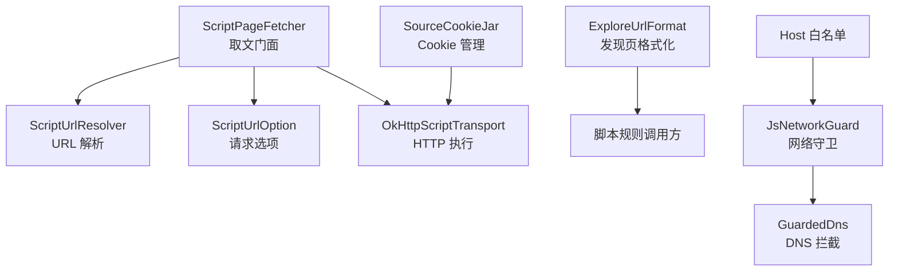
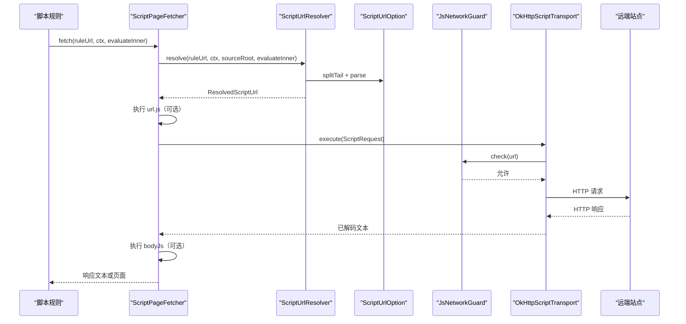
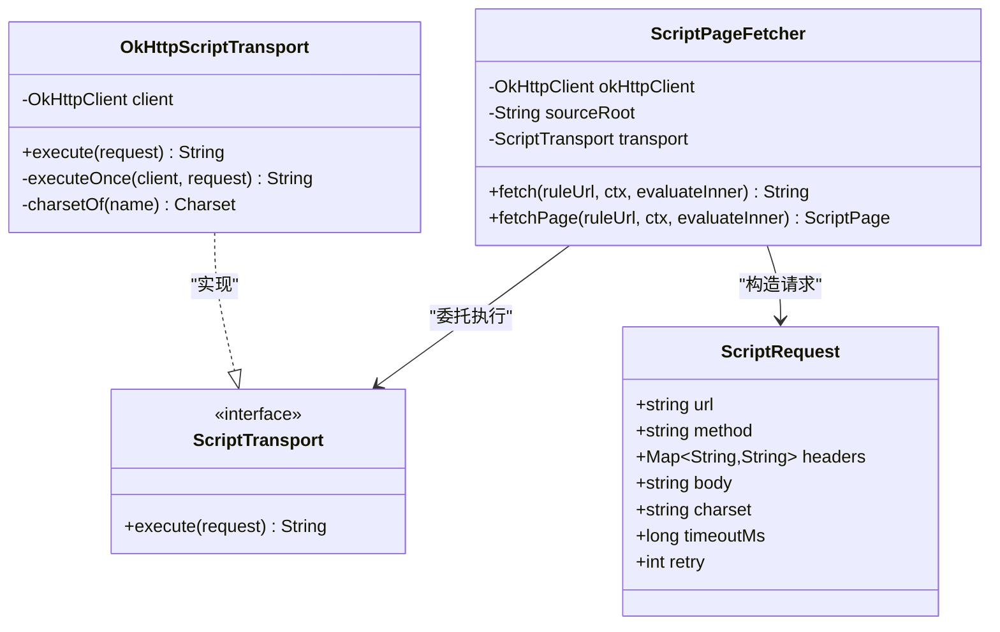
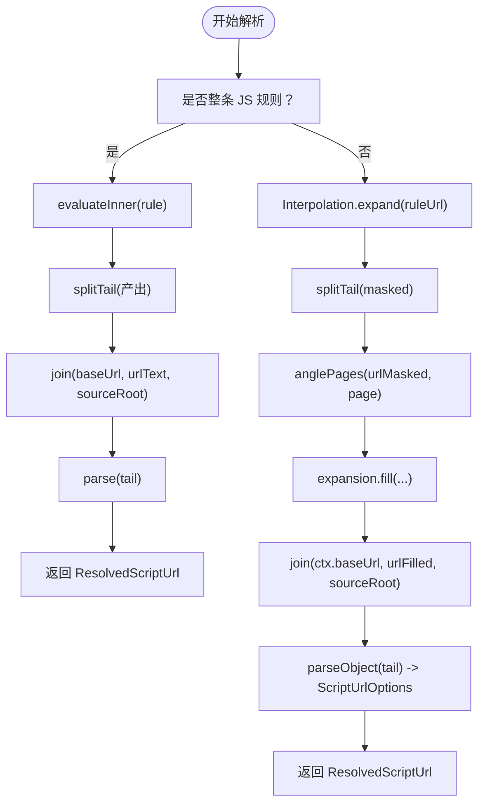
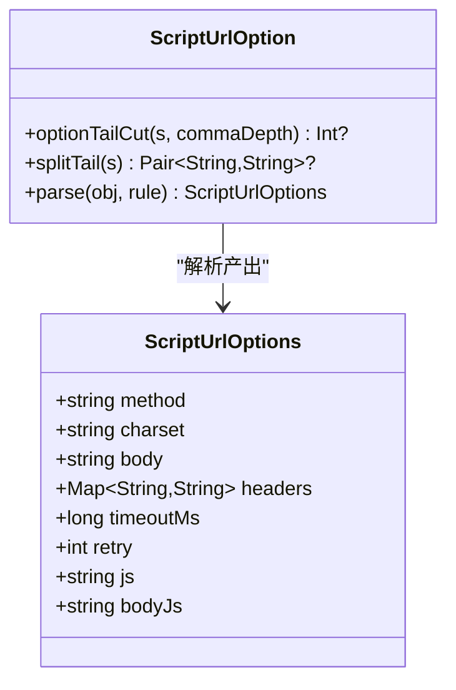
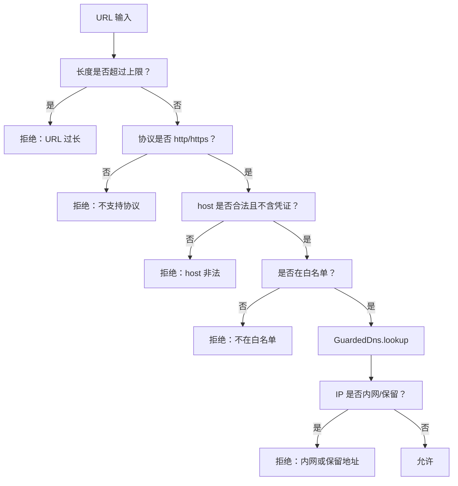
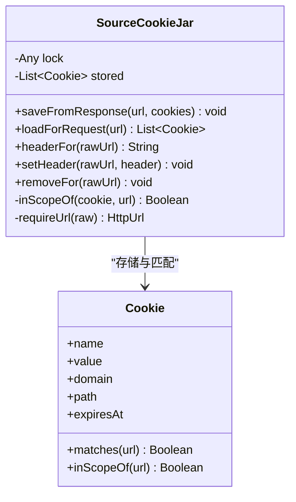
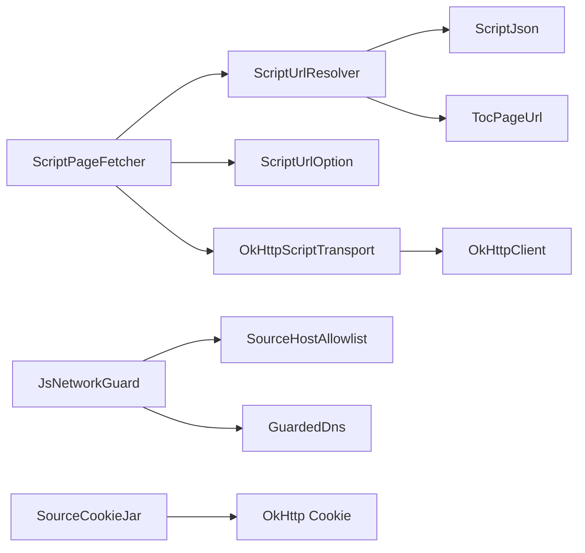

# 脚本网络与HTTP

<cite>
**本文引用的文件**
- [ScriptHttp.kt](file://lib_book_source/src/main/java/com/ebook/source/script/ScriptHttp.kt)
- [ScriptUrlResolver.kt](file://lib_book_source/src/main/java/com/ebook/source/script/ScriptUrlResolver.kt)
- [ExploreUrlFormat.kt](file://lib_book_source/src/main/java/com/ebook/source/script/ExploreUrlFormat.kt)
- [ScriptUrlOption.kt](file://lib_book_source/src/main/java/com/ebook/source/script/ScriptUrlOption.kt)
- [JsNetworkGuard.kt](file://lib_book_source/src/main/java/com/ebook/source/sandbox/JsNetworkGuard.kt)
- [SourceCookieJar.kt](file://lib_book_source/src/main/java/com/ebook/source/sandbox/SourceCookieJar.kt)
</cite>

## 目录
1. [简介](#简介)
2. [项目结构](#项目结构)
3. [核心组件](#核心组件)
4. [架构总览](#架构总览)
5. [详细组件分析](#详细组件分析)
6. [依赖关系分析](#依赖关系分析)
7. [性能与缓存](#性能与缓存)
8. [故障排查指南](#故障排查指南)
9. [结论](#结论)

## 简介
本技术文档聚焦脚本网络与 HTTP 能力，覆盖以下关键对象：
- ScriptHttp：网络请求封装器，负责把规则中的 URL 与选项转换为真实 HTTP 请求，并返回按字符集解码的响应文本。
- ScriptUrlResolver：URL 解析器，负责模板变量替换、页码段取舍、相对落位和 JS 整条 URL 求值。
- ExploreUrlFormat：搜索/发现入口格式化器，负责条目切分、关键词处理、JSON 格式识别和脚本程序形态保护。
- ScriptUrlOption：请求选项配置，涵盖方法、字符集、请求体、头部、超时、重试以及 js/bodyJs 钩子。
- JsNetworkGuard：网络访问安全控制，负责主机白名单、URL 准入校验、DNS 拦截与内网地址阻断。
- SourceCookieJar：会话 Cookie 管理，负责域名隔离、会话保持、显式读写与线程安全。

这些组件共同构成“书源脚本”的网络层：脚本提供 URL 规则与数据规则，平台负责解析、安全、连接与响应解码。

## 项目结构
本模块位于 `lib_book_source`，相关实现分为两层：
- 脚本侧能力：`script` 包中的 URL 解析、选项解析、页面取文门面、发现页格式化。
- 沙箱侧安全：`sandbox` 包中的网络守卫、Cookie 管理、主机白名单等。



**图示来源**
- [ScriptHttp.kt:1-157](file://lib_book_source/src/main/java/com/ebook/source/script/ScriptHttp.kt#L1-L157)
- [ScriptUrlResolver.kt:1-133](file://lib_book_source/src/main/java/com/ebook/source/script/ScriptUrlResolver.kt#L1-L133)
- [ScriptUrlOption.kt:1-149](file://lib_book_source/src/main/java/com/ebook/source/script/ScriptUrlOption.kt#L1-L149)
- [ExploreUrlFormat.kt:1-128](file://lib_book_source/src/main/java/com/ebook/source/script/ExploreUrlFormat.kt#L1-L128)
- [JsNetworkGuard.kt:1-167](file://lib_book_source/src/main/java/com/ebook/source/sandbox/JsNetworkGuard.kt#L1-L167)
- [SourceCookieJar.kt:1-127](file://lib_book_source/src/main/java/com/ebook/source/sandbox/SourceCookieJar.kt#L1-L127)

**章节来源**
- [ScriptHttp.kt:1-157](file://lib_book_source/src/main/java/com/ebook/source/script/ScriptHttp.kt#L1-L157)
- [ScriptUrlResolver.kt:1-133](file://lib_book_source/src/main/java/com/ebook/source/script/ScriptUrlResolver.kt#L1-L133)
- [ExploreUrlFormat.kt:1-128](file://lib_book_source/src/main/java/com/ebook/source/script/ExploreUrlFormat.kt#L1-L128)
- [ScriptUrlOption.kt:1-149](file://lib_book_source/src/main/java/com/ebook/source/script/ScriptUrlOption.kt#L1-L149)
- [JsNetworkGuard.kt:1-167](file://lib_book_source/src/main/java/com/ebook/source/sandbox/JsNetworkGuard.kt#L1-L167)
- [SourceCookieJar.kt:1-127](file://lib_book_source/src/main/java/com/ebook/source/sandbox/SourceCookieJar.kt#L1-L127)

## 核心组件
本节对六大核心组件进行概览性说明，并在后续章节展开细节。

| 组件 | 职责 | 关键行为 | 典型输入 | 典型输出 |
|---|---|---|---|---|
| ScriptPageFetcher | 取文门面 | URL 解析 → 可选 JS 改写 → 发送请求 → 可选响应 JS 处理 | 规则 URL、上下文、内部求值函数 | 响应文本或带落点地址的页面 |
| OkHttpScriptTransport | HTTP 传输 | 显式字节解码、每请求超时派生、非 2xx 转 IO 异常参与重试 | ScriptRequest | 已解码字符串 |
| ScriptUrlResolver | URL 解析 | 占位符展开、页码段取舍、相对落位、JS 整条 URL 求值 | 规则 URL、上下文、源根 | ResolvedScriptUrl |
| ScriptUrlOption | 请求选项 | 尾段 JSON 切分与解析、拒绝不安全能力、参数校验 | 尾段 JSON | ScriptUrlOptions |
| ExploreUrlFormat | 发现页格式化 | 文本行切分、JSON 数组识别、脚本程序保护 | 原始发现页内容 | 条目列表 |
| JsNetworkGuard | 网络守卫 | URL 准入、主机白名单、DNS 拦截、内网阻断 | URL、IP 地址 | 允许或抛出拒绝异常 |
| SourceCookieJar | Cookie 管理 | 会话保持、域名隔离、显式读写、线程安全 | URL、Cookie 头 | Cookie 头文本或 Cookie 集合 |

**章节来源**
- [ScriptHttp.kt:1-157](file://lib_book_source/src/main/java/com/ebook/source/script/ScriptHttp.kt#L1-L157)
- [ScriptUrlResolver.kt:1-133](file://lib_book_source/src/main/java/com/ebook/source/script/ScriptUrlResolver.kt#L1-L133)
- [ExploreUrlFormat.kt:1-128](file://lib_book_source/src/main/java/com/ebook/source/script/ExploreUrlFormat.kt#L1-L128)
- [ScriptUrlOption.kt:1-149](file://lib_book_source/src/main/java/com/ebook/source/script/ScriptUrlOption.kt#L1-L149)
- [JsNetworkGuard.kt:1-167](file://lib_book_source/src/main/java/com/ebook/source/sandbox/JsNetworkGuard.kt#L1-L167)
- [SourceCookieJar.kt:1-127](file://lib_book_source/src/main/java/com/ebook/source/sandbox/SourceCookieJar.kt#L1-L127)

## 架构总览
整体流程可概括为：脚本规则提供 URL 与数据规则；URL 解析器构建绝对地址与请求选项；取文门面执行可选的 URL JS 与 Body JS；HTTP 传输使用 OkHttp 完成网络请求；网络守卫在 URL 与 DNS 层面做安全拦截；Cookie 罐维持会话。



**图示来源**
- [ScriptHttp.kt:1-157](file://lib_book_source/src/main/java/com/ebook/source/script/ScriptHttp.kt#L1-L157)
- [ScriptUrlResolver.kt:1-133](file://lib_book_source/src/main/java/com/ebook/source/script/ScriptUrlResolver.kt#L1-L133)
- [ScriptUrlOption.kt:1-149](file://lib_book_source/src/main/java/com/ebook/source/script/ScriptUrlOption.kt#L1-L149)
- [JsNetworkGuard.kt:1-167](file://lib_book_source/src/main/java/com/ebook/source/sandbox/JsNetworkGuard.kt#L1-L167)

## 详细组件分析

### ScriptHttp：网络请求封装器
ScriptHttp 的核心是 `ScriptPageFetcher` 与 `OkHttpScriptTransport`。前者负责从规则 URL 到响应文本的端到端流程，后者负责真正发起 HTTP 请求。

关键设计要点：
- 请求模型 `ScriptRequest` 与传输接口 `ScriptTransport` 解耦，便于测试与 2d 金标准验证。
- 响应采用 `response.body.bytes()` 再按 charset 解码，避免全局客户端编码拦截导致的 GBK 站点乱码。
- 超时通过 `client.newBuilder()` 派生新客户端，共享连接池但仅对有超时的请求付出额外成本。
- 非 2xx 状态被转为 `IOException`，配合 retry 参数实现“重试次数 = retry，总尝试 = retry + 1”。
- URL 选项中的 `js` 与 `bodyJs` 不在解析期执行，而是在取文阶段执行，避免副作用污染规则兜底分支。



**图示来源**
- [ScriptHttp.kt:1-157](file://lib_book_source/src/main/java/com/ebook/source/script/ScriptHttp.kt#L1-L157)

**章节来源**
- [ScriptHttp.kt:1-157](file://lib_book_source/src/main/java/com/ebook/source/script/ScriptHttp.kt#L1-L157)

### ScriptUrlResolver：URL 解析机制
URL 解析遵循严格次序：
1. 若整条规则以 `@js:` 或 `<js>` 开头，则先求值出 URL 文本，再走尾段与落位处理。
2. 否则先进行模板占位符展开。
3. 在占位符态识别 `<分隔符,内容>` 页码段，按当前页决定是否替换。
4. 回填占位符后拼接绝对 URL。
5. 解析尾段 JSON 作为请求选项。

重点语义：
- 页码段 `<,2>` 只在占位符态判断，防止展开值误吞。
- 相对落位复用 TocPageUrl.join，但不复用 ListPageUrl.build 的首页裁剪逻辑，避免误裁真实页码。
- JS 整条 URL 产出为空时抛执行失败异常，而非静默回退到源首页。
- 尾段 JSON 前导逗号会被剥离，否则 kotlinx.serialization 会报语法错误。



**图示来源**
- [ScriptUrlResolver.kt:1-133](file://lib_book_source/src/main/java/com/ebook/source/script/ScriptUrlResolver.kt#L1-L133)

**章节来源**
- [ScriptUrlResolver.kt:1-133](file://lib_book_source/src/main/java/com/ebook/source/script/ScriptUrlResolver.kt#L1-L133)

### ExploreUrlFormat：搜索 URL 格式化逻辑
ExploreUrlFormat 负责发现页 `exploreUrl` 的条目解析，支持三种形态：
- 文本格式：`名称::URL`，行优先切分，单行内用 `&&` 分割。
- JSON 格式：数组中每个元素取 `title` 与 `url`。
- 脚本程序形态：整串为 `<js>…</js>`，不消费、不执行，直接返回空清单。

关键行为：
- 文本切分对引号与 `{}` 深度感知，避免 URL 查询串中的 `&&` 被误切。
- 未闭合引号或花括号采取“从宽”策略：少切比炸掉更安全。
- 脚本程序形态必须识别并跳过，否则会逐行当作 URL 发出大量 404 请求。
- JSON 中缺少有效 `url` 的元素会被忽略。

```mermaid
flowchart TD
    Input["raw 输入"] --> Trim["trim()"]
    Trim --> Empty{"是否为空？"}
    Empty -->|是| ReturnEmpty["返回空清单"]
    Empty -->|否| IsScript["isScriptProgram(text)"]
    IsScript -->|是| ReturnEmpty
    IsScript -->|否| IsJson["text.startsWith(\"[\")"]
    IsJson -->|是| SplitJson["解析 JsonArray 并取 title,url"]
    IsJson -->|否| SplitText["按行切分，再按顶层 && 切分"]
    SplitText --> BuildEntries["生成 ExploreEntry"]
    SplitJson --> BuildEntries
    BuildEntries --> Output["返回条目列表"]
```

**图示来源**
- [ExploreUrlFormat.kt:1-128](file://lib_book_source/src/main/java/com/ebook/source/script/ExploreUrlFormat.kt#L1-L128)

**章节来源**
- [ExploreUrlFormat.kt:1-128](file://lib_book_source/src/main/java/com/ebook/source/script/ExploreUrlFormat.kt#L1-L128)

### ScriptUrlOption：请求选项配置
ScriptUrlOption 负责 URL 尾段 JSON 的定位与解析。它强调“引号与花括号配对”，而不是简单按逗号切割。

可配置项：
- method：默认 GET，大小写统一大写。
- charset：默认 UTF-8。
- body：字符串或 JSON 序列化后的文本。
- headers：键保持原样大小写；值可以是标量或 JSON 文本。
- timeout：毫秒数，必须为正整数；0 表示永不超时，负数非法。
- retry：重试次数，负数非法；未解析则默认 0。
- js/bodyJs：URL 改写与响应体处理钩子，识别归本层，执行归取文层。

拒绝能力：
- webView、proxy、dnsIp、followRedirects 明确拒绝，因为与安全口径或客户端配置口径不符。



**图示来源**
- [ScriptUrlOption.kt:1-149](file://lib_book_source/src/main/java/com/ebook/source/script/ScriptUrlOption.kt#L1-L149)

**章节来源**
- [ScriptUrlOption.kt:1-149](file://lib_book_source/src/main/java/com/ebook/source/script/ScriptUrlOption.kt#L1-L149)

### JsNetworkGuard：网络访问安全控制
JsNetworkGuard 是无状态网络准入判定器，分两段防护：
1. URL 字符串检查：长度上限、协议限制、host 合法性、凭证禁止、白名单校验。
2. DNS 层检查：通过 GuardedDns 在 OkHttp 解析地址时拦截内网、保留与不可路由地址。

安全策略：
- 仅允许 http 与 https。
- host 段不允许空白、控制字符与百分号编码。
- 禁止在 URL 中嵌入用户名密码。
- 所有 IP 解析结果全部检查，任一内网地址即整体拒绝。
- AddressPolicy 基于字节级判据，避免 JDK/Android 差异与 IPv4 混淆写法绕过。



**图示来源**
- [JsNetworkGuard.kt:1-167](file://lib_book_source/src/main/java/com/ebook/source/sandbox/JsNetworkGuard.kt#L1-L167)

**章节来源**
- [JsNetworkGuard.kt:1-167](file://lib_book_source/src/main/java/com/ebook/source/sandbox/JsNetworkGuard.kt#L1-L167)

### SourceCookieJar：Cookie 管理机制
SourceCookieJar 同时承担两个角色：
- OkHttp 的 CookieJar：自动保存 Set-Cookie 并带回 Cookie。
- 脚本侧 cookie API 的落点：get/set/remove。

关键设计：
- 作用域为“一个源实例”，避免跨站会话泄露，也不是一次任务一罐导致会话失效。
- 同名同域同路径 Cookie 去重，避免请求头出现重复字段。
- 会话 Cookie 无过期时间时使用 Long.MAX_VALUE，模拟永不过期。
- setHeader 逐对拆分 `k=v; k2=v2`，不把整串交给 Cookie.parse，避免属性丢失。
- removeFor 使用“域归属”判断，跨路径清理整个域，删除策略偏宽以保证安全。
- 线程安全：save/load/remove 均加锁，保证“淘汰旧条目 + 追加新条目”原子性。



**图示来源**
- [SourceCookieJar.kt:1-127](file://lib_book_source/src/main/java/com/ebook/source/sandbox/SourceCookieJar.kt#L1-L127)

**章节来源**
- [SourceCookieJar.kt:1-127](file://lib_book_source/src/main/java/com/ebook/source/sandbox/SourceCookieJar.kt#L1-L127)

## 依赖关系分析
组件之间的耦合关系如下：
- ScriptPageFetcher 依赖 ScriptUrlResolver、ScriptUrlOption、ScriptTransport 与 EvalContext。
- OkHttpScriptTransport 依赖 OkHttpClient 与 OkHttp 请求模型。
- ScriptUrlResolver 依赖 Interpolation、TocPageUrl、ScriptJson 与 EvalContext。
- ExploreUrlFormat 依赖 ScriptJson 与自身字符串切分逻辑。
- JsNetworkGuard 依赖 SourceHostAllowlist、InetAddress、OkHttp Dns。
- SourceCookieJar 依赖 OkHttp Cookie/CookieJar/HttpUrl。



**图示来源**
- [ScriptHttp.kt:1-157](file://lib_book_source/src/main/java/com/ebook/source/script/ScriptHttp.kt#L1-L157)
- [ScriptUrlResolver.kt:1-133](file://lib_book_source/src/main/java/com/ebook/source/script/ScriptUrlResolver.kt#L1-L133)
- [ExploreUrlFormat.kt:1-128](file://lib_book_source/src/main/java/com/ebook/source/script/ExploreUrlFormat.kt#L1-L128)
- [ScriptUrlOption.kt:1-149](file://lib_book_source/src/main/java/com/ebook/source/script/ScriptUrlOption.kt#L1-L149)
- [JsNetworkGuard.kt:1-167](file://lib_book_source/src/main/java/com/ebook/source/sandbox/JsNetworkGuard.kt#L1-L167)
- [SourceCookieJar.kt:1-127](file://lib_book_source/src/main/java/com/ebook/source/sandbox/SourceCookieJar.kt#L1-L127)

**章节来源**
- [ScriptHttp.kt:1-157](file://lib_book_source/src/main/java/com/ebook/source/script/ScriptHttp.kt#L1-L157)
- [ScriptUrlResolver.kt:1-133](file://lib_book_source/src/main/java/com/ebook/source/script/ScriptUrlResolver.kt#L1-L133)
- [ExploreUrlFormat.kt:1-128](file://lib_book_source/src/main/java/com/ebook/source/script/ExploreUrlFormat.kt#L1-L128)
- [ScriptUrlOption.kt:1-149](file://lib_book_source/src/main/java/com/ebook/source/script/ScriptUrlOption.kt#L1-L149)
- [JsNetworkGuard.kt:1-167](file://lib_book_source/src/main/java/com/ebook/source/sandbox/JsNetworkGuard.kt#L1-L167)
- [SourceCookieJar.kt:1-127](file://lib_book_source/src/main/java/com/ebook/source/sandbox/SourceCookieJar.kt#L1-L127)

## 性能与缓存
结合现有实现，建议如下：

- 解码性能
  - 使用 `response.body.bytes()` 再按 charset 解码，避免全局编码拦截带来的二次转换与乱码风险。
  - 对高频站点可固定常用 charset，减少字符集解析开销。

- 连接与超时
  - 只有配置了 timeout 的请求才派生新 OkHttpClient，避免每次请求都创建客户端。
  - 合理设置 timeoutMs，避免长连接阻塞；对慢站点可适当提高重试次数。

- 重试策略
  - retry 表示“额外重试次数”，总尝试次数为 retry + 1。
  - 负数重试会被拒绝，避免作者误配导致静默行为。

- Cookie 与会话
  - 使用 SourceCookieJar 保持会话，避免每次登录。
  - 注意源级 Cookie 不落盘，应用重启后会话丢失属预期行为。

- 网络安全与 DNS
  - 通过 JsNetworkGuard 与 GuardedDns 防止 DNS 重绑与内网访问。
  - 多 A 记录全部检查，避免因只取第一条而漏检内网地址。

[本节为通用指导，不直接分析具体文件]

## 故障排查指南
常见错误与定位方式：

- URL 解析失败
  - 症状：JS 整条 URL 产出为空，或尾段 JSON 不合法。
  - 原因：evaluateInner 未返回地址，或尾段逗号残留破坏 JSON。
  - 处理：检查 JS 规则是否返回非空字符串；确认尾段 JSON 结构正确。

- 响应乱码
  - 症状：GBK 站点内容显示乱码。
  - 原因：全局客户端强制 UTF-8，string() 解码错误。
  - 处理：确保使用 bytes() 解码，并在选项中指定正确 charset。

- 非 2xx 请求失败
  - 症状：HTTP 4xx/5xx 被包装为 IOException。
  - 原因：服务器返回非成功状态。
  - 处理：检查 URL、headers、body 与认证状态；必要时增加 retry。

- 白名单拒绝
  - 症状：host 不在白名单或 URL 含非法字符。
  - 原因：JsNetworkGuard.check 拒绝。
  - 处理：在白名单中添加目标 host；修正 URL 格式。

- DNS 被拦截
  - 症状：UnknownHostException，提示内网或保留地址。
  - 原因：GuardedDns 解析到内网 IP。
  - 处理：确认目标站点确实指向公网地址；避免使用环回或私有地址。

- Cookie 读取不到
  - 症状：getCookie 返回空串，或 setCookie 写入后下次请求不带 Cookie。
  - 原因：域名不匹配、路径不匹配、同名 Cookie 未去重、或传入裸 host 无法解析。
  - 处理：使用完整 URL；检查域名与路径；确保 setHeader 的 `k=v; k2=v2` 格式正确。

**章节来源**
- [ScriptHttp.kt:1-157](file://lib_book_source/src/main/java/com/ebook/source/script/ScriptHttp.kt#L1-L157)
- [ScriptUrlResolver.kt:1-133](file://lib_book_source/src/main/java/com/ebook/source/script/ScriptUrlResolver.kt#L1-L133)
- [ScriptUrlOption.kt:1-149](file://lib_book_source/src/main/java/com/ebook/source/script/ScriptUrlOption.kt#L1-L149)
- [JsNetworkGuard.kt:1-167](file://lib_book_source/src/main/java/com/ebook/source/sandbox/JsNetworkGuard.kt#L1-L167)
- [SourceCookieJar.kt:1-127](file://lib_book_source/src/main/java/com/ebook/source/sandbox/SourceCookieJar.kt#L1-L127)

## 结论
脚本网络与 HTTP 模块围绕“安全、可解析、可测试”三大原则构建：
- ScriptPageFetcher 与 OkHttpScriptTransport 将规则与传输解耦，并提供稳定解码与重试语义。
- ScriptUrlResolver 与 ScriptUrlOption 明确 URL 解析顺序与选项边界，拒绝不安全能力并如实报错。
- ExploreUrlFormat 保护发现页入口不被误解析为恶意 URL。
- JsNetworkGuard 在 URL 与 DNS 两层阻断危险访问。
- SourceCookieJar 提供源级会话保持，兼顾安全性与可用性。

在实际使用中，应优先关注 URL 合法性、字符集匹配、白名单配置与 Cookie 域匹配；对于复杂规则，建议使用 js/bodyJs 钩子进行可控的数据改写，并通过日志与测试验证最终请求形态。