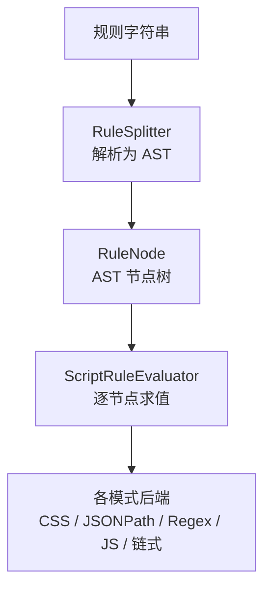
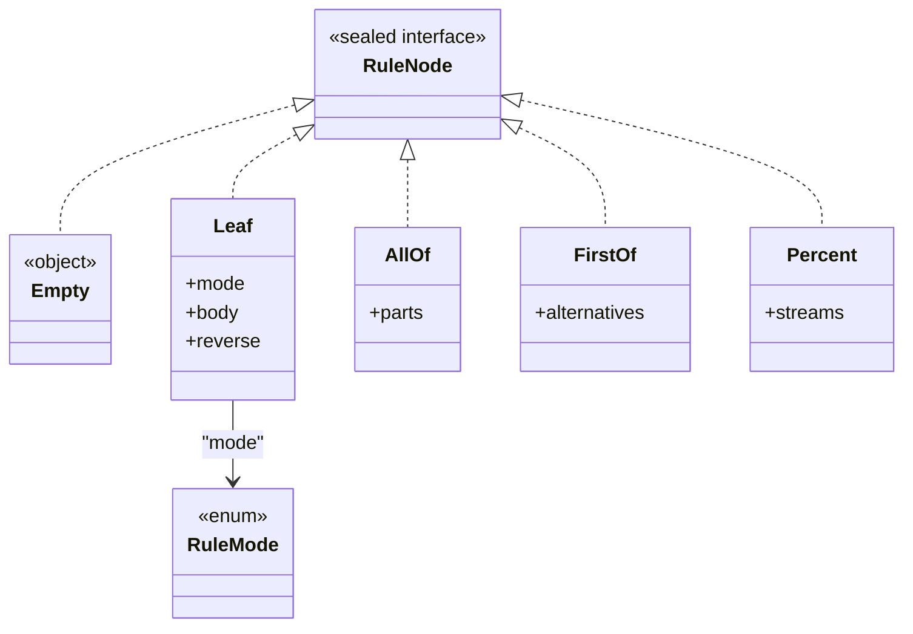
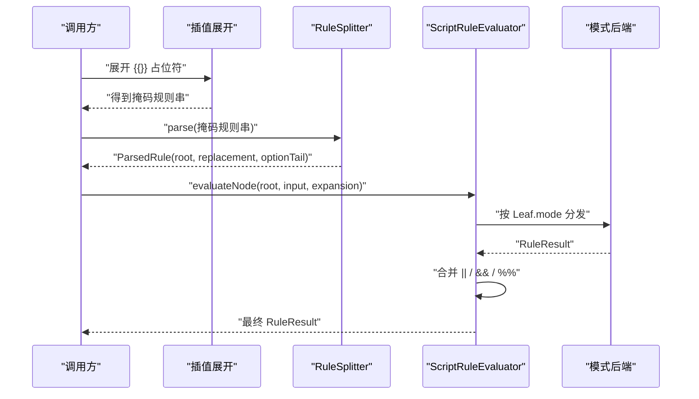
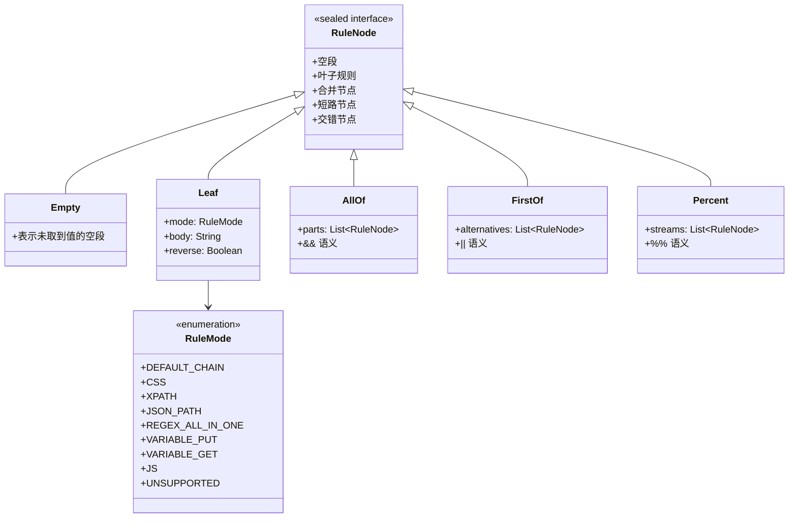
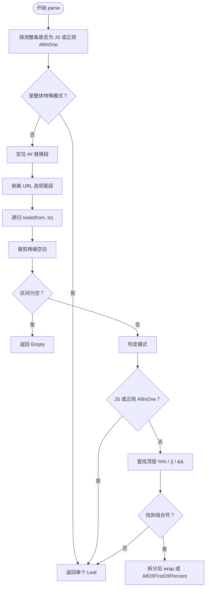
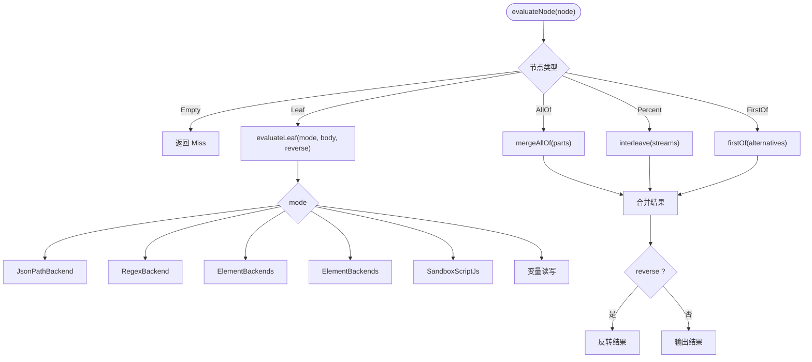
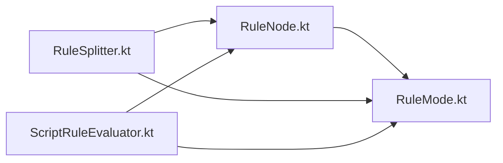

# AST 节点模型 RuleNode

<cite>
**本文引用的文件**
- [RuleNode.kt](file://lib_book_source/src/main/java/com/ebook/source/script/RuleNode.kt)
- [RuleSplitter.kt](file://lib_book_source/src/main/java/com/ebook/source/script/RuleSplitter.kt)
- [ScriptRuleEvaluator.kt](file://lib_book_source/src/main/java/com/ebook/source/script/ScriptRuleEvaluator.kt)
- [RuleMode.kt](file://lib_book_source/src/main/java/com/ebook/source/script/RuleMode.kt)
</cite>

## 目录
1. [引言](#引言)
2. [项目结构定位](#项目结构定位)
3. [核心组件：RuleNode 类型体系](#核心组件rulenode-类型体系)
4. [架构总览](#架构总览)
5. [详细组件分析](#详细组件分析)
6. [依赖关系分析](#依赖关系分析)
7. [性能与复杂度特性](#性能与复杂度特性)
8. [故障排查指南](#故障排查指南)
9. [结论](#结论)

## 引言
本文围绕书源脚本规则引擎中的抽象语法树根类型 `RuleNode`，给出面向实现者与扩展开发者的技术文档。重点包括：

- 使用 Kotlin `sealed interface` 表达五种节点类型的优势；
- 五种节点类型的语义：`Empty`、`Leaf`、`AllOf`、`FirstOf`、`Percent`；
- `Leaf` 节点的三个关键字段：`mode`、`body`、`reverse`；
- `reverse` 字段的作用域规则及其设计理由；
- 从规则字符串到 AST 的构建过程；
- AST 在求值阶段的遍历与数据处理流程。

该模型是“解析阶段”和“求值阶段”之间的桥梁：解析器负责把规则文本切分成一棵有真值语义的树，求值器则按这棵树的结构依次执行不同模式的后端逻辑。

## 项目结构定位
`RuleNode` 属于书源脚本规则子系统，位于 `lib_book_source` 模块的 `com.ebook.source.script` 包中。它由以下关键文件共同支撑：

| 文件 | 职责 |
| --- | --- |
| `RuleNode.kt` | 定义 AST 节点模型，声明所有合法节点形态 |
| `RuleMode.kt` | 定义规则模式枚举及模式判定、反序前缀剥离逻辑 |
| `RuleSplitter.kt` | 把规则字符串解析成 `RuleNode` 树，并剥出替换段与 URL 选项尾段 |
| `ScriptRuleEvaluator.kt` | 根据 `RuleNode` 树调用各模式后端完成取值、合并、交错等求值行为 |

**图表来源**
- [RuleSplitter.kt:1-117](file://lib_book_source/src/main/java/com/ebook/source/script/RuleSplitter.kt#L1-L117)
- [RuleNode.kt:1-32](file://lib_book_source/src/main/java/com/ebook/source/script/RuleNode.kt#L1-L32)
- [ScriptRuleEvaluator.kt:1-200](file://lib_book_source/src/main/java/com/ebook/source/script/ScriptRuleEvaluator.kt#L1-L200)

**章节来源**
- [RuleNode.kt:1-32](file://lib_book_source/src/main/java/com/ebook/source/script/RuleNode.kt#L1-L32)
- [RuleSplitter.kt:1-117](file://lib_book_source/src/main/java/com/ebook/source/script/RuleSplitter.kt#L1-L117)
- [ScriptRuleEvaluator.kt:1-200](file://lib_book_source/src/main/java/com/ebook/source/script/ScriptRuleEvaluator.kt#L1-L200)

## 核心组件：RuleNode 类型体系

### sealed interface 设计的优势
`RuleNode` 被定义为内部密封接口，其直接实现只有五种形态：

| 节点类型 | 含义 |
| --- | --- |
| `Empty` | 空段，表示“未取到值”这一事实 |
| `Leaf` | 带模式的规则体 |
| `AllOf` | `&&` 合并语义 |
| `FirstOf` | `||` 短路语义 |
| `Percent` | `%%` 交错语义 |

这种设计带来以下好处：

1. **编译期穷尽性检查**  
   任何对 `RuleNode` 的分支处理都必须覆盖全部子类型。新增节点类型时，编译器会提示所有 `when` 表达式缺失分支，避免“漏写分支导致静默错误”。

2. **运行时不可伪造**  
   外部代码无法凭空构造新的 `RuleNode` 实现，只能使用已定义的子类型。这使得 AST 结构稳定、可预测。

3. **意图明确**  
   五种节点分别对应规则语言中的空段、叶子规则、组合操作符，类型即文档。

4. **降低状态空间爆炸**  
   如果用一个枚举加多个布尔标志来表示节点类型，很容易出现无效组合；而 `sealed interface` 让每个子类型只携带自身必要的字段。

**章节来源**
- [RuleNode.kt:1-32](file://lib_book_source/src/main/java/com/ebook/source/script/RuleNode.kt#L1-L32)

### 五种节点类型的语义

#### Empty：空段的未取到值语义
`Empty` 不是“没有节点”，而是“这一段为空”的显式载体。它的存在保证组合语义不被误折叠：

- `a||` 不能等价于 `a`，因为末尾的空段仍参与 `||` 的短路判断；
- 若把 `Empty` 折叠掉，某些规则的短路行为会改变；
- 在求值层，`Empty` 统一映射为“未取到值”的结果。

#### Leaf：承载带模式的规则体
`Leaf` 是真正执行取数逻辑的最小单元，包含三个关键字段：

| 字段 | 类型或含义 | 作用 |
| --- | --- | --- |
| `mode` | `RuleMode` | 决定这条规则走 CSS、JSONPath、正则、JS、变量写入/读取、默认链式等哪种后端 |
| `body` | `String` | 剥离模式标志后的规则载荷 |
| `reverse` | `Boolean` | 列表反序标志，表示对当前规则段的最终结果进行倒序 |

`mode` 来自 `RuleMode.of`，它会识别前缀标志（如 `@css:`、`@json:`、`@@`、`//`、`$.`、`:...`、`<js>` 等），并返回模式、净载荷以及是否带有 `-` 反序前缀。

#### AllOf：`&&` 合并语义
`AllOf` 的 `parts` 是一个子节点列表。求值时：

- 对所有分支求值；
- 跳过结果为“未取到值”的空分支；
- 将非空结果合并；
- 若全部为空，则整条为“未取到值”。

典型用法是把多个字段拼接成一个值，例如先取标题再附加说明。

#### FirstOf：`||` 短路语义
`FirstOf` 的 `alternatives` 是备选分支列表。求值时：

- 从左到右尝试分支；
- 第一个成功取值的分支立即返回；
- 若某分支发生语法错误，按“未取到值”处理并继续下一支；
- 所有分支都失败时，抛出最后一个捕获到的语法错误；
- 若无语法错误但全空，返回“未取到值”。

这保证了“兜底规则”可以安全写在后面，同时不会掩盖真正的语法错误。

#### Percent：`%%` 交错语义
`Percent` 的 `streams` 是多路规则流。求值时：

- 对各路分别求值；
- 过滤掉“未取到值”的路；
- 按轮次交错取数：先取第 1 路第 1 个、第 2 路第 1 个……再取第 1 路第 2 个；
- 短路径走完就不再补位。

这种语义适合多列数据交错归并的场景。

**章节来源**
- [RuleNode.kt:1-32](file://lib_book_source/src/main/java/com/ebook/source/script/RuleNode.kt#L1-L32)
- [ScriptRuleEvaluator.kt:100-200](file://lib_book_source/src/main/java/com/ebook/source/script/ScriptRuleEvaluator.kt#L100-L200)

### Leaf 字段的详细语义

#### mode：规则模式
`mode` 由 `RuleMode` 枚举描述，至少包括：

| 模式 | 说明 |
| --- | --- |
| `DEFAULT_CHAIN` | 默认链式选择器 |
| `CSS` | CSS 选择器 |
| `XPATH` | XPath（当前标记为不支持） |
| `JSON_PATH` | JSONPath |
| `REGEX_ALL_IN_ONE` | 单条正则全量匹配 |
| `VARIABLE_PUT` | 写入变量 |
| `VARIABLE_GET` | 读取变量 |
| `JS` | JavaScript |
| `UNSUPPORTED` | 显式不支持的规则标志 |

模式判定发生在链式切分之前，因为标志本身是语义的一部分；否则 `@css:` 可能被当成链式分隔符切成空段。

#### body：规则载荷
`body` 是去掉模式标志后的内容。例如：

- `@css:.title` 的载荷是 `.title`；
- `@json:$..name` 的载荷是 `$..name`；
- `:([0-9]+)` 的载荷是 `([0-9]+)`；
- `<js>...` 的载荷是整个 JS 片段；
- `@@tag.a@href` 的载荷是 `tag.a@href`。

#### reverse：列表反序标志
`reverse` 对应规格中的列表反序前缀 `-`。它的关键性质是：

1. **它是每条规则段自己的标志**  
   在 `RuleSplitter` 解析时，每个候选规则段都会单独执行模式判定，因此 `-` 只对当前段生效。

2. **不作用于整个组合表达式**  
   例如 `-@@tag.a@text||tag.b@text` 中，只有第一支带有反序；第二支正常顺序输出。

3. **反序发生在该规则段的最终结果上**  
   对于 JSONPath、正则、CSS、链式、JS 等后端，最终产出都会经过统一的反转逻辑。

4. **与组合符的作用域分离**  
   `reverse` 归属 `Leaf`，`AllOf`、`FirstOf`、`Percent` 本身不携带全局反序标志；组合语义由各自节点类型表达。

**章节来源**
- [RuleMode.kt:1-118](file://lib_book_source/src/main/java/com/ebook/source/script/RuleMode.kt#L1-L118)
- [RuleSplitter.kt:1-117](file://lib_book_source/src/main/java/com/ebook/source/script/RuleSplitter.kt#L1-L117)
- [ScriptRuleEvaluator.kt:201-367](file://lib_book_source/src/main/java/com/ebook/source/script/ScriptRuleEvaluator.kt#L201-L367)

## 架构总览

**图表来源**
- [RuleNode.kt:1-32](file://lib_book_source/src/main/java/com/ebook/source/script/RuleNode.kt#L1-L32)
- [RuleMode.kt:1-118](file://lib_book_source/src/main/java/com/ebook/source/script/RuleMode.kt#L1-L118)

### 解析与求值时序

**图表来源**
- [ScriptRuleEvaluator.kt:1-100](file://lib_book_source/src/main/java/com/ebook/source/script/ScriptRuleEvaluator.kt#L1-L100)
- [RuleSplitter.kt:1-117](file://lib_book_source/src/main/java/com/ebook/source/script/RuleSplitter.kt#L1-L117)

## 详细组件分析

### AST 节点类图

**图表来源**
- [RuleNode.kt:1-32](file://lib_book_source/src/main/java/com/ebook/source/script/RuleNode.kt#L1-L32)
- [RuleMode.kt:1-118](file://lib_book_source/src/main/java/com/ebook/source/script/RuleMode.kt#L1-L118)

### 解析流程：规则字符串到 AST

解析的核心由 `RuleSplitter.parse` 驱动，主要步骤如下：

1. 探测整条规则是否为 JS 或正则 AllInOne；若是，直接作为叶子节点返回，不再进入组合切分。
2. 扫描顶层 `##`，确定替换段边界。
3. 在替换段之前的取值部分剥离 URL 选项尾段。
4. 对取值部分递归构建 AST。
5. 递归时先判定模式：如果是 JS 或正则 AllInOne，直接返回叶子。
6. 否则按优先级查找顶层组合符：`%%`、`||`、`&&`。
7. 按分割点构造子节点列表，并用对应节点类型包裹。
8. 如果没有任何组合符，则作为普通叶子返回。

**图表来源**
- [RuleSplitter.kt:1-117](file://lib_book_source/src/main/java/com/ebook/source/script/RuleSplitter.kt#L1-L117)

**章节来源**
- [RuleSplitter.kt:1-117](file://lib_book_source/src/main/java/com/ebook/source/script/RuleSplitter.kt#L1-L117)

### 求值流程：AST 到结果

`ScriptRuleEvaluator.evaluateNode` 是 AST 求值的核心分发点：

| 节点类型 | 处理方式 |
| --- | --- |
| `Empty` | 返回“未取到值” |
| `Leaf` | 按 `mode` 调用对应后端 |
| `AllOf` | 并行求值后合并 |
| `Percent` | 并行求值后交错 |
| `FirstOf` | 顺序求值并短路 |

其中：

- `FirstOf` 捕获语法异常，将其视为“未取到值”，最后保留最后一个错误；
- `AllOf` 会按结果类型合并节点、匹配项、JSON 节点或文本；
- `Percent` 按轮次交错多路列表；
- `Leaf` 会根据模式调用 JSONPath、正则、CSS、链式、JS、变量读写等后端；
- 所有叶子结果最终可能经过 `reversedResult`，取决于 `reverse`。

**图表来源**
- [ScriptRuleEvaluator.kt:1-200](file://lib_book_source/src/main/java/com/ebook/source/script/ScriptRuleEvaluator.kt#L1-L200)
- [ScriptRuleEvaluator.kt:201-367](file://lib_book_source/src/main/java/com/ebook/source/script/ScriptRuleEvaluator.kt#L201-L367)

**章节来源**
- [ScriptRuleEvaluator.kt:1-200](file://lib_book_source/src/main/java/com/ebook/source/script/ScriptRuleEvaluator.kt#L1-L200)
- [ScriptRuleEvaluator.kt:201-367](file://lib_book_source/src/main/java/com/ebook/source/script/ScriptRuleEvaluator.kt#L201-L367)

### AST 树构建示例

以下用结构化方式展示不同规则语法对应的节点结构。为避免直接粘贴源码，这里以“节点类型 + 关键字段”的方式描述。

#### 示例一：空规则
规则字符串为空或仅空白时，解析器应返回 `Empty`。

- 节点：`Empty`
- 语义：空段，表示未取到值

#### 示例二：简单 CSS 规则
规则形如 `@css:.title@text`。

- 节点：`Leaf`
- `mode`：`CSS`
- `body`：`.title@text`
- `reverse`：`false`

#### 示例三：带反序的 JSONPath 规则
规则形如 `-@json:$..name`。

- 节点：`Leaf`
- `mode`：`JSON_PATH`
- `body`：`$..name`
- `reverse`：`true`

#### 示例四：`||` 短路
规则形如 `@css:.a@text||@css:.b@text`。

- 节点：`FirstOf`
- `alternatives`：
  - `Leaf(CSS, ".a@text", false)`
  - `Leaf(CSS, ".b@text", false)`

#### 示例五：`&&` 合并
规则形如 `@css:.title@text&&@css:.author@text`。

- 节点：`AllOf`
- `parts`：
  - `Leaf(CSS, ".title@text", false)`
  - `Leaf(CSS, ".author@text", false)`

#### 示例六：`%%` 交错
规则形如 `@css:.col1@text%%@css:.col2@text`。

- 节点：`Percent`
- `streams`：
  - `Leaf(CSS, ".col1@text", false)`
  - `Leaf(CSS, ".col2@text", false)`

#### 示例七：反序只作用于第一支
规则形如 `-@@tag.a@text||tag.b@text`。

- 节点：`FirstOf`
- `alternatives`：
  - `Leaf(DEFAULT_CHAIN, "tag.a@text", true)`
  - `Leaf(DEFAULT_CHAIN, "tag.b@text", false)`

注意：`reverse=true` 只在第一支的 `Leaf` 上，不在外层 `FirstOf` 上。

#### 示例八：混合组合
规则形如 `a&&b%%c||d`。

- 解析优先级为 `%%` → `||` → `&&`；
- 最终结构由 `RuleSplitter.COMBINATORS` 的优先级决定；
- 具体树形应结合测试用例验证，但原则是：优先级高的组合符先绑定更紧的子表达式。

**章节来源**
- [RuleSplitter.kt:60-117](file://lib_book_source/src/main/java/com/ebook/source/script/RuleSplitter.kt#L60-L117)
- [RuleMode.kt:1-118](file://lib_book_source/src/main/java/com/ebook/source/script/RuleMode.kt#L1-L118)

### reverse 字段的作用域规则

`reverse` 是 `Leaf` 的属性，而不是 `AllOf`、`FirstOf`、`Percent` 的属性。这意味着：

1. 组合符左右两侧的规则段各自决定是否反序；
2. 外层组合语义和内层反序语义互不干扰；
3. 解析器在每次判定一个完整规则段时剥出 `reverse`，而不是在组合符层级维护全局标志；
4. 求值器在叶子结果产出后应用反序，这样 JSONPath、正则、CSS、链式、JS 等后端都能复用同一反转逻辑。

这个设计的关键约束是：**不得把 `reverse` 推广为整个组合表达式的属性**。例如 `-a||b` 不应解释为“整条表达式结果反序”，而应按规范实现为“第一支反序，第二支正常”。

**章节来源**
- [RuleNode.kt:8-32](file://lib_book_source/src/main/java/com/ebook/source/script/RuleNode.kt#L8-L32)
- [RuleMode.kt:1-40](file://lib_book_source/src/main/java/com/ebook/source/script/RuleMode.kt#L1-L40)
- [RuleSplitter.kt:15-35](file://lib_book_source/src/main/java/com/ebook/source/script/RuleSplitter.kt#L15-L35)

## 依赖关系分析

**图表来源**
- [RuleNode.kt:1-32](file://lib_book_source/src/main/java/com/ebook/source/script/RuleNode.kt#L1-L32)
- [RuleMode.kt:1-118](file://lib_book_source/src/main/java/com/ebook/source/script/RuleMode.kt#L1-L118)
- [RuleSplitter.kt:1-117](file://lib_book_source/src/main/java/com/ebook/source/script/RuleSplitter.kt#L1-L117)
- [ScriptRuleEvaluator.kt:1-367](file://lib_book_source/src/main/java/com/ebook/source/script/ScriptRuleEvaluator.kt#L1-L367)

### 耦合与内聚

- `RuleNode` 是高内聚的类型定义，不依赖解析器或求值器；
- `RuleMode` 是模式识别基础设施，被解析器和求值器共同依赖；
- `RuleSplitter` 依赖 `RuleNode` 和 `RuleMode`，负责把字符串变成 AST；
- `ScriptRuleEvaluator` 依赖 `RuleNode` 和 `RuleMode`，负责把 AST 变成业务结果；
- 三者之间形成“定义 → 构建 → 消费”的单向依赖，有利于维护和替换实现。

### 潜在风险

- 新增节点类型必须同步更新 `RuleSplitter` 的解析分支和 `ScriptRuleEvaluator` 的求值分支；
- 修改 `RuleMode` 的标志识别逻辑会影响解析和求值两端的语义；
- `reverse` 的传播路径集中在 `Leaf` 和求值器反转逻辑，不应引入跨节点的全局反序状态。

**章节来源**
- [RuleNode.kt:1-32](file://lib_book_source/src/main/java/com/ebook/source/script/RuleNode.kt#L1-L32)
- [RuleMode.kt:1-118](file://lib_book_source/src/main/java/com/ebook/source/script/RuleMode.kt#L1-L118)
- [RuleSplitter.kt:1-117](file://lib_book_source/src/main/java/com/ebook/source/script/RuleSplitter.kt#L1-L117)
- [ScriptRuleEvaluator.kt:1-367](file://lib_book_source/src/main/java/com/ebook/source/script/ScriptRuleEvaluator.kt#L1-L367)

## 性能与复杂度特性

### 解析阶段

- 规则串预处理：探测 JS/正则 AllInOne、扫描顶层分隔符；
- 递归构建 AST：每个顶层组合符进行一次扫描；
- 括号深度表预计算，避免重复计算；
- 时间复杂度近似与规则串长度和组合符数量相关；
- 空间复杂度与 AST 节点数和递归深度相关。

### 求值阶段

- `FirstOf`：最坏情况评估所有分支，但命中后立即短路；
- `AllOf`：评估所有分支，然后合并结果；
- `Percent`：评估所有分支，并按轮次交错；
- 叶子节点按模式调用后端，后端复杂度取决于 HTML/JSON/正则/JS 的具体实现；
- `reversedResult` 会对结果列表做一次线性反转。

### 优化建议

1. 对大型 HTML 或 JSON 输入，优先选择精确的选择器或 JSONPath，减少中间结果集大小；
2. 合理组织 `||` 顺序，把高命中、低开销分支放在前面；
3. 谨慎使用 `%%`，因为它需要对多路结果做交错；
4. 避免在 `&&` 中产生大量中间节点，必要时在链式后端收敛为文本；
5. 不要滥用 JS 后端，除非确实需要复杂计算。

[本节为通用性能讨论，不直接分析特定代码行]

## 故障排查指南

### 症状一：`||` 兜底规则没生效
可能原因：

- 前面的分支抛出了未被 `firstOf` 捕获的运行时异常；
- 前端规则实际是 JS 运行失败，而非解析语法错误；
- 反序或组合语义理解偏差，误以为外层节点控制反序。

排查要点：

- 确认失败的是 `RuleSyntaxException` 还是 JS 执行异常；
- 检查 `FirstOf` 分支顺序；
- 确认 `Empty` 是否正确表示“未取到值”。

**章节来源**
- [ScriptRuleEvaluator.kt:100-160](file://lib_book_source/src/main/java/com/ebook/source/script/ScriptRuleEvaluator.kt#L100-L160)

### 症状二：`&&` 拼接结果不符合预期
可能原因：

- 多路结果都是 Texts，求值层只做扁平合并，不直接拼接成单串；
- 期望由字段级 `firstText` 收敛，而不是由 `AllOf` 拼接；
- 混入节点、匹配项、JSON 节点时，合并策略不同。

排查要点：

- 确认各支结果的类型；
- 确认下游是否需要 `firstText`；
- 检查是否误把节点集合当作可继续解析的上下文。

**章节来源**
- [ScriptRuleEvaluator.kt:130-180](file://lib_book_source/src/main/java/com/ebook/source/script/ScriptRuleEvaluator.kt#L130-L180)

### 症状三：反序没有生效
可能原因：

- 反序标志没有加在目标规则段前；
- 误以为组合符外层也有反序；
- 后端产物类型不支持反转或反转逻辑未触发。

排查要点：

- 检查 `Leaf.reverse`；
- 检查是否是 `-` 前缀被误判为未知标志；
- 检查 JS 后位规则和 JS 叶子规则的反转分支。

**章节来源**
- [RuleMode.kt:10-40](file://lib_book_source/src/main/java/com/ebook/source/script/RuleMode.kt#L10-L40)
- [ScriptRuleEvaluator.kt:201-367](file://lib_book_source/src/main/java/com/ebook/source/script/ScriptRuleEvaluator.kt#L201-L367)

### 症状四：`%%` 交错顺序不对
可能原因：

- 某路结果为空，被过滤掉；
- 各路结果长度不同，短路径提前结束；
- 输入顺序与期望不一致。

排查要点：

- 分别检查每路规则的结果；
- 确认短路径不补位；
- 确认交错是按轮次而非按索引对齐。

**章节来源**
- [ScriptRuleEvaluator.kt:160-200](file://lib_book_source/src/main/java/com/ebook/source/script/ScriptRuleEvaluator.kt#L160-L200)

## 结论

`RuleNode` 通过 `sealed interface` 明确刻画了书源脚本规则的五种 AST 形态，使“空段、叶子规则、合并、短路、交错”这些语义在类型层面就得到约束。配合 `RuleMode` 的模式判定、`RuleSplitter` 的解析优先级和 `ScriptRuleEvaluator` 的分派发牌，整个规则引擎形成了清晰的数据流：

1. 规则字符串经插值展开；
2. 解析器构建 `RuleNode` 树；
3. 求值器按节点类型分发到各模式后端；
4. 组合节点负责结果合并、短路或交错；
5. 叶子节点负责具体取值；
6. `reverse` 在叶子结果层面应用，保持作用域清晰。

这种设计既保证了类型安全和编译期检查，又为未来扩展新节点类型提供了明确的扩展点。新增节点时必须同时考虑解析、求值、反序、合并和交错等影响面，确保 AST 语义与实现一致。

[本节为总结性内容，不直接分析特定代码行]