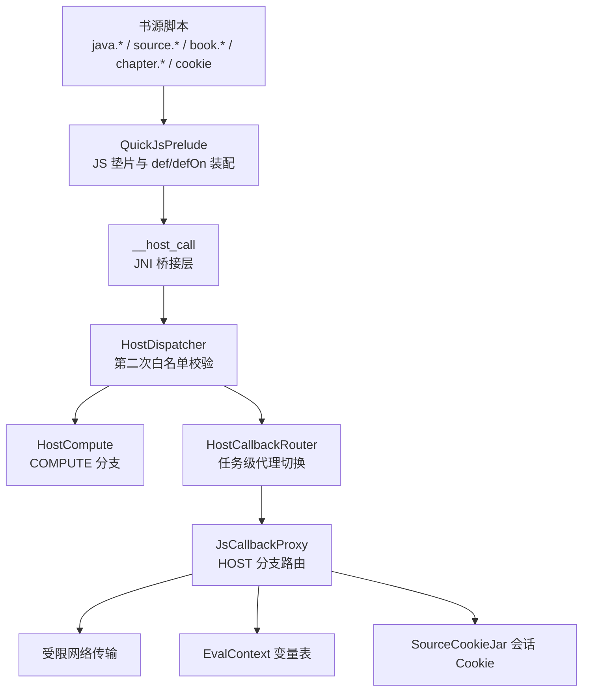
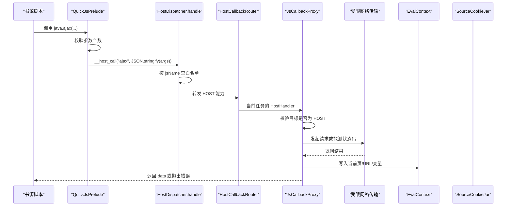
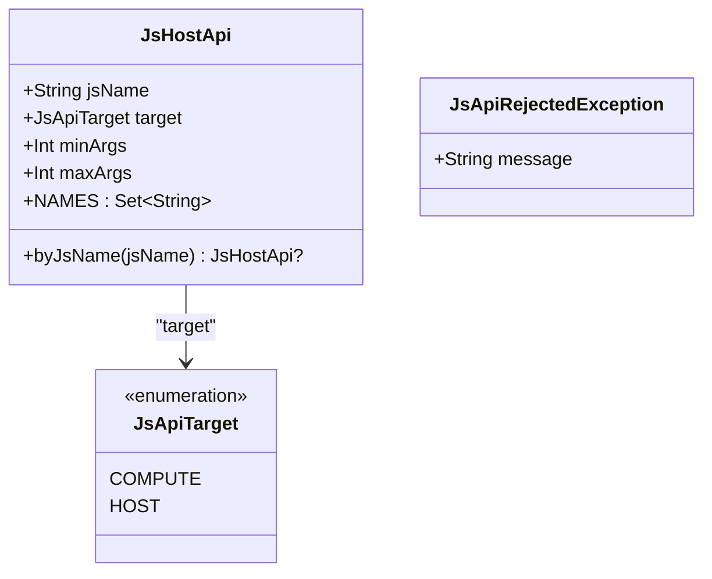
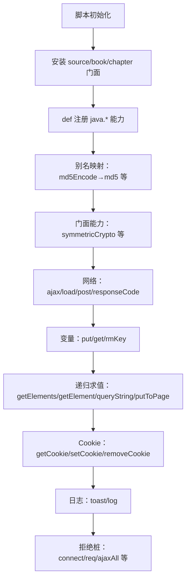
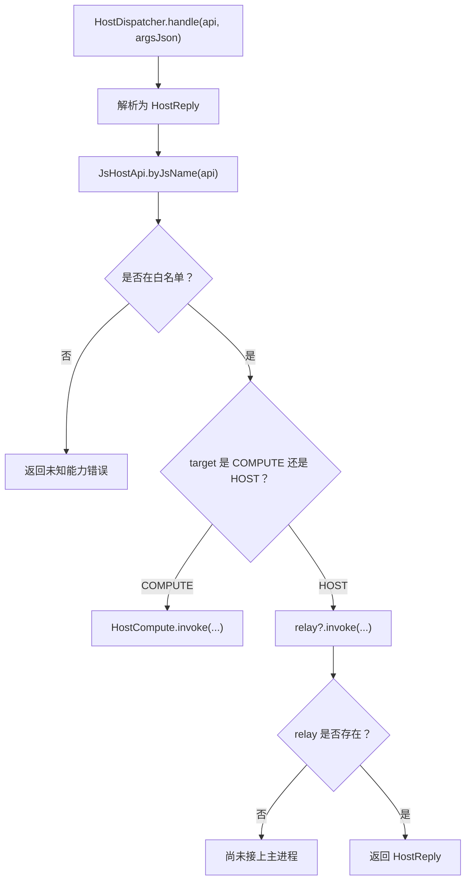
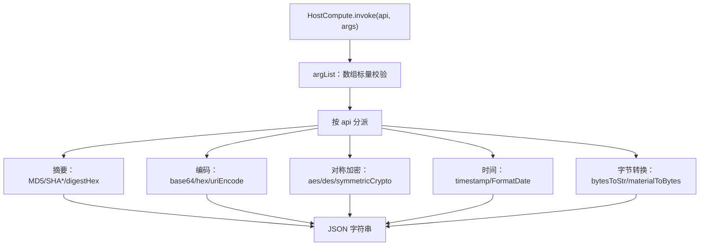
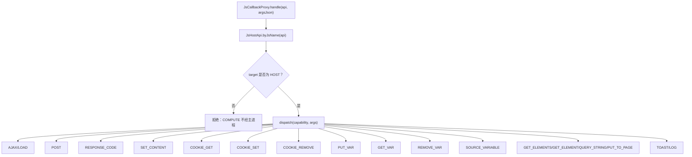
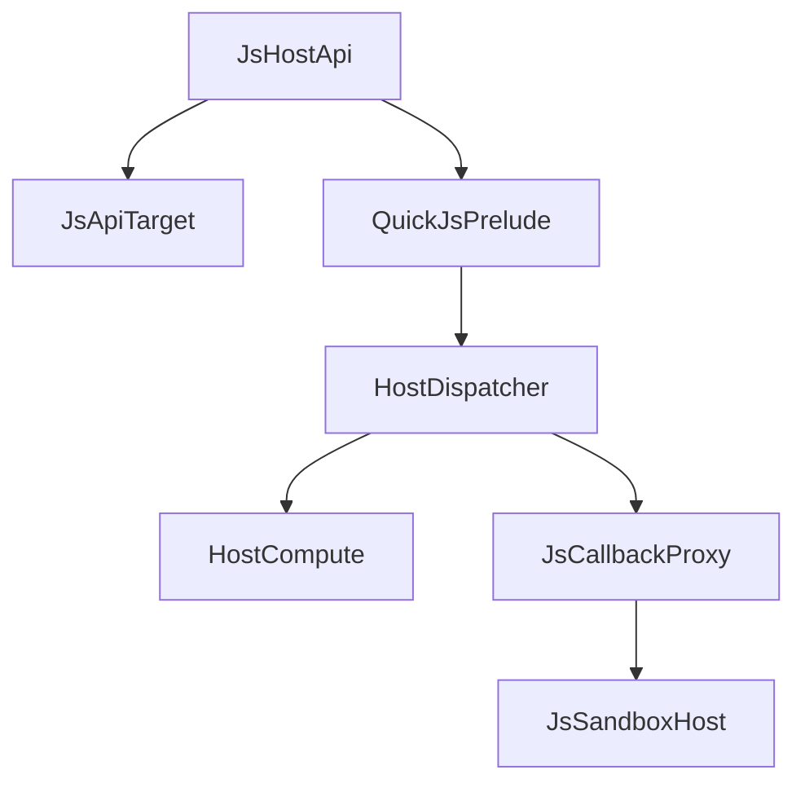

# 宿主 API 白名单 JsHostApi

<cite>
**本文引用的文件**   
- [JsHostApi.kt](file://lib_book_source/src/main/java/com/ebook/source/script/JsHostApi.kt)
- [QuickJsPrelude.kt](file://lib_book_source/src/main/java/com/ebook/source/sandbox/QuickJsPrelude.kt)
- [HostDispatcher.kt](file://lib_book_source/src/main/java/com/ebook/source/sandbox/HostDispatcher.kt)
- [JsCallbackProxy.kt](file://lib_book_source/src/main/java/com/ebook/source/sandbox/JsCallbackProxy.kt)
- [HostCompute.kt](file://lib_book_source/src/main/java/com/ebook/source/sandbox/HostCompute.kt)
- [JsSandboxHost.kt](file://lib_book_source/src/main/java/com/ebook/source/sandbox/JsSandboxHost.kt)
- [JsHostApiTest.kt](file://lib_book_source/src/test/java/com/ebook/source/sandbox/JsHostApiTest.kt)
</cite>

## 目录
1. [引言](#引言)
2. [项目结构与边界](#项目结构与边界)
3. [核心组件](#核心组件)
4. [架构总览](#架构总览)
5. [详细组件分析](#详细组件分析)
6. [能力分类与 API 规范](#能力分类与-api-规范)
7. [依赖关系分析](#依赖关系分析)
8. [性能与安全特性](#性能与安全特性)
9. [错误处理与排障指南](#错误处理与排障指南)
10. [结论](#结论)

## 引言
本文件面向“书源脚本”作者和平台维护者，系统性说明宿主 API 白名单 `JsHostApi` 的设计、实现和使用约束。其核心安全原则是 **deny-by-default（默认拒绝）**：不在 QuickJS 全局对象上暴露未授权方法；只有出现在白名单中的能力才会通过 JS 垫片可见，其余名字要么不存在，要么被显式拒绝桩抛出可诊断错误。

此外，`JsApiTarget` 把能力划分为两类：
- `COMPUTE`：纯计算能力，在沙箱执行器进程内直接完成，零跨进程往返。
- `HOST`：需要主进程参与的能力，例如网络访问、变量管理、递归求值、Cookie 会话和日志。

## 项目结构与边界
JsHostApi 并非孤立枚举，而是贯穿“脚本 → 垫片 → JNI → 分发 → 主进程回调”的完整链路：

**图示来源**
- [QuickJsPrelude.kt:1-110](file://lib_book_source/src/main/java/com/ebook/source/sandbox/QuickJsPrelude.kt#L1-L110)
- [HostDispatcher.kt:1-74](file://lib_book_source/src/main/java/com/ebook/source/sandbox/HostDispatcher.kt#L1-L74)
- [HostCompute.kt:1-120](file://lib_book_source/src/main/java/com/ebook/source/sandbox/HostCompute.kt#L1-L120)
- [JsCallbackProxy.kt:1-120](file://lib_book_source/src/main/java/com/ebook/source/sandbox/JsCallbackProxy.kt#L1-L120)
- [JsSandboxHost.kt:1-60](file://lib_book_source/src/main/java/com/ebook/source/sandbox/JsSandboxHost.kt#L1-L60)

**章节来源**
- [QuickJsPrelude.kt:1-110](file://lib_book_source/src/main/java/com/ebook/source/sandbox/QuickJsPrelude.kt#L1-L110)
- [HostDispatcher.kt:1-74](file://lib_book_source/src/main/java/com/ebook/source/sandbox/HostDispatcher.kt#L1-L74)
- [JsHostApi.kt:1-114](file://lib_book_source/src/main/java/com/ebook/source/script/JsHostApi.kt#L1-L114)

## 核心组件
- **JsHostApi**：白名单能力定义表，集中声明每个能力的脚本侧名称、目标类型、最小参数个数与最大参数个数。
- **JsApiTarget**：能力目标枚举，区分“执行器进程内计算”和“需要主进程协助”。
- **QuickJsPrelude**：QuickJS 沙箱内的唯一可信 JS 垫片，负责把白名单能力挂到 `java.*`、`source.*`、`book.*`、`chapter.*`、`cookie` 等对象上，并做元数校验。
- **HostDispatcher**：`:js` 进程 JNI 入口，做第二次白名单校验并把 COMPUTE 与 HOST 分流。
- **HostCompute**：COMPUTE 分支实现，封装摘要、编码、对称加密、时间、HMAC、材料标记等纯计算逻辑。
- **JsCallbackProxy**：主进程 HOST 分支处理器，处理网络、变量、页面上下文、递归求值和 Cookie。
- **JsSandboxHost**：主进程装配面，负责连接客户端、传输层、限制策略、Cookie Jar 和嵌套调用生命周期。

**章节来源**
- [JsHostApi.kt:1-114](file://lib_book_source/src/main/java/com/ebook/source/script/JsHostApi.kt#L1-L114)
- [QuickJsPrelude.kt:1-110](file://lib_book_source/src/main/java/com/ebook/source/sandbox/QuickJsPrelude.kt#L1-L110)
- [HostDispatcher.kt:1-74](file://lib_book_source/src/main/java/com/ebook/source/sandbox/HostDispatcher.kt#L1-L74)
- [HostCompute.kt:1-120](file://lib_book_source/src/main/java/com/ebook/source/sandbox/HostCompute.kt#L1-L120)
- [JsCallbackProxy.kt:1-120](file://lib_book_source/src/main/java/com/ebook/source/sandbox/JsCallbackProxy.kt#L1-L120)
- [JsSandboxHost.kt:1-60](file://lib_book_source/src/main/java/com/ebook/source/sandbox/JsSandboxHost.kt#L1-L60)

## 架构总览
下图展示一次典型的 HOST 类能力调用流程：

**图示来源**
- [QuickJsPrelude.kt:58-110](file://lib_book_source/src/main/java/com/ebook/source/sandbox/QuickJsPrelude.kt#L58-L110)
- [HostDispatcher.kt:30-74](file://lib_book_source/src/main/java/com/ebook/source/sandbox/HostDispatcher.kt#L30-L74)
- [JsCallbackProxy.kt:150-235](file://lib_book_source/src/main/java/com/ebook/source/sandbox/JsCallbackProxy.kt#L150-L235)

## 详细组件分析

### JsHostApi 与 deny-by-default 设计
`JsHostApi` 是能力清单的唯一权威来源。它同时承担三类职责：
1. **能力登记**：每条枚举项对应一个脚本可用的能力。
2. **协议契约**：`jsName` 是过边界字符串，不是 Kotlin 常量名。
3. **元数约束**：`minArgs` 与 `maxArgs` 决定参数范围，`maxArgs == 0` 表示不限上限。

deny-by-default 的关键含义是：**不在 QuickJS 全局对象上暴露未授权方法**。如果某个能力没有登记在 `JsHostApi`，脚本调用的结果不是“存在但被禁用”，而是“根本找不到该属性”，最终触发 ReferenceError 或 JS 垫片的明确拒绝消息。

**图示来源**
- [JsHostApi.kt:1-114](file://lib_book_source/src/main/java/com/ebook/source/script/JsHostApi.kt#L1-L114)

**章节来源**
- [JsHostApi.kt:1-114](file://lib_book_source/src/main/java/com/ebook/source/script/JsHostApi.kt#L1-L114)

### QuickJsPrelude：脚本可见面的唯一装配点
QuickJsPrelude 是沙箱内唯一被信任的 JS 片段。它负责：
- 挂载 `java.*`、`source.*`、`book.*`、`chapter.*`、`cookie` 等方法。
- 对每个 `def(...)` 和 `defOn(...)` 做参数个数校验。
- 提供字节材料标记，避免二进制数据在 JSON 帧中丢失语义。
- 将上游别名映射到本仓统一能力名。
- 为不支持的能力提供拒绝桩，而不是让脚本拿到 undefined。

**图示来源**
- [QuickJsPrelude.kt:58-256](file://lib_book_source/src/main/java/com/ebook/source/sandbox/QuickJsPrelude.kt#L58-L256)

**章节来源**
- [QuickJsPrelude.kt:1-256](file://lib_book_source/src/main/java/com/ebook/source/sandbox/QuickJsPrelude.kt#L1-L256)

### HostDispatcher：JNI 边界上的第二道白名单
`HostDispatcher.handle` 是被 C++ 侧以固定签名调用的入口。它必须：
- 不抛异常，因为异常从 JNI 冒出去可能带走整个 `:js` 进程。
- 再次按 `jsName` 查 `JsHostApi`，防止绕过 JS 垫片直接调用底层。
- 把 COMPUTE 能力交给 `HostCompute`，HOST 能力交给已安装的 relay。

**图示来源**
- [HostDispatcher.kt:1-74](file://lib_book_source/src/main/java/com/ebook/source/sandbox/HostDispatcher.kt#L1-L74)

**章节来源**
- [HostDispatcher.kt:1-74](file://lib_book_source/src/main/java/com/ebook/source/sandbox/HostDispatcher.kt#L1-L74)

### HostCompute：COMPUTE 分支实现
`HostCompute` 是所有 COMPILE 类能力的实现体，强调三个设计决定：
1. 输入一律使用 UTF-8 字节。
2. 失败一律抛出类型化拒绝异常，不回 null。
3. 字节进出边界使用 `<编码>:<文本>` 标记，只允许 base64/hex/utf8/latin1。

常见能力包括 MD5、SHA1、SHA256、BASE64、HEX、AES、DES、URI 编码、随机 UUID、摘要算法选择、HMAC、通用对称加解密、时间戳和日期格式化。

**图示来源**
- [HostCompute.kt:1-120](file://lib_book_source/src/main/java/com/ebook/source/sandbox/HostCompute.kt#L1-L120)
- [HostCompute.kt:200-345](file://lib_book_source/src/main/java/com/ebook/source/sandbox/HostCompute.kt#L200-L345)

**章节来源**
- [HostCompute.kt:1-345](file://lib_book_source/src/main/java/com/ebook/source/sandbox/HostCompute.kt#L1-L345)

### JsCallbackProxy：HOST 分支路由器
`JsCallbackProxy` 是主进程受理 HOST 能力的核心。它持有：
- 网络守卫与受限传输。
- 任务级 EvalContext。
- 嵌套求值闭包。
- 源级 SourceCookieJar。
- 请求计数与回调深度限制。

它的路由包括 ajax/load/post/responseCode、变量读写、源级变量、递归求值、setContent、Cookie、toast 和 log。

**图示来源**
- [JsCallbackProxy.kt:150-235](file://lib_book_source/src/main/java/com/ebook/source/sandbox/JsCallbackProxy.kt#L150-L235)

**章节来源**
- [JsCallbackProxy.kt:1-200](file://lib_book_source/src/main/java/com/ebook/source/sandbox/JsCallbackProxy.kt#L1-L200)

### JsSandboxHost：主进程装配面
`JsSandboxHost` 负责组合：
- 沙箱客户端。
- 基础 OkHttp 客户端。
- 任务限制策略。
- HostCallbackRouter。
- 每次解析任务的 bridgeFor 装配。

它保证：
- 客户端 hostHandler 构造期绑定。
- 任务级代理通过 router 切换。
- 传输层必须经过 GuardedNetwork。
- Cookie Jar 与网络客户端保持一致实例。

**章节来源**
- [JsSandboxHost.kt:1-60](file://lib_book_source/src/main/java/com/ebook/source/sandbox/JsSandboxHost.kt#L1-L60)

## 能力分类与 API 规范

### 设计约定
- 所有参数在 JS 垫片侧尽量先转为字符串，再经 JSON 帧传回主进程。
- 返回值是 `reply.data`；`ok=false` 时抛错。
- 元数校验由 JS 垫片完成，这样“少传参数”不会退化为看似正常的失败路径。
- 白名单外的能力不应被静默忽略；测试会比对能力表与垫片登记。

**章节来源**
- [JsHostApi.kt:1-114](file://lib_book_source/src/main/java/com/ebook/source/script/JsHostApi.kt#L1-L114)
- [QuickJsPrelude.kt:58-110](file://lib_book_source/src/main/java/com/ebook/source/sandbox/QuickJsPrelude.kt#L58-L110)
- [JsHostApiTest.kt:1-200](file://lib_book_source/src/test/java/com/ebook/source/sandbox/JsHostApiTest.kt#L1-L200)

### 纯计算类 API（COMPUTE）
这些能力由 `HostCompute` 执行，不经过主进程。

| 能力 | 脚本侧名称 | 目标 | 参数 | 返回值 | 安全与行为说明 |
|---|---|---|---|---|---|
| MD5 | `md5` | COMPUTE | 1 | 小写十六进制摘要 | 输入按 UTF-8 字节处理 |
| SHA1 | `sha1` | COMPUTE | 1 | 小写十六进制摘要 | 同上 |
| SHA256 | `sha256` | COMPUTE | 1 | 小写十六进制摘要 | 同上 |
| BASE64 编码 | `base64Encode` | COMPUTE | 1 | base64 字符串 | 标准编码 |
| BASE64 解码 | `base64Decode` | COMPUTE | 1 | 解码后的文本 | 非空输入解出 0 字节视为非法 |
| URL 安全 BASE64 编码 | `base64EncodeUrl` | COMPUTE | 1 | URL 安全 base64 | 适合 URL 参数场景 |
| URL 安全 BASE64 解码 | `base64DecodeUrl` | COMPUTE | 1 | 解码后的文本 | URL 安全解码 |
| HEX 编码 | `hexEncode` | COMPUTE | 1 | 小写十六进制 | 自定义实现，兼容低 API 级别 |
| HEX 解码 | `hexDecode` | COMPUTE | 1 | 解码后的文本 | 长度必须是偶数且仅含十六进制字符 |
| AES 编码 | `aesEncode` | COMPUTE | 2 | base64 密文 | 密钥派生后补零或截断；AES 用 CBC，IV 取密钥前 16 字节 |
| AES 解码 | `aesDecode` | COMPUTE | 2 | 明文文本 | 密文按 base64 解码 |
| DES 编码 | `desEncode` | COMPUTE | 2 | base64 密文 | DES/ECB/PKCS5Padding |
| DES 解码 | `desDecode` | COMPUTE | 2 | 明文文本 | 同上 |
| URI 编码 | `uriEncode` | COMPUTE | 1 或 2 | 编码后字符串 | 缺字符集时默认 UTF-8 |
| 随机 UUID | `randomUUID` | COMPUTE | 0 | UUID 字符串 | 生成新标识 |
| 摘要算法选择 | `digestHex` | COMPUTE | 2 | 小写十六进制摘要 | 第二参是站点写的算法名，未识别即拒绝 |
| HMAC Base64 | `hmacBase64` | COMPUTE | 3 | base64 HMAC | 密钥直接使用 UTF-8 字节 |
| 通用对称加解密 | `symmetricCrypto` | COMPUTE | 5 | 文本或带 base64 标记的字节 | 操作名包括 decryptStr、decrypt、encrypt、encryptBase64、encryptHex |
| 字节转文本 | `bytesToStr` | COMPUTE | 1 或 2 | 文本 | 支持 base64/hex/utf8/latin1 材料标记 |
| 时间戳 | `timestamp` | COMPUTE | 0 | 毫秒时间戳字符串 | 系统时间 |
| 日期格式化 | `FormatDate` | COMPUTE | 2 | 格式化字符串 | 第一参毫秒，第二参格式 |

**章节来源**
- [JsHostApi.kt:12-90](file://lib_book_source/src/main/java/com/ebook/source/script/JsHostApi.kt#L12-L90)
- [HostCompute.kt:60-120](file://lib_book_source/src/main/java/com/ebook/source/sandbox/HostCompute.kt#L60-L120)
- [HostCompute.kt:200-345](file://lib_book_source/src/main/java/com/ebook/source/sandbox/HostCompute.kt#L200-L345)
- [QuickJsPrelude.kt:110-170](file://lib_book_source/src/main/java/com/ebook/source/sandbox/QuickJsPrelude.kt#L110-L170)

### 网络类 API（HOST）
网络能力全部进入主进程，并由受限传输层执行 scheme、私网、白名单、大小、限流等判定。

| 能力 | 脚本侧名称 | 目标 | 参数 | 返回值 | 安全与行为说明 |
|---|---|---|---|---|---|
| 通用请求 | `ajax` | HOST | 1 或 2 | 响应文本 | 第二参可为选项对象 |
| 加载资源 | `load` | HOST | 1 或 2 | 响应文本 | 语义与 ajax 类似，用于资源加载 |
| POST 请求 | `post` | HOST | 2 或 3 | 响应文本 | 第三参为请求头对象；表单内容类型为 application/x-www-form-urlencoded |
| 查询响应码 | `responseCode` | HOST | 1 | HTTP 状态码 | 通过 HEAD 探测，不读取响应体 |

注意：本项目未在 JsHostApi 中暴露“带请求头的 GET 并返回响应对象”的能力，因为取文层只返回文本，状态码和响应头已在更高层丢弃。

**章节来源**
- [JsHostApi.kt:78-90](file://lib_book_source/src/main/java/com/ebook/source/script/JsHostApi.kt#L78-L90)
- [QuickJsPrelude.kt:140-150](file://lib_book_source/src/main/java/com/ebook/source/sandbox/QuickJsPrelude.kt#L140-L150)
- [JsCallbackProxy.kt:183-196](file://lib_book_source/src/main/java/com/ebook/source/sandbox/JsCallbackProxy.kt#L183-L196)

### 变量管理类 API（HOST）
变量是任务级作用域，由 `EvalContext` 承载。脚本侧既可以用 `java.put`/`java.get`/`java.rmKey`，也可以用 `source`、`book`、`chapter` 的门面方法。

| 能力 | 脚本侧名称 | 目标 | 参数 | 返回值 | 安全与行为说明 |
|---|---|---|---|---|---|
| 写入变量 | `putVar` | HOST | 2 | 无返回值 | 键和值都转为字符串 |
| 读取变量 | `getVar` | HOST | 1 | 字符串或 undefined | 键不存在时返回 undefined |
| 删除变量 | `rmVar` | HOST | 1 | 无返回值 | 删除任务级变量 |

脚本侧等价写法：
- `java.put(key, value)`
- `java.get(key)`
- `java.rmKey(key)`
- `source.putVariable(key, value)`
- `book.putVariable(key, value)`
- `chapter.putVariable(key, value)`
- `source.getVariable(key)` 对应的是按键取值，与 `source.getVariable()` 整串读取不同。

**章节来源**
- [JsHostApi.kt:90-114](file://lib_book_source/src/main/java/com/ebook/source/script/JsHostApi.kt#L90-L114)
- [QuickJsPrelude.kt:150-200](file://lib_book_source/src/main/java/com/ebook/source/sandbox/QuickJsPrelude.kt#L150-L200)
- [JsCallbackProxy.kt:206-221](file://lib_book_source/src/main/java/com/ebook/source/sandbox/JsCallbackProxy.kt#L206-L221)

### 源级变量 API（HOST）
源级变量与按键变量不同：它是整串读写，主要用于源级配置或状态。

| 能力 | 脚本侧名称 | 目标 | 参数 | 返回值 | 安全与行为说明 |
|---|---|---|---|---|---|
| 读取源级变量 | `sourceGetVariable` | HOST | 0 | 整串变量 | 零参，读取整串源级变量 |
| 写入源级变量 | `sourceSetVariable` | HOST | 1 | 无返回值 | 覆盖整串源级变量 |

脚本侧等价写法：
- `source.getVariable()`
- `source.setVariable(value)`
- `source.putVariable(value)`

**章节来源**
- [JsHostApi.kt:100-110](file://lib_book_source/src/main/java/com/ebook/source/script/JsHostApi.kt#L100-L110)
- [QuickJsPrelude.kt:220-256](file://lib_book_source/src/main/java/com/ebook/source/sandbox/QuickJsPrelude.kt#L220-L256)
- [JsCallbackProxy.kt:215-221](file://lib_book_source/src/main/java/com/ebook/source/sandbox/JsCallbackProxy.kt#L215-L221)

### 递归求值 API（HOST）
这些能力把规则串交回解释器，在当前页面上下文中重新求值。

| 能力 | 脚本侧名称 | 目标 | 参数 | 返回值 | 安全与行为说明 |
|---|---|---|---|---|---|
| 获取元素列表 | `getElements` | HOST | 1 | 元素列表或单个元素 | 根据规则返回嵌套结构 |
| 获取单个元素 | `getElement` | HOST | 1 | 元素或单个值 | 单值模式 |
| 提取文本 | `queryString` | HOST | 1 | 文本 | 文本访问器 |
| 写入页面变量 | `putToPage` | HOST | 2 | 无返回值 | 向当前页面上下文写入键值 |

这些能力会复用当前页面的基准页和地址；`setContent` 可改写后续规则求值的基准页。

**章节来源**
- [JsHostApi.kt:100-114](file://lib_book_source/src/main/java/com/ebook/source/script/JsHostApi.kt#L100-L114)
- [QuickJsPrelude.kt:160-170](file://lib_book_source/src/main/java/com/ebook/source/sandbox/QuickJsPrelude.kt#L160-L170)
- [JsCallbackProxy.kt:229-232](file://lib_book_source/src/main/java/com/ebook/source/sandbox/JsCallbackProxy.kt#L229-L232)

### 会话 Cookie API（HOST）
Cookie 属于源级会话，不落盘到浏览器 Cookie 管理器，也不发外呼，因此不消耗页配额。

| 能力 | 脚本侧名称 | 目标 | 参数 | 返回值 | 安全与行为说明 |
|---|---|---|---|---|---|
| 读取 Cookie | `cookieGet` | HOST | 1 | Header 字符串或空值 | 从 SourceCookieJar 读取 |
| 设置 Cookie | `cookieSet` | HOST | 2 | 无返回值 | 写入 SourceCookieJar |
| 删除 Cookie | `cookieRemove` | HOST | 1 | 无返回值 | 清理 SourceCookieJar |

脚本侧等价写法：
- `cookie.getCookie(name)`
- `cookie.setCookie(name, value)`
- `cookie.removeCookie(name)`

**章节来源**
- [JsHostApi.kt:110-114](file://lib_book_source/src/main/java/com/ebook/source/script/JsHostApi.kt#L110-L114)
- [QuickJsPrelude.kt:200-256](file://lib_book_source/src/main/java/com/ebook/source/sandbox/QuickJsPrelude.kt#L200-L256)
- [JsCallbackProxy.kt:195-206](file://lib_book_source/src/main/java/com/ebook/source/sandbox/JsCallbackProxy.kt#L195-L206)

### 调试日志 API（HOST）
`toast` 和 `log` 在本项目中统一映射为主进程日志，不弹出 UI。

| 能力 | 脚本侧名称 | 目标 | 参数 | 返回值 | 安全与行为说明 |
|---|---|---|---|---|---|
| 提示日志 | `toast` | HOST | 1 | 无返回值 | 作为 info 级别日志输出 |
| 调试日志 | `log` | HOST | 1 | 无返回值 | 作为 debug 级别日志输出 |

**章节来源**
- [JsHostApi.kt:110-114](file://lib_book_source/src/main/java/com/ebook/source/script/JsHostApi.kt#L110-L114)
- [QuickJsPrelude.kt:160-170](file://lib_book_source/src/main/java/com/ebook/source/sandbox/QuickJsPrelude.kt#L160-L170)
- [JsCallbackProxy.kt:233-235](file://lib_book_source/src/main/java/com/ebook/source/sandbox/JsCallbackProxy.kt#L233-L235)

## 依赖关系分析
JsHostApi 的依赖关系可以理解为三层：
1. **定义层**：`JsHostApi` 与 `JsApiTarget`。
2. **脚本层**：`QuickJsPrelude` 把白名单暴露给脚本。
3. **执行层**：`HostDispatcher`、`HostCompute`、`JsCallbackProxy`、`JsSandboxHost` 共同完成实际调用。

**图示来源**
- [JsHostApi.kt:1-114](file://lib_book_source/src/main/java/com/ebook/source/script/JsHostApi.kt#L1-L114)
- [QuickJsPrelude.kt:1-110](file://lib_book_source/src/main/java/com/ebook/source/sandbox/QuickJsPrelude.kt#L1-L110)
- [HostDispatcher.kt:1-74](file://lib_book_source/src/main/java/com/ebook/source/sandbox/HostDispatcher.kt#L1-L74)
- [HostCompute.kt:1-120](file://lib_book_source/src/main/java/com/ebook/source/sandbox/HostCompute.kt#L1-L120)
- [JsCallbackProxy.kt:1-120](file://lib_book_source/src/main/java/com/ebook/source/sandbox/JsCallbackProxy.kt#L1-L120)
- [JsSandboxHost.kt:1-60](file://lib_book_source/src/main/java/com/ebook/source/sandbox/JsSandboxHost.kt#L1-L60)

**章节来源**
- [JsHostApi.kt:1-114](file://lib_book_source/src/main/java/com/ebook/source/script/JsHostApi.kt#L1-L114)
- [HostDispatcher.kt:1-74](file://lib_book_source/src/main/java/com/ebook/source/sandbox/HostDispatcher.kt#L1-L74)

## 性能与安全特性

### 性能特征
- COMPUTE 能力零跨进程往返，适合频繁计算的哈希、编码、时间、HMAC。
- HOST 能力走 binder 回调，有进程间通信成本，因此不适合高频循环。
- Cookie 操作不走网络，不消耗页配额。
- responseCode 使用 HEAD 探测，避免下载响应体。

### 安全特性
- deny-by-default：不在全局暴露未授权方法。
- 两次白名单校验：JS 垫片 + JNI 入口。
- 参数形态严格校验：COMPUTE 不接受对象或数组。
- 拒绝桩机制：对 connect、req、ajaxAll 等能力给出明确错误信息。
- 网络能力受限于 GuardedNetwork、白名单、大小和限流。
- 变量和页面上下文是任务级，避免跨任务泄露。

**章节来源**
- [HostDispatcher.kt:1-74](file://lib_book_source/src/main/java/com/ebook/source/sandbox/HostDispatcher.kt#L1-L74)
- [HostCompute.kt:1-120](file://lib_book_source/src/main/java/com/ebook/source/sandbox/HostCompute.kt#L1-L120)
- [JsCallbackProxy.kt:150-235](file://lib_book_source/src/main/java/com/ebook/source/sandbox/JsCallbackProxy.kt#L150-L235)
- [JsHostApiTest.kt:1-200](file://lib_book_source/src/test/java/com/ebook/source/sandbox/JsHostApiTest.kt#L1-L200)

## 错误处理与排障指南

### 常见错误类别
| 现象 | 可能原因 | 建议排查方式 |
|---|---|---|
| 脚本报“沙箱里没有这个能力” | 能力未登记在 JsHostApi，或 JS 垫片未装配 | 检查 JsHostApi.jsName 与 QuickJsPrelude 的 def/defOn |
| 报错“参数个数不符” | 元数不满足 minArgs/maxArgs | 对照能力表的参数数量 |
| 纯计算能力被拒绝 | 传入了对象或数组 | 确保传入标量字符串或数字 |
| base64 解码为空 | 输入不是合法 base64 | 检查密文是否换行、URL 安全或标准形态 |
| hex 解码失败 | 长度不是偶数或含非法字符 | 检查十六进制字符串 |
| AES/DES 解密失败 | 密钥、IV、填充或密文不正确 | 核对密钥派生和算法模式 |
| HOST 能力报“执行器尚未接上主进程” | relay 未安装或服务重建 | 检查 JsSandboxHost 装配和 HostDispatcher.installRelay |
| 调用 toast/log 没有弹窗 | 本项目统一映射为日志 | 查看应用日志而非期望 UI 弹窗 |

### 最佳实践
- 优先使用 COMPUTE 能力进行本地计算，避免不必要的网络开销。
- 对网络请求做好超时和状态码检查，不要假定成功。
- 对敏感参数使用摘要或 HMAC，不要直接拼接明文。
- 使用 `source.getVariable()` 读整串源级变量，使用 `book.getVariable(key)` 读取按键变量。
- 不要把大对象传给 COMPUTE 能力，框架只接受标量。
- 遇到拒绝桩错误时，确认该能力确实不属于本仓开放范围。

**章节来源**
- [HostCompute.kt:1-120](file://lib_book_source/src/main/java/com/ebook/source/sandbox/HostCompute.kt#L1-L120)
- [HostDispatcher.kt:30-74](file://lib_book_source/src/main/java/com/ebook/source/sandbox/HostDispatcher.kt#L30-L74)
- [JsCallbackProxy.kt:150-235](file://lib_book_source/src/main/java/com/ebook/source/sandbox/JsCallbackProxy.kt#L150-L235)
- [JsHostApiTest.kt:1-200](file://lib_book_source/src/test/java/com/ebook/source/sandbox/JsHostApiTest.kt#L1-L200)

## 结论
JsHostApi 是整个书源脚本执行环境的安全边界。它通过 deny-by-default、双端白名单校验、COMPUTE/HOST 目标区分、严格的参数形态校验和拒绝桩机制，把脚本能力限制在最小可用集合。对于书源作者而言，正确使用这些 API 的关键是理解三类差异：
1. 纯计算能力走执行器进程，速度快但不接触外部。
2. HOST 能力走主进程，能访问网络和状态，但有额外开销。
3. 变量和 Cookie 的作用域和持久性不同，不能混用。

扩展任何能力时，都应同步修改 `JsHostApi`、`QuickJsPrelude` 以及对应的分发逻辑，并通过 `JsHostApiTest` 的一致性校验，避免“表里有、垫片没有”或“垫片里有、表里没有”的隐蔽缺陷。