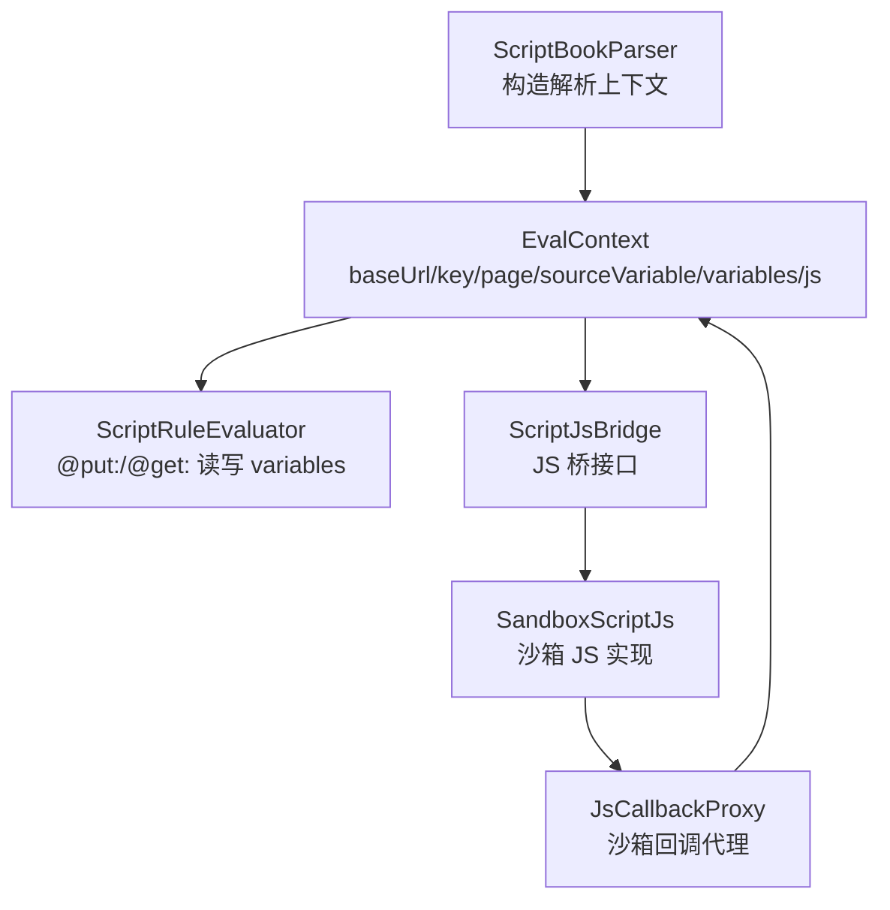
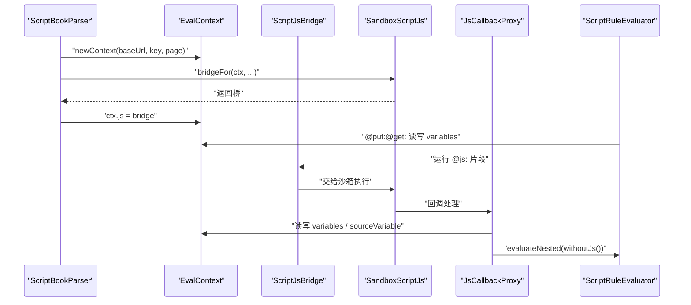
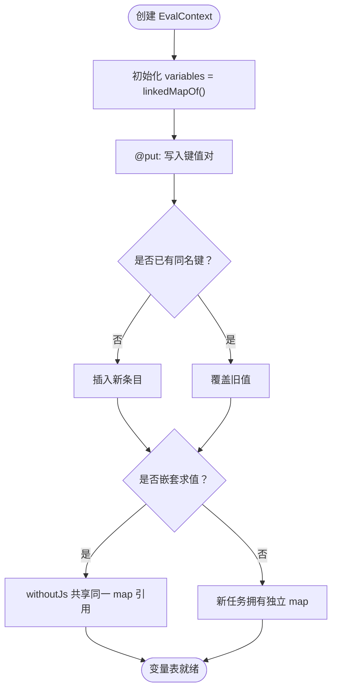
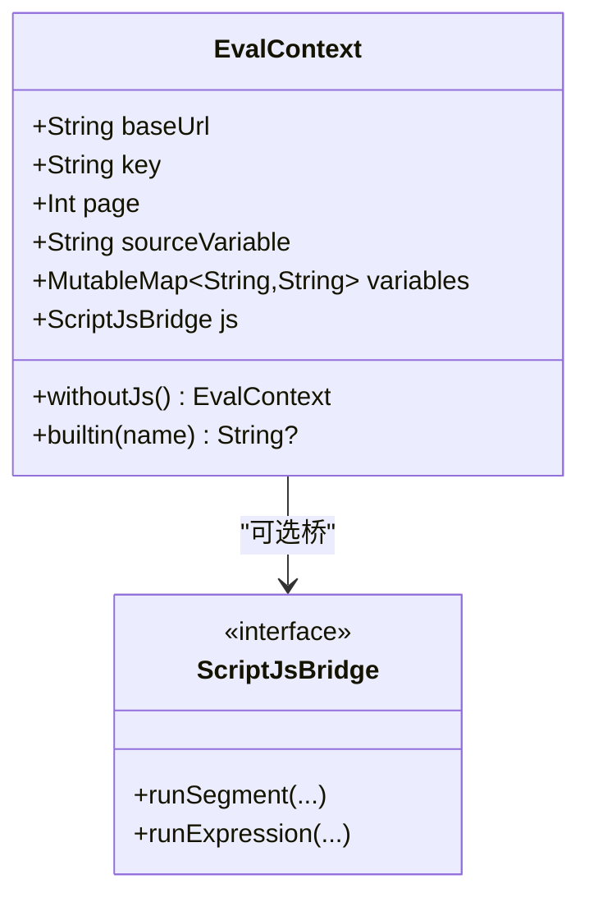
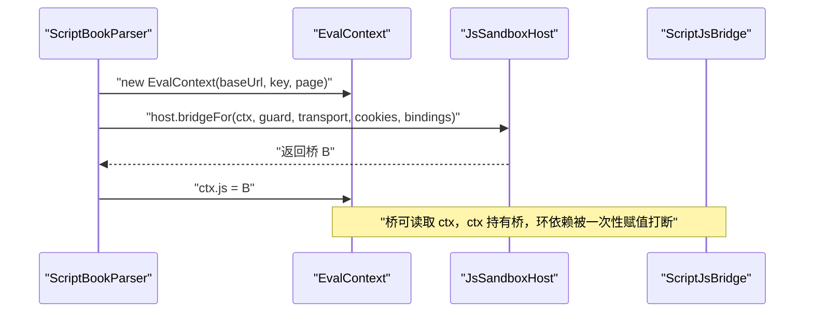
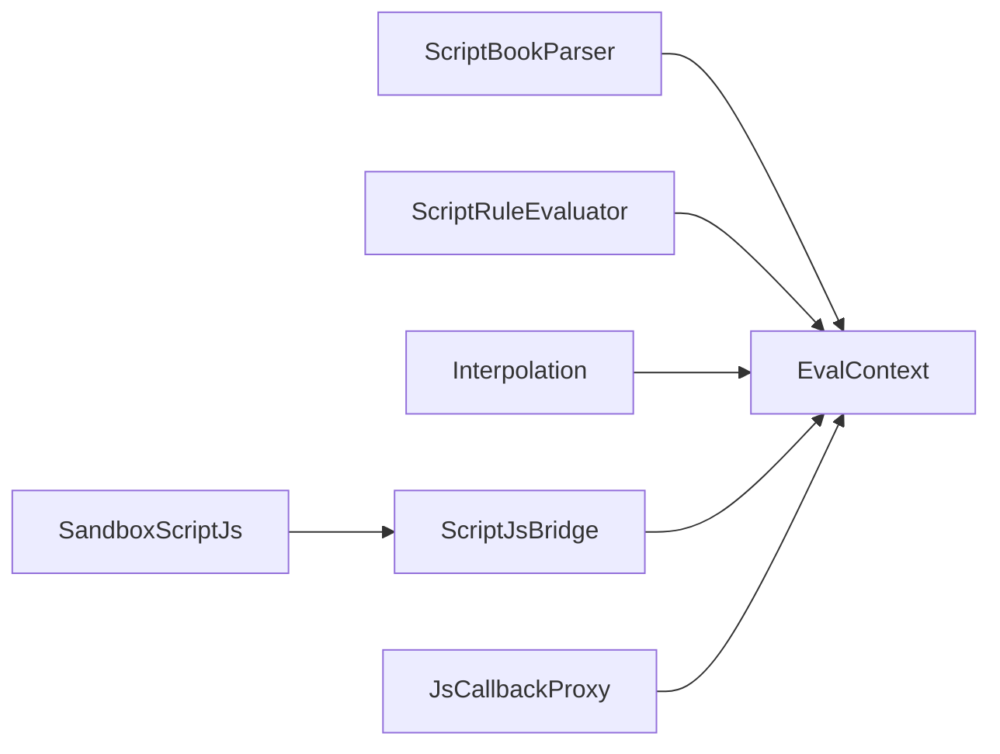

# 执行上下文 EvalContext

<cite>
**本文引用的文件**   
- [EvalContext.kt](file://lib_book_source/src/main/java/com/ebook/source/script/EvalContext.kt)
- [ScriptBookParser.kt](file://lib_book_source/src/main/java/com/ebook/source/analyze/ScriptBookParser.kt)
- [JsCallbackProxy.kt](file://lib_book_source/src/main/java/com/ebook/source/sandbox/JsCallbackProxy.kt)
- [ScriptRuleEvaluator.kt](file://lib_book_source/src/main/java/com/ebook/source/script/ScriptRuleEvaluator.kt)
- [Interpolation.kt](file://lib_book_source/src/main/java/com/ebook/source/script/Interpolation.kt)
- [ScriptJsBridge.kt](file://lib_book_source/src/main/java/com/ebook/source/script/ScriptJsBridge.kt)
- [SandboxScriptJs.kt](file://lib_book_source/src/main/java/com/ebook/source/script/SandboxScriptJs.kt)
- [EvalContextTest.kt](file://lib_book_source/src/test/java/com/ebook/source/script/EvalContextTest.kt)
</cite>

## 目录
1. [引言](#引言)
2. [项目结构定位](#项目结构定位)
3. [核心组件：EvalContext](#核心组件evalcontext)
4. [架构总览](#架构总览)
5. [详细组件分析](#详细组件分析)
6. [依赖关系分析](#依赖关系分析)
7. [性能与复杂度](#性能与复杂度)
8. [故障排查指南](#故障排查指南)
9. [结论](#结论)
10. [附录：创建、配置与使用示例](#附录创建配置与使用示例)

## 引言
EvalContext 是书源脚本解析规则引擎中“一次解析任务”的可变执行上下文。它把 baseUrl、key、page、sourceVariable、variables 以及 JS 桥桥接到一个统一对象上，让声明式规则（如 `@put:`、`@get:`）、插值表达式、JS 片段和沙箱回调共享同一份求值状态。文档的目标是把它的字段职责、生命周期、变量表实现、JS 注入方式、withoutJs 视图设计以及 builtin 内置量表讲清楚，并给出完整的上下文创建与使用示例。

## 项目结构定位
EvalContext 位于 `lib_book_source` 模块的 `script` 包，属于书源解析层的核心数据结构；它被 ScriptBookParser 在每次解析时构造，被 ScriptRuleEvaluator 读取变量，被 SandboxScriptJs / JsCallbackProxy 通过 ScriptJsBridge 访问，并通过 withoutJs 暴露给嵌套求值。

**图示来源**
- [ScriptBookParser.kt:120-150](file://lib_book_source/src/main/java/com/ebook/source/analyze/ScriptBookParser.kt#L120-L150)
- [EvalContext.kt:25-83](file://lib_book_source/src/main/java/com/ebook/source/script/EvalContext.kt#L25-L83)
- [ScriptRuleEvaluator.kt:325-333](file://lib_book_source/src/main/java/com/ebook/source/script/ScriptRuleEvaluator.kt#L325-L333)
- [ScriptJsBridge.kt:18-36](file://lib_book_source/src/main/java/com/ebook/source/script/ScriptJsBridge.kt#L18-L36)
- [SandboxScriptJs.kt:52-82](file://lib_book_source/src/main/java/com/ebook/source/script/SandboxScriptJs.kt#L52-L82)
- [JsCallbackProxy.kt:80-130](file://lib_book_source/src/main/java/com/ebook/source/sandbox/JsCallbackProxy.kt#L80-L130)

**章节来源**
- [ScriptBookParser.kt:120-150](file://lib_book_source/src/main/java/com/ebook/source/analyze/ScriptBookParser.kt#L120-L150)
- [EvalContext.kt:1-83](file://lib_book_source/src/main/java/com/ebook/source/script/EvalContext.kt#L1-L83)

## 核心组件：EvalContext
EvalContext 是一个内部类，代表单次解析任务的状态容器。它不是线程安全的共享单例，而是按解析任务实例化，并在翻页链推进时局部更新 baseUrl，同时复用 variables 表以支持嵌套求值中的变量共享。

关键字段职责如下：

| 字段 | 类型 | 职责 | 生命周期 |
|---|---|---|---|
| `baseUrl` | `String` | 当前页绝对地址，作为相对链接落位的基准；翻页每取回一页会推进到该页绝对地址 | 单次解析任务；可随翻页更新 |
| `key` | `String` | 搜索/发现阶段有意义的标识键 | 单次解析任务，默认空串 |
| `page` | `Int` | 搜索/发现阶段的页码 | 单次解析任务，默认 1 |
| `sourceVariable` | `String` | 书源级自定义变量的整串 JSON 文本；脚本通过 `JSON.parse(source.getVariable())` 修改后整串写回 | 单次解析任务，默认空串 |
| `variables` | `MutableMap<String, String>` | 变量表；`@put:`、`java.put`、`source.put` 等按键写入，`@get:`、`{{k}}` 读取 | 默认每次新建；withoutJs 传入引用供嵌套求值共享 |
| `js` | `ScriptJsBridge?` | 指向沙箱 JS 执行器的桥；null 表示无 JS 能力 | 由 ScriptBookParser 唯一回填，其他位置不写 |

**章节来源**
- [EvalContext.kt:25-83](file://lib_book_source/src/main/java/com/ebook/source/script/EvalContext.kt#L25-L83)

## 架构总览
EvalContext 处于解析规则与 JS 沙箱之间的中间层：上层规则求值器通过它存取变量，下层沙箱通过桥访问它，而 withoutJs 提供关闭 JS 能力的上下文视图用于嵌套求值。

**图示来源**
- [ScriptBookParser.kt:120-150](file://lib_book_source/src/main/java/com/ebook/source/analyze/ScriptBookParser.kt#L120-L150)
- [EvalContext.kt:25-83](file://lib_book_source/src/main/java/com/ebook/source/script/EvalContext.kt#L25-L83)
- [SandboxScriptJs.kt:52-82](file://lib_book_source/src/main/java/com/ebook/source/script/SandboxScriptJs.kt#L52-L82)
- [JsCallbackProxy.kt:80-130](file://lib_book_source/src/main/java/com/ebook/source/sandbox/JsCallbackProxy.kt#L80-L130)
- [ScriptRuleEvaluator.kt:325-333](file://lib_book_source/src/main/java/com/ebook/source/script/ScriptRuleEvaluator.kt#L325-L333)

## 详细组件分析

### 作用域设计与字段语义
EvalContext 的作用域被刻意限制为“单次解析任务”，也就是一本书的一轮求值。这意味着：

- `key` 与 `page` 只在搜索或发现 URL 上有意义；它们在这里只提供默认值，实际翻页逻辑在 `ScriptTocPager` 与 `ScriptUrlOption` 中处理。
- `baseUrl` 是可变的：翻页链每取回一页就把它推进到该页绝对地址，使下一页相对链接的落位基准是“链接写在哪页，就相对那页”。
- `variables` 与 `sourceVariable` 仍保持任务级作用域；跨请求存活不是本仓默认行为，上游应在导入报告中标注相关风险。
- 上游还有更明确的持久变量面（书源级、book、chapter）与 `cache`；前三套的按键读写在本仓全部落到 EvalContext.variables，但 `cache` 不参与折叠——脚本直接遇到的是 ReferenceError，规则装载期会把 `@cache:` 标记为不支持。

这些约束来自 EvalContext 注释对公开规格 §5.2、§5.3 和仓库规范的说明。

**章节来源**
- [EvalContext.kt:3-24](file://lib_book_source/src/main/java/com/ebook/source/script/EvalContext.kt#L3-L24)
- [EvalContext.kt:25-45](file://lib_book_source/src/main/java/com/ebook/source/script/EvalContext.kt#L25-L45)

### 变量表 variables 的 LinkedHashMap 实现
variables 是 `LinkedHashMap` 的 Kotlin 等价形式 `linkedMapOf()`，类型为 `MutableMap<String, String>`。选择有序映射的原因有三点：

1. **写入顺序可读**：`@put:` 可以一次写入多个键，后续错误日志需要能体现先写哪个、后写哪个。
2. **同键覆盖语义明确**：重复同名键的后写覆盖先写，这是 Ordered Map 的自然语义，测试用例专门用这条验证“按序生效”。
3. **嵌套求值共享引用**：withoutJs 创建的子上下文直接把父上下文的 variables 实例传进去，而不是拷贝。这样嵌套求值里 `@put:` 写入的变量，外层 `@get:` 能立刻读到。

变量表的默认值是每次新建 EvalContext 时产生一个新 map，因此不同解析任务之间天然隔离；同一解析任务内的多次求值若共用同一个 context，则共享这个 map。

**图示来源**
- [EvalContext.kt:40-45](file://lib_book_source/src/main/java/com/ebook/source/script/EvalContext.kt#L40-L45)
- [EvalContext.kt:62-68](file://lib_book_source/src/main/java/com/ebook/source/script/EvalContext.kt#L62-L68)
- [EvalContextTest.kt:27-49](file://lib_book_source/src/test/java/com/ebook/source/script/EvalContextTest.kt#L27-L49)

**章节来源**
- [EvalContext.kt:40-45](file://lib_book_source/src/main/java/com/ebook/source/script/EvalContext.kt#L40-L45)
- [EvalContextTest.kt:27-49](file://lib_book_source/src/test/java/com/ebook/source/script/EvalContextTest.kt#L27-L49)

### withoutJs 方法：关闭 JS 能力的上下文视图
withoutJs 返回一个新的 EvalContext，其关键语义是：

- 标量字段 `baseUrl`、`key`、`page`、`sourceVariable` 按当前值复制。
- `variables` 直接传入引用，让嵌套求值与外层共享同一个变量表。
- 新的 `js` 字段保留默认值 null，从而禁止嵌套求值再次进入 JS。

设计意图来自规格 §5.4：递归求值不得再要 JS。沙箱只有一个 runtime，且此刻正被外层 execute 持有；如果嵌套求值再申请一次 JS，会造成双向死锁。因此沙箱回调里的嵌套规则求值必须使用关闭 JS 的上下文视图。

**图示来源**
- [EvalContext.kt:25-83](file://lib_book_source/src/main/java/com/ebook/source/script/EvalContext.kt#L25-L83)
- [ScriptJsBridge.kt:18-36](file://lib_book_source/src/main/java/com/ebook/source/script/ScriptJsBridge.kt#L18-L36)

**章节来源**
- [EvalContext.kt:56-68](file://lib_book_source/src/main/java/com/ebook/source/script/EvalContext.kt#L56-L68)
- [JsCallbackProxy.kt:80-130](file://lib_book_source/src/main/java/com/ebook/source/sandbox/JsCallbackProxy.kt#L80-L130)

### JS 桥接器注入与环依赖处理
js 字段是 `var`，而不是构造参数，原因是：

1. 桥构造时需要拿到 ctx，以便现读 baseUrl、page 和变量表。
2. ctx 又要持有桥。
3. 如果两者都放在构造参数中，就会形成构造期环依赖。

解决方案是“先建 ctx，再回填 js”。全仓唯一的赋值点在 ScriptBookParser.newContext，其他位置不应再写 js。这样既打破环依赖，又限定桥的生命周期与解析任务一致。

**图示来源**
- [ScriptBookParser.kt:120-150](file://lib_book_source/src/main/java/com/ebook/source/analyze/ScriptBookParser.kt#L120-L150)
- [EvalContext.kt:47-55](file://lib_book_source/src/main/java/com/ebook/source/script/EvalContext.kt#L47-L55)

**章节来源**
- [ScriptBookParser.kt:120-150](file://lib_book_source/src/main/java/com/ebook/source/analyze/ScriptBookParser.kt#L120-L150)
- [EvalContext.kt:47-55](file://lib_book_source/src/main/java/com/ebook/source/script/EvalContext.kt#L47-L55)

### 内置量表 builtin()
builtin(name) 只返回声明式子集真正认识的三个量：

| name | 返回值 | 含义 |
|---|---|---|
| `key` | `key` | 当前任务的搜索/发现标识 |
| `page` | `page.toString()` | 当前页码字符串 |
| `baseUrl` | `baseUrl` | 当前页绝对地址 |
| 其他名称 | `null` | 不认识，交由插值层按 JS 待执行处理 |

book、chapter、result 这类 JS 侧绑定刻意不出现在 builtin 中，因为它们的值来自 Room 数据库实体，而 EvalContext 这段逻辑禁止触碰持久层。返回 null 表示“我不认得这个量”，插值层据此抛出待执行异常，而不是猜一个空串。

**章节来源**
- [EvalContext.kt:70-83](file://lib_book_source/src/main/java/com/ebook/source/script/EvalContext.kt#L70-L83)
- [Interpolation.kt:65-72](file://lib_book_source/src/main/java/com/ebook/source/script/Interpolation.kt#L65-L72)

### sourceVariable 与 variables 的区别
sourceVariable 与 variables 虽然都与“变量”有关，但形态和用途完全不同：

| 维度 | variables | sourceVariable |
|---|---|---|
| 数据结构 | `MutableMap<String, String>` | `String` |
| 访问方式 | 按键存取 | 整串读写 |
| 典型用法 | `@put:`、`@get:`、`java.put`、`java.get`、`{{k}}` | 脚本 `JSON.parse(source.getVariable())` 解析后改字段，再整串写回 |
| 持久层关系 | 本仓不直接持久化，作用域降级到任务级 | 上游持久在书源行，但本仓只做任务级副本，不在解析过程中写回 Room |
| 线程模型 | 沙箱一次只有一帧在飞；写在受理回调 binder 线程，下一次 bridgeFor 调用线程读取 | 同 variables |

sourceVariable 的整串模式适合把一组结构化配置当作一个不可分割的单元传给脚本；variables 更适合规则引擎内部临时状态。

**章节来源**
- [EvalContext.kt:32-45](file://lib_book_source/src/main/java/com/ebook/source/script/EvalContext.kt#L32-L45)
- [ScriptBookParser.kt:120-150](file://lib_book_source/src/main/java/com/ebook/source/analyze/ScriptBookParser.kt#L120-L150)
- [JsCallbackProxy.kt:80-130](file://lib_book_source/src/main/java/com/ebook/source/sandbox/JsCallbackProxy.kt#L80-L130)

## 依赖关系分析
EvalContext 的耦合关系比较清晰：

- 被 ScriptBookParser 构造并装配 js 与 sourceVariable。
- 被 ScriptRuleEvaluator 用于变量存取。
- 被 Interpolation 用于插值与 `@put:`、`@get:` 识别。
- 被 SandboxScriptJs 通过 ScriptJsBridge 间接访问。
- 被 JsCallbackProxy 在回调路径中读取 variables 与 sourceVariable。

**图示来源**
- [ScriptBookParser.kt:120-150](file://lib_book_source/src/main/java/com/ebook/source/analyze/ScriptBookParser.kt#L120-L150)
- [ScriptRuleEvaluator.kt:325-333](file://lib_book_source/src/main/java/com/ebook/source/script/ScriptRuleEvaluator.kt#L325-L333)
- [Interpolation.kt:65-72](file://lib_book_source/src/main/java/com/ebook/source/script/Interpolation.kt#L65-L72)
- [ScriptJsBridge.kt:18-36](file://lib_book_source/src/main/java/com/ebook/source/script/ScriptJsBridge.kt#L18-L36)
- [JsCallbackProxy.kt:80-130](file://lib_book_source/src/main/java/com/ebook/source/sandbox/JsCallbackProxy.kt#L80-L130)

**章节来源**
- [ScriptBookParser.kt:120-150](file://lib_book_source/src/main/java/com/ebook/source/analyze/ScriptBookParser.kt#L120-L150)
- [ScriptRuleEvaluator.kt:325-333](file://lib_book_source/src/main/java/com/ebook/source/script/ScriptRuleEvaluator.kt#L325-L333)
- [Interpolation.kt:65-72](file://lib_book_source/src/main/java/com/ebook/source/script/Interpolation.kt#L65-L72)
- [JsCallbackProxy.kt:80-130](file://lib_book_source/src/main/java/com/ebook/source/sandbox/JsCallbackProxy.kt#L80-L130)

## 性能与复杂度
- variables 使用 LinkedHashMap：查找、插入、删除平均时间复杂度为 O(1)，遍历保持插入顺序。
- 嵌套求值共享 variables 的引用而非深拷贝，避免重复分配变量表，降低内存压力。
- withoutJs 仅复制四个标量字段和一个 map 引用，构造开销很小。
- js 字段延迟注入，避免构造期循环依赖，也允许在没有沙箱时把 js 保持为 null。
- 由于 EvalContext 不是并发安全对象，性能优势建立在“沙箱一次只有一帧在飞”的前提上；超出这个前提需要同步保护。

[本节为通用性能讨论，不直接分析具体代码行]

## 故障排查指南

| 现象 | 可能原因 | 排查建议 |
|---|---|---|
| 嵌套求值卡住或死锁 | 嵌套求值使用了带 JS 的上下文 | 确认嵌套求值使用 `ctx.withoutJs()` |
| `@put:` 写入后外层读不到 | 误用了新 variables 实例而非共享引用 | 检查是否意外创建了新的 EvalContext，导致 variables 未共享 |
| 变量顺序混乱 | 使用了非有序 Map | 确认 variables 使用 linkedMapOf() |
| 未装配沙箱时报错 | js 为 null 且规则尝试执行 JS | 检查 ScriptBookParser 是否正确注入 host 和 bridgeFor |
| sourceVariable 修改未持久化 | 期望解析过程写回 Room | 本仓不做解析期写回；持久化应走上游设计 |
| `@get:` 返回 Miss | 变量未写入或作用域隔离 | 用 EvalContextTest 的思路分别验证同 evaluator 与不同 evaluator 的行为 |
| 嵌套规则达到深度上限 | 回调深度超限 | 查看 JsCallbackProxy 的深度限制与 maxCallbackDepth |

**章节来源**
- [EvalContextTest.kt:17-49](file://lib_book_source/src/test/java/com/ebook/source/script/EvalContextTest.kt#L17-L49)
- [JsCallbackProxy.kt:80-130](file://lib_book_source/src/main/java/com/ebook/source/sandbox/JsCallbackProxy.kt#L80-L130)

## 结论
EvalContext 是书源解析规则引擎的一次解析任务上下文，承担 baseUrl 基准、任务标识、页码、源级变量和变量表等职责。它通过 LinkedHashMap 维护变量写入顺序，通过 withoutJs 提供关闭 JS 的嵌套求值视图，通过延迟注入 js 字段避免环依赖，并通过 builtin 暴露最小内置量表。理解它的关键是区分“任务级可变状态”“变量表共享引用”“sourceVariable 整串语义”以及“嵌套求值禁用 JS”的设计边界。

## 附录：创建、配置与使用示例

### 示例一：创建基础上下文
场景：为一次内容解析创建 EvalContext，传入 baseUrl、key、page。

步骤：
1. 调用 ScriptBookParser.newContext，传入 baseUrl、key、page。
2. newContext 会设置 ctx.sourceVariable 为规则中声明的 variable。
3. 如果有沙箱主机，newContext 会通过 host.bridgeFor 创建 ScriptJsBridge 并回填 ctx.js。
4. 返回 ctx 给上层解析器使用。

参考路径：
- [ScriptBookParser.kt:120-150](file://lib_book_source/src/main/java/com/ebook/source/analyze/ScriptBookParser.kt#L120-L150)
- [EvalContext.kt:25-45](file://lib_book_source/src/main/java/com/ebook/source/script/EvalContext.kt#L25-L45)

### 示例二：在规则中使用 variables
场景：`@put:` 写入变量，`@get:` 读取变量。

行为要点：
- 同一 ScriptRuleEvaluator 内可读写 variables。
- 不同 EvalContext 之间 variables 隔离。
- 未写入的 `@get:` 返回 Miss。
- 多条写入按 LinkedHashMap 顺序生效，同名后写覆盖先写。

参考路径：
- [EvalContextTest.kt:17-49](file://lib_book_source/src/test/java/com/ebook/source/script/EvalContextTest.kt#L17-L49)
- [ScriptRuleEvaluator.kt:325-333](file://lib_book_source/src/main/java/com/ebook/source/script/ScriptRuleEvaluator.kt#L325-L333)

### 示例三：嵌套求值时使用 withoutJs
场景：JS 回调触发嵌套规则求值，但不能再次进入 JS。

行为要点：
- 使用 `ctx.withoutJs()` 创建关闭 JS 的新上下文。
- 新上下文共享 variables 引用，因此 `@put:` 写入可被外层读取。
- baseUrl、key、page、sourceVariable 使用快照值，不会污染外层翻页链。

参考路径：
- [EvalContext.kt:56-68](file://lib_book_source/src/main/java/com/ebook/source/script/EvalContext.kt#L56-L68)
- [JsCallbackProxy.kt:80-130](file://lib_book_source/src/main/java/com/ebook/source/sandbox/JsCallbackProxy.kt#L80-L130)

### 示例四：读取内置量表
场景：插值或规则需要读取 key、page、baseUrl。

行为要点：
- 只有这三个名称会被 builtin 返回。
- 其他名称返回 null，由插值层按 JS 待执行处理。
- book、chapter、result 不在此处返回。

参考路径：
- [EvalContext.kt:70-83](file://lib_book_source/src/main/java/com/ebook/source/script/EvalContext.kt#L70-L83)
- [Interpolation.kt:65-72](file://lib_book_source/src/main/java/com/ebook/source/script/Interpolation.kt#L65-L72)

### 示例五：sourceVariable 的整串读写
场景：脚本解析 sourceVariable 的 JSON 文本，修改字段后再整串写回。

行为要点：
- 初始值来自规则中的 variable。
- 修改后整串写回 EvalContext.sourceVariable。
- 解析过程不直接写回 Room，避免竞态。

参考路径：
- [ScriptBookParser.kt:120-150](file://lib_book_source/src/main/java/com/ebook/source/analyze/ScriptBookParser.kt#L120-L150)
- [EvalContext.kt:32-45](file://lib_book_source/src/main/java/com/ebook/source/script/EvalContext.kt#L32-L45)