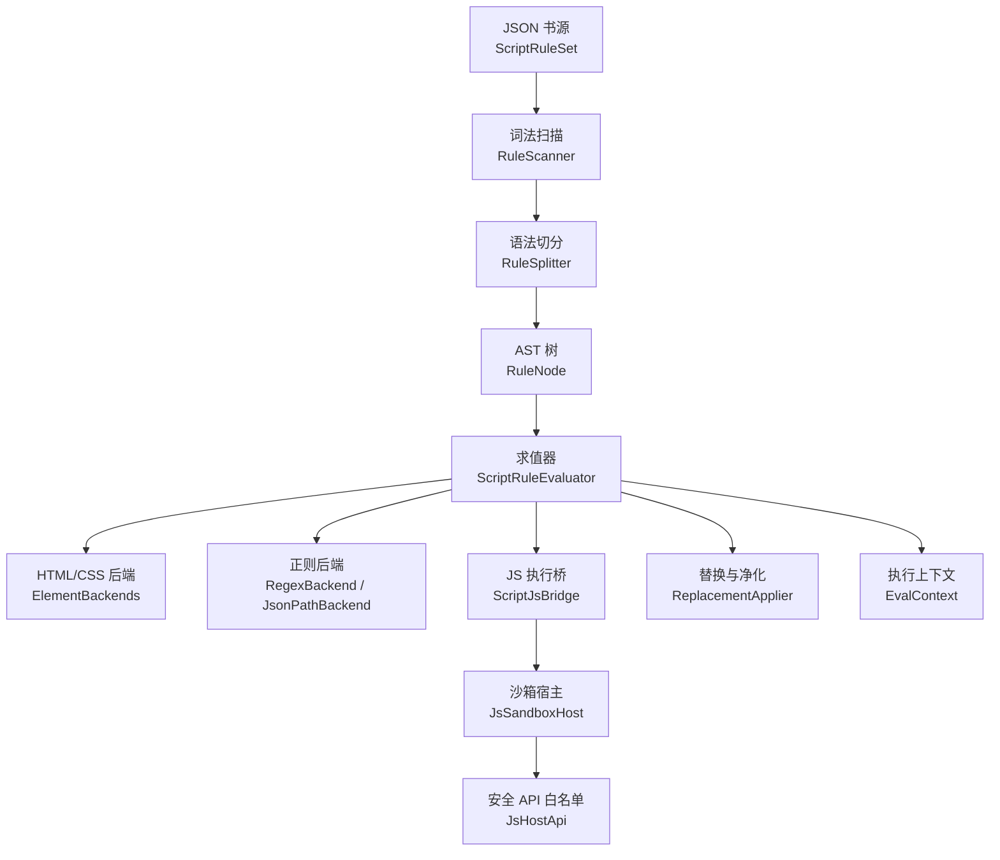
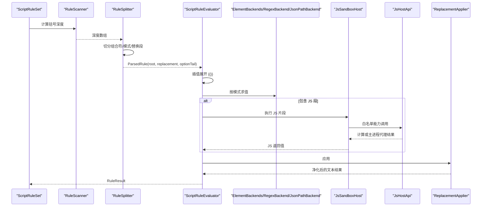
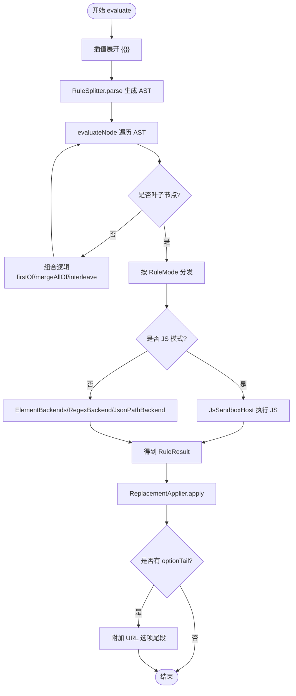
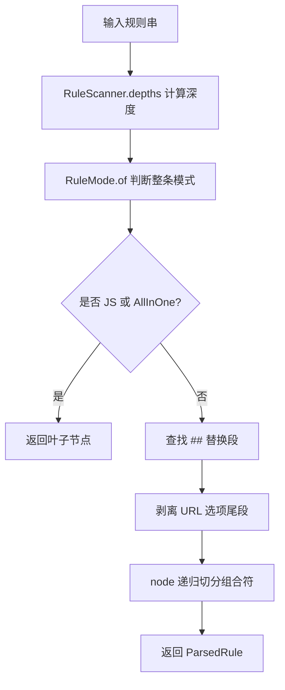
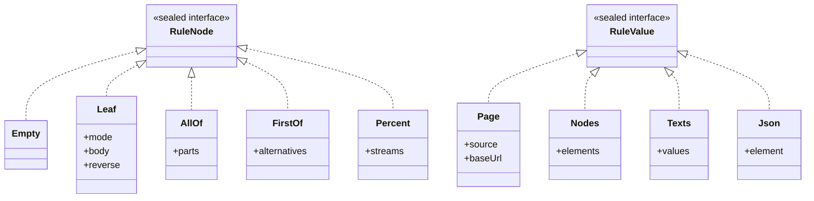
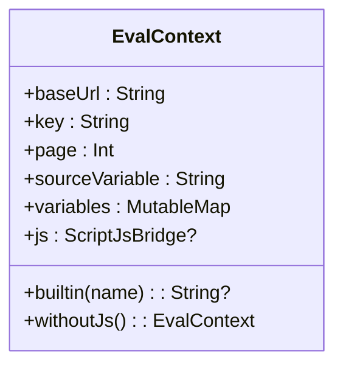
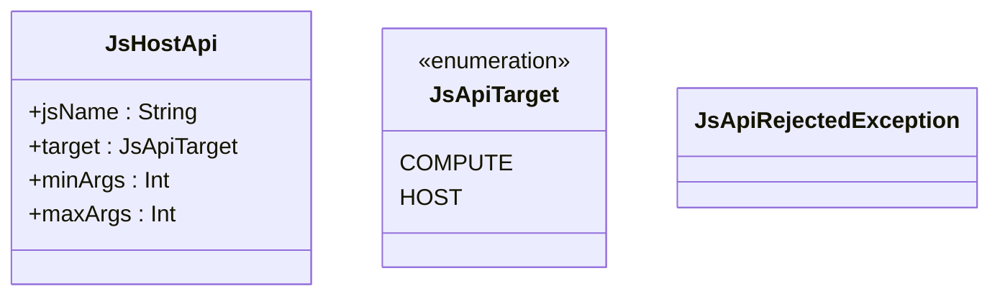
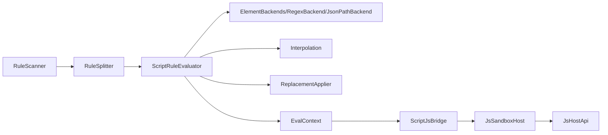

# 脚本规则引擎

<cite>
**本文引用的文件**   
- [ScriptRuleEvaluator.kt](file://lib_book_source/src/main/java/com/ebook/source/script/ScriptRuleEvaluator.kt)
- [RuleScanner.kt](file://lib_book_source/src/main/java/com/ebook/source/script/RuleScanner.kt)
- [RuleSplitter.kt](file://lib_book_source/src/main/java/com/ebook/source/script/RuleSplitter.kt)
- [RuleNode.kt](file://lib_book_source/src/main/java/com/ebook/source/script/RuleNode.kt)
- [RuleValue.kt](file://lib_book_source/src/main/java/com/ebook/source/script/RuleValue.kt)
- [EvalContext.kt](file://lib_book_source/src/main/java/com/ebook/source/script/EvalContext.kt)
- [JsHostApi.kt](file://lib_book_source/src/main/java/com/ebook/source/script/JsHostApi.kt)
- [Interpolation.kt](file://lib_book_source/src/main/java/com/ebook/source/script/Interpolation.kt)
- [ReplacementApplier.kt](file://lib_book_source/src/main/java/com/ebook/source/script/ReplacementApplier.kt)
- [ElementBackends.kt](file://lib_book_source/src/main/java/com/ebook/source/script/ElementBackends.kt)
- [RuleMode.kt](file://lib_book_source/src/main/java/com/ebook/source/script/RuleMode.kt)
- [ScriptRuleExceptions.kt](file://lib_book_source/src/main/java/com/ebook/source/script/ScriptRuleExceptions.kt)
- [ScriptRuleSet.kt](file://lib_book_source/src/main/java/com/ebook/source/script/ScriptRuleSet.kt)
- [JsSandboxHost.kt](file://lib_book_source/src/main/java/com/ebook/source/sandbox/JsSandboxHost.kt)
</cite>

## 目录
1. [引言](#引言)
2. [项目结构](#项目结构)
3. [核心组件](#核心组件)
4. [架构总览](#架构总览)
5. [详细组件分析](#详细组件分析)
6. [依赖关系分析](#依赖关系分析)
7. [性能考量](#性能考量)
8. [故障排查指南](#故障排查指南)
9. [结论](#结论)
10. [附录：规则编写与调试指南](#附录规则编写与调试指南)

## 引言
本技术文档围绕“脚本规则引擎”展开，重点说明规则从 JSON 书源到可执行 AST、再到取值结果的完整链路。文档聚焦以下目标：
- 解释 ScriptRuleEvaluator 的规则评估器核心逻辑，包括插值展开、AST 构建、节点遍历和执行上下文管理。
- 深入说明 RuleScanner 和 RuleSplitter 的词法分析与语法解析过程，覆盖组合符优先级、模式判定、URL 选项尾段剥离与正则替换段的后置应用。
- 文档化 RuleNode、RuleValue 等数据结构的层次关系，以及不同规则类型的处理分支。
- 说明 EvalContext 的执行环境，包括变量作用域、内置量、沙箱桥接和错误语义。
- 梳理 JsHostApi 暴露给 JavaScript 的安全 API 白名单及其分类（纯计算、网络、变量、递归求值、Cookie、日志）。
- 提供规则编写指南、调试技巧、性能优化建议，并给出完整的 JSON 规则示例与 JavaScript 脚本开发模式。

## 项目结构
脚本规则引擎位于 `lib_book_source` 模块的 `script` 包中，并与 `sandbox` 子模块协作，形成“规则定义 → 解析 → 求值 → 沙箱执行 → 结果回写”的分层架构。



**图示来源**
- [ScriptRuleSet.kt:1-200](file://lib_book_source/src/main/java/com/ebook/source/script/ScriptRuleSet.kt#L1-L200)
- [RuleScanner.kt:1-78](file://lib_book_source/src/main/java/com/ebook/source/script/RuleScanner.kt#L1-L78)
- [RuleSplitter.kt:1-117](file://lib_book_source/src/main/java/com/ebook/source/script/RuleSplitter.kt#L1-L117)
- [RuleNode.kt:1-32](file://lib_book_source/src/main/java/com/ebook/source/script/RuleNode.kt#L1-L32)
- [ScriptRuleEvaluator.kt:1-367](file://lib_book_source/src/main/java/com/ebook/source/script/ScriptRuleEvaluator.kt#L1-L367)
- [ElementBackends.kt:1-200](file://lib_book_source/src/main/java/com/ebook/source/script/ElementBackends.kt#L1-L200)
- [JsSandboxHost.kt:1-60](file://lib_book_source/src/main/java/com/ebook/source/sandbox/JsSandboxHost.kt#L1-L60)
- [JsHostApi.kt:1-114](file://lib_book_source/src/main/java/com/ebook/source/script/JsHostApi.kt#L1-L114)

**章节来源**
- [ScriptRuleSet.kt:1-200](file://lib_book_source/src/main/java/com/ebook/source/script/ScriptRuleSet.kt#L1-L200)
- [RuleScanner.kt:1-78](file://lib_book_source/src/main/java/com/ebook/source/script/RuleScanner.kt#L1-L78)
- [RuleSplitter.kt:1-117](file://lib_book_source/src/main/java/com/ebook/source/script/RuleSplitter.kt#L1-L117)
- [RuleNode.kt:1-32](file://lib_book_source/src/main/java/com/ebook/source/script/RuleNode.kt#L1-L32)

## 核心组件
- 规则装载视图：ScriptRuleSet 将原始 JSON 映射为字符串态规则表，同时记录非常规字段与不支持能力。
- 词法扫描：RuleScanner 计算括号深度，识别顶层分隔符位置。
- 语法切分：RuleSplitter 按固定优先级切分组合符（%%、||、&&），并剥离 URL 选项尾段与正则替换段。
- AST 模型：RuleNode 表达空节点、叶子模式节点及 AllOf/FirstOf/Percent 三种组合形态。
- 输入模型：RuleValue 区分页面源码、DOM 节点集、文本集与 JSON 文档。
- 执行上下文：EvalContext 维护 baseUrl、key、page、sourceVariable、variables 与 JS 桥。
- 求值器：ScriptRuleEvaluator 负责插值展开、AST 遍历、模式分发、合并交错、反序与替换净化。
- HTML/CSS 后端：ElementBackends 实现链式选择器与 CSS 选择器的取值。
- 正则/JSONPath 后端：RegexBackend 与 JsonPathBackend 处理列表匹配与 JSON 路径取值。
- 替换净化：ReplacementApplier 对最终文本执行正则替换与 OnlyOne 收敛。
- 安全 API：JsHostApi 白名单约束脚本可调用能力，JsSandboxHost 提供沙箱桥装配。

**章节来源**
- [ScriptRuleSet.kt:1-200](file://lib_book_source/src/main/java/com/ebook/source/script/ScriptRuleSet.kt#L1-L200)
- [RuleScanner.kt:1-78](file://lib_book_source/src/main/java/com/ebook/source/script/RuleScanner.kt#L1-L78)
- [RuleSplitter.kt:1-117](file://lib_book_source/src/main/java/com/ebook/source/script/RuleSplitter.kt#L1-L117)
- [RuleNode.kt:1-32](file://lib_book_source/src/main/java/com/ebook/source/script/RuleNode.kt#L1-L32)
- [RuleValue.kt:1-31](file://lib_book_source/src/main/java/com/ebook/source/script/RuleValue.kt#L1-L31)
- [EvalContext.kt:1-83](file://lib_book_source/src/main/java/com/ebook/source/script/EvalContext.kt#L1-L83)
- [ScriptRuleEvaluator.kt:1-367](file://lib_book_source/src/main/java/com/ebook/source/script/ScriptRuleEvaluator.kt#L1-L367)
- [ElementBackends.kt:1-200](file://lib_book_source/src/main/java/com/ebook/source/script/ElementBackends.kt#L1-L200)
- [ReplacementApplier.kt:1-83](file://lib_book_source/src/main/java/com/ebook/source/script/ReplacementApplier.kt#L1-L83)
- [JsHostApi.kt:1-114](file://lib_book_source/src/main/java/com/ebook/source/script/JsHostApi.kt#L1-L114)
- [JsSandboxHost.kt:1-60](file://lib_book_source/src/main/java/com/ebook/source/sandbox/JsSandboxHost.kt#L1-L60)

## 架构总览
规则引擎采用“声明式规则 + 可扩展后端 + 受限 JS 沙箱”的架构：
- 声明式层：JSON 书源描述各阶段规则；ScriptRuleSet 负责装载与能力检测。
- 解析层：RuleScanner 与 RuleSplitter 将规则串转换为 AST，并分离替换段与 URL 选项尾段。
- 求值层：ScriptRuleEvaluator 驱动 AST 遍历，按模式分发至 HTML/CSS、正则、JSONPath 或 JS 后端。
- 执行层：JsSandboxHost 将 JS 代码交由沙箱执行，并通过 JsHostApi 白名单限制能力范围。
- 结果层：ReplacementApplier 对文本结果进行净化与 OnlyOne 收敛，最终返回 RuleResult。



**图示来源**
- [ScriptRuleSet.kt:1-200](file://lib_book_source/src/main/java/com/ebook/source/script/ScriptRuleSet.kt#L1-L200)
- [RuleScanner.kt:1-78](file://lib_book_source/src/main/java/com/ebook/source/script/RuleScanner.kt#L1-L78)
- [RuleSplitter.kt:1-117](file://lib_book_source/src/main/java/com/ebook/source/script/RuleSplitter.kt#L1-L117)
- [ScriptRuleEvaluator.kt:1-367](file://lib_book_source/src/main/java/com/ebook/source/script/ScriptRuleEvaluator.kt#L1-L367)
- [JsSandboxHost.kt:1-60](file://lib_book_source/src/main/java/com/ebook/source/sandbox/JsSandboxHost.kt#L1-L60)
- [JsHostApi.kt:1-114](file://lib_book_source/src/main/java/com/ebook/source/script/JsHostApi.kt#L1-L114)
- [ReplacementApplier.kt:1-83](file://lib_book_source/src/main/java/com/ebook/source/script/ReplacementApplier.kt#L1-L83)

## 详细组件分析

### ScriptRuleEvaluator：规则评估器核心
- 职责：接收规则串与 RuleValue 输入，完成插值展开、AST 求值、组合合并、交错取数、反序、替换净化与 URL 选项尾段附加。
- 关键流程：
  - 插值展开：Interpolation.expand 将 {{...}} 替换为占位符，避免数据干扰切分。
  - AST 解析：RuleSplitter.parse 生成根节点，支持 %%、||、&& 组合。
  - 节点求值：evaluateNode 根据 RuleNode 类型分发到叶子模式或组合逻辑。
  - 组合逻辑：firstOf 短路取首个非空结果；mergeAllOf 合并多支；interleave 按轮次交错。
  - 叶子模式：按 RuleMode 分发到 JS、XPath、JSONPath、正则、CSS、链式、变量读写等。
  - 替换净化：ReplacementApplier.apply 对文本结果执行正则替换与 OnlyOne 收敛。
  - 选项尾段：optionTail 仅附加到 Texts 结果，确保 URL 解析层统一消费。



**图示来源**
- [ScriptRuleEvaluator.kt:1-367](file://lib_book_source/src/main/java/com/ebook/source/script/ScriptRuleEvaluator.kt#L1-L367)
- [Interpolation.kt:1-200](file://lib_book_source/src/main/java/com/ebook/source/script/Interpolation.kt#L1-L200)
- [RuleSplitter.kt:1-117](file://lib_book_source/src/main/java/com/ebook/source/script/RuleSplitter.kt#L1-L117)
- [JsSandboxHost.kt:1-60](file://lib_book_source/src/main/java/com/ebook/source/sandbox/JsSandboxHost.kt#L1-L60)
- [ReplacementApplier.kt:1-83](file://lib_book_source/src/main/java/com/ebook/source/script/ReplacementApplier.kt#L1-L83)

**章节来源**
- [ScriptRuleEvaluator.kt:1-367](file://lib_book_source/src/main/java/com/ebook/source/script/ScriptRuleEvaluator.kt#L1-L367)
- [Interpolation.kt:1-200](file://lib_book_source/src/main/java/com/ebook/source/script/Interpolation.kt#L1-L200)
- [RuleSplitter.kt:1-117](file://lib_book_source/src/main/java/com/ebook/source/script/RuleSplitter.kt#L1-L117)

### RuleScanner 与 RuleSplitter：词法与语法解析
- RuleScanner：
  - depths 计算每个字符位置的括号深度，{{}} 计 2，{}[] 计 1，右括号先减后记，保证深度非负。
  - topLevelOf 在深度 0 处查找分隔符，避免误切 {{}}/{}/[] 内部内容。
- RuleSplitter：
  - parse 首先判断整条是否为 JS 或正则 AllInOne，若是则直接返回叶子节点。
  - 否则按顺序剥出 ## 替换段，再在取值段内寻找 URL 选项尾段。
  - node 方法按优先级切分组合符（%%、||、&&），并将每段再次判定模式。
  - 下标始终基于原始规则串，避免子串切片导致的深度错位。



**图示来源**
- [RuleScanner.kt:1-78](file://lib_book_source/src/main/java/com/ebook/source/script/RuleScanner.kt#L1-L78)
- [RuleSplitter.kt:1-117](file://lib_book_source/src/main/java/com/ebook/source/script/RuleSplitter.kt#L1-L117)
- [RuleMode.kt:1-118](file://lib_book_source/src/main/java/com/ebook/source/script/RuleMode.kt#L1-L118)

**章节来源**
- [RuleScanner.kt:1-78](file://lib_book_source/src/main/java/com/ebook/source/script/RuleScanner.kt#L1-L78)
- [RuleSplitter.kt:1-117](file://lib_book_source/src/main/java/com/ebook/source/script/RuleSplitter.kt#L1-L117)

### RuleNode 与 RuleValue：数据结构层次
- RuleNode：
  - Empty：表示空段，不是无节点，而是“未取到值”的载体。
  - Leaf：带模式的规则体，含 mode、body、reverse。
  - AllOf：所有分支求值后合并。
  - FirstOf：第一个非空分支短路。
  - Percent：所有分支交错取数。
- RuleValue：
  - Page：整页源码，用于页面级规则。
  - Nodes：当前 DOM 节点集，用于列表项规则。
  - Texts：当前文本集，用于已取出的字段值。
  - Json：当前 JSON 文档，用于 JSONPath 模式。



**图示来源**
- [RuleNode.kt:1-32](file://lib_book_source/src/main/java/com/ebook/source/script/RuleNode.kt#L1-L32)
- [RuleValue.kt:1-31](file://lib_book_source/src/main/java/com/ebook/source/script/RuleValue.kt#L1-L31)

**章节来源**
- [RuleNode.kt:1-32](file://lib_book_source/src/main/java/com/ebook/source/script/RuleNode.kt#L1-L32)
- [RuleValue.kt:1-31](file://lib_book_source/src/main/java/com/ebook/source/script/RuleValue.kt#L1-L31)

### EvalContext：执行上下文与作用域
- 作用域：单次解析任务（一本书的一轮求值），非全局持久。
- 内置量：key、page、baseUrl 由 builtin 提供。
- 变量表：variables 使用 LinkedHashMap 保序，@put: 写入按序生效。
- sourceVariable：源级自定义变量的整串值，与 variables 分开存储。
- baseUrl：可变，翻页链更新为当前页绝对地址。
- js 桥：ScriptJsBridge，可能为 null，此时 JS 段抛 JsEvaluationPendingException。
- withoutJs：关闭 JS 能力的上下文视图，供嵌套求值使用。



**图示来源**
- [EvalContext.kt:1-83](file://lib_book_source/src/main/java/com/ebook/source/script/EvalContext.kt#L1-L83)

**章节来源**
- [EvalContext.kt:1-83](file://lib_book_source/src/main/java/com/ebook/source/script/EvalContext.kt#L1-L83)

### JsHostApi：JavaScript 安全 API 白名单
- 设计原则：deny-by-default，只有表中列出的名字在 QuickJS 全局对象上存在。
- 能力分类：
  - 纯计算：摘要、编码、对称加解密、时间、UUID、HMAC、字节转换等。
  - 网络：ajax、post、load、responseCode，均经主进程受限代理。
  - 变量：putVar、getVar、rmVar，任务级作用域。
  - 源级变量：sourceGetVariable、sourceSetVariable，整串读写。
  - 递归求值：getElements、getElement、queryString、putToPage、setContent。
  - Cookie：cookieGet、cookieSet、cookieRemove，落点源级会话罐。
  - 日志：toast、log，不弹 UI。
- 参数校验：minArgs/maxArgs 由 JS 垫片校验，防止内核拿到 undefined 导致静默失败。



**图示来源**
- [JsHostApi.kt:1-114](file://lib_book_source/src/main/java/com/ebook/source/script/JsHostApi.kt#L1-L114)

**章节来源**
- [JsHostApi.kt:1-114](file://lib_book_source/src/main/java/com/ebook/source/script/JsHostApi.kt#L1-L114)

### ElementBackends：HTML/CSS 选择器后端
- 链式模式：按 @ 分段逐级收窄节点集，末段可为取值器或选择器。
- CSS 模式：整段交给 Jsoup 选择器，尾随取值器决定输出。
- 取值器：text、html、textNodes、属性名等，映射为文本集；为空时返回 Miss。
- 种子节点：Page→根元素，Nodes→原样，Texts→解析首段为 HTML，Json→抛出 UnsupportedRuleFeatureException。
- 去重与裁剪：distinct 去重，IndexSelector 处理索引区间与负索引。

**章节来源**
- [ElementBackends.kt:1-200](file://lib_book_source/src/main/java/com/ebook/source/script/ElementBackends.kt#L1-L200)

### ReplacementApplier：替换与净化
- 只作用于文本结果，Miss 原样穿过。
- Nodes 先 text() 收敛为文本，Jsons 先 jsonText() 字符串化。
- Matches 与替换段同串属于坏规则，抛出 UnsupportedRuleFeatureException。
- 正则编译使用 MULTILINE 选项，与 RegexBackend 一致。
- onlyFirst 控制 OnlyOne 行为，其余全部替换。

**章节来源**
- [ReplacementApplier.kt:1-83](file://lib_book_source/src/main/java/com/ebook/source/script/ReplacementApplier.kt#L1-L83)

### ScriptRuleSet：JSON 规则装载与能力检测
- 六类规则对象：ruleSearch、ruleExplore、ruleBookInfo、ruleToc、ruleContent。
- 不支持能力：LOGIN、WEB_JS、SOURCE_REGEX、JS_LIB、COVER_DECODE、EXPLORE_SCREEN、EXPLORE_URL_SCRIPT、BOOK_URL_PATTERN、DOWNLOAD_URLS、REVIEW、XPATH、JS、CACHE_PREFIX。
- 非常规字段：数组等非字符串字段记录为 irregular，不进规则表但保留原始节点供求值层展开。
- sourceBindingJson：构造沙箱中 source 对象的数据面。

**章节来源**
- [ScriptRuleSet.kt:1-200](file://lib_book_source/src/main/java/com/ebook/source/script/ScriptRuleSet.kt#L1-L200)

## 依赖关系分析
- 低耦合高内聚：RuleScanner 仅负责深度计算，RuleSplitter 负责语法切分，ScriptRuleEvaluator 专注求值逻辑，ElementBackends/RegexBackend/JsonPathBackend 各自实现后端。
- 外部依赖：Jsoup 用于 HTML/CSS 选择，OkHttp 通过 JsSandboxHost 提供网络能力，Kotlinx Serialization 用于 JSON 解析。
- 潜在循环：EvalContext 持有 js 桥，js 桥构造需要 ctx，通过延迟赋值避免环。
- 异常体系：ScriptRuleException 子类严格区分解析失败、语法错误、不支持功能、JS 待执行、沙箱协议错误、沙箱不可用、JS 执行失败。



**图示来源**
- [RuleScanner.kt:1-78](file://lib_book_source/src/main/java/com/ebook/source/script/RuleScanner.kt#L1-L78)
- [RuleSplitter.kt:1-117](file://lib_book_source/src/main/java/com/ebook/source/script/RuleSplitter.kt#L1-L117)
- [ScriptRuleEvaluator.kt:1-367](file://lib_book_source/src/main/java/com/ebook/source/script/ScriptRuleEvaluator.kt#L1-L367)
- [EvalContext.kt:1-83](file://lib_book_source/src/main/java/com/ebook/source/script/EvalContext.kt#L1-L83)
- [JsSandboxHost.kt:1-60](file://lib_book_source/src/main/java/com/ebook/source/sandbox/JsSandboxHost.kt#L1-L60)
- [JsHostApi.kt:1-114](file://lib_book_source/src/main/java/com/ebook/source/script/JsHostApi.kt#L1-L114)

**章节来源**
- [ScriptRuleExceptions.kt:1-85](file://lib_book_source/src/main/java/com/ebook/source/script/ScriptRuleExceptions.kt#L1-L85)

## 性能考量
- 插值展开前置：避免数据污染切分，减少重复解析。
- 深度计算一次：RuleScanner.depths 对所有分割共享，避免子串重复计算。
- 组合符短路：FirstOf 提前返回，减少无效求值。
- 去重与裁剪：ElementBackends 在中间步骤去重，避免重复 DOM 访问。
- 正则复用：ReplacementApplier 编译一次正则，多次替换。
- 沙箱隔离：JsSandboxHost 使用进程级客户端，避免频繁创建连接。

[本节为通用性能指导，不直接分析具体文件]

## 故障排查指南
- 规则装载失败：检查 JSON 结构是否符合 ScriptRuleSet 预期，注意非常规字段记录。
- 规则语法错误：查看 RuleSyntaxException 消息中的规则前 80 字符，定位括号不配对或索引非法。
- 不支持能力：UnsupportedRuleFeatureException 指明 XPath、webJs、@cache: 等，需改用支持的模式。
- JS 待执行：JsEvaluationPendingException 表示规则含 JS 但未装配沙箱，需检查 JsSandboxHost 注入。
- 沙箱协议错误：SandboxProtocolException 表示帧格式错误，检查主进程与沙箱版本一致性。
- 沙箱不可用：SandboxUnavailableException 表示进程被杀或 .so 加载失败，检查系统环境与权限。
- JS 执行失败：JsExecutionFailedException 携带 JsStatus，结合白名单检查 api 名称与参数个数。

**章节来源**
- [ScriptRuleExceptions.kt:1-85](file://lib_book_source/src/main/java/com/ebook/source/script/ScriptRuleExceptions.kt#L1-L85)

## 结论
脚本规则引擎通过清晰的分层与严格的异常体系，实现了从 JSON 规则到可执行 AST 再到取值结果的可靠链路。RuleScanner 与 RuleSplitter 确保解析正确性，ScriptRuleEvaluator 提供灵活的求值与组合逻辑，ElementBackends 与正则/JSONPath 后端覆盖常见场景，JsHostApi 白名单保障 JS 执行安全。整体架构兼顾扩展性与安全性，适合复杂的书源解析需求。

[本节为总结性内容，不直接分析具体文件]

## 附录：规则编写与调试指南

### JSON 规则示例
一个典型的书源 JSON 应包含搜索、发现、书籍信息、目录、正文等规则对象。以下为一个概念性示例结构：

```json
{
  "bookSourceUrl": "https://example.com",
  "bookSourceName": "示例书源",
  "group": "文学",
  "type": 1,
  "enabled": true,
  "enabledExplore": true,
  "searchUrl": "@json:{\"query\":\"{{key}}\",\"page\":{{page}}}",
  "exploreUrl": "@css:.book-list a@href",
  "ruleBookInfo": {
    "title": "@css:h1@text",
    "author": "@css:.author@text",
    "desc": "@css:.desc@text"
  },
  "ruleToc": {
    "chapterList": "@css:#toc li",
    "chapterTitle": "@css:a@text",
    "chapterUrl": "@css:a@href"
  },
  "ruleContent": {
    "content": "@css:#content@text"
  }
}
```

- searchUrl 使用 JSONPath 模式查询搜索结果。
- exploreUrl 使用 CSS 选择器提取发现页链接。
- ruleBookInfo 提取书籍元数据。
- ruleToc 提取目录列表。
- ruleContent 提取正文内容。

### JavaScript 脚本开发模式
- 使用 @js: 前缀执行纯 JS 逻辑，result 绑定为当前输入。
- 使用 <js>...</js> 作为分隔符，前链产物作为 result，后链继续链式处理。
- 通过 java.ajax/post/load 发起网络请求，使用 responseCode 获取状态码。
- 使用 java.put/get/rmVar 管理任务级变量。
- 使用 source.getVariable/setVariable 读写源级自定义变量。
- 使用 cookie.getCookie/setCookie/removeCookie 管理会话 Cookie。
- 使用 toast/log 输出调试信息。

### 调试技巧
- 优先使用 || 兜底分支，逐步缩小问题范围。
- 使用 @get: 读取变量，确认 @put: 是否正确写入。
- 在 JS 中使用 log 输出中间结果，避免直接修改规则导致静默失败。
- 检查 RuleMode 是否正确判定，避免大小写混用导致模式错误。
- 验证 ## 替换段是否与正则匹配，避免 OnlyOne 行为不符合预期。

### 性能优化建议
- 尽量减少 JS 调用次数，优先使用链式/CSS 选择器。
- 合理使用 %% 交错取数，避免多次网络请求。
- 使用 && 合并多个字段，减少重复解析。
- 避免在 JS 中进行复杂字符串拼接，优先使用后端提供的工具函数。
- 利用 EvalContext.baseUrl 更新基准 URL，避免相对路径错误。

[本节为通用指导，不直接分析具体文件]