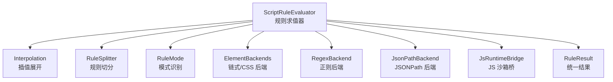
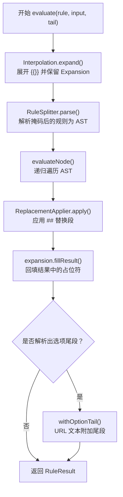
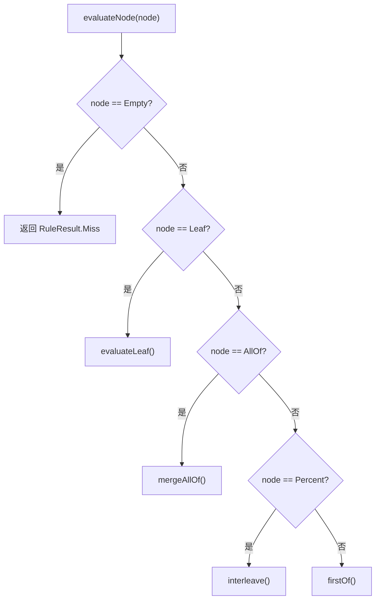
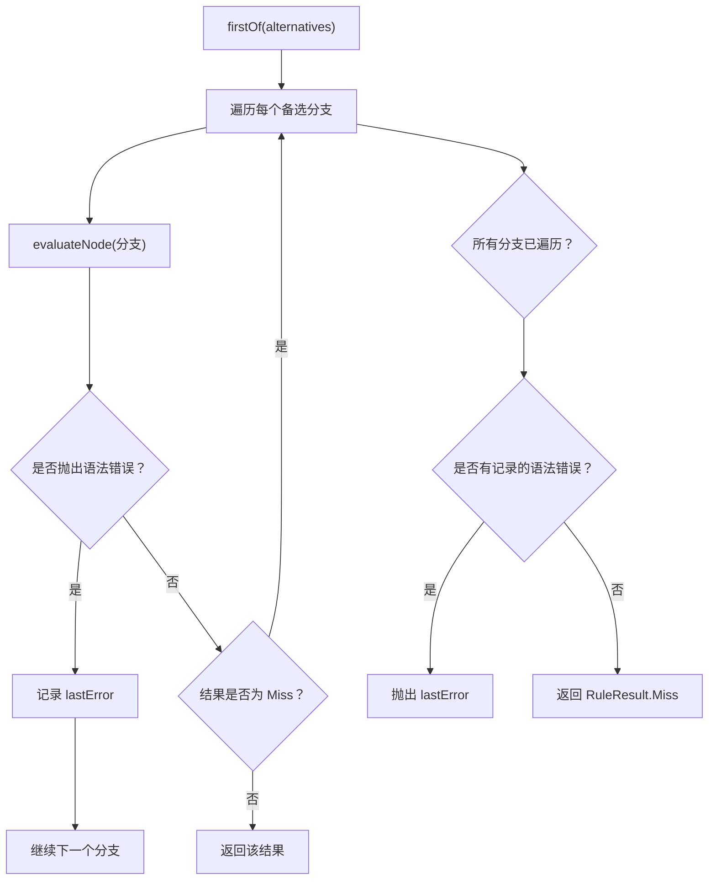
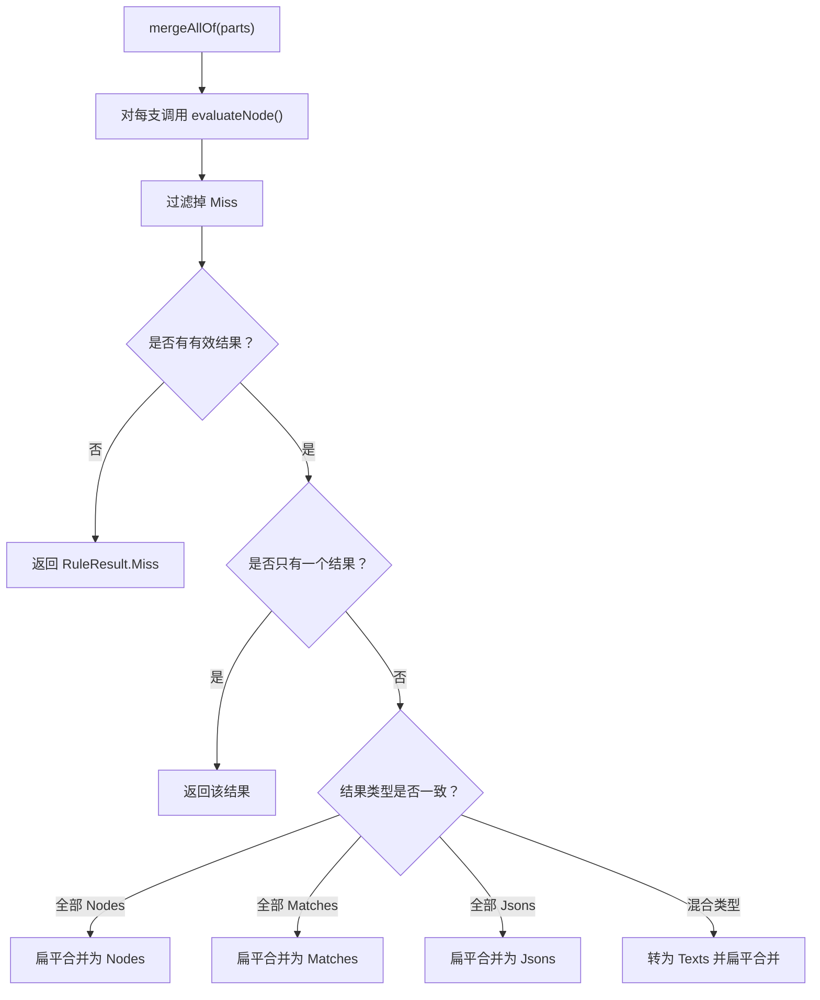
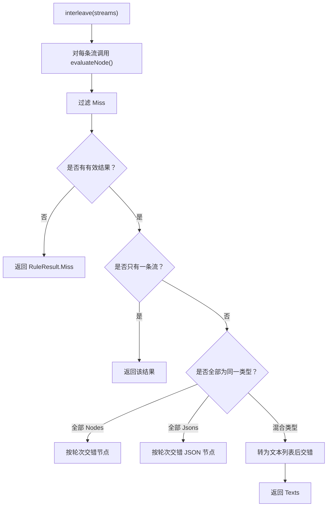
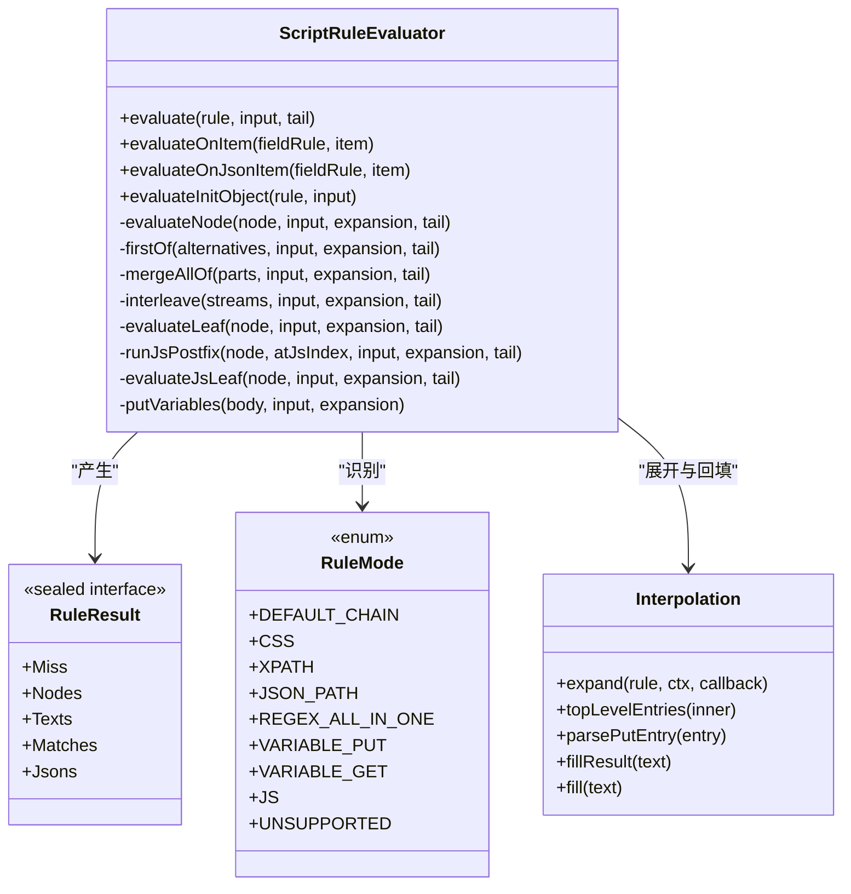

# 规则求值器 ScriptRuleEvaluator

<cite>
**本文引用的文件**   
- [ScriptRuleEvaluator.kt](file://lib_book_source/src/main/java/com/ebook/source/script/ScriptRuleEvaluator.kt)
- [RuleResult.kt](file://lib_book_source/src/main/java/com/ebook/source/script/RuleResult.kt)
- [RuleMode.kt](file://lib_book_source/src/main/java/com/ebook/source/script/RuleMode.kt)
- [Interpolation.kt](file://lib_book_source/src/main/java/com/ebook/source/script/Interpolation.kt)
</cite>

## 目录
1. [简介](#简介)
2. [项目结构定位](#项目结构定位)
3. [核心组件](#核心组件)
4. [架构总览](#架构总览)
5. [详细组件分析](#详细组件分析)
6. [依赖关系分析](#依赖关系分析)
7. [性能考量](#性能考量)
8. [故障排查指南](#故障排查指南)
9. [结论](#结论)

## 简介
`ScriptRuleEvaluator` 是书源脚本规则求值器的核心入口，负责把一条规则字符串转换成最终结果。它不直接实现 HTML、CSS、正则或 JSONPath 的取数逻辑，而是把“规则解析与组合”和“具体模式取值”分层：解析由 `RuleSplitter`、`RuleMode` 等完成，具体取值交给后端（链式/CSS、正则、JSONPath、JS）。

该类的职责可以概括为七步：
1. 展开插值 `{{}}`；
2. 对掩码后的规则文本做切分；
3. 递归遍历 AST 节点；
4. 按 `||`、`&&`、`%%` 组合规则求值；
5. 应用替换段 `##`；
6. 回填占位符；
7. 对 URL 类字段附加选项尾段。

同时，它严格区分“语法错误”和“未取到值”：前者抛出类型化异常，后者返回 `RuleResult.Miss`。这是为了保证短路求值和“支去重”行为正确，避免把“规则写错”伪装成“这条信息不存在”。

## 项目结构定位
`ScriptRuleEvaluator` 位于 `lib_book_source/src/main/java/com/ebook/source/script` 包中，属于书源脚本执行层的关键类。它与以下模块协同工作：
- `Interpolation`：处理 `{{}}` 插值展开与占位符回填；
- `RuleSplitter`：把规则字符串解析成 AST；
- `RuleMode`：识别 JS、CSS、链式、正则、JSONPath、变量等模式；
- `ElementBackends`：HTML 链式与 CSS 选择器取值；
- `RegexBackend`：AllInOne 正则取值；
- `JsonPathBackend`：JSONPath 取值；
- `SandboxScriptJs` / `JsRuntimeBridge`：JS 引擎桥接；
- `RuleResult`：统一的结果类型。

**图表来源**
- [ScriptRuleEvaluator.kt:1-100](file://lib_book_source/src/main/java/com/ebook/source/script/ScriptRuleEvaluator.kt#L1-L100)
- [RuleMode.kt:1-118](file://lib_book_source/src/main/java/com/ebook/source/script/RuleMode.kt#L1-L118)
- [RuleResult.kt:1-119](file://lib_book_source/src/main/java/com/ebook/source/script/RuleResult.kt#L1-L119)

**章节来源**
- [ScriptRuleEvaluator.kt:1-100](file://lib_book_source/src/main/java/com/ebook/source/script/ScriptRuleEvaluator.kt#L1-L100)

## 核心组件
`ScriptRuleEvaluator` 的核心方法可以分为三类：

| 方法 | 职责 | 输入 | 输出 |
|---|---|---|---|
| `evaluate()` | 主入口：展开、切分、求值、替换、回填、附加尾段 | 规则字符串、上下文值、选项尾段策略 | `RuleResult` |
| `evaluateOnItem()` | 正则 AllInOne 的逐条目字段求值 | 字段规则、正则捕获组行 | `RuleResult.Texts` |
| `evaluateOnJsonItem()` | JSONPath 的逐条目字段求值 | 字段规则、JSON 节点 | `RuleResult` |
| `evaluateInitObject()` | JS 初始化对象分支 | 规则、输入值 | 键值映射或空 |
| `evaluateNode()` | AST 节点分发器 | AST 节点、输入、展开状态、尾部策略 | `RuleResult` |
| `firstOf()` | `||` 短路求值 | 备选节点列表 | `RuleResult` 或抛语法错误 |
| `mergeAllOf()` | `&&` 合并求值 | 子节点列表 | `RuleResult` |
| `interleave()` | `%%` 三路交错求值 | 流节点列表 | `RuleResult` |
| `evaluateLeaf()` | 单支叶子节点求值 | 叶子节点、输入、展开状态、尾部策略 | `RuleResult` |

**章节来源**
- [ScriptRuleEvaluator.kt:1-367](file://lib_book_source/src/main/java/com/ebook/source/script/ScriptRuleEvaluator.kt#L1-L367)
- [RuleResult.kt:1-119](file://lib_book_source/src/main/java/com/ebook/source/script/RuleResult.kt#L1-L119)

## 架构总览
下图展示 `evaluate()` 的完整求值流程。它先做插值展开，再切分规则，再递归求值 AST，最后应用替换并回填：

**图表来源**
- [ScriptRuleEvaluator.kt:15-60](file://lib_book_source/src/main/java/com/ebook/source/script/ScriptRuleEvaluator.kt#L15-L60)

### 主入口 `evaluate()` 的流程要点
1. **插值展开阶段**：调用 `Interpolation.expand()`，把 `{{...}}` 替换为占位符，并把原始片段存入 `Expansion`。内层的 `@@<规则>` 会递归求值，但内层规则使用 `Expansion.EMPTY`，因为它是独立的一条规则，其文本不含外层占位符。
2. **规则切分阶段**：对掩码后的规则调用 `RuleSplitter.parse()`，得到 AST 根节点、替换段信息和原始规则串。
3. **AST 求值阶段**：调用 `evaluateNode()`，根据节点类型分发到 `Empty`、`Leaf`、`AllOf`、`FirstOf`、`Percent`。
4. **替换阶段**：把求值结果传给 `ReplacementApplier.apply()`，应用 `##` 替换段。
5. **回填阶段**：用 `Expansion.fillResult()` 把结果中的占位符还原为原始值。
6. **选项尾段阶段**：如果解析出 URL 选项尾段，则对文本结果追加尾段；否则直接返回。

**章节来源**
- [ScriptRuleEvaluator.kt:15-60](file://lib_book_source/src/main/java/com/ebook/source/script/ScriptRuleEvaluator.kt#L15-L60)

## 详细组件分析

### AST 节点遍历策略
`evaluateNode()` 是 AST 的分发中心，对应五种节点类型：

| 节点类型 | 语义 | 处理逻辑 |
|---|---|---|
| `Empty` | 空规则 | 返回 `RuleResult.Miss` |
| `Leaf` | 单支规则 | 交给 `evaluateLeaf()` 按模式取值 |
| `AllOf` | `&&` 组合 | 交给 `mergeAllOf()` 合并结果 |
| `Percent` | `%%` 组合 | 交给 `interleave()` 交错结果 |
| `FirstOf` | `||` 组合 | 交给 `firstOf()` 短路取第一个有值的分支 |

**图表来源**
- [ScriptRuleEvaluator.kt:100-120](file://lib_book_source/src/main/java/com/ebook/source/script/ScriptRuleEvaluator.kt#L100-L120)

#### Empty 节点
空节点表示“没有规则”，语义是“未取到值”，而不是“空列表”。这保证 `||` 能继续尝试下一支。

#### Leaf 节点
叶子节点代表一个具体模式的规则。`evaluateLeaf()` 会根据 `RuleMode` 分发到不同后端：
- JS：通过 JS 桥执行；
- XPath：抛出 `UnsupportedRuleFeatureException`；
- 不支持模式：抛出 `UnsupportedRuleFeatureException`；
- JSONPath：调用 `JsonPathBackend.evaluate()`；
- 正则 AllInOne：调用 `RegexBackend.evaluate()`；
- CSS：调用 `ElementBackends.evaluateCss()`；
- 默认链式：调用 `ElementBackends.evaluateChain()`；
- 变量写入：调用 `putVariables()`；
- 变量读取：从 `EvalContext.variables` 取字符串值。

对于链式或 CSS 模式，还会检测末尾是否带 `@js:` 后位处理；若存在，则先按原模式求值，再把结果交给 JS 后段处理。

**章节来源**
- [ScriptRuleEvaluator.kt:120-230](file://lib_book_source/src/main/java/com/ebook/source/script/ScriptRuleEvaluator.kt#L120-L230)
- [RuleMode.kt:1-118](file://lib_book_source/src/main/java/com/ebook/source/script/RuleMode.kt#L1-L118)

### `firstOf()` 短路求值与错误传播
`firstOf()` 对应 `||` 运算符，目标是“取第一个非空的分支”。它的核心语义如下：

1. 依次求值每个备选分支；
2. 遇到 `RuleSyntaxException` 时，记录最后一个语法错误并继续下一个分支；
3. 如果某个分支返回非 `Miss` 的结果，立即短路返回；
4. 所有分支都失败时，如果有语法错误，抛出最后一个语法错误；
5. 如果没有语法错误，返回 `RuleResult.Miss`。

这种设计的关键在于：**语法错误不会立刻中断整个 `||` 链**，但也不会被静默吞掉——当所有分支都失败时，最后一个语法错误会被重新抛出。这样既支持“兜底规则”，又避免把“规则写错”伪装成“这条信息不存在”。

**图表来源**
- [ScriptRuleEvaluator.kt:120-145](file://lib_book_source/src/main/java/com/ebook/source/script/ScriptRuleEvaluator.kt#L120-L145)

**章节来源**
- [ScriptRuleEvaluator.kt:120-145](file://lib_book_source/src/main/java/com/ebook/source/script/ScriptRuleEvaluator.kt#L120-L145)

### `mergeAllOf()` 结果合并策略
`mergeAllOf()` 对应 `&&` 运算符，语义是“每支都求值后合并”。空支跳过，只有全部为空时才返回 `Miss`。

合并规则按结果类型分类：

| 情况 | 合并策略 |
|---|---|
| 无有效结果 | 返回 `RuleResult.Miss` |
| 只有一个有效结果 | 直接返回该结果 |
| 多个 `Nodes` | 扁平化为单个 `Nodes` |
| 多个 `Matches` | 扁平化为单个 `Matches` |
| 多个 `Jsons` | 扁平化为单个 `Jsons`，保留 JSON 节点形态 |
| 多种类型混合 | 转为 `Texts`，扁平合并为多值文本列表 |

重要设计点：
- `Jsons` 在合并时仍保持节点形态，因为 JSON 条目可能作为后续子字段的上下文；
- `Texts` 不拼接成单串，而是扁平合并为多值列表；单值收敛由字段级 `firstText()` 负责；
- 混合类型一律落为 `Texts`，因为其他结果类型没有通用的跨类型合并语义。

**图表来源**
- [ScriptRuleEvaluator.kt:145-180](file://lib_book_source/src/main/java/com/ebook/source/script/ScriptRuleEvaluator.kt#L145-L180)

**章节来源**
- [ScriptRuleEvaluator.kt:145-180](file://lib_book_source/src/main/java/com/ebook/source/script/ScriptRuleEvaluator.kt#L145-L180)

### `interleave()` 三路交错算法
`interleave()` 对应 `%%` 运算符，语义是“按轮次交错取数”。例如三路结果分别为 `[a1,a2,a3]`、`[b1]`、`[c1,c2]`，交错后为 `[a1,b1,c1,a2,a3,c2]`。短路走完不再补位。

算法步骤：
1. 对每条流调用 `evaluateNode()`；
2. 过滤掉 `Miss`；
3. 若无有效结果，返回 `Miss`；
4. 若只有一条有效结果，直接返回；
5. 若所有结果都是 `Nodes`，按轮次交错节点列表；
6. 若所有结果都是 `Jsons`，按轮次交错 JSON 节点列表；
7. 否则把所有结果转为文本列表后交错。

**图表来源**
- [ScriptRuleEvaluator.kt:180-210](file://lib_book_source/src/main/java/com/ebook/source/script/ScriptRuleEvaluator.kt#L180-L210)

#### 内部交错算法 `interleaved()`
`interleaved()` 是通用三路取数实现：
- 计算最大长度；
- 外层循环按轮次索引；
- 内层循环按流顺序取当前轮次的元素；
- 跳过短流超出的索引。

时间复杂度为 O(N)，空间复杂度为 O(M)，其中 N 是总元素数，M 是输出列表容量。

**章节来源**
- [ScriptRuleEvaluator.kt:180-210](file://lib_book_source/src/main/java/com/ebook/source/script/ScriptRuleEvaluator.kt#L180-L210)

### `evaluateOnItem()` 与 `evaluateOnJsonItem()` 的条目级求值
这两个方法是针对“列表字段解出的单个条目”进行字段级求值的对称接口。

#### `evaluateOnItem()`
用于正则 AllInOne 场景。规则如 `chapterName: "$2"`、`chapterUrl: "$1"`。
- 如果字段规则能被解析为 `$n` 形式的组引用，则直接从正则捕获组中提取；
- 否则按普通规则求值，输入为 `RuleValue.Texts`，内容为条目的整段匹配；
- 组引用在这里就地取组，不进链式后端，避免把 `$2` 误当作属性名处理。

#### `evaluateOnJsonItem()`
用于 JSONPath 场景。JSON 列表字段解出的每个条目作为上下文，按子字段规则取值。
- 输入为 `RuleValue.Json(item)`；
- 不需要组引用判定，因为 JSON 条目本身就是规则上下文；
- 与 `evaluateOnItem()` 对称，分别对应正则条目和 JSON 条目两种数据源。

**章节来源**
- [ScriptRuleEvaluator.kt:60-100](file://lib_book_source/src/main/java/com/ebook/source/script/ScriptRuleEvaluator.kt#L60-L100)

### JS 后缀与内联 JS 的处理
`ScriptRuleEvaluator` 支持三种 JS 形态：

| 形态 | 说明 |
|---|---|
| `@js:` 前缀纯 JS | 整段代码进内核，`result` 绑定为本次输入 |
| `<js>` 分隔符 | 前链产物作为 `result`，完成值再交给后链 |
| 串首 `<js>` 且无闭合 | 整条规则写成 JS，等价于 `@js:` |

对于链式/CSS 载荷中的 `@js:` 后位：
1. 前段按原模式求值；
2. 结果种子化；
3. 如果前段为空，直接回落 `Miss`，让 `||` 试下一支；
4. JS 执行失败时捕获异常并回落 `Miss`；
5. 根据反序标志决定是否反转结果。

对于内联 `<js>`：
1. 切分前链、JS 代码、后链；
2. 前链为空时使用原始输入作为 `result`；
3. 前链非空时按链式后端求值并种子化；
4. JS 完成后若存在后链，以后链再次处理 JS 产物；
5. 反序标志辖整条规则的最终产物。

**章节来源**
- [ScriptRuleEvaluator.kt:200-367](file://lib_book_source/src/main/java/com/ebook/source/script/ScriptRuleEvaluator.kt#L200-L367)

## 依赖关系分析

**图表来源**
- [ScriptRuleEvaluator.kt:1-367](file://lib_book_source/src/main/java/com/ebook/source/script/ScriptRuleEvaluator.kt#L1-L367)
- [RuleResult.kt:1-119](file://lib_book_source/src/main/java/com/ebook/source/script/RuleResult.kt#L1-L119)
- [RuleMode.kt:1-118](file://lib_book_source/src/main/java/com/ebook/source/script/RuleMode.kt#L1-L118)
- [Interpolation.kt](file://lib_book_source/src/main/java/com/ebook/source/script/Interpolation.kt)

### 耦合与内聚分析
- `ScriptRuleEvaluator` 与 `RuleResult` 紧密耦合，是所有求值结果的统一出口；
- 与 `RuleMode` 的耦合体现在叶子节点的模式分发；
- 与 `Interpolation` 的耦合体现在插值展开和占位符回填；
- 与后端模块（链式、CSS、正则、JSONPath、JS）松耦合，通过静态方法调用；
- 错误处理内聚在 `firstOf()` 和 `evaluateLeaf()`，保证语法错误与运行时错误可区分。

**章节来源**
- [ScriptRuleEvaluator.kt:1-367](file://lib_book_source/src/main/java/com/ebook/source/script/ScriptRuleEvaluator.kt#L1-L367)

## 性能考量
1. **插值展开只做一次**：`Interpolation.expand()` 在 `evaluate()` 开头执行，避免重复扫描规则字符串；
2. **短路求值优先**：`firstOf()` 遇到第一个非 `Miss` 结果就返回，避免不必要的后端调用；
3. **空支跳过**：`mergeAllOf()` 过滤掉 `Miss` 后再合并，减少无效计算；
4. **交错算法线性复杂度**：`interleaved()` 按轮次扫描，时间复杂度 O(N)，适合多路结果合并；
5. **结果类型判断提前**：`interleave()` 和 `mergeAllOf()` 先判断结果类型，避免不必要的类型转换；
6. **JS 异常降级**：`@js:` 后位执行失败时捕获异常并回落 `Miss`，避免阻塞整个求值链；
7. **文本列表复用**：`toTextList()` 提供统一的节点转文本逻辑，避免各调用方重复实现。

优化建议：
- 对于大量规则批量求值，可考虑缓存热点规则的 AST；
- 对于高频调用的 JS 片段，可考虑编译期预解析；
- 对于超长规则链，应优先使用 `||` 短路而非 `&&` 全量合并；
- 对于多路交错，尽量保证各路结果类型一致，避免文本转换开销。

[本节为通用性能讨论，不直接分析具体代码行]

## 故障排查指南

### 常见错误类型与定位方式

| 错误类型 | 触发条件 | 表现 | 排查建议 |
|---|---|---|---|
| `RuleSyntaxException` | 规则语法错误，如未知模式、非法占位符、`@put:` 无法解析 | 抛出异常，消息中包含规则原文 | 检查规则语法是否正确，确认占位符是否匹配 |
| `UnsupportedRuleFeatureException` | 使用未实现功能，如 XPath | 抛出异常，消息包含功能名称 | 改用支持的规则模式 |
| `JsEvaluationPendingException` | JS 桥未装配 | 抛出异常，消息包含 JS 代码 | 检查 JS 沙箱环境是否就绪 |
| `JsExecutionFailedException` | JS 运行时错误 | 在 `@js:` 后位被捕获并回落 `Miss`，在其他位置向上抛出 | 检查 JS 代码逻辑，确认 `result` 是否为空 |
| `RuleResult.Miss` | 未取到值 | 返回空结果，不影响 `||` 短路 | 检查选择器、正则、JSONPath 是否能命中目标 |

### 语法错误与未取到值的区别
- **语法错误**：规则本身写错了，例如使用了未实现的 XPath、错误的 `@put:` 语法、非法占位符。这类错误应该抛出异常，让用户知道规则有问题；
- **未取到值**：规则语法正确，但当前文档或 JSON 中没有匹配的内容。这类情况返回 `RuleResult.Miss`，允许 `||` 继续尝试兜底规则。

关键原则：**不要把语法错误伪装成未取到值**。否则用户会看到“这条信息不存在”，而不知道是规则写错了。

### 调试技巧
1. 先用最小规则测试，逐步增加复杂度；
2. 使用 `||` 兜底规则观察哪一支成功；
3. 检查 `##` 替换段是否影响了最终 URL；
4. 确认 `{{}}` 占位符是否在展开后被正确回填；
5. 对于 JS 规则，先在 JS 环境中验证逻辑，再放入书源规则；
6. 对于多路交错，分别打印各路结果，确认交错顺序是否符合预期。

**章节来源**
- [ScriptRuleEvaluator.kt:120-145](file://lib_book_source/src/main/java/com/ebook/source/script/ScriptRuleEvaluator.kt#L120-L145)
- [ScriptRuleEvaluator.kt:200-367](file://lib_book_source/src/main/java/com/ebook/source/script/ScriptRuleEvaluator.kt#L200-L367)

## 结论
`ScriptRuleEvaluator` 是一个结构清晰、职责单一的规则求值器。它把插值展开、规则切分、AST 遍历、模式求值、替换应用、结果回填和 URL 尾段附加等步骤明确分离，并通过 `RuleResult` 统一输出。

其设计亮点包括：
- 严格区分语法错误与未取到值；
- 支持 `||` 短路、`&&` 合并、`%%` 交错的组合语义；
- 支持链式、CSS、正则、JSONPath、JS 等多种取值模式；
- 支持 `{{}}` 插值和 `##` 替换的组合用法；
- 支持 URL 选项尾段回填；
- 支持 JS 后置处理和内联 JS 分隔符。

在实际使用中，应优先利用短路求值优化性能，合理使用组合规则表达复杂逻辑，并在调试时充分利用错误消息定位问题根源。

[本节为总结性内容，不直接分析具体代码行]