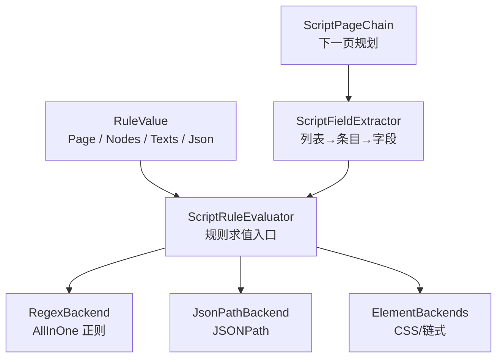
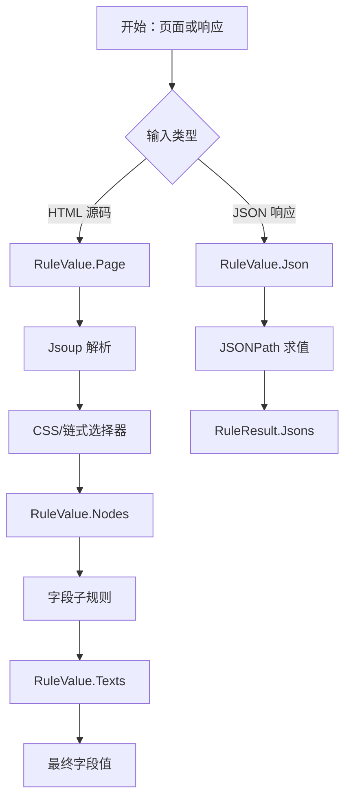
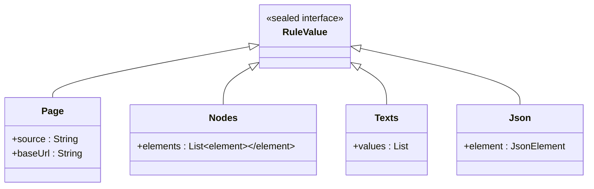
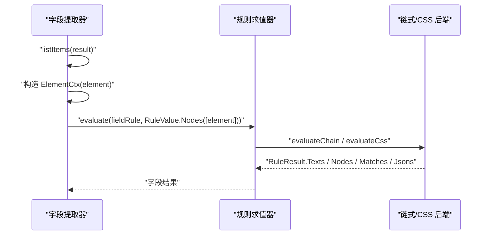
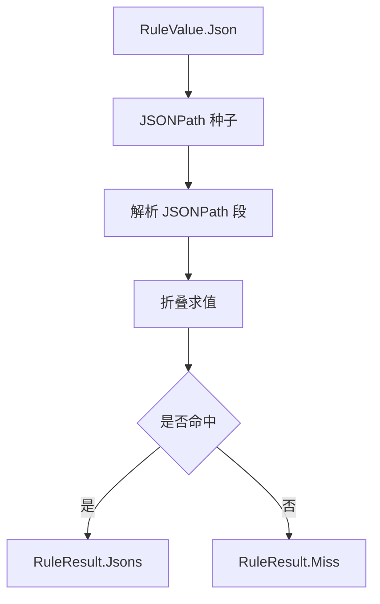
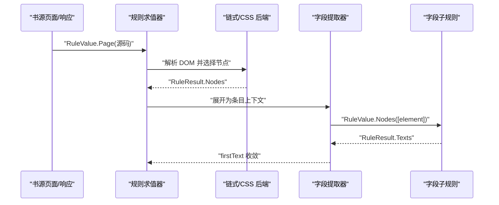
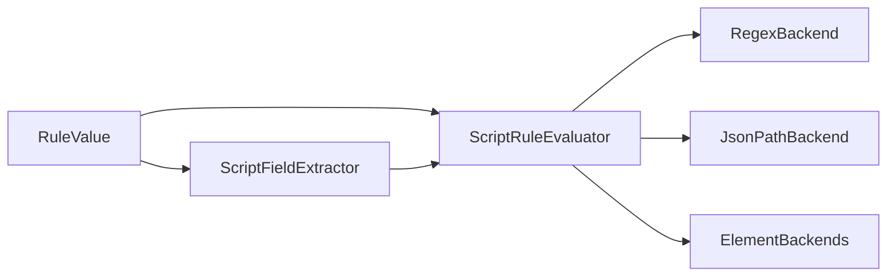

# 规则输入模型 RuleValue

<cite>
**本文引用的文件**   
- [RuleValue.kt](file://lib_book_source/src/main/java/com/ebook/source/script/RuleValue.kt)
- [ScriptFieldExtractor.kt](file://lib_book_source/src/main/java/com/ebook/source/script/ScriptFieldExtractor.kt)
- [ScriptPageChain.kt](file://lib_book_source/src/main/java/com/ebook/source/script/ScriptPageChain.kt)
- [ScriptRuleEvaluator.kt](file://lib_book_source/src/main/java/com/ebook/source/script/ScriptRuleEvaluator.kt)
- [JsonPathBackend.kt](file://lib_book_source/src/main/java/com/ebook/source/script/JsonPathBackend.kt)
- [RegexBackend.kt](file://lib_book_source/src/main/java/com/ebook/source/script/RegexBackend.kt)
- [ChainLink.kt](file://lib_book_source/src/main/java/com/ebook/source/script/ChainLink.kt)
</cite>

## 目录
1. [引言](#引言)
2. [项目结构定位](#项目结构定位)
3. [核心组件](#核心组件)
4. [架构总览](#架构总览)
5. [详细组件分析](#详细组件分析)
6. [依赖关系分析](#依赖关系分析)
7. [性能与复杂度](#性能与复杂度)
8. [排错指南](#排错指南)
9. [结论](#结论)

## 引言
本文件面向“规则输入模型 RuleValue”，系统化说明四种输入类型 Page、Nodes、Texts、Json 的语义差异、数据结构、适用场景，以及在“页面解析 → 节点提取 → 文本处理”完整链路中的流转路径。文档重点解释：

- 为什么这四种输入是互不隐式转换的封闭集合；
- 每种类型在正则 AllInOne、CSS/链式规则、JSONPath、字段子规则等不同模式下的角色；
- 从整页源码到列表条目、再到字段值的典型数据流；
- 如何在不同规则模式下选择正确的输入类型，并提供可操作的创建与使用示例。

## 项目结构定位
RuleValue 位于 `lib_book_source` 模块的脚本求值子系统，是书源规则引擎的输入边界。它被以下关键组件消费：

- 规则求值器 ScriptRuleEvaluator：负责把一条规则串切分为树并分发到各后端；
- 字段提取器 ScriptFieldExtractor：负责把列表结果展开为条目上下文，再对每个字段执行取值；
- 翻页规划器 ScriptPageChain：负责 nextTocUrl / nextContentUrl 的下一页候选；
- 后端实现 RegexBackend（AllInOne 正则）、JsonPathBackend（JSONPath）、ElementBackends（CSS/链式）等。

**图表来源**  
- [RuleValue.kt:1-31](file://lib_book_source/src/main/java/com/ebook/source/script/RuleValue.kt#L1-L31)  
- [ScriptRuleEvaluator.kt:1-60](file://lib_book_source/src/main/java/com/ebook/source/script/ScriptRuleEvaluator.kt#L1-L60)  
- [ScriptFieldExtractor.kt:1-40](file://lib_book_source/src/main/java/com/ebook/source/script/ScriptFieldExtractor.kt#L1-L40)  
- [ScriptPageChain.kt:1-30](file://lib_book_source/src/main/java/com/ebook/source/script/ScriptPageChain.kt#L1-L30)

**章节来源**  
- [RuleValue.kt:1-31](file://lib_book_source/src/main/java/com/ebook/source/script/RuleValue.kt#L1-L31)  
- [ScriptRuleEvaluator.kt:1-60](file://lib_book_source/src/main/java/com/ebook/source/script/ScriptRuleEvaluator.kt#L1-L60)  
- [ScriptFieldExtractor.kt:1-40](file://lib_book_source/src/main/java/com/ebook/source/script/ScriptFieldExtractor.kt#L1-L40)  
- [ScriptPageChain.kt:1-30](file://lib_book_source/src/main/java/com/ebook/source/script/ScriptPageChain.kt#L1-L30)

## 核心组件
RuleValue 是一个内部密封接口，定义一次规则求值的输入形态。它的四个数据类分别对应四类上下文：

| 输入类型 | 数据结构 | 语义 | 典型用途 |
|---|---|---|---|
| Page | 源码字符串 + baseUrl | 整页 HTML 源码，带基础地址 | AllInOne 正则、从页面起步的链式/CSS 规则 |
| Nodes | Jsoup Element 列表 | 当前节点集 | 列表字段解出的每条记录的子规则 |
| Texts | 文本字符串列表 | 上一步已取到的字段值集合 | 字段值处理、AllInOne 条目内的文本上下文 |
| Json | JSON 节点 | 当前 JSON 文档 | JSONPath 模式的上下文 |

关键点：

- 这四个类型构成一个**封闭集合**。
- 它们之间**不做隐式转换**，因为 Page 与 Nodes 的起点语义不同：前者需要先用 Jsoup 解析，后者已经是列表内元素；Texts 表示“已经取出的文本”，而 Json 表示结构化响应体。
- 如果允许隐式转换，“列表字段”和“字段内的子规则”两条分层路径会混成一条，违反规格中对两类上下文的明确区分。

**章节来源**  
- [RuleValue.kt:1-31](file://lib_book_source/src/main/java/com/ebook/source/script/RuleValue.kt#L1-L31)

## 架构总览
RuleValue 不是孤立的数据类，而是贯穿“页面 → 节点 → 文本 → JSON”的规则求值管道。整体流程如下：

**图表来源**  
- [ScriptRuleEvaluator.kt:1-60](file://lib_book_source/src/main/java/com/ebook/source/script/ScriptRuleEvaluator.kt#L1-L60)  
- [JsonPathBackend.kt:1-60](file://lib_book_source/src/main/java/com/ebook/source/script/JsonPathBackend.kt#L1-L60)  
- [ScriptFieldExtractor.kt:40-90](file://lib_book_source/src/main/java/com/ebook/source/script/ScriptFieldExtractor.kt#L40-L90)

## 详细组件分析

### RuleValue 类型语义与约束
RuleValue 的注释明确表达设计意图：一次规则求值的输入来自“当前上下文文档或文本”。四种类型分别承载：

- Page：整页源码，用于 AllInOne 正则和从页面开始的链式/CSS 规则；
- Nodes：当前节点集，用于列表字段中每条记录；
- Texts：上一阶段取到的文本集合；
- Json：JSONPath 模式的当前 JSON 文档。

该设计刻意避免隐式类型转换，以维持“页面级规则”和“节点级规则”的分层语义。

**图表来源**  
- [RuleValue.kt:1-31](file://lib_book_source/src/main/java/com/ebook/source/script/RuleValue.kt#L1-L31)

**章节来源**  
- [RuleValue.kt:1-31](file://lib_book_source/src/main/java/com/ebook/source/script/RuleValue.kt#L1-L31)

### Page：整页源码输入
Page 携带两个字段：

- source：原始 HTML 源码字符串；
- baseUrl：相对链接解析的基础地址。

适用场景：

- AllInOne 正则模式：整个页面被视为一段长文本；
- “从页面起步”的链式/CSS 规则：先由 ElementBackends 解析出 DOM，再按选择器提取节点；
- URL 选项尾段落位：baseUrl 参与 TocPageUrl.join 等逻辑。

注意事项：

- Page 本身不直接等于 DOM；链式/CSS 后端会在求值过程中进行解析；
- baseUrl 通常与 URL 字段、翻页 URL 相关，但 RuleValue 本身只承担“传入输入”的职责。

**章节来源**  
- [RuleValue.kt:1-31](file://lib_book_source/src/main/java/com/ebook/source/script/RuleValue.kt#L1-L31)

### Nodes：当前节点集输入
Nodes 包裹一个 Element 列表，代表“当前上下文中的一组 DOM 节点”。

适用场景：

- 列表字段（如 bookList、chapterList、explore）解出的每一条记录；
- 字段子规则：对某个条目再取 name、author、url 等字段时，输入是这条记录对应的 Element；
- 单值字段与 URL 字段：字段提取器会把单个 Element 包装为 Nodes 列表传给求值器。

关键行为：

- 列表字段的结果必须能映射到 ItemContext.ElementCtx，即每条记录是一个 Element；
- 若结果是 Miss，则展开为零条目，而不是抛错。

**图表来源**  
- [ScriptFieldExtractor.kt:1-40](file://lib_book_source/src/main/java/com/ebook/source/script/ScriptFieldExtractor.kt#L1-L40)  
- [ScriptFieldExtractor.kt:40-90](file://lib_book_source/src/main/java/com/ebook/source/script/ScriptFieldExtractor.kt#L40-L90)

**章节来源**  
- [ScriptFieldExtractor.kt:1-40](file://lib_book_source/src/main/java/com/ebook/source/script/ScriptFieldExtractor.kt#L1-L40)  
- [ScriptFieldExtractor.kt:40-90](file://lib_book_source/src/main/java/com/ebook/source/script/ScriptFieldExtractor.kt#L40-L90)

### Texts：文本集合输入
Texts 包裹一个字符串列表，表示“已经取到的字段值集合”。

适用场景：

- AllInOne 正则造出的条目内部：字段规则以整段匹配文本为输入；
- 列表字段展开后的 TextCtx：当列表结果是纯文本时，逐条作为文本上下文；
- 字段求值收敛：多个分支合并后，最终由 firstText 取第一个非空值。

重要语义：

- Texts 不等于 Node；它是已经“取出来的文本”；
- 在 `&&` 合并时，Texts 会被扁平化，而不是拼接成单串；
- 在 JS 种子化时，Texts 会作为 result 绑定的文本集合。

**章节来源**  
- [ScriptRuleEvaluator.kt:201-367](file://lib_book_source/src/main/java/com/ebook/source/script/ScriptRuleEvaluator.kt#L201-L367)  
- [ScriptFieldExtractor.kt:40-90](file://lib_book_source/src/main/java/com/ebook/source/script/ScriptFieldExtractor.kt#L40-L90)

### Json：JSON 文档输入
Json 包裹一个 JsonElement，代表 JSONPath 模式的当前文档。

适用场景：

- JSONPath 模式（`$...`）；
- JSON 列表字段展开后的子字段规则；
- 响应体本身就是结构化数据时的字段取值。

关键约束：

- JSONPath 后端要求输入是 Json、能从 Page.source 或 Texts.first 解析出的 JSON；
- 如果输入是 Nodes，JSONPath 会抛出“作用于 HTML 节点上下文”的类型化异常；
- JSON 解析失败视为“未取到值”，而不是“规则语法错误”。

**图表来源**  
- [JsonPathBackend.kt:1-60](file://lib_book_source/src/main/java/com/ebook/source/script/JsonPathBackend.kt#L1-L60)

**章节来源**  
- [JsonPathBackend.kt:1-60](file://lib_book_source/src/main/java/com/ebook/source/script/JsonPathBackend.kt#L1-L60)

### 为什么不做隐式类型转换
RuleValue 的设计明确禁止 Page、Nodes、Texts、Json 之间的隐式转换，原因包括：

1. **起点语义不同**  
   - Page 是原始 HTML 源码，需要先解析；  
   - Nodes 已经是 DOM 节点集合；  
   - Texts 是已经取出的文本；  
   - Json 是结构化 JSON。

2. **路径分层不同**  
   - 列表字段解出的是节点或文本；  
   - 字段内的子规则是在“当前上下文”上继续取值；  
   - 如果允许隐式转换，这两条路径会混在一起。

3. **错误语义更清晰**  
   - 把错误的输入交给不支持的后端时，应抛出类型化异常；  
   - 不应静默转换为另一种类型，导致“写错的规则看起来像没取到值”。

**章节来源**  
- [RuleValue.kt:1-31](file://lib_book_source/src/main/java/com/ebook/source/script/RuleValue.kt#L1-L31)  
- [JsonPathBackend.kt:1-60](file://lib_book_source/src/main/java/com/ebook/source/script/JsonPathBackend.kt#L1-L60)

### 不同类型输入的创建与使用示例

#### 示例一：从页面源码启动链式/CSS 规则
适合场景：需要从整页中提取列表或详情字段。

- 创建输入：使用 RuleValue.Page(source, baseUrl)。
- 使用方式：调用规则求值器的 evaluate，并传入 Page。
- 后端行为：链式/CSS 后端会解析 HTML 并返回节点或文本。

参考路径：

- [RuleValue.kt:1-31](file://lib_book_source/src/main/java/com/ebook/source/script/RuleValue.kt#L1-L31)
- [ScriptRuleEvaluator.kt:1-60](file://lib_book_source/src/main/java/com/ebook/source/script/ScriptRuleEvaluator.kt#L1-L60)

#### 示例二：从列表节点启动字段子规则
适合场景：bookList/chapterList/explore 已经解出若干条目，现在对每个条目取 name、author、url。

- 创建输入：使用 RuleValue.Nodes(listOf(element))。
- 使用方式：字段提取器对每个 ItemContext.ElementCtx 调用 evaluate。
- 返回值：通常是 RuleResult.Texts，再由 firstText 收敛为单值。

参考路径：

- [ScriptFieldExtractor.kt:40-90](file://lib_book_source/src/main/java/com/ebook/source/script/ScriptFieldExtractor.kt#L40-L90)

#### 示例三：对已取文本继续处理
适合场景：AllInOne 正则造出条目后，用 `$n` 引用或链式规则对整段文本做二次提取。

- 创建输入：使用 RuleValue.Texts(listOf(matchedText))。
- 使用方式：evaluateOnItem 或字段提取器把条目文本包装为 Texts。
- 注意：Texts 在 `&&` 合并时是扁平列表，不会自动拼接。

参考路径：

- [ScriptRuleEvaluator.kt:201-367](file://lib_book_source/src/main/java/com/ebook/source/script/ScriptRuleEvaluator.kt#L201-L367)

#### 示例四：对 JSON 响应使用 JSONPath
适合场景：API 型站点返回 JSON，字段通过 JSONPath 抽取。

- 创建输入：使用 RuleValue.Json(jsonElement)。
- 备选输入：如果只有字符串，可从 Page.source 或 Texts.first 经 lenient 解析得到 JsonElement。
- 注意：Nodes 不能直接传给 JSONPath；否则会抛类型化异常。

参考路径：

- [JsonPathBackend.kt:1-60](file://lib_book_source/src/main/java/com/ebook/source/script/JsonPathBackend.kt#L1-L60)

#### 示例五：下一页 URL 计算
适合场景：nextTocUrl 或 nextContentUrl 是当前页规则求值的结果。

- 输入：当前页的 RuleValue（可能是 Page 或 Texts）。
- 行为：翻页规划器根据数组形态或字符串规则生成下一个 URL。
- URL 落位：会剥离选项尾段、拼接绝对地址、再回附尾段。

参考路径：

- [ScriptPageChain.kt:1-57](file://lib_book_source/src/main/java/com/ebook/source/script/ScriptPageChain.kt#L1-L57)

### 从页面到节点的完整数据流
下面用一个典型搜索/详情链路展示 RuleValue 的流转：

**图表来源**  
- [ScriptRuleEvaluator.kt:1-60](file://lib_book_source/src/main/java/com/ebook/source/script/ScriptRuleEvaluator.kt#L1-L60)  
- [ScriptFieldExtractor.kt:40-90](file://lib_book_source/src/main/java/com/ebook/source/script/ScriptFieldExtractor.kt#L40-L90)

## 依赖关系分析
RuleValue 的依赖方向比较单向：它是输入模型，被求值器和字段提取器消费，但不反向依赖业务层。

**图表来源**  
- [RuleValue.kt:1-31](file://lib_book_source/src/main/java/com/ebook/source/script/RuleValue.kt#L1-L31)  
- [ScriptRuleEvaluator.kt:1-60](file://lib_book_source/src/main/java/com/ebook/source/script/ScriptRuleEvaluator.kt#L1-L60)  
- [ScriptFieldExtractor.kt:1-40](file://lib_book_source/src/main/java/com/ebook/source/script/ScriptFieldExtractor.kt#L1-L40)

**章节来源**  
- [RuleValue.kt:1-31](file://lib_book_source/src/main/java/com/ebook/source/script/RuleValue.kt#L1-L31)  
- [ScriptRuleEvaluator.kt:1-60](file://lib_book_source/src/main/java/com/ebook/source/script/ScriptRuleEvaluator.kt#L1-L60)  
- [ScriptFieldExtractor.kt:1-40](file://lib_book_source/src/main/java/com/ebook/source/script/ScriptFieldExtractor.kt#L1-L40)

## 性能与复杂度
RuleValue 本身是轻量数据容器，主要成本来自其消费方：

- Page：HTML 解析和 DOM 选择发生在链式/CSS 后端；
- Nodes：节点遍历和选择器匹配的成本取决于元素数量；
- Texts：文本列表的扁平合并、交错合并、首值收敛都是线性操作；
- Json：JSONPath 解析和折叠求值成本取决于路径长度和节点规模。

优化建议：

- 尽量让规则尽早收敛为需要的类型，避免无谓的跨类型转换；
- 列表字段展开时应优先判断 Miss，避免空迭代；
- JSONPath 路径应尽量简洁，避免不必要的递归通配；
- 翻页 URL 去重应基于“剥掉选项尾段”后的访问键，避免重复请求。

[本节为通用性能建议，不直接分析具体代码片段]

## 排错指南
常见 RuleValue 相关问题及定位思路：

| 问题 | 可能原因 | 排查方向 |
|---|---|---|
| JSONPath 报“作用于 HTML 节点上下文” | 把 RuleValue.Nodes 传给 JSONPath | 检查字段提取器是否正确把 JSON 结果转为 JsonCtx |
| AllInOne 报“作用于 JSON 上下文” | 对 JSON 上下文使用正则 AllInOne | 改用 JSONPath 或先把 JSON 转文本后再决定语义 |
| 字段结果为空 | 输入类型与规则模式不匹配 | 确认 Page/Nodes/Texts/Json 是否与规则模式一致 |
| 下一页重复请求或提前停止 | 访问键未剥选项尾段 | 检查翻页规划器的 visitKeyOf 逻辑 |
| `&&` 合并结果不符合预期 | Texts 被扁平而不是拼接 | 确认是否需要 firstText 收敛 |

**章节来源**  
- [JsonPathBackend.kt:1-60](file://lib_book_source/src/main/java/com/ebook/source/script/JsonPathBackend.kt#L1-L60)  
- [RegexBackend.kt:1-75](file://lib_book_source/src/main/java/com/ebook/source/script/RegexBackend.kt#L1-L75)  
- [ScriptPageChain.kt:1-57](file://lib_book_source/src/main/java/com/ebook/source/script/ScriptPageChain.kt#L1-L57)  
- [ScriptRuleEvaluator.kt:201-367](file://lib_book_source/src/main/java/com/ebook/source/script/ScriptRuleEvaluator.kt#L201-L367)

## 结论
RuleValue 是书源规则系统的输入边界，通过 Page、Nodes、Texts、Json 四种封闭类型，明确区分了“整页源码”“节点集”“文本集”“JSON 文档”的语义。这种设计避免了隐式类型转换带来的歧义，使“页面级规则”和“字段子规则”保持分层清晰，也使错误更容易被类型化识别。

在实际使用中，应根据规则模式选择输入：

- 整页正则或页面级选择器：使用 Page；
- 列表条目子规则：使用 Nodes；
- 已取出文本的处理：使用 Texts；
- JSONPath 模式：使用 Json。

正确选择 RuleValue 类型，是保证规则可预测、可调试、可扩展的关键前提。