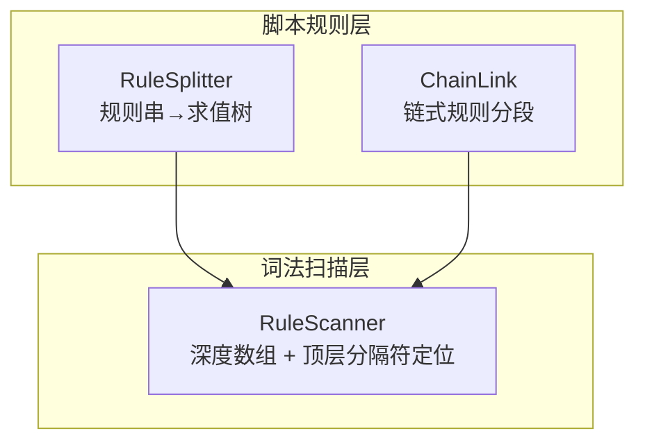
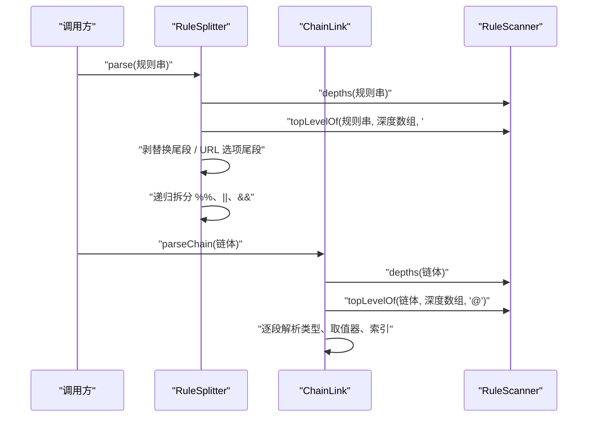
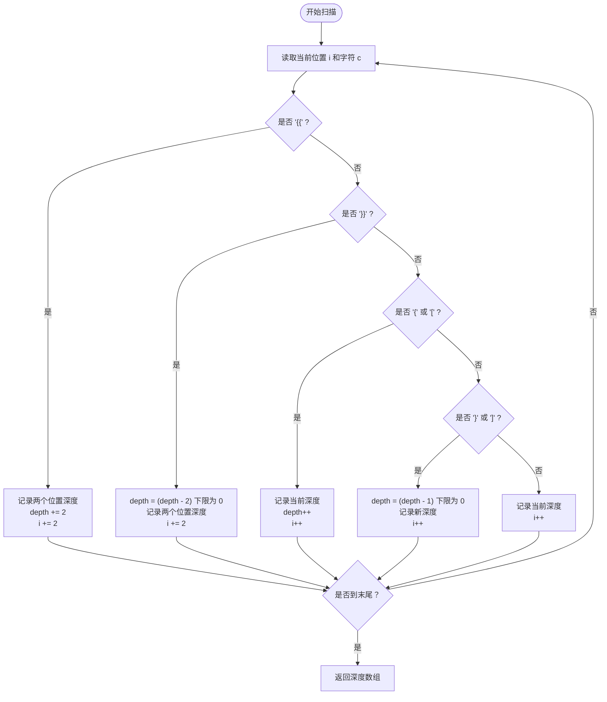
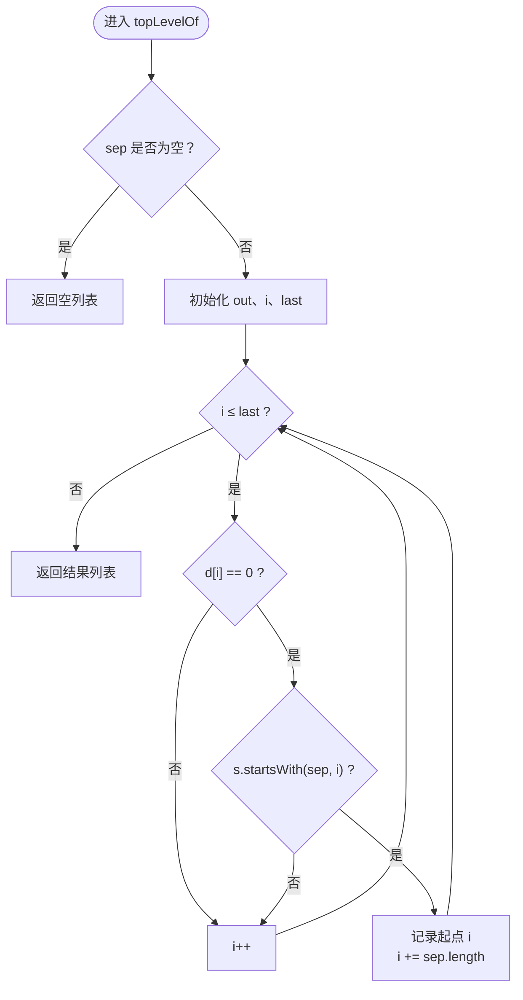
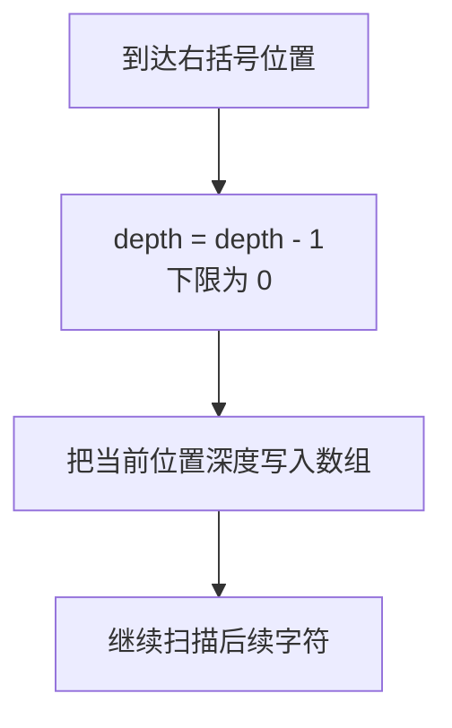
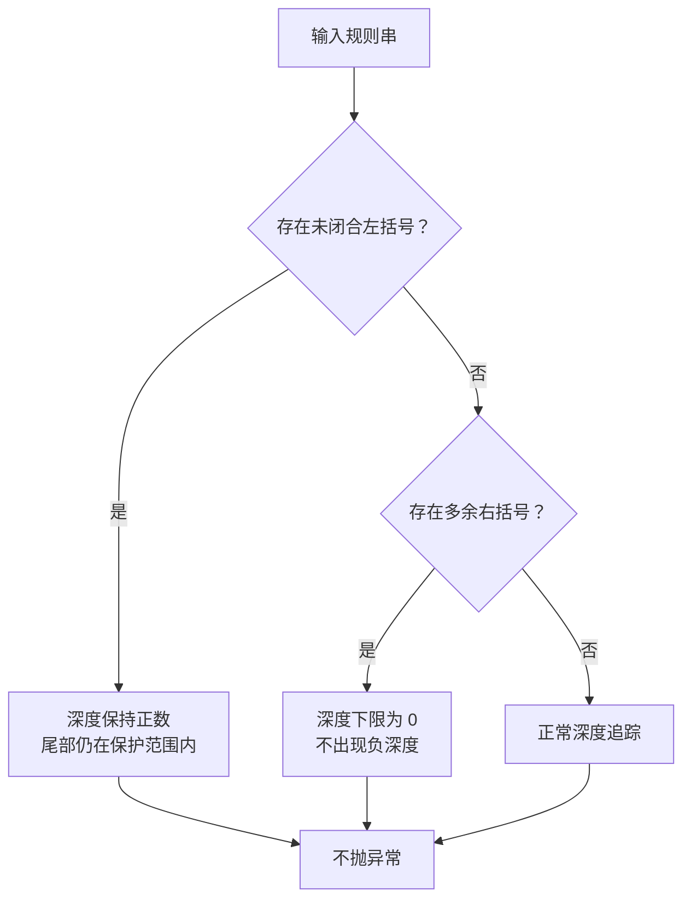
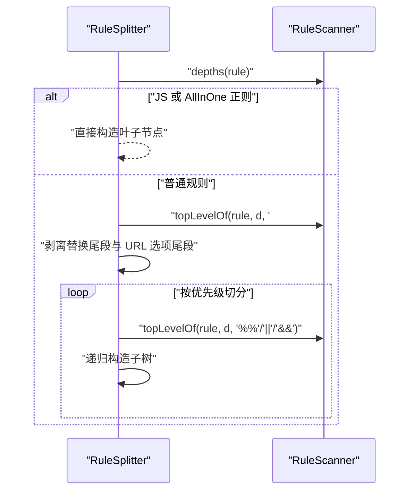
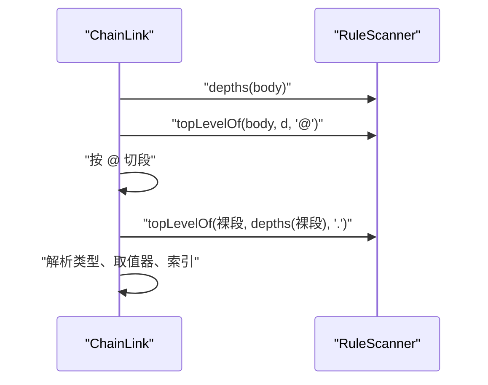

# 词法扫描器 RuleScanner

<cite>
**本文引用的文件**   
- [RuleScanner.kt](file://lib_book_source/src/main/java/com/ebook/source/script/RuleScanner.kt)
- [RuleScannerTest.kt](file://lib_book_source/src/test/java/com/ebook/source/script/RuleScannerTest.kt)
- [RuleSplitter.kt](file://lib_book_source/src/main/java/com/ebook/source/script/RuleSplitter.kt)
- [ChainLink.kt](file://lib_book_source/src/main/java/com/ebook/source/script/ChainLink.kt)
</cite>

## 目录
1. [引言](#引言)
2. [项目结构定位](#项目结构定位)
3. [核心组件总览](#核心组件总览)
4. [架构与调用关系](#架构与调用关系)
5. [深度计算算法 depths()](#深度计算算法-depths)
6. [顶层分隔符查找 topLevelOf()](#顶层分隔符查找-toplevelof)
7. [括号符号的深度变化规则](#括号符号的深度变化规则)
8. [转义与边界情况处理](#转义与边界情况处理)
9. [复杂嵌套扫描示例](#复杂嵌套扫描示例)
10. [在规则解析流程中的作用](#在规则解析流程中的作用)
11. [性能特征](#性能特征)
12. [故障排查指南](#故障排查指南)
13. [结论](#结论)

## 引言

RuleScanner 是书源脚本规则引擎中的「可切分位置」扫描器，负责为后续的规则切分提供两条基础能力：

1. 计算每个字符位置的括号深度数组。
2. 在该深度数组上，按指定分隔符查找所有「零层」出现位置。

它解决的核心问题是：规则字符串中可能包含大量字面量分隔符，例如 URL 选项值 `{"body":"a&&b"}`、正则表达式、CSS 属性选择器、模板插值 `{{$.id}}` 等。如果直接对分隔符做简单分割，会把一条合法规则腰斩；更危险的是，错误切分会解出语义无关的内容，这类问题比直接崩溃更难排查。因此，RuleScanner 不关心分隔符的语法含义，只关心「这些分隔符是否处于受保护的括号层级之外」。

该组件本身非常精简，但它是整个规则解析链路中最容易被误用、也最关键的底层设施之一。

## 项目结构定位

RuleScanner 位于 `lib_book_source` 模块的脚本规则实现包下，属于纯 Java/Kotlin 实现的内部工具对象。它被规则切分层和链式取值层共同复用：

- **RuleSplitter**：将完整规则串拆成求值树，并剥离 `##` 替换尾段与 URL 选项尾段。
- **ChainLink**：将链式规则体按 `@` 切分为若干链段，再解析每段的类型、名称、索引或取值器。

**图示来源**
- [RuleSplitter.kt:1-117](file://lib_book_source/src/main/java/com/ebook/source/script/RuleSplitter.kt#L1-L117)
- [ChainLink.kt:1-200](file://lib_book_source/src/main/java/com/ebook/source/script/ChainLink.kt#L1-L200)
- [RuleScanner.kt:1-78](file://lib_book_source/src/main/java/com/ebook/source/script/RuleScanner.kt#L1-L78)

**章节来源**
- [RuleScanner.kt:1-78](file://lib_book_source/src/main/java/com/ebook/source/script/RuleScanner.kt#L1-L78)
- [RuleSplitter.kt:1-117](file://lib_book_source/src/main/java/com/ebook/source/script/RuleSplitter.kt#L1-L117)
- [ChainLink.kt:1-200](file://lib_book_source/src/main/java/com/ebook/source/script/ChainLink.kt#L1-L200)

## 核心组件总览

RuleScanner 是一个内部对象，对外暴露两个静态方法：

| 方法 | 输入 | 输出 | 职责 |
|---|---|---|---|
| `depths(s)` | 原始规则字符串 | 长度等于字符串长度的整数数组 | 计算每个字符位置的括号深度 |
| `topLevelOf(s, d, sep, from, to)` | 原始字符串、深度数组、分隔符、区间起点终点 | 分隔符起点的有序列表 | 在指定区间内查找所有位于零层的分隔符 |

这两个方法都遵循同一个设计原则：**先算深度，再查分隔符**。RuleScanner 不负责判断某个分隔符是否有语义，也不负责构建抽象语法树；它只提供「这个分隔符是否处于零层」这一事实。

**章节来源**
- [RuleScanner.kt:1-78](file://lib_book_source/src/main/java/com/ebook/source/script/RuleScanner.kt#L1-L78)

## 架构与调用关系

RuleScanner 在整个规则解析流程中的调用关系如下：

**图示来源**
- [RuleSplitter.kt:19-117](file://lib_book_source/src/main/java/com/ebook/source/script/RuleSplitter.kt#L19-L117)
- [ChainLink.kt:37-88](file://lib_book_source/src/main/java/com/ebook/source/script/ChainLink.kt#L37-L88)
- [RuleScanner.kt:19-78](file://lib_book_source/src/main/java/com/ebook/source/script/RuleScanner.kt#L19-L78)

**章节来源**
- [RuleSplitter.kt:19-117](file://lib_book_source/src/main/java/com/ebook/source/script/RuleSplitter.kt#L19-L117)
- [ChainLink.kt:37-88](file://lib_book_source/src/main/java/com/ebook/source/script/ChainLink.kt#L37-L88)
- [RuleScanner.kt:19-78](file://lib_book_source/src/main/java/com/ebook/source/script/RuleScanner.kt#L19-L78)

## 深度计算算法 depths()

### 算法目标

`depths()` 的任务是生成一个与输入字符串等长的整数数组，其中第 `i` 个元素表示「包住第 `i` 个字符的括号层数」。这里的「包住」不是语法意义上的完全匹配，而是基于字符计数的深度状态机：

- 普通字符深度为当前深度。
- 左括号使后续字符进入更高深度。
- 右括号使后续字符进入更低深度。
- 双花括号 `{{` 和 `}}` 各计两层。
- 单花括号 `{`、`}` 和方括号 `[`、`]` 各计一层。
- 深度始终非负。
- 残缺规则不会抛出异常。

### 扫描过程

算法使用一次线性扫描，维护三个变量：

| 变量 | 含义 |
|---|---|
| `d` | 返回的深度数组 |
| `depth` | 当前尚未写入下一个字符时的活跃深度 |
| `i` | 扫描指针 |

每次迭代读取当前字符 `c` 和下一个字符 `n`，按以下优先级分支：

1. 遇到 `{{`：把两个位置的深度设为当前深度，然后深度加 2。
2. 遇到 `}}`：深度先减 2（不低于 0），再把两个位置的深度设为新深度。
3. 遇到 `{` 或 `[`：记录当前深度后深度加 1。
4. 遇到 `}` 或 `]`：深度先减 1（不低于 0），再记录新深度。
5. 其他字符：直接记录当前深度。

**图示来源**
- [RuleScanner.kt:19-48](file://lib_book_source/src/main/java/com/ebook/source/script/RuleScanner.kt#L19-L48)

### 时间复杂度与空间复杂度

- 时间复杂度：O(n)，其中 n 是字符串长度。每个字符最多被访问一次，双花括号分支虽然每次移动两个位置，但整体仍是线性扫描。
- 空间复杂度：O(n)，用于存储结果深度数组。中间状态只使用了固定数量的局部变量。

这是扫描器的关键性能特征：深度数组只需计算一次，并被 RuleSplitter 和 ChainLink 共用；即使后续递归切分多次调用 `topLevelOf`，也不会重复扫描原串。

**章节来源**
- [RuleScanner.kt:19-48](file://lib_book_source/src/main/java/com/ebook/source/script/RuleScanner.kt#L19-L48)
- [RuleScannerTest.kt:13-25](file://lib_book_source/src/test/java/com/ebook/source/script/RuleScannerTest.kt#L13-L25)

## 顶层分隔符查找 topLevelOf()

### 方法签名与参数

`topLevelOf` 接收五个参数：

| 参数 | 类型 | 默认值 | 含义 |
|---|---|---|---|
| `s` | 字符串 | 无 | 原始规则字符串 |
| `d` | 整数数组 | 无 | 由 `depths()` 计算的深度数组 |
| `sep` | 字符串 | 无 | 要查找的分隔符 |
| `from` | 整数 | 0 | 搜索区间起点 |
| `to` | 整数 | s.length | 搜索区间终点 |

返回值是所有满足条件的分隔符起点下标列表，顺序与它们在字符串中出现的顺序一致。

### 查找逻辑

该方法并不重新扫描字符串来识别括号；它依赖已经传入的深度数组 `d`。具体逻辑如下：

1. 如果分隔符为空，直接返回空列表。
2. 初始化结果列表和扫描指针。
3. 循环条件为 `i <= last`，其中 `last = to - sep.length`。这确保不会越界尝试匹配超出 `to` 的分隔符。
4. 对于每个位置：
   - 检查 `d[i] == 0`。
   - 同时检查从 `i` 开始的子串是否以 `sep` 开头。
   - 两者都满足时，把 `i` 加入结果，并跳过整个分隔符长度。
   - 否则只前进一个字符。

**图示来源**
- [RuleScanner.kt:51-78](file://lib_book_source/src/main/java/com/ebook/source/script/RuleScanner.kt#L51-L78)

### 为什么需要深度数组

`topLevelOf()` 本身不做括号匹配。它只是「信任」深度数组，并假设：

- 深度为 0 的位置处于外层。
- 深度大于 0 的位置处于某种括号保护范围内。

这种设计把「状态维护」和「查询决策」解耦：`depths()` 负责维护括号状态，`topLevelOf()` 负责按策略消费状态。这样可以让不同分隔符共享同一份深度计算结果。

**章节来源**
- [RuleScanner.kt:51-78](file://lib_book_source/src/main/java/com/ebook/source/script/RuleScanner.kt#L51-L78)
- [RuleScannerTest.kt:40-78](file://lib_book_source/src/test/java/com/ebook/source/script/RuleScannerTest.kt#L40-L78)

## 括号符号的深度变化规则

### 双花括号 `{{` 与 `}}`

双花括号被视为强标记，每一端计两层深度。这意味着：

- `{{` 会使深度增加 2。
- `}}` 会使深度减少 2。
- 双花括号内部的字符深度至少为 2。
- 双花括号开括号本身仍处于外层深度。
- 双花括号闭括号采用「先减后记」，因此闭括号本身落在外层深度。

这种设计让 `{{` 与 `{` 能在同一套计数体系中共存：`{{` 不是两个独立的一层左花括号，而是一对双层边界。

### 单花括号 `{` 与 `}`

单花括号按常规左括号/右括号处理：

- `{` 记录当前深度后深度加 1。
- `}` 深度先减 1，再记录新深度。
- 未闭合时深度保持正值。
- 多余右括号会被限制为非负。

### 方括号 `[` 与 `]`

方括号与单花括号对称：

- `[` 记录当前深度后深度加 1。
- `]` 深度先减 1，再记录新深度。
- 常用于 CSS 属性选择器、索引范围等场景。

### 右括号「先减后记」的含义

右括号分支先更新深度，再写入数组。以 `]` 为例：

1. 遇到 `]` 时，当前深度可能是 1。
2. 先将深度减到 0。
3. 把 `]` 所在位置的深度写为 0。
4. 后续字符继续以 0 作为外层深度。

这样做的原因是：右括号本身不应被视为「深水区内部字符」。换句话说，`a[{b}]c` 中的 `]` 应该落回外层，而不是留在内层。测试用例明确断言这一点：

- 开括号位置仍在外层。
- 闭合符位置因「先减后记」回到外层。
- 闭合符之后的字符自然也是外层。

**图示来源**
- [RuleScanner.kt:31-40](file://lib_book_source/src/main/java/com/ebook/source/script/RuleScanner.kt#L31-L40)
- [RuleScannerTest.kt:27-39](file://lib_book_source/src/test/java/com/ebook/source/script/RuleScannerTest.kt#L27-L39)

**章节来源**
- [RuleScanner.kt:19-48](file://lib_book_source/src/main/java/com/ebook/source/script/RuleScanner.kt#L19-L48)
- [RuleScannerTest.kt:27-39](file://lib_book_source/src/test/java/com/ebook/source/script/RuleScannerTest.kt#L27-L39)

## 转义与边界情况处理

### 转义行为

RuleScanner 没有独立的转义机制。它不识别反斜杠转义、引号转义或其他语言级转义语法。它的「转义」语义完全由括号深度表达：

- 如果分隔符出现在 `{{}}`、`{}` 或 `[]` 内部，它会被视为受保护内容。
- 如果分隔符不在这些括号内部，它会被当作可切分位置。
- 圆括号 `()` 不计入括号深度，因此不会被深度机制保护。这也是文档明确说明的设计约束。

这意味着像 `text.下一章` 中的点、或者 CSS 选择器中的点，只有在它们没有被 `{{}}`、`{}` 或 `[]` 包裹时才可能被按点切分。

### 边界情况

代码显式覆盖以下边界：

| 边界情况 | 处理方式 |
|---|---|
| 空字符串 | `depths()` 返回长度为 0 的数组；`topLevelOf()` 在空分隔符或空输入时返回空列表 |
| 比分隔符短的字符串 | `topLevelOf()` 不会越界匹配 |
| 未闭合的左括号 | 深度保持正值，尾部不被误判为外层 |
| 多余的右括号 | 通过「下限为 0」保证深度非负 |
| 残缺规则串 | 扫描器不抛异常，返回尽可能合理的深度数组 |
| 重叠分隔符如 `###` | 命中后跳过整个分隔符长度，避免把收尾部分当成多个重叠起点 |
| 自定义区间 | `from` 和 `to` 支持限定搜索范围 |

**图示来源**
- [RuleScanner.kt:19-48](file://lib_book_source/src/main/java/com/ebook/source/script/RuleScanner.kt#L19-L48)
- [RuleScannerTest.kt:31-47](file://lib_book_source/src/test/java/com/ebook/source/script/RuleScannerTest.kt#L31-L47)

**章节来源**
- [RuleScanner.kt:19-78](file://lib_book_source/src/main/java/com/ebook/source/script/RuleScanner.kt#L19-L78)
- [RuleScannerTest.kt:13-47](file://lib_book_source/src/test/java/com/ebook/source/script/RuleScannerTest.kt#L13-L47)

## 复杂嵌套扫描示例

### 示例一：普通字符

输入：`abcd`

深度数组：`[0, 0, 0, 0]`

解释：没有任何括号，所有字符深度均为 0。

### 示例二：双花括号

输入：`{{ab}}`

深度数组：`[0, 0, 2, 2, 0, 0]`

解释：

- 前两个 `0` 是 `{{` 的两个开括号位置。
- 中间两个 `2` 是双花括号内部。
- 最后两个 `0` 是 `}}` 的两个闭括号位置，因为闭括号先减深度再记录，所以落回外层。

### 示例三：花括号与方括号嵌套

输入：`a[{b}]c`

深度数组：`[0, 0, 1, 2, 1, 0, 0]`

解释：

- `a`：外层。
- `[`：开方括号本身在外层，深度仍为 0。
- `{`：开花括号本身在外层，深度仍为 0。
- `b`：被 `{` 和 `[` 双重保护，深度为 2。
- `}`：先减到 1，记录为 1。
- `]`：先减到 0，记录为 0。
- `c`：外层。

### 示例四：顶层分隔符查找

输入：`a&&b,{c&&d}&&e`

深度数组大致为：`[0, 0, 0, 0, 0, 0, 1, 1, 1, 1, 1, 1, 1, 1, 0, 0, 0]`。

查找 `&&` 的顶层位置：

- 下标 1 处的 `&&` 在深度 0，命中。
- 花括号内的 `&&` 在深度大于 0，不命中。
- 末尾 `&&` 在深度 0，命中。

结果应为第一个 `&&` 和下标最大的那个 `&&`。

### 示例五：区间限制

输入：`a||b||c`

若调用 `topLevelOf(s, d, "||", 0, 5)`，只考虑前 5 个字符，因此只会命中第一个 `||`。

**章节来源**
- [RuleScannerTest.kt:13-78](file://lib_book_source/src/test/java/com/ebook/source/script/RuleScannerTest.kt#L13-L78)

## 在规则解析流程中的作用

RuleScanner 并不是规则解析的入口，而是被上层解析器调用的基础设施。它在两个主要路径中被使用。

### 规则切分路径

RuleSplitter 的解析流程如下：

1. 调用 `RuleScanner.depths(rule)` 计算整条规则串的括号深度。
2. 如果是 JS 或 AllInOne 正则模式，整条规则作为叶子节点，不再进行组合切分。
3. 使用 `RuleScanner.topLevelOf(..., "##")` 找到第一个替换尾段分隔符。
4. 在 `##` 之前的取值段内剥离 URL 选项尾段。
5. 对取值段递归按 `%%`、`||`、`&&` 切分。
6. 每个递归分支继续使用同一份深度数组和原始下标，避免子串切片导致的索引错位。

**图示来源**
- [RuleSplitter.kt:19-117](file://lib_book_source/src/main/java/com/ebook/source/script/RuleSplitter.kt#L19-L117)
- [RuleScanner.kt:19-78](file://lib_book_source/src/main/java/com/ebook/source/script/RuleScanner.kt#L19-L78)

### 链式取值路径

ChainLink 在解析链式规则体时：

1. 调用 `RuleScanner.depths(body)`。
2. 调用 `RuleScanner.topLevelOf(body, d, "@")`，按深度 0 的 `@` 切分链段。
3. 对每个片段判断它是取值器、类型关键字、裸 CSS 选择器还是索引。
4. 对裸 CSS 段再次调用 `RuleScanner.topLevelOf(text, RuleScanner.depths(text), ".")`，按最后一个顶层点拆分上游位置序号。

**图示来源**
- [ChainLink.kt:37-88](file://lib_book_source/src/main/java/com/ebook/source/script/ChainLink.kt#L37-L88)
- [ChainLink.kt:153-199](file://lib_book_source/src/main/java/com/ebook/source/script/ChainLink.kt#L153-L199)

**章节来源**
- [RuleSplitter.kt:19-117](file://lib_book_source/src/main/java/com/ebook/source/script/RuleSplitter.kt#L19-L117)
- [ChainLink.kt:37-88](file://lib_book_source/src/main/java/com/ebook/source/script/ChainLink.kt#L37-L88)
- [ChainLink.kt:153-199](file://lib_book_source/src/main/java/com/ebook/source/script/ChainLink.kt#L153-L199)

## 性能特征

RuleScanner 的性能特征适合高频调用：

1. **单次线性扫描**：`depths()` 只遍历字符串一次。
2. **固定额外空间**：除结果数组外，只使用常数个局部变量。
3. **可复用深度数组**：RuleSplitter 和 ChainLink 都复用同一份深度数组，避免重复计算。
4. **顶层查找也是线性扫描**：`topLevelOf()` 在给定区间内只比较深度和字符串前缀。
5. **避免子串重算**：RuleSplitter 递归时传递原始下标区间，而不是对子串重新计算深度，从而降低索引错位风险和重复扫描成本。

潜在优化方向包括：

- 如果某些调用方只需要少量分隔符命中，可以考虑惰性扫描，而不是每次都完整扫描区间。
- 对极短分隔符可以提前做字符首字节判断，减少 `startsWith` 调用。
- 对超长规则串可考虑分块扫描，但当前实现已足够简洁且不易出错。

目前实现的优势在于正确性优先、结构简单、易于验证。

**章节来源**
- [RuleScanner.kt:19-78](file://lib_book_source/src/main/java/com/ebook/source/script/RuleScanner.kt#L19-L78)
- [RuleSplitter.kt:19-117](file://lib_book_source/src/main/java/com/ebook/source/script/RuleSplitter.kt#L19-L117)

## 故障排查指南

### 症状：规则被意外腰斩

可能原因：

- 分隔符确实位于深度 0。
- 分隔符出现在未被 `{{}}`、`{}` 或 `[]` 包裹的位置。
- 圆括号 `()` 不会被深度机制保护，因此其中的分隔符可能被视为顶层。

排查步骤：

1. 打印 `RuleScanner.depths(rule)`。
2. 检查可疑分隔符位置对应的深度是否为 0。
3. 确认该分隔符是否真的应被保护。
4. 如需保护，将其放入 `{{}}`、`{}` 或 `[]` 中。

### 症状：右括号附近深度异常

可能原因：

- 误以为右括号本身会停留在内层。
- 实际实现采用「先减后记」，右括号位置属于外层。

排查步骤：

1. 检查右括号前后字符的深度。
2. 确认右括号位置是否符合「外层」预期。
3. 参考测试用例中关于 `a[{b}]c` 的深度断言。

### 症状：残缺规则导致解析不一致

可能原因：

- 规则缺少闭合括号。
- 规则有多余右括号。

排查建议：

- RuleScanner 不会抛异常，而是保证深度非负。
- 未闭合左括号会让尾部保持正深度。
- 多余右括号会被截断到 0。
- 修复规则语法比调整扫描器更可靠。

### 症状：URL 选项尾段与替换尾段混淆

可能原因：

- 忘记 `##` 之后才进入替换段。
- 忘记 URL 选项尾段只在 `##` 之前的取值段内剥离。

排查建议：

- 查看 RuleSplitter 中 `beforeReplacement` 与 `tailCut` 的关系。
- 确认 `,{...}` 是否位于取值段末尾。
- 确认 `##$##,{...}` 中第二个 `##` 后的逗号是否属于替换文本。

**章节来源**
- [RuleScanner.kt:19-78](file://lib_book_source/src/main/java/com/ebook/source/script/RuleScanner.kt#L19-L78)
- [RuleScannerTest.kt:27-78](file://lib_book_source/src/test/java/com/ebook/source/script/RuleScannerTest.kt#L27-L78)
- [RuleSplitter.kt:19-117](file://lib_book_source/src/main/java/com/ebook/source/script/RuleSplitter.kt#L19-L117)

## 结论

RuleScanner 是一个职责单一但影响广泛的底层组件。它通过一次线性扫描计算括号深度，并在深度数组上查找顶层分隔符，从而让规则引擎能够区分「字面量中的分隔符」和「真正用于切分的分隔符」。

其核心设计要点包括：

- 双花括号计两层，单花括号和方括号计一层。
- 右括号采用「先减后记」，使闭合符本身落在外层。
- 深度恒非负，允许残缺规则输入而不抛异常。
- 圆括号不参与深度计数，因此不由该组件保护。
- 深度计算与分隔符查找分离，便于复用和扩展。
- 上层解析器通过原始下标和深度数组协作，避免子串切片带来的索引错位。

理解 RuleScanner 的关键是把它看作「括号保护域检测器」，而不是完整的语法分析器。只要记住「先算深度、再看分隔符」，就能准确判断任意规则字符串中哪些分隔符参与切分、哪些分隔符属于字面量。