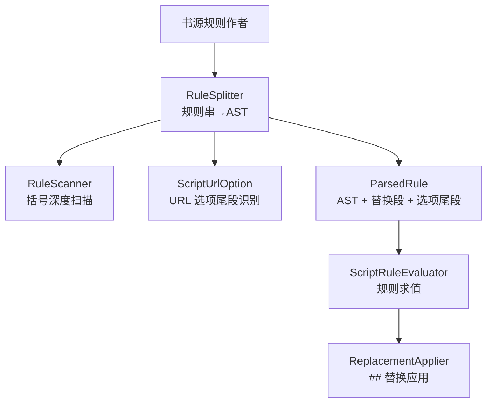
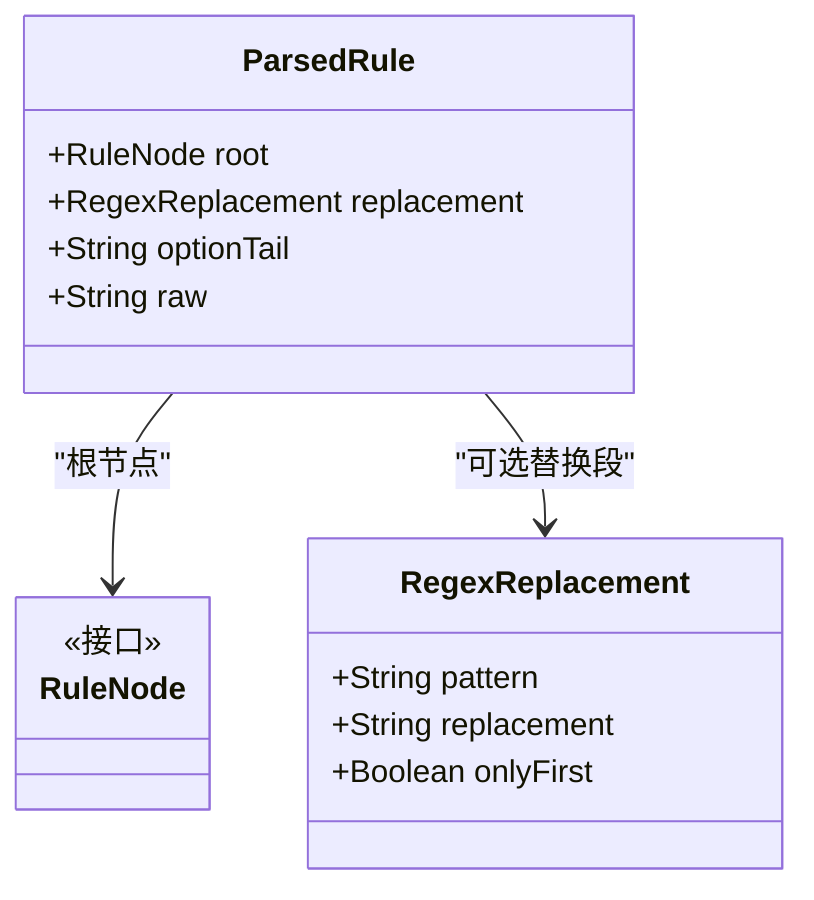
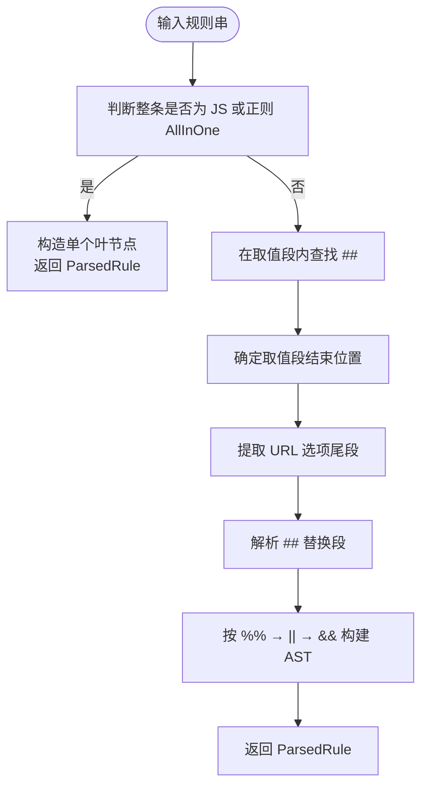
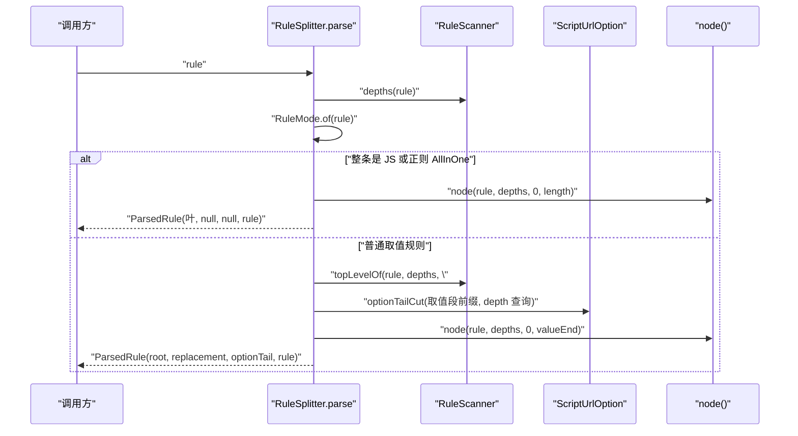
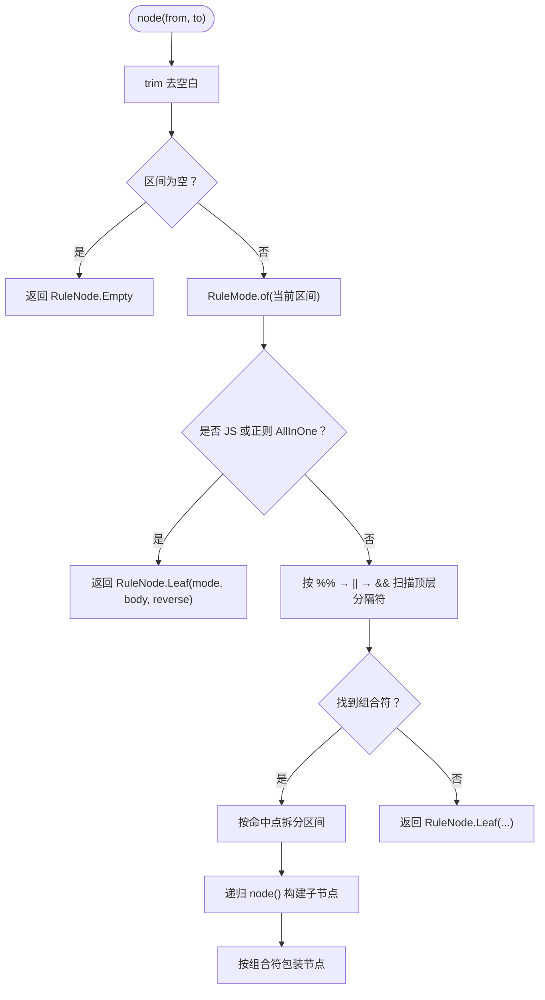
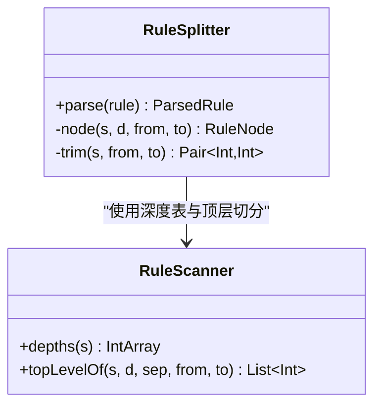
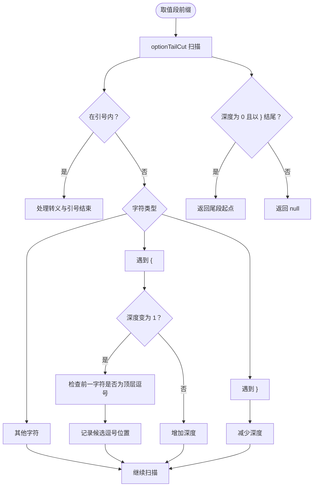
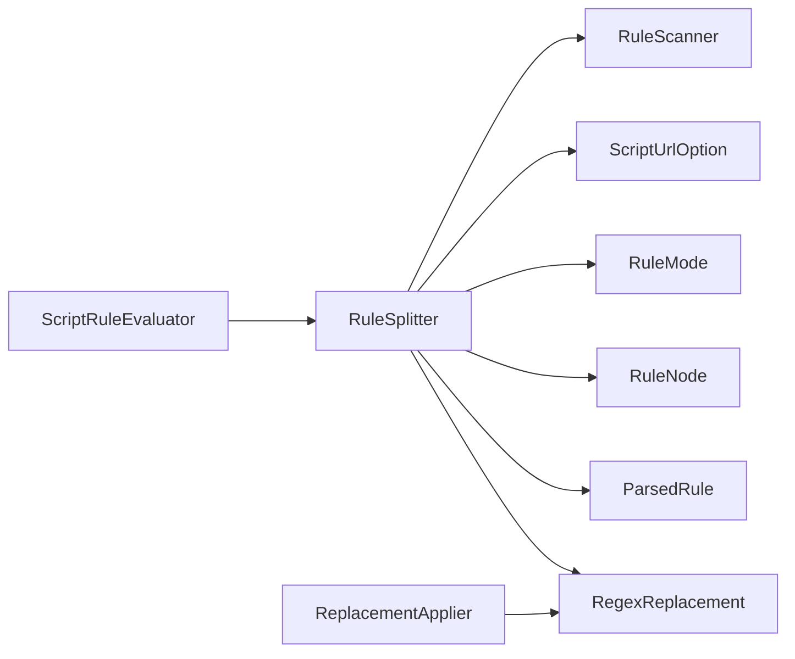

# 语法解析器 RuleSplitter

<cite>
**本文引用的文件**   
- [RuleSplitter.kt](file://lib_book_source/src/main/java/com/ebook/source/script/RuleSplitter.kt)
- [RuleScanner.kt](file://lib_book_source/src/main/java/com/ebook/source/script/RuleScanner.kt)
- [ScriptUrlOption.kt](file://lib_book_source/src/main/java/com/ebook/source/script/ScriptUrlOption.kt)
- [ScriptRuleEvaluator.kt](file://lib_book_source/src/main/java/com/ebook/source/script/ScriptRuleEvaluator.kt)
- [ReplacementApplier.kt](file://lib_book_source/src/main/java/com/ebook/source/script/ReplacementApplier.kt)
- [RuleSplitterTest.kt](file://lib_book_source/src/test/java/com/ebook/source/script/RuleSplitterTest.kt)
</cite>

## 目录
1. [引言](#引言)
2. [项目结构定位](#项目结构定位)
3. [核心数据结构](#核心数据结构)
4. [优先级与解析总流程](#优先级与解析总流程)
5. [parse() 方法完整解析流程](#parse-方法完整解析流程)
6. [node() 递归函数详解](#node-递归函数详解)
7. [与 RuleScanner 的协作关系](#与-rulescanner-的协作关系)
8. [URL 选项尾段处理逻辑](#url-选项尾段处理逻辑)
9. [AST 构建示例](#ast-构建示例)
10. [依赖关系分析](#依赖关系分析)
11. [性能与复杂度特征](#性能与复杂度特征)
12. [故障排查指南](#故障排查指南)
13. [结论](#结论)

## 引言
RuleSplitter 是书源脚本规则引擎中的“规则串到抽象语法树”解析层。它把用户编写的一条规则字符串切分成由组合符和模式节点构成的树，并剥离出 `##` 替换尾段与 URL 选项尾段，交给上层求值器执行。其设计重点在于：

- 固定优先级：`%%` → `||` → `&&` → 模式判定。
- 特殊模式豁免：JS 模式与正则 AllInOne 整条作为叶节点，不参与组合符切分。
- 下标始终基于原始规则串，避免子串切片后括号深度错位。
- 严格区分“取值段”“替换段”“URL 选项尾段”，三者归属不同字段。
- 反序标志 `-` 落在具体分支叶上，不改变组合表达式整体结构。

该文档面向希望理解规则解析内部行为的开发者与维护者，同时尽量用直观图示说明 AST 构建过程。

## 项目结构定位
RuleSplitter 位于 `lib_book_source` 模块的脚本规则包中，属于“规则语法解析层”。它与以下组件共同构成规则处理管线：



**图表来源**
- [RuleSplitter.kt:1-117](file://lib_book_source/src/main/java/com/ebook/source/script/RuleSplitter.kt#L1-L117)
- [RuleScanner.kt:1-78](file://lib_book_source/src/main/java/com/ebook/source/script/RuleScanner.kt#L1-L78)
- [ScriptUrlOption.kt:1-149](file://lib_book_source/src/main/java/com/ebook/source/script/ScriptUrlOption.kt#L1-L149)
- [ScriptRuleEvaluator.kt:1-200](file://lib_book_source/src/main/java/com/ebook/source/script/ScriptRuleEvaluator.kt#L1-L200)
- [ReplacementApplier.kt:1-83](file://lib_book_source/src/main/java/com/ebook/source/script/ReplacementApplier.kt#L1-L83)

本仓规则解析采用“清洁室实现”策略：公开文档未明确组合符混用优先级时，仓库通过单测把语料与文档示例锁进唯一语义，后续改动需同步修改 KDoc 与测试。

**章节来源**
- [RuleSplitter.kt:1-40](file://lib_book_source/src/main/java/com/ebook/source/script/RuleSplitter.kt#L1-L40)

## 核心数据结构

### ParsedRule：一次解析结果
`ParsedRule` 表示一条规则串的一次解析产物，包含四个字段：

| 字段 | 类型 | 含义 |
|---|---|---|
| `root` | `RuleNode` | 规则树的根节点，承载 `%%`、`||`、`&&` 与模式叶 |
| `replacement` | `RegexReplacement?` | 从 `##` 剥离出的正则替换段；无则 `null` |
| `optionTail` | `String?` | URL 选项尾段，以逗号开头；无则 `null` |
| `raw` | `String` | 原始规则串，用于错误消息与回溯定位 |

其中，`root` 与替换段、选项尾段是解耦的：组合切分只作用在“取值段”，而 `##` 替换与 URL 选项尾段分别由不同阶段剥离并携带。



**图表来源**
- [RuleSplitter.kt:8-22](file://lib_book_source/src/main/java/com/ebook/source/script/RuleSplitter.kt#L8-L22)
- [ReplacementApplier.kt:1-83](file://lib_book_source/src/main/java/com/ebook/source/script/ReplacementApplier.kt#L1-L83)

**章节来源**
- [RuleSplitter.kt:8-22](file://lib_book_source/src/main/java/com/ebook/source/script/RuleSplitter.kt#L8-L22)

## 优先级与解析总流程
RuleSplitter 的规则切分优先级为：

1. **JS 或正则 AllInOne 整条豁免**：若整条规则被判定为 JS 模式或正则 AllInOne 模式，直接构造一个叶节点，不再进入组合符切分。
2. **剥离 `##` 替换尾段**：在取值段范围内查找 `##`，将替换段解析为 `RegexReplacement`。
3. **剥离 URL 选项尾段**：在 `##` 之前的取值段末尾寻找 `,{"...": ...}` 形式的选项尾段。
4. **按优先级组合切分**：先找 `%%`，再找 `||`，最后找 `&&`。
5. **模式判定**：每个叶子最终落回一种模式，如链式选择器、CSS 选择器、JS 片段或正则 AllInOne。

这个顺序不是随意安排：如果先做组合切分，JS 正文或正则字面量里的 `||`、`&&`、`%%` 会被误判为组合符；如果先剥 URL 选项尾段而不限制范围，`##` 之后的替换文本也会被错误当作取值尾段。



**图表来源**
- [RuleSplitter.kt:42-88](file://lib_book_source/src/main/java/com/ebook/source/script/RuleSplitter.kt#L42-L88)

**章节来源**
- [RuleSplitter.kt:18-40](file://lib_book_source/src/main/java/com/ebook/source/script/RuleSplitter.kt#L18-L40)
- [RuleSplitter.kt:42-88](file://lib_book_source/src/main/java/com/ebook/source/script/RuleSplitter.kt#L42-L88)

## parse() 方法完整解析流程
`parse(rule)` 是 RuleSplitter 的唯一对外入口，它完成如下步骤：

1. **计算括号深度表**  
   调用 `RuleScanner.depths(rule)`，得到与原串等长的下标数组。该数组记录每个字符被 `{{}}`、`{}`、`[]` 包裹的层级。

2. **整条模式判定**  
   使用 `RuleMode.of(rule).mode` 判断整条规则是否为 JS 或正则 AllInOne。若是，直接返回：
   - 根节点：对整条规则调用 `node(rule, d, 0, rule.length)`。
   - 替换段：`null`。
   - 选项尾段：`null`。
   - 原始串：原样保存。

   这是规格 §2.3 的步骤 1/1b 前置例外：JS 和正则 AllInOne 的载荷本身就是脚本或正则文本，其中的 `##` 是字面量，不应被视为替换分隔符。

3. **定位 `##` 替换段**  
   调用 `RuleScanner.topLevelOf(rule, d, "##")`，取第一个顶层命中位置；若无命中，取值段就是整条规则。

4. **剥离 URL 选项尾段**  
   对取值段前缀调用 `ScriptUrlOption.optionTailCut(...)`，传入原始下标对应的深度查询函数。这样可防止规则载荷中的花括号干扰选项尾段识别。

5. **解析替换段**  
   若找到 `##`，则从该位置截取并交给 `RegexReplacement.parse(...)` 解析；否则替换段为 `null`。

6. **构建 AST**  
   根节点由 `node(rule, d, 0, valueEnd)` 生成，`valueEnd` 是取值段终点（已排除选项尾段）。

7. **组装 ParsedRule**  
   - `root`：AST 根节点。
   - `replacement`：解析后的替换段。
   - `optionTail`：若存在，则截取原始串中对应区间。
   - `raw`：原始规则串。



**图表来源**
- [RuleSplitter.kt:42-88](file://lib_book_source/src/main/java/com/ebook/source/script/RuleSplitter.kt#L42-L88)
- [RuleScanner.kt:17-78](file://lib_book_source/src/main/java/com/ebook/source/script/RuleScanner.kt#L17-L78)
- [ScriptUrlOption.kt:24-53](file://lib_book_source/src/main/java/com/ebook/source/script/ScriptUrlOption.kt#L24-L53)

**章节来源**
- [RuleSplitter.kt:42-88](file://lib_book_source/src/main/java/com/ebook/source/script/RuleSplitter.kt#L42-L88)

## node() 递归函数详解
`node(s, d, from, to)` 负责把一段规则区间 `[from, to)` 解析成 `RuleNode`。它的行为可以概括为四步：

1. **裁剪空白**  
   调用 `trim(s, from, to)`，去掉两端空白字符。若裁剪后区间为空，返回 `RuleNode.Empty`。

2. **整段模式探测**  
   对当前区间再次调用 `RuleMode.of(...)`。如果结果是 JS 或正则 AllInOne，则直接构造 `RuleNode.Leaf`，不再继续组合切分。  
   这一步是硬约束 1 的实现：组合符不能跨 JS 与正则边界。因为 `()` 不计入括号深度，仅靠扫描器无法正确识别正则字面量中的 `||` 等符号，所以必须通过模式判定豁免。

3. **按优先级组合切分**  
   依次尝试三个组合符：`%%`、`||`、`&&`。对每个组合符调用 `RuleScanner.topLevelOf(s, d, symbol, start, end)`，只匹配深度为 0 的位置。  
   一旦找到命中，就按命中点把区间拆成多个子区间，并递归调用 `node(...)` 构建子树。组合符包装节点分别是：
   - `%%` → `RuleNode.Percent`
   - `||` → `RuleNode.FirstOf`
   - `&&` → `RuleNode.AllOf`

4. **落回叶子**  
   如果没有组合符命中，说明当前区间是一个完整的模式段。此时反序标志已在 `RuleMode.of(...)` 中剥离，最终构造 `RuleNode.Leaf(mode, body, reverse)`。



**图表来源**
- [RuleSplitter.kt:90-117](file://lib_book_source/src/main/java/com/ebook/source/script/RuleSplitter.kt#L90-L117)

**章节来源**
- [RuleSplitter.kt:90-117](file://lib_book_source/src/main/java/com/ebook/source/script/RuleSplitter.kt#L90-L117)

## 与 RuleScanner 的协作关系
RuleScanner 是 RuleSplitter 的底层扫描工具，承担两个职责：

| 方法 | 输入 | 输出 | 用途 |
|---|---|---|---|
| `depths(s)` | 规则串 | 长度等于串长的整数数组 | 记录每个下标处的括号深度 |
| `topLevelOf(s, d, sep, from, to)` | 规则串、深度表、分隔符、区间 | 顶层命中下标列表 | 按 `%%`、`||`、`&&`、`##` 查找安全切分点 |

关键设计要点：

- **双花括号计 2**：`{{` 与 `}}` 各计 2，使 `{{` 与 `{` 能在同一计数体系中共存。
- **右括号先减后记**：闭合符本身仍留在外层深度上，避免把闭合位置误判为更深层。
- **多余右括号归零**：残缺规则串的右括号不会让深度变负。
- **顶层匹配跳过整个分隔符**：例如 `###` 不会被当成两个重叠的 `##`。
- **下标相对原始串**：所有命中下标都可直接用于截取原始规则，无需子串偏移换算。



**图表来源**
- [RuleScanner.kt:1-78](file://lib_book_source/src/main/java/com/ebook/source/script/RuleScanner.kt#L1-L78)
- [RuleSplitter.kt:42-117](file://lib_book_source/src/main/java/com/ebook/source/script/RuleSplitter.kt#L42-L117)

**章节来源**
- [RuleScanner.kt:1-78](file://lib_book_source/src/main/java/com/ebook/source/script/RuleScanner.kt#L1-L78)
- [RuleSplitter.kt:42-117](file://lib_book_source/src/main/java/com/ebook/source/script/RuleSplitter.kt#L42-L117)

## URL 选项尾段处理逻辑
URL 选项尾段遵循规格 §6.1，形式为 `URL,{"key":"value"}`。RuleSplitter 并不直接解析 JSON，而是交由 `ScriptUrlOption` 完成识别与解析。

### 识别规则
`ScriptUrlOption.optionTailCut` 扫描字符串，维护三个状态：

- 是否在引号内。
- 花括号深度。
- 最后一个候选逗号位置。

只有满足以下条件才认为存在选项尾段：

1. 从尾部看，花括号完全配平。
2. 结尾是 `}`。
3. 最后一个候选逗号的下一位是 `{`。
4. 该逗号位于规则层深度 0。
5. 引号内的逗号与花括号不被误判为尾段开始。

### 与 RuleSplitter 的配合
RuleSplitter 在 `parse()` 中调用 `optionTailCut(rule.substring(0, beforeReplacement), depthQuery)`：

- `beforeReplacement` 是 `##` 之前取值段的结束位置。
- 传入的深度查询函数基于原始规则串的下标，因此能正确区分“规则载荷中的花括号”和“URL 选项尾段的花括号”。
- 若找到尾段，`valueEnd` 会回退到逗号之前，保证 AST 只覆盖取值段。
- `optionTail` 保存的是原始串中从逗号到 `beforeReplacement` 的片段。

### 常见边界情况
| 规则形态 | 是否识别尾段 | 原因 |
|---|---:|---|
| `/search/,{"body":"a&&b"}` | 是 | 顶层逗号后跟配平对象 |
| `tag.a@text&&x,"a},{b"` | 否 | 逗号在引号内 |
| `{$.a}` | 否 | 单花括号不形成尾段 |
| `:<li>([^<]+),{"a":1}` | 否 | AllInOne 整条豁免，不挂 URL 选项 |
| `tag.a@text,{...}##全文` | 是 | 取值段内存在尾段，替换段另算 |
| `tag.a@text##$##,{...}` | 否 | 尾段出现在替换文本中 |



**图表来源**
- [ScriptUrlOption.kt:24-53](file://lib_book_source/src/main/java/com/ebook/source/script/ScriptUrlOption.kt#L24-L53)
- [RuleSplitter.kt:62-88](file://lib_book_source/src/main/java/com/ebook/source/script/RuleSplitter.kt#L62-L88)

**章节来源**
- [ScriptUrlOption.kt:1-53](file://lib_book_source/src/main/java/com/ebook/source/script/ScriptUrlOption.kt#L1-L53)
- [RuleSplitter.kt:62-88](file://lib_book_source/src/main/java/com/ebook/source/script/RuleSplitter.kt#L62-L88)

## AST 构建示例

### 示例一：简单链式规则
规则：`tag.a.0@text`

AST：
```
Leaf(DEFAULT_CHAIN, "tag.a.0@text")
```

### 示例二：双与合并
规则：`class.odd.0@tag.a.0@text&&tag.dd.0@tag.h1@text`

AST：
```
AllOf[
  Leaf(DEFAULT_CHAIN, "class.odd.0@tag.a.0@text"),
  Leaf(DEFAULT_CHAIN, "tag.dd.0@tag.h1@text")
]
```

### 示例三：短路选择
规则：`class.odd.0@text||tag.dd.0@text`

AST：
```
FirstOf[
  Leaf(DEFAULT_CHAIN, "class.odd.0@text"),
  Leaf(DEFAULT_CHAIN, "tag.dd.0@text")
]
```

### 示例四：百分号交错
规则：`a@text%%b@text%%c@text`

AST：
```
Percent[
  Leaf(DEFAULT_CHAIN, "a@text"),
  Leaf(DEFAULT_CHAIN, "b@text"),
  Leaf(DEFAULT_CHAIN, "c@text")
]
```

### 示例五：优先级混合
规则：`a&&b%%c||d`

AST：
```
Percent[
  AllOf[Leaf(DEFAULT_CHAIN, "a"), Leaf(DEFAULT_CHAIN, "b")],
  FirstOf[Leaf(DEFAULT_CHAIN, "c"), Leaf(DEFAULT_CHAIN, "d")]
]
```

### 示例六：带替换段
规则：`class.odd.0@tag.a.0@text||tag.dd.0@tag.h1@text##全文阅读`

AST：
```
FirstOf[
  Leaf(DEFAULT_CHAIN, "class.odd.0@tag.a.0@text"),
  Leaf(DEFAULT_CHAIN, "tag.dd.0@tag.h1@text")
]
```
替换段：`RegexReplacement("全文阅读", "", false)`

### 示例七：URL 选项尾段
规则：`tag.a@href,{"charset":"gbk"}`

AST：
```
Leaf(DEFAULT_CHAIN, "tag.a@href")
```
选项尾段：`,{"charset":"gbk"}`

### 示例八：AllInOne 整条豁免
规则：`:x("a||b")`

AST：
```
Leaf(REGEX_ALL_IN_ONE, "x(\"a||b\")")
```

这些示例均由单元测试验证，覆盖了组合优先级、空分支、括号保护、插值保护、反序标志、AllInOne 豁免与替换段分离等关键路径。

**章节来源**
- [RuleSplitterTest.kt:16-277](file://lib_book_source/src/test/java/com/ebook/source/script/RuleSplitterTest.kt#L16-L277)

## 依赖关系分析
RuleSplitter 的依赖方向清晰，耦合集中在“扫描”和“选项尾段识别”两个辅助能力上：



- **RuleScanner**：提供不可变深度表与顶层分隔符命中位置。
- **ScriptUrlOption**：负责 URL 选项尾段识别与解析，RuleSplitter 只负责“剥出”。
- **ScriptRuleEvaluator**：消费 `ParsedRule.root` 进行求值，并把 `optionTail` 回填到结果中。
- **ReplacementApplier**：消费 `ParsedRule.replacement` 与 `ParsedRule.raw`，执行 `##` 替换。

**图表来源**
- [RuleSplitter.kt:1-117](file://lib_book_source/src/main/java/com/ebook/source/script/RuleSplitter.kt#L1-L117)
- [ScriptRuleEvaluator.kt:1-120](file://lib_book_source/src/main/java/com/ebook/source/script/ScriptRuleEvaluator.kt#L1-L120)
- [ReplacementApplier.kt:1-83](file://lib_book_source/src/main/java/com/ebook/source/script/ReplacementApplier.kt#L1-L83)

**章节来源**
- [RuleSplitter.kt:1-117](file://lib_book_source/src/main/java/com/ebook/source/script/RuleSplitter.kt#L1-L117)
- [ScriptRuleEvaluator.kt:1-120](file://lib_book_source/src/main/java/com/ebook/source/script/ScriptRuleEvaluator.kt#L1-L120)

## 性能与复杂度特征
假设规则串长度为 `n`：

| 操作 | 时间复杂度 | 空间复杂度 | 说明 |
|---|---:|---:|---|
| `RuleScanner.depths` | O(n) | O(n) | 单次线性扫描，分配等长深度数组 |
| `RuleScanner.topLevelOf` | O(n) | O(k) | k 为顶层命中数量 |
| `ScriptUrlOption.optionTailCut` | O(m) | O(1) | m 为取值段前缀长度，常量额外空间 |
| `node` 组合切分 | O(c × n) | O(d) | c 为组合符数量（常数 3），d 为递归深度 |
| 整体 `parse` | O(n) | O(n) | 主要开销来自深度表与 AST 节点 |

关键点：

- 深度表只计算一次，后续所有分隔符扫描复用。
- `node` 每次组合符扫描都在 `[start, end)` 区间内执行，但区间大小随递归递减。
- AST 节点数与规则段数成正比，不是与规则串字节数成正比。
- 特殊模式豁免避免了在 JS 或正则内部重复扫描组合符。

**章节来源**
- [RuleScanner.kt:17-78](file://lib_book_source/src/main/java/com/ebook/source/script/RuleScanner.kt#L17-L78)
- [RuleSplitter.kt:42-117](file://lib_book_source/src/main/java/com/ebook/source/script/RuleSplitter.kt#L42-L117)

## 故障排查指南

### 现象：规则被静默切成不相干的两支
可能原因：

- 在 JS 正文或正则 AllInOne 中使用 `||`、`&&`、`%%`。
- 没有走整条模式豁免，导致组合符切到了非预期位置。

排查建议：

- 确认整条规则是否应以 JS 或正则 AllInOne 形态解析。
- 检查规则是否以 `@js:` 或以 `:` 开头的正则 AllInOne 形式出现。
- 参考测试用例 `js 段不参与组合切分` 与 `正则 AllInOne 整条成一个叶`。

**章节来源**
- [RuleSplitterTest.kt:108-142](file://lib_book_source/src/test/java/com/ebook/source/script/RuleSplitterTest.kt#L108-L142)

### 现象：`##` 替换段被提前截断
可能原因：

- 规则是正则 AllInOne 或 JS 整条，内部 `##` 被误当替换分隔符。
- 解析顺序出错，导致步骤 1/1b 没有排在步骤 2 之前。

排查建议：

- 检查整条模式判定是否优先于 `##` 剥离。
- 参考测试用例 `正则 AllInOne 内的双井号不算替换尾段` 与 `js 段内的双井号不算替换尾段`。

**章节来源**
- [RuleSplitter.kt:48-56](file://lib_book_source/src/main/java/com/ebook/source/script/RuleSplitter.kt#L48-L56)
- [RuleSplitterTest.kt:152-166](file://lib_book_source/src/test/java/com/ebook/source/script/RuleSplitterTest.kt#L152-L166)

### 现象：URL 选项尾段被误剥或漏剥
可能原因：

- 取值段中存在落单花括号，导致选项尾段扫描深度错位。
- 把替换文本中的 `,{...}` 误认为取值段尾段。
- 在 AllInOne 规则后直接写 URL 选项，而非使用 `##$##,{...}` 惯用法。

排查建议：

- 检查取值段花括号是否配平。
- 确认尾段只在 `##` 之前取值段内识别。
- 参考测试用例 `替换文本里的选项尾段不当作取值尾段` 与 `AllInOne 整条不剥选项尾段`。

**章节来源**
- [ScriptUrlOption.kt:10-23](file://lib_book_source/src/main/java/com/ebook/source/script/ScriptUrlOption.kt#L10-L23)
- [RuleSplitterTest.kt:218-277](file://lib_book_source/src/test/java/com/ebook/source/script/RuleSplitterTest.kt#L218-L277)

### 现象：反序标志影响范围不符合预期
可能原因：

- 误以为 `-` 作用于整个组合表达式。
- 实际反序标志按每条规则段各自判定。

排查建议：

- 检查反序标志是否落在单个叶节点上。
- 参考测试用例 `反序标志按支各判而不是辖整条组合表达式`。

**章节来源**
- [RuleSplitterTest.kt:230-243](file://lib_book_source/src/test/java/com/ebook/source/script/RuleSplitterTest.kt#L230-L243)

## 结论
RuleSplitter 的核心价值在于把用户可读的规则字符串转换为结构明确的 AST，并在同一份代码中统一处理三种容易混淆的尾段：

- 取值段：参与 AST 构建与求值。
- 替换段：由 `##` 剥离，交由 ReplacementApplier 应用。
- URL 选项尾段：由 ScriptUrlOption 识别，供取文层解析请求选项。

其设计的关键约束是：**下标始终基于原始规则串**、**组合符优先级固定为 `%%` → `||` → `&&`**、**JS 与正则 AllInOne 整条豁免组合切分**。这使得规则解析不再是简单的字符串分割，而是一个受括号深度、模式判定、替换段与 URL 选项尾段共同约束的稳定解析过程。

对于维护者而言，修改 RuleSplitter 时必须同时关注三类内容：

1. KDoc 中的优先级与顺序说明。
2. 对应单测的行为断言。
3. 与 ScriptRuleEvaluator、ReplacementApplier、ScriptUrlOption 之间的契约边界。