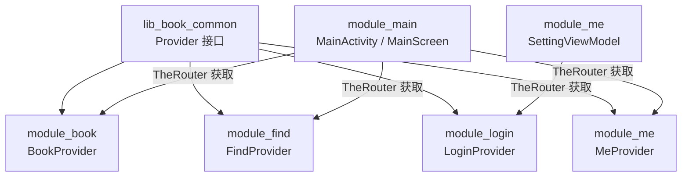
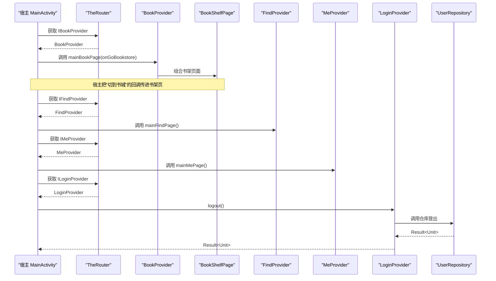
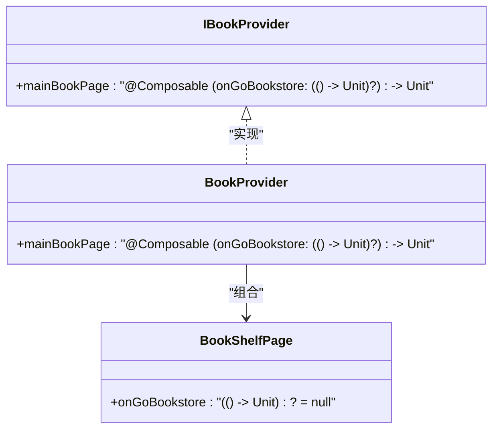
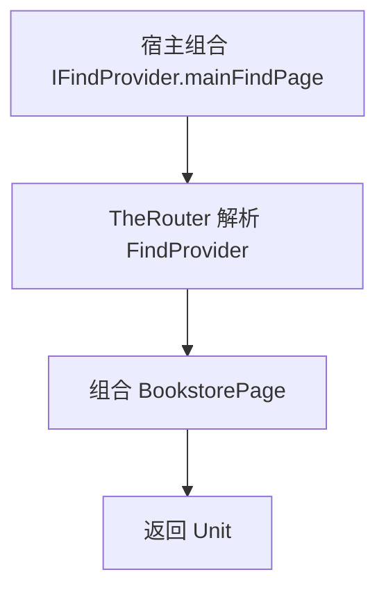
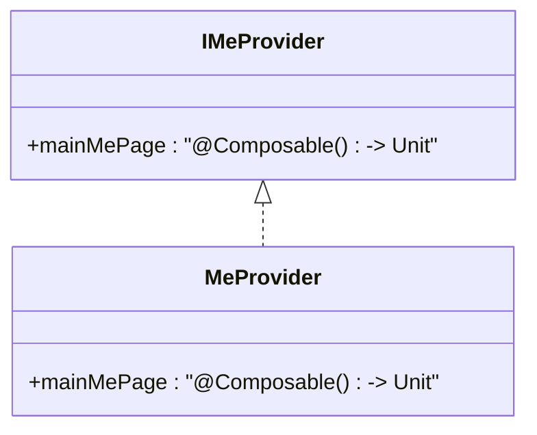
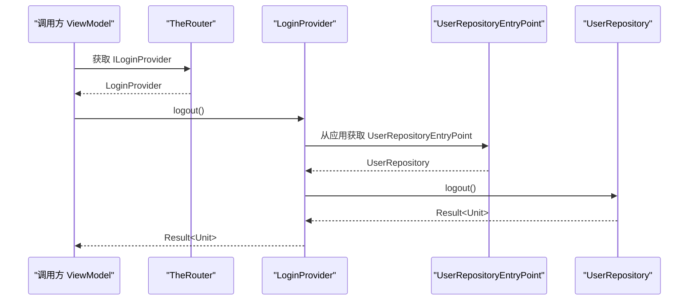
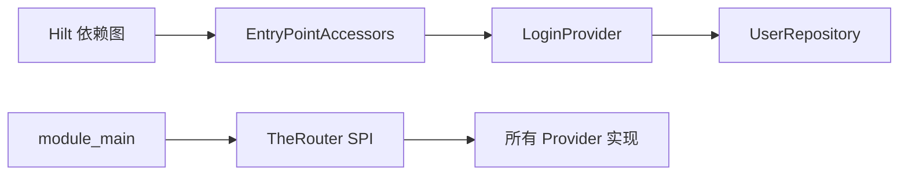

# Provider 接口层

<cite>
**本文引用的文件**   
- [IBookProvider.kt](file://lib_book_common/src/main/java/com/ebook/common/provider/IBookProvider.kt)
- [IFindProvider.kt](file://lib_book_common/src/main/java/com/ebook/common/provider/IFindProvider.kt)
- [ILoginProvider.kt](file://lib_book_common/src/main/java/com/ebook/common/provider/ILoginProvider.kt)
- [IMeProvider.kt](file://lib_book_common/src/main/java/com/ebook/common/provider/IMeProvider.kt)
- [BookProvider.kt](file://module_book/src/main/java/com/ebook/book/provider/BookProvider.kt)
- [FindProvider.kt](file://module_find/src/main/java/com/ebook/find/provider/FindProvider.kt)
- [LoginProvider.kt](file://module_login/src/main/java/com/ebook/login/provider/LoginProvider.kt)
- [MeProvider.kt](file://module_me/src/main/java/com/ebook/me/provider/MeProvider.kt)
- [MainActivity.kt](file://module_main/src/main/java/com/ebook/main/MainActivity.kt)
- [BookShelfPage.kt](file://module_book/src/main/java/com/ebook/book/page/BookShelfPage.kt)
- [0041-cross-module-ui-capability-via-parameter.md](file://docs/adr/0041-cross-module-ui-capability-via-parameter.md)
- [0019-logout-capability-ownership.md](file://docs/adr/0019-logout-capability-ownership.md)
</cite>

## 目录
1. [引言](#引言)
2. [项目结构](#项目结构)
3. [核心组件](#核心组件)
4. [架构总览](#架构总览)
5. [详细组件分析](#详细组件分析)
6. [依赖与注入分析](#依赖与注入分析)
7. [扩展点与版本兼容](#扩展点与版本兼容)
8. [性能考虑](#性能考虑)
9. [故障排查指南](#故障排查指南)
10. [结论](#结论)

## 引言
本文聚焦 `lib_book_common` 中的 Provider 接口层，解释其如何以 Provider 模式在模块化架构中承担跨模块通信职责。现有设计通过四个接口：`IBookProvider`、`IFindProvider`、`IMeProvider` 和 `ILoginProvider`，把页面级 UI 能力与登录域服务端能力从业务模块（如 `module_book`、`module_find`、`module_login`、`module_me`）解耦到宿主 `module_main` 或调用方 ViewModel 中。实现类由 TheRouter SPI 注册，并通过 Hilt EntryPoint 桥接 Hilt 管理的 Repository 等基础设施，从而避免功能模块之间直接相互依赖。

## 项目结构
Provider 接口集中在共享库 `lib_book_common` 的 `com.ebook.common.provider` 包中；各业务模块在各自 `provider` 子包提供具体实现。宿主 `module_main` 通过 TheRouter 获取这些 Provider，并把 Compose 页面组合进 NavHost，同时把宿主拥有的导航能力（例如“切到书城 Tab”）作为回调参数向下传递。

**图示来源**
- [IBookProvider.kt:1-23](file://lib_book_common/src/main/java/com/ebook/common/provider/IBookProvider.kt#L1-L23)
- [IFindProvider.kt:1-13](file://lib_book_common/src/main/java/com/ebook/common/provider/IFindProvider.kt#L1-L13)
- [IMeProvider.kt:1-13](file://lib_book_common/src/main/java/com/ebook/common/provider/IMeProvider.kt#L1-L13)
- [ILoginProvider.kt:1-19](file://lib_book_common/src/main/java/com/ebook/common/provider/ILoginProvider.kt#L1-L19)
- [BookProvider.kt:1-16](file://module_book/src/main/java/com/ebook/book/provider/BookProvider.kt#L1-L16)
- [FindProvider.kt:1-19](file://module_find/src/main/java/com/ebook/find/provider/FindProvider.kt#L1-L19)
- [LoginProvider.kt:1-36](file://module_login/src/main/java/com/ebook/login/provider/LoginProvider.kt#L1-L36)
- [MeProvider.kt:1-20](file://module_me/src/main/java/com/ebook/me/provider/MeProvider.kt#L1-L20)
- [MainActivity.kt:1-200](file://module_main/src/main/java/com/ebook/main/MainActivity.kt#L1-L200)

**章节来源**
- [IBookProvider.kt:1-23](file://lib_book_common/src/main/java/com/ebook/common/provider/IBookProvider.kt#L1-L23)
- [IFindProvider.kt:1-13](file://lib_book_common/src/main/java/com/ebook/common/provider/IFindProvider.kt#L1-L13)
- [IMeProvider.kt:1-13](file://lib_book_common/src/main/java/com/ebook/common/provider/IMeProvider.kt#L1-L13)
- [ILoginProvider.kt:1-19](file://lib_book_common/src/main/java/com/ebook/common/provider/ILoginProvider.kt#L1-L19)
- [BookProvider.kt:1-16](file://module_book/src/main/java/com/ebook/book/provider/BookProvider.kt#L1-L16)
- [FindProvider.kt:1-19](file://module_find/src/main/java/com/ebook/find/provider/FindProvider.kt#L1-L19)
- [LoginProvider.kt:1-36](file://module_login/src/main/java/com/ebook/login/provider/LoginProvider.kt#L1-L36)
- [MeProvider.kt:1-20](file://module_me/src/main/java/com/ebook/me/provider/MeProvider.kt#L1-L20)
- [MainActivity.kt:1-200](file://module_main/src/main/java/com/ebook/main/MainActivity.kt#L1-L200)

## 核心组件
Provider 接口层包含两类能力边界：

1. **页面级 Provider**：`IBookProvider`、`IFindProvider`、`IMeProvider`。它们暴露的是 Compose 页面组合函数，供宿主 NavHost 直接组合。
2. **服务端能力 Provider**：`ILoginProvider`。它暴露登录域对外的服务端会话作废能力，独立于 UI 组合过程。

| 接口 | 所在模块 | 暴露的能力 | 典型消费者 | 返回值语义 |
|---|---|---|---|---|
| `IBookProvider` | `lib_book_common` | 书架主页面组合函数 | `module_main` 宿主 | 返回 `Unit` 的组合函数；可接受空的可执行回调表示无书城 Tab |
| `IFindProvider` | `lib_book_common` | 书城主页面组合函数 | `module_main` 宿主 | 返回 `Unit` 的组合函数 |
| `IMeProvider` | `lib_book_common` | 个人中心主页面组合函数 | `module_main` 宿主 | 返回 `Unit` 的组合函数 |
| `ILoginProvider` | `lib_book_common` | 服务端登出 | `module_me` 等业务模块 | `suspend fun logout(): Result<Unit>` |

**章节来源**
- [IBookProvider.kt:1-23](file://lib_book_common/src/main/java/com/ebook/common/provider/IBookProvider.kt#L1-L23)
- [IFindProvider.kt:1-13](file://lib_book_common/src/main/java/com/ebook/common/provider/IFindProvider.kt#L1-L13)
- [IMeProvider.kt:1-13](file://lib_book_common/src/main/java/com/ebook/common/provider/IMeProvider.kt#L1-L13)
- [ILoginProvider.kt:1-19](file://lib_book_common/src/main/java/com/ebook/common/provider/ILoginProvider.kt#L1-L19)

## 架构总览
Provider 接口层是跨模块通信契约层。其关键设计如下：

- 接口定义在 `lib_book_common`，业务模块不反向依赖接口之外的内部类型。
- 实现类标注 TheRouter SPI 注解，由 TheRouter 在运行时解析并创建。
- 宿主 `module_main` 通过 TheRouter 获取页面 Provider，并组合 NavHost。
- 非 UI 能力（如登出）由业务 ViewModel 通过 TheRouter 获取 Provider，再桥接 Hilt 管理的 Repository。
- 宿主把自身拥有的导航能力以回调参数传递给子页面，避免子模块持有宿主的 NavController。

**图示来源**
- [MainActivity.kt:1-200](file://module_main/src/main/java/com/ebook/main/MainActivity.kt#L1-L200)
- [BookProvider.kt:1-16](file://module_book/src/main/java/com/ebook/book/provider/BookProvider.kt#L1-L16)
- [FindProvider.kt:1-19](file://module_find/src/main/java/com/ebook/find/provider/FindProvider.kt#L1-L19)
- [MeProvider.kt:1-20](file://module_me/src/main/java/com/ebook/me/provider/MeProvider.kt#L1-L20)
- [LoginProvider.kt:1-36](file://module_login/src/main/java/com/ebook/login/provider/LoginProvider.kt#L1-L36)

## 详细组件分析

### IBookProvider 与 BookProvider
`IBookProvider` 暴露一个 `mainBookPage` 组合函数，而不是 Fragment。注释明确说明：该页面供宿主 NavHost 直接组合，ViewModel 作用域绑定调用处的 `NavBackStackEntry`，这是 `hiltViewModel` 的默认行为。

关键点是 `onGoBookstore: (() -> Unit)?` 参数。书架模块本身不知道宿主的书城路由，因此宿主把“切到书城”的能力以回调形式传入；当宿主没有书城 Tab 时传 `null`，书架页据此不渲染该动作。这一设计来自 ADR-0041，属于“跨模块 UI 能力用参数注入”。

**图示来源**
- [IBookProvider.kt:1-23](file://lib_book_common/src/main/java/com/ebook/common/provider/IBookProvider.kt#L1-L23)
- [BookProvider.kt:1-16](file://module_book/src/main/java/com/ebook/book/provider/BookProvider.kt#L1-L16)
- [BookShelfPage.kt:1-200](file://module_book/src/main/java/com/ebook/book/page/BookShelfPage.kt#L1-L200)

#### 方法签名与参数约定
- `mainBookPage` 是一个 Compose 组合函数，不是普通函数，也不是页面状态对象。
- 参数 `onGoBookstore` 是可空的无参回调，表示“当前宿主是否提供书城 Tab 切换能力”。
- 如果宿主传 `null`，书架页不应渲染“去书城找书”这类动作，以避免静默失效。

#### 返回值处理
组合函数返回 `Unit`，生命周期和重组由 Compose 控制。ViewModel 作用域由调用处的 `hiltViewModel` 决定，而非 Provider 内部维护。

**章节来源**
- [IBookProvider.kt:1-23](file://lib_book_common/src/main/java/com/ebook/common/provider/IBookProvider.kt#L1-L23)
- [BookProvider.kt:1-16](file://module_book/src/main/java/com/ebook/book/provider/BookProvider.kt#L1-L16)
- [BookShelfPage.kt:1-200](file://module_book/src/main/java/com/ebook/book/page/BookShelfPage.kt#L1-L200)
- [0041-cross-module-ui-capability-via-parameter.md:1-46](file://docs/adr/0041-cross-module-ui-capability-via-parameter.md#L1-L46)

### IFindProvider 与 FindProvider
`IFindProvider` 暴露 `mainFindPage`，是一个无参数的 Compose 组合函数。`FindProvider` 将其委托给书城页面。该 Provider 的作用是把书城入口从 `module_main` 的 NavHost 中解耦出来：宿主只负责组合，不负责书城页面的具体实现。

**图示来源**
- [IFindProvider.kt:1-13](file://lib_book_common/src/main/java/com/ebook/common/provider/IFindProvider.kt#L1-L13)
- [FindProvider.kt:1-19](file://module_find/src/main/java/com/ebook/find/provider/FindProvider.kt#L1-L19)

**章节来源**
- [IFindProvider.kt:1-13](file://lib_book_common/src/main/java/com/ebook/common/provider/IFindProvider.kt#L1-L13)
- [FindProvider.kt:1-19](file://module_find/src/main/java/com/ebook/find/provider/FindProvider.kt#L1-L19)

### IMeProvider 与 MeProvider
`IMeProvider` 与 `IFindProvider` 结构一致，只是承载个人中心页面。`MeProvider` 将组合逻辑委托给 `MePage`。

**图示来源**
- [IMeProvider.kt:1-13](file://lib_book_common/src/main/java/com/ebook/common/provider/IMeProvider.kt#L1-L13)
- [MeProvider.kt:1-20](file://module_me/src/main/java/com/ebook/me/provider/MeProvider.kt#L1-L20)

**章节来源**
- [IMeProvider.kt:1-13](file://lib_book_common/src/main/java/com/ebook/common/provider/IMeProvider.kt#L1-L13)
- [MeProvider.kt:1-20](file://module_me/src/main/java/com/ebook/me/provider/MeProvider.kt#L1-L20)

### ILoginProvider 与 LoginProvider
`ILoginProvider` 是唯一的非 UI Provider，暴露 `suspend fun logout(): Result<Unit>`。注释强调：这里只负责服务端会话作废；本地会话清理由 `UserSessionManager.clearSession` 单点负责，不在 Provider 内重复。

`LoginProvider` 使用 TheRouter SPI 创建，并在初始化阶段通过 Hilt 的 `EntryPointAccessors.fromApplication` 获取 `UserRepositoryEntryPoint`，再从其中取 `UserRepository`。这样 Provider 本身不由 Hilt 管理，却能访问 Hilt 图内的基础设施。

**图示来源**
- [ILoginProvider.kt:1-19](file://lib_book_common/src/main/java/com/ebook/common/provider/ILoginProvider.kt#L1-L19)
- [LoginProvider.kt:1-36](file://module_login/src/main/java/com/ebook/login/provider/LoginProvider.kt#L1-L36)

#### 错误处理策略
- `logout()` 返回 `Result<Unit>`，网络或业务失败由调用方决定是否提示。
- 根据 ADR-0019，调用方应“先尽力作废服务端，再无条件清本地会话”，服务端失败不阻塞本地清理。
- 独立运行（调试宿主）时 `module_login` 可能不在依赖图中，Provider 取不到；调用方需允许空实现，否则连本地清理都会受影响。

**章节来源**
- [ILoginProvider.kt:1-19](file://lib_book_common/src/main/java/com/ebook/common/provider/ILoginProvider.kt#L1-L19)
- [LoginProvider.kt:1-36](file://module_login/src/main/java/com/ebook/login/provider/LoginProvider.kt#L1-L36)
- [0019-logout-capability-ownership.md:1-47](file://docs/adr/0019-logout-capability-ownership.md#L1-L47)

## 依赖与注入分析

### Provider 模式的模块化作用
Provider 接口层把以下依赖关系解耦：

| 耦合面 | 修改前风险 | Provider 解耦后 |
|---|---|---|
| 业务模块依赖宿主 NavHost | 业务模块需要知道路由、NavController | 宿主把导航能力作为回调传入 |
| 业务模块依赖登录仓库 | `module_me` 无法直接访问 `module_login` 的 Repository | 通过 `ILoginProvider` 暴露最小服务端能力 |
| 业务模块依赖 TheRouter 内部细节 | 实现类散落在不同模块 | 统一由 `@ServiceProvider` 暴露，宿主集中消费 |
| UI 组合与页面实现 | Fragment 或 Activity 被强引用 | Compose 页面通过 Provider 组合 |

### TheRouter SPI 与 Hilt 协作
- 所有 Provider 实现类都标注 TheRouter SPI 注解，表示它们是服务提供者。
- `LoginProvider` 额外标注 `@Singleton`，说明其作为单例服务存在。
- Hilt 不负责创建 Provider，但 Provider 可通过 EntryPoint 访问 Hilt 管理的 Repository。
- 页面 ViewModel 仍走 Hilt 的 `hiltViewModel`，作用域绑定到调用处的 `NavBackStackEntry`。

**图示来源**
- [LoginProvider.kt:1-36](file://module_login/src/main/java/com/ebook/login/provider/LoginProvider.kt#L1-L36)

**章节来源**
- [BookProvider.kt:1-16](file://module_book/src/main/java/com/ebook/book/provider/BookProvider.kt#L1-L16)
- [FindProvider.kt:1-19](file://module_find/src/main/java/com/ebook/find/provider/FindProvider.kt#L1-L19)
- [LoginProvider.kt:1-36](file://module_login/src/main/java/com/ebook/login/provider/LoginProvider.kt#L1-L36)
- [MeProvider.kt:1-20](file://module_me/src/main/java/com/ebook/me/provider/MeProvider.kt#L1-L20)

## 扩展点与版本兼容

### 新增 Provider 接口
如果要新增一个跨模块能力，建议遵循现有模式：

1. 在 `lib_book_common` 中新建接口，放在 `com.ebook.common.provider` 下。
2. 接口应保持最小语义：UI Provider 暴露 Compose 页面组合函数；非 UI Provider 暴露协程函数或事件。
3. 在对应业务模块中创建实现类，并使用 TheRouter SPI 注解。
4. 宿主或调用方通过 TheRouter 获取接口实例。

### 向后兼容策略
- 对于 UI Provider，优先使用可选参数或默认值。例如 `IBookProvider.mainBookPage` 的参数是 `((() -> Unit)?)`，宿主可以传 `null`，页面据此降级。
- 对于非 UI Provider，返回 `Result` 或允许调用方容忍空实现，保证独立运行场景不会崩溃。
- 新增能力不应改变已有接口的不可变语义；如果需要废弃旧方法，应先保留并标记为弃用，再在后续版本移除。
- 文档和 ADR 应同步更新，尤其是跨模块 UI 能力注入和服务能力归属。

### 扩展点设计原则
- 接口只暴露下游需要的能力，不暴露实现细节。
- 跨模块能力优先通过 Provider，而不是新建共享仓库或让业务模块互相依赖。
- 宿主拥有全局上下文能力（如 NavHost、Tab 路由），应由宿主向上提供，而不是下沉到子模块。

**章节来源**
- [IBookProvider.kt:1-23](file://lib_book_common/src/main/java/com/ebook/common/provider/IBookProvider.kt#L1-L23)
- [ILoginProvider.kt:1-19](file://lib_book_common/src/main/java/com/ebook/common/provider/ILoginProvider.kt#L1-L19)
- [0041-cross-module-ui-capability-via-parameter.md:1-46](file://docs/adr/0041-cross-module-ui-capability-via-parameter.md#L1-L46)
- [0019-logout-capability-ownership.md:1-47](file://docs/adr/0019-logout-capability-ownership.md#L1-L47)

## 性能考虑
- Provider 本身是轻量接口，主要开销在于 Compose 页面组合和 ViewModel 创建。
- `IBookProvider.mainBookPage` 每次组合创建新的页面实例，ViewModel 作用域由 `hiltViewModel` 绑定到调用处，避免长期持有大状态。
- `LoginProvider` 使用单例，减少重复创建成本；Repository 通过 EntryPoint 获取，避免在 Provider 中重复构造。
- 宿主在组合页面时应避免频繁重建 Provider；推荐在应用启动或宿主初始化阶段解析一次。

[本节为通用性能讨论，不直接分析具体代码行]

## 故障排查指南

### 问题一：书架页没有“去书城找书”按钮
- 检查宿主是否传入了非空的 `onGoBookstore` 回调。
- 检查 `MainScreen` 是否把正确的 `switchTab(route)` 传给 `IBookProvider.mainBookPage`。
- 确认书架页在 `onGoBookstore == null` 时没有渲染该动作。

**章节来源**
- [IBookProvider.kt:1-23](file://lib_book_common/src/main/java/com/ebook/common/provider/IBookProvider.kt#L1-L23)
- [BookShelfPage.kt:1-200](file://module_book/src/main/java/com/ebook/book/page/BookShelfPage.kt#L1-L200)
- [0041-cross-module-ui-capability-via-parameter.md:1-46](file://docs/adr/0041-cross-module-ui-capability-via-parameter.md#L1-L46)

### 问题二：登出只在服务端失败，本地会话没清理
- 检查调用方是否遵循“先调用 `ILoginProvider.logout()`，再调用 `clearSession()`”的顺序。
- 检查是否在 ViewModel 作用域内执行，避免旋转屏幕导致页面作用域取消。
- 检查独立运行模式下 Provider 是否为空；为空时应跳过服务端登出但仍执行本地清理。

**章节来源**
- [ILoginProvider.kt:1-19](file://lib_book_common/src/main/java/com/ebook/common/provider/ILoginProvider.kt#L1-L19)
- [LoginProvider.kt:1-36](file://module_login/src/main/java/com/ebook/login/provider/LoginProvider.kt#L1-L36)
- [0019-logout-capability-ownership.md:1-47](file://docs/adr/0019-logout-capability-ownership.md#L1-L47)

### 问题三：TheRouter 取不到 Provider
- 检查实现类是否正确标注 TheRouter SPI 注解。
- 检查当前构建变体是否包含对应业务模块。
- 对于 `ILoginProvider`，确认独立运行模式下允许 Provider 为空，不要把它当作必需依赖。

**章节来源**
- [BookProvider.kt:1-16](file://module_book/src/main/java/com/ebook/book/provider/BookProvider.kt#L1-L16)
- [FindProvider.kt:1-19](file://module_find/src/main/java/com/ebook/find/provider/FindProvider.kt#L1-L19)
- [LoginProvider.kt:1-36](file://module_login/src/main/java/com/ebook/login/provider/LoginProvider.kt#L1-L36)
- [MeProvider.kt:1-20](file://module_me/src/main/java/com/ebook/me/provider/MeProvider.kt#L1-L20)

## 结论
`lib_book_common` 的 Provider 接口层是一个清晰、可扩展的跨模块通信边界。它以最小接口暴露页面和服务能力，用 TheRouter SPI 解耦业务模块与宿主，用 Hilt EntryPoint 桥接基础设施依赖，并通过回调参数和 `Result` 返回值表达可选能力和错误语义。未来新增能力时，应继续遵循“接口在共享库、实现在业务模块、宿主或调用方消费”的模式，并始终考虑独立运行模式和向后兼容。