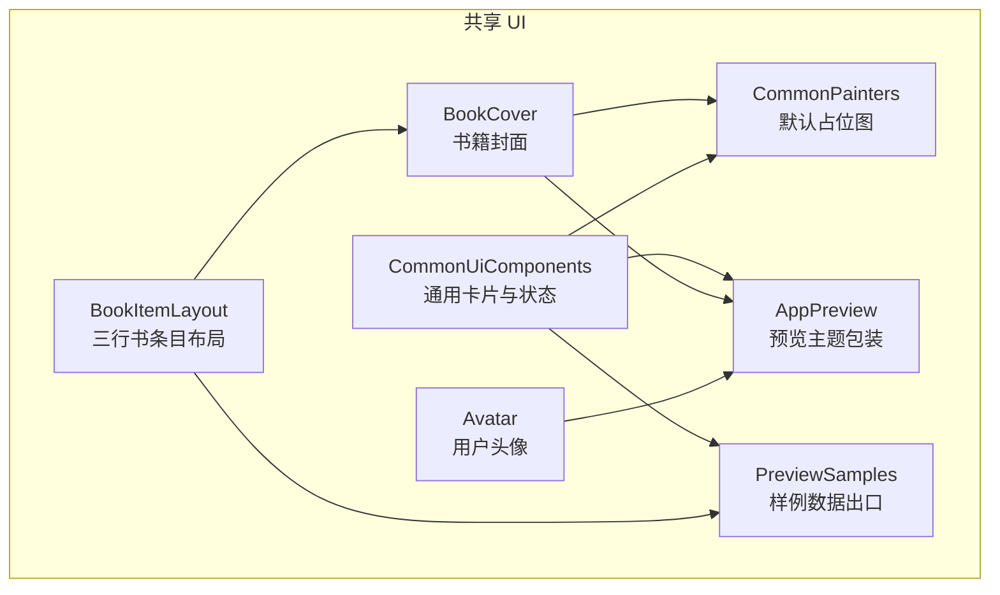
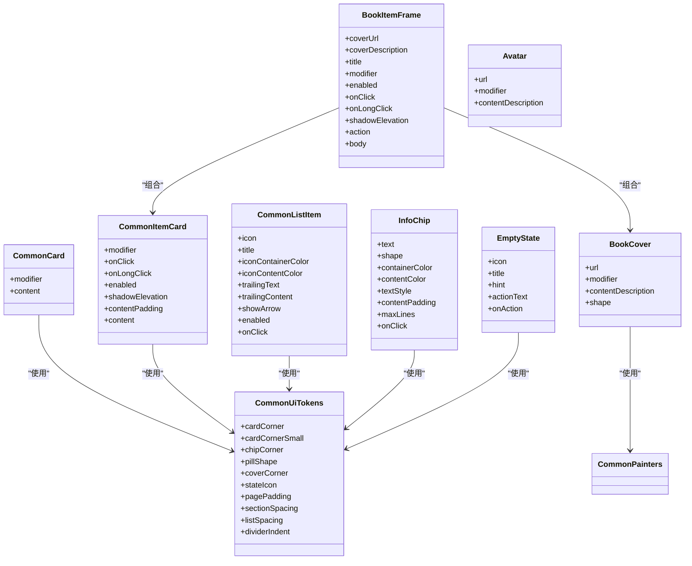
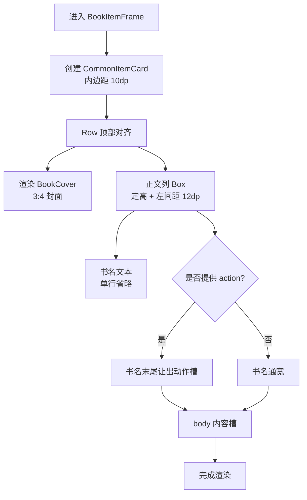
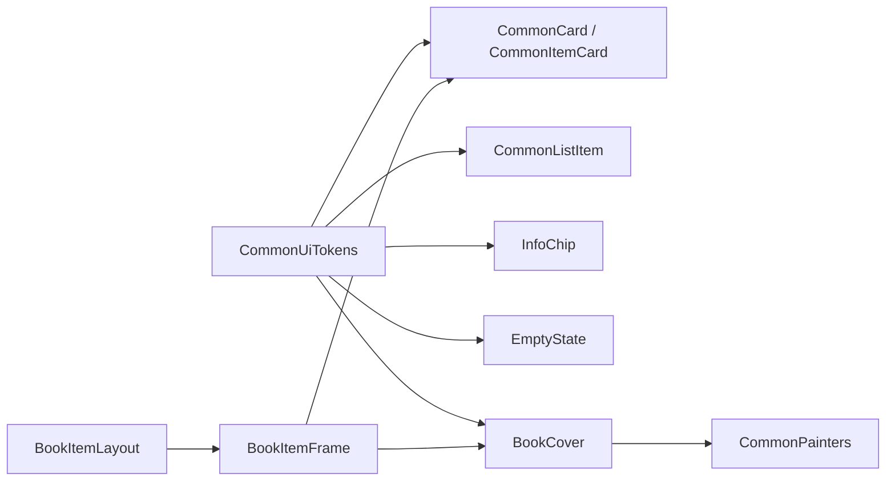
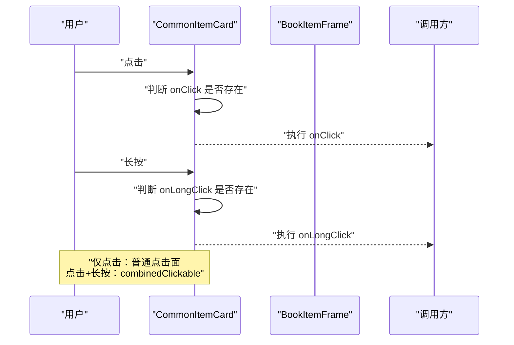
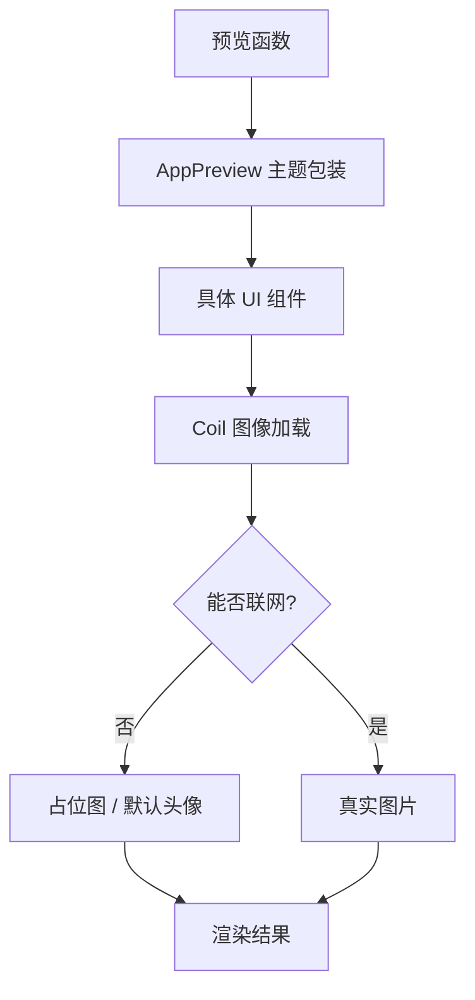

# 共享 UI 组件

<cite>
**本文引用的文件 **
- [CommonUiComponents.kt](file://lib_book_common/src/main/java/com/ebook/common/ui/CommonUiComponents.kt)
- [BookItemLayout.kt](file://lib_book_common/src/main/java/com/ebook/common/ui/BookItemLayout.kt)
- [BookCover.kt](file://lib_book_common/src/main/java/com/ebook/common/ui/BookCover.kt)
- [Avatar.kt](file://lib_book_common/src/main/java/com/ebook/common/ui/Avatar.kt)
- [CommonPainters.kt](file://lib_book_common/src/main/java/com/ebook/common/ui/CommonPainters.kt)
- [AppPreview.kt](file://lib_book_common/src/main/java/com/ebook/common/ui/preview/AppPreview.kt)
- [PreviewSamples.kt](file://lib_book_common/src/main/java/com/ebook/common/ui/preview/PreviewSamples.kt)
</cite>

## 目录
1. [引言](#引言)
2. [项目结构](#项目结构)
3. [核心组件](#核心组件)
4. [架构总览](#架构总览)
5. [详细组件分析](#详细组件分析)
6. [依赖关系分析](#依赖关系分析)
7. [性能与渲染特性](#性能与渲染特性)
8. [可定制性与主题适配](#可定制性与主题适配)
9. [交互行为与手势处理](#交互行为与手势处理)
10. [预览支持](#预览支持)
11. [使用示例与复用指南](#使用示例与复用指南)
12. [扩展点与自定义样式](#扩展点与自定义样式)
13. [故障排查](#故障排查)
14. [结论](#结论)

## 引言
本技术文档聚焦 `lib_book_common` 模块中的共享 UI 组件，目标是帮助业务模块（书城、书架、我的等）准确理解并复用这些 Compose 组件。文档重点覆盖：

- 组件参数设计与职责边界
- 状态管理、点击与长按交互
- 响应式布局与等高卡片策略
- 主题、深色模式与语义色适配
- 预览支持与开发期验证方式
- 在业务模块中的复用方式与扩展点

该共享 UI 库的设计原则是“视觉语言收敛”：圆角卡片、语义色、Material 排版、轻阴影等统一由常量与基础组件提供，避免各业务页各自实现导致视觉漂移。

## 项目结构
`lib_book_common` 的共享 UI 代码集中在 `com.ebook.common.ui` 包下，按职责划分为三类：

| 类别 | 文件 | 职责 |
| --- | --- | --- |
| 通用布局与容器 | [CommonUiComponents.kt](file://lib_book_common/src/main/java/com/ebook/common/ui/CommonUiComponents.kt) | 分组卡片、条目卡、列表项、分割线、章节标签、空态 |
| 书条目版式 | [BookItemLayout.kt](file://lib_book_common/src/main/java/com/ebook/common/ui/BookItemLayout.kt) | 三行书条目尺寸、行数计算、封面宽度、书名底行 |
| 图像类组件 | [BookCover.kt](file://lib_book_common/src/main/java/com/ebook/common/ui/BookCover.kt)、[Avatar.kt](file://lib_book_common/src/main/java/com/ebook/common/ui/Avatar.kt)、[CommonPainters.kt](file://lib_book_common/src/main/java/com/ebook/common/ui/CommonPainters.kt) | 封面加载、头像三态、默认占位图 Painter |
| 预览基础设施 | [AppPreview.kt](file://lib_book_common/src/main/java/com/ebook/common/ui/preview/AppPreview.kt)、[PreviewSamples.kt](file://lib_book_common/src/main/java/com/ebook/common/ui/preview/PreviewSamples.kt) | 统一预览主题、跨模块样例数据 |

**图表来源**
- [CommonUiComponents.kt:1-200](file://lib_book_common/src/main/java/com/ebook/common/ui/CommonUiComponents.kt#L1-L200)
- [BookItemLayout.kt:1-120](file://lib_book_common/src/main/java/com/ebook/common/ui/BookItemLayout.kt#L1-L120)
- [BookCover.kt:1-86](file://lib_book_common/src/main/java/com/ebook/common/ui/BookCover.kt#L1-L86)
- [Avatar.kt:1-95](file://lib_book_common/src/main/java/com/ebook/common/ui/Avatar.kt#L1-L95)
- [CommonPainters.kt:1-38](file://lib_book_common/src/main/java/com/ebook/common/ui/CommonPainters.kt#L1-L38)
- [AppPreview.kt:1-42](file://lib_book_common/src/main/java/com/ebook/common/ui/preview/AppPreview.kt#L1-L42)
- [PreviewSamples.kt:1-120](file://lib_book_common/src/main/java/com/ebook/common/ui/preview/PreviewSamples.kt#L1-L120)

**章节来源**
- [CommonUiComponents.kt:1-200](file://lib_book_common/src/main/java/com/ebook/common/ui/CommonUiComponents.kt#L1-L200)
- [BookItemLayout.kt:1-120](file://lib_book_common/src/main/java/com/ebook/common/ui/BookItemLayout.kt#L1-L120)
- [BookCover.kt:1-86](file://lib_book_common/src/main/java/com/ebook/common/ui/BookCover.kt#L1-L86)
- [Avatar.kt:1-95](file://lib_book_common/src/main/java/com/ebook/common/ui/Avatar.kt#L1-L95)
- [CommonPainters.kt:1-38](file://lib_book_common/src/main/java/com/ebook/common/ui/CommonPainters.kt#L1-L38)
- [AppPreview.kt:1-42](file://lib_book_common/src/main/java/com/ebook/common/ui/preview/AppPreview.kt#L1-L42)
- [PreviewSamples.kt:1-120](file://lib_book_common/src/main/java/com/ebook/common/ui/preview/PreviewSamples.kt#L1-L120)

## 核心组件
本节列出共享 UI 的主要公共接口及其设计意图。

### 设计令牌：CommonUiTokens
`CommonUiTokens` 是共享视觉常量的唯一事实来源，包括：

| 令牌 | 含义 | 典型用途 |
| --- | --- | --- |
| `cardCorner` | 分组容器圆角 | `CommonCard` |
| `cardCornerSmall` | 条目卡片圆角 | `CommonItemCard` |
| `chipCorner` | 信息标签圆角 | `InfoChip` |
| `pillShape` | 胶囊形状 | 筛选标签、状态标签 |
| `coverCorner` | 封面默认圆角 | `BookCover` |
| `stateIcon` | 空态图标边长 | `EmptyState` |
| `pagePadding` | 页面水平边距 | 页面级布局 |
| `sectionSpacing` | 区块垂直间距 | 卡片间距离 |
| `listSpacing` | 列表条目间距 | 列表渲染 |
| `dividerIndent` | 分割线缩进 | `CommonListDivider` |

设计要点：

- 禁止业务模块重复写相同语义的魔法值。
- 圆形与间距变化应集中修改，保证全 App 视觉一致。
- `pillShape` 专门解决多处裸写 `RoundedCornerShape(50)` 的问题，让“胶囊形”成为可检查的设计契约。

**章节来源**
- [CommonUiComponents.kt:1-80](file://lib_book_common/src/main/java/com/ebook/common/ui/CommonUiComponents.kt#L1-L80)

### 通用卡片：CommonCard 与 CommonItemCard
`CommonCard` 是分组容器：

- 圆角为 `cardCorner`。
- 背景使用 `surfaceContainer`。
- 带轻微阴影，形成“容器层级”。

`CommonItemCard` 是列表条目容器：

- 圆角为 `cardCornerSmall`。
- 默认内边距为 `12dp`。
- 根据是否传入 `onClick` / `onLongClick` 决定是否挂载点击面。
- 同时有点击和长按时使用 `combinedClickable`，保留长按手势。
- `enabled = false` 时仍渲染，但不响应交互。

关键参数：

| 参数 | 类型 | 默认值 | 说明 |
| --- | --- | --- | --- |
| `modifier` | `Modifier` | `Modifier` | 外层修饰 |
| `onClick` | `(() -> Unit)?` | `null` | 点击回调 |
| `onLongClick` | `(() -> Unit)?` | `null` | 长按回调 |
| `enabled` | `Boolean` | `true` | 是否可点击 |
| `shadowElevation` | `Dp` | `1.dp` | 阴影高度 |
| `contentPadding` | `PaddingValues` | `12dp` | 内容内边距 |
| `content` | `@Composable () -> Unit` | 必填 | 条目内容槽 |

**章节来源**
- [CommonUiComponents.kt:80-180](file://lib_book_common/src/main/java/com/ebook/common/ui/CommonUiComponents.kt#L80-L180)

### 列表项：CommonListItem
`CommonListItem` 用于菜单、设置项、分类入口等场景：

- 左侧是 36dp 圆角彩色图标容器。
- 中间是标题文本。
- 右侧可选尾随文本或尾随内容。
- 默认显示右箭头。
- `enabled = false` 时整行不可点击，且图标、标题颜色走弱化语义色。

关键参数：

| 参数 | 类型 | 默认值 | 说明 |
| --- | --- | --- | --- |
| `icon` | `ImageVector` | 必填 | Material 核心集图标 |
| `title` | `String` | 必填 | 标题 |
| `iconContainerColor` | `Color` | 必填 | 图标容器语义色 |
| `iconContentColor` | `Color` | 必填 | 图标前景色 |
| `trailingText` | `String?` | `null` | 尾随文本 |
| `trailingContent` | `(@Composable () -> Unit)?` | `null` | 尾随内容，优先于文本 |
| `showArrow` | `Boolean` | `true` | 是否显示箭头 |
| `enabled` | `Boolean` | `true` | 是否可用 |
| `onClick` | `() -> Unit` | 必填 | 点击回调 |

约束：

- 图标只允许使用 material-icons-core 核心集。
- 扩展图标应由业务模块自行声明依赖，不污染基础库体积。

**章节来源**
- [CommonUiComponents.kt:180-260](file://lib_book_common/src/main/java/com/ebook/common/ui/CommonUiComponents.kt#L180-L260)

### 分割线与分组标题
- `CommonListDivider`：从图标起始位置缩进的分割线，比通栏分割线更轻量。
- `SectionLabel`：分组小标题，左对齐，使用弱化文字语义。

**章节来源**
- [CommonUiComponents.kt:260-300](file://lib_book_common/src/main/java/com/ebook/common/ui/CommonUiComponents.kt#L260-L300)

### 信息标签：InfoChip
`InfoChip` 统一三类重复实现：

- 评论条目的章节标签。
- 书籍条目的状态、分类、字数标签。
- 书型与搜索历史的胶囊标签。

关键参数：

| 参数 | 类型 | 默认值 | 说明 |
| --- | --- | --- | --- |
| `text` | `String` | 必填 | 标签文本 |
| `shape` | `Shape` | 小圆角 | 默认普通标签；胶囊传 `pillShape` |
| `containerColor` | `Color` | `surfaceVariant` | 背景语义色 |
| `contentColor` | `Color` | `onSurfaceVariant` | 文本语义色 |
| `textStyle` | `TextStyle` | `labelSmall` | 默认标签字号；胶囊传 `labelLarge` |
| `contentPadding` | `PaddingValues` | 常规标签内边距 | 胶囊可加大 |
| `maxLines` | `Int` | `1` | 默认单行省略 |
| `onClick` | `(() -> Unit)?` | `null` | 非空时整体可点，标注按钮语义 |

**章节来源**
- [CommonUiComponents.kt:300-420](file://lib_book_common/src/main/java/com/ebook/common/ui/CommonUiComponents.kt#L300-L420)

### 空态：EmptyState
`EmptyState` 统一空态与失败态：

- 图标大小固定。
- 主文案使用强调语义色。
- 副文案为空串时不渲染。
- 动作需要同时提供文案和回调才渲染。

关键参数：

| 参数 | 类型 | 默认值 | 说明 |
| --- | --- | --- | --- |
| `icon` | `ImageVector` | 必填 | 线性图标 |
| `title` | `String` | 必填 | 主文案 |
| `hint` | `String` | `""` | 副文案 |
| `actionText` | `String?` | `null` | 动作文案 |
| `onAction` | `(() -> Unit)?` | `null` | 动作回调 |

约束：

- `actionText` 与 `onAction` 必须同时存在才渲染动作区。
- 图标由调用方传入，避免把业务扩展图标引入基础库。

**章节来源**
- [CommonUiComponents.kt:420-526](file://lib_book_common/src/main/java/com/ebook/common/ui/CommonUiComponents.kt#L420-L526)

## 架构总览
共享 UI 组件采用“容器 + 内容槽”的组合方式：

- 容器组件负责形状、语义色、点击面、阴影、内边距。
- 内容槽由业务模块决定具体形态。
- 图像组件封装 Coil 加载、占位图、裁剪与回退逻辑。
- 布局组件封装三行书条目的高度和行数计算。
- 预览组件封装主题与样例数据。

**图表来源**
- [CommonUiComponents.kt:1-526](file://lib_book_common/src/main/java/com/ebook/common/ui/CommonUiComponents.kt#L1-L526)
- [BookItemLayout.kt:1-247](file://lib_book_common/src/main/java/com/ebook/common/ui/BookItemLayout.kt#L1-L247)
- [BookCover.kt:1-86](file://lib_book_common/src/main/java/com/ebook/common/ui/BookCover.kt#L1-L86)
- [Avatar.kt:1-95](file://lib_book_common/src/main/java/com/ebook/common/ui/Avatar.kt#L1-L95)
- [CommonPainters.kt:1-38](file://lib_book_common/src/main/java/com/ebook/common/ui/CommonPainters.kt#L1-L38)

## 详细组件分析

### BookItemFrame：三行书条目外壳
`BookItemFrame` 是找书条目与书架条目的收敛点。它把两个原本各自维护的同构实现统一到一处，保证：

- 卡片内边距为 `10dp`。
- 正文列定高为 `BookItemLayout.columnHeight`。
- 封面宽度由 `BookItemLayout.coverWidth` 按 3:4 比例推导。
- 卡片高度恒为正文列高加上下内边距。
- 封面顶边与书名顶边同基线。
- 右上角动作槽只在书名行让出宽度，其他行通宽。

参数说明：

| 参数 | 类型 | 默认值 | 说明 |
| --- | --- | --- | --- |
| `coverUrl` | `String` | 必填 | 封面地址 |
| `coverDescription` | `String?` | `null` | 封面无障碍描述 |
| `title` | `String` | 必填 | 书名，单行省略 |
| `modifier` | `Modifier` | `Modifier` | 外层修饰 |
| `enabled` | `Boolean` | `true` | 整卡是否响应点击 |
| `onClick` | `(() -> Unit)?` | `null` | 点击回调 |
| `onLongClick` | `(() -> Unit)?` | `null` | 长按回调 |
| `shadowElevation` | `Dp` | `1.dp` | 阴影高度 |
| `action` | `(@Composable BoxScope.() -> Unit)?` | `null` | 右上角动作槽 |
| `body` | `@Composable ColumnScope.() -> Unit` | 必填 | 书名下方内容槽 |

交互行为：

- 仅传 `onClick`：使用普通点击面。
- 同时传 `onClick` 与 `onLongClick`：使用 `combinedClickable`，保留长按。
- 都不传：纯展示条目，不挂点击面。

布局细节：

- 封面使用 `BookCover`，圆角为 `6dp`。
- 正文列使用 `Column`，宽度权重为 1，高度固定。
- 书名使用 `titleSmall`，加粗，单行省略。
- 动作槽通过 `BoxScope` 调用，对齐到右上角。

**图表来源**
- [BookItemLayout.kt:120-247](file://lib_book_common/src/main/java/com/ebook/common/ui/BookItemLayout.kt#L120-L247)
- [BookCover.kt:1-86](file://lib_book_common/src/main/java/com/ebook/common/ui/BookCover.kt#L1-L86)

**章节来源**
- [BookItemLayout.kt:120-247](file://lib_book_common/src/main/java/com/ebook/common/ui/BookItemLayout.kt#L120-L247)

### BookItemLayout：等高与行数计算
`BookItemLayout` 定义三行书条目族的核心尺寸：

| 常量 | 值 | 含义 |
| --- | --- | --- |
| `columnHeight` | `76dp` | 正文列定高 |
| `middleSpacing` | `4dp` | 书名与中间行固定行距 |
| `actionSlot` | `24dp` | 右上角动作槽宽 |
| `coverWidth(columnHeight)` | `columnHeight * 0.75f` | 封面宽度，保证 3:4 |

行数计算函数 `bookItemLineCount` 是关键算法：

- 输入：列高、书名行高、底行行高、正文行高、固定行距。
- 输出：正文区能容纳的最大行数。
- 如果可用高度不足一行，返回 0。
- 预留 `lineFitSlop` 吸收主题行高与实际行高的偏差。
- Compose 版本会读取 `LocalDensity`，把 Sp 换算成 Dp，再参与计算。

复杂度：

- 时间复杂度：O(1)。
- 空间复杂度：O(1)。
- 主要风险不是性能，而是“行数算错导致溢出或空白格”。

**章节来源**
- [BookItemLayout.kt:1-200](file://lib_book_common/src/main/java/com/ebook/common/ui/BookItemLayout.kt#L1-L200)

### BookItemMetaRow：条目底行
`BookItemMetaRow` 渲染作者、书源、章节信息等底行字段：

- 左列靠左，右列贴右。
- 右列最大宽度为 `120dp`，避免长文本挤掉左列。
- 左右文本均单行省略。
- 右列为空串时不渲染。
- 左列即使为空也占位，防止右列居中。

**章节来源**
- [BookItemLayout.kt:201-247](file://lib_book_common/src/main/java/com/ebook/common/ui/BookItemLayout.kt#L201-L247)

### BookCover：书籍封面
`BookCover` 收敛所有封面展示场景：

- 使用 Coil `AsyncImage`。
- placeholder 与 error 都使用 `rememberCoverPlaceholderPainter()`。
- `contentScale` 固定为 `Crop`，避免拉伸。
- 默认圆角为 `coverCorner`。
- 尺寸与比例由调用方决定。

预览行为：

- 预览环境没有网络，图片加载失败，因此必然落内置兜底图。
- 这正是重要用例：真实站点中确实存在无封面书籍。

**章节来源**
- [BookCover.kt:1-86](file://lib_book_common/src/main/java/com/ebook/common/ui/BookCover.kt#L1-L86)

### Avatar：用户头像
`Avatar` 提供三态头像：

| 状态 | 行为 |
| --- | --- |
| URL 为空 | 直接显示默认头像，不走网络请求 |
| 加载中 | 显示中性色块 |
| 失败 | 显示默认头像 |

关键点：

- 空 URL 不发起网络请求。
- 加载中不使用默认头像，避免“陌生剪影闪一下”。
- 失败时使用默认头像。
- 圆形裁剪。
- 装饰属性（光环、描边）留给调用方，保持组件浅语义。

**章节来源**
- [Avatar.kt:1-95](file://lib_book_common/src/main/java/com/ebook/common/ui/Avatar.kt#L1-L95)

### CommonPainters：默认封面占位图
`rememberCoverPlaceholderPainter()` 负责：

- 读取 NinePatch 资源。
- 转换为 Bitmap。
- 包装为 `BitmapPainter`。
- 若解码失败，回退到 `surfaceVariant` 色块。

限制说明：

- NinePatch 转 Bitmap 后丢失拉伸区域语义。
- 占位图场景可接受。
- 抑制 `LocalContextGetResourceValueCall` lint，因为这里必须用 `Context.getDrawable`。

**章节来源**
- [CommonPainters.kt:1-38](file://lib_book_common/src/main/java/com/ebook/common/ui/CommonPainters.kt#L1-L38)

## 依赖关系分析
共享 UI 组件之间的依赖关系如下：

耦合关系说明：

- `BookItemFrame` 依赖 `CommonItemCard` 与 `BookCover`。
- `BookCover` 依赖 `CommonPainters`。
- 所有组件依赖 `CommonUiTokens` 获取设计令牌。
- 预览组件依赖主题包装，不直接依赖业务模块。

潜在风险：

- 如果 `BookItemLayout` 改变列高，需要同步确认 `BookCover` 的 3:4 比例。
- 如果 `CommonUiTokens` 改变圆角或间距，需要检查所有卡片、标签、分割线。

**图表来源**
- [CommonUiComponents.kt:1-526](file://lib_book_common/src/main/java/com/ebook/common/ui/CommonUiComponents.kt#L1-L526)
- [BookItemLayout.kt:1-247](file://lib_book_common/src/main/java/com/ebook/common/ui/BookItemLayout.kt#L1-L247)
- [BookCover.kt:1-86](file://lib_book_common/src/main/java/com/ebook/common/ui/BookCover.kt#L1-L86)
- [CommonPainters.kt:1-38](file://lib_book_common/src/main/java/com/ebook/common/ui/CommonPainters.kt#L1-L38)

**章节来源**
- [CommonUiComponents.kt:1-526](file://lib_book_common/src/main/java/com/ebook/common/ui/CommonUiComponents.kt#L1-L526)
- [BookItemLayout.kt:1-247](file://lib_book_common/src/main/java/com/ebook/common/ui/BookItemLayout.kt#L1-L247)
- [BookCover.kt:1-86](file://lib_book_common/src/main/java/com/ebook/common/ui/BookCover.kt#L1-L86)
- [CommonPainters.kt:1-38](file://lib_book_common/src/main/java/com/ebook/common/ui/CommonPainters.kt#L1-L38)

## 性能与渲染特性
### 点击与长按手势
- 纯展示条目不挂载点击面，减少不必要的交互层。
- 仅点击时使用普通点击面。
- 点击加长按使用 `combinedClickable`，避免长按被吞掉。
- `enabled = false` 时仍渲染，但语义上表达“看得见但点不动”。

### 文本行数与等高
- 三行书条目通过固定列高保证同一列表内卡片等高。
- 行数计算考虑 Android 14+ 非线性字体缩放。
- 预留余量避免多排一行压住底行。
- 过长简介在详情页查看，列表只保留首屏可见信息。

### 图像加载
- 封面与头像都使用 Coil。
- 失败或无网络时回退到占位图或默认头像。
- 预览环境必然走回退分支，适合验证占位态布局。

### 内存与重组
- `rememberCoverPlaceholderPainter` 使用 `remember`，避免重复创建 Painter。
- 组件以参数驱动渲染，没有内部可变状态。
- 复杂布局通过 `BoxScope` 与 `ColumnScope` 拆分，降低组合成本。

**章节来源**
- [CommonUiComponents.kt:80-180](file://lib_book_common/src/main/java/com/ebook/common/ui/CommonUiComponents.kt#L80-L180)
- [BookItemLayout.kt:60-200](file://lib_book_common/src/main/java/com/ebook/common/ui/BookItemLayout.kt#L60-L200)
- [CommonPainters.kt:1-38](file://lib_book_common/src/main/java/com/ebook/common/ui/CommonPainters.kt#L1-L38)

## 可定制性与主题适配
### 主题适配
所有颜色来自 `MaterialTheme.colorScheme`：

- `surfaceContainer`：卡片背景。
- `onSurface`：强调文案。
- `onSurfaceVariant`：弱化文案、禁用态、分割线。
- `primaryContainer / secondaryContainer / tertiaryContainer`：图标容器语义色。
- `surfaceVariant`：信息标签背景、头像加载占位色。

### 深色模式
- 组件本身不硬编码浅色或深色值。
- 深浅色由上层主题控制。
- 预览通过 `AppPreview` 包装主题，并使用 `@PreviewLightDark` 切换系统夜间模式。

### 可定制属性
| 组件 | 可定制点 | 建议 |
| --- | --- | --- |
| `CommonItemCard` | `shadowElevation`、`contentPadding` | 密集列表传 0 阴影、减小内边距 |
| `CommonListItem` | `iconContainerColor`、`iconContentColor`、`showArrow` | 区分入口优先级 |
| `InfoChip` | `shape`、`textStyle`、`containerColor`、`contentColor` | 普通标签 vs 胶囊标签 |
| `BookCover` | `shape` | 条目小封面传更小圆角 |
| `BookItemFrame` | `action`、`body`、`shadowElevation` | 业务内容完全由调用方决定 |

**章节来源**
- [CommonUiComponents.kt:80-526](file://lib_book_common/src/main/java/com/ebook/common/ui/CommonUiComponents.kt#L80-L526)
- [BookCover.kt:1-86](file://lib_book_common/src/main/java/com/ebook/common/ui/BookCover.kt#L1-L86)

## 交互行为与手势处理
### 点击事件
- `CommonItemCard`：当 `onClick` 不为空时挂载点击面。
- `CommonListItem`：始终挂载点击面，但 `enabled = false` 时语义不可用。
- `InfoChip`：当 `onClick` 不为空时整体可点，并标注按钮语义。
- `BookItemFrame`：透传 `onClick` 给底层 `CommonItemCard`。

### 长按操作
- `CommonItemCard`：只有同时提供 `onLongClick` 时才使用 `combinedClickable`。
- 典型场景：书架删除、评论删除确认。

### 手势处理注意事项
- 纯展示条目不要误传 `onClick`，否则整卡变成可点击。
- 同时需要点击和长按时，必须传 `onLongClick`，否则长按不会触发。
- `enabled = false` 不应只改颜色，还要确保组件内部正确处理语义不可用。

**图表来源**
- [CommonUiComponents.kt:80-180](file://lib_book_common/src/main/java/com/ebook/common/ui/CommonUiComponents.kt#L80-L180)
- [BookItemLayout.kt:120-247](file://lib_book_common/src/main/java/com/ebook/common/ui/BookItemLayout.kt#L120-L247)

**章节来源**
- [CommonUiComponents.kt:80-180](file://lib_book_common/src/main/java/com/ebook/common/ui/CommonUiComponents.kt#L80-L180)
- [BookItemLayout.kt:120-247](file://lib_book_common/src/main/java/com/ebook/common/ui/BookItemLayout.kt#L120-L247)

## 预览支持
### AppPreview
`AppPreview` 是预览环境的主题包装：

- 使用 `MyApplicationTheme`。
- `dynamicColor` 关闭，避免不同设备壁纸调色板造成预览不一致。
- `darkTheme` 默认跟随系统深色模式。
- 真机动态取色应使用官方 `@PreviewDynamicColors`，而不是打开全局动态色。

### @Preview 注解
各组件提供私有预览函数：

- `BookCoverPreview`：条目封面与小封面。
- `AvatarPreview`：空 URL、短 URL、不同尺寸。
- `CommonCardPreview`：常规项、带值项、无箭头项、置灰项。
- `CommonItemCardPreview`：纯展示、可点、可长按、无阴影。
- `InfoChipPreview`：普通标签、胶囊标签、可点击标签。
- `EmptyStatePreview`：空态、失败态、只有文案没有回调。

预览原则：

- 预览看到的必然是兜底图，因为预览环境没有网络。
- 这恰好是重要用例：真实站点中存在无封面、无头像情况。
- 深浅色通过 `@PreviewLightDark` 切换，而非手写 `darkTheme`。

**图表来源**
- [AppPreview.kt:1-42](file://lib_book_common/src/main/java/com/ebook/common/ui/preview/AppPreview.kt#L1-L42)
- [BookCover.kt:1-86](file://lib_book_common/src/main/java/com/ebook/common/ui/BookCover.kt#L1-L86)
- [Avatar.kt:1-95](file://lib_book_common/src/main/java/com/ebook/common/ui/Avatar.kt#L1-L95)
- [CommonUiComponents.kt:500-526](file://lib_book_common/src/main/java/com/ebook/common/ui/CommonUiComponents.kt#L500-L526)

**章节来源**
- [AppPreview.kt:1-42](file://lib_book_common/src/main/java/com/ebook/common/ui/preview/AppPreview.kt#L1-L42)
- [BookCover.kt:40-86](file://lib_book_common/src/main/java/com/ebook/common/ui/BookCover.kt#L40-L86)
- [Avatar.kt:50-95](file://lib_book_common/src/main/java/com/ebook/common/ui/Avatar.kt#L50-L95)
- [CommonUiComponents.kt:500-526](file://lib_book_common/src/main/java/com/ebook/common/ui/CommonUiComponents.kt#L500-L526)

## 使用示例与复用指南
以下示例说明如何在业务模块中复用共享 UI 组件。为避免泄露实现细节，示例以“调用方式”和“参数口径”描述，不粘贴源码。

### 在书架模块中使用 BookItemFrame
书架条目需要：

- 封面地址。
- 无障碍描述。
- 书名。
- 右上角动作，例如“加入书架”。
- 中间行与底行内容。

推荐用法：

- 使用 `BookItemFrame` 作为卡片外壳。
- 封面宽度使用 `BookItemLayout.coverWidth(BookItemLayout.columnHeight)`。
- 正文列使用 `Column` 插槽。
- 书名上方放中间行，下方放 `BookItemMetaRow`。
- 书架列表通常传 `shadowElevation = 0.dp`，使列表更扁平。

参考路径：

- [BookItemLayout.kt:120-247](file://lib_book_common/src/main/java/com/ebook/common/ui/BookItemLayout.kt#L120-L247)

### 在搜索结果模块中使用 BookItemFrame
搜索结果条目与书架条目共用同一版式：

- 封面尺寸相同。
- 卡片高度相同。
- 差异在于右上角动作是否为“已加入”。
- 中间行可能是简介，也可能是章节目录。

参考路径：

- [BookItemLayout.kt:1-120](file://lib_book_common/src/main/java/com/ebook/common/ui/BookItemLayout.kt#L1-L120)

### 在“我的”模块中使用 CommonListItem
设置项推荐：

- 使用 `CommonListItem`。
- 通过 `iconContainerColor` 区分入口重要性。
- 对不可操作的项传 `enabled = false`。
- 不需要跳转的项传 `showArrow = false`。

参考路径：

- [CommonUiComponents.kt:180-260](file://lib_book_common/src/main/java/com/ebook/common/ui/CommonUiComponents.kt#L180-L260)

### 在评论区中使用 InfoChip
评论条目中的章节标签：

- 使用默认圆角。
- 使用默认弱化背景。
- 如需状态标签或筛选标签，改用胶囊形状。

参考路径：

- [CommonUiComponents.kt:300-420](file://lib_book_common/src/main/java/com/ebook/common/ui/CommonUiComponents.kt#L300-L420)

### 在空态页面中使用 EmptyState
空态页面推荐：

- 主文案说明“没有什么”。
- 副文案说明“怎么办”。
- 重试按钮同时提供文案与回调。
- 图标由调用方选择合适线性图标。

参考路径：

- [CommonUiComponents.kt:420-526](file://lib_book_common/src/main/java/com/ebook/common/ui/CommonUiComponents.kt#L420-L526)

### 使用预览样例数据
业务模块预览可直接复用 `PreviewSamples` 提供的样例：

- `sampleShelfBooks`：书架条目。
- `sampleSearchBooks`：搜索结果。
- `sampleComments`：评论列表。
- `sampleDownloadChapter`：下载队列任务。
- `SAMPLE_COVER_URL`、`SAMPLE_AVATAR_URL`：网络图片样例。

参考路径：

- [PreviewSamples.kt:1-120](file://lib_book_common/src/main/java/com/ebook/common/ui/preview/PreviewSamples.kt#L1-L120)
- [PreviewSamples.kt:201-439](file://lib_book_common/src/main/java/com/ebook/common/ui/preview/PreviewSamples.kt#L201-L439)

**章节来源**
- [BookItemLayout.kt:1-247](file://lib_book_common/src/main/java/com/ebook/common/ui/BookItemLayout.kt#L1-L247)
- [CommonUiComponents.kt:180-526](file://lib_book_common/src/main/java/com/ebook/common/ui/CommonUiComponents.kt#L180-L526)
- [PreviewSamples.kt:1-120](file://lib_book_common/src/main/java/com/ebook/common/ui/preview/PreviewSamples.kt#L1-L120)
- [PreviewSamples.kt:201-439](file://lib_book_common/src/main/java/com/ebook/common/ui/preview/PreviewSamples.kt#L201-L439)

## 扩展点与自定义样式
### 何时扩展组件
建议遵循以下规则：

- 如果多个业务页重复组合同一组子组件，考虑下沉为共享组件。
- 如果只是局部样式差异，优先通过参数传递。
- 如果扩展图标不属于 material-icons-core，留在业务模块。
- 如果视觉语言发生变化，先修改 `CommonUiTokens`，再调整组件。

### 自定义样式方法
| 需求 | 方法 |
| --- | --- |
| 修改卡片圆角 | 使用 `CommonUiTokens.cardCorner` 或 `cardCornerSmall` |
| 修改胶囊形状 | 使用 `CommonUiTokens.pillShape` |
| 修改封面圆角 | 向 `BookCover.shape` 传入新形状 |
| 修改列表密度 | 向 `CommonItemCard` 传 `shadowElevation = 0.dp` 和更小的 `contentPadding` |
| 自定义标签样式 | 使用 `InfoChip` 的 `containerColor`、`contentColor`、`textStyle` |
| 自定义头像装饰 | 在调用方外包边框、光环或阴影 |

### 不推荐的扩展方式
- 在业务页重复写 `RoundedCornerShape(50)`。
- 在业务页重复写卡片背景色、阴影、圆角。
- 在共享组件中引入业务模块的扩展图标。
- 在预览中手写 `darkTheme`，而不用 `AppPreview` 与 `@PreviewLightDark`。

**章节来源**
- [CommonUiComponents.kt:1-80](file://lib_book_common/src/main/java/com/ebook/common/ui/CommonUiComponents.kt#L1-L80)
- [BookCover.kt:1-86](file://lib_book_common/src/main/java/com/ebook/common/ui/BookCover.kt#L1-L86)
- [AppPreview.kt:1-42](file://lib_book_common/src/main/java/com/ebook/common/ui/preview/AppPreview.kt#L1-L42)

## 故障排查
### 封面不显示
可能原因：

- 网络不可用。
- 图片地址无效。
- 预览环境没有网络。
- 站点未提供封面。

处理方式：

- 在预览中接受兜底图。
- 在设备上确认真实图片是否正常。
- 检查 `BookCover` 的 `url` 是否传空串。

参考路径：

- [BookCover.kt:1-86](file://lib_book_common/src/main/java/com/ebook/common/ui/BookCover.kt#L1-L86)
- [CommonPainters.kt:1-38](file://lib_book_common/src/main/java/com/ebook/common/ui/CommonPainters.kt#L1-L38)

### 头像显示空白
可能原因：

- URL 为空，走了空 URL 分支。
- 网络失败，走了错误分支。
- 上传头像已被删除或 CDN 失效。

处理方式：

- 空 URL 会显示默认头像。
- 失败也会显示默认头像。
- 加载中显示中性色块，不显示默认头像。

参考路径：

- [Avatar.kt:1-95](file://lib_book_common/src/main/java/com/ebook/common/ui/Avatar.kt#L1-L95)

### 点击与长按冲突
可能原因：

- 只传 `onClick`，没有传 `onLongClick`。
- 期望长按触发，但组件没有进入 `combinedClickable`。

处理方式：

- 同时需要点击和长按时，传入 `onLongClick`。
- 纯展示条目不要传 `onClick`。

参考路径：

- [CommonUiComponents.kt:80-180](file://lib_book_common/src/main/java/com/ebook/common/ui/CommonUiComponents.kt#L80-L180)

### 书名被动作图标遮挡
可能原因：

- 提供了 `action`，但没有正确让出宽度。
- `BookItemFrame` 内部已经处理动作槽宽度，不应在外层额外覆盖。

处理方式：

- 使用 `BookItemFrame.action` 插槽。
- 不要手动给书名加过大的右内边距。

参考路径：

- [BookItemLayout.kt:120-247](file://lib_book_common/src/main/java/com/ebook/common/ui/BookItemLayout.kt#L120-L247)

### 预览配色与真机不一致
可能原因：

- 没有在 `AppPreview` 中包裹主题。
- 使用了系统动态取色，导致不同设备配色不同。
- 手写 `darkTheme` 与运行时“跟随系统”逻辑不一致。

处理方式：

- 使用 `AppPreview`。
- 使用 `@PreviewLightDark`。
- 真机动态取色使用官方 `@PreviewDynamicColors`。

参考路径：

- [AppPreview.kt:1-42](file://lib_book_common/src/main/java/com/ebook/common/ui/preview/AppPreview.kt#L1-L42)

**章节来源**
- [BookCover.kt:1-86](file://lib_book_common/src/main/java/com/ebook/common/ui/BookCover.kt#L1-L86)
- [Avatar.kt:1-95](file://lib_book_common/src/main/java/com/ebook/common/ui/Avatar.kt#L1-L95)
- [CommonUiComponents.kt:80-180](file://lib_book_common/src/main/java/com/ebook/common/ui/CommonUiComponents.kt#L80-L180)
- [BookItemLayout.kt:120-247](file://lib_book_common/src/main/java/com/ebook/common/ui/BookItemLayout.kt#L120-L247)
- [AppPreview.kt:1-42](file://lib_book_common/src/main/java/com/ebook/common/ui/preview/AppPreview.kt#L1-L42)

## 结论
`lib_book_common` 的共享 UI 组件通过设计令牌、容器组件、图像组件、布局组件和预览基础设施，实现了跨模块统一的视觉语言和可复用交互行为。其核心优势包括：

- 卡片层次清晰：分组容器与条目卡片分离。
- 交互语义完整：点击、长按、禁用态、无障碍描述都有明确处理。
- 布局稳定可靠：三行书条目等高、行数计算考虑字体缩放与行高偏差。
- 主题适配一致：所有颜色来自 Material 语义色，深浅色由主题控制。
- 预览可预期：统一主题包装与样例数据，避免预览与生产行为漂移。

业务模块在使用时应优先通过参数定制样式，避免复制布局与视觉常量；当出现真正跨模块复用时，再评估是否下沉为新的共享组件。