# 共享库 lib_book_common

<cite>
**本文引用的文件**   
- [lib_book_common/build.gradle.kts](file://lib_book_common/lib_book_common/build.gradle.kt)
- [BookApplication.kt](file://lib_book_common/src/main/java/com/ebook/common/BookApplication.kt)
- [IBookProvider.kt](file://lib_book_common/src/main/java/com/ebook/common/provider/IBookProvider.kt)
- [IFindProvider.kt](file://lib_book_common/src/main/java/com/ebook/common/provider/IFindProvider.kt)
- [IMeProvider.kt](file://lib_book_common/src/main/java/com/ebook/common/provider/IMeProvider.kt)
- [ILoginProvider.kt](file://lib_book_common/src/main/java/com/ebook/common/provider/ILoginProvider.kt)
- [AnalyzeModule.kt](file://lib_book_common/src/main/java/com/ebook/common/di/AnalyzeModule.kt)
- [ContentStoreModule.kt](file://lib_book_common/src/main/java/com/ebook/common/di/ContentStoreModule.kt)
- [SessionModule.kt](file://lib_book_common/src/main/java/com/ebook/common/di/SessionModule.kt)
- [ThemeModule.kt](file://lib_book_common/src/main/java/com/ebook/common/di/ThemeModule.kt)
- [TransactionModule.kt](file://lib_book_common/src/main/java/com/ebook/common/di/TransactionModule.kt)
- [UserSessionManager.kt](file://lib_book_common/src/main/java/com/ebook/common/domain/UserSessionManager.kt)
- [AndroidUserSessionManager.kt](file://lib_book_common/src/main/java/com/ebook/common/domain/AndroidUserSessionManager.kt)
- [SessionTokenRefresher.kt](file://lib_book_common/src/main/java/com/ebook/common/domain/SessionTokenRefresher.kt)
- [BookRepository.kt](file://lib_book_common/src/main/java/com/ebook/common/repository/BookRepository.kt)
- [CommentRepository.kt](file://lib_book_common/src/main/java/com/ebook/common/repository/CommentRepository.kt)
- [ProfileRepository.kt](file://lib_book_common/src/main/java/com/ebook/common/repository/ProfileRepository.kt)
- [ChapterTocDiff.kt](file://lib_book_common/src/main/java/com/ebook/common/repository/ChapterTocDiff.kt)
- [BookStore.kt](file://lib_book_common/src/main/java/com/ebook/common/store/BookStore.kt)
- [ChapterContentCache.kt](file://lib_book_common/src/main/java/com/ebook/common/store/ChapterContentCache.kt)
- [ReaderResumeStore.kt](file://lib_book_common/src/main/java/com/ebook/common/store/ReaderResumeStore.kt)
- [WriteTransactionRunner.kt](file://lib_book_common/src/main/java/com/ebook/common/store/WriteTransactionRunner.kt)
- [BookItemLayout.kt](file://lib_book_common/src/main/java/com/ebook/common/ui/BookItemLayout.kt)
- [CommonUiComponents.kt](file://lib_book_common/src/main/java/com/ebook/common/ui/CommonUiComponents.kt)
- [CommonPainters.kt](file://lib_book_common/src/main/java/com/ebook/common/ui/CommonPainters.kt)
- [FailureReport.kt](file://lib_book_common/src/main/java/com/ebook/common/util/FailureReport.kt)
- [FormatSize.kt](file://lib_book_common/src/main/java/com/ebook/common/util/FormatSize.kt)
- [DateUtil.kt](file://lib_book_common/src/main/java/com/ebook/common/util/DateUtil.kt)
- [SPUtil.kt](file://lib_book_common/src/main/java/com/ebook/common/util/SPUtil.kt)
- [BookItemFrameTest.kt](file://lib_book_common/src/test/java/com/ebook/common/ui/BookItemFrameTest.kt)
- [UserMessageTest.kt](file://lib_book_common/src/test/java/com/ebook/common/util/UserMessageTest.kt)
</cite>

## 目录
1. [引言](#引言)
2. [项目结构](#项目结构)
3. [核心组件](#核心组件)
4. [架构总览](#架构总览)
5. [详细组件分析](#详细组件分析)
6. [依赖关系分析](#依赖关系分析)
7. [性能与缓存特性](#性能与缓存特性)
8. [集成示例](#集成示例)
9. [故障排查指南](#故障排查指南)
10. [结论](#结论)
11. [附录：领域模型与接口清单](#附录领域模型与接口清单)

## 引言
lib_book_common 是电子书阅读应用的共享库，承担跨模块的通用能力：书架数据仓储、章节内容读取与缓存、阅读进度持久化、评论聚合、主题与会话管理、登录等跨模块服务抽象，以及可被宿主组合的 Compose UI 组件。它通过 Provider 接口暴露页面级入口，让 module_main 等宿主以声明式方式组合各功能模块；通过 Hilt 提供依赖注入配置；通过 Repository 统一协调数据库、文件系统、网络书源与本地存储；并通过 Store 层维护业务状态与缓存。

本技术文档面向实现者与维护者，重点解释：
- Provider 接口设计模式及其跨模块通信机制
- BookRepository 的数据仓储职责、事件流与换源逻辑
- 领域实体与数据结构（如书架条目、评论键、解析元数据）
- 共享 UI 组件（尤其是书架条目卡片）的参数与样式定制
- UserMessage / FailureReport 的消息与异常处理策略
- ReaderResumeStore 的阅读进度存储与状态管理
- 在业务模块中集成 lib_book_common 的最佳实践

## 项目结构
lib_book_common 按职责分包组织源码：
- provider：跨模块对外暴露的服务接口（书架、书城、个人中心、登录）
- repository：业务仓库（书架、评论、个人资料）
- store：读写事务、书籍持久化、章节内容缓存、阅读进度
- domain：会话、令牌刷新、主题、评论领域模型
- analyze：本地章节解析器、书源管理与缓存、Jsoup 抓取
- ui：Compose 共享 UI 组件、画笔与头像封面
- util：工具类（格式化、日期、SharedPreferences、失败报告）
- di：Hilt 模块（分析器、内容存储、会话、主题、事务）
- event：路由参数与常量

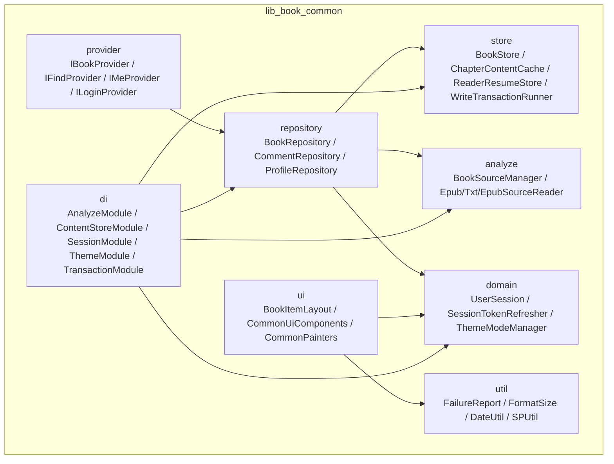

**图表来源**
- [IBookProvider.kt:1-23](file://lib_book_common/src/main/java/com/ebook/common/provider/IBookProvider.kt#L1-L23)
- [BookRepository.kt:1-1105](file://lib_book_common/src/main/java/com/ebook/common/repository/BookRepository.kt#L1-L1105)
- [BookStore.kt](file://lib_book_common/src/main/java/com/ebook/common/store/BookStore.kt)
- [ChapterContentCache.kt](file://lib_book_common/src/main/java/com/ebook/common/store/ChapterContentCache.kt)
- [ReaderResumeStore.kt](file://lib_book_common/src/main/java/com/ebook/common/store/ReaderResumeStore.kt)
- [UserSessionManager.kt](file://lib_book_common/src/main/java/com/ebook/common/domain/UserSessionManager.kt)
- [AnalyzeModule.kt](file://lib_book_common/src/main/java/com/ebook/common/di/AnalyzeModule.kt)

**章节来源**
- [IBookProvider.kt:1-23](file://lib_book_common/src/main/java/com/ebook/common/provider/IBookProvider.kt#L1-L23)
- [IFindProvider.kt:1-13](file://lib_book_common/src/main/java/com/ebook/common/provider/IFindProvider.kt#L1-L13)
- [IMeProvider.kt:1-13](file://lib_book_common/src/main/java/com/ebook/common/provider/IMeProvider.kt#L1-L13)
- [ILoginProvider.kt:1-19](file://lib_book_common/src/main/java/com/ebook/common/provider/ILoginProvider.kt#L1-L19)

## 核心组件
本节聚焦 Provider、Repository、Store、UI 与工具五大维度。

### Provider 接口设计模式
lib_book_common 使用 Provider 接口作为“模块边界”：
- IBookProvider：暴露书架主页面 Composable，支持回调 onGoBookstore 由宿主注入书城跳转能力
- IFindProvider：暴露书城主页面
- IMeProvider：暴露个人中心主页面
- ILoginProvider：暴露服务端登出能力，独立运行时可空实现

这些接口返回 @Composable，避免耦合 Fragment 或 Activity，使宿主 NavHost 直接组合页面，ViewModel 作用域绑定调用处 NavBackStackEntry。跨模块通信不依赖具体实现，实现位于业务模块（例如 module_login 的 LoginProvider），lib_book_common 仅定义契约。

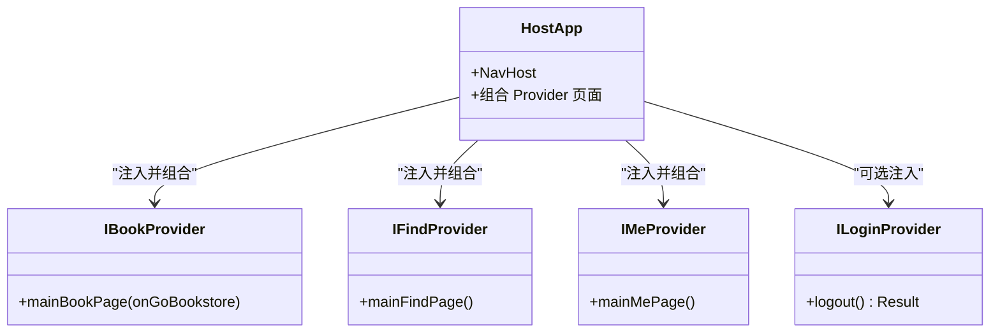

**图表来源**
- [IBookProvider.kt:1-23](file://lib_book_common/src/main/java/com/ebook/common/provider/IBookProvider.kt#L1-L23)
- [IFindProvider.kt:1-13](file://lib_book_common/src/main/java/com/ebook/common/provider/IFindProvider.kt#L1-L13)
- [IMeProvider.kt:1-13](file://lib_book_common/src/main/java/com/ebook/common/provider/IMeProvider.kt#L1-L13)
- [ILoginProvider.kt:1-19](file://lib_book_common/src/main/java/com/ebook/common/provider/ILoginProvider.kt#L1-L19)

**章节来源**
- [IBookProvider.kt:1-23](file://lib_book_common/src/main/java/com/ebook/common/provider/IBookProvider.kt#L1-L23)
- [IFindProvider.kt:1-13](file://lib_book_common/src/main/java/com/ebook/common/provider/IFindProvider.kt#L1-L13)
- [IMeProvider.kt:1-13](file://lib_book_common/src/main/java/com/ebook/common/provider/IMeProvider.kt#L1-L13)
- [ILoginProvider.kt:1-19](file://lib_book_common/src/main/java/com/ebook/common/provider/ILoginProvider.kt#L1-L19)

### BookRepository 数据仓储
BookRepository 是书架领域的单一入口，封装：
- 书架 CRUD、完整信息获取（含 bookInfo 与 chapterList）
- 阅读进度保存（带越界钳制与事件通知）
- 章节正文加载（经 ChapterReader 路由本地与网络书）
- 评论聚合键（book_group）读并集、写主键、合并拆分
- 阅读中换源（switchSource）：原地替换书架条目、映射章节序号
- 内容仓库对账（reconcileContentStore）：启动时同步本地内容与数据库
- 书架变化事件（SharedFlow）替代旧 RxBus

关键设计要点：
- getAllBooksWithDetails 会清理孤立记录（info 为空），保证数据一致性
- getBookWithDetails 不清理，用于恢复场景，避免副作用
- saveProgress 将 durChapter 钳制到 [0, storedChapters - 1]，防止远端目录与本地不一致导致空白页
- 所有 IO 操作切换至 Dispatchers.IO，避免阻塞主线程

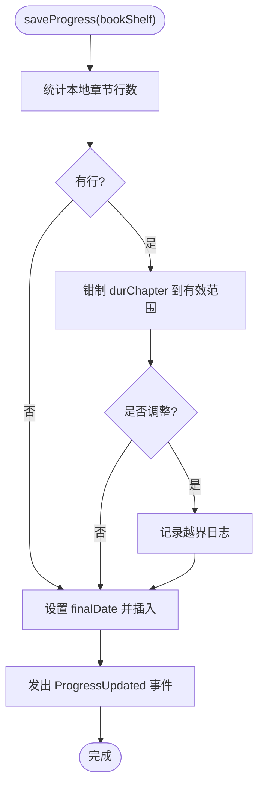

**图表来源**
- [BookRepository.kt:1-1105](file://lib_book_common/src/main/java/com/ebook/common/repository/BookRepository.kt#L1-L1105)

**章节来源**
- [BookRepository.kt:1-1105](file://lib_book_common/src/main/java/com/ebook/common/repository/BookRepository.kt#L1-L1105)

### 领域模型与数据结构
lib_book_common 的领域模型围绕“书—章节—评论—会话—主题”展开：
- 书架与书籍信息：BookShelfEntity、BookInfoEntity（来自 lib_ebook_db），仓库负责关联填充
- 章节列表：ChapterListEntity，按 durChapterIndex 排序
- 评论键：CommentKey、CommentTime、BookComment、BookCommentPage，支持聚合与分页
- 解析元数据：ParsedBookMeta、FileNameMetadata、DuplicateBookDetector，用于本地书导入与去重
- 会话与会令：UserSession、UserSessionManager、AndroidUserSessionManager、SessionTokenRefresher，负责登录态与令牌刷新
- 主题：ThemeModeManager，三态主题管理模式

这些模型通过 Room DAO 与外部 API 交互，并由 Repository 做语义转换。

**章节来源**
- [BookRepository.kt:1-1105](file://lib_book_common/src/main/java/com/ebook/common/repository/BookRepository.kt#L1-L1105)
- [CommentRepository.kt](file://lib_book_common/src/main/java/com/ebook/common/repository/CommentRepository.kt)
- [UserSessionManager.kt](file://lib_book_common/src/main/java/com/ebook/common/domain/UserSessionManager.kt)
- [AndroidUserSessionManager.kt](file://lib_book_common/src/main/java/com/ebook/common/domain/AndroidUserSessionManager.kt)
- [SessionTokenRefresher.kt](file://lib_book_common/src/main/java/com/ebook/common/domain/SessionTokenRefresher.kt)

### 共享 UI 组件
共享 UI 组件基于 Jetpack Compose，强调可组合性与主题一致：
- BookItemLayout：书架条目布局容器，承载封面、标题、作者、阅读进度等
- CommonUiComponents：通用输入、按钮、空态、对话框等基础组件
- CommonPainters：复用画笔、图标绘制逻辑，减少重复资源
- Avatar、BookCover：头像与书籍封面展示

这些组件通常接受主题色、尺寸、点击回调等参数，便于不同模块定制。

**章节来源**
- [BookItemLayout.kt](file://lib_book_common/src/main/java/com/ebook/common/ui/BookItemLayout.kt)
- [CommonUiComponents.kt](file://lib_book_common/src/main/java/com/ebook/common/ui/CommonUiComponents.kt)
- [CommonPainters.kt](file://lib_book_common/src/main/java/com/ebook/common/ui/CommonPainters.kt)

### 通用工具类与消息传递
- FailureReport：结构化失败报告，集中记录错误类型、来源与上下文，便于上层统一提示
- FormatSize：文件大小格式化
- DateUtil：时间格式化与计算
- SPUtil：SharedPreferences 封装，轻量持久化

UserMessage 并非单独类名，而是以 FailureReport 为代表的消息载体；测试用例 UserMessageTest 验证其构造、序列化与展示逻辑。

**章节来源**
- [FailureReport.kt](file://lib_book_common/src/main/java/com/ebook/common/util/FailureReport.kt)
- [FormatSize.kt](file://lib_book_common/src/main/java/com/ebook/common/util/FormatSize.kt)
- [DateUtil.kt](file://lib_book_common/src/main/java/com/ebook/common/util/DateUtil.kt)
- [SPUtil.kt](file://lib_book_common/src/main/java/com/ebook/common/util/SPUtil.kt)
- [UserMessageTest.kt](file://lib_book_common/src/test/java/com/ebook/common/util/UserMessageTest.kt)

### ReaderResumeStore 阅读进度存储
ReaderResumeStore 专注“阅读恢复”相关状态：
- 保存当前阅读位置（章节、滚动偏移、翻页状态）
- 提供读取接口供阅读器恢复上次阅读
- 与 BookRepository.saveProgress 配合，确保“UI 显示”和“持久化落盘”一致

该 Store 与 BookStore（书籍元数据与书架状态）分离，符合单一职责原则。

**章节来源**
- [ReaderResumeStore.kt](file://lib_book_common/src/main/java/com/ebook/common/store/ReaderResumeStore.kt)
- [BookStore.kt](file://lib_book_common/src/main/java/com/ebook/common/store/BookStore.kt)

## 架构总览
lib_book_common 的整体分层如下：
- 表现层：Provider 接口 + Compose UI 组件
- 业务层：Repository（BookRepository、CommentRepository、ProfileRepository）
- 数据层：Store（BookStore、ChapterContentCache、ReaderResumeStore、WriteTransactionRunner）、analyze（本地书解析、书源管理）
- 基础设施：di（Hilt 模块）、domain（会话、令牌、主题）、util（工具类）

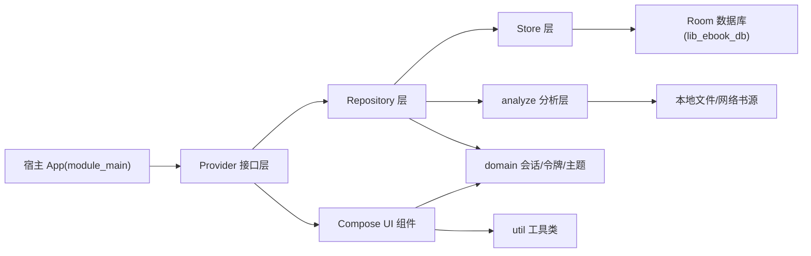

**图表来源**
- [BookRepository.kt:1-1105](file://lib_book_common/src/main/java/com/ebook/common/repository/BookRepository.kt#L1-L1105)
- [AnalyzeModule.kt](file://lib_book_common/src/main/java/com/ebook/common/di/AnalyzeModule.kt)
- [ContentStoreModule.kt](file://lib_book_common/src/main/java/com/ebook/common/di/ContentStoreModule.kt)
- [SessionModule.kt](file://lib_book_common/src/main/java/com/ebook/common/di/SessionModule.kt)
- [ThemeModule.kt](file://lib_book_common/src/main/java/com/ebook/common/di/ThemeModule.kt)
- [TransactionModule.kt](file://lib_book_common/src/main/java/com/ebook/common/di/TransactionModule.kt)

## 详细组件分析

### Provider 接口与扩展点
每个 Provider 是一个扩展点：
- IBookProvider.mainBookPage：接收 onGoBookstore 回调，允许宿主注入书城跳转
- IFindProvider.mainFindPage：书城主界面
- IMeProvider.mainMePage：个人中心主界面
- ILoginProvider.logout：服务端登出，独立运行允许空实现

扩展点设计优点：
- 宿主持有导航与路由上下文，模块不感知具体 route 名称
- 解耦模块间实现，便于单元测试与多宿主调试
- 明确“服务端侧登出”与“本地会话清理”的职责边界

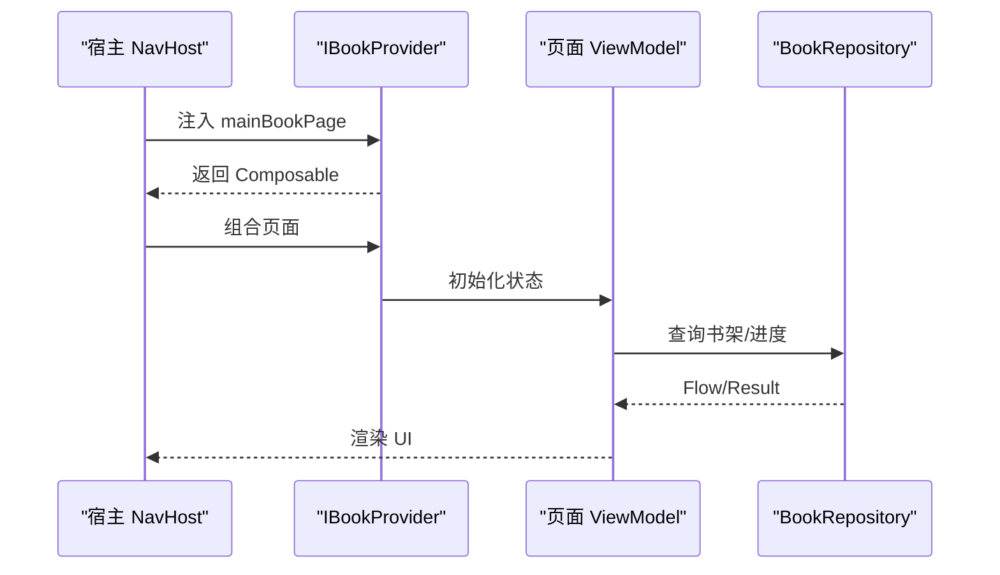

**图表来源**
- [IBookProvider.kt:1-23](file://lib_book_common/src/main/java/com/ebook/common/provider/IBookProvider.kt#L1-L23)
- [BookRepository.kt:1-1105](file://lib_book_common/src/main/java/com/ebook/common/repository/BookRepository.kt#L1-L1105)

**章节来源**
- [IBookProvider.kt:1-23](file://lib_book_common/src/main/java/com/ebook/common/provider/IBookProvider.kt#L1-L23)
- [IFindProvider.kt:1-13](file://lib_book_common/src/main/java/com/ebook/common/provider/IFindProvider.kt#L1-L13)
- [IMeProvider.kt:1-13](file://lib_book_common/src/main/java/com/ebook/common/provider/IMeProvider.kt#L1-L13)
- [ILoginProvider.kt:1-19](file://lib_book_common/src/main/java/com/ebook/common/provider/ILoginProvider.kt#L1-L19)

### BookRepository 数据仓储实现
BookRepository 的职责边界清晰：
- 数据访问：DAO 调用集中在 Repository，避免 UI 直接访问数据库
- 事件发布：SharedFlow<BookShelfEvent> 替代 RxBus，提供更明确的流式事件
- 内容读取：ChapterReader 根据 BookFormat 路由到本地或网络解析器
- 换源逻辑：switchSource 在事务中替换书架条目并映射章节序号，保证阅读体验连贯
- 对账逻辑：reconcileContentStore 启动时校验本地内容与数据库一致性

复杂度分析：
- getAllBooksWithDetails：O(n) 遍历全量结果，排序章节 O(m log m)，清理孤立记录 O(k)
- saveProgress：O(1) 计数 + 钳制 + 写入
- switchSource：涉及多表事务与章节映射，复杂度高但职责内聚

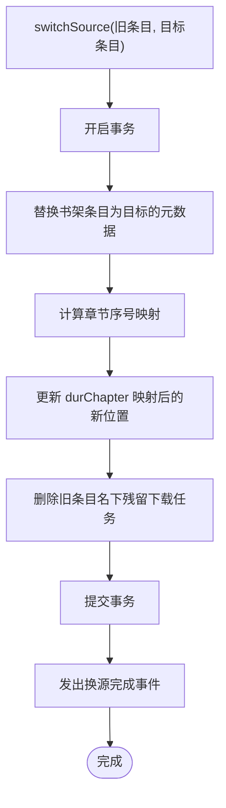

**图表来源**
- [BookRepository.kt:1-1105](file://lib_book_common/src/main/java/com/ebook/common/repository/BookRepository.kt#L1-L1105)

**章节来源**
- [BookRepository.kt:1-1105](file://lib_book_common/src/main/java/com/ebook/common/repository/BookRepository.kt#L1-L1105)

### 领域模型与数据流转
数据流转路径：
- 书架列表：DAO → Repository → ViewModel → UI
- 章节内容：ChapterReader → 本地文件或网络书源 → ChapterContentCache → UI
- 评论：API/DAO → CommentRepository → ViewModel → UI
- 会话：UserSessionManager → AndroidUserSessionManager → SessionTokenRefresher → 拦截器/网络层

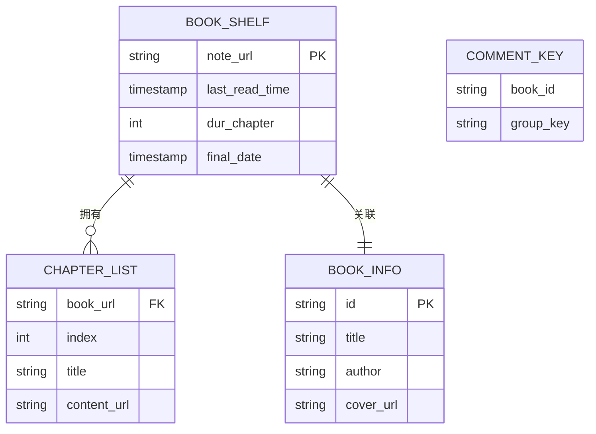

**图表来源**
- [BookRepository.kt:1-1105](file://lib_book_common/src/main/java/com/ebook/common/repository/BookRepository.kt#L1-L1105)

**章节来源**
- [BookRepository.kt:1-1105](file://lib_book_common/src/main/java/com/ebook/common/repository/BookRepository.kt#L1-L1105)

### 共享 UI 组件与样式定制
BookItemLayout 等组件通常具备以下定制点：
- 主题色与字体大小
- 封面比例与占位图
- 进度条颜色与文案格式
- 点击回调与长按菜单

CommonPainters 提供统一的画笔与图标绘制，减少重复资源；Avatar 与 BookCover 分别负责头像与封面加载与展示。

**章节来源**
- [BookItemLayout.kt](file://lib_book_common/src/main/java/com/ebook/common/ui/BookItemLayout.kt)
- [CommonUiComponents.kt](file://lib_book_common/src/main/java/com/ebook/common/ui/CommonUiComponents.kt)
- [CommonPainters.kt](file://lib_book_common/src/main/java/com/ebook/common/ui/CommonPainters.kt)

### 消息传递与异常处理
FailureReport 作为统一失败载体：
- 包含错误类型、来源、附加字段
- 可序列化为日志或用户提示
- 上层统一消费 FailureReport，决定提示策略（Toast、Snackbar、对话框）

UserMessageTest 覆盖构造、toString、equals 等断言，保障消息对象稳定性。

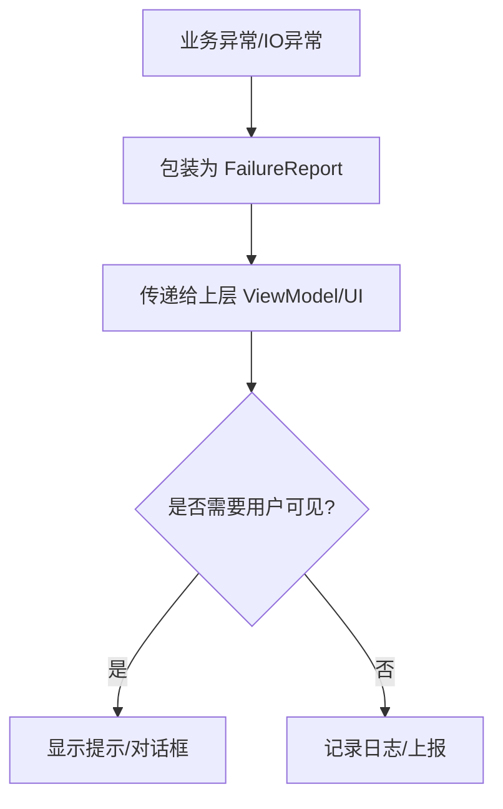

**图表来源**
- [FailureReport.kt](file://lib_book_common/src/main/java/com/ebook/common/util/FailureReport.kt)
- [UserMessageTest.kt](file://lib_book_common/src/test/java/com/ebook/common/util/UserMessageTest.kt)

**章节来源**
- [FailureReport.kt](file://lib_book_common/src/main/java/com/ebook/common/util/FailureReport.kt)
- [UserMessageTest.kt](file://lib_book_common/src/test/java/com/ebook/common/util/UserMessageTest.kt)

### ReaderResumeStore 状态管理
ReaderResumeStore 的状态流转：
- 开始阅读：初始化位置与翻页状态
- 阅读中：持续更新 durChapter、滚动偏移
- 退出阅读：持久化恢复点
- 恢复阅读：读取上次位置并定位到对应章节

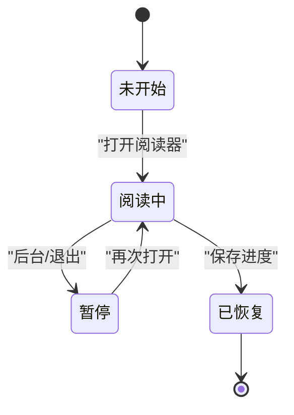

**图表来源**
- [ReaderResumeStore.kt](file://lib_book_common/src/main/java/com/ebook/common/store/ReaderResumeStore.kt)

**章节来源**
- [ReaderResumeStore.kt](file://lib_book_common/src/main/java/com/ebook/common/store/ReaderResumeStore.kt)

## 依赖关系分析
lib_book_common 的依赖方向遵循单向依赖：
- Provider 依赖 Repository（不反向）
- Repository 依赖 Store、analyze、domain
- Store 依赖 DAO、文件系统、网络缓存
- domain 不依赖其他层
- ui 依赖 domain 与 util
- di 模块向各层注入实现

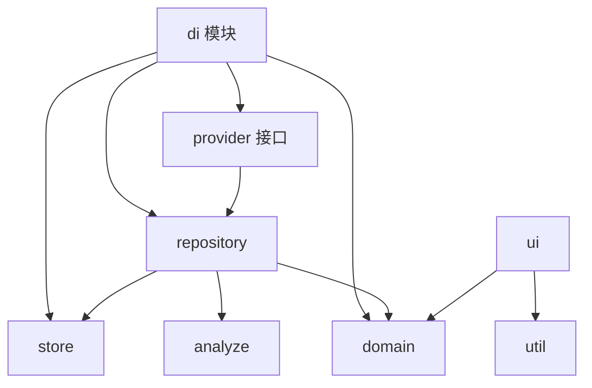

**图表来源**
- [AnalyzeModule.kt](file://lib_book_common/src/main/java/com/ebook/common/di/AnalyzeModule.kt)
- [ContentStoreModule.kt](file://lib_book_common/src/main/java/com/ebook/common/di/ContentStoreModule.kt)
- [SessionModule.kt](file://lib_book_common/src/main/java/com/ebook/common/di/SessionModule.kt)
- [ThemeModule.kt](file://lib_book_common/src/main/java/com/ebook/common/di/ThemeModule.kt)
- [TransactionModule.kt](file://lib_book_common/src/main/java/com/ebook/common/di/TransactionModule.kt)

**章节来源**
- [AnalyzeModule.kt](file://lib_book_common/src/main/java/com/ebook/common/di/AnalyzeModule.kt)
- [ContentStoreModule.kt](file://lib_book_common/src/main/java/com/ebook/common/di/ContentStoreModule.kt)
- [SessionModule.kt](file://lib_book_common/src/main/java/com/ebook/common/di/SessionModule.kt)
- [ThemeModule.kt](file://lib_book_common/src/main/java/com/ebook/common/di/ThemeModule.kt)
- [TransactionModule.kt](file://lib_book_common/src/main/java/com/ebook/common/di/TransactionModule.kt)

## 性能与缓存特性
- 章节内容缓存：ChapterContentCache 缓存章节正文，减少重复解析与网络请求
- 事务写入：WriteTransactionRunner 批量写入库，降低锁竞争与碎片化
- 流式数据：observeBookShelf 使用 Flow，避免频繁刷新
- 调度器：所有 IO 切换至 Dispatchers.IO，避免阻塞主线程
- 去重与规范化：TextNormalizer、DuplicateBookDetector 减少重复数据与解析开销

建议：
- 大列表分页加载，避免一次性加载全部章节
- 图片与封面使用懒加载与占位图
- 定期清理无效缓存与孤立记录

[本节为通用指导，不直接分析具体文件]

## 集成示例
以下示例展示如何在业务模块中通过 Provider 接口调用共享功能，并处理数据流与错误。

### 在宿主中组合书架页面
- 通过 Hilt 注入 IBookProvider
- 将 mainBookPage 作为 NavHost 的一个目的地
- 传入 onGoBookstore 回调，指向宿主的书城路由

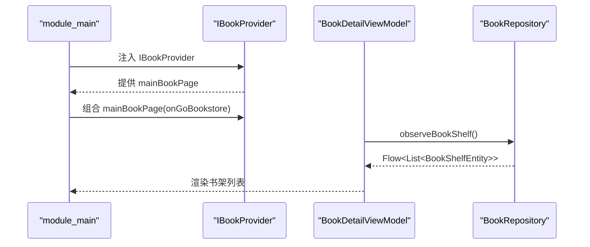

**图表来源**
- [IBookProvider.kt:1-23](file://lib_book_common/src/main/java/com/ebook/common/provider/IBookProvider.kt#L1-L23)
- [BookRepository.kt:1-1105](file://lib_book_common/src/main/java/com/ebook/common/repository/BookRepository.kt#L1-L1105)

### 处理登录登出
- 尝试注入 ILoginProvider
- 若存在，调用 logout()，捕获 Result 决定是否提示
- 无论成功失败，都调用 UserSessionManager.clearSession 清理本地会话

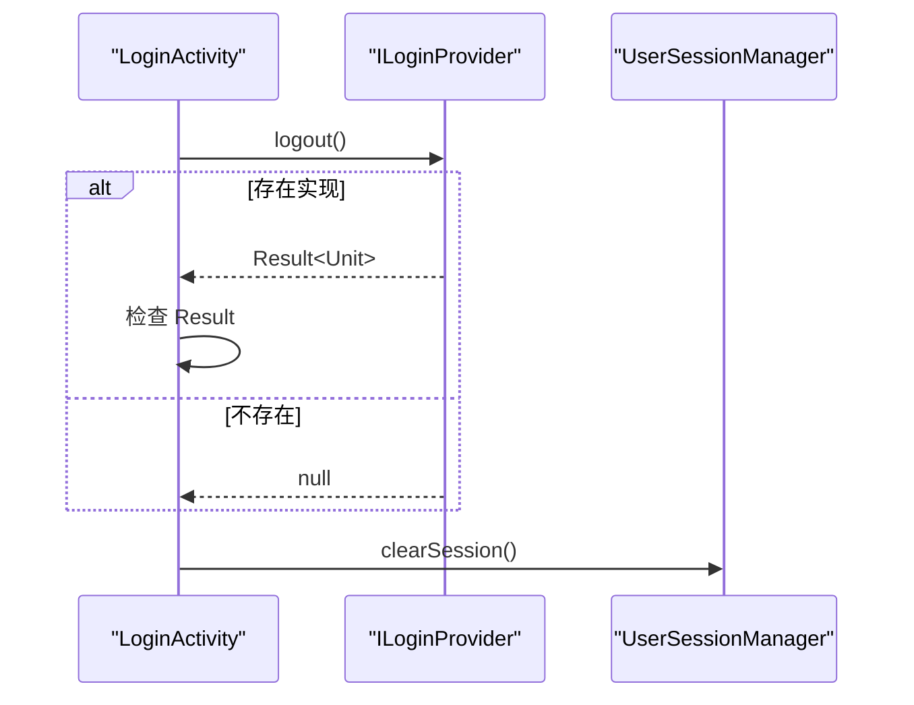

**图表来源**
- [ILoginProvider.kt:1-19](file://lib_book_common/src/main/java/com/ebook/common/provider/ILoginProvider.kt#L1-L19)
- [UserSessionManager.kt](file://lib_book_common/src/main/java/com/ebook/common/domain/UserSessionManager.kt)

**章节来源**
- [ILoginProvider.kt:1-19](file://lib_book_common/src/main/java/com/ebook/common/provider/ILoginProvider.kt#L1-L19)
- [UserSessionManager.kt](file://lib_book_common/src/main/java/com/ebook/common/domain/UserSessionManager.kt)

### 处理书架事件与错误
- 订阅 BookRepository.bookShelfEvents
- 根据事件类型（ProgressUpdated、SwitchSourceCompleted 等）刷新 UI
- 使用 FailureReport 统一处理异常

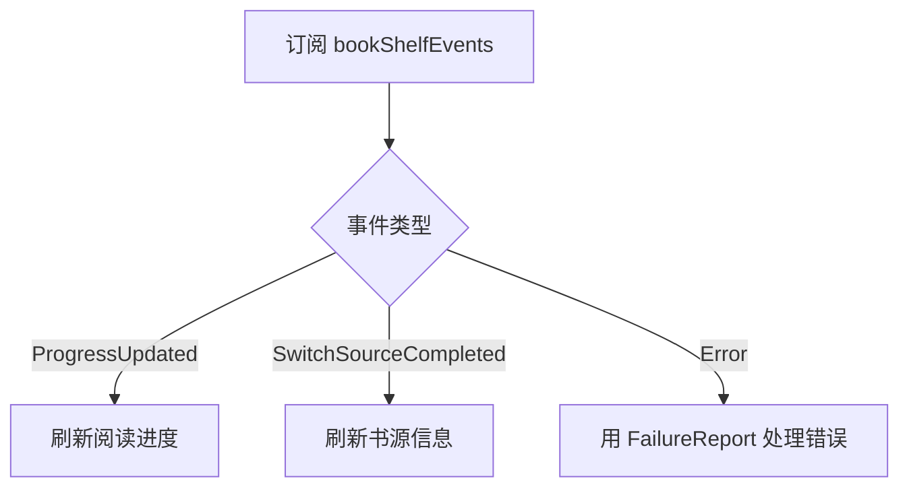

**图表来源**
- [BookRepository.kt:1-1105](file://lib_book_common/src/main/java/com/ebook/common/repository/BookRepository.kt#L1-L1105)
- [FailureReport.kt](file://lib_book_common/src/main/java/com/ebook/common/util/FailureReport.kt)

**章节来源**
- [BookRepository.kt:1-1105](file://lib_book_common/src/main/java/com/ebook/common/repository/BookRepository.kt#L1-L1105)
- [FailureReport.kt](file://lib_book_common/src/main/java/com/ebook/common/util/FailureReport.kt)

## 故障排查指南
常见问题与定位方法：
- 书架条目无章节：检查 getBookWithDetails 是否补齐 chapterList，确认排序逻辑
- 阅读进度错乱：查看 saveProgress 的钳制日志，确认 durChapter 与库内行数一致
- 换源后进度丢失：检查 switchSource 的章节序号映射是否正确
- 评论内容为空：确认 CommentKey 聚合键生成规则与 DAO 查询条件
- UI 空白：确认 BookItemLayout 的参数与主题配置，检查 CommonPainters 是否加载正确
- 登录失败：区分服务端登出失败与本地会话清理，优先处理本地清理

建议：
- 使用 FailureReport 统一记录错误上下文
- 在 ViewModel 层订阅 SharedFlow，避免内存泄漏
- 在单元测试中使用 FakeBookSourceManager、FakeDaos 等模拟依赖

**章节来源**
- [BookRepository.kt:1-1105](file://lib_book_common/src/main/java/com/ebook/common/repository/BookRepository.kt#L1-L1105)
- [UserMessageTest.kt](file://lib_book_common/src/test/java/com/ebook/common/util/UserMessageTest.kt)
- [BookItemFrameTest.kt](file://lib_book_common/src/test/java/com/ebook/common/ui/BookItemFrameTest.kt)

## 结论
lib_book_common 通过 Provider 接口、Repository 仓储、Store 状态管理与共享 UI 组件，构建了一个可扩展、可测试、可复用的书架与阅读核心层。其设计强调：
- 清晰的模块边界与跨模块通信契约
- 数据一致性保护（孤立记录清理、进度钳制、事务写入）
- 流式事件驱动与统一错误处理
- 可组合的 Compose UI 与主题化定制

在集成时，应遵循 Provider 契约、Repository 数据流、FailureReport 错误处理与 ReaderResumeStore 状态管理规范，以保证系统稳定与可维护性。

## 附录：领域模型与接口清单
- Provider 接口：IBookProvider、IFindProvider、IMeProvider、ILoginProvider
- Repository：BookRepository、CommentRepository、ProfileRepository
- Store：BookStore、ChapterContentCache、ReaderResumeStore、WriteTransactionRunner
- Domain：UserSession、UserSessionManager、AndroidUserSessionManager、SessionTokenRefresher、ThemeModeManager
- UI：BookItemLayout、CommonUiComponents、CommonPainters
- Util：FailureReport、FormatSize、DateUtil、SPUtil

[本节汇总引用，不直接分析具体文件]