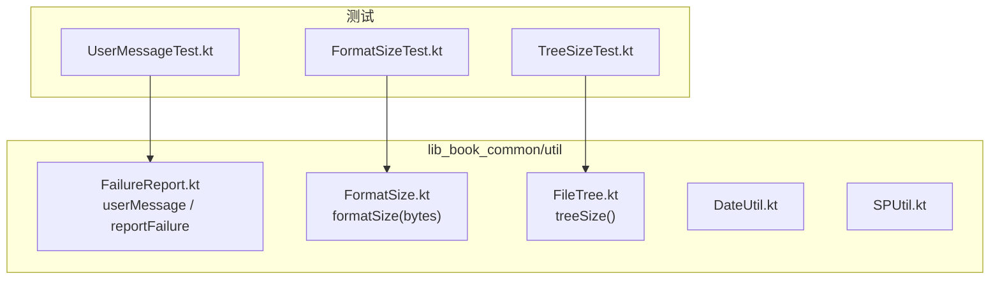
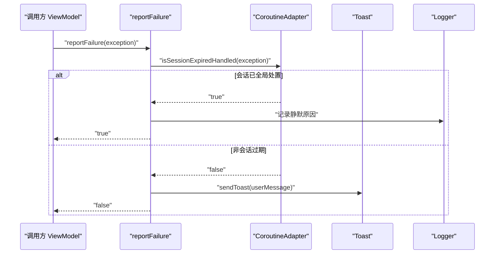
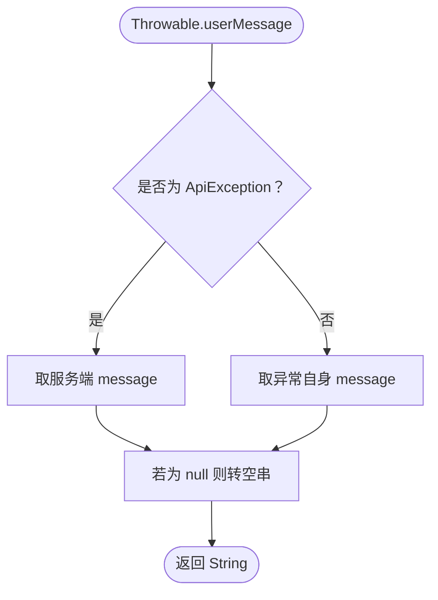
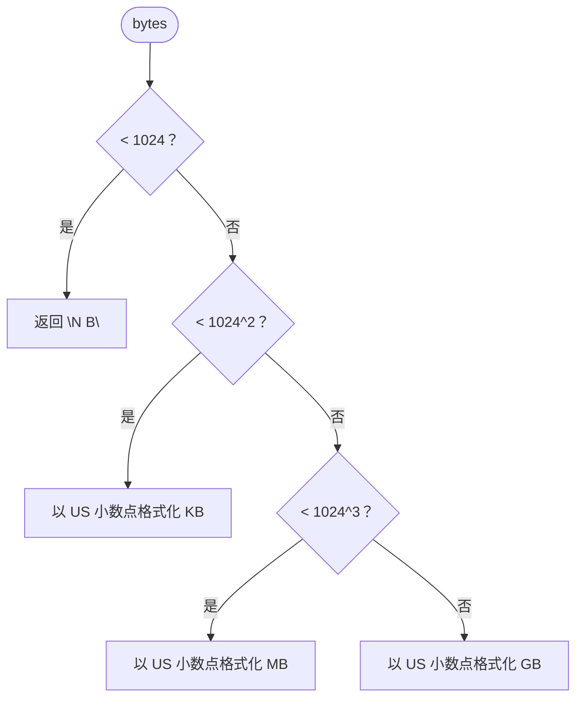
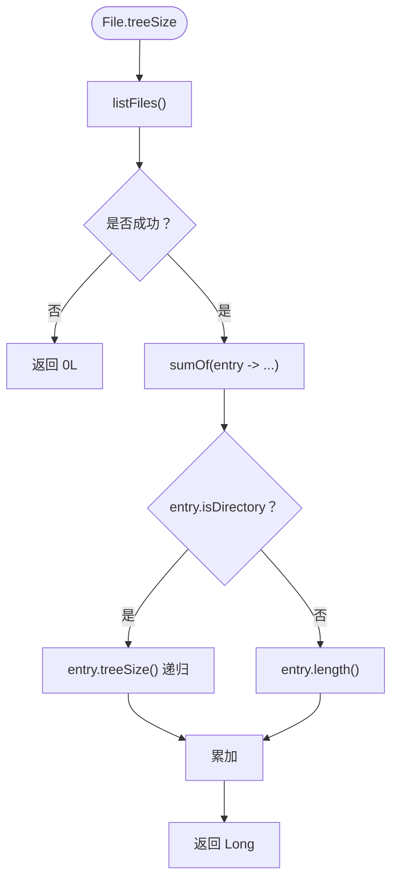
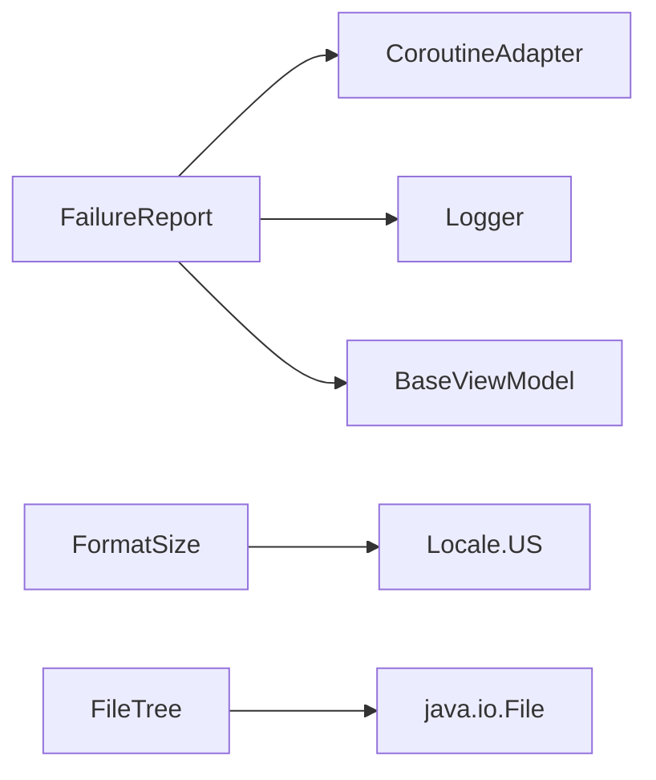

# 工具和实用类

<cite>
**本文引用的文件**   
- [FailureReport.kt](file://lib_book_common/src/main/java/com/ebook/common/util/FailureReport.kt)
- [FormatSize.kt](file://lib_book_common/src/main/java/com/ebook/common/util/FormatSize.kt)
- [FileTree.kt](file://lib_book_common/src/main/java/com/ebook/common/util/FileTree.kt)
- [DateUtil.kt](file://lib_book_common/src/main/java/com/ebook/common/util/DateUtil.kt)
- [SPUtil.kt](file://lib_book_common/src/main/java/com/ebook/common/util/SPUtil.kt)
- [UserMessageTest.kt](file://lib_book_common/src/test/java/com/ebook/common/util/UserMessageTest.kt)
- [FormatSizeTest.kt](file://lib_book_common/src/test/java/com/ebook/common/util/FormatSizeTest.kt)
- [TreeSizeTest.kt](file://lib_book_common/src/test/java/com/ebook/common/util/TreeSizeTest.kt)
</cite>

## 目录
1. [简介](#简介)
2. [项目结构](#项目结构)
3. [核心组件](#核心组件)
4. [架构总览](#架构总览)
5. [详细组件分析](#详细组件分析)
6. [依赖关系分析](#依赖关系分析)
7. [性能与内存考量](#性能与内存考量)
8. [故障排查指南](#故障排查指南)
9. [结论](#结论)
10. [附录：测试用例说明](#附录测试用例说明)

## 简介
本文件聚焦 lib_book_common 模块中的工具与实用类，围绕以下目标展开：
- 解释 UserMessage 消息传递机制的实现、消息类型、显示策略和用户反馈处理。
- 详细说明 FormatSize 等格式化工具的算法实现和使用场景。
- 文档化 TreeSize 等文件操作工具的功能特性、边界条件与性能考虑。
- 总结通用工具类的设计原则：纯函数、无副作用、可测试性、单一职责。
- 提供异常处理和错误日志记录策略。
- 给出性能优化建议和内存使用指导。

这些工具主要位于 util 包中，承担跨模块复用的格式化、文件统计、失败上报和基础能力封装职责。

## 项目结构
lib_book_common 的工具集中在 `com.ebook.common.util` 包下，核心文件包括：
- FailureReport.kt：统一的用户可见文案口径与失败上报入口。
- FormatSize.kt：字节数到可读大小的转换。
- FileTree.kt：递归计算目录树占用大小。
- DateUtil.kt、SPUtil.kt：日期与 SharedPreferences 相关的基础工具（具体实现未在本文件中展示）。

**图表来源**
- [FailureReport.kt:1-53](file://lib_book_common/src/main/java/com/ebook/common/util/FailureReport.kt#L1-L53)
- [FormatSize.kt:1-20](file://lib_book_common/src/main/java/com/ebook/common/util/FormatSize.kt#L1-L20)
- [FileTree.kt:1-16](file://lib_book_common/src/main/java/com/ebook/common/util/FileTree.kt#L1-L16)
- [UserMessageTest.kt:1-36](file://lib_book_common/src/test/java/com/ebook/common/util/UserMessageTest.kt#L1-L36)
- [FormatSizeTest.kt](file://lib_book_common/src/test/java/com/ebook/common/util/FormatSizeTest.kt)
- [TreeSizeTest.kt](file://lib_book_common/src/test/java/com/ebook/common/util/TreeSizeTest.kt)

**章节来源**
- [FailureReport.kt:1-53](file://lib_book_common/src/main/java/com/ebook/common/util/FailureReport.kt#L1-L53)
- [FormatSize.kt:1-20](file://lib_book_common/src/main/java/com/ebook/common/util/FormatSize.kt#L1-L20)
- [FileTree.kt:1-16](file://lib_book_common/src/main/java/com/ebook/common/util/FileTree.kt#L1-L16)

## 核心组件
- userMessage：将任意 Throwable 转换为面向用户的文案。对业务异常优先取服务端下发的原文；普通异常取其 message；message 为 null 时返回空串。
- reportFailure：BaseViewModel 扩展方法，统一失败上报。会话过期由全局处置则仅记录日志并返回 true；否则发送 Toast 提示并返回 false。
- formatSize：将字节数按 B/KB/MB/GB 分级格式化，固定 US 小数点格式，单位符号不参与本地化。
- treeSize：递归计算目录树中所有普通文件的长度总和；目录不存在或列举失败按 0 处理。

**章节来源**
- [FailureReport.kt:1-53](file://lib_book_common/src/main/java/com/ebook/common/util/FailureReport.kt#L1-L53)
- [FormatSize.kt:1-20](file://lib_book_common/src/main/java/com/ebook/common/util/FormatSize.kt#L1-L20)
- [FileTree.kt:1-16](file://lib_book_common/src/main/java/com/ebook/common/util/FileTree.kt#L1-L16)

## 架构总览
用户侧的错误反馈路径被收敛到 FailureReport，避免多处复制“会话过期”的判断逻辑，确保一次失败只产生一次用户可见提示。

**图表来源**
- [FailureReport.kt:1-53](file://lib_book_common/src/main/java/com/ebook/common/util/FailureReport.kt#L1-L53)
- [UserMessageTest.kt:1-36](file://lib_book_common/src/test/java/com/ebook/common/util/UserMessageTest.kt#L1-L36)

## 详细组件分析

### 用户消息与失败上报（UserMessage / FailureReport）
- 消息类型
  - 业务异常：对应 CoroutineAdapter.ApiException，文案取自服务端 message，不暴露内部类名和业务码。
  - 本地异常：取异常自身的 message。
  - 空消息：message 为 null 时归为空串，而不是字面量 “null”。
- 显示策略
  - 会话过期已由网络层全局处置：reportFailure 不弹 Toast，仅记录警告日志，返回 true。
  - 其他失败：通过 BaseViewModel.sendToast 显示用户可见文案，返回 false。
- 用户反馈处理
  - 调用方如需根据失败类型做不同收尾动作，可直接判断返回值，避免再次复制会话过期判断。

**图表来源**
- [FailureReport.kt:1-53](file://lib_book_common/src/main/java/com/ebook/common/util/FailureReport.kt#L1-L53)
- [UserMessageTest.kt:1-36](file://lib_book_common/src/test/java/com/ebook/common/util/UserMessageTest.kt#L1-L36)

**章节来源**
- [FailureReport.kt:1-53](file://lib_book_common/src/main/java/com/ebook/common/util/FailureReport.kt#L1-L53)
- [UserMessageTest.kt:1-36](file://lib_book_common/src/test/java/com/ebook/common/util/UserMessageTest.kt#L1-L36)

### 文件大小格式化（FormatSize）
- 算法要点
  - 小于 1024 字节：直接输出 “N B”。
  - 小于 1024²：保留一位小数，单位 KB。
  - 小于 1024³：保留一位小数，单位 MB。
  - 大于等于 1024³：保留两位小数，单位 GB。
- 本地化策略
  - 数字格式固定 Locale.US，保证跨环境一致的小数点。
  - 单位符号（B/KB/MB/GB）采用 SI 约定，不参与本地化。
- 使用场景
  - 导入页与缓存管理页都需要把字节数展示给用户，集中到一个函数以避免口径分叉。

**图表来源**
- [FormatSize.kt:1-20](file://lib_book_common/src/main/java/com/ebook/common/util/FormatSize.kt#L1-L20)

**章节来源**
- [FormatSize.kt:1-20](file://lib_book_common/src/main/java/com/ebook/common/util/FormatSize.kt#L1-L20)

### 目录树大小统计（FileTree.treeSize）
- 功能定义
  - 递归求目录下所有普通文件的字节长度之和。
  - 目录本身不计入 inode 大小，更符合用户对“内容占用”的认知。
  - listFiles 为 null（目录不存在或列举失败）时返回 0，简化调用方特判。
- 使用场景
  - 内容仓库（books 目录下的章文件）与应用缓存（cacheDir）需要统一计算总量。

**图表来源**
- [FileTree.kt:1-16](file://lib_book_common/src/main/java/com/ebook/common/util/FileTree.kt#L1-L16)

**章节来源**
- [FileTree.kt:1-16](file://lib_book_common/src/main/java/com/ebook/common/util/FileTree.kt#L1-L16)

### 基础工具（DateUtil、SPUtil）
- DateUtil 与 SPUtil 作为领域无关的基础工具，提供日期处理与 SharedPreferences 访问能力。其具体实现不在本节文件范围内，但与其他工具共同构成 lib_book_common 的复用层。

**章节来源**
- [DateUtil.kt](file://lib_book_common/src/main/java/com/ebook/common/util/DateUtil.kt)
- [SPUtil.kt](file://lib_book_common/src/main/java/com/ebook/common/util/SPUtil.kt)

## 依赖关系分析
- FailureReport 依赖
  - CoroutineAdapter：用于识别 ApiException 与判断会话过期是否已全局处置。
  - Logger：记录会话过期静默原因。
  - BaseViewModel：通过 sendToast 向 UI 层发送提示。
- FormatSize 依赖
  - java.util.Locale：固定数字格式为 US。
- FileTree 依赖
  - java.io.File：递归遍历文件系统。

**图表来源**
- [FailureReport.kt:1-53](file://lib_book_common/src/main/java/com/ebook/common/util/FailureReport.kt#L1-L53)
- [FormatSize.kt:1-20](file://lib_book_common/src/main/java/com/ebook/common/util/FormatSize.kt#L1-L20)
- [FileTree.kt:1-16](file://lib_book_common/src/main/java/com/ebook/common/util/FileTree.kt#L1-L16)

**章节来源**
- [FailureReport.kt:1-53](file://lib_book_common/src/main/java/com/ebook/common/util/FailureReport.kt#L1-L53)
- [FormatSize.kt:1-20](file://lib_book_common/src/main/java/com/ebook/common/util/FormatSize.kt#L1-L20)
- [FileTree.kt:1-16](file://lib_book_common/src/main/java/com/ebook/common/util/FileTree.kt#L1-L16)

## 性能与内存考量
- userMessage
  - 时间复杂度 O(1)，空间复杂度 O(1)。
  - 纯函数，无状态、无 I/O，适合在热路径频繁调用。
- reportFailure
  - 仅在非会话过期分支触发 UI 提示；会话过期分支仅写日志，避免重复弹窗导致的 UI 抖动。
  - 建议调用方根据返回值进行差异化收尾，不要再次复制会话过期判断逻辑。
- formatSize
  - 时间复杂度 O(1)，空间复杂度 O(1)。
  - 避免重复创建复杂对象；建议使用 StringBuilder 或预分配缓冲以减少字符串拼接开销（当前实现简单且开销较低）。
- treeSize
  - 时间复杂度 O(N)，N 为目录树中文件数量；空间复杂度取决于递归深度。
  - 对于深层目录树，注意栈深度风险；对超大目录建议分批或限制深度。
  - 对磁盘 I/O 敏感场景，建议在后台线程执行，避免阻塞主线程。

[本节为通用性能建议，不涉及特定代码行]

## 故障排查指南
- 用户看到 “null” 文案
  - 现象：本地异常 message 为 null 时，旧逻辑可能拼接出字面量 “null”。
  - 定位：确认是否使用 userMessage 获取文案，而不是直接使用 exception.message。
  - 修复：统一使用 userMessage，空消息会归为空串。
- 用户重复看到登录过期提示
  - 现象：多个 onFailure 分支各自弹出 Toast。
  - 定位：检查是否绕过 reportFailure 自行处理会话过期。
  - 修复：让 reportFailure 负责会话过期的静默处理，调用方只做必要收尾。
- 目录大小显示异常
  - 现象：目录不存在或列举失败时出现 NPE 或负数。
  - 定位：确认 treeSize 返回值处理逻辑。
  - 修复：treeSize 在列举失败时返回 0L，调用方可安全显示 0。

**章节来源**
- [FailureReport.kt:1-53](file://lib_book_common/src/main/java/com/ebook/common/util/FailureReport.kt#L1-L53)
- [FileTree.kt:1-16](file://lib_book_common/src/main/java/com/ebook/common/util/FileTree.kt#L1-L16)

## 结论
lib_book_common 的工具层以纯函数和无副作用为核心设计原则，提供了稳定的用户文案口径、统一的失败上报入口、一致的字节数格式化以及可靠的目录树大小统计。通过将常见模式收敛到少量工具函数，减少了跨模块的逻辑复制，提升了可测试性与一致性。在使用时，应优先调用 userMessage 与 reportFailure，避免重复实现会话过期处理；对大目录统计应关注线程与性能影响。

[本节为总结性内容，不涉及特定代码行]

## 附录：测试用例说明
- UserMessageTest
  - 验证业务异常取服务端文案且不泄露内部信息。
  - 验证本地异常取自身 message。
  - 验证 message 为 null 时返回空串。
- FormatSizeTest
  - 覆盖 B/KB/MB/GB 各区间边界值。
- TreeSizeTest
  - 覆盖目录存在、目录不存在、空目录与含子目录等场景。

**章节来源**
- [UserMessageTest.kt:1-36](file://lib_book_common/src/test/java/com/ebook/common/util/UserMessageTest.kt#L1-L36)
- [FormatSizeTest.kt](file://lib_book_common/src/test/java/com/ebook/common/util/FormatSizeTest.kt)
- [TreeSizeTest.kt](file://lib_book_common/src/test/java/com/ebook/common/util/TreeSizeTest.kt)