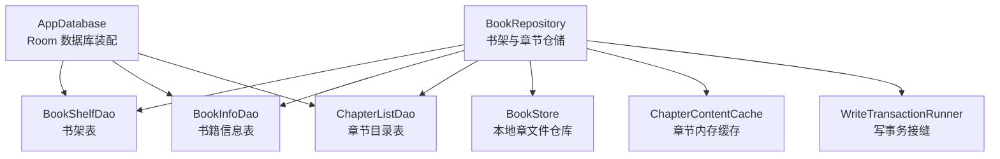
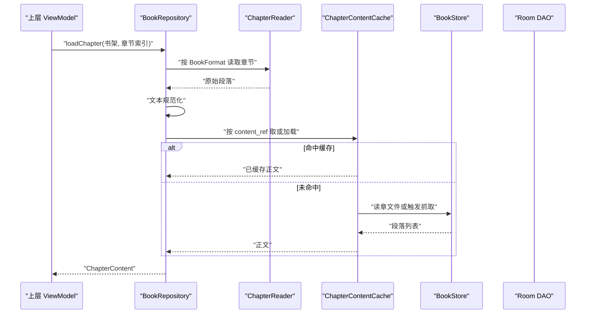
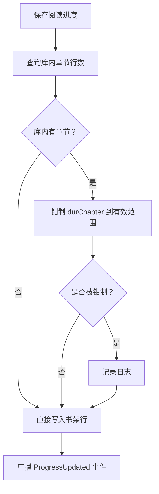
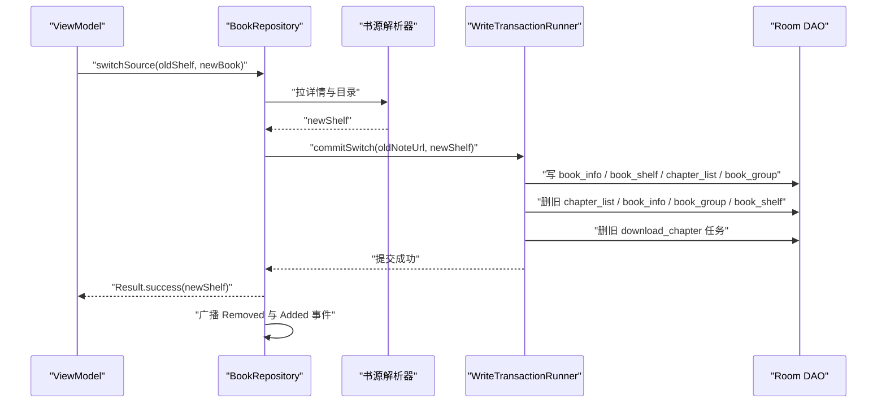
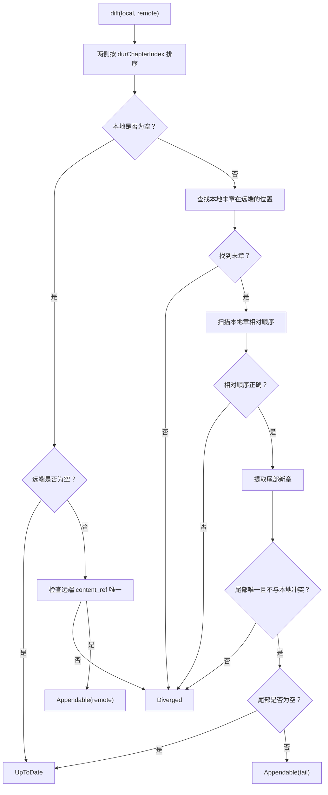
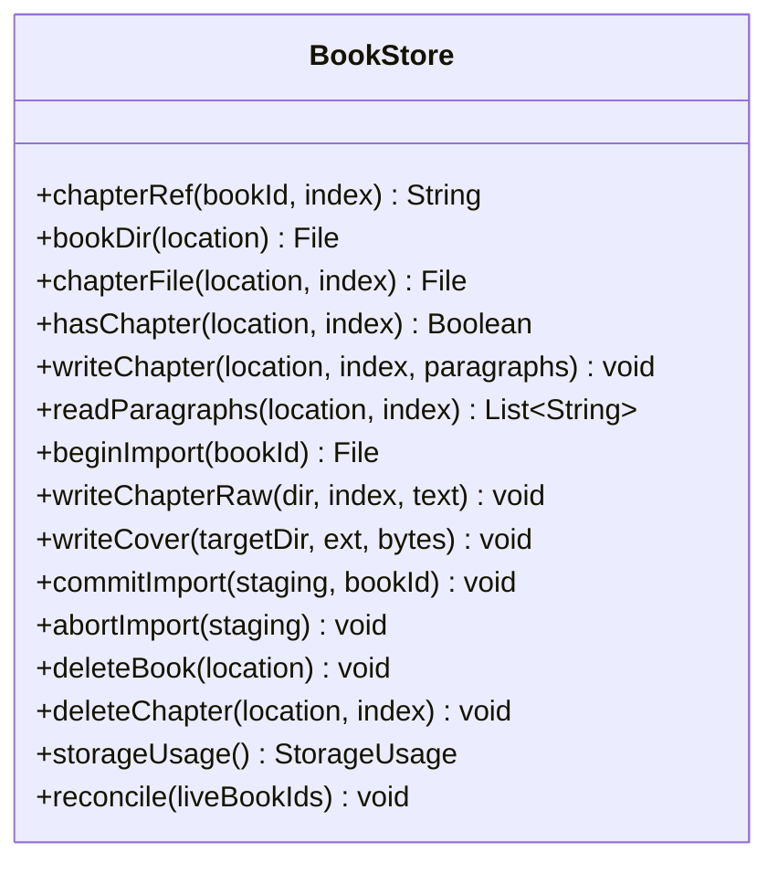
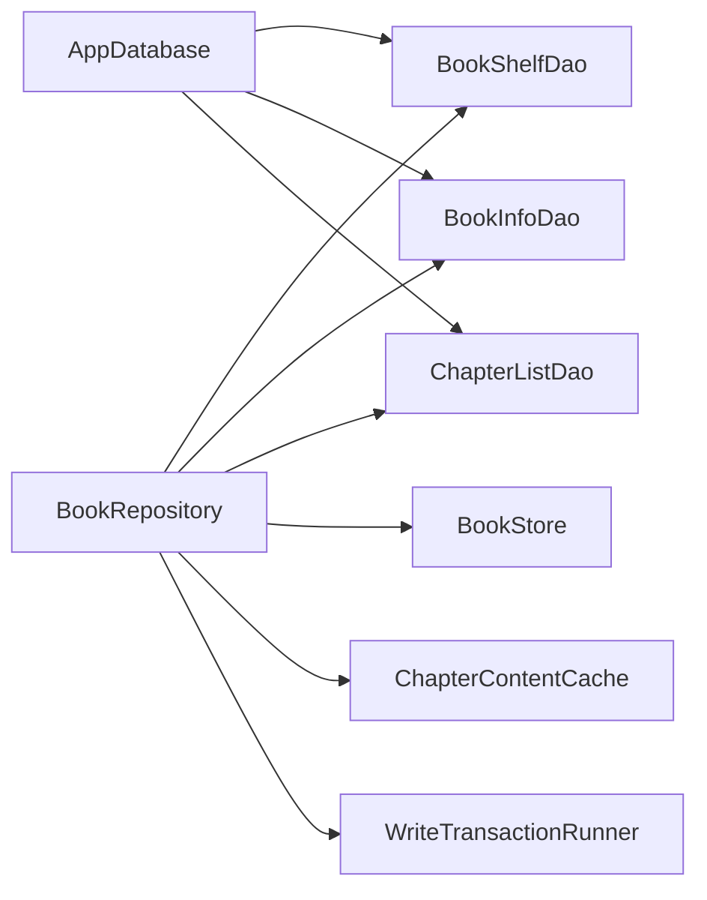
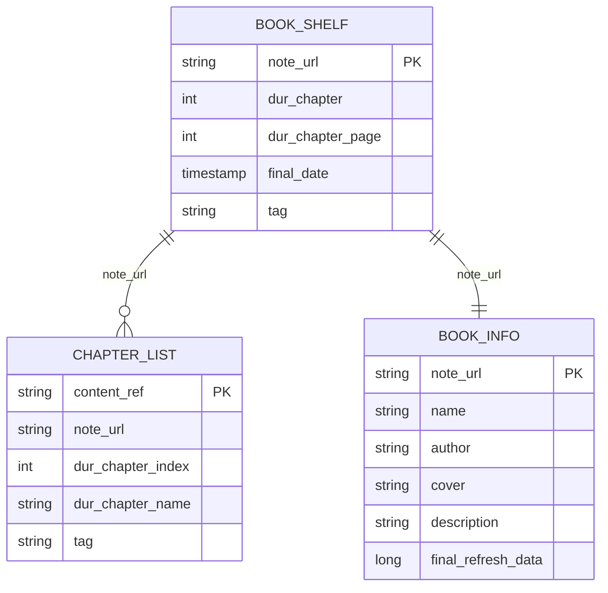

# 数据仓储层

<cite>
**本文引用的文件**
- [BookRepository.kt](file://lib_book_common/src/main/java/com/ebook/common/repository/BookRepository.kt)
- [ChapterTocDiff.kt](file://lib_book_common/src/main/java/com/ebook/common/repository/ChapterTocDiff.kt)
- [BookStore.kt](file://lib_book_common/src/main/java/com/ebook/common/store/BookStore.kt)
- [ChapterContentCache.kt](file://lib_book_common/src/main/java/com/ebook/common/store/ChapterContentCache.kt)
- [WriteTransactionRunner.kt](file://lib_book_common/src/main/java/com/ebook/common/store/WriteTransactionRunner.kt)
- [ReaderResumeStore.kt](file://lib_book_common/src/main/java/com/ebook/common/store/ReaderResumeStore.kt)
- [AppDatabase.kt](file://lib_ebook_db/src/main/java/com/ebook/db/AppDatabase.kt)
- [BookShelfDao.kt](file://lib_ebook_db/src/main/java/com/ebook/db/dao/BookShelfDao.kt)
- [BookInfoDao.kt](file://lib_ebook_db/src/main/java/com/ebook/db/dao/BookInfoDao.kt)
- [ChapterListDao.kt](file://lib_ebook_db/src/main/java/com/ebook/db/dao/ChapterListDao.kt)
</cite>

## 目录
1. [引言](#引言)
2. [项目结构定位](#项目结构定位)
3. [核心组件总览](#核心组件总览)
4. [架构与数据流设计](#架构与数据流设计)
5. [详细组件分析](#详细组件分析)
6. [依赖关系分析](#依赖关系分析)
7. [异步处理与响应式模型](#异步处理与响应式模型)
8. [缓存策略与失效机制](#缓存策略与失效机制)
9. [网络与本地数据同步](#网络与本地数据同步)
10. [数据库层交互方式](#数据库层交互方式)
11. [ViewModel 使用示例](#viewmodel-使用示例)
12. [性能优化建议](#性能优化建议)
13. [故障排查指南](#故障排查指南)
14. [结论](#结论)

## 引言
本技术文档聚焦 `lib_book_common` 的数据仓储层，围绕 `BookRepository` 的职责边界、数据流设计、缓存策略、异步处理模式、数据库交互、以及网络与本地数据一致性展开。仓库层是书架业务的核心协调者：它把 UI 的“书架、阅读、换源、追更”等需求，统一转换为对 Room DAO、本地内容仓库、内存缓存和书源解析器的调用，并通过事件与 Flow 把状态变化推给上层。

## 项目结构定位
在模块中，仓储层位于 `com.ebook.common.repository`，并与存储层 `com.ebook.common.store`、数据库层 `com.ebook.db` 紧密协作：
- `BookRepository` 负责书架 CRUD、阅读进度、章节读取、换源、目录追更、评论键合并拆分、内容仓库对账和事件广播。
- `BookStore` 负责本地书籍正文的章文件读写、封面写入、导入暂存、占用统计和对账清理。
- `ChapterContentCache` 负责章节正文的内存缓存。
- `WriteTransactionRunner` 提供可测试的事务执行接口。
- `ReaderResumeStore` 负责异常恢复标记，不属于仓储层但与其共享书架条目语义。
- `AppDatabase` 与三个核心 DAO（`BookShelfDao`、`BookInfoDao`、`ChapterListDao`）构成持久化入口。

**图表来源**
- [BookRepository.kt:1-200](file://lib_book_common/src/main/java/com/ebook/common/repository/BookRepository.kt#L1-L200)
- [BookStore.kt:1-216](file://lib_book_common/src/main/java/com/ebook/common/store/BookStore.kt#L1-L216)
- [ChapterContentCache.kt:1-63](file://lib_book_common/src/main/java/com/ebook/common/store/ChapterContentCache.kt#L1-L63)
- [WriteTransactionRunner.kt:1-13](file://lib_book_common/src/main/java/com/ebook/common/store/WriteTransactionRunner.kt#L1-L13)
- [AppDatabase.kt:1-76](file://lib_ebook_db/src/main/java/com/ebook/db/AppDatabase.kt#L1-L76)
- [BookShelfDao.kt:1-109](file://lib_ebook_db/src/main/java/com/ebook/db/dao/BookShelfDao.kt#L1-L109)
- [BookInfoDao.kt:1-50](file://lib_ebook_db/src/main/java/com/ebook/db/dao/BookInfoDao.kt#L1-L50)
- [ChapterListDao.kt:1-54](file://lib_ebook_db/src/main/java/com/ebook/db/dao/ChapterListDao.kt#L1-L54)

**章节来源**
- [BookRepository.kt:1-200](file://lib_book_common/src/main/java/com/ebook/common/repository/BookRepository.kt#L1-L200)
- [AppDatabase.kt:1-76](file://lib_ebook_db/src/main/java/com/ebook/db/AppDatabase.kt#L1-L76)

## 核心组件总览
| 组件 | 主要职责 | 关键行为 | 主要依赖 |
|---|---|---|---|
| `BookRepository` | 书架业务仓储 | 获取书架、保存进度、加载章节、换源、目录追更、合并本地书、拆分评论键、更新匹配元数据、内容仓库对账、发布事件 | DAO、`BookStore`、`ChapterContentCache`、`WriteTransactionRunner`、书源管理器 |
| `BookStore` | 本地书籍内容仓库 | 章节文件读写、封面写入、导入暂存、删除单章或整书、统计占用、对账清理 | 文件系统 |
| `ChapterContentCache` | 章节正文内存缓存 | LRU 风格缓存、按 `content_ref` 取内容、按书失效、清空 | 无外部 IO |
| `WriteTransactionRunner` | 写事务执行接口 | 暴露 `run` 方法，让仓库把多表写收进一次事务 | Room 事务实现由注入方提供 |
| `ReaderResumeStore` | 阅读会话恢复标记 | 记录上次未正常收尾的阅读书籍 | SharedPreferences |
| DAO 层 | 持久化访问器 | 书架、书籍信息、章节目录的查询与写入 | Room |

**章节来源**
- [BookRepository.kt:1-200](file://lib_book_common/src/main/java/com/ebook/common/repository/BookRepository.kt#L1-L200)
- [BookStore.kt:1-216](file://lib_book_common/src/main/java/com/ebook/common/store/BookStore.kt#L1-L216)
- [ChapterContentCache.kt:1-63](file://lib_book_common/src/main/java/com/ebook/common/store/ChapterContentCache.kt#L1-L63)
- [WriteTransactionRunner.kt:1-13](file://lib_book_common/src/main/java/com/ebook/common/store/WriteTransactionRunner.kt#L1-L13)
- [ReaderResumeStore.kt:1-68](file://lib_book_common/src/main/java/com/ebook/common/store/ReaderResumeStore.kt#L1-L68)

## 架构与数据流设计
`BookRepository` 不是简单的 DAO 包装，而是“多源数据聚合 + 一致性与副作用控制”的中心。其典型数据流包括：
- **书架数据流**：从 `BookShelfDao` 读取书架行，按需关联 `BookInfoEntity` 与 `ChapterListEntity`，并返回给 UI 或阅读器。
- **章节正文流**：通过 `ChapterReader` 路由本地书与网络书，经 `TextNormalizer` 规范化后进入 `ChapterContentCache`，再落到 `BookStore` 的章文件。
- **目录追更流**：限频判断 → 抓远端目录 → `ChapterTocDiff.diff` 判定追加 → 只追加尾部新章 → 更新最后检查时间。
- **换源流**：网络侧拉详情与目录 → 映射旧阅读进度 → 事务内插新条目、吸收评论键、删旧条目、清旧下载任务 → 成功后广播事件。

**图表来源**
- [BookRepository.kt:500-682](file://lib_book_common/src/main/java/com/ebook/common/repository/BookRepository.kt#L500-L682)
- [ChapterContentCache.kt:1-63](file://lib_book_common/src/main/java/com/ebook/common/store/ChapterContentCache.kt#L1-L63)
- [BookStore.kt:1-216](file://lib_book_common/src/main/java/com/ebook/common/store/BookStore.kt#L1-L216)

**章节来源**
- [BookRepository.kt:500-682](file://lib_book_common/src/main/java/com/ebook/common/repository/BookRepository.kt#L500-L682)

## 详细组件分析

### BookRepository：书架仓储中枢
`BookRepository` 的核心职责可以归纳为六类：
1. **书架查询**：全量快照、Flow 观察、按 URL 查询、带详情查询。
2. **阅读进度**：钳制越界位置、落盘、广播进度事件。
3. **章节读取**：统一本地书与网络书的读取路径，规范化正文并走内存缓存。
4. **换源**：跨书源原地替换书架条目，保留用户阅读进度与评论键，失败时保持原状态。
5. **目录追更**：限频检查、追加新章、分叉时放弃修改。
6. **内容仓库对账**：回收孤立目录、`.tmp` 残留与散落文件。

#### 书架与进度
- `getAllBooks` / `observeBookShelf` / `getAllBooksWithDetails` / `getBookWithDetails` 分别面向简单列表、响应式观察、一次性完整数据和单书完整数据。
- `saveProgress` 会先查库内章节数，把 `durChapter` 钳到 `[0, storedChapters - 1]`，避免 UI 持有远端目录而本地目录较短导致的越界。
- 事件通过 `MutableSharedFlow` 暴露为 `SharedFlow<BookShelfEvent>`，支持 Added、Removed、ProgressUpdated、ChaptersUpdated。

**图表来源**
- [BookRepository.kt:100-200](file://lib_book_common/src/main/java/com/ebook/common/repository/BookRepository.kt#L100-L200)

#### 换源流程
换源是仓库中最复杂的写路径之一，其关键约束包括：
- 网络解析放在事务外，避免第三方站点阻塞 Room 写线程。
- 事务内顺序固定：插入新条目 → 吸收旧评论键 → 删除旧条目 → 删除旧下载任务。
- 失败时不写任何库内行；提交成功后再广播 Removed/Add 事件。
- 旧章文件与内存缓存不清理，允许切回旧源秒开已读章节，但下一次启动对账会回收这些孤儿目录。

**图表来源**
- [BookRepository.kt:200-682](file://lib_book_common/src/main/java/com/ebook/common/repository/BookRepository.kt#L200-L682)

**章节来源**
- [BookRepository.kt:100-200](file://lib_book_common/src/main/java/com/ebook/common/repository/BookRepository.kt#L100-L200)
- [BookRepository.kt:200-682](file://lib_book_common/src/main/java/com/ebook/common/repository/BookRepository.kt#L200-L682)

### ChapterTocDiff：目录追更安全判据
`ChapterTocDiff.diff` 决定远端目录是否可以“纯追加”到本地：
- 如果本地为空，远端全部视为新章。
- 如果本地末章不在远端，直接判分叉。
- 如果本地任一章不在远端，或相对顺序变化，判分叉。
- 如果尾部新章与本地既有章重复，或内部重复，判分叉。
- 否则返回可追加的尾部章节。

该逻辑是零 IO 纯函数，避免目录序号漂移导致“点第 N 章读到旧第 N 章”的静默错误。

**图表来源**
- [ChapterTocDiff.kt:1-115](file://lib_book_common/src/main/java/com/ebook/common/repository/ChapterTocDiff.kt#L1-L115)

**章节来源**
- [ChapterTocDiff.kt:1-115](file://lib_book_common/src/main/java/com/ebook/common/repository/ChapterTocDiff.kt#L1-L115)

### BookStore：本地内容仓库
`BookStore` 实现规范中的本地内容仓库，约定如下：
- 根目录：`filesDir/books`。
- 每本书一个子目录，目录名由 `dirName(bookId)` 派生。
- 每章一个文件：`cNNNNN.txt`。
- 正文以 UTF-8 编码，段落之间用单个 LF 分隔。
- 导入使用 `.tmp` 暂存目录，原子 rename 后成为正式目录。
- 提供 `reconcile` 回收 DB 中不存在的书目录、`.tmp` 残留和散落文件。

目录名规则是关键：本地书的 `bookId` 本身常是合法单段名，可直接使用；网络书 URL 含非法字符，需转 MD5，避免嵌套目录和串书。

**图表来源**
- [BookStore.kt:1-216](file://lib_book_common/src/main/java/com/ebook/common/store/BookStore.kt#L1-L216)

**章节来源**
- [BookStore.kt:1-216](file://lib_book_common/src/main/java/com/ebook/common/store/BookStore.kt#L1-L216)

### ChapterContentCache：章节内存缓存
`ChapterContentCache` 是一个容量有限的内存缓存，默认容量为 3，对应当前章及前后各一章。其特点：
- 键是 `content_ref`，而不是 `(bookId, index)` 二元组。
- `getOrLoad` 在锁外执行 loader，避免读盘阻塞其他章节。
- 返回 null 不入缓存，便于 reader 注册表补齐后自动恢复。
- `invalidateBook` 通过 `BookStore.cacheMarker(bookId)` 按书剔除所有相关键。
- `clear` 清空全部缓存。

**章节来源**
- [ChapterContentCache.kt:1-63](file://lib_book_common/src/main/java/com/ebook/common/store/ChapterContentCache.kt#L1-L63)

### WriteTransactionRunner：可测试写事务接缝
`WriteTransactionRunner` 是仓库层引入的可测试抽象，用于：
- 集中管理多表写事务。
- 让导入器等逻辑可在纯 JVM 测试中验证批量写顺序与原子性。
- 避免业务代码各自拼接 Room 事务导致边界不一致。

生产环境通常由 DI 模块注入基于 Room `withTransaction` 的实现；测试环境可用直接执行 block 的替身。

**章节来源**
- [WriteTransactionRunner.kt:1-13](file://lib_book_common/src/main/java/com/ebook/common/store/WriteTransactionRunner.kt#L1-L13)

### ReaderResumeStore：异常恢复标记
虽然不属于仓储层核心逻辑，但与阅读体验强相关：
- 记录“上次正在读哪本书”。
- 应用异常退出时，下次启动可恢复阅读界面。
- 使用 SharedPreferences，而非 Room，因为该标记生命周期短、结构简单。
- 写入和清除都使用同步 commit，确保异常退出前标记已落盘。

**章节来源**
- [ReaderResumeStore.kt:1-68](file://lib_book_common/src/main/java/com/ebook/common/store/ReaderResumeStore.kt#L1-L68)

## 依赖关系分析
仓储层依赖呈现“上层协调、下层专责”的特点：
- `BookRepository` 依赖 DAO、`BookStore`、`ChapterContentCache`、`WriteTransactionRunner`、书源解析器和章节读取器。
- DAO 层仅暴露 SQL 访问能力，不关心业务语义。
- `BookStore` 只关心文件路径、命名规则和磁盘 IO。
- `ChapterContentCache` 只关心内存键值与容量。
- `WriteTransactionRunner` 隐藏具体事务实现，提高可测试性。

**图表来源**
- [BookRepository.kt:1-200](file://lib_book_common/src/main/java/com/ebook/common/repository/BookRepository.kt#L1-L200)
- [AppDatabase.kt:1-76](file://lib_ebook_db/src/main/java/com/ebook/db/AppDatabase.kt#L1-L76)

**章节来源**
- [BookRepository.kt:1-200](file://lib_book_common/src/main/java/com/ebook/common/repository/BookRepository.kt#L1-L200)
- [AppDatabase.kt:1-76](file://lib_ebook_db/src/main/java/com/ebook/db/AppDatabase.kt#L1-L76)

## 异步处理与响应式模型
仓储层广泛使用协程与 Flow：
- 大多数写操作使用 `suspend` 并在 `Dispatchers.IO` 上执行，避免阻塞主线程。
- `observeBookShelf` 暴露 `Flow<List<BookShelfEntity>>`，供 UI 响应式订阅书架变化。
- `bookShelfEvents` 使用 `MutableSharedFlow` 广播书架事件，替代原有的 RxBus。
- 章节加载使用 `suspend` 与 `ChapterContentCache.getOrLoad` 组合，既支持异步加载，又避免重复 IO。

注意事项：
- 事务块内不要随意切换线程，否则会破坏 Room 事务语义。
- 取消异常要透传，不能当成普通失败吞掉。
- Flow 观察者只做读取拼装，不做有写副作用的孤立记录清理。

**章节来源**
- [BookRepository.kt:1-200](file://lib_book_common/src/main/java/com/ebook/common/repository/BookRepository.kt#L1-L200)
- [BookRepository.kt:500-682](file://lib_book_common/src/main/java/com/ebook/common/repository/BookRepository.kt#L500-L682)

## 缓存策略与失效机制
仓储层的缓存分为三层：

| 层级 | 存储介质 | 键策略 | 失效策略 |
|---|---|---|---|
| 内存缓存 | `LinkedHashMap`，容量默认 3 | `content_ref` | 按书失效、手动清空 |
| 磁盘缓存 | `filesDir/books/<书目录>/cNNNNN.txt` | 书目录名 + 五位数章节索引 | 删除单章、删除整书、对账清理 |
| 数据库缓存 | Room 表 | 自然键或自增 ID | DAO 写入覆盖、显式删除 |

### 内存缓存
- 命中即返回。
- 未命中执行 loader，loader 返回 null 不入缓存。
- 按 `cacheMarker(bookId)` 剔除某书全部章节。

### 磁盘缓存
- 本地书和网络书统一由 `BookStore` 管理。
- 网络书强制刷新时删除对应章文件并失效内存缓存。
- 换源时旧章文件保留，但下次启动对账会回收孤儿目录。

### 数据库缓存
- 书架、书籍信息、章节目录均由 DAO 管理。
- 目录追更只在“纯追加”时新增尾部章节。
- 换源时旧条目全部删除，新条目插入。

**章节来源**
- [ChapterContentCache.kt:1-63](file://lib_book_common/src/main/java/com/ebook/common/store/ChapterContentCache.kt#L1-L63)
- [BookStore.kt:1-216](file://lib_book_common/src/main/java/com/ebook/common/store/BookStore.kt#L1-L216)
- [BookRepository.kt:500-682](file://lib_book_common/src/main/java/com/ebook/common/repository/BookRepository.kt#L500-L682)

## 网络与本地数据同步
### 目录同步
`syncChaptersFromSource` 的工作流程：
1. 本地书直接返回“非网络书”。
2. 根据 `final_refresh_data` 做限频判断。
3. 通过书源解析器抓取远端目录。
4. 调用 `appendRemoteChapters` 进行追加。
5. 追加成功返回新增章节；分叉返回不可变结果；失败携带原因。

### 数据一致性保证
- 目录追加使用事务保护读-判-写窗口，防止并发追更导致 `REPLACE` 撞键。
- 换源使用“先插新、后删旧”的顺序，避免中途失败丢书。
- 评论键合并/拆分使用 `WriteTransactionRunner` 保证主键与元数据同事务提交。
- 内容仓库对账作为兜底，回收 DB 不存在但磁盘存在的内容。

### 冲突解决策略
- 目录分叉：放弃修改，交由用户换源或重新导入。
- 换源目标已在书架：直接拒绝，避免两本书合并成一条书架条目。
- 进度越界：钳制到库内有效范围，并记录诊断日志。
- 本地书补章分叉：归一化章名序列不一致时放弃，避免正文错位。

**章节来源**
- [BookRepository.kt:500-850](file://lib_book_common/src/main/java/com/ebook/common/repository/BookRepository.kt#L500-L850)
- [ChapterTocDiff.kt:1-115](file://lib_book_common/src/main/java/com/ebook/common/repository/ChapterTocDiff.kt#L1-L115)

## 数据库层交互方式
### AppDatabase
`AppDatabase` 是 Room 数据库装配点，声明八张实体表与 DAO 工厂方法。关键字段说明：
- 书架、书籍信息、章节目录、搜索历史、下载队列、作品分组、书源、暂停标记。
- 主键策略采用自然键为主，流水型数据用自增 ID。
- 正文已从数据库迁出到 `BookStore` 的章文件。

### BookShelfDao
- 提供全量书架、Flow 观察、单书完整信息、按 URL 查询、批量查询、upsert、删除、计数。
- 关联查询需要调用方自行排序和清理孤立行。

### BookInfoDao
- 提供按 URL 查询、REPLACE upsert、定向更新最后检查时间、按 URL 删除。
- 定向更新避免整行 REPLACE 带来的字段丢失风险。

### ChapterListDao
- 提供按书目录查询、章节计数、按内容定位符查单章、批量 upsert、按书删除。
- 目录去重依赖 `content_ref` 主键和 `REPLACE` 语义。

**图表来源**
- [AppDatabase.kt:1-76](file://lib_ebook_db/src/main/java/com/ebook/db/AppDatabase.kt#L1-L76)
- [BookShelfDao.kt:1-109](file://lib_ebook_db/src/main/java/com/ebook/db/dao/BookShelfDao.kt#L1-L109)
- [BookInfoDao.kt:1-50](file://lib_ebook_db/src/main/java/com/ebook/db/dao/BookInfoDao.kt#L1-L50)
- [ChapterListDao.kt:1-54](file://lib_ebook_db/src/main/java/com/ebook/db/dao/ChapterListDao.kt#L1-L54)

**章节来源**
- [AppDatabase.kt:1-76](file://lib_ebook_db/src/main/java/com/ebook/db/AppDatabase.kt#L1-L76)
- [BookShelfDao.kt:1-109](file://lib_ebook_db/src/main/java/com/ebook/db/dao/BookShelfDao.kt#L1-L109)
- [BookInfoDao.kt:1-50](file://lib_ebook_db/src/main/java/com/ebook/db/dao/BookInfoDao.kt#L1-L50)
- [ChapterListDao.kt:1-54](file://lib_ebook_db/src/main/java/com/ebook/db/dao/ChapterListDao.kt#L1-L54)

## ViewModel 使用示例
以下示例展示如何在 ViewModel 中调用仓储层方法，并处理响应状态。注意：示例描述调用方式和状态分支，不直接粘贴源码。

### 获取书架列表
- 在 ViewModel 中注入 `BookRepository`。
- 使用 `repository.observeBookShelf()` 收集 Flow，将结果转为 UI 状态。
- 在 Activity 或 Compose 中订阅 Flow，并处理加载状态、空书架、错误状态。

### 加入书架
- 调用 `repository.addToShelf(bookShelf)`。
- 该方法会写多张表并广播 `Added` 事件。
- ViewModel 应监听事件并刷新书架 UI。

### 保存阅读进度
- 每次阅读页面暂停或离开时调用 `repository.saveProgress(bookShelf)`。
- 若 `durChapter` 越界，仓库会钳制并记录日志。
- ViewModel 收到 `ProgressUpdated` 事件后可刷新“读至”显示。

### 加载章节
- 调用 `repository.loadChapter(bookShelf, index, title, chapterContentRef)`。
- 返回 `ChapterContent?`，UI 按空值显示缺失态，非空值渲染正文。
- 网络书失败时，异常类型可用于区分“书源失效”“网络错误”“解析失败”。

### 换源
- 调用 `repository.switchSource(oldShelf, newBook)`，得到 `Result<BookShelfEntity>`。
- 成功时展示新源章节总数。
- 失败时根据异常类型提示：目标已在书架、本地书不可换源、书源不存在、网络或解析错误。

### 目录追更
- 调用 `repository.syncChaptersFromSource(bookShelf, force = false)`。
- 根据返回结果分支：
  - `Appended`：展示新增章节数量。
  - `UpToDate`：静默或提示已是最新。
  - `Diverged`：提示站点改版，建议换源或重新导入。
  - `Throttled`：静默跳过。
  - `NotNetworkBook`：本地书无需追更。
  - `Failed`：记录原因，仅在用户主动刷新时提示。

### 内容仓库对账
- 应用启动时调用 `repository.reconcileContentStore()`。
- 主要用于回收“看不见但占空间”的书籍目录和临时文件。
- ViewModel 不需要直接消费结果，UI 可通过 `BookStore.storageUsage()` 显示缓存大小。

**章节来源**
- [BookRepository.kt:100-200](file://lib_book_common/src/main/java/com/ebook/common/repository/BookRepository.kt#L100-L200)
- [BookRepository.kt:500-850](file://lib_book_common/src/main/java/com/ebook/common/repository/BookRepository.kt#L500-L850)
- [BookRepository.kt:851-1105](file://lib_book_common/src/main/java/com/ebook/common/repository/BookRepository.kt#L851-L1105)

## 性能优化建议
1. **优先使用计数查询**：保存进度时只查章节行数，不构造整份目录实体。
2. **显式排序章节**：Room 关联查询不保证顺序，仓库侧按 `durChapterIndex` 排序避免历史数据错序。
3. **避免在 Flow 观察者中做写操作**：孤立记录清理放在一次性查询中，避免每次失效都触发写副作用。
4. **限制事务范围**：网络请求放事务外，只把多表写关在事务内。
5. **复用缓存**：章节正文走内存缓存，避免同一章翻页多次读盘。
6. **单次遍历统计缓存**：`BookStore.storageUsage` 一次遍历同时计算字节数和书目数，避免重复 IO。
7. **谨慎使用整行 REPLACE**：只更新单一列时使用定向 UPDATE，避免漏填字段导致静默数据损坏。
8. **避免频繁刷新目录**：通过 `final_refresh_data` 限频，减少网络与解析开销。

[本节为通用性能建议，不直接分析特定代码片段]

## 故障排查指南
| 现象 | 可能原因 | 排查方向 |
|---|---|---|
| 加入书架后章节为空 | 详情页搜索入口使用远端目录但未写库，本地比远端少章节 | 检查 `saveProgress` 的越界钳制日志 |
| 章节顺序错乱 | Room 关联查询无 ORDER BY，物理 rowid 变化导致顺序不稳定 | 确认仓库侧已按 `durChapterIndex` 排序 |
| 换源后旧源秒开失败 | 进程重启后对账回收了换源遗留的孤儿目录 | 属于预期行为，切回旧源会重抓目录 |
| 换源丢书 | 网络解析成功但事务内失败，或调用方误把旧条目当新条目 | 检查 `switchSource` 的 Result 分支 |
| 目录追更无效 | 限频窗口未到，或目录结构分叉 | 查看 `ChapterSyncResult` 返回值 |
| 缓存占用持续增长 | 导入中断、删书不完整、对账未运行 | 调用 `reconcileContentStore` 并检查 `storageUsage` |
| 章节正文重复或错位 | 目录序号漂移、`content_ref` 冲突 | 检查 `ChapterTocDiff.diff` 是否返回分叉 |

**章节来源**
- [BookRepository.kt:100-200](file://lib_book_common/src/main/java/com/ebook/common/repository/BookRepository.kt#L100-L200)
- [BookRepository.kt:500-850](file://lib_book_common/src/main/java/com/ebook/common/repository/BookRepository.kt#L500-L850)
- [ChapterTocDiff.kt:1-115](file://lib_book_common/src/main/java/com/ebook/common/repository/ChapterTocDiff.kt#L1-L115)
- [BookStore.kt:1-216](file://lib_book_common/src/main/java/com/ebook/common/store/BookStore.kt#L1-L216)

## 结论
`BookRepository` 是 `lib_book_common` 数据仓储层的核心，它把书架、阅读进度、章节正文、目录追更、换源和评论键管理统一收敛在一个高内聚组件中。其设计强调三点：
1. **数据一致性优先**：通过事务、自然键、主键去重、对账回收等手段，尽量消除半截状态和孤儿数据。
2. **分层清晰**：DAO 管持久化，`BookStore` 管文件，`ChapterContentCache` 管内存，仓库管业务协调。
3. **可测试与可观测**：`WriteTransactionRunner` 让事务逻辑可测，事件与 Flow 让 UI 能响应真实状态变化。

在实际使用中，ViewModel 应尊重仓储层返回的 sealed 结果类型，不要自行推断“成功”或“失败”，并根据不同分支给出明确的用户反馈。对于长期运行的应用，务必在启动阶段运行内容仓库对账，并确保目录追更、换源、换源缓存失效等边界路径都有足够测试覆盖。