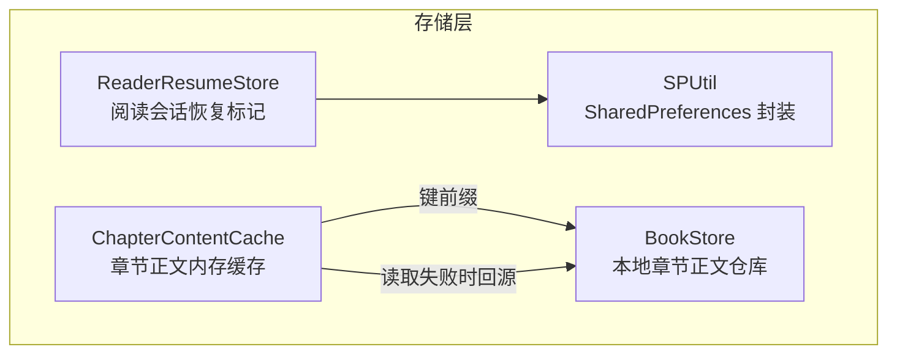
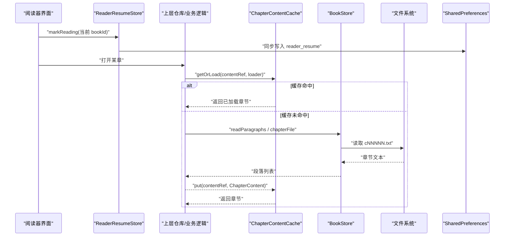
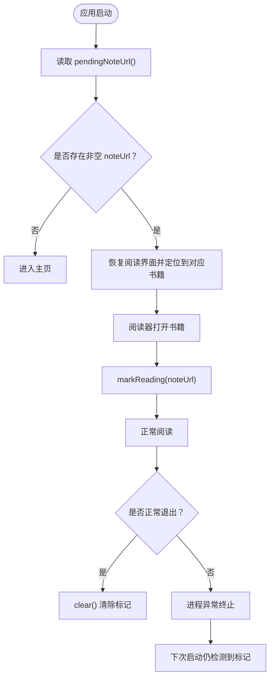
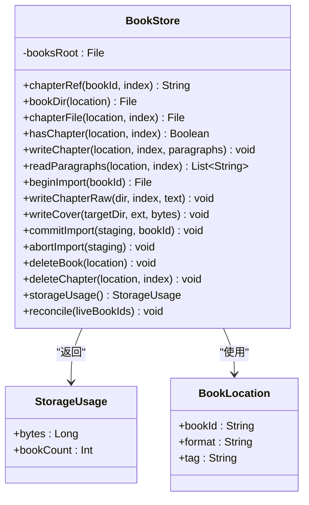
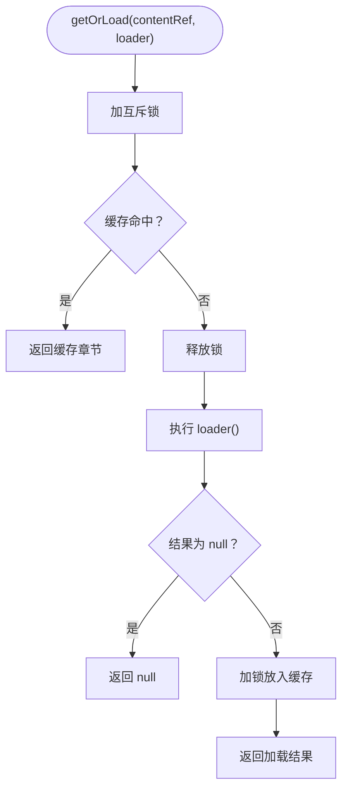
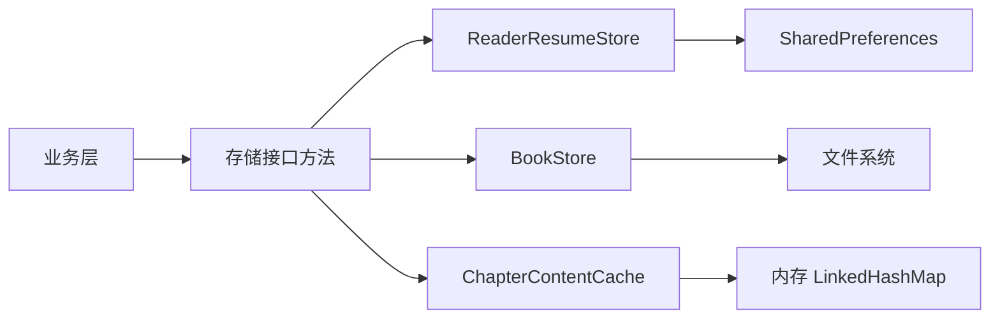
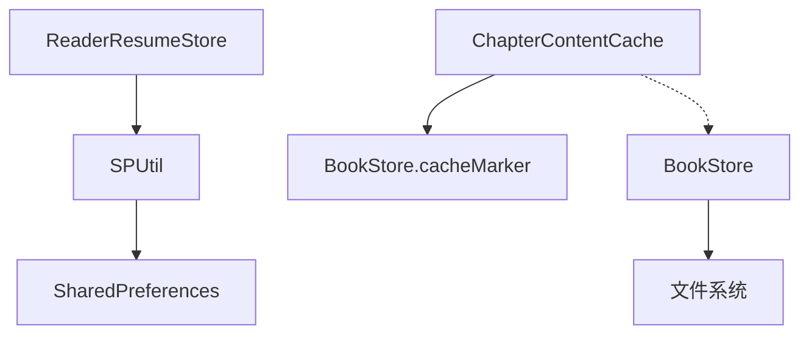

# 数据存储

<cite>
**本文引用的文件**   
- [ReaderResumeStore.kt](file://lib_book_common/src/main/java/com/ebook/common/store/ReaderResumeStore.kt)
- [BookStore.kt](file://lib_book_common/src/main/java/com/ebook/common/store/BookStore.kt)
- [ChapterContentCache.kt](file://lib_book_common/src/main/java/com/ebook/common/store/ChapterContentCache.kt)
- [SPUtil.kt](file://lib_book_common/src/main/java/com/ebook/common/util/SPUtil.kt)
- [ReaderResumeStoreTest.kt](file://lib_book_common/src/test/java/com/ebook/common/store/ReaderResumeStoreTest.kt)
- [BookStoreTest.kt](file://lib_book_common/src/test/java/com/ebook/common/store/BookStoreTest.kt)
- [ChapterContentCacheTest.kt](file://lib_book_common/src/test/java/com/ebook/common/store/ChapterContentCacheTest.kt)
</cite>

## 目录
1. [引言](#引言)
2. [项目结构](#项目结构)
3. [核心组件](#核心组件)
4. [架构总览](#架构总览)
5. [详细组件分析](#详细组件分析)
6. [依赖关系分析](#依赖关系分析)
7. [性能与容量规划](#性能与容量规划)
8. [故障恢复与一致性](#故障恢复与一致性)
9. [使用示例](#使用示例)
10. [结论](#结论)

## 引言
本技术文档聚焦 lib_book_common 模块中的数据存储层，围绕三个关键对象展开：阅读进度会话标记、本地书籍内容仓库以及章节正文内存缓存。目标包括：
- 解释 ReaderResumeStore 如何通过 SharedPreferences 实现异常退出后的阅读恢复开关。
- 说明 BookStore 的磁盘存储策略、导入原子性、目录命名规则、对账清理与占用统计。
- 梳理 ChapterContentCache 的 LRU 内存缓存、并发安全、失效边界和与 BookStore 的协作方式。
- 总结存储层的接口抽象与实现分离，并给出在业务逻辑中读写数据的具体流程与排错建议。

## 项目结构
数据存储相关代码集中在 `com.ebook.common.store` 包内，辅以通用偏好设置工具 `com.ebook.common.util.SPUtil`：
- ReaderResumeStore：进程级“是否恢复阅读”标记。
- BookStore：以文件系统为后端的章节正文与封面仓库。
- ChapterContentCache：协程安全的 LRU 章节正文内存缓存。
- SPUtil：SharedPreferences 的统一封装，支持多文件名、同步或异步落盘。

**图示来源**
- [ReaderResumeStore.kt:1-68](file://lib_book_common/src/main/java/com/ebook/common/store/ReaderResumeStore.kt#L1-L68)
- [BookStore.kt:1-216](file://lib_book_common/src/main/java/com/ebook/common/store/BookStore.kt#L1-L216)
- [ChapterContentCache.kt:1-63](file://lib_book_common/src/main/java/com/ebook/common/store/ChapterContentCache.kt#L1-L63)
- [SPUtil.kt:1-93](file://lib_book_common/src/main/java/com/ebook/common/util/SPUtil.kt#L1-L93)

**节内来源**
- [ReaderResumeStore.kt:1-68](file://lib_book_common/src/main/java/com/ebook/common/store/ReaderResumeStore.kt#L1-L68)
- [BookStore.kt:1-216](file://lib_book_common/src/main/java/com/ebook/common/store/BookStore.kt#L1-L216)
- [ChapterContentCache.kt:1-63](file://lib_book_common/src/main/java/com/ebook/common/store/ChapterContentCache.kt#L1-L63)
- [SPUtil.kt:1-93](file://lib_book_common/src/main/java/com/ebook/common/util/SPUtil.kt#L1-L93)

## 核心组件
本节从职责、数据结构、并发模型和对外契约四个维度概述三个存储对象。

| 组件 | 主要职责 | 持久化介质 | 并发模型 | 关键方法 |
|---|---|---|---|---|
| ReaderResumeStore | 记录上次未正常收尾的阅读会话所在书籍 | SharedPreferences（独立文件） | 无锁；调用方保证不并发竞争同一本书切换 | markReading、clear、pendingNoteUrl |
| BookStore | 章节正文与封面的本地文件仓库，提供导入、删除、对账与占用统计 | 文件系统 | 无内部锁；目录名派生规则统一避免串书 | chapterRef、writeChapter、readParagraphs、commitImport、reconcile、storageUsage |
| ChapterContentCache | 章节正文的 LRU 内存缓存，减少重复 IO | 内存 LinkedHashMap | Mutex 串行访问 map | getOrLoad、invalidateBook、clear |

**节内来源**
- [ReaderResumeStore.kt:1-68](file://lib_book_common/src/main/java/com/ebook/common/store/ReaderResumeStore.kt#L1-L68)
- [BookStore.kt:1-216](file://lib_book_common/src/main/java/com/ebook/common/store/BookStore.kt#L1-L216)
- [ChapterContentCache.kt:1-63](file://lib_book_common/src/main/java/com/ebook/common/store/ChapterContentCache.kt#L1-L63)

## 架构总览
存储层采用“会话标记 + 文件仓库 + 内存缓存”的分层设计：
- ReaderResumeStore 只承担一个布尔语义：启动页是否需要恢复阅读界面。它不保存具体章节或页码，也不参与页面渲染。
- BookStore 是内容事实源之一，负责章节正文文本的 UTF-8 规范化存储与目录管理，并通过暂存目录实现导入原子性。
- ChapterContentCache 位于业务与持久化之间，屏蔽频繁翻页带来的重复 IO。

**图示来源**
- [ReaderResumeStore.kt:35-68](file://lib_book_common/src/main/java/com/ebook/common/store/ReaderResumeStore.kt#L35-L68)
- [ChapterContentCache.kt:25-63](file://lib_book_common/src/main/java/com/ebook/common/store/ChapterContentCache.kt#L25-L63)
- [BookStore.kt:30-110](file://lib_book_common/src/main/java/com/ebook/common/store/BookStore.kt#L30-L110)
- [SPUtil.kt:35-62](file://lib_book_common/src/main/java/com/ebook/common/util/SPUtil.kt#L35-L62)

## 详细组件分析

### ReaderResumeStore：异常退出恢复标记
ReaderResumeStore 是一个轻量级的会话状态对象，用于回答“上一次是否在阅读器中异常退出”。它的关键设计点如下：
- 使用独立的 SharedPreferences 文件名，避免与其他配置混在同一文件中，防止批量清配置时误删恢复标记。
- 仅维护一个 key：上次阅读的书籍 noteUrl。空值表示没有需要恢复的会话。
- 写入使用同步 commit，确保应用被强杀或崩溃前，标记已经落盘。
- 清除发生在阅读器正常退出路径，由 Activity 生命周期判定 isFinishing 后调用。
- 明确声明这不是“阅读进度”：实际章节/页码保存在书架数据库字段中，该对象只是“是否恢复”的开关。

**图示来源**
- [ReaderResumeStore.kt:3-68](file://lib_book_common/src/main/java/com/ebook/common/store/ReaderResumeStore.kt#L3-L68)
- [ReaderResumeStoreTest.kt:27-88](file://lib_book_common/src/test/java/com/ebook/common/store/ReaderResumeStoreTest.kt#L27-L88)

#### 并发与安全特性
- ReaderResumeStore 本身不含锁。由于它只在阅读器打开、换源、正常退出等有限时机修改，且 key 只有一个，风险可控。
- 所有写操作都通过 SPUtil 的同步 commit 完成，避免 apply 的异步写入导致异常退出时标记丢失。
- 空字符串会被视为无效值，pendingNoteUrl 不会把空串当成有效恢复目标。

#### 使用要点
- 每次切换到新的阅读书籍都要重新调用 markReading，尤其是换源成功后。
- 正常退出时必须调用 clear，否则下次启动会误判为异常退出。
- 若网络书换源导致条目变化，必须更新标记，否则可能恢复到已被事务清理的旧条目。

**节内来源**
- [ReaderResumeStore.kt:3-68](file://lib_book_common/src/main/java/com/ebook/common/store/ReaderResumeStore.kt#L3-L68)
- [ReaderResumeStoreTest.kt:27-88](file://lib_book_common/src/test/java/com/ebook/common/store/ReaderResumeStoreTest.kt#L27-L88)

### BookStore：本地书籍内容仓库
BookStore 是以文件系统为核心的本地内容仓库，遵循“一本书一个子目录、一章一个文件”的约定：
- 章节文件命名固定为 cNNNNN.txt，序号零填充以保证字典序等于数值序。
- 章节正文按段落写入，段落间以单个 LF 分隔，编码统一为 UTF-8。
- 封面文件命名为 cover.<ext>，与章节文件同目录。
- 目录名派生规则：如果 bookId 可直接作为合法单段目录名则原样使用；否则对其取 MD5。这样既保留本地书的既有 content_ref，又避免网络 URL 中的非法字符造成嵌套目录问题。
- 导入过程使用 `.tmp` 后缀的暂存目录，commitImport 通过 renameTo 实现跨分区回退时的原子可见性。
- reconcile 清理三类无主数据：DB 已不存在的书目录、`.tmp` 残留目录、仓库根下的散落文件。
- storageUsage 一次遍历同时统计字节数与在册书数量，避免缓存管理界面反复扫描文件系统。

**图示来源**
- [BookStore.kt:1-216](file://lib_book_common/src/main/java/com/ebook/common/store/BookStore.kt#L1-L216)

#### 目录命名与兼容性
- 对于本地书，bookId 通常就是内容 md5，可以直接作为目录名，因此无需迁移既有 content_ref。
- 对于网络书，noteUrl 可能包含路径分隔符和 Windows 保留字符，不能直接用作目录名。类内统一通过 dirName 派生单段目录名，并使用 MD5 避免不同 URL 替换非法字符后产生碰撞。
- cacheMarker 基于相同 dirName 规则生成“书级片段”，供内存缓存按书失效。

#### 导入与原子提交
- beginImport 创建带 `.tmp` 后缀的暂存目录。
- 导入期间通过 writeChapterRaw 写入章节。
- commitImport 先删除目标正式目录，再尝试 renameTo；失败时回退为递归复制并清理暂存。
- abortImport 直接删除暂存目录，避免半成品残留。

#### 对账与清理
- reconcile 接收 DB 中仍然存在的 bookId 集合，并在 dirName 映射后的目录名上比对。
- 不在册目录、`.tmp` 目录、仓库根下散落文件都会被清理。
- 测试覆盖了网络书 URL 含分隔符、URL 互为前缀、storageUsage 计数等边界情况。

**节内来源**
- [BookStore.kt:1-216](file://lib_book_common/src/main/java/com/ebook/common/store/BookStore.kt#L1-L216)
- [BookStoreTest.kt:1-211](file://lib_book_common/src/test/java/com/ebook/common/store/BookStoreTest.kt#L1-L211)

### ChapterContentCache：章节正文内存缓存
ChapterContentCache 是面向高频翻页场景的内存缓存，核心目标是减少重复的文件读取和文本解码：
- 使用 LinkedHashMap 并按访问顺序排列，配合 removeEldestEntry 实现 LRU 淘汰。
- 默认容量为 3，覆盖“当前章 + 上一页 + 下一页”的常见预读窗口。
- 所有 map 操作由 kotlinx.coroutines 的 Mutex 保护，避免协程并发导致的 map 状态不一致。
- getOrLoad 在未命中时执行外部 loader，loader 在锁外运行，避免阻塞其他章的读取。
- loader 返回 null 时表示内容缺失或暂时无法解析，null 不入缓存，以便后续注册表补齐后自然重试。
- invalidateBook 通过 BookStore.cacheMarker 按书剔除缓存项，适用于删书、换源、强制刷新缓存等事件。
- clear 清空整个缓存，常用于配置变更、版本升级或显式清理入口。

**图示来源**
- [ChapterContentCache.kt:1-63](file://lib_book_common/src/main/java/com/ebook/common/store/ChapterContentCache.kt#L1-L63)

#### 缓存大小控制
- DEFAULT_CAPACITY 为 3，适合大多数阅读器的“当前章及前后章”预读策略。
- 可通过构造函数传入自定义 capacity，但需注意 Android 进程内存限制，不宜过大。
- LRU 淘汰保证最近最少使用的章节优先被移除，降低常驻内存压力。

#### 过期与失效策略
- 不基于时间过期，而是基于事件驱动：
  - 删书：触发 invalidateBook。
  - 换源或合并来源：触发 invalidateBook。
  - 下载服务重抓成功：触发 invalidateBook，避免继续供给旧正文。
- 字号、字体等排版参数变化不走本章缓存失效，因为排版缓存由 ChapterLayoutKey 另行管理。

**节内来源**
- [ChapterContentCache.kt:1-63](file://lib_book_common/src/main/java/com/ebook/common/store/ChapterContentCache.kt#L1-L63)
- [ChapterContentCacheTest.kt:1-66](file://lib_book_common/src/test/java/com/ebook/common/store/ChapterContentCacheTest.kt#L1-L66)

### 存储层的设计模式
存储层体现以下设计原则：
- 单一职责：会话标记、文件仓库、内存缓存各自专注一类数据形态。
- 实现与使用解耦：业务方通过方法签名访问数据，不需要感知底层是 SharedPreferences 还是 File。
- 命名集中化：BookStore 将目录名派生规则收敛在类内，避免调用方自行拼接导致网络书目录漂移。
- 事件驱动失效：ChapterContentCache 不主动轮询，而是由上层仓库和服务在数据变更时触发 invalidateBook。
- 可测试性：BookStore 接受 File 作为 booksRoot，可在纯 JVM 环境下用临时目录验证；ReaderResumeStore 通过 Robolectric 配合真实 SharedPreferences 行为。

**图示来源**
- [ReaderResumeStore.kt:1-68](file://lib_book_common/src/main/java/com/ebook/common/store/ReaderResumeStore.kt#L1-L68)
- [BookStore.kt:1-216](file://lib_book_common/src/main/java/com/ebook/common/store/BookStore.kt#L1-L216)
- [ChapterContentCache.kt:1-63](file://lib_book_common/src/main/java/com/ebook/common/store/ChapterContentCache.kt#L1-L63)

## 依赖关系分析
- ReaderResumeStore 依赖 SPUtil 提供的 SharedPreferences 封装，并使用独立文件名 reader_resume。
- ChapterContentCache 依赖 BookStore.cacheMarker 计算书级缓存失效片段，但不直接读写文件。
- BookStore 依赖 Java 标准库的 File 与 MessageDigest，用于文件操作和目录名 MD5 计算。
- 三者均不持有 Android Context，BookStore 通过构造注入 File，ReaderResumeStore 通过 SPUtil 间接获取 Application 上下文。

**图示来源**
- [ReaderResumeStore.kt:35-68](file://lib_book_common/src/main/java/com/ebook/common/store/ReaderResumeStore.kt#L35-L68)
- [BookStore.kt:201-216](file://lib_book_common/src/main/java/com/ebook/common/store/BookStore.kt#L201-L216)
- [ChapterContentCache.kt:25-63](file://lib_book_common/src/main/java/com/ebook/common/store/ChapterContentCache.kt#L25-L63)
- [SPUtil.kt:1-93](file://lib_book_common/src/main/java/com/ebook/common/util/SPUtil.kt#L1-L93)

**节内来源**
- [ReaderResumeStore.kt:1-68](file://lib_book_common/src/main/java/com/ebook/common/store/ReaderResumeStore.kt#L1-L68)
- [BookStore.kt:1-216](file://lib_book_common/src/main/java/com/ebook/common/store/BookStore.kt#L1-L216)
- [ChapterContentCache.kt:1-63](file://lib_book_common/src/main/java/com/ebook/common/store/ChapterContentCache.kt#L1-L63)
- [SPUtil.kt:1-93](file://lib_book_common/src/main/java/com/ebook/common/util/SPUtil.kt#L1-L93)

## 性能与容量规划
- ReaderResumeStore：
  - 写入频率低，仅在打开书籍、换源、正常退出等时机调用，使用同步 commit 的成本可接受。
  - 数据体积极小，只有单个 key-value，几乎不占存储空间。
- BookStore：
  - storageUsage 一次遍历完成字节数和册数统计，避免缓存管理界面重复扫描。
  - chapterFileName 固定格式，目录命名稳定，有利于增量检查和缓存命中。
  - 对网络书目录名采用 MD5，牺牲可读性换取唯一性和稳定性，避免 URL 冲突和路径嵌套。
- ChapterContentCache：
  - 默认容量 3，适合翻页热路径；可根据设备内存和应用实际预读策略调整。
  - getOrLoad 将 loader 放在锁外执行，避免慢 IO 阻塞其他章的缓存查询。
  - LRU 淘汰策略简单有效，适合短期阅读会话。

[本节为通用性能讨论，不直接分析具体代码行]

## 故障恢复与一致性
- 异常退出恢复：
  - 如果阅读器正常退出但未调用 clear，ReaderResumeStore 会在下次启动提示恢复阅读。
  - 若换源后未更新标记，可能恢复到旧条目，因此换源成功必须重新 markReading。
- 数据一致性：
  - BookStore 的 reconcile 清理无主目录和散落文件，避免“看不见但占空间”的数据。
  - commitImport 的原子提交机制避免半本章节被读到。
  - ChapterContentCache 的 invalidateBook 与 BookStore 的目录命名规则保持一致，确保按书失效不会漏掉网络书。
- 错误恢复建议：
  - 如果发现启动页总是拉回阅读器，检查阅读器正常退出路径是否正确调用 clear。
  - 如果发现网络书缓存每次冷启动都被清理，确认目录名派生规则和 cacheMarker 是否一致。
  - 如果发现某章缓存一直不更新，检查下载服务或强制刷新逻辑是否调用了 invalidateBook。

**节内来源**
- [ReaderResumeStore.kt:3-68](file://lib_book_common/src/main/java/com/ebook/common/store/ReaderResumeStore.kt#L3-L68)
- [BookStore.kt:100-216](file://lib_book_common/src/main/java/com/ebook/common/store/BookStore.kt#L100-L216)
- [ChapterContentCache.kt:25-63](file://lib_book_common/src/main/java/com/ebook/common/store/ChapterContentCache.kt#L25-L63)

## 使用示例
以下为业务层典型读写流程的示意说明，不包含具体代码内容：

1. 阅读器打开书籍
   - 调用 ReaderResumeStore.markReading 记录当前书籍。
   - 调用 BookRepository 或上层业务逻辑加载章节。
   - 业务逻辑先查 ChapterContentCache.getOrLoad。
   - 缓存未命中时，调用 BookStore.readParagraphs 或 chapterFile 读取文件。
   - 加载完成后写入缓存。

2. 阅读器正常退出
   - 判断 isFinishing 后调用 ReaderResumeStore.clear。
   - 避免下次启动误恢复。

3. 换源或合并来源
   - 更新 ReaderResumeStore.markReading 为新条目 noteUrl。
   调用 ChapterContentCache.invalidateBook 使旧缓存失效。

4. 删除书籍
   - 调用 BookStore.deleteBook 删除整本书目录。
   - 调用 ChapterContentCache.invalidateBook 清理内存缓存。

5. 清理缓存
   - 调用 BookStore.reconcile 清理无主文件和目录。
   - 调用 ChapterContentCache.clear 清空内存缓存。
   - 如需重置阅读恢复标记，调用 ReaderResumeStore.clear。

**节内来源**
- [ReaderResumeStore.kt:35-68](file://lib_book_common/src/main/java/com/ebook/common/store/ReaderResumeStore.kt#L35-L68)
- [BookStore.kt:30-216](file://lib_book_common/src/main/java/com/ebook/common/store/BookStore.kt#L30-L216)
- [ChapterContentCache.kt:25-63](file://lib_book_common/src/main/java/com/ebook/common/store/ChapterContentCache.kt#L25-L63)

## 结论
lib_book_common 的数据存储层以 ReaderResumeStore、BookStore、ChapterContentCache 三件套构成：
- ReaderResumeStore 用最小代价解决异常退出恢复体验问题。
- BookStore 用稳定的目录命名、原子导入和对账清理保障本地内容的一致性与可维护性。
- ChapterContentCache 用协程安全的 LRU 缓存提升翻页性能，并以事件驱动失效保持与持久化层的一致性。

整体方案强调职责清晰、命名集中、失效明确、可测试性强，适合在复杂阅读场景中稳定运行。未来扩展时可继续遵循“接口抽象、实现分离、事件驱动失效”的原则，避免引入不必要的全局状态和隐式耦合。