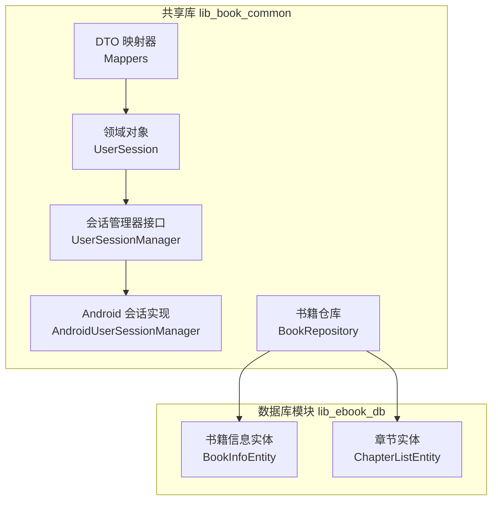
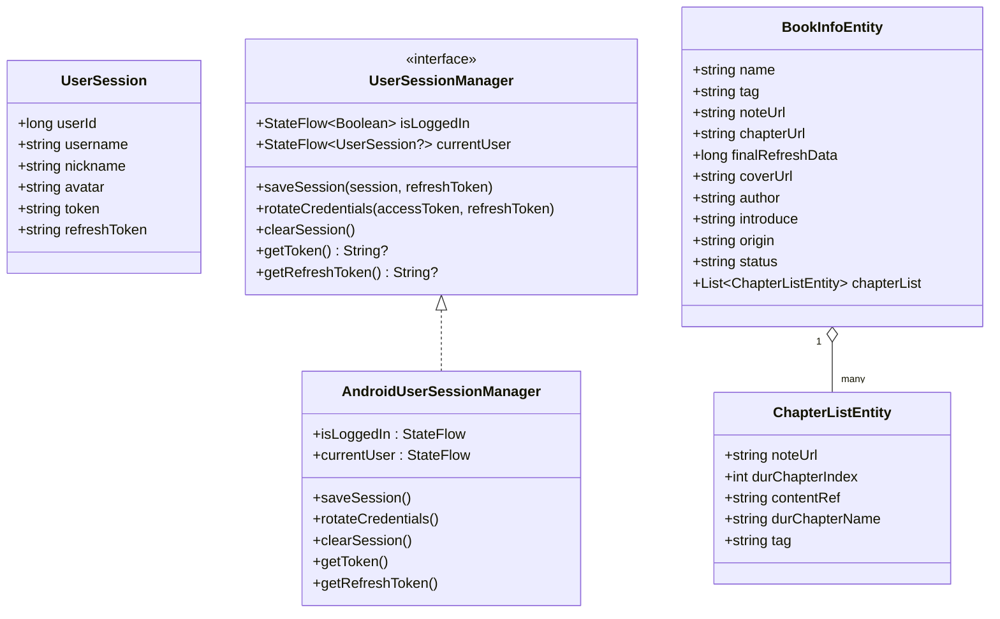
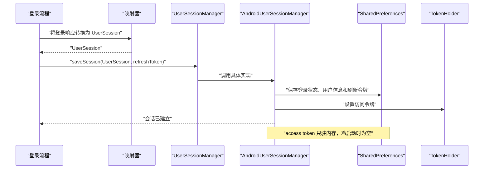
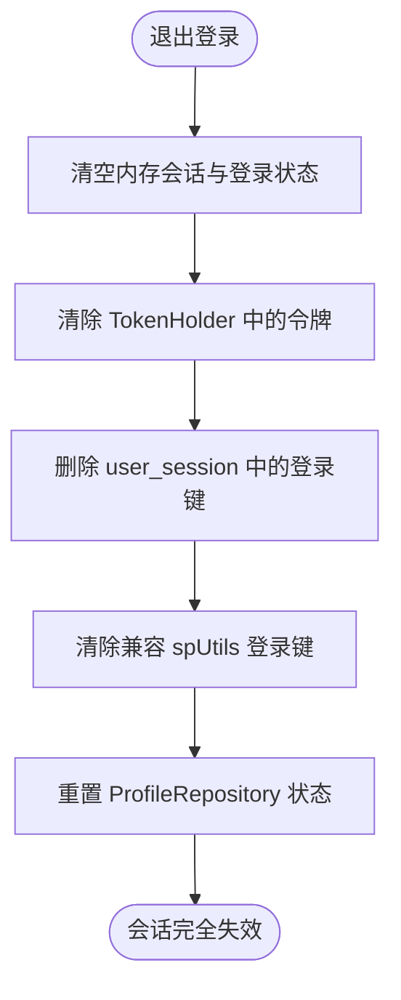
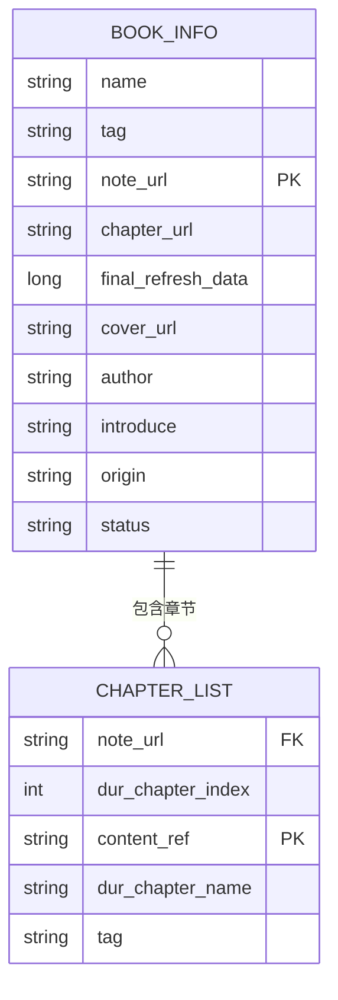
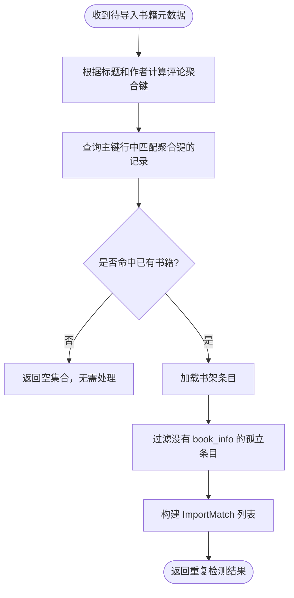
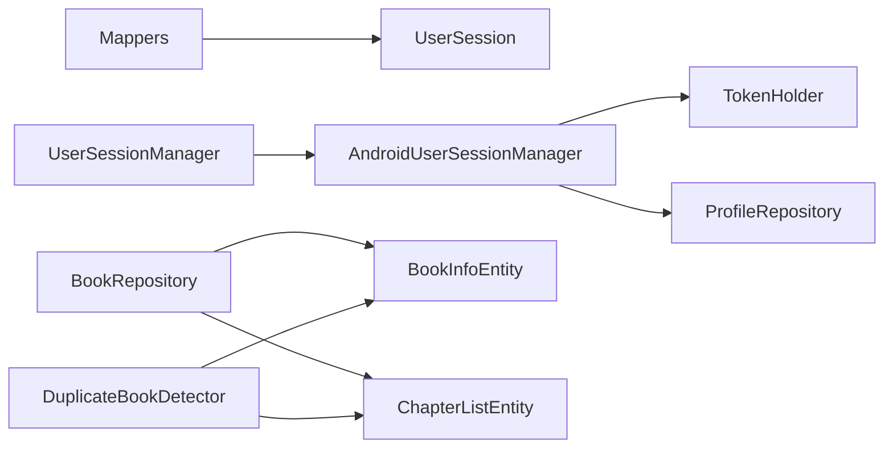

# 领域模型

<cite>
**本文引用的文件**   
- [UserSession.kt](file://lib_book_common/src/main/java/com/ebook/common/domain/UserSession.kt)
- [UserSessionManager.kt](file://lib_book_common/src/main/java/com/ebook/common/domain/UserSessionManager.kt)
- [AndroidUserSessionManager.kt](file://lib_book_common/src/main/java/com/ebook/common/domain/AndroidUserSessionManager.kt)
- [DuplicateBookDetector.kt](file://lib_book_common/src/main/java/com/ebook/common/domain/DuplicateBookDetector.kt)
- [Mappers.kt](file://lib_book_common/src/main/java/com/ebook/common/mapper/Mappers.kt)
- [BookRepository.kt](file://lib_book_common/src/main/java/com/ebook/common/repository/BookRepository.kt)
- [BookInfoEntity.kt](file://lib_ebook_db/src/main/java/com/ebook/db/entity/BookInfoEntity.kt)
- [ChapterListEntity.kt](file://lib_ebook_db/src/main/java/com/ebook/db/entity/ChapterListEntity.kt)
</cite>

## 目录

1. [引言](#引言)
2. [项目结构定位](#项目结构定位)
3. [核心领域实体](#核心领域实体)
4. [架构总览](#架构总览)
5. [详细组件分析](#详细组件分析)
6. [依赖关系分析](#依赖关系分析)
7. [性能与一致性考量](#性能与一致性考量)
8. [使用示例与最佳实践](#使用示例与最佳实践)
9. [故障排查指南](#故障排查指南)
10. [结论](#结论)

## 引言

本文面向 `lib_book_common` 的领域模型，重点解释以下三类对象：

- **书籍信息**：以 Room 持久化模型 `BookInfoEntity` 为根，承载书名、作者、封面、来源、状态等元数据。
- **章节信息**：以 `ChapterListEntity` 表示章节条目，通过 `note_url` 与书籍关联，是“一本书多章”关系的主体。
- **用户会话**：以 `UserSession` 为核心，配合 `UserSessionManager` 与 `AndroidUserSessionManager` 管理登录态、令牌轮换和会话清理。

文档从数据结构、字段含义、业务约束、验证规则、序列化方式、生命周期、关系建模以及常见用法五个层面展开，帮助读者在不直接阅读源码的情况下理解这些领域对象的职责边界和使用方式。

## 项目结构定位

`lib_book_common` 是共享库模块，提供跨模块复用的领域模型、仓库、存储、工具、事件和依赖注入配置。其中：

- 领域实体主要分布在 `com.ebook.common.domain` 与 `com.ebook.db.entity` 两个包下。
- `BookInfoEntity` 与 `ChapterListEntity` 属于数据库层实体，位于 `lib_ebook_db` 模块中，但被 `lib_book_common` 的仓库和业务逻辑广泛消费。
- `UserSession` 是纯 Kotlin 领域对象，作为认证状态的跨模块传输类型。
- `UserSessionManager` 及其 Android 实现负责会话持久化、内存状态和外部鉴权拦截器之间的同步。

**图表来源**
- [UserSession.kt:1-17](file://lib_book_common/src/main/java/com/ebook/common/domain/UserSession.kt#L1-L17)
- [UserSessionManager.kt:1-62](file://lib_book_common/src/main/java/com/ebook/common/domain/UserSessionManager.kt#L1-L62)
- [AndroidUserSessionManager.kt:1-162](file://lib_book_common/src/main/java/com/ebook/common/domain/AndroidUserSessionManager.kt#L1-L162)
- [BookRepository.kt:1-200](file://lib_book_common/src/main/java/com/ebook/common/repository/BookRepository.kt#L1-L200)
- [BookInfoEntity.kt:1-73](file://lib_ebook_db/src/main/java/com/ebook/db/entity/BookInfoEntity.kt#L1-L73)
- [ChapterListEntity.kt:1-52](file://lib_ebook_db/src/main/java/com/ebook/db/entity/ChapterListEntity.kt#L1-L52)

**章节来源**
- [BookRepository.kt:1-200](file://lib_book_common/src/main/java/com/ebook/common/repository/BookRepository.kt#L1-L200)
- [BookInfoEntity.kt:1-73](file://lib_ebook_db/src/main/java/com/ebook/db/entity/BookInfoEntity.kt#L1-L73)
- [ChapterListEntity.kt:1-52](file://lib_ebook_db/src/main/java/com/ebook/db/entity/ChapterListEntity.kt#L1-L52)

## 核心领域实体

### UserSession：用户会话领域对象

`UserSession` 是跨模块认证的 seam 类型，替代更底层的网络响应对象，用于在领域层表达“当前已登录的用户”。

| 字段 | 类型 | 必填性 | 默认值 | 业务含义 |
|---|---|---|---|---|
| `userId` | `Long` | 必填 | 无默认值 | 用户唯一标识 |
| `username` | `String` | 必填 | 无默认值 | 用户名 |
| `nickname` | `String` | 必填 | 无默认值 | 昵称 |
| `avatar` | `String` | 必填 | 无默认值 | 头像地址 |
| `token` | `String` | 必填 | 无默认值 | 运行时访问令牌 |
| `refreshToken` | `String` | 可选 | 空字符串 | 仅登录瞬时刷新凭证；恢复或静默刷新后不再维护该字段 |

设计要点：

- `UserSession` 本身是纯 Kotlin 数据类，不包含 Android 平台依赖，便于测试和复用。
- `refreshToken` 字段具有特殊语义：它只在登录结果映射时填充，供 `saveSession` 持久化；之后读取刷新凭证应统一走 `UserSessionManager.getRefreshToken()`。
- 该类不是网络协议 DTO，也不是数据库实体；它是领域层与认证流程之间的中间对象。

**章节来源**
- [UserSession.kt:1-17](file://lib_book_common/src/main/java/com/ebook/common/domain/UserSession.kt#L1-L17)
- [Mappers.kt:1-59](file://lib_book_common/src/main/java/com/ebook/common/mapper/Mappers.kt#L1-L59)

### BookInfoEntity：书籍信息实体

`BookInfoEntity` 是 Room 实体，对应 `book_info` 表，记录一本书的元数据。

| 字段 | 类型 | 必填性 | 默认值 | 数据库列名 | 业务含义 |
|---|---|---|---|---|---|
| `name` | `String` | 必填 | 空字符串 | `name` | 书名 |
| `tag` | `String` | 必填 | 空字符串 | `tag` | 书源归属标记；网络书为书源 URL，本地书为固定标记 |
| `noteUrl` | `String` | 必填 | 空字符串 | `note_url` | 主键；网站书为根地址，本地书为本地 MD5 |
| `chapterUrl` | `String` | 必填 | 空字符串 | `chapter_url` | 章节目录地址 |
| `finalRefreshData` | `Long` | 必填 | `0` | `final_refresh_data` | 章节最后更新时间戳 |
| `coverUrl` | `String` | 必填 | 空字符串 | `cover_url` | 封面地址 |
| `author` | `String` | 必填 | 空字符串 | `author` | 作者 |
| `introduce` | `String` | 必填 | 空字符串 | `introduce` | 简介 |
| `origin` | `String` | 必填 | 空字符串 | `origin` | 来源 |
| `status` | `String` | 必填 | 空字符串 | `status` | 连载或完结状态 |
| `chapterList` | `List<ChapterListEntity>` | 可选 | 空列表 | 不入库 | 由 UI 层填充，Room 忽略该字段 |

关键约束：

- `note_url` 是主键，因此同一本书在不同书源下的不同引用需要通过其他维度（如评论聚合键）区分。
- `tag` 与书架条目的 `tag` 保持一致，用于判断书籍来源：本地书和网络书行为不同。
- `chapterList` 标注为忽略字段，不参与数据库持久化，仅用于查询后组装完整书籍视图。

**章节来源**
- [BookInfoEntity.kt:1-73](file://lib_ebook_db/src/main/java/com/ebook/db/entity/BookInfoEntity.kt#L1-L73)

### ChapterListEntity：章节信息实体

`ChapterListEntity` 是 `chapter_list` 表的实体，表示一本书中的某一章。

| 字段 | 类型 | 必填性 | 默认值 | 数据库列名 | 业务含义 |
|---|---|---|---|---|---|
| `noteUrl` | `String` | 必填 | 空字符串 | `note_url` | 所属书籍的主键 |
| `durChapterIndex` | `Int` | 必填 | `0` | `dur_chapter_index` | 当前章节序号 |
| `contentRef` | `String` | 必填 | 空字符串 | `content_ref` | 内容定位符；网络书为章节 URL，本地书为私有目录相对路径 |
| `durChapterName` | `String` | 必填 | 空字符串 | `dur_chapter_name` | 章节名称 |
| `tag` | `String` | 必填 | 空字符串 | `tag` | 书源归属标记 |

关键约束：

- `content_ref` 是主键，代表“一章一定位符”，保证章节可独立识别。
- `note_url` 上建有索引，提升按书查找章节的性能。
- `contentRef` 的语义已从“章节 URL”扩展为“内容定位符”，因为本地书也使用该字段表示正文路径。

**章节来源**
- [ChapterListEntity.kt:1-52](file://lib_ebook_db/src/main/java/com/ebook/db/entity/ChapterListEntity.kt#L1-L52)

## 架构总览

领域模型围绕三个主题组织：

1. **书籍与章节**：`BookInfoEntity` 与 `ChapterListEntity` 通过 `note_url` 形成一对多关系。
2. **用户会话**：`UserSession` 是领域对象，`UserSessionManager` 定义会话能力，`AndroidUserSessionManager` 实现 SharedPreferences 持久化和进程内状态。
3. **重复检测与映射**：`DuplicateBookDetector` 基于评论聚合键进行导入重复检测；`Mappers` 负责网络 DTO 到领域模型的转换。

**图表来源**
- [UserSession.kt:1-17](file://lib_book_common/src/main/java/com/ebook/common/domain/UserSession.kt#L1-L17)
- [UserSessionManager.kt:1-62](file://lib_book_common/src/main/java/com/ebook/common/domain/UserSessionManager.kt#L1-L62)
- [AndroidUserSessionManager.kt:1-162](file://lib_book_common/src/main/java/com/ebook/common/domain/AndroidUserSessionManager.kt#L1-L162)
- [BookInfoEntity.kt:1-73](file://lib_ebook_db/src/main/java/com/ebook/db/entity/BookInfoEntity.kt#L1-L73)
- [ChapterListEntity.kt:1-52](file://lib_ebook_db/src/main/java/com/ebook/db/entity/ChapterListEntity.kt#L1-L52)

## 详细组件分析

### 用户会话生命周期

用户会话的生命周期包括创建、恢复、刷新和销毁四个阶段。

**图表来源**
- [Mappers.kt:1-59](file://lib_book_common/src/main/java/com/ebook/common/mapper/Mappers.kt#L1-L59)
- [AndroidUserSessionManager.kt:1-162](file://lib_book_common/src/main/java/com/ebook/common/domain/AndroidUserSessionManager.kt#L1-L162)

#### 会话创建

登录成功后，登录响应会被映射为 `UserSession`。映射过程要求访问令牌存在；如果令牌为空，则视为登录失败。刷新令牌来自登录响应，并作为独立参数传给 `saveSession`。

`AndroidUserSessionManager.saveSession` 会：

- 更新内存中的当前会话和登录状态。
- 将访问令牌写入 `TokenHolder`，供网络鉴权拦截器使用。
- 将登录标志、刷新令牌、用户 ID、用户名、昵称和头像写入 SharedPreferences。
- 同时兼容旧版 `SPUtil` 中的登录键，避免遗留状态不一致。

#### 会话恢复

应用冷启动时，`AndroidUserSessionManager` 会从 SharedPreferences 恢复会话：

- 若未标记已登录，返回空会话。
- 若已登录，构造 `UserSession`，但访问令牌为空；刷新令牌仍保存在 SP 中。
- 首个请求触发静默刷新，用刷新令牌轮换出新的访问令牌。

这种设计的核心权衡是：访问令牌不持久化，降低令牌泄露风险；刷新令牌持久化，支持后续请求续期。

#### 令牌轮换

静默刷新调用 `rotateCredentials`，其语义是“续期凭证，不改身份”：

- 只更新内存中的访问令牌和用户会话中的令牌。
- 只落盘刷新令牌。
- 不修改用户 ID、用户名、昵称和头像。

#### 会话销毁

退出登录时，`clearSession` 需要一次性失效三处镜像：

1. 本类的内存状态和 SharedPreferences。
2. 兼容 `LoginInterceptor` 的 `SPUtil` 登录键。
3. `ProfileRepository` 的进程内昵称和头像流。

**图表来源**
- [AndroidUserSessionManager.kt:1-162](file://lib_book_common/src/main/java/com/ebook/common/domain/AndroidUserSessionManager.kt#L1-L162)

**章节来源**
- [UserSessionManager.kt:1-62](file://lib_book_common/src/main/java/com/ebook/common/domain/UserSessionManager.kt#L1-L62)
- [AndroidUserSessionManager.kt:1-162](file://lib_book_common/src/main/java/com/ebook/common/domain/AndroidUserSessionManager.kt#L1-L162)
- [Mappers.kt:1-59](file://lib_book_common/src/main/java/com/ebook/common/mapper/Mappers.kt#L1-L59)

### 书籍与章节的关系

书籍与章节是一对多关系，核心键是 `note_url`：

- 一本书有一个 `BookInfoEntity`。
- 一本书有多个 `ChapterListEntity`。
- 每个章节通过 `noteUrl` 指向所属书籍。
- 章节主键是 `content_ref`，确保每章有唯一内容定位符。

**图表来源**
- [BookInfoEntity.kt:1-73](file://lib_ebook_db/src/main/java/com/ebook/db/entity/BookInfoEntity.kt#L1-L73)
- [ChapterListEntity.kt:1-52](file://lib_ebook_db/src/main/java/com/ebook/db/entity/ChapterListEntity.kt#L1-L52)

仓库层对这一关系做了进一步封装：

- `getAllBooks` 返回基础书架条目。
- `observeBookShelf` 返回响应式书架数据，并过滤掉没有书籍信息的孤立条目。
- `getAllBooksWithDetails` 和 `getBookWithDetails` 会把 `bookInfo` 与 `chapterList` 补全，并按章节序号排序。
- 排序是为了修复历史问题：Room 的关联查询没有显式 `ORDER BY`，物理 `rowid` 可能因替换操作乱序。

**章节来源**
- [BookRepository.kt:1-200](file://lib_book_common/src/main/java/com/ebook/common/repository/BookRepository.kt#L1-L200)
- [BookInfoEntity.kt:1-73](file://lib_ebook_db/src/main/java/com/ebook/db/entity/BookInfoEntity.kt#L1-L73)
- [ChapterListEntity.kt:1-52](file://lib_ebook_db/src/main/java/com/ebook/db/entity/ChapterListEntity.kt#L1-L52)

### 重复检测领域逻辑

`DuplicateBookDetector` 负责导入前的重复检测，依据的是“评论聚合键”，而不是单纯的书名。

判定流程如下：

**图表来源**
- [DuplicateBookDetector.kt:1-78](file://lib_book_common/src/main/java/com/ebook/common/domain/DuplicateBookDetector.kt#L1-L78)

业务约束包括：

- 重复检测发生在导入时点。
- 命中的是主键相同、且聚合键相同的已有书籍。
- 只有本地书可以讨论“补章合并”，网络书只能共存或覆盖。
- 作者解析不一致时算出不同键，属于保守策略：宁可放过一次提示，也不误并两本不同的书。

**章节来源**
- [DuplicateBookDetector.kt:1-78](file://lib_book_common/src/main/java/com/ebook/common/domain/DuplicateBookDetector.kt#L1-L78)

### 序列化与数据传输

`UserSession` 是 Kotlin 数据类，天然支持结构化序列化和不可变状态传递。项目中并没有为它配置专门的 JSON 注解，说明它主要用于进程内领域对象和函数参数传递。

真正的网络序列化集中在 API 层 DTO，例如登录响应对象；领域层通过 `Mappers` 将其转换为 `UserSession`。

| 场景 | 使用方式 | 说明 |
|---|---|---|
| 领域内部传递 | 直接作为函数参数或属性 | `UserSession` 是不可变数据类，适合线程安全传递 |
| 登录响应转换 | `LoginDTO.toUserSession()` | 将网络 DTO 转为领域会话 |
| 会话持久化 | SharedPreferences | 由 `AndroidUserSessionManager` 控制字段落盘范围 |
| 网络传输 | 不使用 `UserSession` | 网络层使用独立的 DTO |

**章节来源**
- [UserSession.kt:1-17](file://lib_book_common/src/main/java/com/ebook/common/domain/UserSession.kt#L1-L17)
- [Mappers.kt:1-59](file://lib_book_common/src/main/java/com/ebook/common/mapper/Mappers.kt#L1-L59)
- [AndroidUserSessionManager.kt:1-162](file://lib_book_common/src/main/java/com/ebook/common/domain/AndroidUserSessionManager.kt#L1-L162)

## 依赖关系分析

领域模型依赖关系并不复杂，但职责边界清晰：

- `UserSession` 是纯领域对象，不依赖仓库、数据库或 Android 框架。
- `UserSessionManager` 是纯 Kotlin 接口，屏蔽 Android 持久化细节。
- `AndroidUserSessionManager` 依赖 Android 上下文、SharedPreferences、`TokenHolder` 和 `ProfileRepository`。
- `BookInfoEntity` 和 `ChapterListEntity` 是 Room 实体，被 DAO、仓库和 UI 层消费。
- `BookRepository` 组合多个 DAO 和领域服务，是书籍数据的主要入口。
- `DuplicateBookDetector` 依赖 DAO 和评论聚合键计算逻辑。

**图表来源**
- [Mappers.kt:1-59](file://lib_book_common/src/main/java/com/ebook/common/mapper/Mappers.kt#L1-L59)
- [UserSessionManager.kt:1-62](file://lib_book_common/src/main/java/com/ebook/common/domain/UserSessionManager.kt#L1-L62)
- [AndroidUserSessionManager.kt:1-162](file://lib_book_common/src/main/java/com/ebook/common/domain/AndroidUserSessionManager.kt#L1-L162)
- [BookRepository.kt:1-200](file://lib_book_common/src/main/java/com/ebook/common/repository/BookRepository.kt#L1-L200)
- [DuplicateBookDetector.kt:1-78](file://lib_book_common/src/main/java/com/ebook/common/domain/DuplicateBookDetector.kt#L1-L78)
- [BookInfoEntity.kt:1-73](file://lib_ebook_db/src/main/java/com/ebook/db/entity/BookInfoEntity.kt#L1-L73)
- [ChapterListEntity.kt:1-52](file://lib_ebook_db/src/main/java/com/ebook/db/entity/ChapterListEntity.kt#L1-L52)

**章节来源**
- [BookRepository.kt:1-200](file://lib_book_common/src/main/java/com/ebook/common/repository/BookRepository.kt#L1-L200)
- [AndroidUserSessionManager.kt:1-162](file://lib_book_common/src/main/java/com/ebook/common/domain/AndroidUserSessionManager.kt#L1-L162)

## 性能与一致性考量

### 书籍与章节查询性能

- `chapter_list` 表对 `note_url` 建索引，加速按书查找章节。
- 仓库在获取完整书籍详情时对章节按 `durChapterIndex` 排序，避免 UI 出现乱序。
- 观察书架时使用 Flow 推送变化，减少主动轮询。

### 会话状态一致性

- 内存状态、SharedPreferences、`TokenHolder` 和 `ProfileRepository` 必须保持一致。
- 清会话时必须一次性清理所有镜像，否则会出现“已登出但仍显示上一个用户”的问题。
- access token 只驻内存，避免冷启动时携带过期或泄露的访问令牌。

### 数据一致性保护

- 阅读进度保存会对越界位置做钳制，防止内存目录与数据库目录行数不一致导致页面异常。
- 重复检测采用保守策略，优先避免误判，而不是追求尽可能多地合并书籍。

**章节来源**
- [BookRepository.kt:1-200](file://lib_book_common/src/main/java/com/ebook/common/repository/BookRepository.kt#L1-L200)
- [AndroidUserSessionManager.kt:1-162](file://lib_book_common/src/main/java/com/ebook/common/domain/AndroidUserSessionManager.kt#L1-L162)
- [ChapterListEntity.kt:1-52](file://lib_ebook_db/src/main/java/com/ebook/db/entity/ChapterListEntity.kt#L1-L52)

## 使用示例与最佳实践

### 在业务逻辑中使用 UserSession

推荐做法：

- 登录成功后，先映射为 `UserSession`，再调用 `UserSessionManager.saveSession`。
- 读取当前用户时，订阅 `currentUser` 或 `isLoggedIn`。
- 获取访问令牌时，调用 `getToken()`，不要直接读 `UserSession.token`。
- 获取刷新令牌时，调用 `getRefreshToken()`，不要依赖 `UserSession.refreshToken`。

反例：

- 不要在业务层自行维护 SharedPreferences 中的登录键。
- 不要在静默刷新后重新填入用户身份信息。
- 不要在退出登录后保留旧的 `TokenHolder` 或 `ProfileRepository` 状态。

**章节来源**
- [UserSessionManager.kt:1-62](file://lib_book_common/src/main/java/com/ebook/common/domain/UserSessionManager.kt#L1-L62)
- [AndroidUserSessionManager.kt:1-162](file://lib_book_common/src/main/java/com/ebook/common/domain/AndroidUserSessionManager.kt#L1-L162)
- [Mappers.kt:1-59](file://lib_book_common/src/main/java/com/ebook/common/mapper/Mappers.kt#L1-L59)

### 在业务逻辑中使用 BookInfoEntity 与 ChapterListEntity

推荐做法：

- 新增书籍时，先写 `BookInfoEntity`，再批量插入 `ChapterListEntity`。
- 读取书籍详情时，使用仓库提供的带详情方法，确保 `bookInfo` 和 `chapterList` 非空。
- 展示章节列表前，确认章节已按序号排序。
- 删除书籍时，注意同时处理章节数据和下载队列残留。

反例：

- 不要假设 Room 关联查询返回的章节顺序稳定。
- 不要跳过孤立条目检查：没有 `book_info` 的书架条目不应进入阅读器。
- 不要把 `content_ref` 当成纯粹的网页 URL；本地书的章节也可能使用文件系统路径。

**章节来源**
- [BookRepository.kt:1-200](file://lib_book_common/src/main/java/com/ebook/common/repository/BookRepository.kt#L1-L200)
- [BookInfoEntity.kt:1-73](file://lib_ebook_db/src/main/java/com/ebook/db/entity/BookInfoEntity.kt#L1-L73)
- [ChapterListEntity.kt:1-52](file://lib_ebook_db/src/main/java/com/ebook/db/entity/ChapterListEntity.kt#L1-L52)

### 数据转换模式

本项目采用“DTO → 领域模型 → 持久化实体”的分层转换：

- 网络 DTO 通过 `Mappers` 转换为 `UserSession`。
- 领域层使用不可变数据类表达状态。
- 持久化使用 Room 实体，UI 层通过仓库暴露的组合对象消费。

最佳实践：

- 不在 DTO 中放业务规则。
- 不在领域对象中放 Android 平台依赖。
- 不在持久化实体中放 UI 渲染逻辑。
- 所有跨层转换集中在映射器或仓库中，避免散落各处。

**章节来源**
- [Mappers.kt:1-59](file://lib_book_common/src/main/java/com/ebook/common/mapper/Mappers.kt#L1-L59)
- [UserSession.kt:1-17](file://lib_book_common/src/main/java/com/ebook/common/domain/UserSession.kt#L1-L17)
- [BookRepository.kt:1-200](file://lib_book_common/src/main/java/com/ebook/common/repository/BookRepository.kt#L1-L200)

## 故障排查指南

### 已登录但无法发起网络请求

可能原因：

- 冷启动后 access token 为空，这是预期行为。
- 静默刷新尚未完成，或刷新令牌无效。
- `TokenHolder` 未被正确初始化。

排查步骤：

1. 检查 `isLoggedIn` 是否为真。
2. 检查 `getRefreshToken()` 是否有值。
3. 检查 `getToken()` 是否在首次请求后被刷新。
4. 查看日志中是否出现刷新失败或鉴权失败。

**章节来源**
- [AndroidUserSessionManager.kt:1-162](file://lib_book_common/src/main/java/com/ebook/common/domain/AndroidUserSessionManager.kt#L1-L162)

### 退出登录后仍显示上一个用户

可能原因：

- 只清了部分登录状态。
- 没有调用 `clearSession`，而是手动删除了某个 SharedPreferences 键。
- `ProfileRepository` 的状态没有被复位。

排查步骤：

1. 确认是否调用了统一的退出登录入口。
2. 检查 `user_session` 文件是否已被清理。
3. 检查兼容登录键是否被清理。
4. 检查 `ProfileRepository` 是否重置。

**章节来源**
- [AndroidUserSessionManager.kt:1-162](file://lib_book_common/src/main/java/com/ebook/common/domain/AndroidUserSessionManager.kt#L1-L162)

### 阅读器打开书籍后章节为空

可能原因：

- 使用了只查裸行的查询接口，没有补齐 `bookInfo` 和 `chapterList`。
- 书架条目是孤立的，缺少 `book_info`。
- 章节列表未排序，导致 UI 解析异常。

排查步骤：

1. 使用 `getBookWithDetails` 或 `getAllBooksWithDetails`。
2. 检查返回的 `chapterList` 是否为空。
3. 检查是否存在孤立书架条目。
4. 确认章节已按 `durChapterIndex` 排序。

**章节来源**
- [BookRepository.kt:1-200](file://lib_book_common/src/main/java/com/ebook/common/repository/BookRepository.kt#L1-L200)

### 导入书籍时重复检测不准确

可能原因：

- 标题或作者解析结果不稳定。
- 评论聚合键计算与已有书籍不一致。
- 把书名当作主键比较，忽略了作者维度。

排查步骤：

1. 检查 `ParsedBookMeta` 的标题和作者是否正确。
2. 检查评论聚合键是否与现有主键一致。
3. 确认重复检测是基于主键和聚合键，而不是显示书名。

**章节来源**
- [DuplicateBookDetector.kt:1-78](file://lib_book_common/src/main/java/com/ebook/common/domain/DuplicateBookDetector.kt#L1-L78)

## 结论

`lib_book_common` 的领域模型以清晰的数据边界和职责分离为基础：

- `UserSession` 表达认证状态，但不承担持久化责任。
- `UserSessionManager` 抽象会话能力，`AndroidUserSessionManager` 实现平台细节。
- `BookInfoEntity` 与 `ChapterListEntity` 表达书籍与章节的持久化结构，并通过仓库暴露稳定的业务接口。
- 重复检测、阅读进度、章节排序、令牌轮换等规则都收敛在领域层和仓库层，避免散落在 UI 或网络层。

在实际使用中，应优先通过 `UserSessionManager` 和 `BookRepository` 操作领域状态，而不是直接读写 SharedPreferences 或数据库表。这样既能保证数据一致性，也能降低跨模块耦合。