# 基础设施模块

<cite>
**本文引用的文件**   
- [IFindProvider.kt](file://lib_book_common/src/main/java/com/ebook/common/provider/IFindProvider.kt)
- [IMeProvider.kt](file://lib_book_common/src/main/java/com/ebook/common/provider/IMeProvider.kt)
- [ILoginProvider.kt](file://lib_book_common/src/main/java/com/ebook/common/provider/ILoginProvider.kt)
- [IBookProvider.kt](file://lib_book_common/src/main/java/com/ebook/common/provider/IBookProvider.kt)
- [CommonUiComponents.kt](file://lib_book_common/src/main/java/com/ebook/common/ui/CommonUiComponents.kt)
- [BookItemLayout.kt](file://lib_book_common/src/main/java/com/ebook/common/ui/BookItemLayout.kt)
- [CommonPainters.kt](file://lib_book_common/src/main/java/com/ebook/common/ui/CommonPainters.kt)
- [FormatSize.kt](file://lib_book_common/src/main/java/com/ebook/common/util/FormatSize.kt)
- [FileTree.kt](file://lib_book_common/src/main/java/com/ebook/common/util/FileTree.kt)
- [DateUtil.kt](file://lib_book_common/src/main/java/com/ebook/common/util/DateUtil.kt)
- [BookParser.kt](file://lib_book_source/src/main/java/com/ebook/source/analyze/BookParser.kt)
- [ScriptBookParser.kt](file://lib_book_source/src/main/java/com/ebook/source/analyze/ScriptBookParser.kt)
- [JsoupBookParser.kt](file://lib_book_source/src/main/java/com/ebook/source/analyze/JsoupBookParser.kt)
- [ScriptRuleSet.kt](file://lib_book_source/src/main/java/com/ebook/source/script/ScriptRuleSet.kt)
- [ScriptRuleEvaluator.kt](file://lib_book_source/src/main/java/com/ebook/source/script/ScriptRuleEvaluator.kt)
- [SandboxService.kt](file://lib_book_source/src/main/java/com/ebook/source/sandbox/SandboxService.kt)
- [JsSandboxClient.kt](file://lib_book_source/src/main/java/com/ebook/source/sandbox/JsSandboxClient.kt)
- [SandboxContract.kt](file://lib_book_source/src/main/java/com/ebook/source/sandbox/SandboxContract.kt)
- [RetrofitBuilder.kt](file://lib_ebook_api/src/main/java/com/ebook/api/RetrofitBuilder.kt)
- [EncodingInterceptor.kt](file://lib_ebook_api/src/main/java/com/ebook/api/intercepter/EncodingInterceptor.kt)
- [AppDatabase.kt](file://lib_ebook_db/src/main/java/com/ebook/db/AppDatabase.kt)
</cite>

## 目录

1. [引言](#引言)
2. [项目结构](#项目结构)
3. [核心组件](#核心组件)
4. [架构总览](#架构总览)
5. [详细组件分析](#详细组件分析)
6. [依赖关系分析](#依赖关系分析)
7. [性能与可靠性特征](#性能与可靠性特征)
8. [故障排查指南](#故障排查指南)
9. [集成最佳实践](#集成最佳实践)
10. [结论](#结论)

## 引言

本仓库是一个 Android 小说阅读应用，采用多模块分层架构：业务功能放在 `module_*` 中，通用能力下沉到 `lib_*` 基础库。本文聚焦四个关键基础设施模块：

| 模块 | 职责 | 上层支撑点 |
|---|---|---|
| `lib_book_common` | Provider 接口契约、共享 Compose UI 组件、通用工具类 | 让书架、书城、我的等页面以统一视觉语言组合；暴露跨模块 SPI |
| `lib_book_source` | 书源解析引擎：JSON 规则 + JavaScript 脚本执行 + 沙箱隔离 | 把第三方站点的 HTML/JSON 数据转换成统一的书籍、章节和书库实体 |
| `lib_ebook_api` | Retrofit 网络层、API 实体、拦截器链 | 为书源 HTTP 请求和用户认证服务提供可配置、可测试的网络能力 |
| `lib_ebook_db` | Room 数据库、DAO、实体与迁移策略 | 持久化书架、书目、章节目录、搜索历史、下载队列、书源和暂停标记 |

这四个模块共同构成“规则驱动的书源 + 安全脚本执行 + 标准网络访问 + 稳定本地存储”的基础设施，使上层业务模块只需关注界面编排和业务编排，而不必重复实现站点适配、编码处理或版本迁移。

## 项目结构

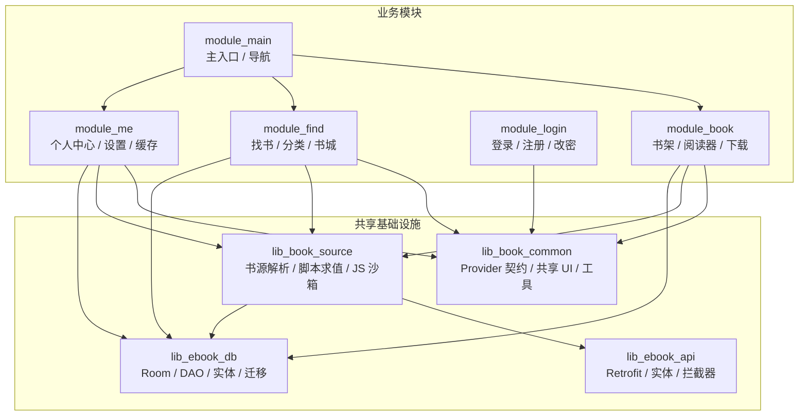

**图表来源**
- [AppDatabase.kt:24-75](file://lib_ebook_db/src/main/java/com/ebook/db/AppDatabase.kt#L24-L75)
- [RetrofitBuilder.kt:20-45](file://lib_ebook_api/src/main/java/com/ebook/api/RetrofitBuilder.kt#L20-L45)
- [ScriptBookParser.kt:28-68](file://lib_book_source/src/main/java/com/ebook/source/analyze/ScriptBookParser.kt#L28-L68)
- [IBookProvider.kt:9-23](file://lib_book_common/src/main/java/com/ebook/common/provider/IBookProvider.kt#L9-L23)

### 模块边界说明

- `lib_book_common` 不依赖业务模块，只定义 Provider 接口，由具体业务模块实现并通过宿主路由注入。
- `lib_book_source` 依赖 `lib_ebook_api`（获取 `OkHttpClient`、HTML/JSON 辅助）和 `lib_ebook_db`（产出 `SearchBookEntity`、`BookShelfEntity`、`WebChapterEntity` 等）。
- `lib_ebook_api` 是纯 API 与网络装配模块，不含业务状态。
- `lib_ebook_db` 是本地数据事实源，所有读写经 DAO 暴露，避免上层直接拼 SQL。

**章节来源**
- [AppDatabase.kt:24-75](file://lib_ebook_db/src/main/java/com/ebook/db/AppDatabase.kt#L24-L75)
- [ScriptBookParser.kt:28-68](file://lib_book_source/src/main/java/com/ebook/source/analyze/ScriptBookParser.kt#L28-L68)
- [RetrofitBuilder.kt:20-45](file://lib_ebook_api/src/main/java/com/ebook/api/RetrofitBuilder.kt#L20-L45)

## 核心组件

### 一、`lib_book_common`：Provider 接口与共享 UI

#### 1. Provider 接口契约

`lib_book_common` 通过一组 Provider 接口定义跨模块契约，而不是直接依赖 `module_book`、`module_find`、`module_login`、`module_me`：

| 接口 | 暴露能力 | 调用方 | 设计要点 |
|---|---|---|---|
| `IBookProvider` | 书架主页面 | `module_main` 的 NavHost | 接受 `onGoBookstore` 回调，解决空态跳转书城 Tab 的问题 |
| `IFindProvider` | 书城主页面 | `module_main` 的 NavHost | 返回 Composable，而非 Fragment |
| `IMeProvider` | 个人中心主页面 | `module_main` 的 NavHost | 返回 Composable，ViewModel 绑定调用处的 `NavBackStackEntry` |
| `ILoginProvider` | 服务端会话作废 | 需要登出能力的模块 | 独立运行时可为空；本地会话清理由 `UserSessionManager.clearSession` 单点负责 |

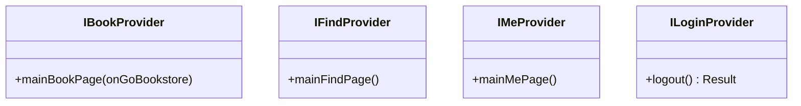

**图表来源**
- [IBookProvider.kt:9-23](file://lib_book_common/src/main/java/com/ebook/common/provider/IBookProvider.kt#L9-L23)
- [IFindProvider.kt:9-13](file://lib_book_common/src/main/java/com/ebook/common/provider/IFindProvider.kt#L9-L13)
- [IMeProvider.kt:9-13](file://lib_book_common/src/main/java/com/ebook/common/provider/IMeProvider.kt#L9-L13)
- [ILoginProvider.kt:9-19](file://lib_book_common/src/main/java/com/ebook/common/provider/ILoginProvider.kt#L9-L19)

#### 2. 共享 UI 组件

共享 UI 集中在 `ui` 包，遵循 ADR-0006 沉淀的设计语言：

| 组件 | 用途 | 约束 |
|---|---|---|
| `CommonCard` | 分组容器卡片 | 16dp 圆角、`surfaceContainer`、轻阴影 |
| `CommonItemCard` | 列表条目卡容器 | 12dp 圆角、支持点击/长按/禁用语义 |
| `CommonListItem` | 菜单/设置项 | 36dp 图标容器 + 标题 + 可选尾随文本/箭头 |
| `BookItemFrame` | “三行书条目”外壳 | 封面 3:4、定高正文列、右上角动作槽 |
| `rememberCoverPlaceholderPainter` | 默认封面占位 Painter | NinePatch 转 Bitmap，失败回退语义色 |
| `BookItemLayout` | 书条目尺寸常量与行数计算 | 保证同列表等高，兼容主题字号非线性缩放 |

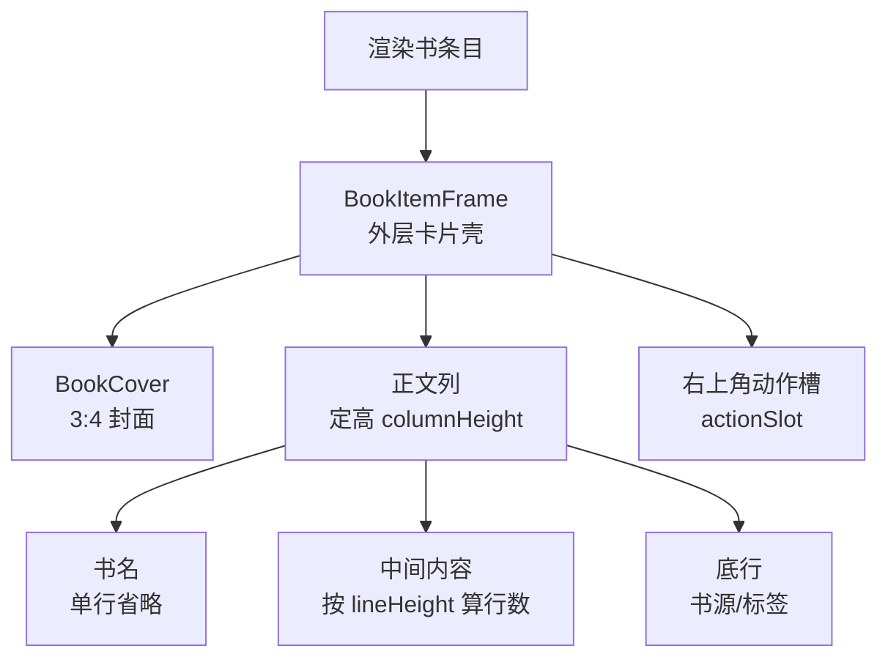

**图表来源**
- [BookItemLayout.kt:17-108](file://lib_book_common/src/main/java/com/ebook/common/ui/BookItemLayout.kt#L17-L108)
- [BookItemLayout.kt:109-180](file://lib_book_common/src/main/java/com/ebook/common/ui/BookItemLayout.kt#L109-L180)
- [CommonPainters.kt:13-38](file://lib_book_common/src/main/java/com/ebook/common/ui/CommonPainters.kt#L13-L38)

#### 3. 通用工具类

| 工具 | 作用 | 设计原则 |
|---|---|---|
| `formatSize` | 字节数转可读大小 | 单位符号语言无关，数字用 `Locale.US` |
| `File.treeSize()` | 递归统计普通文件字节总数 | 目录 inode 不计，不存在时返回 0 |
| `DateUtil` | 日期解析、格式化、时间差、相对时间展示 | 使用 `Locale.CHINA`，异常落日志后降级 |

**章节来源**
- [IBookProvider.kt:9-23](file://lib_book_common/src/main/java/com/ebook/common/provider/IBookProvider.kt#L9-L23)
- [IFindProvider.kt:9-13](file://lib_book_common/src/main/java/com/ebook/common/provider/IFindProvider.kt#L9-L13)
- [IMeProvider.kt:9-13](file://lib_book_common/src/main/java/com/ebook/common/provider/IMeProvider.kt#L9-L13)
- [ILoginProvider.kt:9-19](file://lib_book_common/src/main/java/com/ebook/common/provider/ILoginProvider.kt#L9-L19)
- [CommonUiComponents.kt:1-60](file://lib_book_common/src/main/java/com/ebook/common/ui/CommonUiComponents.kt#L1-L60)
- [BookItemLayout.kt:17-180](file://lib_book_common/src/main/java/com/ebook/common/ui/BookItemLayout.kt#L17-L180)
- [CommonPainters.kt:13-38](file://lib_book_common/src/main/java/com/ebook/common/ui/CommonPainters.kt#L13-L38)
- [FormatSize.kt:7-20](file://lib_book_common/src/main/java/com/ebook/common/util/FormatSize.kt#L7-L20)
- [FileTree.kt:7-16](file://lib_book_common/src/main/java/com/ebook/common/util/FileTree.kt#L7-L16)
- [DateUtil.kt:9-40](file://lib_book_common/src/main/java/com/ebook/common/util/DateUtil.kt#L9-L40)

### 二、`lib_book_source`：书源解析与脚本执行环境

#### 1. 解析器接口

`BookParser` 是书源解析的统一抽象，屏蔽 JSON 规则解析器和脚本书源差异：

| 方法 | 输入 | 输出 | 语义 |
|---|---|---|---|
| `searchBook` | 关键词、页码 | 搜索结果列表 | 未配 `searchUrl` 时返回空列表，不是错误 |
| `getBookInfo` | 书架实体 | 填充详情的书架实体 | 从详情页拉取书名、作者、简介、封面、目录 URL |
| `getChapterList` | 书架实体 | 带章节目录的实体 | 优先 `chapterUrl`，否则回落到详情页 URL |
| `getKindBook` | 分类 URL、页码 | 搜索结果列表 | 发现页分类检索 |
| `fetchLibraryData` | 无 | 书城分类书库 | **纯网络解析**，不碰缓存，单个分类失败按空区块计 |

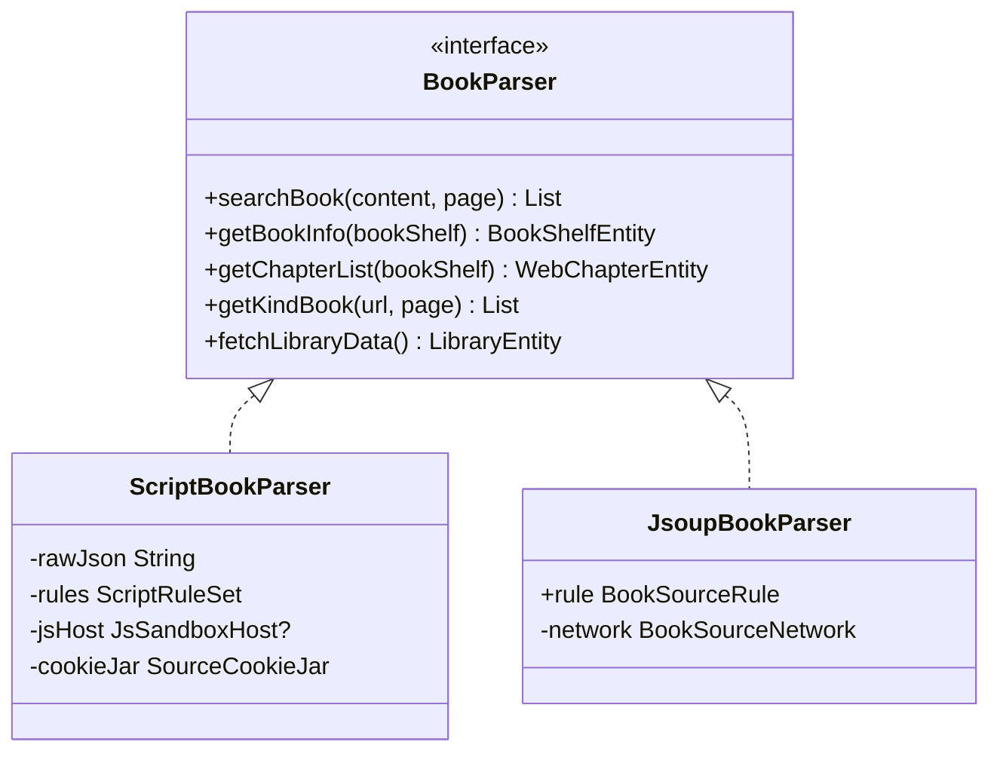

**图表来源**
- [BookParser.kt:12-30](file://lib_book_source/src/main/java/com/ebook/source/analyze/BookParser.kt#L12-L30)
- [ScriptBookParser.kt:28-68](file://lib_book_source/src/main/java/com/ebook/source/analyze/ScriptBookParser.kt#L28-L68)
- [JsoupBookParser.kt:26-52](file://lib_book_source/src/main/java/com/ebook/source/analyze/JsoupBookParser.kt#L26-L52)

#### 2. JSON 规则解析器

`JsoupBookParser` 根据 `BookSourceRule` 动态解析 HTML：

- 搜索：URL 模板展开、表单体参数替换、`ListPageUrl` 页码换算。
- 详情：`JsoupHelper` 选择器取值，支持前缀剥离、目录 URL 回退。
- 目录：`TocPager.collect` 分页收集章节，支持倒序索引。
- 分类：复用搜索规则链，允许分类规则覆盖通用规则。

**章节来源**
- [BookParser.kt:12-30](file://lib_book_source/src/main/java/com/ebook/source/analyze/BookParser.kt#L12-L30)
- [JsoupBookParser.kt:26-52](file://lib_book_source/src/main/java/com/ebook/source/analyze/JsoupBookParser.kt#L26-L52)

#### 3. 脚本解析器与规则求值

`ScriptBookParser` 是更强大的解析器：它把原始 JSON 加载成 `ScriptRuleSet`，再在首次求值时构建规则求值链。其关键特性包括：

- **惰性装载**：构造不抛错、不返回 null，规则 JSON 解析错误在求值期抛出类型化异常。
- **源级会话**：每份 parser 一份内存 CookieJar，不落盘。
- **白名单外呼**：从规则原文导出可解析 host 白名单，交由 `JsNetworkGuard` 校验。
- **上下文绑定**：每次解析任务创建 `EvalContext`，绑定 `baseUrl`、`key`、`page`、`sourceJson`、`bookJson` 等。
- **规则求值**：`ScriptRuleEvaluator` 按规格顺序执行：展开 `{{}}` → 切分 → 逐支求值 → 替换段 → 附加 URL 选项尾段。

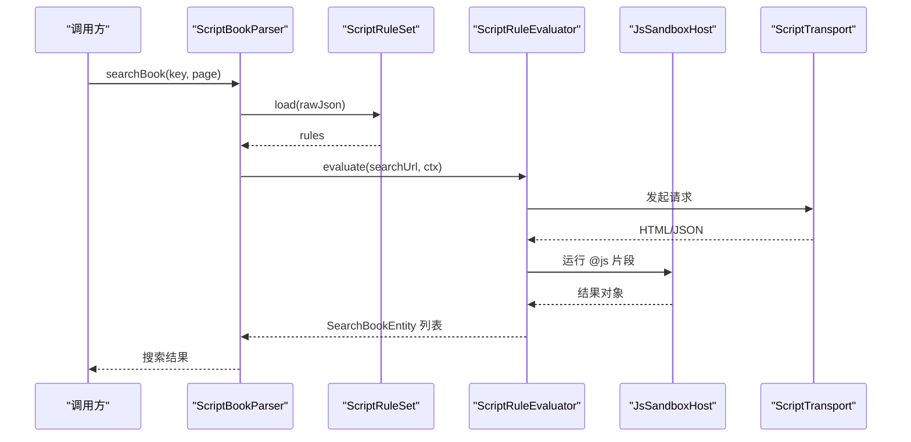

**图表来源**
- [ScriptBookParser.kt:28-68](file://lib_book_source/src/main/java/com/ebook/source/analyze/ScriptBookParser.kt#L28-L68)
- [ScriptRuleSet.kt:20-68](file://lib_book_source/src/main/java/com/ebook/source/script/ScriptRuleSet.kt#L20-L68)
- [ScriptRuleEvaluator.kt:14-45](file://lib_book_source/src/main/java/com/ebook/source/script/ScriptRuleEvaluator.kt#L14-L45)

**章节来源**
- [ScriptBookParser.kt:28-68](file://lib_book_source/src/main/java/com/ebook/source/analyze/ScriptBookParser.kt#L28-L68)
- [ScriptRuleSet.kt:20-68](file://lib_book_source/src/main/java/com/ebook/source/script/ScriptRuleSet.kt#L20-L68)
- [ScriptRuleEvaluator.kt:14-45](file://lib_book_source/src/main/java/com/ebook/source/script/ScriptRuleEvaluator.kt#L14-L45)

#### 4. JavaScript 沙箱机制

沙箱由主进程客户端 `JsSandboxClient` 与子进程服务 `SandboxService` 组成，通过手写 Binder 协议通信：

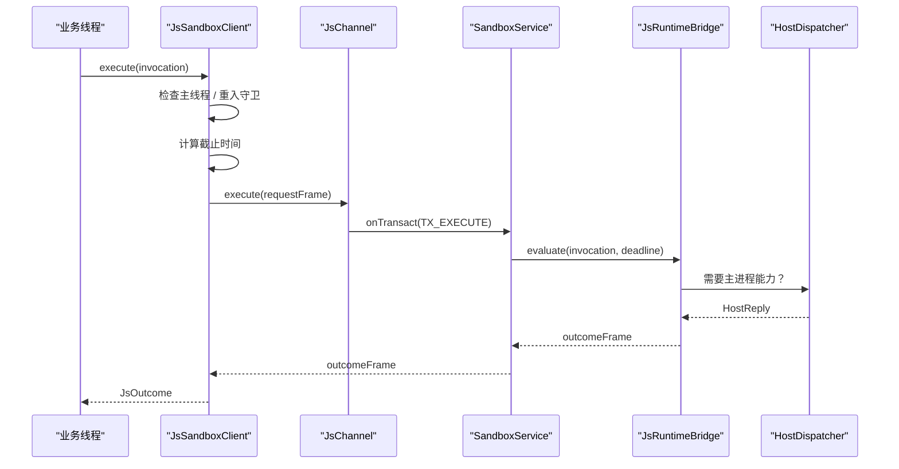

**图表来源**
- [JsSandboxClient.kt:18-85](file://lib_book_source/src/main/java/com/ebook/source/sandbox/JsSandboxClient.kt#L18-L85)
- [SandboxService.kt:20-65](file://lib_book_source/src/main/java/com/ebook/source/sandbox/SandboxService.kt#L20-L65)
- [SandboxContract.kt:12-47](file://lib_book_source/src/main/java/com/ebook/source/sandbox/SandboxContract.kt#L12-L47)

关键安全与可靠性设计：

| 机制 | 目的 | 实现方式 |
|---|---|---|
| 非隔离进程拒绝 | 防止脚本拿到私有目录 | `isInIsolatedProcess` 检查，否则 `onBind` 返回 null |
| 协议版本校验 | 两侧代码不同步时立即拒绝 | `PROTOCOL_VERSION` 比较，不一致写 `UNAVAILABLE` |
| 请求/回复大小限制 | 阻止超大帧撑爆解析器 | `maxRequestBytes`、`maxHostReplyBytes` |
| 主线程检测 | 避免阻塞 UI | 抛出明确异常消息 |
| 回调嵌套守卫 | 防止双向死锁 | `ThreadLocal` 深度计数 |
| 断连重放预算 | 有副作用的请求不重放 | `Attempt.relayed` 记录已转发次数 |
| 单调时钟 | 跨进程超时可比 | `SystemClock.elapsedRealtime()` |

**章节来源**
- [JsSandboxClient.kt:18-85](file://lib_book_source/src/main/java/com/ebook/source/sandbox/JsSandboxClient.kt#L18-L85)
- [JsSandboxClient.kt:100-185](file://lib_book_source/src/main/java/com/ebook/source/sandbox/JsSandboxClient.kt#L100-L185)
- [SandboxService.kt:20-65](file://lib_book_source/src/main/java/com/ebook/source/sandbox/SandboxService.kt#L20-L65)
- [SandboxService.kt:120-210](file://lib_book_source/src/main/java/com/ebook/source/sandbox/SandboxService.kt#L120-L210)
- [SandboxContract.kt:12-47](file://lib_book_source/src/main/java/com/ebook/source/sandbox/SandboxContract.kt#L12-L47)

### 三、`lib_ebook_api`：Retrofit 网络层与拦截器

#### 1. Retrofit 构建器

`RetrofitBuilder` 的职责非常集中：根据基础 URL 创建 Retrofit 实例，并装配：

- kotlinx.serialization 转换器：复用 Hilt 注入的 `Json`，避免 mock 与真实链路 JSON 行为不一致。
- Scalars 转换器：殿后处理 `String` 返回类型，例如书源 HTML。
- 共享 `Call.Factory`：来自 `lib_common` 的 OkHttp 客户端，包含鉴权、白名单、调试脱敏日志。

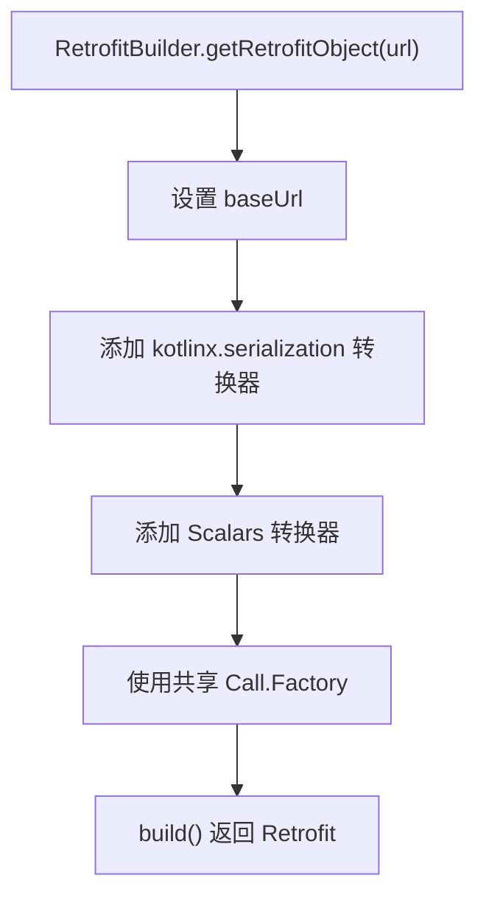

**图表来源**
- [RetrofitBuilder.kt:20-45](file://lib_ebook_api/src/main/java/com/ebook/api/RetrofitBuilder.kt#L20-L45)

#### 2. 编码拦截器

`EncodingInterceptor` 用于修复第三方站点的响应编码问题：

- 历史实现通过反射修改 OkHttp 私有字段 `RealResponseBody.contentTypeString`，存在升级与混淆风险。
- 当前实现使用公开 API：`body.source().asResponseBody(MediaType?)` 包装新 `ResponseBody`，再 `response.newBuilder().body(...).build()` 替换。
- 强制类型设为 `application/rss+xml;charset=<encoding>`，正文流式透传，`contentLength` 保持未知以避免全量缓冲。

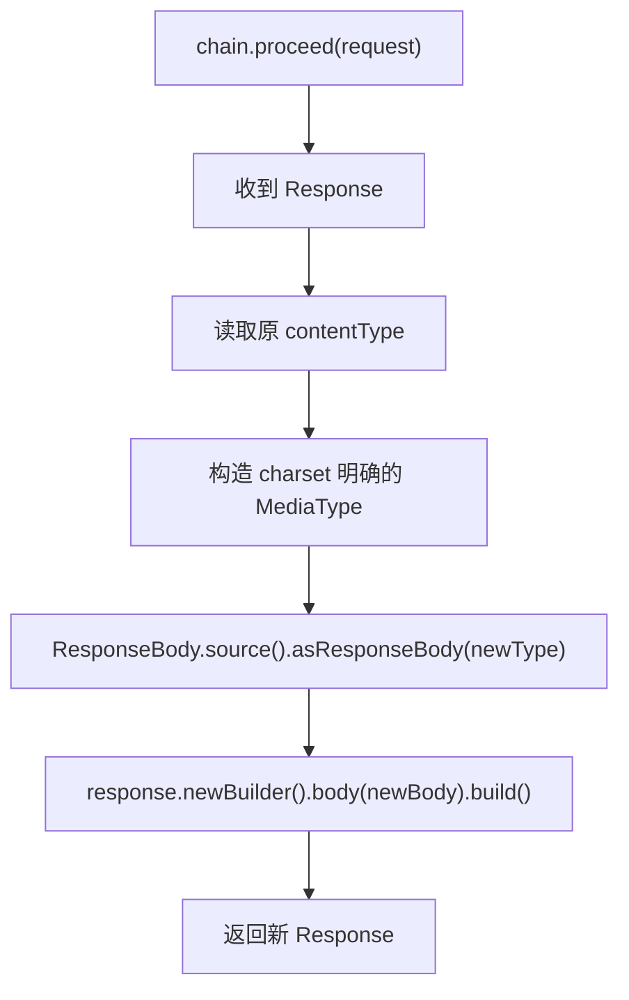

**图表来源**
- [EncodingInterceptor.kt:13-51](file://lib_ebook_api/src/main/java/com/ebook/api/intercepter/EncodingInterceptor.kt#L13-L51)

**章节来源**
- [RetrofitBuilder.kt:20-45](file://lib_ebook_api/src/main/java/com/ebook/api/RetrofitBuilder.kt#L20-L45)
- [EncodingInterceptor.kt:13-51](file://lib_ebook_api/src/main/java/com/ebook/api/intercepter/EncodingInterceptor.kt#L13-L51)

### 四、`lib_ebook_db`：Room 数据库设计与迁移策略

#### 1. 数据库装配

`AppDatabase` 声明八张表及其 DAO，当前版本为 8：

| 表 | 主键 | 用途 |
|---|---|---|
| `book_shelf` | `note_url` | 书架列表、阅读进度 |
| `book_info` | `note_url` | 书名、作者、封面、目录 URL、状态 |
| `chapter_list` | `content_ref` | 章节目录，含 `note_url` 索引 |
| `search_history` | `id` 自增 | 搜索词流水 |
| `download_chapter` | `id` 自增 | 下载任务流水 |
| `book_group` | — | 作品身份关联（评论桶键、来源条目） |
| `book_source` | `url` | 书源站点规则清单 |
| `paused_book` | `note_url` | 按书暂停标记 |

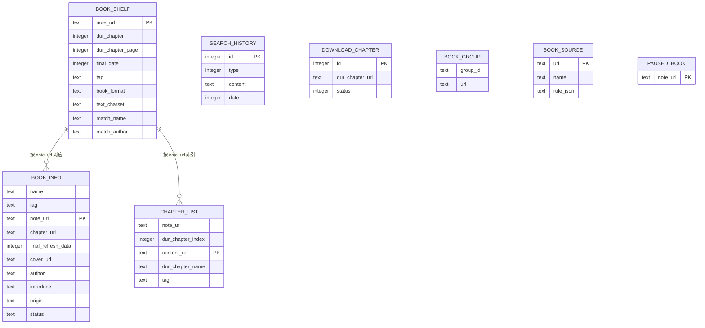

**图表来源**
- [AppDatabase.kt:24-75](file://lib_ebook_db/src/main/java/com/ebook/db/AppDatabase.kt#L24-L75)
- [AppDatabase.kt:1-23](file://lib_ebook_db/schemas/com.ebook.db.AppDatabase/8.json#L1-L23)

#### 2. 主键策略

| 数据类型 | 主键策略 | 理由 |
|---|---|---|
| 书架、书籍 | 自然键 `note_url` | 同一 URL 天然唯一，upsert 语义清晰 |
| 章节 | `content_ref` | 承载本地章文件路径，改名后仍保持幂等 |
| 书源 | `url` | 一个站点只存一份规则 |
| 暂停标记 | `note_url` | 一本书最多一行，REPLACE 即幂等 |
| 下载任务、搜索历史 | 自增 `id` | 流水型数据，去重在仓库层做 |

#### 3. 迁移策略

文档明确要求：

- 改实体必须同步：版本号 +1、追加紧邻迁移、提交生成的 schema JSON。
- 禁止启用 `fallbackToDestructiveMigration`。
- 已删除字段：v4 移除正文表和 `has_cache` 列，正文迁到 BookStore 章文件。
- v8 新增 `paused_book` 表，作为下载队列的按书暂停事实源。

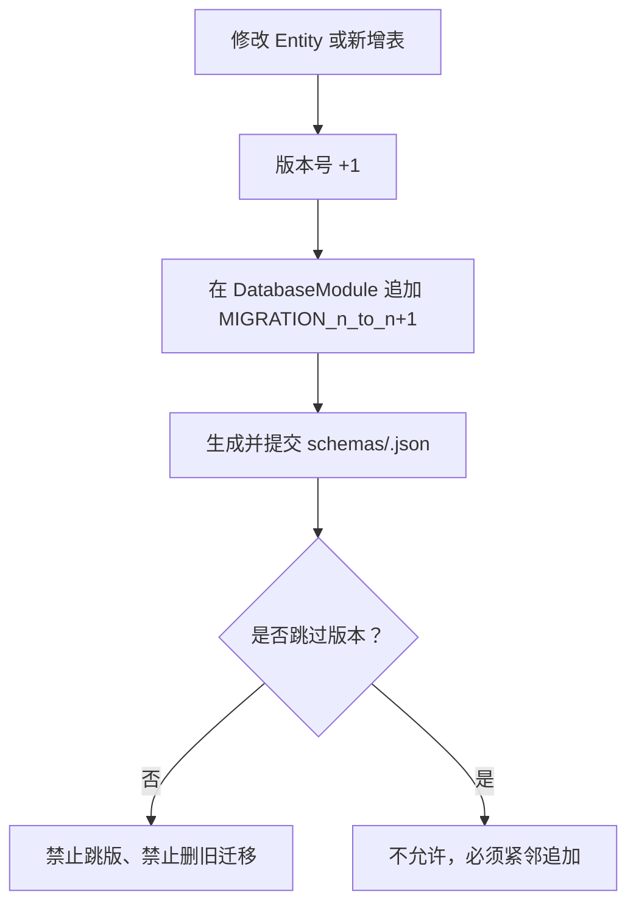

**图表来源**
- [AppDatabase.kt:40-75](file://lib_ebook_db/src/main/java/com/ebook/db/AppDatabase.kt#L40-L75)

**章节来源**
- [AppDatabase.kt:24-75](file://lib_ebook_db/src/main/java/com/ebook/db/AppDatabase.kt#L24-L75)
- [AppDatabase.kt:1-23](file://lib_ebook_db/schemas/com.ebook.db.AppDatabase/8.json#L1-L23)

## 架构总览

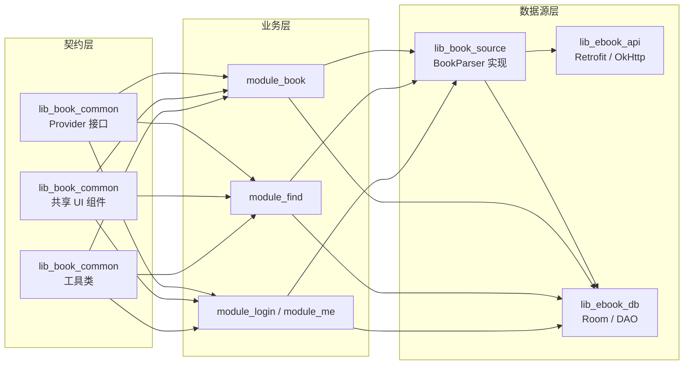

**图表来源**
- [IBookProvider.kt:9-23](file://lib_book_common/src/main/java/com/ebook/common/provider/IBookProvider.kt#L9-L23)
- [BookParser.kt:12-30](file://lib_book_source/src/main/java/com/ebook/source/analyze/BookParser.kt#L12-L30)
- [RetrofitBuilder.kt:20-45](file://lib_ebook_api/src/main/java/com/ebook/api/RetrofitBuilder.kt#L20-L45)
- [AppDatabase.kt:24-75](file://lib_ebook_db/src/main/java/com/ebook/db/AppDatabase.kt#L24-L75)

## 详细组件分析

### 一、Provider 扩展点与宿主注入

#### 扩展点设计

每个业务模块对外暴露一个 Provider 接口，宿主通过路由或依赖注入找到实现：

- `IBookProvider.mainBookPage` 接受 `onGoBookstore` 回调，解决书架空态跳转到宿主页面的问题。
- `ILoginProvider.logout` 只负责服务端会话作废；本地会话清理由 `UserSessionManager.clearSession` 统一处理，调用顺序为“尽力作废服务端 → 无条件清本地”。
- 独立运行时（`isModule=true`）可能没有 `module_login`，因此调用方应允许 Provider 为空。

#### 最佳实践

1. 不要直接在 Provider 里持有 `NavController` 或路由字符串。
2. 回调参数用可空表达“宿主未提供该能力”，调用方据此决定是否渲染按钮。
3. 跨模块登出职责分离：服务端登出走 Provider，本地会话清理走 SessionManager。

**章节来源**
- [IBookProvider.kt:9-23](file://lib_book_common/src/main/java/com/ebook/common/provider/IBookProvider.kt#L9-L23)
- [ILoginProvider.kt:9-19](file://lib_book_common/src/main/java/com/ebook/common/provider/ILoginProvider.kt#L9-L19)

### 二、书源解析流水线

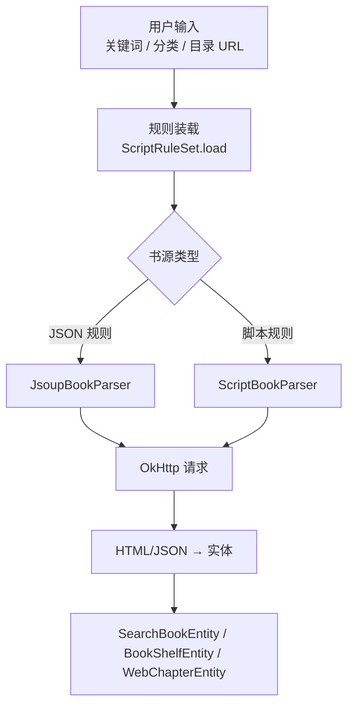

**图表来源**
- [BookParser.kt:12-30](file://lib_book_source/src/main/java/com/ebook/source/analyze/BookParser.kt#L12-L30)
- [ScriptRuleSet.kt:20-68](file://lib_book_source/src/main/java/com/ebook/source/script/ScriptRuleSet.kt#L20-L68)
- [JsoupBookParser.kt:26-52](file://lib_book_source/src/main/java/com/ebook/source/analyze/JsoupBookParser.kt#L26-L52)

### 三、脚本规则求值流程

```mermaid
flowchart TD
    Start["evaluate(rule, input, tail)"] --> Expand["展开 {{}} 变量"]
    Expand --> Split["RuleSplitter.parse"]
    Split --> Branch{"节点类型"}
    Branch -->|Leaf| LeafEval["按模式求值<br/>正则 / CSS / JSONPath / JS"]
    Branch -->|AllOf|| Merge["合并多个分支"]
    Branch -->|FirstOf|| First["短路取第一个有效结果"]
    Branch -->|Percent|| Interleave["交错合并多条流"]
    LeafEval --> Replace["ReplacementApplier.apply"]
    Merge --> Replace
    First --> Replace
    Interleave --> Replace
    Replace --> Tail["附加 URL 选项尾段"]
    Tail --> Fill["Expansion.fillResult"]
    Fill --> End["返回 RuleResult"]
```

**图表来源**
- [ScriptRuleEvaluator.kt:14-45](file://lib_book_source/src/main/java/com/ebook/source/script/ScriptRuleEvaluator.kt#L14-L45)
- [ScriptRuleEvaluator.kt:46-120](file://lib_book_source/src/main/java/com/ebook/source/script/ScriptRuleEvaluator.kt#L46-L120)

### 四、沙箱安全控制流程

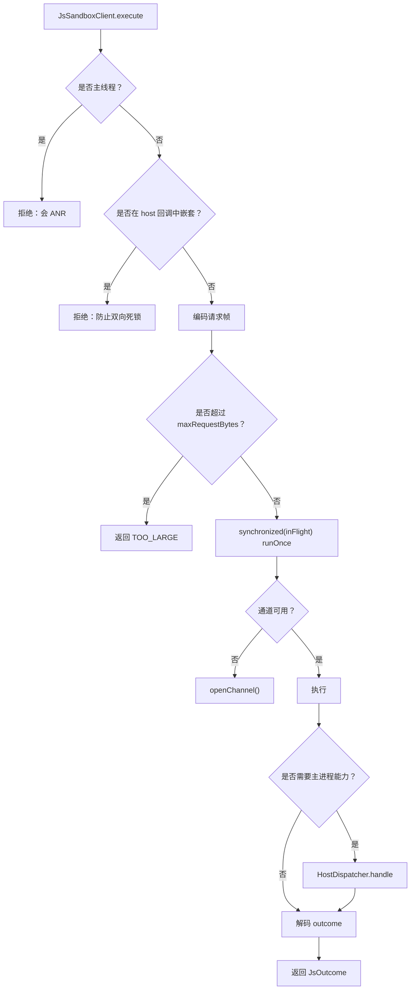

**图表来源**
- [JsSandboxClient.kt:18-85](file://lib_book_source/src/main/java/com/ebook/source/sandbox/JsSandboxClient.kt#L18-L85)
- [JsSandboxClient.kt:100-185](file://lib_book_source/src/main/java/com/ebook/source/sandbox/JsSandboxClient.kt#L100-L185)

### 五、Retrofit 与 OkHttp 拦截链

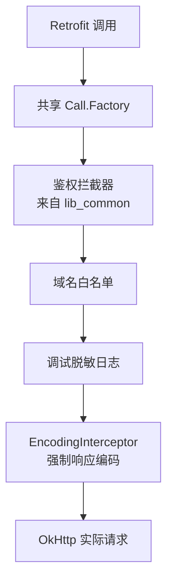

**图表来源**
- [RetrofitBuilder.kt:20-45](file://lib_ebook_api/src/main/java/com/ebook/api/RetrofitBuilder.kt#L20-L45)
- [EncodingInterceptor.kt:13-51](file://lib_ebook_api/src/main/java/com/ebook/api/intercepter/EncodingInterceptor.kt#L13-L51)

### 六、数据库版本管理流程

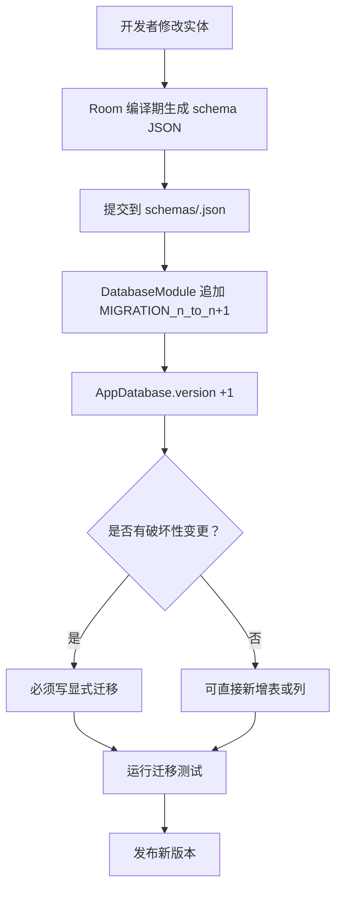

**图表来源**
- [AppDatabase.kt:40-75](file://lib_ebook_db/src/main/java/com/ebook/db/AppDatabase.kt#L40-L75)

**章节来源**
- [ScriptRuleEvaluator.kt:14-120](file://lib_book_source/src/main/java/com/ebook/source/script/ScriptRuleEvaluator.kt#L14-L120)
- [JsSandboxClient.kt:18-185](file://lib_book_source/src/main/java/com/ebook/source/sandbox/JsSandboxClient.kt#L18-L185)
- [RetrofitBuilder.kt:20-45](file://lib_ebook_api/src/main/java/com/ebook/api/RetrofitBuilder.kt#L20-L45)
- [EncodingInterceptor.kt:13-51](file://lib_ebook_api/src/main/java/com/ebook/api/intercepter/EncodingInterceptor.kt#L13-L51)
- [AppDatabase.kt:40-75](file://lib_ebook_db/src/main/java/com/ebook/db/AppDatabase.kt#L40-L75)

## 依赖关系分析

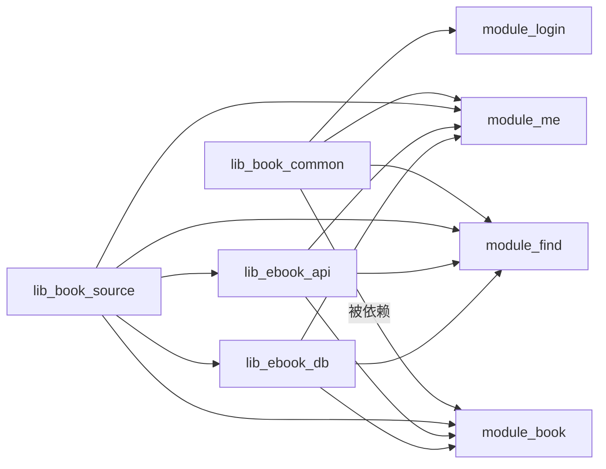

**图表来源**
- [BookParser.kt:12-30](file://lib_book_source/src/main/java/com/ebook/source/analyze/BookParser.kt#L12-L30)
- [AppDatabase.kt:24-75](file://lib_ebook_db/src/main/java/com/ebook/db/AppDatabase.kt#L24-L75)
- [RetrofitBuilder.kt:20-45](file://lib_ebook_api/src/main/java/com/ebook/api/RetrofitBuilder.kt#L20-L45)

### 耦合与内聚评估

| 维度 | 现状 | 建议 |
|---|---|---|
| Provider 耦合 | 低：仅接口契约，实现位于业务模块 | 继续只暴露最小能力，不引入宿主内部类型 |
| 书源解析耦合 | 中：依赖 `lib_ebook_api` 的 OkHttp 和 `lib_ebook_db` 的实体 | 通过 `BookParser` 接口收敛，新增解析器无需改动上层 |
| 沙箱耦合 | 高但受控：Binder 协议集中在 `SandboxContract` | 协议变更必须同时更新两端版本，不可静默演进 |
| 数据库耦合 | 中：实体与 DAO 在 `lib_ebook_db` 内聚合 | 新增表必须走迁移链，禁止旁路直连数据库 |
| 网络耦合 | 低：RetrofitBuilder 单一装配点 | 新增拦截器应放在链中明确位置，并在测试中验证顺序 |

**章节来源**
- [SandboxContract.kt:12-47](file://lib_book_source/src/main/java/com/ebook/source/sandbox/SandboxContract.kt#L12-L47)
- [AppDatabase.kt:40-75](file://lib_ebook_db/src/main/java/com/ebook/db/AppDatabase.kt#L40-L75)
- [RetrofitBuilder.kt:20-45](file://lib_ebook_api/src/main/java/com/ebook/api/RetrofitBuilder.kt#L20-L45)

## 性能与可靠性特征

### 1. 脚本执行性能

- 规则装载惰性进行，避免构造期 JSON 解析成本。
- 沙箱执行串行化，避免多源并发争抢同一个 native runtime。
- 截止时间基于单调时钟，排队等待的请求也会携带相同期限，避免隐式延长超时。
- 请求帧超限直接返回 `TOO_LARGE`，不走远端。

### 2. 网络性能

- `EncodingInterceptor` 使用流式 `ResponseBody.source()`，不缓冲整页。
- Retrofit 复用共享 `Call.Factory`，减少 OkHttp 客户端重复创建。
- JSON 转换器与 Scalars 转换器顺序固定，避免误把 HTML 当 JSON 解析。

### 3. 数据库性能

- 章节表对 `note_url` 建索引，便于按书查询目录。
- 主键策略尽量使用自然键，减少自增 ID 竞争和额外映射。
- 流水型数据（下载任务、搜索历史）用自增 ID，去重上移到仓库。

### 4. 可靠性

- 沙箱协议版本不合、接口标识不符、帧读不出均走明确错误路径。
- 断连后最多重放一次，且已转发过 host 回调的请求不再重放。
- 数据库禁止破坏性回退迁移，避免自动重建丢失用户数据。

[本节为通用性能讨论，不直接分析具体代码行]

## 故障排查指南

### 1. 沙箱不可用

| 现象 | 可能原因 | 排查步骤 |
|---|---|---|
| 返回 `UNAVAILABLE` | `.so` 加载失败、协议版本不合、进程非隔离 | 检查 `SandboxService.onBind` 是否返回 null、协议版本是否一致 |
| 主线程报错 | 在非 UI 线程外调用了沙箱 | 检查调用栈，确认在 IO 或协程后台线程执行 |
| 断连后失败 | Binder 通道损坏、子进程崩溃 | 查看 `afterDisconnect` 日志，确认重放是否被禁止 |
| 请求过大 | 绑定变量或 URL 超 `maxRequestBytes` | 缩小 `sourceJson`、`bookJson` 或拆分长规则 |

**章节来源**
- [JsSandboxClient.kt:18-85](file://lib_book_source/src/main/java/com/ebook/source/sandbox/JsSandboxClient.kt#L18-L85)
- [JsSandboxClient.kt:100-185](file://lib_book_source/src/main/java/com/ebook/source/sandbox/JsSandboxClient.kt#L100-L185)
- [SandboxService.kt:20-65](file://lib_book_source/src/main/java/com/ebook/source/sandbox/SandboxService.kt#L20-L65)

### 2. 书源解析失败

| 现象 | 可能原因 | 排查步骤 |
|---|---|---|
| 搜索返回空列表 | 未配 `searchUrl` 或规则匹配不到 | 区分“未配置”和“解析失败”；检查 `parseSearchBookWithRule` |
| 详情页信息缺失 | 字段选择器错误或字符集不对 | 检查 `JsoupHelper.selectText` 对应规则，确认编码拦截器生效 |
| 章节顺序反了 | `reverse` 或 `reverseToc` 配置导致 | 检查 `TocPager.collect` 后的反转逻辑 |
| 脚本报语法错误 | `@js:` 用法非法、变量未展开 | 查看 `ScriptRuleEvaluator` 抛出的类型化异常 |

**章节来源**
- [JsoupBookParser.kt:26-52](file://lib_book_source/src/main/java/com/ebook/source/analyze/JsoupBookParser.kt#L26-L52)
- [ScriptRuleEvaluator.kt:14-45](file://lib_book_source/src/main/java/com/ebook/source/script/ScriptRuleEvaluator.kt#L14-L45)

### 3. 网络响应乱码

| 现象 | 可能原因 | 排查步骤 |
|---|---|---|
| 中文正文乱码 | 站点 Content-Type 缺 charset | 检查 `EncodingInterceptor` 是否生效 |
| 全部书源请求失败 | 旧反射实现残留或 R8 混淆 | 确认使用公开 API 封装，不要直接反射 OkHttp 私有字段 |
| Retrofit 报 JSON 解析错误 | 忘记注册 kotlinx 转换器 | 检查 `RetrofitBuilder` 转换器顺序 |

**章节来源**
- [EncodingInterceptor.kt:13-51](file://lib_ebook_api/src/main/java/com/ebook/api/intercepter/EncodingInterceptor.kt#L13-L51)
- [RetrofitBuilder.kt:20-45](file://lib_ebook_api/src/main/java/com/ebook/api/RetrofitBuilder.kt#L20-L45)

### 4. 数据库迁移失败

| 现象 | 可能原因 | 排查步骤 |
|---|---|---|
| 启动崩溃 | 版本号与 schema 不一致 | 检查 `AppDatabase.version` 与 `schemas/<version>.json` |
| 用户数据丢失 | 启用了破坏性迁移 | 确认未开启 `fallbackToDestructiveMigration` |
| 新增表后旧版本无法安装 | 缺少相邻迁移 | 在 `DatabaseModule` 追加 `MIGRATION_n_to_n+1` |

**章节来源**
- [AppDatabase.kt:40-75](file://lib_ebook_db/src/main/java/com/ebook/db/AppDatabase.kt#L40-L75)

## 集成最佳实践

### 1. Provider 集成

- 在宿主模块中实现 `IBookProvider`、`IFindProvider`、`IMeProvider`。
- 将 Provider 暴露给 `module_main` 的导航系统，而不是让业务模块互相依赖。
- 对 `ILoginProvider.logout` 调用需容忍空实现；本地会话清理交给 `UserSessionManager.clearSession`。

### 2. 书源集成

- 新增书源时优先编写 JSON 规则；复杂站点才启用脚本。
- 脚本规则应避免无限循环和超大响应；利用沙箱限值和截止日期保护。
- 不要在解析器中直接操作 Room；解析器只负责“网络到实体”的转换。

### 3. 网络层集成

- 使用 `RetrofitBuilder.getRetrofitObject(baseUrl)` 创建 Retrofit，不要自建 OkHttpClient。
- 新增拦截器时明确其在链中的位置：鉴权、白名单、日志、编码应在正确顺序。
- 对 HTML 响应使用 `ScalarsConverterFactory`，对 JSON 响应使用 kotlinx.serialization。

### 4. 数据库集成

- 新增实体时同步完成三件事：版本号 +1、追加相邻迁移、提交 schema JSON。
- 优先使用自然键建模实体关系；流水型数据才用自增 ID。
- DAO 方法只做数据访问，业务编排留在仓库或 ViewModel。

### 5. 共享 UI 集成

- 使用 `CommonCard`、`CommonItemCard`、`CommonListItem` 替代各模块自绘卡片。
- 书条目使用 `BookItemFrame`，保证找书与书架视觉一致。
- 默认封面占位图使用 `rememberCoverPlaceholderPainter`，避免 NinePatch 资源解析异常。

**章节来源**
- [IBookProvider.kt:9-23](file://lib_book_common/src/main/java/com/ebook/common/provider/IBookProvider.kt#L9-L23)
- [ILoginProvider.kt:9-19](file://lib_book_common/src/main/java/com/ebook/common/provider/ILoginProvider.kt#L9-L19)
- [RetrofitBuilder.kt:20-45](file://lib_ebook_api/src/main/java/com/ebook/api/RetrofitBuilder.kt#L20-L45)
- [AppDatabase.kt:40-75](file://lib_ebook_db/src/main/java/com/ebook/db/AppDatabase.kt#L40-L75)
- [BookItemLayout.kt:17-180](file://lib_book_common/src/main/java/com/ebook/common/ui/BookItemLayout.kt#L17-L180)
- [CommonPainters.kt:13-38](file://lib_book_common/src/main/java/com/ebook/common/ui/CommonPainters.kt#L13-L38)

## 结论

这四个基础设施模块构成了小说阅读器的稳定底座：

- `lib_book_common` 用 Provider 接口解耦业务模块，用共享 UI 统一视觉语言，用工具类收敛通用逻辑。
- `lib_book_source` 用 `BookParser` 抽象统一书源接入，用 JSON 规则和 JavaScript 脚本支持灵活站点适配，用沙箱隔离不可信代码。
- `lib_ebook_api` 用 `RetrofitBuilder` 和 `EncodingInterceptor` 统一网络装配，确保 JSON 与 HTML 都能正确解析。
- `lib_ebook_db` 用 Room 管理本地数据，用严格迁移策略保障用户数据不丢失。

上层业务模块可以专注于书架、阅读器、书城、登录和个人中心等业务体验，而把站点适配、网络细节和本地存储交给这些基础设施模块。新增书源、新页面、新接口或新表时，都应沿着既定的接口契约、解析器抽象、Retrofit 装配点和数据库迁移流程进行，从而维持系统的可扩展性与可维护性。