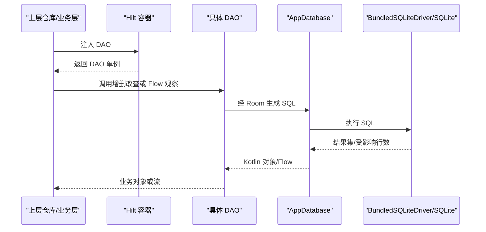
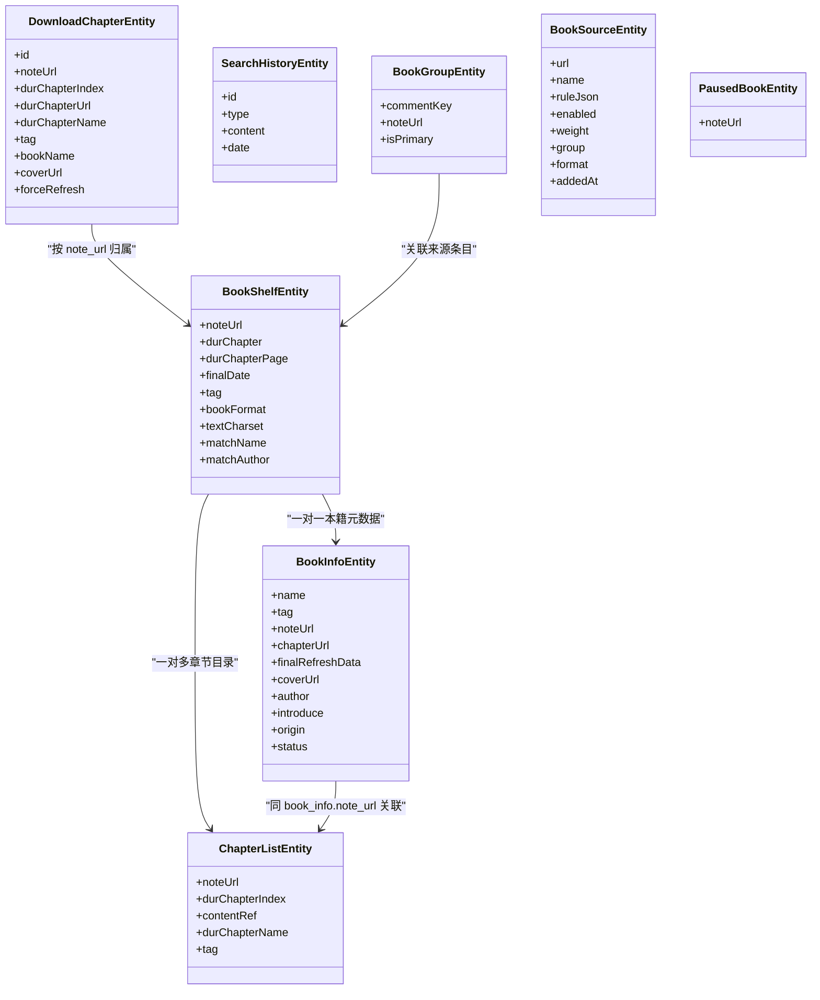
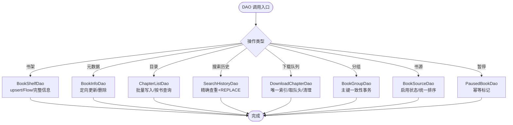
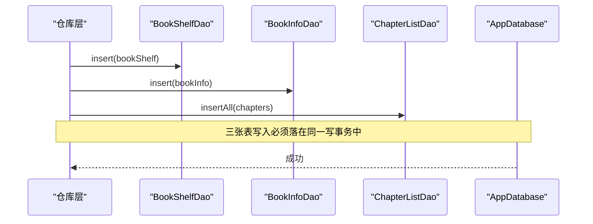
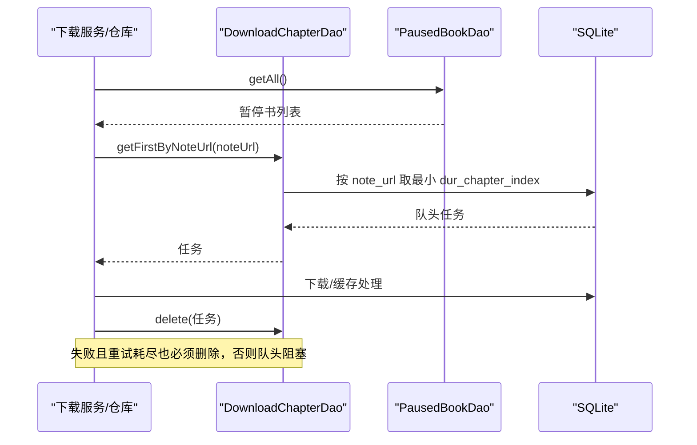
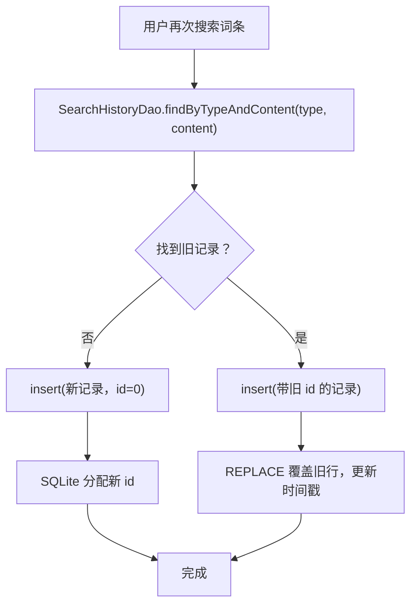
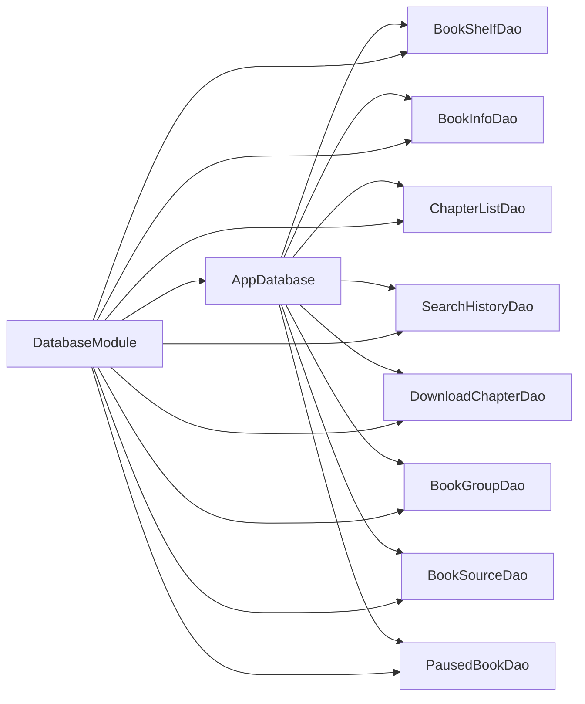
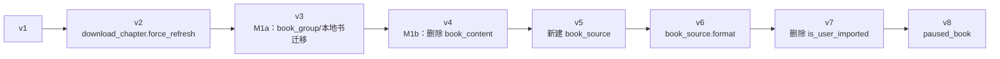

# 数据库模块 lib_ebook_db

<cite>
**本文引用的文件**   
- [AppDatabase.kt](file://lib_ebook_db/src/main/java/com/ebook/db/AppDatabase.kt)
- [DatabaseModule.kt](file://lib_ebook_db/src/main/java/com/ebook/db/di/DatabaseModule.kt)
- [build.gradle.kts](file://lib_ebook_db/build.gradle.kts)
- [BookInfoEntity.kt](file://lib_ebook_db/src/main/java/com/ebook/db/entity/BookInfoEntity.kt)
- [BookShelfEntity.kt](file://lib_ebook_db/src/main/java/com/ebook/db/entity/BookShelfEntity.kt)
- [ChapterListEntity.kt](file://lib_ebook_db/src/main/java/com/ebook/db/entity/ChapterListEntity.kt)
- [SearchHistoryEntity.kt](file://lib_ebook_db/src/main/java/com/ebook/db/entity/SearchHistoryEntity.kt)
- [DownloadChapterEntity.kt](file://lib_ebook_db/src/main/java/com/ebook/db/entity/DownloadChapterEntity.kt)
- [BookGroupEntity.kt](file://lib_ebook_db/src/main/java/com/ebook/db/entity/BookGroupEntity.kt)
- [BookSourceEntity.kt](file://lib_ebook_db/src/main/java/com/ebook/db/entity/BookSourceEntity.kt)
- [PausedBookEntity.kt](file://lib_ebook_db/src/main/java/com/ebook/db/entity/PausedBookEntity.kt)
- [DBCode.kt](file://lib_ebook_db/src/main/java/com/ebook/db/event/DBCode.kt)
- [BookInfoDao.kt](file://lib_ebook_db/src/main/java/com/ebook/db/dao/BookInfoDao.kt)
- [BookShelfDao.kt](file://lib_ebook_db/src/main/java/com/ebook/db/dao/BookShelfDao.kt)
- [ChapterListDao.kt](file://lib_ebook_db/src/main/java/com/ebook/db/dao/ChapterListDao.kt)
- [SearchHistoryDao.kt](file://lib_ebook_db/src/main/java/com/ebook/db/dao/SearchHistoryDao.kt)
- [DownloadChapterDao.kt](file://lib_ebook_db/src/main/java/com/ebook/db/dao/DownloadChapterDao.kt)
- [BookGroupDao.kt](file://lib_ebook_db/src/main/java/com/ebook/db/dao/BookGroupDao.kt)
- [BookSourceDao.kt](file://lib_ebook_db/src/main/java/com/ebook/db/dao/BookSourceDao.kt)
- [PausedBookDao.kt](file://lib_ebook_db/src/main/java/com/ebook/db/dao/PausedBookDao.kt)
</cite>

## 目录
1. [简介](#简介)
2. [项目结构](#项目结构)
3. [核心组件](#核心组件)
4. [架构总览](#架构总览)
5. [详细组件分析](#详细组件分析)
6. [依赖关系分析](#依赖关系分析)
7. [性能与索引优化](#性能与索引优化)
8. [版本迁移策略](#版本迁移策略)
9. [事件监听与数据同步](#事件监听与数据同步)
10. [备份、恢复与存储管理](#备份恢复与存储管理)
11. [测试策略](#测试策略)
12. [故障排查指南](#故障排查指南)
13. [结论](#结论)

## 简介
本模块是电子书应用的数据持久层，基于 Room 3（`androidx.room3`）构建，提供书架、书籍信息、章节目录、搜索历史、下载队列、作品分组、书源规则以及按书暂停标记等八张表。所有读写统一由 DAO 暴露，上层仓库通过 Hilt 注入 DAO；数据库实例以单例形式创建，使用 `BundledSQLiteDriver` 驱动，避免设备 SQLite 版本差异带来的 DDL 能力不确定性。

该模块不直接持有业务状态：它只负责离线可读数据的持久化、迁移与访问契约。正文内容已迁移到 BookStore 的章文件，数据库仅保留元数据、目录、任务与规则。

## 项目结构
lib_ebook_db 采用“包分层 + 领域分表”的组织方式：

```mermaid
graph TB
    subgraph "数据库入口"
        AppDb["AppDatabase<br/>Room 数据库装配"]
        DbMod["DatabaseModule<br/>Hilt 提供 DAO/迁移/驱动"]
    end

    subgraph "实体层 entity"
        Shelf["BookShelfEntity<br/>书架/阅读进度"]
        Info["BookInfoEntity<br/>书名/作者/封面/状态"]
        Chapter["ChapterListEntity<br/>章节列表"]
        SearchHist["SearchHistoryEntity<br/>搜索历史流水"]
        DlChap["DownloadChapterEntity<br/>下载队列任务"]
        Group["BookGroupEntity<br/>来源条目→评论桶键映射"]
        Source["BookSourceEntity<br/>书源站点规则"]
        Pause["PausedBookEntity<br/>按书暂停标记"]
    end

    subgraph "DAO 层 dao"
        ShelfDao["BookShelfDao"]
        InfoDao["BookInfoDao"]
        ChapterDao["ChapterListDao"]
        SearchDao["SearchHistoryDao"]
        DlDao["DownloadChapterDao"]
        GroupDao["BookGroupDao"]
        SourceDao["BookSourceDao"]
        PauseDao["PausedBookDao"]
    end

    subgraph "事件与常量"
        DBCode["DBCode<br/>页面索引边界常量"]
    end

    AppDb --> Shelf
    AppDb --> Info
    AppDb --> Chapter
    AppDb --> SearchHist
    AppDb --> DlChap
    AppDb --> Group
    AppDb --> Source
    AppDb --> Pause

    DbMod --> ShelfDao
    DbMod --> InfoDao
    DbMod --> ChapterDao
    DbMod --> SearchDao
    DbMod --> DlDao
    DbMod --> GroupDao
    DbMod --> SourceDao
    DbMod --> PauseDao

    Shelf --> DBCode
```

**图表来源**
- [AppDatabase.kt:15-76](file://lib_ebook_db/src/main/java/com/ebook/db/AppDatabase.kt#L15-L76)
- [DatabaseModule.kt:1-243](file://lib_ebook_db/src/main/java/com/ebook/db/di/DatabaseModule.kt#L1-L243)

**章节来源**
- [AppDatabase.kt:15-76](file://lib_ebook_db/src/main/java/com/ebook/db/AppDatabase.kt#L15-L76)
- [DatabaseModule.kt:1-243](file://lib_ebook_db/src/main/java/com/ebook/db/di/DatabaseModule.kt#L1-L243)

## 核心组件
| 组件 | 职责 | 关键设计点 |
|---|---|---|
| `AppDatabase` | Room 数据库类，声明实体与 DAO 装配 | 版本 8；导出 schema；主键采用自然键策略；不启用破坏性迁移 |
| `DatabaseModule` | Hilt 模块，提供数据库实例与各 DAO | 使用 `BundledSQLiteDriver`；维护 v1→v8 迁移链；为每个 DAO 提供单例 |
| 实体集合 | 描述八张表的字段、主键、索引和约束 | 大部分实现 `Parcelable`；部分列含默认值或业务常量 |
| DAO 集合 | 封装 CRUD、复杂查询、Flow 观察、事务操作 | 区分一次性查询与响应式 Flow；强调 upsert、REPLACE、删除不变式 |
| `DBCode` | 数据库相关常量接口 | 当前暴露阅读页索引起止边界常量 |

**章节来源**
- [AppDatabase.kt:15-76](file://lib_ebook_db/src/main/java/com/ebook/db/AppDatabase.kt#L15-L76)
- [DatabaseModule.kt:1-243](file://lib_ebook_db/src/main/java/com/ebook/db/di/DatabaseModule.kt#L1-L243)
- [DBCode.kt:1-10](file://lib_ebook_db/src/main/java/com/ebook/db/event/DBCode.kt#L1-L10)

## 架构总览
从调用方到数据库的整体路径如下：

**图表来源**
- [DatabaseModule.kt:201-243](file://lib_ebook_db/src/main/java/com/ebook/db/di/DatabaseModule.kt#L201-L243)
- [AppDatabase.kt:15-76](file://lib_ebook_db/src/main/java/com/ebook/db/AppDatabase.kt#L15-L76)

### 数据库实例与连接池配置
- 数据库名称固定为 `ebook_db`，更改名称等于更换物理库，迁移链只对同名文件生效。
- 数据库版本为 8，开启 `exportSchema = true`，由约定插件把 JSON schema 输出到模块 `schemas/` 目录。
- 驱动使用 `BundledSQLiteDriver()`，保证 DDL 能力由打包的 SQLite 决定，而非设备系统版本。
- 未启用 `fallbackToDestructiveMigration`，禁止破坏性迁移。
- 没有显式配置线程池；Room 默认在后台调度器执行挂起 DAO 方法，适合协程模型。
- 连接池层面由底层 SQLite 管理，模块未自定义连接池参数。

**章节来源**
- [AppDatabase.kt:49-76](file://lib_ebook_db/src/main/java/com/ebook/db/AppDatabase.kt#L49-L76)
- [DatabaseModule.kt:201-216](file://lib_ebook_db/src/main/java/com/ebook/db/di/DatabaseModule.kt#L201-L216)
- [build.gradle.kts:21-35](file://lib_ebook_db/build.gradle.kts#L21-L35)

## 详细组件分析

### 实体设计与关系映射

#### 实体类图

**图表来源**
- [BookShelfEntity.kt:1-83](file://lib_ebook_db/src/main/java/com/ebook/db/entity/BookShelfEntity.kt#L1-L83)
- [BookInfoEntity.kt:1-73](file://lib_ebook_db/src/main/java/com/ebook/db/entity/BookInfoEntity.kt#L1-L73)
- [ChapterListEntity.kt:1-52](file://lib_ebook_db/src/main/java/com/ebook/db/entity/ChapterListEntity.kt#L1-L52)
- [DownloadChapterEntity.kt:1-88](file://lib_ebook_db/src/main/java/com/ebook/db/entity/DownloadChapterEntity.kt#L1-L88)
- [SearchHistoryEntity.kt:1-43](file://lib_ebook_db/src/main/java/com/ebook/db/entity/SearchHistoryEntity.kt#L1-L43)
- [BookGroupEntity.kt:1-37](file://lib_ebook_db/src/main/java/com/ebook/db/entity/BookGroupEntity.kt#L1-L37)
- [BookSourceEntity.kt:1-91](file://lib_ebook_db/src/main/java/com/ebook/db/entity/BookSourceEntity.kt#L1-L91)
- [PausedBookEntity.kt:1-30](file://lib_ebook_db/src/main/java/com/ebook/db/entity/PausedBookEntity.kt#L1-L30)

#### 核心实体说明

| 实体 | 主键 | 关键字段 | 关系与约束 |
|---|---|---|---|
| `BookShelfEntity` | `note_url` | `dur_chapter`、`dur_chapter_page`、`final_date`、`tag`、`book_format`、`text_charset`、`match_name`、`match_author` | 书架行；与 `book_info.note_url` 一对一；`tag` 指向书源 URL 或本地常量 |
| `BookInfoEntity` | `note_url` | `name`、`author`、`cover_url`、`chapter_url`、`final_refresh_data`、`status` | 书籍元数据；与书架共享 `note_url`；`chapterList` 标注 `@Ignore` 不落库 |
| `ChapterListEntity` | `content_ref` | `note_url`、`dur_chapter_index`、`dur_chapter_name`、`tag` | 章节目录；对 `note_url` 建普通索引；`content_ref` 承载本地路径或网络 URL |
| `SearchHistoryEntity` | `id`（自增） | `type`、`content`、`date` | 流水型数据；去重责任在仓库层，不在数据库约束 |
| `DownloadChapterEntity` | `id`（自增） | `note_url`、`dur_chapter_index`、`dur_chapter_url`、`tag`、`book_name`、`cover_url`、`force_refresh` | 未完成下载任务；`dur_chapter_url` 唯一索引；`note_url` 普通索引 |
| `BookGroupEntity` | `(comment_key, note_url)` | `is_primary` | 来源条目与评论桶键的多对多映射；业务保证每书恰好一个主键 |
| `BookSourceEntity` | `url` | `name`、`rule_json`、`enabled`、`weight`、`group_name`、`format`、`added_at` | 书源规则；格式列默认 `native`；整块 JSON 存储规则 |
| `PausedBookEntity` | `note_url` | 无其他字段 | v8 新增；存在即该书暂停；与书架无外键约束 |

**章节来源**
- [BookShelfEntity.kt:1-83](file://lib_ebook_db/src/main/java/com/ebook/db/entity/BookShelfEntity.kt#L1-L83)
- [BookInfoEntity.kt:1-73](file://lib_ebook_db/src/main/java/com/ebook/db/entity/BookInfoEntity.kt#L1-L73)
- [ChapterListEntity.kt:1-52](file://lib_ebook_db/src/main/java/com/ebook/db/entity/ChapterListEntity.kt#L1-L52)
- [SearchHistoryEntity.kt:1-43](file://lib_ebook_db/src/main/java/com/ebook/db/entity/SearchHistoryEntity.kt#L1-L43)
- [DownloadChapterEntity.kt:1-88](file://lib_ebook_db/src/main/java/com/ebook/db/entity/DownloadChapterEntity.kt#L1-L88)
- [BookGroupEntity.kt:1-37](file://lib_ebook_db/src/main/java/com/ebook/db/entity/BookGroupEntity.kt#L1-L37)
- [BookSourceEntity.kt:1-91](file://lib_ebook_db/src/main/java/com/ebook/db/entity/BookSourceEntity.kt#L1-L91)
- [PausedBookEntity.kt:1-30](file://lib_ebook_db/src/main/java/com/ebook/db/entity/PausedBookEntity.kt#L1-L30)

### DAO 设计模式

#### DAO 接口概览

| DAO | 主要职责 | 典型模式 |
|---|---|---|
| `BookShelfDao` | 书架增删改、全量快照、Flow 观察、完整信息拼装 | REPLACE upsert、`@Relation` 配合 `@Transaction` |
| `BookInfoDao` | 书籍元数据查询、更新时间戳、按 URL 删除 | 定向 UPDATE 避免整行覆盖风险 |
| `ChapterListDao` | 章节目录增删改查 | 批量插入、按书查询 |
| `SearchHistoryDao` | 搜索历史 upsert、按类型查看/清除 | 精确查重 + REPLACE 更新旧行 |
| `DownloadChapterDao` | 下载队列入队、取队头/队尾、计数、清理 | 唯一索引防重复、删除出队、Flow 角标 |
| `BookGroupDao` | 评论桶键映射 upsert、主键切换、拆分合并 | 调用方事务保证 `is_primary` 唯一性 |
| `BookSourceDao` | 书源 upsert、启用状态切换、按 URL 删除 | Flow 观察管理页；统一排序口径 |
| `PausedBookDao` | 按书暂停标记增删、清空 | REPLACE 幂等；仓库层取篇跳过 |

**图表来源**
- [BookShelfDao.kt:1-109](file://lib_ebook_db/src/main/java/com/ebook/db/dao/BookShelfDao.kt#L1-L109)
- [BookInfoDao.kt:1-50](file://lib_ebook_db/src/main/java/com/ebook/db/dao/BookInfoDao.kt#L1-L50)
- [SearchHistoryDao.kt:1-66](file://lib_ebook_db/src/main/java/com/ebook/db/dao/SearchHistoryDao.kt#L1-L66)
- [DownloadChapterDao.kt:1-131](file://lib_ebook_db/src/main/java/com/ebook/db/dao/DownloadChapterDao.kt#L1-L131)
- [BookGroupDao.kt:1-63](file://lib_ebook_db/src/main/java/com/ebook/db/dao/BookGroupDao.kt#L1-L63)
- [BookSourceDao.kt:1-101](file://lib_ebook_db/src/main/java/com/ebook/db/dao/BookSourceDao.kt#L1-L101)
- [PausedBookDao.kt:1-36](file://lib_ebook_db/src/main/java/com/ebook/db/dao/PausedBookDao.kt#L1-L36)

**章节来源**
- [BookShelfDao.kt:1-109](file://lib_ebook_db/src/main/java/com/ebook/db/dao/BookShelfDao.kt#L1-L109)
- [BookInfoDao.kt:1-50](file://lib_ebook_db/src/main/java/com/ebook/db/dao/BookInfoDao.kt#L1-L50)
- [SearchHistoryDao.kt:1-66](file://lib_ebook_db/src/main/java/com/ebook/db/dao/SearchHistoryDao.kt#L1-L66)
- [DownloadChapterDao.kt:1-131](file://lib_ebook_db/src/main/java/com/ebook/db/dao/DownloadChapterDao.kt#L1-L131)
- [BookGroupDao.kt:1-63](file://lib_ebook_db/src/main/java/com/ebook/db/dao/BookGroupDao.kt#L1-L63)
- [BookSourceDao.kt:1-101](file://lib_ebook_db/src/main/java/com/ebook/db/dao/BookSourceDao.kt#L1-L101)
- [PausedBookDao.kt:1-36](file://lib_ebook_db/src/main/java/com/ebook/db/dao/PausedBookDao.kt#L1-L36)

### 关键业务流程

#### 加入书架流程

**图表来源**
- [BookShelfDao.kt:63-109](file://lib_ebook_db/src/main/java/com/ebook/db/dao/BookShelfDao.kt#L63-L109)
- [BookInfoDao.kt:21-50](file://lib_ebook_db/src/main/java/com/ebook/db/dao/BookInfoDao.kt#L21-L50)

#### 下载队列取篇流程

**图表来源**
- [DownloadChapterDao.kt:31-131](file://lib_ebook_db/src/main/java/com/ebook/db/dao/DownloadChapterDao.kt#L31-L131)
- [PausedBookDao.kt:1-36](file://lib_ebook_db/src/main/java/com/ebook/db/dao/PausedBookDao.kt#L1-L36)

#### 搜索历史 upsert 流程

**图表来源**
- [SearchHistoryDao.kt:33-66](file://lib_ebook_db/src/main/java/com/ebook/db/dao/SearchHistoryDao.kt#L33-L66)
- [SearchHistoryEntity.kt:17-43](file://lib_ebook_db/src/main/java/com/ebook/db/entity/SearchHistoryEntity.kt#L17-L43)

## 依赖关系分析

**图表来源**
- [AppDatabase.kt:15-76](file://lib_ebook_db/src/main/java/com/ebook/db/AppDatabase.kt#L15-L76)
- [DatabaseModule.kt:201-243](file://lib_ebook_db/src/main/java/com/ebook/db/di/DatabaseModule.kt#L201-L243)

### 耦合与内聚
- 模块内部高内聚：实体、DAO、数据库装配集中在 `com.ebook.db` 及其子包。
- 外部耦合点明确：上层仓库通过 Hilt 注入 DAO；书源解析逻辑由 `lib_book_common` 的 `BookSourceManager` 消费 DAO。
- 没有循环依赖：实体不依赖 DAO，DAO 不反向依赖实体之外的业务模块。
- 无外键级联：所有删除都要求调用方显式清理关联表，降低隐式副作用风险，但提升调用方正确性要求。

**章节来源**
- [AppDatabase.kt:15-76](file://lib_ebook_db/src/main/java/com/ebook/db/AppDatabase.kt#L15-L76)
- [DatabaseModule.kt:201-243](file://lib_ebook_db/src/main/java/com/ebook/db/di/DatabaseModule.kt#L201-L243)
- [BookShelfDao.kt:84-109](file://lib_ebook_db/src/main/java/com/ebook/db/dao/BookShelfDao.kt#L84-L109)
- [BookInfoDao.kt:41-50](file://lib_ebook_db/src/main/java/com/ebook/db/dao/BookInfoDao.kt#L41-L50)

## 性能与索引优化

### 索引设计
| 表 | 索引 | 用途 |
|---|---|---|
| `chapter_list` | `idx_chapter_list_note_url` | 按书查询章节目录 |
| `download_chapter` | `idx_download_chapter_note_url` | 按书取队头、按书取消 |
| `download_chapter` | `idx_download_chapter_dur_chapter_url`（唯一） | 防止同章重复排队 |
| `book_group` | `idx_book_group_note_url` | 按来源条目查询评论桶键并集 |

**章节来源**
- [ChapterListEntity.kt:11-52](file://lib_ebook_db/src/main/java/com/ebook/db/entity/ChapterListEntity.kt#L11-L52)
- [DownloadChapterEntity.kt:24-88](file://lib_ebook_db/src/main/java/com/ebook/db/entity/DownloadChapterEntity.kt#L24-L88)
- [BookGroupEntity.kt:15-37](file://lib_ebook_db/src/main/java/com/ebook/db/entity/BookGroupEntity.kt#L15-L37)

### 查询优化建议
- 优先使用 DAO 提供的 Flow 观察减少 UI 刷新抖动：书架统计、剩余任务数、书源清单均已有 Flow 接口。
- 避免 N+1 查询：例如导入前判断重复时，应一次读取 `book_group` 的主键行并在内存比较，而不是逐书调用。
- 批量操作优于逐条写入：书架、书源、章节目录尽量使用 `insertAll` 或 `upsertAll`。
- 只更新必要列：`BookInfoDao.setFinalRefreshData` 用定向 UPDATE，避免整行 REPLACE 造成未知字段被默认值覆盖。
- 下载队列为小表：未完成任务一次性加载并按 `note_url` 分组即可，无需在 SQL 侧做复杂聚合。

**章节来源**
- [BookShelfDao.kt:33-62](file://lib_ebook_db/src/main/java/com/ebook/db/dao/BookShelfDao.kt#L33-L62)
- [BookInfoDao.kt:29-40](file://lib_ebook_db/src/main/java/com/ebook/db/dao/BookInfoDao.kt#L29-L40)
- [DownloadChapterDao.kt:93-131](file://lib_ebook_db/src/main/java/com/ebook/db/dao/DownloadChapterDao.kt#L93-L131)
- [BookSourceDao.kt:53-101](file://lib_ebook_db/src/main/java/com/ebook/db/dao/BookSourceDao.kt#L53-L101)
- [BookGroupDao.kt:39-63](file://lib_ebook_db/src/main/java/com/ebook/db/dao/BookGroupDao.kt#L39-L63)

## 版本迁移策略

### 迁移链概览
| 版本 | 变更摘要 | 迁移方式 |
|---|---|---|
| v1 → v2 | `download_chapter` 新增 `force_refresh` 列 | `ALTER TABLE ADD COLUMN DEFAULT 0` |
| v2 → v3 | M1a：建 `book_group`，本地书正文迁到章文件，清理本地书旧数据 | 建表、加列、改名、删除本地书数据 |
| v3 → v4 | M1b：删除 `book_content` 表，移除 `chapter_list.has_cache` | DROP TABLE / DROP COLUMN |
| v4 → v5 | 新增 `book_source` 表，书源从编译期配置升级为运行时数据 | CREATE TABLE |
| v5 → v6 | `book_source` 增加 `format` 列，原生与脚本书源共存 | ALTER TABLE ADD COLUMN DEFAULT |
| v6 → v7 | 删除内置书源列 `is_user_imported`，先清内置行再删列 | DELETE + DROP COLUMN |
| v7 → v8 | 新增 `paused_book` 表 | CREATE TABLE |

**图表来源**
- [DatabaseModule.kt:25-200](file://lib_ebook_db/src/main/java/com/ebook/db/di/DatabaseModule.kt#L25-L200)

### 迁移编写规范
- 必须逐个紧邻版本追加迁移，不得跳版或删除旧迁移。
- 禁止启用破坏性迁移。
- 若实体未声明 `defaultValue`，迁移中不应随意添加默认值，以免覆盖安装与全新安装的 schema 漂移。
- 若实体声明了默认值，迁移 SQL 必须与其一致，否则会隐藏结构差异。
- 迁移中的 DDL 行为应由 `sqlite-bundled` 驱动的 SQLite 版本支撑，不能依赖设备系统 SQLite。
- 测试应尽可能在真引擎上驱动手写迁移语句，至少验证顺序、条件与效果。

**章节来源**
- [DatabaseModule.kt:25-200](file://lib_ebook_db/src/main/java/com/ebook/db/di/DatabaseModule.kt#L25-L200)
- [AppDatabase.kt:33-47](file://lib_ebook_db/src/main/java/com/ebook/db/AppDatabase.kt#L33-L47)

## 事件监听与数据同步

### 响应式观察
- `BookShelfDao.getAllBooksFullInfoFlow()`：书架全量变化自动推送，供“我的”页阅读统计等场景。
- `BookShelfDao.getAllBooksFlow()`：仅书架行，不做关联拼装，适合不需要书名/章节的场景。
- `DownloadChapterDao.observeRemainingCount()`：下载队列剩余数 Flow，用于角标显示。
- `BookSourceDao.observeAll()`：书源清单变化 Flow，供书源管理页即时反映增删改。

这些 Flow 由 Room 失效追踪驱动，增删改后自动重推，不需要手动刷新。

**章节来源**
- [BookShelfDao.kt:33-62](file://lib_ebook_db/src/main/java/com/ebook/db/dao/BookShelfDao.kt#L33-L62)
- [DownloadChapterDao.kt:105-113](file://lib_ebook_db/src/main/java/com/ebook/db/dao/DownloadChapterDao.kt#L105-L113)
- [BookSourceDao.kt:26-51](file://lib_ebook_db/src/main/java/com/ebook/db/dao/BookSourceDao.kt#L26-L51)

### 数据变更通知
- 模块本身没有独立的数据库事件总线；变更通知主要通过 Room Flow 和上层仓库的状态流实现。
- `DBCode.BookContentView.DUR_PAGE_INDEX_BEGIN` 与 `DUR_PAGE_INDEX_END` 作为阅读页索引边界常量，属于数据语义常量，不是事件回调。

**章节来源**
- [DBCode.kt:1-10](file://lib_ebook_db/src/main/java/com/ebook/db/event/DBCode.kt#L1-L10)

## 备份、恢复与存储管理

### 备份与恢复
- 数据库文件名固定为 `ebook_db`，位于应用私有数据库目录。
- 备份通常应拷贝整个应用私有数据库文件，而不仅是某个表；恢复时需确保目标进程版本与 schema 兼容。
- 迁移链只针对同名数据库文件生效，更换文件名会丢失旧数据可见性。

### 数据清理
- 书架移除必须由调用方显式清理关联表：`book_info`、`chapter_list`、`download_chapter`、`book_group` 不会因外键级联删除。
- 下载队列只保存未完成任务，已完成或重试耗尽的任务应删除；`clearAll` 用于批次结束或用户取消全部。
- 暂停标记与书架行无外键约束；书移出书架或清空队列时应连带清理 `paused_book`，否则重新排队会静默保持暂停。

### 存储空间管理
- 正文内容已迁移到 BookStore 的章文件，不再由 `book_content` 表承载。
- 搜索历史、下载队列属于可再生或阶段性数据，可通过按类型清除、清空队列等方式控制增长。
- 书源规则以 JSON 字符串存储，整体大小取决于社区书源数量与规则复杂度，应避免无意义重复导入。

**章节来源**
- [AppDatabase.kt:65-76](file://lib_ebook_db/src/main/java/com/ebook/db/AppDatabase.kt#L65-L76)
- [BookInfoDao.kt:41-50](file://lib_ebook_db/src/main/java/com/ebook/db/dao/BookInfoDao.kt#L41-L50)
- [BookShelfDao.kt:84-109](file://lib_ebook_db/src/main/java/com/ebook/db/dao/BookShelfDao.kt#L84-L109)
- [DownloadChapterDao.kt:114-131](file://lib_ebook_db/src/main/java/com/ebook/db/dao/DownloadChapterDao.kt#L114-L131)
- [PausedBookEntity.kt:12-30](file://lib_ebook_db/src/main/java/com/ebook/db/entity/PausedBookEntity.kt#L12-L30)
- [SearchHistoryDao.kt:54-66](file://lib_ebook_db/src/main/java/com/ebook/db/dao/SearchHistoryDao.kt#L54-L66)

## 测试策略

### 单元测试与集成测试
- 模块启用 JVM 单元测试，包含 Robolectric 支持，可在非 Android 环境运行 Room DAO 回归测试。
- `sqlite-bundled.jvm` 依赖让迁移测试能在桌面环境下驱动生产同款 bundled 引擎，避免仅靠 `DROP COLUMN` 仿真。
- 已存在的测试包括 DAO 测试、schema 测试和书源迁移回归测试。

**章节来源**
- [build.gradle.kts:1-51](file://lib_ebook_db/build.gradle.kts#L1-L51)
- [DatabaseModule.kt:157-168](file://lib_ebook_db/src/main/java/com/ebook/db/di/DatabaseModule.kt#L157-L168)

### 推荐测试要点
| 测试类别 | 重点 |
|---|---|
| 单元 DAO 测试 | INSERT/REPLACE、UPPER/UPDATE、DELETE、COUNT、Flow 首次值 |
| 集成迁移测试 | 从旧版本启动数据库，确认迁移链不崩溃且结构符合预期 |
| Schema 一致性测试 | 比对 Room 生成的 createSql 与期望结构，锁定 v8 相对 v7 的增量 |
| 数据一致性测试 | 书架移除是否清理关联表；下载队头失败是否出队；暂停标记是否与队列清理同步 |
| 并发与事务测试 | 多 DAO 写操作是否在同一事务中；`is_primary` 是否始终唯一 |

## 故障排查指南

### 常见问题与原因
| 现象 | 可能原因 | 排查方向 |
|---|---|---|
| 升级后数据库结构不一致 | 迁移 SQL 与实体默认值不一致 | 检查 `BookSourceEntity.format` 默认值与迁移 SQL |
| 书架有记录但书籍信息为空 | `book_info` 未同步删除或抓取失败 | 检查调用方是否在移除书架时清理元数据 |
| 下载卡在某章不动 | 失败章节未从队列表删除 | 检查 `getFirstByNoteUrl` 与异常出队路径 |
| 搜索历史首开空白 | 查询参数语义错误，误用空串过滤 | 使用 `findByTypeAndContent` 查重，`getByType` 展示全量 |
| 书源列表顺序不稳定 | 缺少末位稳定排序键 | 确认 DAO 查询末尾包含 `url ASC` |
| 暂停后重新排队仍暂停 | `paused_book` 残留 | 检查取消本书、清空队列时是否调用 `PausedBookDao.clearAll` 或对应删除 |

**章节来源**
- [BookInfoDao.kt:41-50](file://lib_ebook_db/src/main/java/com/ebook/db/dao/BookInfoDao.kt#L41-L50)
- [DownloadChapterDao.kt:53-79](file://lib_ebook_db/src/main/java/com/ebook/db/dao/DownloadChapterDao.kt#L53-L79)
- [SearchHistoryDao.kt:21-66](file://lib_ebook_db/src/main/java/com/ebook/db/dao/SearchHistoryDao.kt#L21-L66)
- [BookSourceDao.kt:14-51](file://lib_ebook_db/src/main/java/com/ebook/db/dao/BookSourceDao.kt#L14-L51)
- [PausedBookDao.kt:10-36](file://lib_ebook_db/src/main/java/com/ebook/db/dao/PausedBookDao.kt#L10-L36)

## 结论
lib_ebook_db 模块围绕 Room 3 构建了清晰的持久层边界：`AppDatabase` 声明 schema，`DatabaseModule` 提供单例实例与 DAO，各 DAO 封装稳定的数据访问契约。主键策略以自然键为主，辅助自增流水键；索引覆盖常用查询维度；迁移链覆盖 v1 至 v8，强调无损演进与结构一致性。

在实际使用中，最重要的约束是：**没有外键级联，没有破坏性迁移，没有隐式默认值补偿**。所有关联删除、事务一致性、去重策略都应在上层仓库或 DAO 调用方显式表达。这样虽然增加了调用方的正确性负担，但也让数据行为更透明、更可测试。