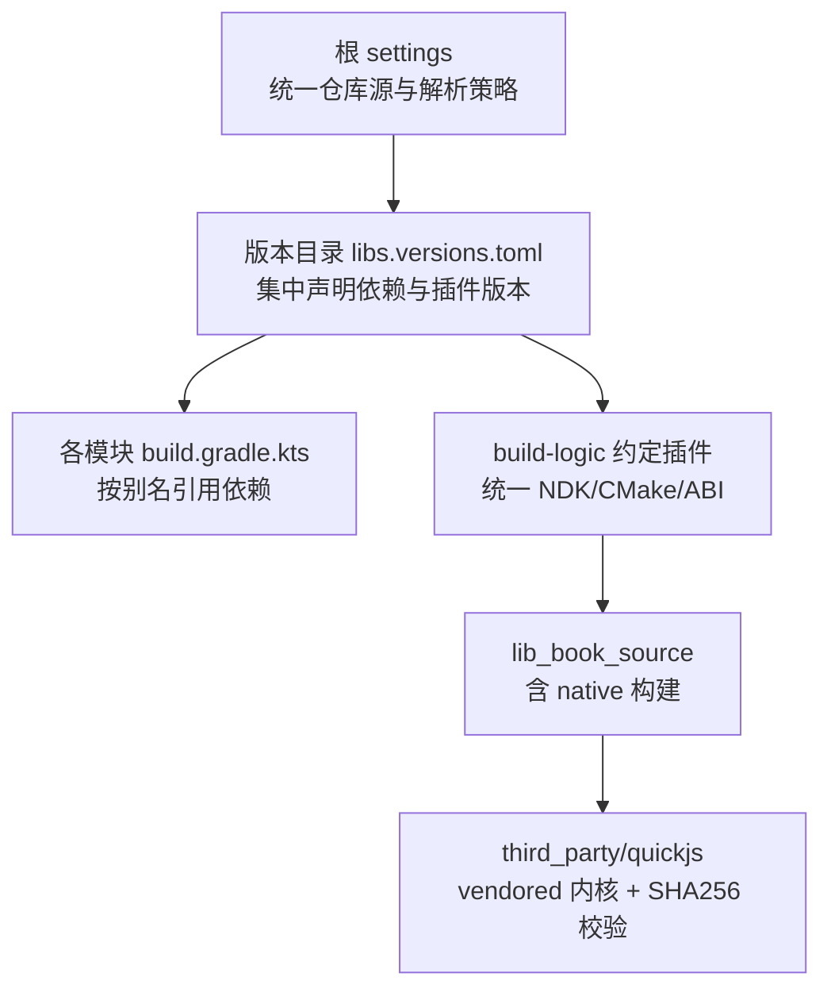
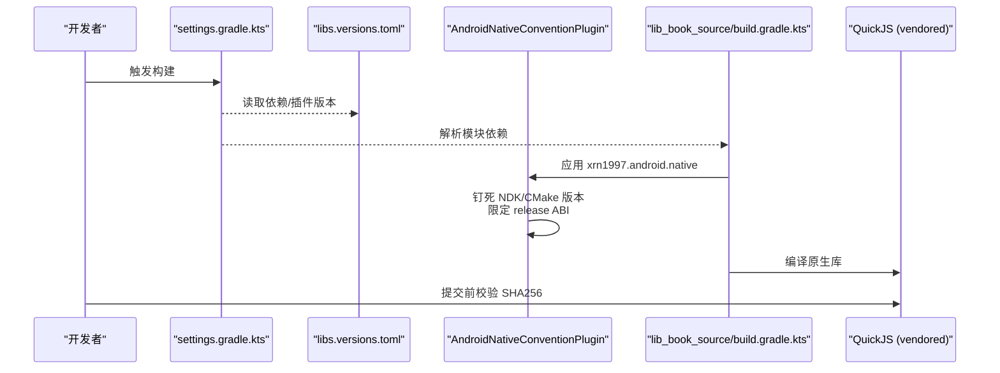
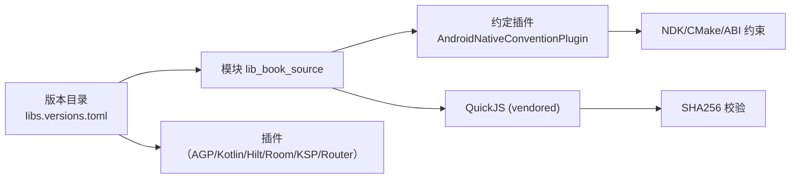

# 依赖安全

<cite>
**本文引用的文件**   
- [gradle/libs.versions.toml](file://gradle/libs.versions.toml)
- [settings.gradle.kts](file://settings.gradle.kts)
- [gradle.properties](file://gradle.properties)
- [build-logic/convention/src/main/kotlin/AndroidNativeConventionPlugin.kt](file://build-logic/convention/src/main/kotlin/AndroidNativeConventionPlugin.kt)
- [lib_book_source/build.gradle.kts](file://lib_book_source/build.gradle.kts)
- [third_party/quickjs/PIN.sha256](file://third_party/quickjs/PIN.sha256)
- [third_party/quickjs/LICENSE](file://third_party/quickjs/LICENSE)
- [third_party/quickjs/VERSION](file://third_party/quickjs/VERSION)
</cite>

## 目录
1. [简介](#简介)
2. [项目结构](#项目结构)
3. [核心组件](#核心组件)
4. [架构总览](#架构总览)
5. [详细组件分析](#详细组件分析)
6. [依赖关系分析](#依赖关系分析)
7. [性能与安全构建注意事项](#性能与安全构建注意事项)
8. [故障排查指南](#故障排查指南)
9. [结论](#结论)
10. [附录](#附录)

## 简介
本文件面向本项目（多模块 Android 应用）的“第三方依赖安全管理”，覆盖版本锁定、漏洞扫描与 CVE 监控、内置源码（vendored QuickJS）安全审查、许可证合规、Gradle 插件与构建脚本安全、依赖更新策略与回滚机制，以及审计工具集成与报告生成。目标是让团队在保持开发效率的同时，确保供应链安全、可复现构建与法律合规。

## 项目结构
本项目采用 Gradle 多模块工程，所有第三方依赖通过统一的版本目录集中管理；原生内核 QuickJS 以 vendored 方式内联到仓库，并通过 SHA256 校验固定来源；构建逻辑通过 build-logic 约定插件统一收敛 ABI、NDK/CMake 版本等安全相关约束。

图表来源
- [settings.gradle.kts:1-43](file://settings.gradle.kts#L1-L43)
- [gradle/libs.versions.toml:1-238](file://gradle/libs.versions.toml#L1-L238)
- [build-logic/convention/src/main/kotlin/AndroidNativeConventionPlugin.kt:6-49](file://build-logic/convention/src/main/kotlin/AndroidNativeConventionPlugin.kt#L6-L49)
- [lib_book_source/build.gradle.kts:14-17](file://lib_book_source/build.gradle.kts#L14-L17)
- [third_party/quickjs/PIN.sha256:1-18](file://third_party/quickjs/PIN.sha256#L1-L18)

章节来源
- [settings.gradle.kts:1-43](file://settings.gradle.kts#L1-L43)
- [gradle/libs.versions.toml:1-238](file://gradle/libs.versions.toml#L1-L238)

## 核心组件
- 依赖版本与插件版本集中化：通过版本目录统一管理，避免散落的硬编码版本导致不一致与升级遗漏。
- 仓库源与解析策略：在根级 settings 中集中声明 Maven 仓库与插件仓库，并启用“禁止在项目内重复声明仓库”的模式，降低被污染或引入非预期制品的风险。
- 原生内核与 ABI 收敛：通过约定插件钉死 NDK/CMake 版本与 release ABI 集合，保证构建产物稳定、可复现且最小暴露面。
- 内置源码校验：vendored QuickJS 附带每个文件的 SHA256，用于验证源码完整性，防范供应链篡改。
- 许可证合规：vendored QuickJS 附带 LICENSE 文本，便于法务与自动化识别与归档。

章节来源
- [gradle/libs.versions.toml:1-238](file://gradle/libs.versions.toml#L1-L238)
- [settings.gradle.kts:1-43](file://settings.gradle.kts#L1-L43)
- [build-logic/convention/src/main/kotlin/AndroidNativeConventionPlugin.kt:6-49](file://build-logic/convention/src/main/kotlin/AndroidNativeConventionPlugin.kt#L6-L49)
- [third_party/quickjs/PIN.sha256:1-18](file://third_party/quickjs/PIN.sha256#L1-L18)
- [third_party/quickjs/LICENSE:1-23](file://third_party/quickjs/LICENSE#L1-L23)

## 架构总览
下图展示了从配置到构建的关键路径：版本目录提供统一版本，约定插件固化安全相关的构建参数，native 模块调用约定插件进行安全构建，vendored 内核由 SHA256 保障完整性。

图表来源
- [settings.gradle.kts:1-43](file://settings.gradle.kts#L1-L43)
- [gradle/libs.versions.toml:1-238](file://gradle/libs.versions.toml#L1-L238)
- [build-logic/convention/src/main/kotlin/AndroidNativeConventionPlugin.kt:6-49](file://build-logic/convention/src/main/kotlin/AndroidNativeConventionPlugin.kt#L6-L49)
- [lib_book_source/build.gradle.kts:14-17](file://lib_book_source/build.gradle.kts#L14-L17)
- [third_party/quickjs/PIN.sha256:1-18](file://third_party/quickjs/PIN.sha256#L1-L18)

## 详细组件分析

### 依赖版本管理与锁定
- 版本目录集中管理：所有第三方库与插件的版本均在版本目录中定义，模块通过别名引用，避免散落版本号导致的漂移与升级遗漏。
- 插件版本集中化：Gradle 插件（如 Android、Kotlin、Hilt、Room、KSP、Router 等）版本同样在版本目录中声明，减少插件版本不一致风险。
- 仓库源集中管控：根 settings 统一声明 Maven/插件仓库，并启用“FAIL_ON_PROJECT_REPOS”模式，阻止子项目私自添加仓库，降低供应链攻击面。

建议实践
- 新增依赖必须走版本目录，禁止在模块内写死版本。
- 升级依赖时仅修改版本目录对应条目，便于审计与回滚。
- 使用 CI 检查变更范围，确保版本变更受控。

章节来源
- [gradle/libs.versions.toml:1-238](file://gradle/libs.versions.toml#L1-L238)
- [settings.gradle.kts:28-43](file://settings.gradle.kts#L28-L43)

### 漏洞扫描与 CVE 监控
现状与建议
- 当前仓库未见内置 SCA（软件成分分析）任务或漏洞扫描脚本。建议在 CI 中集成开源 SCA 工具（例如基于 Gradle 的依赖分析任务），对版本目录中的依赖生成依赖图谱与风险报告，并对已知 CVE 进行告警。
- 建议将“依赖安全门禁”纳入 PR 流程：新增或升级依赖时，自动拉取最新安全情报，阻塞高危漏洞合并。
- 对 vendor 源码（QuickJS）建立独立清单与定期复核流程，确保上游未引入新漏洞。

[本节为通用指导，不直接分析具体文件]

### 内置依赖安全（vendored QuickJS）
- 源码内联与完整性校验：QuickJS 源码位于 third_party/quickjs，并提供 PIN.sha256 记录每个文件的 SHA256。任何替换或升级必须同步更新该文件，并在提交前校验一致性。
- 版本固定：VERSION 记录了内核日期，配合 SHA256 实现“版本 + 完整性”双重固定。
- 许可证归档：LICENSE 已随源码一同入库，便于合规审查与分发归档。

操作要点
- 升级内核时，先备份原 SHA256，再逐文件计算新哈希并更新 PIN.sha256。
- 在本地与 CI 均执行完整性校验，失败即阻断。
- 每次升级需附带安全评估说明（是否包含安全修复、是否引入破坏性变更）。

章节来源
- [third_party/quickjs/PIN.sha256:1-18](file://third_party/quickjs/PIN.sha256#L1-L18)
- [third_party/quickjs/VERSION:1-1](file://third_party/quickjs/VERSION#L1-L1)
- [third_party/quickjs/LICENSE:1-23](file://third_party/quickjs/LICENSE#L1-L23)

### 构建过程安全（Gradle 插件与脚本）
- 约定插件收敛安全基线：AndroidNativeConventionPlugin 固定 NDK 与 CMake 版本，并将 release ABI 限制为最小集（arm64-v8a），减少不必要的攻击面与二进制体积。
- 模块侧仅允许必要放宽：模拟器调试所需的额外 ABI（如 x86_64）仅在 debug 构建类型中放宽，且在模块级别显式声明，便于 diff 审查。
- 仓库源白名单：根级 settings 集中声明可信仓库，并禁止子项目自行添加仓库，有效防止依赖劫持。

建议实践
- 所有原生模块统一通过约定插件接入，避免分散配置造成安全口径不一。
- 对自定义 Gradle 任务与脚本进行代码评审，尤其是涉及下载/执行的步骤，应加入完整性校验与白名单控制。
- 将构建环境（JDK/Gradle）也视为依赖，通过 toolchain 与固定版本提升可复现性。

章节来源
- [build-logic/convention/src/main/kotlin/AndroidNativeConventionPlugin.kt:6-49](file://build-logic/convention/src/main/kotlin/AndroidNativeConventionPlugin.kt#L6-L49)
- [lib_book_source/build.gradle.kts:14-17](file://lib_book_source/build.gradle.kts#L14-L17)
- [settings.gradle.kts:28-43](file://settings.gradle.kts#L28-L43)

### 依赖更新策略与回滚机制
- 更新节奏：建议月度或双周例行检查依赖公告与安全情报，优先处理高危 CVE；常规功能升级结合迭代计划推进。
- 破坏性变更评估：升级前评估 API 变化、行为差异与兼容性影响；必要时拆分为小步 PR，配合回归测试。
- 回滚机制：依赖升级以版本目录为中心，回滚只需恢复至上一稳定版本条目；vendor 源码回滚需同时恢复 PIN.sha256 与 VERSION 指向。
- 灰度与验证：先在 dev 分支运行完整测试与打包验证，再合入主分支；对关键依赖可采用并行分支对比验证。

[本节为通用指导，不直接分析具体文件]

### 依赖审计工具与报告
建议方案
- 依赖图谱分析：通过工具输出依赖树，识别重复/冲突版本与深层传递依赖，定位潜在风险点。
- 漏洞扫描集成：在 CI 中集成 SCA 任务，输出风险报告（CVE、许可证、过时版本等），并以质量门禁形式阻断高风险合并。
- 报告归档与追踪：将每次扫描结果与修复动作归档，形成可追溯的安全基线与趋势报告。

[本节为通用指导，不直接分析具体文件]

## 依赖关系分析

图表来源
- [gradle/libs.versions.toml:1-238](file://gradle/libs.versions.toml#L1-L238)
- [build-logic/convention/src/main/kotlin/AndroidNativeConventionPlugin.kt:6-49](file://build-logic/convention/src/main/kotlin/AndroidNativeConventionPlugin.kt#L6-L49)
- [lib_book_source/build.gradle.kts:14-17](file://lib_book_source/build.gradle.kts#L14-L17)
- [third_party/quickjs/PIN.sha256:1-18](file://third_party/quickjs/PIN.sha256#L1-L18)

章节来源
- [gradle/libs.versions.toml:1-238](file://gradle/libs.versions.toml#L1-L238)
- [settings.gradle.kts:28-43](file://settings.gradle.kts#L28-L43)

## 性能与安全构建注意事项
- 固定工具链：NDK/CMake/Gradle/JDK 版本均应固定或通过工具链自动获取，避免“同一份代码在不同机器产出不同产物”。
- 最小 ABI：release 仅包含必要 ABI，减少产物体积与攻击面；debug 按需放宽，并在模块内显式声明以便审计。
- 仓库白名单：集中声明可信仓库并禁用子项目自定义仓库，防止依赖劫持。
- 增量构建与缓存：合理开启增量特性，缩短反馈时间，但不应牺牲安全性。

章节来源
- [build-logic/convention/src/main/kotlin/AndroidNativeConventionPlugin.kt:6-49](file://build-logic/convention/src/main/kotlin/AndroidNativeConventionPlugin.kt#L6-L49)
- [lib_book_source/build.gradle.kts:14-17](file://lib_book_source/build.gradle.kts#L14-L17)
- [settings.gradle.kts:28-43](file://settings.gradle.kts#L28-L43)

## 故障排查指南
- 依赖解析失败/版本不一致
  - 现象：构建时报找不到依赖或版本冲突。
  - 处理：确认版本目录中是否存在该依赖；检查是否有子项目绕过版本目录；核对仓库源顺序与可达性。
  - 参考
    - [gradle/libs.versions.toml:1-238](file://gradle/libs.versions.toml#L1-L238)
    - [settings.gradle.kts:28-43](file://settings.gradle.kts#L28-L43)

- 原生构建失败/ABI 不匹配
  - 现象：无法加载 .so 或模拟器/真机崩溃。
  - 处理：检查约定插件设置的 NDK/CMake 版本；确认 debug/release ABI 是否符合预期；核对模块是否在 debug 中正确放宽 ABI。
  - 参考
    - [build-logic/convention/src/main/kotlin/AndroidNativeConventionPlugin.kt:6-49](file://build-logic/convention/src/main/kotlin/AndroidNativeConventionPlugin.kt#L6-L49)
    - [lib_book_source/build.gradle.kts:14-17](file://lib_book_source/build.gradle.kts#L14-L17)

- vendored 源码完整性不符
  - 现象：校验失败或运行时异常。
  - 处理：重新计算 third_party/quickjs 下各文件 SHA256 并更新 PIN.sha256；确保 VERSION 与实际内核一致。
  - 参考
    - [third_party/quickjs/PIN.sha256:1-18](file://third_party/quickjs/PIN.sha256#L1-L18)
    - [third_party/quickjs/VERSION:1-1](file://third_party/quickjs/VERSION#L1-L1)

- 许可证合规问题
  - 现象：分发或商用前发现缺失许可证信息。
  - 处理：核对 third_party/quickjs/LICENSE 是否随包分发；对新增 vendor 源码要求一并提交许可证与来源说明。
  - 参考
    - [third_party/quickjs/LICENSE:1-23](file://third_party/quickjs/LICENSE#L1-L23)

章节来源
- [gradle/libs.versions.toml:1-238](file://gradle/libs.versions.toml#L1-L238)
- [settings.gradle.kts:28-43](file://settings.gradle.kts#L28-L43)
- [build-logic/convention/src/main/kotlin/AndroidNativeConventionPlugin.kt:6-49](file://build-logic/convention/src/main/kotlin/AndroidNativeConventionPlugin.kt#L6-L49)
- [lib_book_source/build.gradle.kts:14-17](file://lib_book_source/build.gradle.kts#L14-L17)
- [third_party/quickjs/PIN.sha256:1-18](file://third_party/quickjs/PIN.sha256#L1-L18)
- [third_party/quickjs/VERSION:1-1](file://third_party/quickjs/VERSION#L1-L1)
- [third_party/quickjs/LICENSE:1-23](file://third_party/quickjs/LICENSE#L1-L23)

## 结论
本项目已通过“版本目录集中管理 + 约定插件收敛安全基线 + vendored 源码完整性校验”的组合拳，建立了较完善的依赖安全基础。后续建议引入 SCA 工具与 CI 门禁，完善漏洞扫描、许可证合规与依赖图谱分析，形成闭环的安全治理体系。

[本节为总结性内容，不直接分析具体文件]

## 附录
- 推荐流程
  - 新增依赖：在版本目录声明 → 模块通过别名引用 → 提交前运行依赖分析与安全检查 → 评审通过后合入。
  - 升级依赖：评估兼容性与安全风险 → 拆分 PR → 全量测试与打包验证 → 发布说明记录变更。
  - Vendor 源码：更新源码 → 同步更新 PIN.sha256 与 VERSION → 附加许可证与来源说明 → 本地与 CI 校验通过。

[本节为通用指导，不直接分析具体文件]