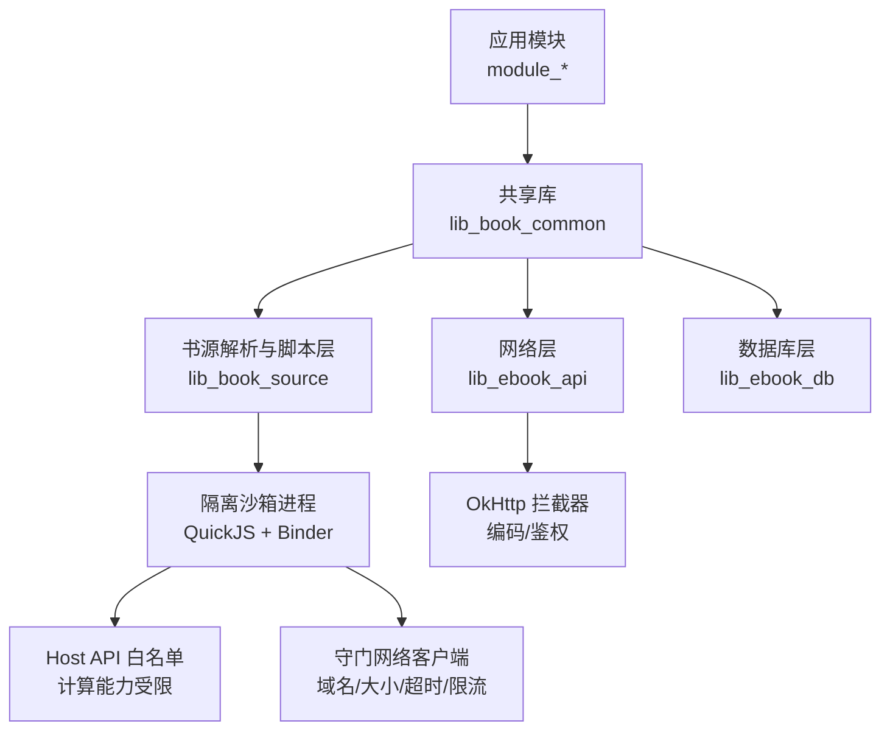
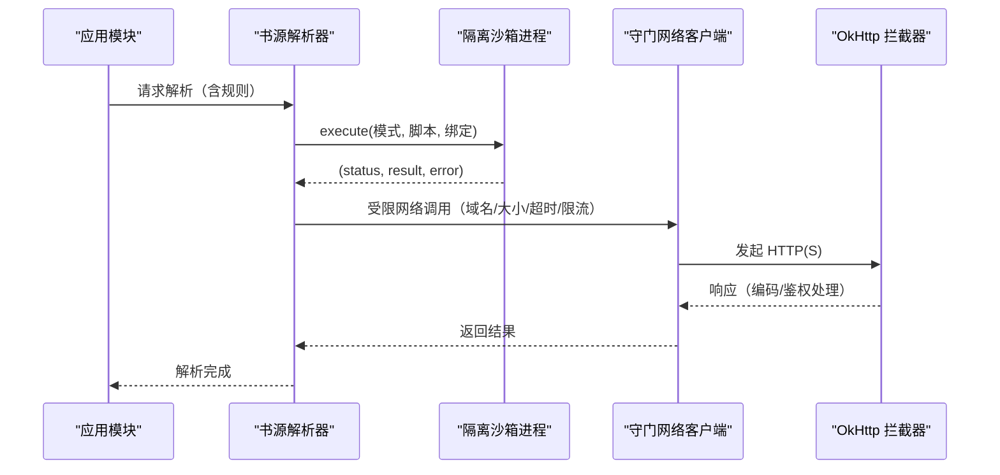
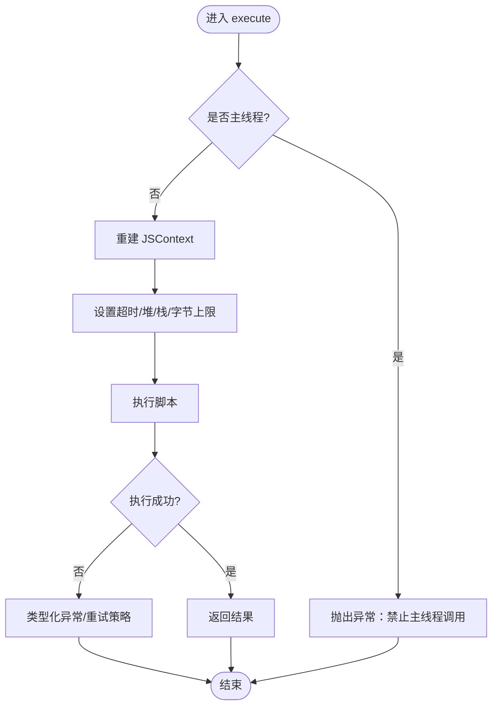

# 安全考虑

<cite>
**本文引用的文件**
- [lib_book_source/src/main/java/com/ebook/source/sandbox/SandboxService.kt](file://lib_book_source/src/main/java/com/ebook/source/sandbox/SandboxService.kt)
- [lib_book_source/src/main/java/com/ebook/source/sandbox/JsSandboxHost.kt](file://lib_book_source/src/main/java/com/ebook/source/sandbox/JsSandboxHost.kt)
- [lib_book_source/src/main/java/com/ebook/source/sandbox/SourceHostAllowlist.kt](file://lib_book_source/src/main/java/com/ebook/source/sandbox/SourceHostAllowlist.kt)
- [lib_book_source/src/main/java/com/ebook/source/sandbox/JsNetworkGuard.kt](file://lib_book_source/src/main/java/com/ebook/source/sandbox/JsNetworkGuard.kt)
- [lib_book_source/src/main/java/com/ebook/source/sandbox/BinderJsChannel.kt](file://lib_book_source/src/main/java/com/ebook/source/sandbox/BinderJsChannel.kt)
- [third_party/third_party/quickjs/quickjs.h](file://third_party/third_party/quickjs/quickjs.h)
- [lib_ebook_api/src/main/java/com/ebook/api/intercepter/EncodingInterceptor.kt](file://lib_ebook_api/src/main/java/com/ebook/api/intercepter/EncodingInterceptor.kt)
- [lib_book_common/src/main/java/com/ebook/common/interceptor/LoginInterceptor.kt](file://lib_book_common/src/main/java/com/ebook/common/interceptor/LoginInterceptor.kt)
- [module_app/src/real/java/com/ebook/di/NetworkModule.kt](file://module_app/src/real/java/com/ebook/di/NetworkModule.kt)
- [module_app/build.gradle.kts](file://module_app/build.gradle.kts)
- [gradle/libs.versions.toml](file://gradle/libs.versions.toml)
- [docs/adr/0028-untrusted-js-sandbox.md](file://docs/adr/0028-untrusted-js-sandbox.md)
- [docs/adr/0011-token-identity-decoupling-token-only-refresh.md](file://docs/adr/0011-token-identity-decoupling-token-only-refresh.md)
- [docs/adr/0014-auth-client-consolidation.md](file://docs/adr/0014-auth-client-consolidation.md)
- [docs/adr/0022-manifest-permission-minimization.md](file://docs/adr/0022-manifest-permission-minimization.md)
- [docs/adr/0024-proguard-rules-overhaul.md](file://docs/adr/0024-proguard-rules-overhaul.md)
- [module_book/consumer-rules.pro](file://module_book/consumer-rules.pro)
- [module_app/proguard-rules.pro](file://module_app/proguard-rules.pro)
- [lib_ebook_api/src/main/java/com/ebook/api/auth/TokenRefresher.kt](file://lib_ebook_api/src/main/java/com/ebook/api/auth/TokenRefresher.kt)
- [lib_book_common/src/main/java/com/ebook/common/domain/UserSessionManager.kt](file://lib_book_common/src/main/java/com/ebook/common/domain/UserSessionManager.kt)
- [lib_book_common/src/main/java/com/ebook/common/domain/AndroidUserSessionManager.kt](file://lib_book_common/src/main/java/com/ebook/common/domain/AndroidUserSessionManager.kt)
- [lib_book_common/src/main/java/com/ebook/common/domain/SessionTokenRefresher.kt](file://lib_book_common/src/main/java/com/ebook/common/domain/SessionTokenRefresher.kt)
</cite>

## 目录
1. [简介](#简介)
2. [项目结构与安全边界](#项目结构与安全边界)
3. [核心安全组件](#核心安全组件)
4. [架构总览](#架构总览)
5. [详细组件分析](#详细组件分析)
6. [依赖与配置安全](#依赖与配置安全)
7. [数据安全策略](#数据安全策略)
8. [网络安全措施](#网络安全措施)
9. [脚本沙箱安全](#脚本沙箱安全)
10. [权限管理](#权限管理)
11. [认证与授权](#认证与授权)
12. [日志安全](#日志安全)
13. [安全审计与渗透测试](#安全审计与渗透测试)
14. [应急响应与恢复](#应急响应与恢复)
15. [结论](#结论)

## 简介
本文件聚焦本项目在数据、网络、脚本执行、权限、认证授权、第三方依赖与日志等方面的安全设计与实践，结合代码与架构决策记录（ADR），给出可操作的落地要点、风险点与改进建议。项目采用多模块架构，书源解析与脚本执行是高风险面；同时通过隔离进程、白名单、最小权限、会话与令牌管理等手段构建纵深防御。

## 项目结构与安全边界
- 业务模块（module_app/module_main/module_book/module_find/module_me/module_login）通过共享库 lib_book_common 暴露能力，解析与脚本层位于 lib_book_source，网络与数据库分别由 lib_ebook_api 与 lib_ebook_db 提供。
- 脚本执行器以独立隔离进程运行，使用自集成 QuickJS 内核与 Binder 协议通信，默认拒绝所有未显式开放的能力，并通过 Host API 白名单限制计算能力，网络外呼经守门客户端控制域名、大小、超时与限流。
- 网络层通过 OkHttp 拦截器处理编码与鉴权，按域区分“纯净客户端”与“应用客户端”，避免用户凭证泄露到第三方站点。

图表来源
- [docs/adr/0028-untrusted-js-sandbox.md:1-66](file://docs/adr/0028-untrusted-js-sandbox.md#L1-L66)
- [lib_book_source/src/main/java/com/ebook/source/sandbox/SandboxService.kt](file://lib_book_source/src/main/java/com/ebook/source/sandbox/SandboxService.kt)
- [lib_ebook_api/src/main/java/com/ebook/api/intercepter/EncodingInterceptor.kt:10-51](file://lib_ebook_api/src/main/java/com/ebook/api/intercepter/EncodingInterceptor.kt#L10-L51)

章节来源
- [docs/adr/0028-untrusted-js-sandbox.md:1-66](file://docs/adr/0028-untrusted-js-sandbox.md#L1-L66)

## 核心安全组件
- 脚本沙箱：隔离进程 + QuickJS 内核 + Binder 协议 + Host API 白名单 + 资源限制（CPU/内存/栈/字节）。
- 网络守卫：域名白名单、私网拒绝、请求/响应大小上限、超时与限流。
- 编码与鉴权拦截器：强制解码、按域附加 Token、会话过期统一处置。
- 权限最小化：清单权限收敛、运行时权限按需申请。
- 混淆与发布加固：Release 开启混淆、保留必要反射面、ABI 精简。

章节来源
- [docs/adr/0028-untrusted-js-sandbox.md:14-43](file://docs/adr/0028-untrusted-js-sandbox.md#L14-L43)
- [lib_ebook_api/src/main/java/com/ebook/api/intercepter/EncodingInterceptor.kt:10-51](file://lib_ebook_api/src/main/java/com/ebook/api/intercepter/EncodingInterceptor.kt#L10-L51)
- [docs/adr/0022-manifest-permission-minimization.md](file://docs/adr/0022-manifest-permission-minimization.md)
- [docs/adr/0024-proguard-rules-overhaul.md](file://docs/adr/0024-proguard-rules-overhaul.md)

## 架构总览
- 主进程不加载引擎，不可信脚本仅在隔离进程执行；Binder 连接失败或校验不通过时，主进程收到“不可用”而非静默降级。
- 脚本侧只能访问白名单能力；网络类一律经主进程守门代理，禁止直接访问私网地址。
- 网络层按域拆分客户端：应用接口携带 Token，第三方书源走纯净客户端，永不附带凭证。

图表来源
- [docs/adr/0028-untrusted-js-sandbox.md:22-36](file://docs/adr/0028-untrusted-js-sandbox.md#L22-L36)
- [lib_book_source/src/main/java/com/ebook/source/sandbox/JsNetworkGuard.kt](file://lib_book_source/src/main/java/com/ebook/source/sandbox/JsNetworkGuard.kt)
- [lib_ebook_api/src/main/java/com/ebook/api/intercepter/EncodingInterceptor.kt:10-51](file://lib_ebook_api/src/main/java/com/ebook/api/intercepter/EncodingInterceptor.kt#L10-L51)

## 详细组件分析

### 脚本沙箱执行器（隔离进程 + QuickJS）
- 使用 isolatedProcess 零权限进程运行 QuickJS，deny-by-default；仅注册白名单 Host API（计算类）与受限网络代理。
- 资源限制四件套：wall-clock 超时、堆上限、JS 栈上限、请求/响应大小上限；超限销毁 runtime 或杀进程，主进程断连后自动重启。
- 每次 execute 重建 JSContext，任务间状态隔离；单帧串行防止并发导致限额失效。
- 主线程守卫：绝不在主线程调沙箱，避免回调死锁。

图表来源
- [docs/adr/0028-untrusted-js-sandbox.md:31-37](file://docs/adr/0028-untrusted-js-sandbox.md#L31-L37)
- [lib_book_source/src/main/java/com/ebook/source/sandbox/SandboxService.kt](file://lib_book_source/src/main/java/com/ebook/source/sandbox/SandboxService.kt)

章节来源
- [docs/adr/0028-untrusted-js-sandbox.md:14-43](file://docs/adr/0028-untrusted-js-sandbox.md#L14-L43)
- [lib_book_source/src/main/java/com/ebook/source/sandbox/SandboxService.kt](file://lib_book_source/src/main/java/com/ebook/source/sandbox/SandboxService.kt)

### 网络守卫与域名白名单
- 脚本网络外呼必须经守门客户端：仅允许 http(s)、拒绝私网地址、限制大小/超时/限流，按源导出可解析 host 白名单。
- 应用接口走带鉴权的客户端；第三方书源走纯净客户端，不附带 token。

章节来源
- [docs/adr/0028-untrusted-js-sandbox.md:36-37](file://docs/adr/0028-untrusted-js-sandbox.md#L36-L37)
- [lib_book_source/src/main/java/com/ebook/source/sandbox/SourceHostAllowlist.kt](file://lib_book_source/src/main/java/com/ebook/source/sandbox/SourceHostAllowlist.kt)
- [lib_book_source/src/main/java/com/ebook/source/sandbox/JsNetworkGuard.kt](file://lib_book_source/src/main/java/com/ebook/source/sandbox/JsNetworkGuard.kt)

### 编码拦截器
- 针对第三方站点的 Content-Type 缺 charset 或错误声明，强制改写为指定编码并流式透传，避免全量缓冲与乱码。

章节来源
- [lib_ebook_api/src/main/java/com/ebook/api/intercepter/EncodingInterceptor.kt:10-51](file://lib_ebook_api/src/main/java/com/ebook/api/intercepter/EncodingInterceptor.kt#L10-L51)

### 登录拦截器（路由级鉴权）
- 在跨模块跳转时检查登录态，需要登录但未登录则重定向至登录页，减少目标页重复校验。

章节来源
- [lib_book_common/src/main/java/com/ebook/common/interceptor/LoginInterceptor.kt:10-42](file://lib_book_common/src/main/java/com/ebook/common/interceptor/LoginInterceptor.kt#L10-L42)

## 依赖与配置安全
- 版本目录统一管理依赖版本，降低供应链风险。
- Release 构建启用混淆，仅保留必要的反射面；ABI 精简（release 仅 arm64-v8a），debug 单独放宽 x86_64。
- 原生模块构建锁定 NDK/CMake 版本，避免不可复现问题。

章节来源
- [gradle/libs.versions.toml](file://gradle/libs.versions.toml)
- [docs/adr/0024-proguard-rules-overhaul.md](file://docs/adr/0024-proguard-rules-overhaul.md)
- [module_book/consumer-rules.pro](file://module_book/consumer-rules.pro)
- [module_app/proguard-rules.pro](file://module_app/proguard-rules.pro)

## 数据安全策略
- 敏感数据存储：
  - 密码不落盘，会话持久化由 UserSessionManager 负责；access token 驻内存并由拦截器按域附加。
  - 本地缓存与数据库按实体设计存储，避免明文敏感信息落库。
- 加密传输：
  - 网络层通过拦截器处理编码与鉴权；生产环境应强制 HTTPS（需结合服务器配置与证书校验策略）。
- 输入验证：
  - 脚本执行前进行资源限制与白名单校验；URL 白名单与私网拒绝在网络守卫层实现。
- SQL 注入防护：
  - 使用 Room DAO 与参数化查询，避免拼接 SQL；遵循迁移链与 schema 演进规范。

章节来源
- [docs/adr/0011-token-identity-decoupling-token-only-refresh.md](file://docs/adr/0011-token-identity-decoupling-token-only-refresh.md)
- [lib_book_common/src/main/java/com/ebook/common/domain/UserSessionManager.kt](file://lib_book_common/src/main/java/com/ebook/common/domain/UserSessionManager.kt)
- [lib_book_common/src/main/java/com/ebook/common/domain/AndroidUserSessionManager.kt](file://lib_book_common/src/main/java/com/ebook/common/domain/AndroidUserSessionManager.kt)

## 网络安全措施
- HTTPS 与证书校验：
  - 建议服务端强制 HTTPS；客户端应在网络客户端配置中启用严格证书校验（Pin 或信任链校验），避免中间人攻击。
- CORS 与 XSS：
  - 前端 Compose 界面渲染外部内容时需做内容清洗与转义；对富文本/HTML 渲染启用安全模式，禁用危险 API。
- 请求/响应安全：
  - 编码拦截器确保正确解码；鉴权拦截器按域附加 Token，第三方站点走纯净客户端。

章节来源
- [lib_ebook_api/src/main/java/com/ebook/api/intercepter/EncodingInterceptor.kt:10-51](file://lib_ebook_api/src/main/java/com/ebook/api/intercepter/EncodingInterceptor.kt#L10-L51)
- [docs/adr/0014-auth-client-consolidation.md](file://docs/adr/0014-auth-client-consolidation.md)

## 脚本沙箱安全
- 执行环境隔离：
  - isolatedProcess 零权限进程；进程内自检确认隔离，否则拒绝启动。
  - 主进程不加载引擎，崩溃不传染，解析失败按失败处置。
- 权限控制与资源限制：
  - Host API 白名单；阻塞原语关闭；CPU/内存/栈/字节上限；单帧串行。
- 恶意代码检测：
  - 通过超时、堆/栈上限、字节上限与回调深度限制抑制 DoS；无法安全恢复时杀进程。

章节来源
- [docs/adr/0028-untrusted-js-sandbox.md:14-43](file://docs/adr/0028-untrusted-js-sandbox.md#L14-L43)
- [lib_book_source/src/main/java/com/ebook/source/sandbox/SandboxService.kt](file://lib_book_source/src/main/java/com/ebook/source/sandbox/SandboxService.kt)
- [lib_book_source/src/main/java/com/ebook/source/sandbox/JsSandboxHost.kt](file://lib_book_source/src/main/java/com/ebook/source/sandbox/JsSandboxHost.kt)

## 权限管理
- 最小权限原则：
  - 清单权限收敛，仅保留必要项；运行时权限按需申请（如本地网络访问）。
- 动态检查：
  - 涉及敏感能力（网络、存储、前台服务）时进行运行时检查与提示。

章节来源
- [docs/adr/0022-manifest-permission-minimization.md](file://docs/adr/0022-manifest-permission-minimization.md)

## 认证与授权
- Token 管理：
  - access token 驻内存，由拦截器按域附加；会话过期由网络层统一收口，触发清会话与跳转登录。
- 会话安全：
  - UserSessionManager 维护会话镜像，清理会话时同步更新多处状态。
- CSRF 防护：
  - 通过 Token 与同源策略、服务端防护共同抵御；客户端侧避免在第三方站点附加凭证。

章节来源
- [docs/adr/0011-token-identity-decoupling-token-only-refresh.md](file://docs/adr/0011-token-identity-decoupling-token-only-refresh.md)
- [lib_book_common/src/main/java/com/ebook/common/domain/UserSessionManager.kt](file://lib_book_common/src/main/java/com/ebook/common/domain/UserSessionManager.kt)
- [lib_book_common/src/main/java/com/ebook/common/domain/SessionTokenRefresher.kt](file://lib_book_common/src/main/java/com/ebook/common/domain/SessionTokenRefresher.kt)
- [lib_ebook_api/src/main/java/com/ebook/api/auth/TokenRefresher.kt](file://lib_ebook_api/src/main/java/com/ebook/api/auth/TokenRefresher.kt)

## 日志安全
- 敏感信息脱敏：
  - 日志框架统一输出，避免打印 Token、密码等敏感字段。
- 日志级别控制：
  - debug/release 自动裁剪，生产环境降低日志量。
- 日志存储安全：
  - 日志写入受控目录，避免被其他应用读取；必要时加密或滚动清理。

[本节为通用指导，不直接分析具体文件]

## 安全审计与渗透测试
- 安全代码审查：
  - 重点关注脚本沙箱、网络守卫、鉴权拦截器、权限声明与依赖版本。
- 漏洞扫描：
  - 使用依赖扫描工具检查第三方库漏洞；定期升级关键依赖。
- 安全测试工具：
  - 对网络层进行抓包与篡改测试；对脚本执行器进行资源耗尽与越界测试。

[本节为通用指导，不直接分析具体文件]

## 应急响应与恢复
- 事件分类：
  - 脚本执行异常、网络请求失败、会话过期、权限不足等。
- 处置流程：
  - 快速定位（日志/监控）、隔离影响（禁用相关源/功能）、修复与回滚、复盘与加固。
- 恢复策略：
  - 从备份恢复数据、重置会话、重新装配执行器；必要时降级到非脚本解析路径。

[本节为通用指导，不直接分析具体文件]

## 结论
本项目通过隔离进程、白名单、最小权限、会话与令牌管理等构建多层安全防线。建议在以下方面持续强化：
- 强化 HTTPS 与证书校验策略，确保传输安全。
- 完善前端内容渲染的安全模式，防范 XSS。
- 持续审计脚本执行器的能力面与资源限制，及时修补潜在逃逸路径。
- 定期扫描依赖漏洞，保持依赖版本最新且合规。
- 建立完善的日志脱敏与监控告警机制，提升事件响应效率。